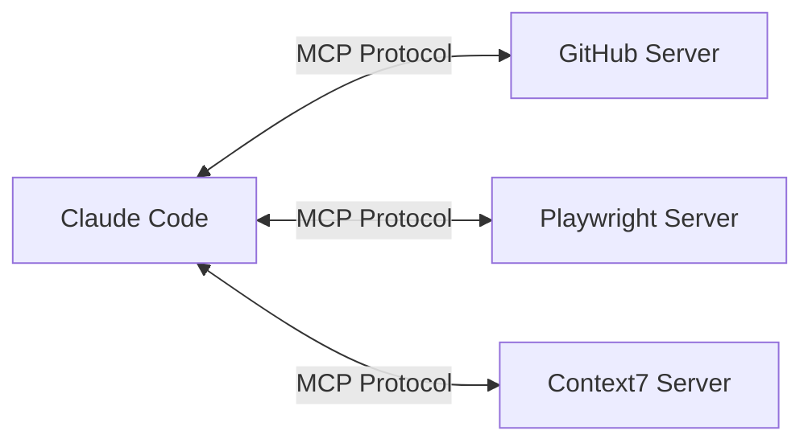

# 1. 개요

Claude Code는 Anthropic에서 만든 AI 기반 CLI 도구로, 터미널에서 코드를 읽고 수정하며 다양한 개발 작업을 수행할 수 있다. 기본 기능만으로도 강력하지만, **MCP(Model Context Protocol) 서버**를 연결하면 GitHub PR 생성, 브라우저 테스트, DB 쿼리, 최신 문서 검색 등을 자연어 한 줄로 처리할 수 있다.

이 글에서는 MCP의 기본 개념부터 Claude Code에서의 설정 방법, 그리고 개발자에게 실질적으로 유용한 MCP 서버를 카테고리별로 추천한다.

# 2. MCP란 무엇인가

## 2.1 MCP 개요

MCP(Model Context Protocol)는 Anthropic이 개발한 개방형 표준으로, AI 모델과 외부 도구/데이터/서비스를 표준화된 인터페이스로 연결한다. 흔히 **"AI의 USB-C"**로 비유되는데, USB-C가 다양한 기기를 하나의 포트로 연결하듯 MCP는 다양한 외부 서비스를 하나의 프로토콜로 AI에 연결한다.



## 2.2 핵심 구성요소

MCP는 세 가지 핵심 요소로 구성된다.

| 구성요소 | 설명 | 예시 |
|---------|------|------|
| **Tools** | AI가 호출할 수 있는 함수 | PR 생성, 파일 검색, SQL 쿼리 실행 |
| **Resources** | AI가 읽을 수 있는 데이터 | 파일 내용, DB 스키마, API 응답 |
| **Prompts** | 미리 정의된 프롬프트 템플릿 | 코드 리뷰 템플릿, 커밋 메시지 생성 |

## 2.3 Claude Code에서 MCP가 왜 강력한가

Claude Code는 이미 파일 읽기/쓰기, Bash 실행, 코드 검색 등의 기본 도구를 갖추고 있다. 여기에 MCP 서버를 추가하면 **Claude Code의 능력이 외부 서비스로 확장**된다.

- **GitHub MCP** 연결 시: "이 변경 사항으로 PR 만들어줘" 한 마디로 PR 생성
- **Playwright MCP** 연결 시: "로그인 페이지 스크린샷 찍어줘" 한 마디로 브라우저 자동화
- **Context7 MCP** 연결 시: "React 19의 useActionState 사용법 알려줘" 한 마디로 최신 문서 참조

# 3. Claude Code에서 MCP 서버 설정하기

## 3.1 Transport 유형

MCP 서버는 두 가지 방식으로 Claude Code와 통신한다.

| Transport | 설명 | 사용 시점 |
|-----------|------|----------|
| **HTTP** | 원격 서버에 HTTP로 연결 | 클라우드 기반 서비스 (GitHub, Context7 등) |
| **stdio** | 로컬 프로세스를 실행하여 표준 입출력으로 통신 | 로컬에서 실행되는 서버 (Playwright, MySQL 등) |

> SSE(Server-Sent Events) 방식도 있지만 deprecated 되었으므로 HTTP를 사용하는 것을 권장한다.

## 3.2 CLI로 설정하기

Claude Code에서 MCP 서버를 추가하는 가장 간단한 방법은 `claude mcp add` 명령어이다.

```bash
# HTTP transport (원격 서버)
claude mcp add --transport http <name> <url>

# stdio transport (로컬 프로세스)
claude mcp add --transport stdio <name> -- <command> [args...]

# 환경 변수 포함
claude mcp add --transport stdio --env API_KEY=your_key <name> -- npx -y @package/name

# JSON 형식으로 직접 설정
claude mcp add-json <name> '<json_config>'

# Claude Desktop 설정 가져오기
claude mcp add-from-claude-desktop
```

## 3.3 설정 파일 스코프

`claude mcp add` 명령어는 기본적으로 **Local 스코프**에 저장된다. 즉, 프로젝트 파일(`.mcp.json`)이 생성되는 것이 아니라 `~/.claude.json`에 저장된다. `--scope` 옵션으로 저장 위치를 변경할 수 있다.

```bash
# Local (기본값) - ~/.claude.json에 저장, 현재 프로젝트에서만 사용
claude mcp add --transport http github https://api.githubcopilot.com/mcp/

# Project - .mcp.json 파일 생성/수정, 팀과 공유 가능
claude mcp add --scope project --transport http github https://api.githubcopilot.com/mcp/

# User - ~/.claude.json에 저장, 모든 프로젝트에서 사용
claude mcp add --scope user --transport http github https://api.githubcopilot.com/mcp/
```

MCP 설정은 네 가지 스코프로 관리되며, 우선순위는 Local > Project > User 순이다.

| 스코프 | 위치 | 용도 |
|--------|------|------|
| **Local** (기본값) | `~/.claude.json` (프로젝트 경로 하위) | 개인 전용, 현재 프로젝트만 |
| **Project** | `.mcp.json` (프로젝트 루트) | 팀과 공유 (버전 관리) |
| **User** | `~/.claude.json` | 모든 프로젝트에서 사용 |
| **Managed** (기업) | `/Library/Application Support/ClaudeCode/managed-mcp.json` | IT 중앙 관리 |

팀 프로젝트에서는 `--scope project`로 추가하거나 직접 `.mcp.json`을 작성하여 Git에 커밋하면 팀원 모두가 동일한 MCP 환경을 사용할 수 있다.

## 3.4 .mcp.json 설정 예시

프로젝트 루트에 `.mcp.json` 파일을 생성하여 MCP 서버를 선언적으로 관리할 수 있다.

```json
{
  "mcpServers": {
    "github": {
      "type": "http",
      "url": "https://api.githubcopilot.com/mcp/"
    },
    "context7": {
      "type": "http",
      "url": "https://mcp.context7.com/mcp"
    },
    "playwright": {
      "command": "npx",
      "args": ["@playwright/mcp@latest"]
    },
    "nanobanana": {
      "command": "uvx",
      "args": ["nanobanana-mcp-server@latest"],
      "env": {
        "GEMINI_API_KEY": "${NANOBANANA_MCP_GOOGLE_API_KEY}"
      }
    }
  }
}
```

> 환경 변수는 `${VAR}` 또는 `${VAR:-default}` 문법으로 참조할 수 있다. API 키 같은 시크릿은 반드시 환경 변수로 관리하고, `.mcp.json`에 직접 포함하지 않는다.

## 3.5 서버 관리 명령어

```bash
claude mcp list           # 설정된 서버 목록 조회
claude mcp get <name>     # 특정 서버 상세 정보
claude mcp remove <name>  # 서버 제거
```

Claude Code 내에서는 `/mcp` 명령으로 현재 연결된 서버 상태를 확인할 수 있다.

# 4. 개발 필수 MCP 서버 추천

## 4.1 버전 관리 & 코드 협업

### 4.1.1 GitHub MCP Server

개발 워크플로우에서 가장 필수적인 MCP 서버이다. Claude Code가 직접 GitHub와 상호작용하여 PR 생성, 코드 리뷰, 이슈 관리를 수행할 수 있다.

| 항목 | 내용 |
|------|------|
| GitHub | [github/github-mcp-server](https://github.com/github/github-mcp-server) |
| Transport | HTTP |

**설정 방법:**

```bash
claude mcp add --transport http github https://api.githubcopilot.com/mcp/
```

`.mcp.json`으로 설정하는 경우:

```json
{
  "mcpServers": {
    "github": {
      "type": "http",
      "url": "https://api.githubcopilot.com/mcp/"
    }
  }
}
```

**주요 기능:**
- 레포지토리 관리 (파일 조회, 브랜치 생성)
- Pull Request 생성, 리뷰, 머지
- Issue 생성, 검색, 코멘트
- 코드 검색 (조직/레포 단위)
- CI/CD 워크플로우 상태 확인

**활용 예시:**

```
> 현재 변경 사항으로 PR 만들어줘. 리뷰어는 kenshin579로 지정해줘
> #42 이슈에 "수정 완료" 코멘트 달아줘
> 이 레포에서 "deprecated" 키워드가 포함된 코드 검색해줘
```

### 4.1.2 GitHub Enterprise MCP Server

사내 GitHub Enterprise Server(GHES)를 사용하는 기업 환경이라면 동일한 GitHub MCP 서버를 Enterprise 설정으로 사용할 수 있다.

| 항목 | 내용 |
|------|------|
| GitHub | [github/github-mcp-server](https://github.com/github/github-mcp-server) (동일 서버) |
| Transport | stdio |

**설정 방법:**

```bash
claude mcp add --transport stdio github-enterprise \
  -- docker run -i --rm \
  -e GITHUB_PERSONAL_ACCESS_TOKEN \
  -e GITHUB_HOST=github.your-company.com \
  ghcr.io/github/github-mcp-server
```

`.mcp.json`으로 설정하는 경우:

```json
{
  "mcpServers": {
    "github-enterprise": {
      "command": "docker",
      "args": ["run", "-i", "--rm",
        "-e", "GITHUB_PERSONAL_ACCESS_TOKEN",
        "-e", "GITHUB_HOST",
        "ghcr.io/github/github-mcp-server"],
      "env": {
        "GITHUB_PERSONAL_ACCESS_TOKEN": "${GITHUB_ENTERPRISE_PAT}",
        "GITHUB_HOST": "github.your-company.com"
      }
    }
  }
}
```

> `GITHUB_HOST` 환경 변수로 Enterprise Server URL을 지정하고, PAT(Personal Access Token)로 인증한다. Public GitHub과 Enterprise를 동시에 사용하려면 서로 다른 이름으로 두 서버를 등록하면 된다.

## 4.2 브라우저 자동화 & 테스트

### 4.2.1 Playwright MCP Server (Microsoft 공식)

Microsoft에서 공식 제공하는 브라우저 자동화 MCP 서버이다. 스크린샷 기반이 아닌 **접근성 트리(Accessibility Tree) 기반**으로 웹 페이지를 분석하므로 더 정확하고 효율적이다.

| 항목 | 내용 |
|------|------|
| GitHub | [microsoft/playwright-mcp](https://github.com/microsoft/playwright-mcp) |
| Transport | stdio |

**설정 방법:**

```bash
claude mcp add playwright -- npx @playwright/mcp@latest
```

`.mcp.json`으로 설정하는 경우:

```json
{
  "mcpServers": {
    "playwright": {
      "command": "npx",
      "args": ["@playwright/mcp@latest"]
    }
  }
}
```

**주요 기능:**
- 웹 페이지 내비게이션, 클릭, 폼 입력
- 스크린샷 캡처
- 테스트 코드 자동 생성 (Codegen 모드)
- iframe 내부 요소 조작
- PDF 저장, 콘솔 로그 확인

**활용 예시:**

```
> http://localhost:3000 접속해서 로그인 페이지 스크린샷 찍어줘
> 회원가입 폼에 테스트 데이터 입력하고 제출해줘
> 현재 페이지의 접근성 문제 확인해줘
```

## 4.3 문서 & 라이브러리 참조

### 4.3.1 Context7 MCP Server

AI 모델의 학습 데이터가 오래되어 최신 라이브러리 문서와 맞지 않는 문제를 해결한다. **사용 중인 라이브러리의 정확한 최신 문서**를 실시간으로 가져와서 응답에 반영한다.

| 항목 | 내용 |
|------|------|
| GitHub | [upstash/context7](https://github.com/upstash/context7) |
| Transport | HTTP |

**설정 방법:**

```bash
claude mcp add --transport http context7 https://mcp.context7.com/mcp
```

`.mcp.json`으로 설정하는 경우:

```json
{
  "mcpServers": {
    "context7": {
      "type": "http",
      "url": "https://mcp.context7.com/mcp"
    }
  }
}
```

**주요 기능:**
- 라이브러리/프레임워크 최신 문서 조회
- 정확한 버전별 API 레퍼런스 제공
- 코드 예제 포함

**활용 예시:**

```
> use context7. React 19의 useActionState 사용법 알려줘
> use context7. Drizzle ORM에서 relation 설정하는 방법 알려줘
> use context7. Pion WebRTC의 DataChannel 예제 보여줘
```

> `use context7`을 프롬프트에 포함하면 Context7이 자동으로 최신 문서를 검색하여 응답에 활용한다.

## 4.4 데이터베이스

### 4.4.1 Supabase MCP Server

Supabase를 백엔드로 사용하는 프로젝트라면 필수적인 MCP 서버이다. 20개 이상의 도구를 제공하여 테이블 설계부터 마이그레이션, 쿼리, 타입 생성까지 한 곳에서 처리한다.

| 항목 | 내용 |
|------|------|
| Docs | [supabase.com/docs/guides/ai/mcp](https://supabase.com/docs/guides/ai/mcp) |
| Transport | stdio |

**설정 방법:**

```bash
claude mcp add supabase \
  -- npx -y @anthropic-ai/mcp-remote@latest https://mcp.supabase.com
```

`.mcp.json`으로 설정하는 경우:

```json
{
  "mcpServers": {
    "supabase": {
      "command": "npx",
      "args": ["-y", "@anthropic-ai/mcp-remote@latest", "https://mcp.supabase.com"]
    }
  }
}
```

**주요 기능:**
- 테이블 설계 및 마이그레이션 생성
- SQL 쿼리 실행
- TypeScript 타입 자동 생성
- Edge Function 관리
- 프로젝트 설정 조회/수정

### 4.4.2 MySQL MCP Server

MySQL 데이터베이스에 자연어로 쿼리하고 스키마를 탐색할 수 있는 MCP 서버이다. 읽기 전용 모드를 지원하여 안전하게 데이터를 탐색할 수 있다.

| 항목 | 내용 |
|------|------|
| GitHub | [benborla/mcp-server-mysql](https://github.com/benborla/mcp-server-mysql) |
| Transport | stdio |

**설정 방법:**

```bash
claude mcp add --transport stdio \
  --env MYSQL_HOST=localhost \
  --env MYSQL_USER=root \
  --env MYSQL_PASSWORD=password \
  --env MYSQL_DATABASE=mydb \
  mysql -- npx -y @benborla29/mcp-server-mysql
```

`.mcp.json`으로 설정하는 경우:

```json
{
  "mcpServers": {
    "mysql": {
      "command": "npx",
      "args": ["-y", "@benborla29/mcp-server-mysql"],
      "env": {
        "MYSQL_HOST": "localhost",
        "MYSQL_USER": "root",
        "MYSQL_PASSWORD": "${MYSQL_PASSWORD}",
        "MYSQL_DATABASE": "mydb"
      }
    }
  }
}
```

**주요 기능:**
- 자연어로 SQL 쿼리 실행
- 테이블 스키마 및 구조 분석
- 읽기 전용 모드 지원

**활용 예시:**

```
> users 테이블의 스키마 보여줘
> 최근 7일간 가입한 사용자 수 조회해줘
> orders 테이블과 products 테이블의 관계를 분석해줘
```

## 4.5 검색 & 리서치

### 4.5.1 Brave Search MCP Server

프라이버시를 중시하는 웹 검색 엔진 Brave Search를 Claude Code에서 사용할 수 있게 해준다. Claude Code의 내장 WebSearch 도구 외에 추가적인 검색이 필요할 때 유용하다.

| 항목 | 내용 |
|------|------|
| GitHub | [brave/brave-search-mcp-server](https://github.com/brave/brave-search-mcp-server) |
| Transport | stdio |

**설정 방법:**

```bash
claude mcp add --transport stdio \
  --env BRAVE_API_KEY=your_api_key \
  brave-search -- npx -y @anthropic-ai/mcp-remote@latest https://mcp.bravesearch.com/sse
```

`.mcp.json`으로 설정하는 경우:

```json
{
  "mcpServers": {
    "brave-search": {
      "command": "npx",
      "args": ["-y", "@anthropic-ai/mcp-remote@latest", "https://mcp.bravesearch.com/sse"],
      "env": {
        "BRAVE_API_KEY": "${BRAVE_API_KEY}"
      }
    }
  }
}
```

> Brave Search API 키는 [brave.com/search/api](https://brave.com/search/api/)에서 무료로 발급받을 수 있다.

## 4.6 지식 관리 & 문서화

### 4.6.1 Notion MCP Server

Notion에 저장된 프로젝트 문서, 회의록, 기술 스펙을 Claude Code에서 직접 조회하고 편집할 수 있다. 개발 컨텍스트와 문서를 연결하여 생산성을 높인다.

| 항목 | 내용 |
|------|------|
| GitHub | [makenotion/notion-mcp-server](https://github.com/makenotion/notion-mcp-server) |
| Transport | stdio |

**설정 방법:**

```bash
claude mcp add --transport stdio notion \
  -- npx -y @notionhq/notion-mcp-server
```

> Notion Internal Integration Token이 필요하다. [Notion Developers](https://developers.notion.com/)에서 통합(Integration)을 생성한 후, 접근할 페이지/데이터베이스에 연결해야 한다.

**주요 기능:**
- 페이지/데이터베이스 읽기, 쓰기
- 페이지 검색
- 코멘트 관리
- 블록 단위 콘텐츠 편집

**활용 예시:**

```
> Notion에서 "API 설계 문서" 페이지 찾아서 내용 보여줘
> 오늘 회의록 페이지 만들고 참석자 목록 추가해줘
> "기술 부채" 데이터베이스에 새 항목 추가해줘
```

## 4.7 이미지 생성

### 4.7.1 NanoBanana MCP Server

Google Gemini 모델을 활용하여 AI 이미지를 생성하고 편집할 수 있는 MCP 서버이다. 블로그 썸네일, 다이어그램, 프로토타입 이미지 등을 자연어로 생성할 수 있다.

| 항목 | 내용 |
|------|------|
| GitHub | [YCSE/nanobanana-mcp](https://github.com/YCSE/nanobanana-mcp) |
| Transport | stdio |

**설정 방법:**

`.mcp.json`에 다음과 같이 설정한다.

```json
{
  "mcpServers": {
    "nanobanana": {
      "command": "uvx",
      "args": ["nanobanana-mcp-server@latest"],
      "env": {
        "GEMINI_API_KEY": "${NANOBANANA_MCP_GOOGLE_API_KEY}"
      }
    }
  }
}
```

> Google AI Studio에서 Gemini API 키를 발급받아 환경 변수로 설정해야 한다.

**활용 예시:**

```
> MCP 서버 연결 구조를 나타내는 아키텍처 다이어그램 이미지 생성해줘
> 블로그 썸네일 이미지 만들어줘. 테마는 AI 코딩 도구
```

## 4.8 고급 추론

### 4.8.1 Sequential Thinking MCP Server

복잡한 작업을 논리적 단계로 분해하여 체계적으로 사고하도록 돕는 MCP 서버이다. 아키텍처 설계, 다단계 계획 수립, 복잡한 버그 분석 등에 활용된다.

| 항목 | 내용 |
|------|------|
| Package | `@modelcontextprotocol/server-sequential-thinking` |
| Transport | stdio |

**설정 방법:**

```bash
claude mcp add sequential-thinking \
  -- npx -y @modelcontextprotocol/server-sequential-thinking
```

`.mcp.json`으로 설정하는 경우:

```json
{
  "mcpServers": {
    "sequential-thinking": {
      "command": "npx",
      "args": ["-y", "@modelcontextprotocol/server-sequential-thinking"]
    }
  }
}
```

**활용 예시:**

```
> 이 모노레포를 마이크로서비스로 분리하는 계획을 단계별로 세워줘
> 이 성능 병목의 근본 원인을 분석해줘
```

# 5. MCP 서버 찾는 곳

필요한 MCP 서버를 찾을 수 있는 주요 레지스트리 및 마켓플레이스를 정리한다.

| 레지스트리 | URL | 설명 |
|-----------|-----|------|
| **Official MCP Registry** | [registry.modelcontextprotocol.io](https://registry.modelcontextprotocol.io/) | Anthropic 공식 레지스트리 |
| **Smithery** | [smithery.ai](https://smithery.ai) | 2,200+ 서버, 자동 설치 가이드 |
| **MCP.so** | [mcp.so](https://mcp.so) | 3,000+ 서버, 품질 등급 |
| **PulseMCP** | [pulsemcp.com/servers](https://www.pulsemcp.com/servers) | 8,230+ 서버, 매일 업데이트 |
| **awesome-mcp-servers** | [github.com/punkpeye/awesome-mcp-servers](https://github.com/punkpeye/awesome-mcp-servers) | 큐레이션된 GitHub 목록 |

# 6. 마무리

MCP는 Claude Code의 능력을 외부 서비스로 확장하는 강력한 메커니즘이다. 처음에는 **GitHub + Context7 + Playwright** 3종 세트로 시작하고, 필요에 따라 DB, 검색, 문서 관리 서버를 추가하는 것을 권장한다.

MCP 생태계는 빠르게 성장하고 있어 새로운 서버가 계속 등장하고 있다. [Official MCP Registry](https://registry.modelcontextprotocol.io/)와 [awesome-mcp-servers](https://github.com/punkpeye/awesome-mcp-servers)를 주기적으로 확인하면 유용한 서버를 발견할 수 있다.

# 7. 참고 자료

- [Claude Code MCP 공식 문서](https://docs.anthropic.com/en/docs/claude-code/mcp)
- [Model Context Protocol 공식 사이트](https://modelcontextprotocol.io/)
- [modelcontextprotocol/servers GitHub](https://github.com/modelcontextprotocol/servers)
- [awesome-mcp-servers](https://github.com/punkpeye/awesome-mcp-servers)
