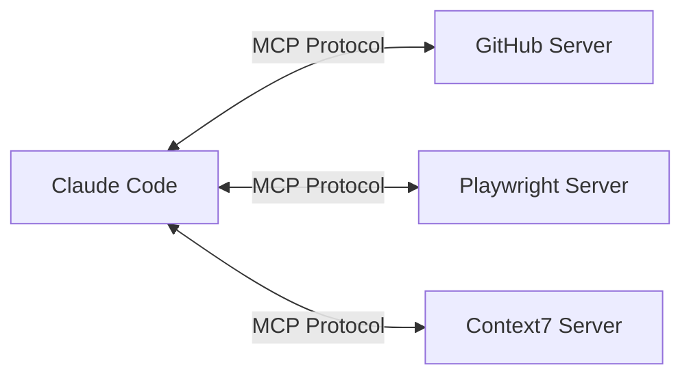

# 1. Overview

Claude Code is an AI-powered CLI tool made by Anthropic that can read and modify code and perform a wide range of development tasks from the terminal. It is powerful with its built-in features alone, but connecting **MCP (Model Context Protocol) servers** lets you handle tasks like creating GitHub PRs, running browser tests, querying databases, and searching the latest documentation with a single line of natural language.

This article covers the basic concept of MCP, how to set it up in Claude Code, and recommends MCP servers that are genuinely useful to developers, organized by category.

# 2. What Is MCP

## 2.1 MCP Overview

MCP (Model Context Protocol) is an open standard developed by Anthropic that connects AI models with external tools, data, and services through a standardized interface. It is often described as **"the USB-C of AI"**: just as USB-C connects various devices through a single port, MCP connects various external services to AI through a single protocol.



## 2.2 Core Components

MCP consists of three core components.

| Component | Description | Examples |
|---------|------|------|
| **Tools** | Functions the AI can call | Create a PR, search files, run a SQL query |
| **Resources** | Data the AI can read | File contents, DB schema, API responses |
| **Prompts** | Predefined prompt templates | Code review template, commit message generation |

## 2.3 Why MCP Is Powerful in Claude Code

Claude Code already has built-in tools such as file read/write, Bash execution, and code search. Adding MCP servers on top of this **extends Claude Code's capabilities to external services**.

- With **GitHub MCP** connected: "Create a PR with these changes" creates a PR in a single sentence
- With **Playwright MCP** connected: "Take a screenshot of the login page" automates the browser in a single sentence
- With **Context7 MCP** connected: "Show me how to use useActionState in React 19" references the latest documentation in a single sentence

# 3. Setting Up MCP Servers in Claude Code

## 3.1 Transport Types

MCP servers communicate with Claude Code in two ways.

| Transport | Description | When to Use |
|-----------|------|----------|
| **HTTP** | Connects to a remote server over HTTP | Cloud-based services (GitHub, Context7, etc.) |
| **stdio** | Runs a local process and communicates via standard input/output | Servers that run locally (Playwright, MySQL, etc.) |

> There is also an SSE (Server-Sent Events) method, but it has been deprecated, so using HTTP is recommended.

## 3.2 Setting Up via the CLI

The simplest way to add an MCP server in Claude Code is the `claude mcp add` command.

```bash
# HTTP transport (remote server)
claude mcp add --transport http <name> <url>

# stdio transport (local process)
claude mcp add --transport stdio <name> -- <command> [args...]

# Including environment variables
claude mcp add --transport stdio --env API_KEY=your_key <name> -- npx -y @package/name

# Configure directly in JSON format
claude mcp add-json <name> '<json_config>'

# Import Claude Desktop configuration
claude mcp add-from-claude-desktop
```

## 3.3 Configuration File Scopes

By default, the `claude mcp add` command saves to the **Local scope**. That is, it does not create a project file (`.mcp.json`); instead it saves to `~/.claude.json`. You can change the save location with the `--scope` option.

```bash
# Local (default) - saved to ~/.claude.json, used only in the current project
claude mcp add --transport http github https://api.githubcopilot.com/mcp/

# Project - creates/modifies the .mcp.json file, can be shared with the team
claude mcp add --scope project --transport http github https://api.githubcopilot.com/mcp/

# User - saved to ~/.claude.json, used across all projects
claude mcp add --scope user --transport http github https://api.githubcopilot.com/mcp/
```

MCP configuration is managed in four scopes, with a priority order of Local > Project > User.

| Scope | Location | Purpose |
|--------|------|------|
| **Local** (default) | `~/.claude.json` (under the project path) | Personal use only, current project only |
| **Project** | `.mcp.json` (project root) | Shared with the team (version controlled) |
| **User** | `~/.claude.json` | Used across all projects |
| **Managed** (enterprise) | `/Library/Application Support/ClaudeCode/managed-mcp.json` | Centrally managed by IT |

In team projects, you can add servers with `--scope project` or write `.mcp.json` directly and commit it to Git so that all team members share the same MCP environment.

## 3.4 .mcp.json Configuration Example

You can create a `.mcp.json` file in the project root to manage MCP servers declaratively.

```json
{
  "mcpServers": {
    "github": {
      "type": "http",
      "url": "https://api.githubcopilot.com/mcp/"
    },
    "context7": {
      "type": "http",
      "url": "https://mcp.context7.com/mcp"
    },
    "playwright": {
      "command": "npx",
      "args": ["@playwright/mcp@latest"]
    },
    "nanobanana": {
      "command": "uvx",
      "args": ["nanobanana-mcp-server@latest"],
      "env": {
        "GEMINI_API_KEY": "${NANOBANANA_MCP_GOOGLE_API_KEY}"
      }
    }
  }
}
```

> Environment variables can be referenced with the `${VAR}` or `${VAR:-default}` syntax. Secrets like API keys must be managed via environment variables and should never be included directly in `.mcp.json`.

## 3.5 Server Management Commands

```bash
claude mcp list           # List configured servers
claude mcp get <name>     # Show details for a specific server
claude mcp remove <name>  # Remove a server
```

Within Claude Code, you can check the status of currently connected servers with the `/mcp` command.

# 4. Recommended Essential MCP Servers for Development

## 4.1 Version Control & Code Collaboration

### 4.1.1 GitHub MCP Server

This is the most essential MCP server in a development workflow. Claude Code can interact directly with GitHub to create PRs, perform code reviews, and manage issues.

| Item | Details |
|------|------|
| GitHub | [github/github-mcp-server](https://github.com/github/github-mcp-server) |
| Transport | HTTP |

**Setup:**

```bash
claude mcp add --transport http github https://api.githubcopilot.com/mcp/
```

When configuring via `.mcp.json`:

```json
{
  "mcpServers": {
    "github": {
      "type": "http",
      "url": "https://api.githubcopilot.com/mcp/"
    }
  }
}
```

**Key Features:**
- Repository management (browse files, create branches)
- Create, review, and merge Pull Requests
- Create, search, and comment on Issues
- Code search (at the organization/repo level)
- Check CI/CD workflow status

**Usage Examples:**

```
> Create a PR with the current changes. Assign kenshin579 as the reviewer
> Add a "Fixed" comment to issue #42
> Search this repo for code containing the keyword "deprecated"
```

### 4.1.2 GitHub Enterprise MCP Server

If you work in an enterprise environment that uses an on-premises GitHub Enterprise Server (GHES), you can use the same GitHub MCP server with an Enterprise configuration.

| Item | Details |
|------|------|
| GitHub | [github/github-mcp-server](https://github.com/github/github-mcp-server) (same server) |
| Transport | stdio |

**Setup:**

```bash
claude mcp add --transport stdio github-enterprise \
  -- docker run -i --rm \
  -e GITHUB_PERSONAL_ACCESS_TOKEN \
  -e GITHUB_HOST=github.your-company.com \
  ghcr.io/github/github-mcp-server
```

When configuring via `.mcp.json`:

```json
{
  "mcpServers": {
    "github-enterprise": {
      "command": "docker",
      "args": ["run", "-i", "--rm",
        "-e", "GITHUB_PERSONAL_ACCESS_TOKEN",
        "-e", "GITHUB_HOST",
        "ghcr.io/github/github-mcp-server"],
      "env": {
        "GITHUB_PERSONAL_ACCESS_TOKEN": "${GITHUB_ENTERPRISE_PAT}",
        "GITHUB_HOST": "github.your-company.com"
      }
    }
  }
}
```

> Specify the Enterprise Server URL with the `GITHUB_HOST` environment variable and authenticate with a PAT (Personal Access Token). To use public GitHub and Enterprise at the same time, register the two servers under different names.

## 4.2 Browser Automation & Testing

### 4.2.1 Playwright MCP Server (Official Microsoft)

This is the browser automation MCP server officially provided by Microsoft. It analyzes web pages based on the **Accessibility Tree** rather than screenshots, making it more accurate and efficient.

| Item | Details |
|------|------|
| GitHub | [microsoft/playwright-mcp](https://github.com/microsoft/playwright-mcp) |
| Transport | stdio |

**Setup:**

```bash
claude mcp add playwright -- npx @playwright/mcp@latest
```

When configuring via `.mcp.json`:

```json
{
  "mcpServers": {
    "playwright": {
      "command": "npx",
      "args": ["@playwright/mcp@latest"]
    }
  }
}
```

**Key Features:**
- Web page navigation, clicking, form input
- Screenshot capture
- Automatic test code generation (Codegen mode)
- Manipulating elements inside iframes
- Saving PDFs, checking console logs

**Usage Examples:**

```
> Go to http://localhost:3000 and take a screenshot of the login page
> Fill in test data on the sign-up form and submit it
> Check the accessibility issues on the current page
```

## 4.3 Documentation & Library References

### 4.3.1 Context7 MCP Server

It solves the problem of AI models having stale training data that does not match the latest library documentation. It fetches **the accurate, latest documentation of the library you are using** in real time and incorporates it into responses.

| Item | Details |
|------|------|
| GitHub | [upstash/context7](https://github.com/upstash/context7) |
| Transport | HTTP |

**Setup:**

```bash
claude mcp add --transport http context7 https://mcp.context7.com/mcp
```

When configuring via `.mcp.json`:

```json
{
  "mcpServers": {
    "context7": {
      "type": "http",
      "url": "https://mcp.context7.com/mcp"
    }
  }
}
```

**Key Features:**
- Look up the latest documentation for libraries/frameworks
- Provide accurate, version-specific API references
- Include code examples

**Usage Examples:**

```
> use context7. Show me how to use useActionState in React 19
> use context7. Show me how to set up relations in Drizzle ORM
> use context7. Show me a DataChannel example for Pion WebRTC
```

> If you include `use context7` in your prompt, Context7 automatically searches the latest documentation and uses it in the response.

## 4.4 Databases

### 4.4.1 Supabase MCP Server

If your project uses Supabase as a backend, this is an essential MCP server. It provides more than 20 tools, handling everything from table design to migrations, queries, and type generation in one place.

| Item | Details |
|------|------|
| Docs | [supabase.com/docs/guides/ai/mcp](https://supabase.com/docs/guides/ai/mcp) |
| Transport | stdio |

**Setup:**

```bash
claude mcp add supabase \
  -- npx -y @anthropic-ai/mcp-remote@latest https://mcp.supabase.com
```

When configuring via `.mcp.json`:

```json
{
  "mcpServers": {
    "supabase": {
      "command": "npx",
      "args": ["-y", "@anthropic-ai/mcp-remote@latest", "https://mcp.supabase.com"]
    }
  }
}
```

**Key Features:**
- Table design and migration generation
- SQL query execution
- Automatic TypeScript type generation
- Edge Function management
- View/modify project settings

### 4.4.2 MySQL MCP Server

This is an MCP server that lets you query a MySQL database in natural language and explore its schema. It supports a read-only mode so you can explore data safely.

| Item | Details |
|------|------|
| GitHub | [benborla/mcp-server-mysql](https://github.com/benborla/mcp-server-mysql) |
| Transport | stdio |

**Setup:**

```bash
claude mcp add --transport stdio \
  --env MYSQL_HOST=localhost \
  --env MYSQL_USER=root \
  --env MYSQL_PASSWORD=password \
  --env MYSQL_DATABASE=mydb \
  mysql -- npx -y @benborla29/mcp-server-mysql
```

When configuring via `.mcp.json`:

```json
{
  "mcpServers": {
    "mysql": {
      "command": "npx",
      "args": ["-y", "@benborla29/mcp-server-mysql"],
      "env": {
        "MYSQL_HOST": "localhost",
        "MYSQL_USER": "root",
        "MYSQL_PASSWORD": "${MYSQL_PASSWORD}",
        "MYSQL_DATABASE": "mydb"
      }
    }
  }
}
```

**Key Features:**
- Run SQL queries in natural language
- Analyze table schemas and structures
- Read-only mode support

**Usage Examples:**

```
> Show me the schema of the users table
> Count how many users signed up in the last 7 days
> Analyze the relationship between the orders table and the products table
```

## 4.5 Search & Research

### 4.5.1 Brave Search MCP Server

It lets you use Brave Search, a privacy-focused web search engine, from within Claude Code. It is useful when you need additional searching beyond Claude Code's built-in WebSearch tool.

| Item | Details |
|------|------|
| GitHub | [brave/brave-search-mcp-server](https://github.com/brave/brave-search-mcp-server) |
| Transport | stdio |

**Setup:**

```bash
claude mcp add --transport stdio \
  --env BRAVE_API_KEY=your_api_key \
  brave-search -- npx -y @anthropic-ai/mcp-remote@latest https://mcp.bravesearch.com/sse
```

When configuring via `.mcp.json`:

```json
{
  "mcpServers": {
    "brave-search": {
      "command": "npx",
      "args": ["-y", "@anthropic-ai/mcp-remote@latest", "https://mcp.bravesearch.com/sse"],
      "env": {
        "BRAVE_API_KEY": "${BRAVE_API_KEY}"
      }
    }
  }
}
```

> You can get a Brave Search API key for free at [brave.com/search/api](https://brave.com/search/api/).

## 4.6 Knowledge Management & Documentation

### 4.6.1 Notion MCP Server

You can browse and edit project documents, meeting notes, and technical specs stored in Notion directly from Claude Code. Connecting your development context with documentation boosts productivity.

| Item | Details |
|------|------|
| GitHub | [makenotion/notion-mcp-server](https://github.com/makenotion/notion-mcp-server) |
| Transport | stdio |

**Setup:**

```bash
claude mcp add --transport stdio notion \
  -- npx -y @notionhq/notion-mcp-server
```

> A Notion Internal Integration Token is required. After creating an Integration at [Notion Developers](https://developers.notion.com/), you must connect it to the pages/databases you want to access.

**Key Features:**
- Read and write pages/databases
- Search pages
- Manage comments
- Edit content at the block level

**Usage Examples:**

```
> Find the "API Design Document" page in Notion and show me its contents
> Create a meeting notes page for today and add the attendee list
> Add a new item to the "Technical Debt" database
```

## 4.7 Image Generation

### 4.7.1 NanoBanana MCP Server

This is an MCP server that uses Google Gemini models to generate and edit AI images. You can create blog thumbnails, diagrams, prototype images, and more from natural language.

| Item | Details |
|------|------|
| GitHub | [YCSE/nanobanana-mcp](https://github.com/YCSE/nanobanana-mcp) |
| Transport | stdio |

**Setup:**

Configure it in `.mcp.json` as follows.

```json
{
  "mcpServers": {
    "nanobanana": {
      "command": "uvx",
      "args": ["nanobanana-mcp-server@latest"],
      "env": {
        "GEMINI_API_KEY": "${NANOBANANA_MCP_GOOGLE_API_KEY}"
      }
    }
  }
}
```

> You need to obtain a Gemini API key from Google AI Studio and set it as an environment variable.

**Usage Examples:**

```
> Generate an architecture diagram image showing the MCP server connection structure
> Create a blog thumbnail image with an AI coding tool theme
```

## 4.8 Advanced Reasoning

### 4.8.1 Sequential Thinking MCP Server

This is an MCP server that helps break down complex tasks into logical steps for systematic thinking. It is used for architecture design, multi-step planning, complex bug analysis, and more.

| Item | Details |
|------|------|
| Package | `@modelcontextprotocol/server-sequential-thinking` |
| Transport | stdio |

**Setup:**

```bash
claude mcp add sequential-thinking \
  -- npx -y @modelcontextprotocol/server-sequential-thinking
```

When configuring via `.mcp.json`:

```json
{
  "mcpServers": {
    "sequential-thinking": {
      "command": "npx",
      "args": ["-y", "@modelcontextprotocol/server-sequential-thinking"]
    }
  }
}
```

**Usage Examples:**

```
> Lay out a step-by-step plan for splitting this monorepo into microservices
> Analyze the root cause of this performance bottleneck
```

# 5. Where to Find MCP Servers

Here is a summary of the major registries and marketplaces where you can find the MCP servers you need.

| Registry | URL | Description |
|-----------|-----|------|
| **Official MCP Registry** | [registry.modelcontextprotocol.io](https://registry.modelcontextprotocol.io/) | Official Anthropic registry |
| **Smithery** | [smithery.ai](https://smithery.ai) | 2,200+ servers, automatic installation guides |
| **MCP.so** | [mcp.so](https://mcp.so) | 3,000+ servers, quality ratings |
| **PulseMCP** | [pulsemcp.com/servers](https://www.pulsemcp.com/servers) | 8,230+ servers, updated daily |
| **awesome-mcp-servers** | [github.com/punkpeye/awesome-mcp-servers](https://github.com/punkpeye/awesome-mcp-servers) | Curated GitHub list |

# 6. Conclusion

MCP is a powerful mechanism for extending Claude Code's capabilities to external services. We recommend starting with the **GitHub + Context7 + Playwright** trio and adding DB, search, and documentation management servers as needed.

The MCP ecosystem is growing rapidly, with new servers constantly appearing. Checking the [Official MCP Registry](https://registry.modelcontextprotocol.io/) and [awesome-mcp-servers](https://github.com/punkpeye/awesome-mcp-servers) periodically will help you discover useful servers.

# 7. References

- [Claude Code MCP Official Documentation](https://docs.anthropic.com/en/docs/claude-code/mcp)
- [Model Context Protocol Official Site](https://modelcontextprotocol.io/)
- [modelcontextprotocol/servers GitHub](https://github.com/modelcontextprotocol/servers)
- [awesome-mcp-servers](https://github.com/punkpeye/awesome-mcp-servers)
