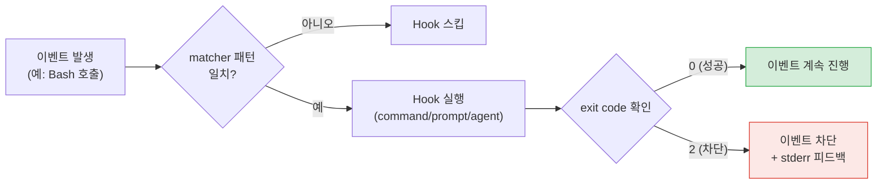
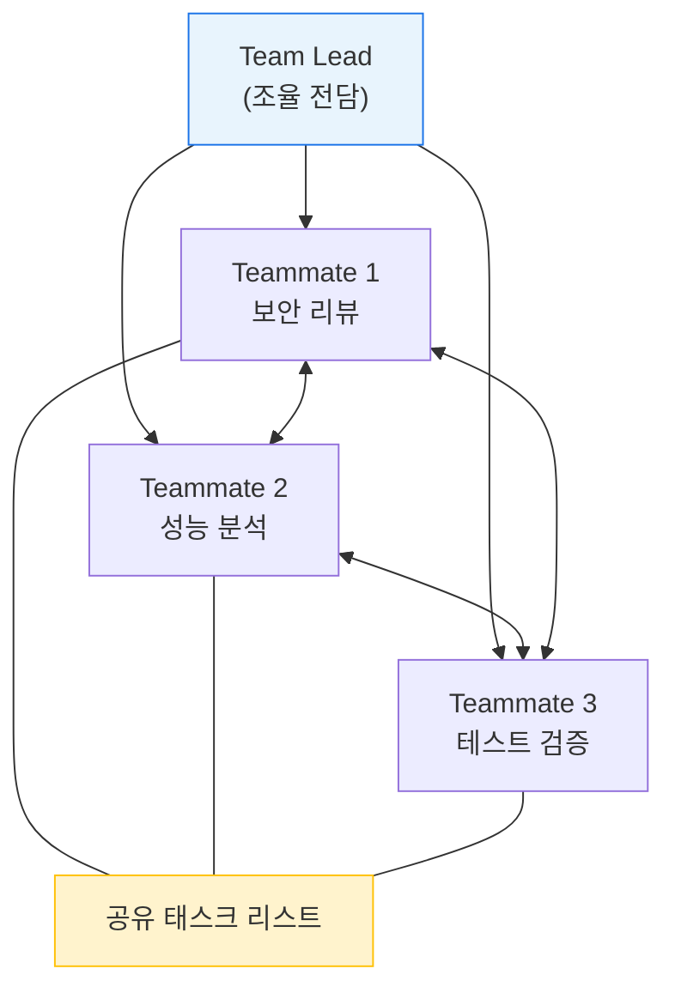
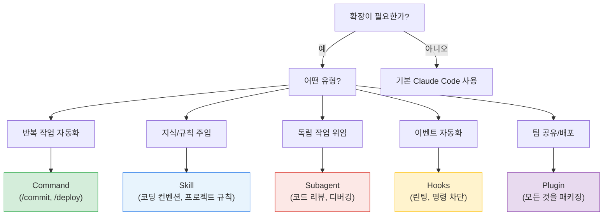

# 1. 개요

이전 글 [Claude Code 확장 기능 완벽 가이드: Command, Skill, Subagent](/claude-code-확장-기능-완벽-가이드-command-skill-subagent)에서는 Claude Code의 세 가지 핵심 확장 기능인 Command, Skill, Subagent의 개념과 실전 활용법을 다뤘다. 이번 글에서는 **중복 없이** 다음 단계인 **Hooks**(이벤트 기반 자동화)와 **Plugin 시스템**(확장 기능 패키징 및 배포)을 중심으로 새로운 내용을 정리한다.

## 1.1 단독 설정 vs Plugin의 차이

개별 확장 기능은 `.claude/` 디렉토리에 직접 설정하여 바로 사용할 수 있다. 하지만 팀과 공유하거나 커뮤니티에 배포하려면 **Plugin**으로 패키징하는 것이 효율적이다.

| 기준 | 단독 설정 | Plugin |
|------|-----------|--------|
| **적합한 상황** | 개인 워크플로우, 프로젝트 한정 | 팀 공유, 커뮤니티 배포 |
| **버전 관리** | Git으로 직접 관리 | `plugin.json`의 `version` 필드 |
| **네임스페이스** | 없음 (이름 충돌 가능) | `/plugin-name:skill-name` 형식으로 분리 |
| **설치/업데이트** | 수동 복사 | `/plugins` 명령으로 원클릭 |
| **MCP/LSP 통합** | 별도 설정 필요 | Plugin에 포함하여 한 번에 배포 |

> 이 글에서는 먼저 Hooks의 개념과 실전 활용법을 다룬 후, Plugin 시스템으로 모든 확장 기능을 하나로 패키징하는 방법을 설명한다.

# 2. Hooks (이벤트 기반 자동화)

## 2.1 Hooks란 무엇인가

Hooks는 Claude Code의 특정 이벤트에 반응하여 **결정론적으로** 실행되는 자동화 메커니즘이다. LLM의 판단에 의존하지 않고, 사전에 정의한 규칙에 따라 **항상 동일하게** 동작한다는 것이 핵심이다.

핵심 특징:
- **결정론적 실행**: LLM이 "할지 말지" 판단하지 않는다. 조건에 맞으면 무조건 실행된다
- **이벤트 기반**: 도구 호출 전/후, 세션 시작/종료 등 14가지 시점에 개입 가능
- **차단 기능**: 특정 Hook은 위험한 작업을 실행 전에 차단할 수 있다
- **3가지 핸들러 유형**: 셸 명령(`command`), LLM 단일 턴(`prompt`), 서브에이전트(`agent`)

예를 들어, "실수로 `rm -rf /`를 실행하는 것을 방지하고 싶다"면 CLAUDE.md에 "rm -rf를 사용하지 마"라고 적을 수도 있지만, LLM이 이를 무시할 가능성이 있다. Hooks를 사용하면 Bash 도구 호출 전에 명령어를 검사하여 **100% 확실하게** 차단할 수 있다.



## 2.2 14가지 Hook 이벤트

Claude Code는 세션의 전체 라이프사이클에 걸쳐 14가지 이벤트를 제공한다. 각 이벤트는 **차단 가능 여부**에 따라 두 가지로 나뉜다.

| 이벤트 | 발생 시점 | 차단 가능 | 주요 용도 |
|---|---|---|---|
| `SessionStart` | 세션 시작/재개 시 | No | 환경 초기화, 로깅 |
| `UserPromptSubmit` | 사용자 프롬프트 제출 시 | Yes | 입력 검증, 프롬프트 변환 |
| `PreToolUse` | 도구 호출 전 | Yes | 위험 명령 차단, 입력 검증 |
| `PermissionRequest` | 권한 다이얼로그 표시 시 | Yes | 자동 승인/거부 |
| `PostToolUse` | 도구 호출 성공 후 | No | 린팅, 포맷팅, 로깅 |
| `PostToolUseFailure` | 도구 호출 실패 후 | No | 에러 로깅, 복구 시도 |
| `Notification` | 알림 전송 시 | No | 알림 커스터마이징 |
| `SubagentStart` | 서브에이전트 생성 시 | No | 모니터링, 로깅 |
| `SubagentStop` | 서브에이전트 종료 시 | Yes | 결과 검증 |
| `Stop` | Claude 응답 완료 시 | Yes | 작업 완료 검증, 후처리 |
| `TeammateIdle` | 팀원 에이전트 대기 시 | Yes | 추가 작업 할당 |
| `TaskCompleted` | 태스크 완료 표시 시 | Yes | 완료 기준 검증 |
| `PreCompact` | 컨텍스트 압축 전 | No | 압축 전 정보 저장 |
| `SessionEnd` | 세션 종료 시 | No | 정리 작업, 최종 로깅 |

**차단 가능(blocking)** 이벤트에서 Hook이 exit code `2`를 반환하면 해당 작업이 중단되고, stderr의 내용이 Claude에게 피드백으로 전달된다.

Hook에 전달되는 stdin JSON의 공통 필드:

```json
{
  "session_id": "abc123",
  "cwd": "/home/user/my-project",
  "hook_event_name": "PreToolUse",
  "tool_name": "Bash",
  "tool_input": {
    "command": "npm test"
  }
}
```

## 2.3 Hook 설정 방법

### 2.3.1 설정 형식

Hook은 JSON 형식으로 설정한다. 구조는 `이벤트 → matcher → hooks 배열`이다.

```json
{
  "hooks": {
    "PreToolUse": [
      {
        "matcher": "Bash",
        "hooks": [
          {
            "type": "command",
            "command": "bash .claude/hooks/block-dangerous-commands.sh"
          }
        ]
      }
    ],
    "PostToolUse": [
      {
        "matcher": "Write|Edit",
        "hooks": [
          {
            "type": "command",
            "command": "bash .claude/hooks/auto-lint.sh"
          }
        ]
      }
    ]
  }
}
```

### 2.3.2 matcher 패턴

`matcher`는 정규식 패턴으로, Hook이 반응할 도구 이름을 필터링한다.

| matcher 패턴 | 설명 |
|---|---|
| `"Bash"` | Bash 도구에만 반응 |
| `"Write\|Edit"` | Write 또는 Edit 도구에 반응 |
| `"mcp__.*"` | 모든 MCP 도구에 반응 |
| `"mcp__memory__.*"` | memory MCP 서버의 모든 도구에 반응 |
| `null` (생략) | 해당 이벤트의 모든 도구에 반응 |

### 2.3.3 설정 위치 & 스코프

Hook은 4가지 위치에 설정할 수 있으며, 각각 적용 범위가 다르다.

| 위치 | 파일 경로 | 스코프 | 팀 공유 |
|---|---|---|---|
| **사용자 전역** | `~/.claude/settings.json` | 모든 프로젝트 | No |
| **프로젝트** | `.claude/settings.json` | 현재 프로젝트 | Yes (Git 커밋) |
| **프로젝트 로컬** | `.claude/settings.local.json` | 현재 프로젝트 | No (gitignore) |
| **Plugin** | `<plugin>/hooks/hooks.json` | Plugin 활성화 시 | Yes |

모든 스코프의 Hook이 병합되어 실행된다. 같은 이벤트에 여러 Hook이 설정되면 순서대로 모두 실행된다.

## 2.4 3가지 Hook 핸들러 유형

Hook이 트리거되었을 때 **무엇을 실행할 것인가**에 따라 3가지 핸들러를 선택할 수 있다.

### 2.4.1 command (셸 명령)

가장 기본적인 핸들러로, 셸 명령을 직접 실행한다. 이벤트 데이터가 **stdin으로 JSON 형태**로 전달된다.

```json
{
  "type": "command",
  "command": "bash .claude/hooks/block-rm.sh"
}
```

- **exit code 0**: 성공 (이벤트 계속 진행)
- **exit code 2**: 차단 (blocking 이벤트만). stderr 내용이 Claude에게 피드백으로 전달됨
- **stdout 출력**: Claude에게 추가 컨텍스트로 전달 (비차단 Hook에서 유용)
- **타임아웃**: 기본 600초, `timeout` 필드로 조정 가능 (prompt는 30초, agent는 60초)
- **비동기 실행**: `"async": true`로 설정하면 Hook 완료를 기다리지 않고 진행
- **환경 변수**: `$CLAUDE_PROJECT_DIR`(프로젝트 루트), `${CLAUDE_PLUGIN_ROOT}`(Plugin 루트) 사용 가능

### 2.4.2 prompt (LLM 단일 턴)

LLM에게 단일 턴 평가를 요청하는 핸들러이다. 도구 사용 없이 이벤트 데이터를 분석하고 판단한다.

```json
{
  "type": "prompt",
  "prompt": "다음 작업 결과를 검토하고, 목표를 달성했는지 판단해. 달성하지 못했으면 무엇이 부족한지 알려줘."
}
```

- LLM이 이벤트 컨텍스트를 받아 단일 응답을 생성
- 도구를 사용할 수 없으므로 **읽기/분석** 용도에 적합
- `Stop` 이벤트와 조합하여 작업 완료 여부를 판단하는 데 유용

### 2.4.3 agent (서브에이전트 다중 턴)

서브에이전트를 생성하여 다중 턴으로 검증 작업을 수행하는 핸들러이다.

```json
{
  "type": "agent",
  "prompt": "방금 수정된 파일을 읽고, 코드 스타일 가이드를 확인한 후, 위반 사항이 있으면 보고해."
}
```

- 서브에이전트가 도구를 사용하여 파일 읽기, 검색 등 가능
- `prompt`보다 비용이 높지만, 복잡한 검증에 적합
- 여러 파일을 읽고 분석해야 하는 경우 유용

| 핸들러 | 실행 방식 | 도구 사용 | 비용 | 적합한 상황 |
|--------|-----------|-----------|------|-------------|
| `command` | 셸 명령 직접 실행 | 없음 | 최소 | 린트, 포맷팅, 간단한 검증 |
| `prompt` | LLM 단일 턴 평가 | 없음 | 중간 | 작업 완료 판단, 결과 평가 |
| `agent` | 서브에이전트 다중 턴 | 있음 | 높음 | 파일 검사, 복합 검증 |

## 2.5 실전 예제

### 2.5.1 위험 명령 차단 (PreToolUse + Bash)

`rm -rf /`, `git push --force` 같은 위험한 명령을 Bash 도구 호출 전에 차단한다.

`settings.json`:

```json
{
  "hooks": {
    "PreToolUse": [
      {
        "matcher": "Bash",
        "hooks": [
          {
            "type": "command",
            "command": "bash .claude/hooks/block-dangerous-commands.sh"
          }
        ]
      }
    ]
  }
}
```

`.claude/hooks/block-dangerous-commands.sh`:

```bash
#!/bin/bash
# stdin으로 이벤트 데이터가 JSON으로 전달됨
input=$(cat)
command=$(echo "$input" | jq -r '.tool_input.command // empty')

# 위험 명령 패턴 검사
dangerous_patterns=(
  "rm -rf /"
  "rm -rf ~"
  "git push.*--force.*main"
  "git push.*--force.*master"
  "DROP TABLE"
  "DROP DATABASE"
)

for pattern in "${dangerous_patterns[@]}"; do
  if echo "$command" | grep -qE "$pattern"; then
    echo "위험 명령 차단됨: $command" >&2
    echo "이 명령은 보안 정책에 의해 차단되었습니다." >&2
    exit 2  # exit code 2 = 차단
  fi
done

exit 0  # exit code 0 = 허용
```

**동작 시나리오**: Claude가 `rm -rf /tmp/build`를 실행하려 하면, Hook이 명령을 검사하고 위험 패턴에 해당하지 않으므로 허용한다. 반면 `git push --force origin main`을 시도하면 exit code 2로 차단하고, Claude에게 "보안 정책에 의해 차단되었습니다"라는 피드백을 전달한다.

### 2.5.2 파일 저장 후 자동 린팅 (PostToolUse + Write|Edit)

파일을 생성하거나 수정한 후 자동으로 린터를 실행한다.

`settings.json`:

```json
{
  "hooks": {
    "PostToolUse": [
      {
        "matcher": "Write|Edit",
        "hooks": [
          {
            "type": "command",
            "command": "bash .claude/hooks/auto-lint.sh"
          }
        ]
      }
    ]
  }
}
```

`.claude/hooks/auto-lint.sh`:

```bash
#!/bin/bash
input=$(cat)
file_path=$(echo "$input" | jq -r '.tool_input.file_path // .tool_input.path // empty')

if [ -z "$file_path" ]; then
  exit 0
fi

# 파일 확장자에 따라 적절한 린터 실행
case "$file_path" in
  *.ts|*.tsx)
    npx eslint --fix "$file_path" 2>/dev/null
    ;;
  *.py)
    ruff check --fix "$file_path" 2>/dev/null
    ;;
  *.go)
    gofmt -w "$file_path" 2>/dev/null
    ;;
esac

exit 0
```

**포인트**: `PostToolUse`는 비차단(non-blocking) 이벤트이므로 exit code 2를 반환해도 작업이 중단되지 않는다. 린터의 결과는 stdout을 통해 Claude에게 전달된다.

### 2.5.3 작업 완료 검증 (Stop + prompt 핸들러)

Claude가 응답을 마치려 할 때 `prompt` 핸들러로 작업 완료 여부를 검증한다.

```json
{
  "hooks": {
    "Stop": [
      {
        "hooks": [
          {
            "type": "prompt",
            "prompt": "방금 완료된 작업을 검토해. 사용자의 원래 요청과 비교하여: 1) 모든 요구사항이 충족되었는가? 2) 테스트가 필요한 변경인데 테스트를 작성하지 않았는가? 3) 누락된 부분이 있는가? 부족한 점이 있으면 구체적으로 알려줘."
          }
        ]
      }
    ]
  }
}
```

**동작 시나리오**: Claude가 "함수 추가해줘"라는 요청을 처리하고 응답을 마치려 할 때, `Stop` Hook이 LLM에게 검토를 요청한다. LLM이 "테스트가 누락되었습니다"라고 판단하면, 해당 피드백이 Claude에게 전달되어 추가 작업을 이어간다.

### 2.5.4 MCP 도구 모니터링 (mcp__*__ matcher)

MCP 서버의 도구 호출을 모니터링하고 로깅한다.

```json
{
  "hooks": {
    "PreToolUse": [
      {
        "matcher": "mcp__memory__.*",
        "hooks": [
          {
            "type": "command",
            "command": "bash -c 'echo \"[$(date)] MCP memory 도구 호출: $(cat | jq -r .tool_name)\" >> /tmp/mcp-audit.log'"
          }
        ]
      }
    ]
  }
}
```

### 2.5.5 비동기 테스트 실행 (async: true)

파일 변경 후 테스트를 비동기로 실행하여 Claude의 다음 작업을 차단하지 않는다.

```json
{
  "hooks": {
    "PostToolUse": [
      {
        "matcher": "Write|Edit",
        "hooks": [
          {
            "type": "command",
            "command": "bash -c 'npm test -- --related $(cat | jq -r .tool_input.file_path) &>/tmp/test-results.log'",
            "async": true,
            "timeout": 120000
          }
        ]
      }
    ]
  }
}
```

**포인트**: `async: true`로 설정하면 Hook 실행이 완료될 때까지 기다리지 않는다. 테스트처럼 시간이 오래 걸리는 작업에 적합하다.

## 2.6 Hooks Best Practices

### 2.6.1 추천 Use Case 모음

| Use Case | 이벤트 | 핸들러 | 설명 |
|----------|--------|--------|------|
| 위험 명령 차단 | `PreToolUse` (Bash) | `command` | `rm -rf /`, `git push --force main` 등 차단 |
| 자동 린트/포맷 | `PostToolUse` (Write\|Edit) | `command` | 파일 저장 시 ESLint, gofmt, ruff 자동 실행 |
| 커밋 메시지 규칙 강제 | `PreToolUse` (Bash) | `command` | Conventional Commits 형식이 아니면 차단 |
| 민감 파일 보호 | `PreToolUse` (Write\|Edit) | `command` | `.env`, `secrets.yaml` 등 수정 시 차단 |
| 테스트 자동 실행 | `PostToolUse` (Write\|Edit) | `command` (async) | 관련 테스트를 비동기로 실행, 워크플로우 차단 없이 |
| 작업 완료 검증 | `Stop` | `prompt` | 요구사항 충족 여부, 테스트 누락 검토 |
| 코드 리뷰 자동화 | `Stop` | `agent` | 수정된 파일을 읽고 스타일 가이드 위반 검사 |
| API 호출 감사 로그 | `PreToolUse` (mcp__*) | `command` | MCP 도구 호출 기록을 파일에 로깅 |
| 브랜치 보호 | `PreToolUse` (Bash) | `command` | main/master 브랜치 직접 커밋 방지 |
| 환경 초기화 | `SessionStart` | `command` | 세션 시작 시 `.env` 로드, 필수 도구 존재 확인 |

### 2.6.2 설계 원칙

**1. command 핸들러를 기본으로 사용하라**

린트, 포맷팅, 패턴 검사처럼 규칙이 명확한 작업은 `command`가 가장 효율적이다. `prompt`나 `agent`는 LLM 비용이 발생하므로 판단이 필요한 경우에만 사용한다.

**2. 차단은 최소한으로, 피드백은 명확하게**

exit code 2로 차단할 때는 **왜 차단되었는지** stderr에 구체적으로 알려줘야 Claude가 대안을 찾을 수 있다.

```bash
# ❌ 나쁜 예: 이유 없이 차단
echo "차단됨" >&2 && exit 2

# ✅ 좋은 예: 구체적 이유와 대안 제시
echo "main 브랜치에 직접 push할 수 없습니다. feature 브랜치에서 PR을 생성하세요." >&2 && exit 2
```

**3. 무거운 작업은 async로 실행하라**

테스트 실행, 빌드 검증 같은 시간이 오래 걸리는 작업은 `"async": true`로 설정하여 Claude의 워크플로우를 차단하지 않도록 한다.

**4. Hook 스크립트는 빠르게 종료하라**

동기 Hook은 Claude의 응답을 블로킹한다. 기본 타임아웃(command: 600초)에 의존하지 말고, 스크립트 자체를 가능한 빠르게 끝나도록 작성한다.

**5. 이벤트 + matcher 조합을 정확히 좁혀라**

matcher를 생략하면 해당 이벤트의 **모든** 도구에 Hook이 실행된다. 불필요한 실행을 줄이려면 matcher를 최대한 구체적으로 지정한다.

```json
// ❌ 모든 도구에 린트 실행 (불필요)
{ "matcher": null }

// ✅ 파일 수정 도구에만 린트 실행
{ "matcher": "Write|Edit" }
```

# 3. Plugin 시스템

## 3.1 Plugin이란

Plugin은 Skills, Hooks, Agents, MCP 서버, LSP 서버를 **하나의 배포 단위**로 묶는 패키징 시스템이다. 개별 확장 기능을 직접 설정하는 대신, Plugin으로 패키징하면 설치, 업데이트, 공유가 간편해진다.

핵심 특징:
- **통합 패키징**: Command, Skill, Agent, Hook, MCP, LSP를 하나로 묶음
- **네임스페이싱**: `/plugin-name:skill-name` 형식으로 이름 충돌 방지
- **원클릭 설치**: `/plugins` 명령 또는 Marketplace에서 설치
- **자동 업데이트**: Marketplace 등록 시 버전 관리 및 자동 업데이트 지원
- **스코프 선택**: 사용자 전역, 프로젝트 공유, 프로젝트 로컬 중 선택 가능

## 3.2 Plugin 구조

### 3.2.1 디렉토리 레이아웃

```
my-plugin/
├── .claude-plugin/
│   └── plugin.json         # 매니페스트 (필수)
├── commands/               # 슬래시 커맨드 (마크다운 파일)
│   └── deploy.md
├── skills/                 # Agent Skills
│   └── code-review/
│       └── SKILL.md
├── agents/                 # 커스텀 서브에이전트
│   └── reviewer.md
├── hooks/
│   └── hooks.json          # 이벤트 핸들러
├── .mcp.json               # MCP 서버 설정
└── .lsp.json               # LSP 서버 설정
```

모든 디렉토리는 선택사항이다. 필요한 확장 기능만 포함하면 된다. 유일한 필수 파일은 `.claude-plugin/plugin.json`이다.

### 3.2.2 plugin.json 매니페스트 스키마

```json
{
  "name": "my-awesome-plugin",
  "description": "프로젝트 개발 워크플로우를 자동화하는 Plugin",
  "version": "1.0.0",
  "author": {
    "name": "개발자 이름",
    "url": "https://github.com/username"
  },
  "homepage": "https://github.com/username/my-awesome-plugin",
  "repository": "https://github.com/username/my-awesome-plugin",
  "license": "MIT"
}
```

| 필드 | 필수 | 설명 |
|------|------|------|
| `name` | Yes | Plugin 식별자 (소문자, 숫자, 하이픈) |
| `description` | Yes | Plugin 설명 |
| `version` | Yes | Semantic Versioning (예: `1.0.0`) |
| `author` | No | 작성자 정보 (`name`, `url`) |
| `homepage` | No | Plugin 홈페이지 URL |
| `repository` | No | 소스 코드 저장소 URL |
| `license` | No | 라이선스 |

## 3.3 Plugin 개발 워크플로우

### 3.3.1 로컬 테스트 (--plugin-dir)

Plugin을 개발할 때 로컬에서 바로 테스트할 수 있다.

```bash
# 단일 Plugin 로드
claude --plugin-dir ./my-plugin

# 여러 Plugin 동시 로드
claude --plugin-dir ./plugin-one --plugin-dir ./plugin-two
```

`--plugin-dir`로 로드한 Plugin은 일반 설치와 동일하게 동작한다. Skills는 `/plugin-name:skill-name` 형식으로 호출 가능하고, Hooks도 설정대로 동작한다.

### 3.3.2 기존 .claude/ 설정을 Plugin으로 마이그레이션

이미 `.claude/` 디렉토리에 확장 기능을 설정해두었다면, 간단한 구조 변환으로 Plugin으로 전환할 수 있다.

| 기존 위치 | Plugin 위치 |
|---|---|
| `.claude/commands/*.md` | `commands/*.md` |
| `.claude/skills/<name>/SKILL.md` | `skills/<name>/SKILL.md` |
| `.claude/agents/*.md` | `agents/*.md` |
| `settings.json`의 hooks 섹션 | `hooks/hooks.json` |
| `.mcp.json` | `.mcp.json` (그대로) |

마이그레이션 단계:

1. Plugin 디렉토리 생성 및 `plugin.json` 작성
2. 기존 파일을 새 구조로 복사
3. `settings.json`의 hooks를 `hooks/hooks.json`으로 분리
4. `--plugin-dir`로 테스트
5. 기존 `.claude/` 설정 제거 (선택)

## 3.4 LSP 서버 (코드 인텔리전스)

Plugin은 LSP(Language Server Protocol) 서버를 포함하여 **실시간 코드 인텔리전스**를 제공할 수 있다. LSP 서버는 코드 진단(에러, 경고), 자동완성, 정의로 이동 같은 기능을 Claude에게 제공한다.

### 3.4.1 .lsp.json 설정

```json
{
  "mcpServers": {
    "typescript-lsp": {
      "command": "npx",
      "args": ["typescript-language-server", "--stdio"],
      "languages": ["typescript", "typescriptreact"]
    },
    "python-lsp": {
      "command": "pylsp",
      "args": [],
      "languages": ["python"]
    }
  }
}
```

LSP 서버가 활성화되면 Claude는 코드 수정 시 실시간 진단 정보를 참고할 수 있다. 컴파일 에러나 타입 오류를 감지하여 수정 전에 문제를 인식한다.

### 3.4.2 공식 LSP Plugin

Anthropic 공식 Marketplace에서 11개 언어의 LSP Plugin을 제공한다.

| Plugin | 언어 | 필요 바이너리 |
|--------|------|---------------|
| `typescript-lsp` | TypeScript/JavaScript | `typescript-language-server` |
| `pyright-lsp` | Python | `pyright-langserver` |
| `gopls-lsp` | Go | `gopls` |
| `rust-analyzer-lsp` | Rust | `rust-analyzer` |
| `clangd-lsp` | C/C++ | `clangd` |
| `jdtls-lsp` | Java | `jdtls` |
| `kotlin-lsp` | Kotlin | `kotlin-language-server` |
| `swift-lsp` | Swift | `sourcekit-lsp` |
| `csharp-lsp` | C# | `csharp-ls` |
| `php-lsp` | PHP | `intelephense` |
| `lua-lsp` | Lua | `lua-language-server` |

LSP Plugin이 활성화되면 Claude는 파일 수정 후 자동으로 진단 정보(에러, 경고)를 받아 컴파일러를 직접 실행하지 않아도 문제를 인식할 수 있다.

# 4. Plugin Marketplace

## 4.1 공식 Marketplace

Anthropic은 공식 Plugin Marketplace(`anthropics/claude-plugins-official`)를 운영하며, 큐레이션된 Plugin을 제공한다. Claude Code 시작 시 자동으로 사용 가능하다.

공식 Marketplace의 특징:
- Anthropic이 검증한 Plugin만 포함
- Claude Code 설치 시 기본으로 연결됨
- `/plugins` 명령으로 바로 탐색 및 설치 가능

## 4.2 Plugin 설치

### 4.2.1 /plugins 명령

Claude Code에서 `/plugins` 명령을 실행하면 Plugin 관리 인터페이스가 열린다. Marketplace에서 Plugin을 검색하고 설치할 수 있다.

### 4.2.2 설치 스코프

Plugin을 설치할 때 3가지 스코프 중 하나를 선택한다.

| 스코프 | 설명 | 저장 위치 |
|--------|------|-----------|
| **Install for you** | 모든 프로젝트에서 사용 (사용자 전역) | `~/.claude/plugins/` |
| **Install for this project** | 프로젝트 팀원과 공유 | `.claude/plugins/` (Git 커밋 가능) |
| **Install locally** | 현재 레포, 현재 사용자만 | `.claude/plugins.local/` |

### 4.2.3 CLI로 설치

```bash
# Marketplace에서 설치
claude plugin install <plugin-name>

# GitHub 레포에서 직접 설치
claude plugin install github:username/repo-name

# 로컬 경로에서 설치
claude plugin install /path/to/local/plugin
```

### 4.2.4 Plugin 관리 CLI 명령

| 명령 | 설명 |
|------|------|
| `claude plugin install <plugin> [-s scope]` | Plugin 설치 |
| `claude plugin uninstall <plugin> [-s scope]` | Plugin 제거 |
| `claude plugin enable <plugin> [-s scope]` | 비활성화된 Plugin 활성화 |
| `claude plugin disable <plugin> [-s scope]` | 제거 없이 비활성화 |
| `claude plugin update <plugin> [-s scope]` | 최신 버전으로 업데이트 |
| `claude plugin validate .` | Plugin 구조 검증 |

## 4.3 Marketplace 만들기 & 배포

### 4.3.1 GitHub 레포를 Marketplace로 사용

커뮤니티 Marketplace는 GitHub 레포를 기반으로 운영할 수 있다. 레포 루트에 `marketplace.json` 파일을 만들면 된다.

```json
{
  "name": "my-marketplace",
  "owner": {
    "name": "DevTools Team",
    "email": "devtools@example.com"
  },
  "metadata": {
    "description": "팀 전용 Plugin Marketplace",
    "version": "1.0.0"
  },
  "plugins": [
    {
      "name": "my-plugin",
      "description": "Plugin 설명",
      "source": {
        "source": "github",
        "repo": "username/my-plugin"
      },
      "tags": ["workflow", "automation"]
    },
    {
      "name": "local-plugin",
      "description": "로컬 경로 Plugin",
      "source": "./plugins/local-plugin"
    }
  ]
}
```

### 4.3.2 Marketplace 등록

사용자가 커뮤니티 Marketplace를 추가하는 방법:

Claude Code 내에서 `/plugins` → Marketplace 탭에서 추가하거나, CLI로 추가할 수 있다.

```bash
# GitHub 레포로 추가
/plugin marketplace add username/marketplace-repo

# Git URL로 추가 (GitLab, Bitbucket 등)
/plugin marketplace add https://gitlab.com/org/marketplace-repo.git

# 특정 브랜치/태그 고정
/plugin marketplace add https://github.com/org/plugins.git#v1.0.0
```

팀 프로젝트에서는 `.claude/settings.json`에 Marketplace를 설정하여 팀원이 자동으로 사용할 수 있다.

```json
{
  "extraKnownMarketplaces": {
    "company-tools": {
      "source": {
        "source": "github",
        "repo": "your-org/claude-plugins"
      }
    }
  },
  "enabledPlugins": {
    "code-formatter@company-tools": true,
    "deployment-tools@company-tools": true
  }
}
```

### 4.3.3 배포 체크리스트

Plugin을 배포할 때 확인해야 할 사항:

1. `.claude-plugin/plugin.json` 매니페스트 완성
2. `README.md` 작성 (설치 방법, 사용법, 설정 옵션)
3. Semantic Versioning 적용 (Git 태그와 `version` 필드 일치)
4. 민감 정보(API 키, 개인 경로) 포함 여부 확인
5. `--plugin-dir`로 로컬 테스트 완료
6. GitHub Public 레포에 Push

# 5. Agent Teams (실험적 기능)

## 5.1 개요

Agent Teams는 여러 Claude Code 인스턴스를 **팀**으로 조율하는 실험적 기능이다. 하나의 세션이 Team Lead 역할을 맡아 작업을 분배하고, 여러 Teammates가 독립적으로 작업한 후 결과를 공유한다.

Subagent와의 핵심 차이점은 **Teammates 간 직접 통신**이 가능하다는 것이다.

| 기준 | Subagent | Agent Team |
|------|----------|------------|
| **컨텍스트** | 자체 컨텍스트, 결과만 반환 | 완전 독립 인스턴스 |
| **통신** | 메인 에이전트에만 보고 | Teammates끼리 직접 소통 |
| **조율** | 메인 에이전트가 관리 | 공유 태스크 리스트로 자체 조율 |
| **적합한 상황** | 결과만 중요한 집중 작업 | 논의와 협업이 필요한 복합 작업 |
| **토큰 비용** | 낮음 (결과 요약) | 높음 (각 인스턴스별 컨텍스트) |



## 5.2 활성화 & 사용법

### 5.2.1 활성화

Agent Teams는 기본적으로 비활성화되어 있다. 환경 변수 또는 settings.json으로 활성화한다.

```json
{
  "env": {
    "CLAUDE_CODE_EXPERIMENTAL_AGENT_TEAMS": "1"
  }
}
```

### 5.2.2 팀 생성

자연어로 Claude에게 팀 구성을 요청한다.

```
PR #142를 리뷰하기 위한 에이전트 팀을 만들어줘.
- 보안 취약점 검토 담당 1명
- 성능 영향 분석 담당 1명
- 테스트 커버리지 검증 담당 1명
각자 리뷰하고 결과를 공유해.
```

### 5.2.3 Delegate 모드

Shift+Tab을 누르면 Delegate 모드로 전환된다. 이 모드에서 Team Lead는 직접 코드를 수정하지 않고 **조율 작업만** 수행한다.

- Teammate 생성 및 관리
- 태스크 할당 및 상태 확인
- 메시지 전달 및 결과 종합
- 코드 수정, 파일 생성 등은 Teammates에게 위임

### 5.2.4 디스플레이 모드

| 모드 | 설명 | 요구사항 |
|------|------|----------|
| `in-process` | 메인 터미널에서 모든 Teammates 실행 | 없음 (기본) |
| `tmux` | 각 Teammate가 별도 pane에서 실행 | tmux 또는 iTerm2 |
| `auto` | tmux 세션이면 분할, 아니면 in-process | 자동 감지 |

```json
{
  "teammateMode": "in-process"
}
```

## 5.3 적합한 사용 사례 & 제한사항

### 5.3.1 적합한 사례

- **리서치 & 리뷰**: 여러 관점에서 동시에 조사 (보안, 성능, UX)
- **크로스 레이어 작업**: 프론트엔드, 백엔드, 테스트를 각각 다른 Teammate에게 할당
- **경쟁 가설 디버깅**: 여러 가설을 동시에 검증하고 서로 반박
- **새 모듈/기능 개발**: 독립적인 모듈을 병렬로 개발

### 5.3.2 제한사항

- **세션 재개 불가**: `/resume`, `/rewind`로 in-process Teammates 복원 불가
- **세션당 1팀**: 동시에 하나의 팀만 운영 가능
- **중첩 불가**: Teammates가 자체 팀을 생성할 수 없음
- **Lead 고정**: 팀 생성 세션이 영구적으로 Lead 역할
- **파일 충돌 주의**: 같은 파일을 여러 Teammates가 수정하면 덮어쓰기 발생
- **토큰 비용**: 각 Teammate마다 별도 컨텍스트가 필요하므로 비용이 크게 증가

# 6. 보안 & 기업 관리

## 6.1 Hook 보안 고려사항

Hooks는 **사용자 시스템 권한**으로 실행된다. 따라서 보안에 특히 주의해야 한다.

- **입력 검증**: stdin으로 전달되는 JSON 데이터를 파싱할 때 반드시 검증
- **경로 순회 방어**: Hook 스크립트에서 파일 경로를 처리할 때 `..` 등 경로 순회 공격 방지
- **민감 파일 보호**: `.env`, `.git/`, API 키 파일 등에 접근하는 명령 차단
- **타임아웃 설정**: 무한 루프 방지를 위해 `timeout` 필드 설정

## 6.2 기업용 관리 설정

기업 환경에서는 IT 관리자가 중앙에서 확장 기능을 제어할 수 있다.

### 6.2.1 managed-mcp.json

IT 관리자가 조직 전체에 MCP 서버를 중앙 배포한다. 사용자가 개별적으로 설정할 필요 없이 조직의 표준 도구가 자동으로 제공된다.

### 6.2.2 MCP 서버 허용/차단 목록

```json
{
  "allowedMcpServers": ["github", "jira", "slack"],
  "deniedMcpServers": ["*"]
}
```

- `allowedMcpServers`: 허용된 MCP 서버 목록
- `deniedMcpServers`: 차단된 MCP 서버 목록 (`*`로 전체 차단 후 허용 목록만 사용)

### 6.2.3 allowManagedHooksOnly

```json
{
  "allowManagedHooksOnly": true
}
```

이 설정을 활성화하면 사용자나 프로젝트 수준의 Hooks가 모두 무시되고, **관리자가 설정한 Hooks만** 실행된다. 보안이 중요한 기업 환경에서 유용하다.

### 6.2.4 strictKnownMarketplaces

```json
{
  "strictKnownMarketplaces": true
}
```

이 설정을 활성화하면 관리자가 승인한 Marketplace에서만 Plugin을 설치할 수 있다. 알 수 없는 출처의 Plugin 설치를 방지한다.

# 7. 마무리

이전 글에서 다룬 Command, Skill, Subagent까지 포함하여 Claude Code의 5가지 확장 메커니즘을 종합하면, 상황에 따라 다음과 같이 선택할 수 있다.



| 확장 메커니즘 | 한 줄 요약 | 적합한 상황 |
|---|---|---|
| **Command** | "이 절차대로 실행해" | 매일 반복하는 정형화된 작업 |
| **Skill** | "이 지식을 참고해" | 코딩 규칙, 프로젝트 가이드라인 |
| **Subagent** | "이 전문가에게 맡겨" | 독립적 분석, 격리 실행 필요 |
| **Hooks** | "이 이벤트에 자동 반응해" | 린팅, 보안 검사, 결정론적 검증 |
| **Plugin** | "모든 것을 묶어서 배포해" | 팀 공유, 커뮤니티 배포, Marketplace |

실무에서의 성장 경로를 정리하면:

1. **Command로 시작**: 반복 작업을 슬래시 커맨드로 자동화
2. **Skill로 지식 주입**: 프로젝트 규칙을 Claude에게 가르침
3. **Subagent로 위임**: 독립적인 작업을 전문 에이전트에게 분리
4. **Hooks로 자동화**: 이벤트 기반 결정론적 검증 추가
5. **Plugin으로 패키징**: 모든 확장을 하나로 묶어 팀과 공유

# 8. 참고

- [Claude Code Hooks Reference](https://code.claude.com/docs/en/hooks)
- [Claude Code Hooks Guide](https://code.claude.com/docs/en/hooks-guide)
- [Claude Code Plugins](https://code.claude.com/docs/en/plugins)
- [Claude Code Plugins Reference](https://code.claude.com/docs/en/plugins-reference)
- [Discover and Install Plugins](https://code.claude.com/docs/en/discover-plugins)
- [Plugin Marketplaces](https://code.claude.com/docs/en/plugin-marketplaces)
- [Agent Teams](https://code.claude.com/docs/en/agent-teams)
- [Claude Code Official Plugin Marketplace Guide](https://www.petegypps.uk/blog/claude-code-official-plugin-marketplace-complete-guide-36-plugins-december-2025)
- [Improving your coding workflow with Claude Code Plugins](https://composio.dev/blog/claude-code-plugin)
- [Claude Code Agent Teams - Addy Osmani](https://addyosmani.com/blog/claude-code-agent-teams/)
- [From Tasks to Swarms: Agent Teams](https://alexop.dev/posts/from-tasks-to-swarms-agent-teams-in-claude-code/)
- [Claude Code 확장 기능 완벽 가이드: Command, Skill, Subagent](/claude-code-확장-기능-완벽-가이드-command-skill-subagent)
