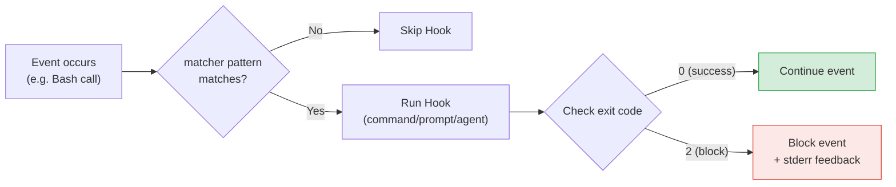
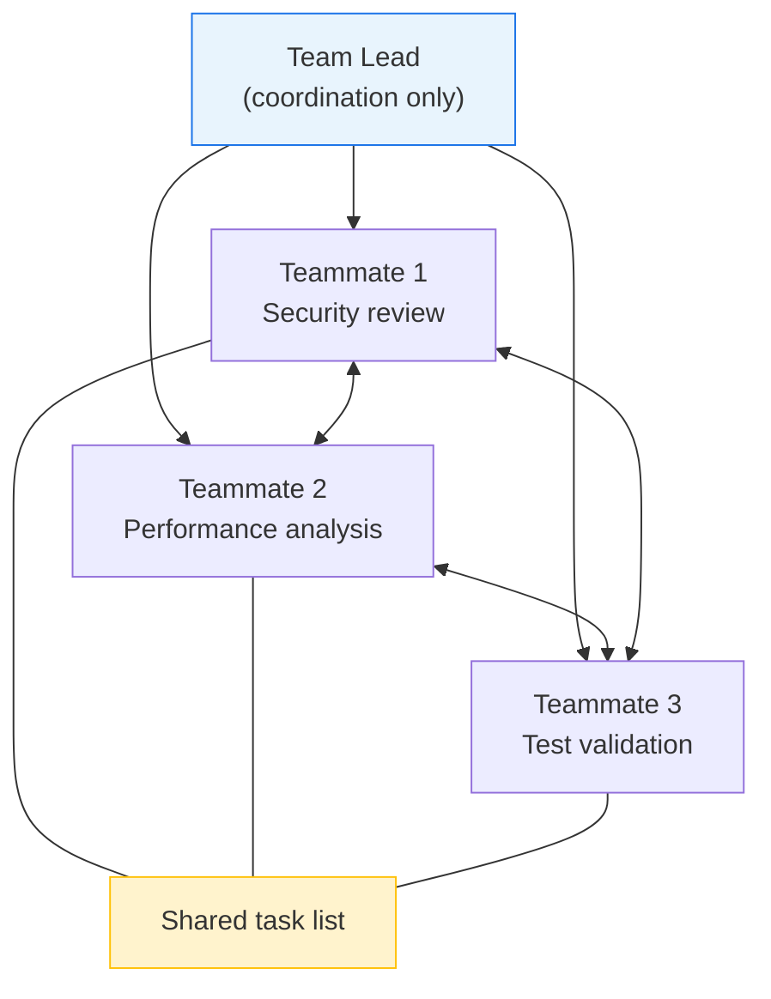
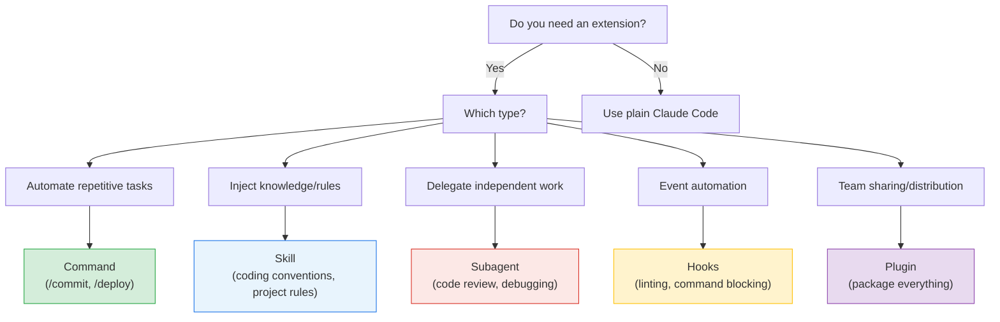

# 1. Overview

In the previous article, [Claude Code 확장 기능 완벽 가이드: Command, Skill, Subagent](/article/claude-code-확장-기능-완벽-가이드-command-skill-subagent), we covered the concepts and practical usage of Claude Code's three core extension features: Command, Skill, and Subagent. In this article, **without overlap**, we organize new content centered on the next steps: **Hooks** (event-driven automation) and the **Plugin system** (packaging and distributing extensions).

## 1.1 Standalone Configuration vs Plugin

Individual extensions can be configured directly in the `.claude/` directory and used immediately. However, if you want to share them with your team or distribute them to the community, packaging them as a **Plugin** is more efficient.

| Criteria | Standalone Configuration | Plugin |
|------|-----------|--------|
| **Suitable for** | Personal workflows, project-specific | Team sharing, community distribution |
| **Version control** | Managed directly with Git | `version` field in `plugin.json` |
| **Namespace** | None (name collisions possible) | Separated with `/plugin-name:skill-name` format |
| **Install/update** | Manual copy | One-click via `/plugins` command |
| **MCP/LSP integration** | Requires separate setup | Bundled in Plugin and distributed at once |

> In this article, we first cover the concept and practical usage of Hooks, then explain how to package all extensions into one with the Plugin system.

# 2. Hooks (Event-Driven Automation)

## 2.1 What Are Hooks

Hooks are an automation mechanism that executes **deterministically** in response to specific Claude Code events. The key point is that, rather than relying on the LLM's judgment, they **always behave identically** according to predefined rules.

Key characteristics:
- **Deterministic execution**: The LLM does not decide "whether or not" to run. If conditions match, it always executes
- **Event-driven**: Can intervene at 14 points such as before/after tool calls, session start/end, etc.
- **Blocking capability**: Certain Hooks can block dangerous operations before they execute
- **Three handler types**: shell command (`command`), LLM single turn (`prompt`), subagent (`agent`)

For example, if you want to "prevent accidentally running `rm -rf /`," you could write "do not use rm -rf" in CLAUDE.md, but the LLM may ignore it. With Hooks, you can inspect the command before the Bash tool call and block it with **100% certainty**.



## 2.2 The 14 Hook Events

Claude Code provides 14 events across the full session lifecycle. Each event falls into one of two categories depending on **whether it can block**.

| Event | When it fires | Blockable | Main use |
|---|---|---|---|
| `SessionStart` | On session start/resume | No | Environment initialization, logging |
| `UserPromptSubmit` | On user prompt submission | Yes | Input validation, prompt transformation |
| `PreToolUse` | Before a tool call | Yes | Block dangerous commands, validate input |
| `PermissionRequest` | When permission dialog is shown | Yes | Auto-approve/deny |
| `PostToolUse` | After a tool call succeeds | No | Linting, formatting, logging |
| `PostToolUseFailure` | After a tool call fails | No | Error logging, recovery attempts |
| `Notification` | When a notification is sent | No | Notification customization |
| `SubagentStart` | When a subagent is created | No | Monitoring, logging |
| `SubagentStop` | When a subagent ends | Yes | Result validation |
| `Stop` | When Claude finishes a response | Yes | Task completion validation, post-processing |
| `TeammateIdle` | When a teammate agent is idle | Yes | Assign additional work |
| `TaskCompleted` | When a task is marked complete | Yes | Validate completion criteria |
| `PreCompact` | Before context compaction | No | Save information before compaction |
| `SessionEnd` | When a session ends | No | Cleanup tasks, final logging |

When a Hook returns exit code `2` on a **blocking** event, that operation is aborted and the contents of stderr are passed to Claude as feedback.

Common fields in the stdin JSON passed to a Hook:

```json
{
  "session_id": "abc123",
  "cwd": "/home/user/my-project",
  "hook_event_name": "PreToolUse",
  "tool_name": "Bash",
  "tool_input": {
    "command": "npm test"
  }
}
```

## 2.3 How to Configure Hooks

### 2.3.1 Configuration Format

Hooks are configured in JSON format. The structure is `event → matcher → hooks array`.

```json
{
  "hooks": {
    "PreToolUse": [
      {
        "matcher": "Bash",
        "hooks": [
          {
            "type": "command",
            "command": "bash .claude/hooks/block-dangerous-commands.sh"
          }
        ]
      }
    ],
    "PostToolUse": [
      {
        "matcher": "Write|Edit",
        "hooks": [
          {
            "type": "command",
            "command": "bash .claude/hooks/auto-lint.sh"
          }
        ]
      }
    ]
  }
}
```

### 2.3.2 matcher Patterns

`matcher` is a regular expression pattern that filters which tool names the Hook reacts to.

| matcher pattern | Description |
|---|---|
| `"Bash"` | Reacts only to the Bash tool |
| `"Write\|Edit"` | Reacts to the Write or Edit tool |
| `"mcp__.*"` | Reacts to all MCP tools |
| `"mcp__memory__.*"` | Reacts to all tools of the memory MCP server |
| `null` (omitted) | Reacts to all tools of that event |

### 2.3.3 Configuration Locations & Scope

Hooks can be configured in 4 locations, each with a different scope of application.

| Location | File path | Scope | Team sharing |
|---|---|---|---|
| **User global** | `~/.claude/settings.json` | All projects | No |
| **Project** | `.claude/settings.json` | Current project | Yes (Git commit) |
| **Project local** | `.claude/settings.local.json` | Current project | No (gitignore) |
| **Plugin** | `<plugin>/hooks/hooks.json` | When Plugin is enabled | Yes |

Hooks from all scopes are merged and executed. If multiple Hooks are configured for the same event, they all run in order.

## 2.4 The Three Hook Handler Types

When a Hook is triggered, you can choose among 3 handlers depending on **what to execute**.

### 2.4.1 command (Shell Command)

The most basic handler, which directly runs a shell command. Event data is passed **as JSON via stdin**.

```json
{
  "type": "command",
  "command": "bash .claude/hooks/block-rm.sh"
}
```

- **exit code 0**: Success (event continues)
- **exit code 2**: Block (blocking events only). stderr content is passed to Claude as feedback
- **stdout output**: Passed to Claude as additional context (useful in non-blocking Hooks)
- **Timeout**: Default 600 seconds, adjustable via the `timeout` field (prompt is 30 seconds, agent is 60 seconds)
- **Async execution**: Setting `"async": true` proceeds without waiting for the Hook to complete
- **Environment variables**: `$CLAUDE_PROJECT_DIR` (project root) and `${CLAUDE_PLUGIN_ROOT}` (Plugin root) are available

### 2.4.2 prompt (LLM Single Turn)

A handler that requests a single-turn evaluation from the LLM. It analyzes and judges the event data without using tools.

```json
{
  "type": "prompt",
  "prompt": "Review the result of the following task and judge whether the goal was achieved. If not achieved, tell me what is missing."
}
```

- The LLM receives the event context and generates a single response
- Since it cannot use tools, it is suitable for **reading/analysis** purposes
- Useful when combined with the `Stop` event to judge whether a task is complete

### 2.4.3 agent (Subagent Multi-Turn)

A handler that creates a subagent to perform multi-turn validation tasks.

```json
{
  "type": "agent",
  "prompt": "Read the file that was just modified, check the code style guide, and report any violations."
}
```

- The subagent can use tools to read files, search, etc.
- More costly than `prompt`, but suitable for complex validation
- Useful when you need to read and analyze multiple files

| Handler | Execution method | Tool use | Cost | Suitable for |
|--------|-----------|-----------|------|-------------|
| `command` | Directly runs a shell command | None | Minimal | Linting, formatting, simple validation |
| `prompt` | LLM single-turn evaluation | None | Medium | Judging task completion, evaluating results |
| `agent` | Subagent multi-turn | Yes | High | File inspection, complex validation |

## 2.5 Practical Examples

### 2.5.1 Blocking Dangerous Commands (PreToolUse + Bash)

Block dangerous commands like `rm -rf /` and `git push --force` before the Bash tool call.

`settings.json`:

```json
{
  "hooks": {
    "PreToolUse": [
      {
        "matcher": "Bash",
        "hooks": [
          {
            "type": "command",
            "command": "bash .claude/hooks/block-dangerous-commands.sh"
          }
        ]
      }
    ]
  }
}
```

`.claude/hooks/block-dangerous-commands.sh`:

```bash
#!/bin/bash
# Event data is passed as JSON via stdin
input=$(cat)
command=$(echo "$input" | jq -r '.tool_input.command // empty')

# Check for dangerous command patterns
dangerous_patterns=(
  "rm -rf /"
  "rm -rf ~"
  "git push.*--force.*main"
  "git push.*--force.*master"
  "DROP TABLE"
  "DROP DATABASE"
)

for pattern in "${dangerous_patterns[@]}"; do
  if echo "$command" | grep -qE "$pattern"; then
    echo "Dangerous command blocked: $command" >&2
    echo "This command was blocked by security policy." >&2
    exit 2  # exit code 2 = block
  fi
done

exit 0  # exit code 0 = allow
```

**Behavior scenario**: When Claude tries to run `rm -rf /tmp/build`, the Hook inspects the command and allows it since it does not match a dangerous pattern. On the other hand, if it tries `git push --force origin main`, it is blocked with exit code 2, and the feedback "This command was blocked by security policy" is passed to Claude.

### 2.5.2 Auto-Linting After File Save (PostToolUse + Write|Edit)

Automatically run a linter after creating or modifying a file.

`settings.json`:

```json
{
  "hooks": {
    "PostToolUse": [
      {
        "matcher": "Write|Edit",
        "hooks": [
          {
            "type": "command",
            "command": "bash .claude/hooks/auto-lint.sh"
          }
        ]
      }
    ]
  }
}
```

`.claude/hooks/auto-lint.sh`:

```bash
#!/bin/bash
input=$(cat)
file_path=$(echo "$input" | jq -r '.tool_input.file_path // .tool_input.path // empty')

if [ -z "$file_path" ]; then
  exit 0
fi

# Run the appropriate linter based on file extension
case "$file_path" in
  *.ts|*.tsx)
    npx eslint --fix "$file_path" 2>/dev/null
    ;;
  *.py)
    ruff check --fix "$file_path" 2>/dev/null
    ;;
  *.go)
    gofmt -w "$file_path" 2>/dev/null
    ;;
esac

exit 0
```

**Point**: Since `PostToolUse` is a non-blocking event, returning exit code 2 does not abort the operation. The linter's results are passed to Claude via stdout.

### 2.5.3 Task Completion Validation (Stop + prompt handler)

When Claude is about to finish a response, the `prompt` handler validates whether the task is complete.

```json
{
  "hooks": {
    "Stop": [
      {
        "hooks": [
          {
            "type": "prompt",
            "prompt": "Review the task that was just completed. Comparing it to the user's original request: 1) Were all requirements met? 2) Was this a change requiring tests, but tests were not written? 3) Is anything missing? If anything is lacking, tell me specifically."
          }
        ]
      }
    ]
  }
}
```

**Behavior scenario**: When Claude processes a request like "add a function" and is about to finish its response, the `Stop` Hook asks the LLM to review. If the LLM judges that "tests are missing," that feedback is passed to Claude, which then continues with additional work.

### 2.5.4 MCP Tool Monitoring (mcp__*__ matcher)

Monitor and log tool calls of an MCP server.

```json
{
  "hooks": {
    "PreToolUse": [
      {
        "matcher": "mcp__memory__.*",
        "hooks": [
          {
            "type": "command",
            "command": "bash -c 'echo \"[$(date)] MCP memory tool call: $(cat | jq -r .tool_name)\" >> /tmp/mcp-audit.log'"
          }
        ]
      }
    ]
  }
}
```

### 2.5.5 Asynchronous Test Execution (async: true)

After a file change, run tests asynchronously so they do not block Claude's next task.

```json
{
  "hooks": {
    "PostToolUse": [
      {
        "matcher": "Write|Edit",
        "hooks": [
          {
            "type": "command",
            "command": "bash -c 'npm test -- --related $(cat | jq -r .tool_input.file_path) &>/tmp/test-results.log'",
            "async": true,
            "timeout": 120000
          }
        ]
      }
    ]
  }
}
```

**Point**: Setting `async: true` means it does not wait until the Hook finishes executing. This is suitable for time-consuming tasks like tests.

## 2.6 Hooks Best Practices

### 2.6.1 Recommended Use Case Collection

| Use Case | Event | Handler | Description |
|----------|--------|--------|------|
| Block dangerous commands | `PreToolUse` (Bash) | `command` | Block `rm -rf /`, `git push --force main`, etc. |
| Auto lint/format | `PostToolUse` (Write\|Edit) | `command` | Auto-run ESLint, gofmt, ruff on file save |
| Enforce commit message rules | `PreToolUse` (Bash) | `command` | Block if not in Conventional Commits format |
| Protect sensitive files | `PreToolUse` (Write\|Edit) | `command` | Block edits to `.env`, `secrets.yaml`, etc. |
| Auto-run tests | `PostToolUse` (Write\|Edit) | `command` (async) | Run related tests asynchronously without blocking the workflow |
| Task completion validation | `Stop` | `prompt` | Review requirement fulfillment and missing tests |
| Code review automation | `Stop` | `agent` | Read modified files and check for style guide violations |
| API call audit log | `PreToolUse` (mcp__*) | `command` | Log MCP tool call records to a file |
| Branch protection | `PreToolUse` (Bash) | `command` | Prevent direct commits to main/master branch |
| Environment initialization | `SessionStart` | `command` | Load `.env` and verify required tools exist at session start |

### 2.6.2 Design Principles

**1. Use the command handler by default**

For tasks with clear rules, such as linting, formatting, and pattern checking, `command` is the most efficient. Use `prompt` or `agent` only when judgment is required, since they incur LLM cost.

**2. Block minimally, give clear feedback**

When blocking with exit code 2, you should specifically explain **why it was blocked** in stderr so that Claude can find an alternative.

```bash
# ❌ Bad example: blocking without a reason
echo "Blocked" >&2 && exit 2

# ✅ Good example: provide a specific reason and alternative
echo "You cannot push directly to the main branch. Create a PR from a feature branch." >&2 && exit 2
```

**3. Run heavy tasks with async**

For time-consuming tasks like running tests or validating builds, set `"async": true` so they do not block Claude's workflow.

**4. Make Hook scripts exit quickly**

Synchronous Hooks block Claude's response. Do not rely on the default timeout (command: 600 seconds); write the script itself to finish as quickly as possible.

**5. Narrow the event + matcher combination precisely**

If you omit the matcher, the Hook runs for **all** tools of that event. To reduce unnecessary execution, specify the matcher as specifically as possible.

```json
// ❌ Run lint on all tools (unnecessary)
{ "matcher": null }

// ✅ Run lint only on file-modifying tools
{ "matcher": "Write|Edit" }
```

# 3. Plugin System

## 3.1 What Is a Plugin

A Plugin is a packaging system that bundles Skills, Hooks, Agents, MCP servers, and LSP servers into **a single distribution unit**. Instead of configuring individual extensions directly, packaging them as a Plugin makes installation, updates, and sharing easy.

Key characteristics:
- **Unified packaging**: Bundles Command, Skill, Agent, Hook, MCP, and LSP into one
- **Namespacing**: Prevents name collisions with the `/plugin-name:skill-name` format
- **One-click install**: Install via the `/plugins` command or Marketplace
- **Auto-update**: Supports version management and auto-update when registered on a Marketplace
- **Scope selection**: Choose among user global, project shared, or project local

## 3.2 Plugin Structure

### 3.2.1 Directory Layout

```
my-plugin/
├── .claude-plugin/
│   └── plugin.json         # Manifest (required)
├── commands/               # Slash commands (markdown files)
│   └── deploy.md
├── skills/                 # Agent Skills
│   └── code-review/
│       └── SKILL.md
├── agents/                 # Custom subagents
│   └── reviewer.md
├── hooks/
│   └── hooks.json          # Event handlers
├── .mcp.json               # MCP server config
└── .lsp.json               # LSP server config
```

All directories are optional. You only need to include the extensions you need. The only required file is `.claude-plugin/plugin.json`.

### 3.2.2 plugin.json Manifest Schema

```json
{
  "name": "my-awesome-plugin",
  "description": "A Plugin that automates the project development workflow",
  "version": "1.0.0",
  "author": {
    "name": "Developer Name",
    "url": "https://github.com/username"
  },
  "homepage": "https://github.com/username/my-awesome-plugin",
  "repository": "https://github.com/username/my-awesome-plugin",
  "license": "MIT"
}
```

| Field | Required | Description |
|------|------|------|
| `name` | Yes | Plugin identifier (lowercase, numbers, hyphens) |
| `description` | Yes | Plugin description |
| `version` | Yes | Semantic Versioning (e.g. `1.0.0`) |
| `author` | No | Author info (`name`, `url`) |
| `homepage` | No | Plugin homepage URL |
| `repository` | No | Source code repository URL |
| `license` | No | License |

## 3.3 Plugin Development Workflow

### 3.3.1 Local Testing (--plugin-dir)

When developing a Plugin, you can test it locally right away.

```bash
# Load a single Plugin
claude --plugin-dir ./my-plugin

# Load multiple Plugins at once
claude --plugin-dir ./plugin-one --plugin-dir ./plugin-two
```

A Plugin loaded with `--plugin-dir` behaves the same as a regular installation. Skills can be invoked in the `/plugin-name:skill-name` format, and Hooks also work as configured.

### 3.3.2 Migrating Existing .claude/ Configuration to a Plugin

If you already have extensions configured in the `.claude/` directory, you can convert them to a Plugin with a simple structural transformation.

| Existing location | Plugin location |
|---|---|
| `.claude/commands/*.md` | `commands/*.md` |
| `.claude/skills/<name>/SKILL.md` | `skills/<name>/SKILL.md` |
| `.claude/agents/*.md` | `agents/*.md` |
| hooks section in `settings.json` | `hooks/hooks.json` |
| `.mcp.json` | `.mcp.json` (as is) |

Migration steps:

1. Create the Plugin directory and write `plugin.json`
2. Copy existing files into the new structure
3. Separate the hooks from `settings.json` into `hooks/hooks.json`
4. Test with `--plugin-dir`
5. Remove the existing `.claude/` configuration (optional)

## 3.4 LSP Server (Code Intelligence)

A Plugin can include an LSP (Language Server Protocol) server to provide **real-time code intelligence**. The LSP server provides Claude with features such as code diagnostics (errors, warnings), autocompletion, and go-to-definition.

### 3.4.1 .lsp.json Configuration

```json
{
  "mcpServers": {
    "typescript-lsp": {
      "command": "npx",
      "args": ["typescript-language-server", "--stdio"],
      "languages": ["typescript", "typescriptreact"]
    },
    "python-lsp": {
      "command": "pylsp",
      "args": [],
      "languages": ["python"]
    }
  }
}
```

When the LSP server is enabled, Claude can reference real-time diagnostic information when modifying code. It detects compile errors or type errors and recognizes problems before making fixes.

### 3.4.2 Official LSP Plugins

The official Anthropic Marketplace provides LSP Plugins for 11 languages.

| Plugin | Language | Required binary |
|--------|------|---------------|
| `typescript-lsp` | TypeScript/JavaScript | `typescript-language-server` |
| `pyright-lsp` | Python | `pyright-langserver` |
| `gopls-lsp` | Go | `gopls` |
| `rust-analyzer-lsp` | Rust | `rust-analyzer` |
| `clangd-lsp` | C/C++ | `clangd` |
| `jdtls-lsp` | Java | `jdtls` |
| `kotlin-lsp` | Kotlin | `kotlin-language-server` |
| `swift-lsp` | Swift | `sourcekit-lsp` |
| `csharp-lsp` | C# | `csharp-ls` |
| `php-lsp` | PHP | `intelephense` |
| `lua-lsp` | Lua | `lua-language-server` |

When an LSP Plugin is enabled, Claude automatically receives diagnostic information (errors, warnings) after modifying a file, allowing it to recognize problems without running the compiler directly.

# 4. Plugin Marketplace

## 4.1 Official Marketplace

Anthropic operates an official Plugin Marketplace (`anthropics/claude-plugins-official`), which provides curated Plugins. It is available automatically when Claude Code starts.

Characteristics of the official Marketplace:
- Includes only Plugins verified by Anthropic
- Connected by default when Claude Code is installed
- Browse and install directly via the `/plugins` command

## 4.2 Installing Plugins

### 4.2.1 /plugins Command

Running the `/plugins` command in Claude Code opens the Plugin management interface. You can search for and install Plugins from the Marketplace.

### 4.2.2 Installation Scope

When installing a Plugin, you choose one of 3 scopes.

| Scope | Description | Storage location |
|--------|------|-----------|
| **Install for you** | Use across all projects (user global) | `~/.claude/plugins/` |
| **Install for this project** | Share with project teammates | `.claude/plugins/` (Git-committable) |
| **Install locally** | Current repo, current user only | `.claude/plugins.local/` |

### 4.2.3 Installing via CLI

```bash
# Install from the Marketplace
claude plugin install <plugin-name>

# Install directly from a GitHub repo
claude plugin install github:username/repo-name

# Install from a local path
claude plugin install /path/to/local/plugin
```

### 4.2.4 Plugin Management CLI Commands

| Command | Description |
|------|------|
| `claude plugin install <plugin> [-s scope]` | Install a Plugin |
| `claude plugin uninstall <plugin> [-s scope]` | Remove a Plugin |
| `claude plugin enable <plugin> [-s scope]` | Enable a disabled Plugin |
| `claude plugin disable <plugin> [-s scope]` | Disable without removing |
| `claude plugin update <plugin> [-s scope]` | Update to the latest version |
| `claude plugin validate .` | Validate Plugin structure |

## 4.3 Creating & Distributing a Marketplace

### 4.3.1 Using a GitHub Repo as a Marketplace

A community Marketplace can be run on top of a GitHub repo. Just create a `marketplace.json` file at the repo root.

```json
{
  "name": "my-marketplace",
  "owner": {
    "name": "DevTools Team",
    "email": "devtools@example.com"
  },
  "metadata": {
    "description": "Team-only Plugin Marketplace",
    "version": "1.0.0"
  },
  "plugins": [
    {
      "name": "my-plugin",
      "description": "Plugin description",
      "source": {
        "source": "github",
        "repo": "username/my-plugin"
      },
      "tags": ["workflow", "automation"]
    },
    {
      "name": "local-plugin",
      "description": "Local path Plugin",
      "source": "./plugins/local-plugin"
    }
  ]
}
```

### 4.3.2 Registering a Marketplace

How users add a community Marketplace:

You can add it from the Marketplace tab via `/plugins` within Claude Code, or add it via the CLI.

```bash
# Add by GitHub repo
/plugin marketplace add username/marketplace-repo

# Add by Git URL (GitLab, Bitbucket, etc.)
/plugin marketplace add https://gitlab.com/org/marketplace-repo.git

# Pin to a specific branch/tag
/plugin marketplace add https://github.com/org/plugins.git#v1.0.0
```

In team projects, you can configure the Marketplace in `.claude/settings.json` so that teammates use it automatically.

```json
{
  "extraKnownMarketplaces": {
    "company-tools": {
      "source": {
        "source": "github",
        "repo": "your-org/claude-plugins"
      }
    }
  },
  "enabledPlugins": {
    "code-formatter@company-tools": true,
    "deployment-tools@company-tools": true
  }
}
```

### 4.3.3 Distribution Checklist

Things to check when distributing a Plugin:

1. Complete the `.claude-plugin/plugin.json` manifest
2. Write a `README.md` (installation, usage, configuration options)
3. Apply Semantic Versioning (match the Git tag with the `version` field)
4. Check whether sensitive information (API keys, personal paths) is included
5. Complete local testing with `--plugin-dir`
6. Push to a public GitHub repo

# 5. Agent Teams (Experimental Feature)

## 5.1 Overview

Agent Teams is an experimental feature that coordinates multiple Claude Code instances as a **team**. One session takes the role of Team Lead, distributing work, and multiple Teammates work independently before sharing their results.

The key difference from Subagent is that **direct communication between Teammates** is possible.

| Criteria | Subagent | Agent Team |
|------|----------|------------|
| **Context** | Own context, returns only the result | Fully independent instance |
| **Communication** | Reports only to the main agent | Teammates communicate directly with each other |
| **Coordination** | Managed by the main agent | Self-coordinated via a shared task list |
| **Suitable for** | Focused tasks where only the result matters | Complex tasks requiring discussion and collaboration |
| **Token cost** | Low (result summary) | High (context per instance) |



## 5.2 Enabling & Usage

### 5.2.1 Enabling

Agent Teams is disabled by default. Enable it via an environment variable or settings.json.

```json
{
  "env": {
    "CLAUDE_CODE_EXPERIMENTAL_AGENT_TEAMS": "1"
  }
}
```

### 5.2.2 Creating a Team

Request the team composition from Claude in natural language.

```
Create an agent team to review PR #142.
- 1 person responsible for reviewing security vulnerabilities
- 1 person responsible for analyzing performance impact
- 1 person responsible for verifying test coverage
Each reviews and shares the results.
```

### 5.2.3 Delegate Mode

Pressing Shift+Tab switches to Delegate mode. In this mode, the Team Lead does not modify code directly and performs **only coordination work**.

- Creating and managing Teammates
- Assigning tasks and checking status
- Relaying messages and synthesizing results
- Delegating code modification, file creation, etc. to Teammates

### 5.2.4 Display Modes

| Mode | Description | Requirements |
|------|------|----------|
| `in-process` | Run all Teammates in the main terminal | None (default) |
| `tmux` | Each Teammate runs in a separate pane | tmux or iTerm2 |
| `auto` | Split if in a tmux session, otherwise in-process | Auto-detect |

```json
{
  "teammateMode": "in-process"
}
```

## 5.3 Suitable Use Cases & Limitations

### 5.3.1 Suitable Cases

- **Research & review**: Investigate from multiple perspectives simultaneously (security, performance, UX)
- **Cross-layer work**: Assign frontend, backend, and tests to different Teammates
- **Competing-hypothesis debugging**: Verify multiple hypotheses simultaneously and have them refute each other
- **New module/feature development**: Develop independent modules in parallel

### 5.3.2 Limitations

- **No session resume**: in-process Teammates cannot be restored with `/resume` or `/rewind`
- **One team per session**: Only one team can run at a time
- **No nesting**: Teammates cannot create their own teams
- **Fixed Lead**: The session that created the team is permanently the Lead role
- **Watch for file conflicts**: If multiple Teammates modify the same file, overwrites occur
- **Token cost**: Since each Teammate needs a separate context, the cost increases significantly

# 6. Security & Enterprise Management

## 6.1 Hook Security Considerations

Hooks run with **the user's system privileges**. Therefore, you must be especially careful about security.

- **Input validation**: Always validate the JSON data passed via stdin when parsing it
- **Path traversal defense**: When handling file paths in a Hook script, prevent path traversal attacks such as `..`
- **Sensitive file protection**: Block commands that access `.env`, `.git/`, API key files, etc.
- **Timeout setting**: Set the `timeout` field to prevent infinite loops

## 6.2 Enterprise Management Settings

In an enterprise environment, IT administrators can control extensions centrally.

### 6.2.1 managed-mcp.json

IT administrators centrally deploy MCP servers across the entire organization. The organization's standard tools are provided automatically, without users having to configure them individually.

### 6.2.2 MCP Server Allow/Deny Lists

```json
{
  "allowedMcpServers": ["github", "jira", "slack"],
  "deniedMcpServers": ["*"]
}
```

- `allowedMcpServers`: List of allowed MCP servers
- `deniedMcpServers`: List of blocked MCP servers (block all with `*`, then use only the allow list)

### 6.2.3 allowManagedHooksOnly

```json
{
  "allowManagedHooksOnly": true
}
```

When this setting is enabled, all user- or project-level Hooks are ignored, and **only Hooks set by the administrator** are run. It is useful in security-critical enterprise environments.

### 6.2.4 strictKnownMarketplaces

```json
{
  "strictKnownMarketplaces": true
}
```

When this setting is enabled, Plugins can be installed only from Marketplaces approved by the administrator. It prevents installing Plugins from unknown sources.

# 7. Conclusion

Including the Command, Skill, and Subagent covered in the previous article, when we put together Claude Code's 5 extension mechanisms, you can choose among them depending on the situation as follows.



| Extension mechanism | One-line summary | Suitable for |
|---|---|---|
| **Command** | "Run this procedure" | Standardized tasks you repeat daily |
| **Skill** | "Refer to this knowledge" | Coding rules, project guidelines |
| **Subagent** | "Leave it to this expert" | Independent analysis, need for isolated execution |
| **Hooks** | "Automatically react to this event" | Linting, security checks, deterministic validation |
| **Plugin** | "Bundle everything and distribute it" | Team sharing, community distribution, Marketplace |

Summarizing the growth path in practice:

1. **Start with Command**: Automate repetitive tasks as slash commands
2. **Inject knowledge with Skill**: Teach Claude your project rules
3. **Delegate with Subagent**: Separate independent work to specialized agents
4. **Automate with Hooks**: Add event-driven deterministic validation
5. **Package with Plugin**: Bundle all extensions into one and share with your team

# 8. References

- [Claude Code Hooks Reference](https://code.claude.com/docs/en/hooks)
- [Claude Code Hooks Guide](https://code.claude.com/docs/en/hooks-guide)
- [Claude Code Plugins](https://code.claude.com/docs/en/plugins)
- [Claude Code Plugins Reference](https://code.claude.com/docs/en/plugins-reference)
- [Discover and Install Plugins](https://code.claude.com/docs/en/discover-plugins)
- [Plugin Marketplaces](https://code.claude.com/docs/en/plugin-marketplaces)
- [Agent Teams](https://code.claude.com/docs/en/agent-teams)
- [Claude Code Official Plugin Marketplace Guide](https://www.petegypps.uk/blog/claude-code-official-plugin-marketplace-complete-guide-36-plugins-december-2025)
- [Improving your coding workflow with Claude Code Plugins](https://composio.dev/blog/claude-code-plugin)
- [Claude Code Agent Teams - Addy Osmani](https://addyosmani.com/blog/claude-code-agent-teams/)
- [From Tasks to Swarms: Agent Teams](https://alexop.dev/posts/from-tasks-to-swarms-agent-teams-in-claude-code/)
- [Claude Code 확장 기능 완벽 가이드: Command, Skill, Subagent](/article/claude-code-확장-기능-완벽-가이드-command-skill-subagent)
