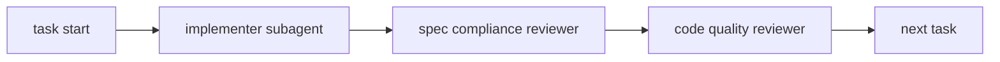

# 1. Overview

When you write code with Claude Code, there's one recurring frustration. You start out clean, but at some point the context becomes scattered, you lose track of how far you've gotten, and it becomes ambiguous where the tests should stop and restart. Give the AI autonomy and it gets improvisational; try to control it and a human has to step in at every turn.

**Superpowers is a plugin that structures this flow.** It organizes ideas into a spec with brainstorm, decomposes them into work-unit plans with writing-plans, goes through per-phase implementation + automatic review with subagent-driven-development, runs a final check with requesting-code-review, and handles PR/cleanup with finishing-a-development-branch—these five stages are bundled into one complete workflow.

In this article, I'll lay out the core superpowers skills all at once, then walk step by step through an actual case where I built an Echo + React Todo web app from scratch all the way to PR/merge. At the end, I've added a separate honest-review section based on actually using it, so colleagues considering adoption can weigh cost vs. value.

> This article assumes a reader who is reasonably familiar with Claude Code itself and the Skill/Plugin concepts. If any concept is new to you, it helps to first read [Complete Guide to Claude Code Extensions: Command, Skill, Subagent](/articles/claude-code-확장-기능-완벽-가이드-command-skill-subagent) and [Complete Guide to Claude Code Plugin Hooks](/articles/claude-code-plugin-hooks-완벽-가이드).

# 2. What Is Superpowers

Superpowers is a plugin officially registered in the [Claude Code plugin marketplace run by Anthropic](https://www.anthropic.com/engineering/claude-code-plugins). Unlike an ordinary plugin that provides a single function, its distinguishing feature is that it provides **a bundle of multiple skills + a workflow in which the skills are invoked in a defined order**.

Where the existing [Skill guide](/articles/claude-code-확장-기능-완벽-가이드-command-skill-subagent) explains "what each skill is and when it's invoked," this article steps up one level to cover **in what order multiple skills are woven together to form a single cycle**.

# 3. Core Skill Catalog

There are many skills inside Superpowers, but the core ones that form the full cycle are eight. Let's first skim them all at once, then look at each skill one paragraph at a time.

| Skill | Role | Input → Output | Coverage Depth |
|---|---|---|---|
| brainstorming | idea → spec | natural language → spec.md | deep (section 5) |
| writing-plans | spec → plan | spec.md → plan.md | deep |
| subagent-driven-development | plan → code (subagent) | plan.md → commit | deep |
| executing-plans | plan → code (inline) | plan.md → commit | brief (alternative) |
| requesting-code-review | code → review | branch/commit → review comments | medium |
| test-driven-development | enforces TDD every phase | explicit Red→Green | brief |
| using-git-worktrees | isolated worktree | feature-work isolation | brief |
| finishing-a-development-branch | wrap-up | work complete → PR/cleanup | medium |

## 3.1 brainstorming

A skill invoked with `/superpowers:brainstorming`. It takes an idea expressed in natural language and asks the user one multiple-choice question at a time, organizing it into spec.md. It saves the decisions to `docs/superpowers/specs/YYYY-MM-DD-<topic>-design.md` and commits them.

The key is "one question at a time." Rather than dumping the stack, feature scope, libraries, and tone all at once, it proceeds like a decision tree. For visual decisions like UI design, it can also bring up a visual companion (browser mockup comparison).

## 3.2 writing-plans

Once the spec is complete, `superpowers:writing-plans` is invoked automatically. It decomposes the spec into per-phase tasks and explicitly writes the following five steps for each task.

1. Write a failing test
2. Confirm the test fails (Red)
3. Minimal implementation
4. Confirm the test passes (Green)
5. Commit

Each task is one commit unit, usually 2-5 minutes of work. The plan is saved to `docs/superpowers/plans/YYYY-MM-DD-<topic>-plan.md`.

## 3.3 subagent-driven-development

Once the plan is ready, two execution options are presented. **subagent-driven** dispatches a new subagent for each task to isolate context. A single task goes through the following flow.

1. **Implementer subagent** — receives the task instructions, writes code, tests, self-reviews, and commits
2. **Spec compliance reviewer subagent** — verifies the implementation matches the spec exactly
3. **Code quality reviewer subagent** — checks code quality, test gaps, and pitfalls

All three stages must pass before moving to the next task. If a review finds an issue, the implementer is called again to fix → re-review. With no context contamination, one subagent is responsible for one task.

## 3.4 executing-plans (alternative)

An alternative that runs the same plan inline within the same session. At each step it directly updates the checkbox in the plan file to `- [x]` as it proceeds. There's no subagent dispatch cost, but also no context isolation, so on large work context contamination can accumulate.

Selection criteria:
- subagent-driven: large multi-stage work, many tasks, where the value of the review cycle is high
- executing-plans: short and simple work, where the plan file itself serves as progress tracking

## 3.5 requesting-code-review

Before the entire cycle ends, you get one more comprehensive review. It bundles all commits in the branch and checks spec compliance, regressions, pitfalls, and items needing additional tests. Comments classified as critical/important/minor come back.

## 3.6 test-driven-development

TDD is already built into the task skeleton of writing-plans, so a separate invocation is rare. But it guides the implementer subagent to consciously follow the TDD cycle. The key is confirming, in the Red stage, that the test really fails.

## 3.7 using-git-worktrees

Before starting large work, it creates an isolated worktree so the current working directory isn't affected. It's often omitted for a single learning cycle, but it's recommended in real-world environments where you work on multiple features simultaneously.

## 3.8 finishing-a-development-branch

Invoked at the very end after all tasks are done. It presents the following as structured options.
- choose among merge / PR / keep a separate branch
- automatic push policy
- branch cleanup

In this article's case, I didn't invoke this skill explicitly; following the user's global policy (no arbitrary push) I ran `gh pr create` + `gh pr merge` directly—I'll revisit this in the review section.

# 4. The Full Cycle Flow

It becomes clear when you see, in a diagram, the order in which the core skills are woven together.


Each arrow means an automatic invocation. When brainstorming finishes writing the spec, after user approval it automatically calls writing-plans, and once the plan is written the user chooses the execution mode (subagent-driven or executing-plans). At the end, finishing-a-development-branch presents the PR/merge options.

## 4.1 Points of User Intervention

Across the entire flow, the points where the user must decide are as follows.

| Point | What | Common Question Received |
|---|---|---|
| 1. During brainstorm | stack/feature scope/libraries | multiple choice like "which of A/B/C?" |
| 2. Spec review | whether to approve the spec document | "anything to change?" |
| 3. Plan review (optional) | approve the plan document | "shall we run it right away?" |
| 4. Execution mode | subagent-driven vs executing-plans | "which way?" |
| 5. Applying review comments | handling spec/quality review issues | "OK to proceed with the fixup?" |
| 6. Wrap-up | PR / push / merge approval | "shall I push now?" |

Outside these six points, it's almost all automatic. Because the points requiring human time are clear, the workflow's predictability is high.

## 4.2 Tracking Method (subagent-driven vs executing-plans)

Progress tracking happens in one of two places.

- **subagent-driven**: an in-memory task list via TaskCreate/TaskUpdate. The `- [ ]` checkboxes in the plan file are not updated.
- **executing-plans**: marking directly by editing the plan file to `- [x]`. The plan file itself is the progress tracker.

The result is the same, but the artifacts differ. Because this article's case used subagent-driven, the plan file remained `- [ ]` to the end—I'll revisit this in the review section.

## 4.3 Directory Structure

The work output is organized into the following form.

```
project/
├── docs/superpowers/
│   ├── specs/YYYY-MM-DD-<topic>-design.md   # brainstorming output
│   └── plans/YYYY-MM-DD-<topic>-plan.md     # writing-plans output
├── (actual code)
└── (tests)
```

The specs/plans are included together in the PR and become a permanent reference. Since the intent and steps of the work are recorded next to the code, even when you look back six months later it's easy to trace "why did I do it this way."

# 5. Case Study: A Todo Web App from Scratch to PR (Echo + React)

This section is the core of this guide. It walks step by step through the actual flow of building a learning Todo web app from brainstorm to PR/merge under `ai/superpowers/todo/` in the `tutorials-go` repository. The resulting PR is [#701](https://github.com/kenshin579/tutorials-go/pull/701).

Laying out the whole flow in advance:


Let's look at what command started each stage and what artifacts it left behind.

## 5.1 Brainstorming — Up to Writing the Spec

It starts with a single line, `/superpowers:brainstorming`. You pass a natural-language idea as the argument.

```
/superpowers:brainstorming I want to write sample code for a todo web application.
- stack: react, golang 1.25, inmemory
- I want to write the sample code here: /Users/user/src/workspace_blog3/tutorials-go/ai/superpowers
Note: the main purpose is to learn how to use superpowers
```

The skill immediately checks the context (go.mod, sibling directories, existing conventions), then presents multiple choices one question at a time. An excerpt of the actual questions received:

| # | Question | Options |
|---|---|---|
| 1 | Feature scope | A minimal / B basic / C extended |
| 2 | Backend framework | A net/http / B chi / C gin or echo |
| 3 | Go module structure | A root module / B sub-module / C downgrade |
| 4 | Frontend stack | Vite + React + TS or JS |
| 5 | BE/FE integration | A separate + Vite proxy / B CORS / C static serving |
| 6 | Test coverage | A BE full + FE smoke / B both full / C BE only |
| 7 | Filter/sort location | A server-side / B client-side |

Each question shows a recommendation (one of A/B/C) along with an explanation of the trade-offs. After passing the 7 questions, a 9-section spec.md (`2026-04-30-todo-app-design.md`, 600+ lines) is generated automatically, ambiguities are reinforced inline via self-review, and then a user review gate opens.

Once approved, the next skill is invoked automatically.

## 5.2 Writing-plans — Decomposing the Plan into 11 Phases

`superpowers:writing-plans` reads the spec and creates a task-unit plan. In the Todo case, it was decomposed into the following 11 stages.

| Phase | Content | TDD Applied |
|---|---|---|
| Pre-flight | feature branch + spec/plan commit | — |
| 0 | directory/Makefile/.gitignore + backend main.go stub + Vite setup | — |
| 1 | domain model (Priority/Todo/Validate) | ✅ |
| 2.1 | Store CRUD + concurrency verification | ✅ |
| 2.2 | Store List filter/sort | ✅ |
| 3.1~3.3 | Handler Create/Delete/List/Update + writeError | ✅ |
| 4 | Echo server integration + httptest | ✅ |
| 5 | FE infrastructure (types/api/MSW) | — |
| 6 | useTodos hook | ✅ |
| 7 | TodoForm/FilterBar/TodoItem/TodoList | smoke |
| 8 | App integration + e2e | ✅ |
| 9 | README + manual verification | — |
| 10 | invoke code-review skill + create PR | — |

Each phase is one commit unit, averaging 5-10 minutes of work. The plan ran about 3500 lines, specifying the code/commands/expected output of every step.

## 5.3 Subagent-driven-development — 25 commits, two-stage review

This is the heart of the cycle. The following flow repeats for every phase.



All three subagents operate on the same task in independent contexts. In the actual case, there were two instances where this structure caught a critical issue.

**Case ① — Phase 1 Korean length validation (caught by the TDD reviewer)**

In the domain model's `NewTodo.Validate()`, the title length was being checked with `len()`, and the code quality reviewer pointed out the following.

> `todo.go:60` — Title length uses `len()` (bytes), not runes. A 100-character Korean title is 300 bytes, so it gets rejected. In this project where Korean content is a first-class concern, this is a bug.

I called the implementer again to add `utf8.RuneCountInString` + Korean boundary tests (200 chars valid / 201 chars invalid).

**Case ② — Phase 10 DueDate pointer aliasing (caught by the final reviewer)**

In the final review of the entire branch, the following was found.

> `store.go:39, 82` — `Add`/`Update` store the caller's `*time.Time` pointer as-is. The package GoDoc promises "callers cannot mutate stored state through returned references," but this promise is broken.

I added a defensive copy (a `copyTimePointer` helper) and included regression tests (`TestStore_Add_DueDateNotAliased`, `TestStore_Update_DueDateNotAliased`) along with it.

An excerpt of the representative commit flow:

| Phase | Commit | Notes |
|---|---|---|
| Pre-flight | `[feat/todo-app] docs: add spec and implementation plan` | feat/todo-app branch start |
| 0.1 | `chore: project skeleton (README, Makefile)` | — |
| 1 | `feat: domain model (Priority, Todo, NewTodo, Patch, Validate)` | TDD Red→Green |
| 1 fixup | `fix: count title length by rune, not byte (Korean support)` | applying reviewer comment |
| 2.1 | `feat: in-memory Store CRUD (Add/Get/Update/Delete)` | sync.RWMutex |
| 4 | `feat: Echo server integration (routing/middleware/CORS) + httptest integration tests` | backend complete |
| 6 | `feat: useTodos hook (useReducer + create/update/remove + auto refetch)` | FE core |
| 8 | `feat: App assembly + integration scenario tests (MSW full round-trip)` | FE integration |
| 10 fixup | `fix: Store defensively copies DueDate pointer to block external mutation` | final reviewer comment |

A total of 25 commits piled up on the feat/todo-app branch.

## 5.4 Creating and Merging the PR

Branch push + PR creation + merge are each one line of command.

```bash
# push
git push -u origin feat/todo-app

# create PR (HEREDOC per CLAUDE.md policy)
gh pr create --title "feat: superpowers todo app (learning sample)" \
  --body "$(cat <<'EOF'
## Summary
- Echo + React + in-memory Todo web application (for learning)
- fully experienced the superpowers plugin skill cycle
... (omitted)
EOF
)" --assignee kenshin579

# merge
gh pr merge 701 --merge --delete-branch
```

Result: [PR #701](https://github.com/kenshin579/tutorials-go/pull/701) merged, integrated into master. From the start of work to merge, it finished within a single session.


# 6. Getting Started

The procedure needed to adopt superpowers for the first time is short.

## 6.1 Installing the Plugin

Install it via the marketplace in Claude Code.

```bash
/plugin install superpowers@anthropic
```

(Check the exact command on the [Anthropic Plugin Marketplace page](https://www.anthropic.com/engineering/claude-code-plugins). The channel/name may differ depending on the point in time.)

After installation, you're good if you see slash commands starting with `/superpowers:` in a new session.

## 6.2 Starting the First Cycle

```bash
/superpowers:brainstorming <a line or two of the idea in natural language>
```

After that, just follow this flow as-is.

1. Answer 7-10 multiple-choice questions
2. Review the auto-generated spec.md (you can request 1-2 rounds of changes)
3. Run the automatically invoked writing-plans
4. Review the generated plan.md
5. Choose the execution mode (subagent-driven recommended)
6. Implementation proceeds automatically (occasionally enter additional context when it gets stuck)
7. Apply the final review comments
8. Create the PR (after user approval)

## 6.3 Recommended Preparation

- **Spell out the CLAUDE.md policy**: if you write your push/PR automation policy in CLAUDE.md, the skill respects it (e.g., "DO NOT push without explicit consent").
- **Code convention rules**: if you write code-style/test conventions in `.claude/rules/*.md`, the reviewer subagent checks against them (e.g., `gofmt`, `testify/assert`, `GoDoc`, etc.).

## 6.4 Directory Structure (recap)

```
project/
├── docs/superpowers/
│   ├── specs/   # brainstorming output
│   └── plans/   # writing-plans output
├── code/
└── tests/
```

Commit the specs/plans together with the PR to leave them as a permanent reference. When you look back six months later, the answer to "why did I structure it this way" is right there.

# 7. What I Felt After Actually Trying It (honest review)

That's it for the guide-style information. This section is "observations from someone who actually ran one cycle." Please bear with a slightly informal tone.

## What I Liked

- **The entire development flow connects naturally**: previously, I had to manually write a PRD → implementation plan → todo.md separately and review markdown at each stage, which took quite a bit of time. Superpowers ties brainstorm → spec → plan → implementation → review into one flow, so each stage's output naturally becomes the input to the next, and the documentation and review cost the worker spends drops significantly
- **Almost zero context contamination**: when a task ends, the context is cleaned up along with the implementer subagent → the reason I could finish a large PR (25 commits) in one session
- **The two-stage spec/quality review pulls PR review cost inside the cycle**: critical issues that pass compilation/tests (Korean rune count, DueDate aliasing) and a regression gap (a Vitest e2e config bug) were all discovered and fixed mid-cycle

## Costs and Trade-offs

- **Token usage ramps up fast**: each task accumulates 3 dispatches—implementer + spec/quality reviewer—so consumption is heavy. Even on the Claude Max 100x plan, I experienced hitting a rate limit mid-cycle
- **Plan file checkboxes are not auto-updated**: subagent-driven tracks via an in-memory task list, and plan.md stays `- [ ]` to the end. If you want to use the plan as a permanent tracker, executing-plans is a better fit

## Recommended Application Scenarios

In short: **most powerful for multi-stage + multi-area work**; for a single-file edit, a regular slash command is faster.

| Fit | Work Type | Reason |
|---|---|---|
| ✅ Very good | multi-stage feature implementation, domain + API + UI all at once | phase separation keeps context clean, TDD applies naturally |
| ✅ Good | redesign/refactoring | the two-stage review quickly catches regression risk |
| ✅ Good | learning/onboarding material | the cycle itself becomes reproducible learning material |
| 🟡 Average | small changes to one or two files | dispatch cost is large relative to value—controller-level handling is enough |
| ❌ Unsuitable | one-line fix, simple typo | only formalism cost arises |
| ❌ Unsuitable | deep debugging (debugger step-through) | superpowers does combine with debugging skills, but the cycle skeleton itself doesn't suit debugging |

# 8. Conclusion

Run one cycle of Superpowers and one thing becomes clear. **The efficiency of AI coding is influenced more by workflow structure than by the quality of individual prompts.** With the same model and the same code-writing ability, forcing the flow of brainstorm → plan → impl → review → finish substantially raises the consistency and regression stability of the output.

Three lines of key takeaways:

1. **It's powerful for multi-stage work.** The scenario of building Domain + API + UI all at once is the sweet spot. For a one-line fix, it's overkill.
2. **The two-stage review catches issues that were invisible.** Even when compilation/tests pass, the promise between spec and code can be broken, and the reviewer verifies that.
3. **It's very good as learning/onboarding material.** The cycle itself remains in spec/plan in a reproducible form.

Things worth trying next:

- isolate multiple work with `using-git-worktrees`
- inline execution with `executing-plans` (auto-updating plan checkboxes)
- formally invoke the `finishing-a-development-branch` skill to be presented with PR/cleanup options

These three are the parts missing from this case, so I'll cover them separately in a follow-up article, or I'd love to hear the experiences of those who have tried them directly.

# 9. References

- [Anthropic Claude Code official docs](https://docs.claude.com/en/docs/claude-code)
- [Claude Code Plugin Marketplace guide](https://www.anthropic.com/engineering/claude-code-plugins)
- This case's PRs: [tutorials-go #701 (full Todo implementation)](https://github.com/kenshin579/tutorials-go/pull/701), [#702 (FE theme redesign)](https://github.com/kenshin579/tutorials-go/pull/702)
- [Complete Guide to Claude Code Extensions: Command, Skill, Subagent](/articles/claude-code-확장-기능-완벽-가이드-command-skill-subagent)
- [Complete Guide to Claude Code Plugin Hooks](/articles/claude-code-plugin-hooks-완벽-가이드)
- [Claude Code MCP Recommendation Guide](/articles/claude-code-mcp-추천-가이드)
