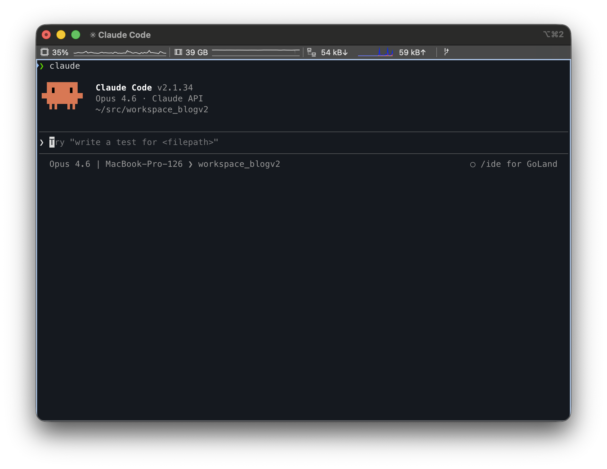
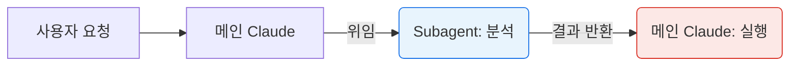
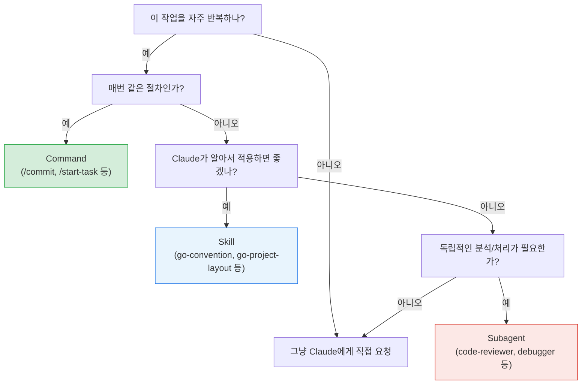

# 1. 개요



Claude Code는 Anthropic에서 만든 AI 기반 CLI 도구로, 터미널에서 직접 코드를 읽고 수정하며 다양한 개발 작업을 수행할 수 있다. 단순한 질문-응답을 넘어 파일 탐색, 코드 수정, Git 작업, 테스트 실행까지 자율적으로 처리하는 에이전트형 코딩 도구이다.

Claude Code를 기본 설정 그대로 사용해도 충분히 생산적이지만, 반복적인 작업 패턴이 생기거나 프로젝트별 규칙을 적용하고 싶을 때는 **확장 기능**이 필요하다. Claude Code는 이를 위해 세 가지 핵심 메커니즘을 제공한다.

| 구분 | Custom Commands | Skills | Subagents |
|------|----------------|--------|-----------|
| **정의** | 재사용 가능한 프롬프트 단축키 | 지식/가이드라인을 주입하는 확장 시스템 | 독립된 컨텍스트에서 작업하는 전문 에이전트 |
| **위치** | `.claude/commands/` | `.claude/skills/<name>/SKILL.md` | `.claude/agents/<name>.md` |
| **호출** | `/name` (사용자 수동) | `/name` (수동) + 자동 호출 가능 | Claude가 자동 위임 또는 사용자 요청 |
| **실행 컨텍스트** | 메인 대화 (인라인) | 메인 대화 (인라인), `context: fork` 시 분리 | 별도 컨텍스트 윈도우 (격리) |
| **도구 제한** | 없음 | `allowed-tools`로 제한 | `tools`/`disallowedTools`로 세밀한 제어 |
| **병렬 실행** | 불가 | 불가 | 가능 (여러 subagent 동시 실행) |

이 세 가지는 비슷해 보이지만 **문제를 쪼개는 방식 자체가 다르다**. 이 글에서는 각각의 개념, 설정 방법, 실전 예제를 정리하고 언제 무엇을 선택해야 하는지를 다룬다.

> 이 글에서 사용하는 예제 코드는 [tutorials-go/.claude](https://github.com/kenshin579/tutorials-go/tree/master/.claude) 저장소에서 확인할 수 있다.

# 2. Command (슬래시 커맨드)

## 2.1 개념

Command는 사용자가 `/`를 입력하여 직접 실행하는 프롬프트 템플릿이다. 자주 반복하는 작업을 하나의 명령으로 저장해두고 필요할 때 호출하는 **단축키** 역할을 한다.

핵심 특징:
- **사용자가 직접 호출** (`/commit`, `/plan-task` 등)
- **일회성 실행**: 호출 시점에 프롬프트가 주입되어 Claude가 즉시 실행
- **인자 전달 가능**: `/command arg1 arg2` 형태로 파라미터 전달
- **자동완성 지원**: `/`을 입력하면 사용 가능한 커맨드 목록이 표시됨
- **메인 대화 컨텍스트에서 인라인 실행** (별도 격리 없음)

### 2.1.1 저장 위치

```
~/.claude/commands/        # 글로벌 (모든 프로젝트에서 사용)
.claude/commands/          # 프로젝트 전용 (해당 프로젝트에서만 사용)
```

글로벌 커맨드는 모든 프로젝트에서 공통으로 사용하고, 프로젝트 커맨드는 `.claude/commands/` 디렉토리에 저장하여 Git으로 팀원과 공유할 수 있다.

하위 디렉토리를 사용하면 네임스페이스로 구분된다.

```
.claude/commands/
├── commit.md            # /commit
├── plan-task.md         # /plan-task
├── start-task.md        # /start-task
└── work/                # 네임스페이스 (하위 디렉토리로 명령어 그룹화)
    ├── commit-pr.md     # /work:commit-pr
    └── start-task.md    # /work:start-task
```

## 2.2 실전 예제: 반복 작업을 슬래시 한 번으로

### 2.2.1 Git Commit 자동화 (`/commit`)

Commands의 가장 기본적인 형태로, 단순한 프롬프트 템플릿이다.
코드를 수정할 때마다 `git add`, `git commit`, `git push`를 반복하는 대신, `/commit` 한 번으로 변경사항 분석부터 커밋 메시지 생성, push까지 자동화할 수 있다.

`.claude/commands/commit.md`:

```markdown
## 목적
수정한 파일을 commit하고 원격 저장소에 push한다

## 실행 단계
1. `git status`로 변경 사항 확인
2. 현재 브랜치가 main/master인 경우:
   - `feature/{작업내용요약}` 형식으로 새 브랜치 생성
3. 변경 파일 staging (`git add`)
4. commit 메시지 작성 (conventional commits 형식)
5. 원격 저장소에 push

## 규칙
- main/master 브랜치에는 직접 commit 금지
- commit 메시지 형식: `type: 간단한 설명`
  - type: feat, fix, docs, refactor, test, chore 등
```

**사용법**: 코드를 수정한 후 `/commit` 입력하면 Claude가 변경사항을 분석하고 conventional commit 메시지를 자동 생성하여 커밋한다.

### 2.2.2 PRD에서 구현 문서 생성 (`/plan-task`)

`$ARGUMENTS`를 활용하여 인자를 받는 Command 예제이다.
PRD(요구사항 문서)를 작성한 후 구현 문서와 todo 체크리스트를 매번 수작업으로 만드는 대신, PRD 경로만 넘기면 Claude가 분석하여 자동으로 생성해준다.

`.claude/commands/plan-task.md`:

```markdown
## 목적
$ARGUMENTS(요구사항 파일)를 기반으로 구현 문서와 todo 체크리스트를 생성한다

## 인자
- $ARGUMENTS: 요구사항 파일 경로 (예: docs/start/1_feature_prd.md)

## 실행 단계
1. 요구사항 파일($ARGUMENTS) 읽기 및 분석
2. 구현 문서 생성 ({순서}_{기능명}_implementation.md)
   - 핵심 구현 사항만 포함
   - 향후 계획, 확장 가능성 등 불필요한 내용 제외
3. todo 체크리스트 생성 ({순서}_{기능명}_todo.md)
   - 단계별로 나눠서 작성
   - 각 항목은 체크박스 형식 (- [ ])

## 파일 생성 규칙
- 요구사항 파일과 같은 디렉토리에 생성
- 파일명 패턴: `{순서}_{기능명}_{문서타입}.md`

## 예시
입력: `/plan-task docs/start/1_github_action_prd.md`

출력:
- `docs/start/1_github_action_implementation.md`
- `docs/start/1_github_action_todo.md`
```

**사용법**: `/plan-task docs/start/3_claude_prd.md` 입력하면 PRD를 분석하여 구현 문서와 todo 체크리스트를 자동 생성한다.

**포인트**: `$ARGUMENTS`로 사용자 인자를 받아 동적으로 동작한다. 파일 읽기 -> 분석 -> 파일 생성의 다단계 워크플로우지만 여전히 메인 대화 컨텍스트에서 인라인 실행된다.

### 2.2.3 작업 시작 (`/start-task`)

여러 도구(GitHub MCP, Git)를 조합하는 복합 워크플로우 Command 예제이다.
새 기능 개발을 시작할 때 GitHub Issue 생성, feature 브랜치 생성, 작업 환경 세팅을 하나의 명령으로 처리한다. 단순 프롬프트를 넘어 외부 도구를 연동하는 Command의 활용 범위를 보여준다.

`.claude/commands/start-task.md`:

```markdown
## 목적
$ARGUMENTS(PRD 문서)를 기반으로 작업을 시작한다

## 인자
- $ARGUMENTS: PRD 문서 경로 (예: docs/start/3_claude_prd.md)

## 실행 단계
1. GitHub Issue 생성 (GitHub MCP 사용)
   - title: PRD 제목
   - body: PRD 내용 요약
   - assignee: kenshin579
2. master 브랜치에서 최신 코드 pull
3. 새 feature 브랜치 생성: `feature/{issue번호}-{기능명}`
4. todo 파일이 있으면 순서대로 작업 진행
5. 각 단계 완료 시:
   - 변경 사항 commit
   - todo 파일에 완료 체크 표시 (- [x])

## 규칙
- master 브랜치에 직접 commit 금지
- todo 파일의 단계별 순서 준수
- commit 메시지는 conventional commits 형식

## 예시
입력: `/start-task docs/start/3_claude_prd.md`

동작:
1. GitHub Issue #607 생성: "Claude Code Skills vs Commands vs Subagents 블로그 예제"
2. `feature/607-claude-blog-examples` 브랜치 생성
3. todo 파일 순서대로 작업 시작
```

**포인트**: `/plan-task`로 구현 문서와 todo를 생성한 후 `/start-task`로 실제 작업을 착수하는, **Command 간 워크플로우 연결**이 가능하다. GitHub MCP + Git 명령을 조합하는 복합 Command이다.

# 3. Skill (스킬)

## 3.1 개념

Skill은 Claude가 **자동으로 감지하여 로드하는 지식 패키지**이다. 사용자가 직접 호출할 수도 있지만, Claude가 현재 작업 컨텍스트를 분석하여 관련 Skill을 자동으로 활성화하는 것이 핵심 기능이다.

핵심 특징:
- **모델이 자동 호출**: 사용자가 별도로 실행하지 않아도 Claude가 관련성을 판단하여 로드
- **수동 호출도 가능**: `user-invocable: true` 설정 시 `/skill-name`으로 직접 호출
- **점진적 로딩 (Progressive Disclosure)**: 메타데이터(약 100토큰)를 먼저 스캔하고 관련 있을 때만 전체 내용(5,000토큰 이하)을 로드
- **폴더 기반 구조**: 보조 파일(템플릿, 레퍼런스, 스크립트)을 함께 패키징 가능
- **도구 제한 가능**: `allowed-tools`로 Skill이 사용할 수 있는 도구를 제한
- **격리 실행 가능**: `context: fork` 설정으로 별도 컨텍스트에서 실행 (Subagent와의 경계)

### 3.1.1 저장 위치

```
~/.claude/skills/          # 글로벌 (개인용)
.claude/skills/            # 프로젝트 전용
```

각 Skill은 독립된 폴더로 구성된다.

```
.claude/skills/
├── go-convention/
│   └── SKILL.md
├── go-project-layout/
│   └── SKILL.md
├── api-convention/
│   └── SKILL.md
└── analyze-codebase/
    └── SKILL.md
```

### 3.1.2 SKILL.md 프론트매터 필드

| 필드 | 필수 | 설명 |
|------|------|------|
| `name` | O | Skill의 고유 이름 |
| `description` | O | 용도 설명 (**자동 활성화의 핵심**) |
| `user-invocable` | X | `true`면 `/name`으로 수동 호출 가능, `false`면 Subagent 전용 |
| `allowed-tools` | X | 사용 가능한 도구 제한 (생략 시 전체 사용) |
| `context` | X | `fork` 설정 시 별도 컨텍스트에서 격리 실행 |
| `agent` | X | `context: fork` 시 사용할 에이전트 타입 |
| `model` | X | 사용할 모델 (`sonnet`, `opus`, `haiku`) |

> **`agent` 필드 참고**: 빌트인 타입으로 `Explore`(코드 탐색, 읽기 전용), `Plan`(구현 계획 리서치), `general-purpose`(범용, 기본값)를 사용할 수 있다. `.claude/agents/`에 정의한 커스텀 에이전트 이름도 지정 가능하다.

## 3.2 실전 예제: 자동으로 주입되는 프로젝트 지식

### 3.2.1 Go 코딩 컨벤션 (`go-convention`)

Skill의 핵심 기능인 "자동 호출"과 "지식 주입"을 보여주는 예제이다.
"Go 코드를 작성해줘"라고 요청하면 Claude가 `description`을 보고 자동으로 Skill을 활성화한다. 이때 SKILL.md 본문에 작성된 코딩 규칙들이 마치 시스템 프롬프트처럼 메인 대화의 컨텍스트에 로드되는데, 이것이 "지식 주입"이다. 주입된 지식은 해당 대화가 끝날 때까지 유지되므로, 이후 코드 생성이나 리뷰 시에도 별도 지시 없이 컨벤션을 자동으로 따르게 된다.

`.claude/skills/go-convention/SKILL.md`:

```markdown
---
name: go-convention
description: Go 코드를 작성하거나 리뷰할 때 프로젝트의 코딩 컨벤션을 적용합니다.
  Go 파일을 생성, 수정, 리뷰할 때 자동으로 사용됩니다.
model: haiku
user-invocable: true
allowed-tools: Read, Grep, Glob
---

## 이 프로젝트의 Go 코딩 컨벤션

### 패키지 구조
- 테스트 파일은 소스 파일과 같은 디렉토리에 위치: `*_test.go`
- mock 파일은 `mocks/` 하위 디렉토리에 생성
- 각 디렉토리는 독립적인 예제로 구성 (자체 `go.mod` 가능)

### 테스트 작성 규칙
- testify 사용: `github.com/stretchr/testify/assert`
- 테이블 기반 테스트 패턴 적용
- 테스트 함수명: `Test{함수명}_{시나리오}` 형식

### 에러 처리
- 커스텀 에러 타입은 `errors.New()` 또는 `fmt.Errorf("context: %w", err)` 사용
- sentinel 에러는 패키지 레벨 변수로 정의: `var ErrNotFound = errors.New("not found")`

### Import 정렬
- 표준 라이브러리 → 외부 패키지 → 내부 패키지 순서
- 내부 패키지 alias: underscore prefix 사용 (`_articleHttp`)
```

**동작 시나리오**:
1. **자동 호출**: 사용자가 "새로운 Go 파일을 만들어줘"라고 요청하면 Claude가 `description`의 "Go 파일을 생성, 수정"을 인식하여 자동으로 이 Skill을 로드하고 컨벤션을 적용
2. **수동 호출**: `/go-convention`으로 직접 호출하여 기존 코드가 컨벤션을 따르는지 확인

**포인트**:
- `description`에 트리거 조건이 명확하여 Claude가 상황에 맞게 **자동 호출** (Command와의 핵심 차이)
- `user-invocable: true`로 수동 호출도 가능
- 메인 대화에 지식이 주입되어 이후 작업에 **계속 영향**을 줌

### 3.2.2 Go 프로젝트 레이아웃 (`go-project-layout`)

SKILL.md 본문에서 `` !`셸 명령` `` 구문을 사용하면, Skill이 활성화되는 시점에 해당 셸 명령을 실행하고 그 결과를 본문에 삽입한다. 이를 "동적 컨텍스트"라고 한다.
예를 들어 `` !`tree project-layout/ -L 3` ``이라고 작성하면, Skill이 로드될 때마다 `tree` 명령이 실행되어 실제 디렉토리 구조가 컨텍스트에 주입된다. 정적 텍스트로 구조를 직접 적어두는 것과 달리, 프로젝트 구조가 변경되어도 항상 최신 상태를 반영한다.

셸에서 실행 가능한 명령이면 무엇이든 사용할 수 있으므로, Python 스크립트나 파이프 조합도 가능하다.

```bash
# Python 스크립트 실행
!`python3 scripts/generate_context.py`

# 파이프 조합
!`cat config.json | python3 -c "import sys,json; print(json.dumps(json.load(sys.stdin), indent=2))"`
```

> 단, Skill 활성화 시마다 실행되므로 실행 시간이 긴 스크립트는 Skill 로딩을 지연시킬 수 있다.

`.claude/skills/go-project-layout/SKILL.md`:

```markdown
---
name: go-project-layout
description: Go 프로젝트를 새로 생성하거나 구조를 변경할 때 clean architecture
  폴더 구조를 적용합니다.
model: haiku
user-invocable: true
allowed-tools: Read, Grep, Glob
---

## 참조 프로젝트 구조

아래는 이 프로젝트에서 사용하는 clean architecture 레이아웃입니다.
새 Go 프로젝트를 생성할 때 이 구조를 따르세요.

!`tree project-layout/go-clean-arch-v2 -I vendor -L 3`

## 레이어별 역할

### `cmd/`
- 애플리케이션 진입점 (`main.go`)
- DI 컨테이너 설정, 서버 시작

### `domain/`
- 핵심 비즈니스 엔티티 (struct)
- 리포지토리/유스케이스 인터페이스 정의
- 에러 타입 정의 (`errors.go`)
- mock 파일은 `domain/mocks/`에 위치

### `{도메인명}/` (예: `article/`, `author/`)
- `handler.go`: HTTP 핸들러 (Echo 라우팅)
- `usecase.go`: 비즈니스 로직 구현
- `repository.go`: 데이터 접근 구현
- `*_test.go`: 각 파일의 테스트

### `pkg/`
- `config/`: Viper 기반 설정 관리
- `database/`: DB 연결 설정
- `middleware/`: CORS, 인증 등 공통 미들웨어

## 의존성 방향
\```
cmd/ → {도메인}/ → domain/
         ↓
        pkg/
\```
- domain 패키지는 외부 의존성 없음 (순수 Go)
- 도메인별 패키지는 domain 인터페이스를 구현
- cmd/는 모든 패키지를 조립하는 역할
```

**포인트**:
- `!`(동적 컨텍스트 명령)으로 실행 시점에 **실제 프로젝트 구조를 tree로 읽어옴** - 정적 텍스트가 아니라 런타임 데이터를 참조
- `go-convention`(코딩 스타일)과 분리하여 **관심사 분리** 가능
- 나중에 `api-developer` Subagent에서 `skills: [go-project-layout]`으로 조합하여 사용

### 3.2.3 코드베이스 분석 with `context: fork` (`analyze-codebase`)

Skill이 Subagent처럼 격리된 컨텍스트에서 실행될 수 있음을 보여주는 예제이다.
`context: fork`로 별도 컨텍스트에서 실행되므로, 대량의 파일을 분석해도 메인 대화의 컨텍스트 윈도우를 소모하지 않고 결과만 반환한다.

`.claude/skills/analyze-codebase/SKILL.md`:

```markdown
---
name: analyze-codebase
description: 코드베이스 구조를 분석하고 요약합니다
model: sonnet
user-invocable: true
context: fork
agent: Explore
---

$ARGUMENTS 경로의 코드베이스를 분석하세요.

## 분석 항목
1. **디렉토리 구조**: 파일과 패키지 구성
2. **핵심 타입/인터페이스**: 주요 struct와 interface 목록
3. **의존성**: 외부 라이브러리와 내부 패키지 의존 관계
4. **테스트 현황**: 테스트 파일 유무, 테스트 패턴 (testify, testcontainers 등)
5. **진입점**: main.go 또는 주요 실행 파일

## 출력 형식
마크다운으로 요약하되, 각 파일은 `파일명:라인번호` 형식으로 참조
```

**사용법**: `/analyze-codebase golang/concurrency` 실행하면 Explore 에이전트가 별도 컨텍스트에서 해당 디렉토리를 분석하고 결과만 메인 대화에 반환한다.

**포인트**:
- `context: fork`를 사용하면 Skill이 **별도 컨텍스트에서 격리 실행**됨
- `agent: Explore`로 사용할 에이전트 타입 지정 (빠른 탐색에 최적화)
- 대량의 파일을 읽어도 메인 컨텍스트 윈도우를 오염시키지 않음
- Skills와 Subagents의 경계가 만나는 지점: **Skill 형식 + Subagent 실행 방식**

## 3.3 Skill vs CLAUDE.md

둘 다 Claude에게 지식을 제공하지만 근본적인 차이가 있다.

| 비교 항목 | CLAUDE.md | Skill |
|----------|-----------|-------|
| 로딩 시점 | 대화 시작 시 항상 로드 | 관련 작업 감지 시에만 로드 |
| 토큰 소비 | 항상 컨텍스트 차지 | 필요할 때만 소비 (점진적 로딩) |
| 구조 | 단일 파일 | 폴더 (보조 파일 포함 가능) |
| 용도 | 프로젝트 전반의 규칙, 컨벤션 | 특정 작업에 대한 전문 지식 |

**판단 기준**: 모든 대화에서 항상 필요한 규칙은 `CLAUDE.md`에, 특정 상황에서만 필요한 전문 지식은 `Skill`로 분리하는 것이 컨텍스트를 효율적으로 사용하는 방법이다.

## 3.4 자동 활성화 개선하기

Skill이 의도대로 자동 활성화되지 않는 경우, Hook을 활용하여 명시적으로 활성화를 유도할 수 있다. Hook은 `.claude/settings.json`의 `UserPromptSubmit` 이벤트에 정규식 매처를 등록하여, 사용자 입력이 패턴에 매칭되면 Claude에게 특정 Skill을 사용하도록 지시하는 방식이다.

**예제 1**: "서브에이전트 만들어줘" 같은 요청 시 `subagent-creator` Skill을 강제 활성화

```json
// .claude/settings.json
{
  "hooks": {
    "UserPromptSubmit": [
      {
        "matcher": "sub-?agent|custom agent|에이전트 만들",
        "command": "echo 'Use Skill(subagent-creator)'"
      }
    ]
  }
}
```

사용자가 "서브에이전트 만들어줘"나 "custom agent 생성"을 입력하면, Claude가 `subagent-creator` Skill을 자동으로 로드하여 에이전트 생성 절차를 안내한다.

**예제 2**: Go 테스트 관련 요청 시 `go-convention` Skill을 강제 활성화

```json
{
  "hooks": {
    "UserPromptSubmit": [
      {
        "matcher": "테스트 작성|test 추가|_test\\.go",
        "command": "echo 'Use Skill(go-convention)'"
      }
    ]
  }
}
```

"이 함수의 테스트 작성해줘"라고 요청하면, `go-convention` Skill이 강제로 로드되어 testify 사용, 테이블 기반 테스트 패턴 등의 컨벤션이 적용된다. `description`만으로 자동 활성화가 잘 안 되는 경우에 유용하다.

# 4. Subagent (서브 에이전트)

## 4.1 개념

Subagent는 **독립적인 컨텍스트 윈도우를 가진 전문 에이전트**이다. 메인 Claude가 복잡한 작업을 만나면 적절한 Subagent에게 위임하고, Subagent는 자체 컨텍스트에서 작업을 수행한 뒤 결과를 요약하여 반환한다.

핵심 특징:
- **독립 컨텍스트**: 메인 대화의 컨텍스트를 오염시키지 않음
- **역할 분리**: 코드 리뷰, 디버깅, 테스트 실행 등 전문 영역별로 분리
- **도구 제한**: `tools`/`disallowedTools`로 역할에 맞는 도구만 허용
- **모델 선택**: 작업 복잡도에 따라 다른 모델 사용 가능 (비용 절감)
- **Skill 조합**: `skills` 필드로 도메인 지식을 주입하여 전문성 강화
- **자동 위임**: `description`에 따라 Claude가 적절한 시점에 자동으로 작업 위임

### 4.1.1 저장 위치

```
~/.claude/agents/          # 글로벌 (개인용)
.claude/agents/            # 프로젝트 전용
```

각 Subagent는 하나의 `.md` 파일로 정의된다.

```
.claude/agents/
├── code-reviewer.md       # 코드 리뷰 전문가
├── debugger.md            # 디버깅 전문가
├── test-runner.md         # 테스트 실행 전문가
└── api-developer.md       # API 개발 전문가 (Skill 연동)
```

### 4.1.2 프론트매터 필드

| 필드 | 필수 | 설명 |
|------|------|------|
| `name` | O | 소문자, 하이픈 구분 |
| `description` | O | 용도와 호출 시점 (자동 위임의 핵심) |
| `tools` | X | 콤마 구분 도구 목록 (생략 시 전체 상속) |
| `disallowedTools` | X | 사용 금지할 도구 목록 (`tools`와 반대 방향 제어) |
| `model` | X | `sonnet`, `opus`, `haiku`, `inherit` |
| `permissionMode` | X | `default`, `acceptEdits`, `bypassPermissions`, `plan` |
| `skills` | X | 자동 로드할 Skill 지정 |

## 4.2 실전 예제: 역할별 전문가 에이전트 만들기

### 4.2.1 코드 리뷰 전문가 (`code-reviewer`)

독립적 실행과 **읽기 전용** 도구 제한을 보여주는 예제이다.
코드를 수정한 직후 자동으로 위임되어 리뷰를 수행하되, Write/Edit 도구가 없으므로 코드를 직접 변경할 수 없고 피드백만 반환한다.

`.claude/agents/code-reviewer.md`:

```markdown
---
name: code-reviewer
description: 전문 코드 리뷰 전문가. 코드의 품질, 보안 및 유지보수성을 적극적으로
  검토합니다. 코드를 작성하거나 수정한 직후에 사용하세요.
tools: Read, Grep, Glob, Bash
model: inherit
---

당신은 높은 수준의 코드 품질과 보안을 보장하는 시니어 코드 리뷰어입니다.

호출될 때:
1. git diff를 실행하여 최근 변경사항을 확인
2. 수정된 파일에 집중
3. 즉시 리뷰 시작

리뷰 체크리스트:
- 코드가 간단하고 읽기 쉬운가
- 함수와 변수가 잘 명명되었는가
- 중복된 코드가 없는가
- 적절한 오류 처리가 되어 있는가
- 노출된 비밀이나 API 키가 없는가
- 입력 검증이 구현되어 있는가
- 좋은 테스트 커버리지가 있는가
- 성능 고려사항이 다뤄졌는가

우선순위별로 정리된 피드백 제공:
- 중요한 문제 (반드시 수정)
- 경고 (수정해야 함)
- 제안 (개선 고려)

문제를 해결하는 방법의 구체적인 코드 예시를 포함하세요.
```

**동작 시나리오**:
1. 사용자가 코드를 작성/수정
2. Claude가 description의 "코드를 작성하거나 수정한 직후에 사용하세요"를 인식
3. 자동으로 code-reviewer subagent에 작업 위임
4. Subagent가 별도 컨텍스트에서 `git diff` 분석 후 리뷰 결과 반환

**포인트**: `tools: Read, Grep, Glob, Bash`에 **Write/Edit가 없다**. 읽기 전용이므로 분석 중 실수로 코드를 수정하는 일이 없다.

### 4.2.2 디버깅 전문가 (`debugger`)

code-reviewer와 달리 **Edit을 포함**하여 수정까지 수행하는 Subagent 예제이다.
테스트 실패나 에러가 발생하면 자동으로 위임되어, 원인을 분석하고 코드를 직접 수정하여 문제를 해결한다.

`.claude/agents/debugger.md`:

```markdown
---
name: debugger
description: 오류, 테스트 실패 및 예상치 못한 동작을 위한 디버깅 전문가.
  문제가 발생할 때 적극적으로 사용하세요.
tools: Read, Edit, Bash, Grep, Glob
---

당신은 근본 원인 분석을 전문으로 하는 전문 디버거입니다.

호출될 때:
1. 오류 메시지와 스택 트레이스 캡처
2. 재현 단계 식별
3. 실패 위치 격리
4. 최소한의 수정 구현
5. `go test`로 수정 사항 검증

디버깅 프로세스:
- 오류 메시지와 로그 분석
- 최근 코드 변경사항 확인 (git diff, git log)
- 가설 형성 및 테스트
- 관련 테스트 파일 확인 (*_test.go)

각 문제에 대해 다음을 제공:
- 근본 원인 설명
- 진단을 뒷받침하는 증거 (파일명:라인번호)
- 구체적인 코드 수정
- 수정 후 테스트 실행 결과

증상이 아닌 근본적인 문제를 해결하는 데 집중하세요.
```

**포인트**: `tools: Read, Edit, Bash, Grep, Glob`으로 code-reviewer 대비 **Edit이 추가**되어 코드를 직접 수정할 수 있다. 오류 분석 -> 원인 파악 -> 코드 수정 -> go test 검증까지 일련의 흐름을 별도 컨텍스트에서 자율적으로 수행한다.

### 4.2.3 테스트 실행 전문가 (`test-runner`)

`disallowedTools`와 `model: haiku`로 세밀한 제어를 보여주는 예제이다.
테스트 실행과 결과 리포트만 담당하며, 코드 수정은 할 수 없도록 제한한다. 가벼운 작업이므로 `haiku` 모델을 지정하여 비용과 속도를 최적화한다.

`.claude/agents/test-runner.md`:

```markdown
---
name: test-runner
description: Go 테스트를 실행하고 결과를 분석하는 전문가. 테스트 실행 요청이나
  코드 변경 후 테스트 검증이 필요할 때 사용하세요.
tools: Read, Bash, Grep, Glob
disallowedTools: Write, Edit
model: haiku
---

당신은 Go 프로젝트의 테스트 실행 및 결과 분석 전문가입니다.

호출될 때:
1. 대상 패키지의 테스트 파일 확인 (*_test.go)
2. `go test` 실행 (verbose + coverage)
3. 결과 분석 및 리포트 생성

실행 명령:
- 단일 패키지: `go test -v -cover ./path/to/package/...`
- 특정 테스트: `go test -v -run TestFunctionName ./path/to/package`
- 전체: `go test -v -cover ./...`

리포트 형식:
- 총 테스트 수 / 성공 / 실패 / 스킵
- 실패한 테스트별: 테스트명, 에러 메시지, 실패 위치 (파일명:라인번호)
- 커버리지: 패키지별 커버리지 %
- 실행 시간

실패 분석:
- 실패한 테스트의 expected vs actual 값 비교
- 관련 소스 코드 참조 (파일명:라인번호)
- 가능한 원인 추정 (코드 수정은 하지 않음)

코드를 직접 수정하지 마세요. 분석 결과만 제공합니다.
```

**포인트**:
- `disallowedTools: Write, Edit`로 코드 수정을 명시적으로 금지 (분석만 수행)
- `model: haiku`로 단순 실행+분석 작업에 **저비용 모델** 사용하여 비용 절감
- 시스템 프롬프트에도 "코드를 직접 수정하지 마세요"를 명시하여 이중 안전장치

## 4.3 3개 Subagent의 도구 조합 비교

| Subagent | tools | disallowedTools | model | 역할 |
|----------|-------|-----------------|-------|------|
| code-reviewer | Read, Grep, Glob, Bash | - | inherit | 읽고 분석 |
| debugger | Read, Edit, Bash, Grep, Glob | - | (기본) | 읽고, 분석하고, 수정 |
| test-runner | Read, Bash, Grep, Glob | Write, Edit | haiku | 실행하고 분석 (수정 금지) |

같은 Subagent지만 도구 조합에 따라 **할 수 있는 일의 범위가 완전히 다르다**.

## 4.4 설계 원칙: "Subagent는 분석, Main Claude는 실행"

효과적인 Subagent 설계 패턴은 **분석과 실행의 분리**이다.



- **Subagent (분석)**: Read, Grep, Glob만 사용 → 코드 탐색, 문제 분석, 계획 수립
- **메인 Claude (실행)**: Write, Edit, Bash 사용 → Subagent 분석 결과 기반으로 수정

Subagent에게 읽기 전용 도구만 부여하면:
- **안전성 확보**: 분석 단계에서 실수로 파일을 수정하는 일이 없음
- **컨텍스트 보존**: 대량의 파일 탐색 작업이 메인 대화를 오염시키지 않음
- **결과 요약**: Subagent 작업 결과가 요약되어 돌아오므로 핵심만 전달됨

> **간결함의 중요성**: Subagent의 시스템 프롬프트는 **간결할수록 성능이 좋다**. 한 실험에서 803줄의 에이전트 프롬프트를 281줄(65% 감소)로 줄였을 때, 기능 손실 없이 평가 점수가 62/100에서 82-85/100으로 올랐다는 사례가 보고되었다.

# 5. Subagent + Skill 연동

## 5.1 API 개발 전문가 (`api-developer` + `api-convention` + `go-project-layout`)

Subagent가 Skill을 preload하여 **도메인 지식을 갖춘 전문가**로 동작하는 예제이다.

먼저 지식 역할을 하는 Skill이다. `user-invocable: false`로 직접 호출은 차단하되 Subagent에서는 사용 가능하다.

`.claude/skills/api-convention/SKILL.md`:

```markdown
---
name: api-convention
description: RESTful API 설계 컨벤션
user-invocable: false
---

## API 설계 규칙

### URL 네이밍
- 복수형 명사 사용: `/users`, `/articles`
- 계층 관계: `/users/{id}/articles`
- 동사 금지: `/getUser` → `/users/{id}`

### 응답 형식
- 성공: `{ "data": ..., "meta": { "page": 1, "total": 100 } }`
- 에러: `{ "error": { "code": "NOT_FOUND", "message": "..." } }`

### HTTP 상태 코드
- 200: 성공, 201: 생성, 204: 삭제 성공
- 400: 잘못된 요청, 401: 미인증, 403: 권한 없음, 404: 없음
- 500: 서버 오류

### Echo 프레임워크 패턴
- 핸들러는 `http/` 디렉토리에 위치
- 라우트 그룹: `e.Group("/api/v1")`
- 미들웨어: CORS, JWT 검증은 그룹 레벨에 적용
```

그리고 이 지식을 활용하는 실행자 Subagent이다.

`.claude/agents/api-developer.md`:

```markdown
---
name: api-developer
description: API 엔드포인트를 구현하는 전문 개발자. Echo 프레임워크 기반의
  RESTful API를 설계하고 구현합니다.
tools: Read, Write, Edit, Bash, Grep, Glob
model: sonnet
skills:
  - api-convention
  - go-project-layout
---

당신은 Go Echo 프레임워크 기반의 API 개발 전문가입니다.

호출될 때:
1. 요청된 API의 도메인 모델(struct) 정의
2. 리포지토리 인터페이스 설계
3. 유스케이스(비즈니스 로직) 구현
4. HTTP 핸들러 작성
5. 라우터 등록
6. 테스트 작성

프로젝트 구조 (clean architecture):
- `domain/`: 엔티티 및 인터페이스
- `repository/`: 데이터 접근 구현
- `usecase/`: 비즈니스 로직
- `http/`: 핸들러 및 라우터

preload된 api-convention, go-project-layout skill의 규칙을 반드시 준수하세요.
```

**동작 시나리오**:
1. "사용자 CRUD API를 추가해줘"라고 요청
2. Claude가 api-developer subagent에 위임
3. Subagent 시작 시 `api-convention`과 `go-project-layout` Skill 내용을 자동 로드
4. API 컨벤션과 프로젝트 구조를 준수하면서 엔드포인트 구현

**포인트**:
- `skills: [api-convention, go-project-layout]`으로 Subagent에 도메인 지식 주입
- Skill의 `user-invocable: false`로 직접 호출은 차단하되 Subagent에서는 사용 가능
- **Skills = 지식, Subagents = 실행자**라는 역할 분담이 명확

# 6. 언제 무엇을 사용해야 하나?

## 6.1 선택 기준 의사결정 트리

세 가지 확장 기능 중 어떤 것을 사용할지 고민될 때, 아래 의사결정 트리를 따라가면 적합한 선택지를 찾을 수 있다.



## 6.2 상황별 추천

의사결정 트리로 대략적인 방향을 잡았다면, 아래 표에서 구체적인 상황에 맞는 추천을 확인할 수 있다.

| 상황 | 추천 |
|------|------|
| 단순한 단축 명령어가 필요할 때 | Command (`/commit`) |
| 인자를 받아 정해진 절차를 실행할 때 | Command (`/plan-task docs/...`) |
| 코딩 컨벤션/가이드라인을 자동 적용할 때 | Skill (`go-convention`) |
| 런타임 데이터를 참조하는 지식이 필요할 때 | Skill with `!` (`go-project-layout`) |
| 독립적인 작업을 격리 실행할 때 | Subagent (`code-reviewer`) |
| 읽기 전용으로 도구를 제한할 때 | Subagent (`tools` 필드) |
| 저비용 모델로 단순 작업을 처리할 때 | Subagent (`model: haiku`) |
| 여러 작업을 병렬 실행할 때 | Subagent (여러 개 동시 실행) |
| 지식 + 실행을 결합할 때 | Subagent + Skill (`skills` 필드) |
| Skill인데 격리 실행이 필요할 때 | Skill (`context: fork`) |

## 6.3 비교 표

세 기능의 핵심 차이를 한눈에 비교할 수 있는 표이다. 특히 도구 제한, 모델 선택, 병렬 실행 같은 고급 기능은 Skill과 Subagent에서만 지원된다.

| 기준 | Command | Skill | Subagent |
|------|---------|-------|----------|
| **호출 방식** | 사용자 직접 (`/명령`) | 자동 + 수동 | Claude 자동 위임 |
| **컨텍스트** | 메인 대화에 주입 | 메인 대화에 로드 (`fork` 가능) | 별도 컨텍스트 |
| **상태 유지** | 없음 (일회성) | 대화 내 지속 | 작업 내 지속 |
| **파일 구조** | 단일 `.md` 파일 | 폴더 (SKILL.md + 보조파일) | 단일 `.md` 파일 |
| **도구 제한** | 불가 | 가능 (`allowed-tools`) | 가능 (`tools`/`disallowedTools`) |
| **모델 선택** | 불가 | 가능 | 가능 |
| **인자 전달** | 가능 (`$ARGUMENTS`) | 가능 (`$ARGUMENTS`) | 작업 설명으로 전달 |
| **Skill 조합** | 불가 | 불가 | 가능 (`skills` 필드) |
| **병렬 실행** | 불가 | 불가 | 가능 |

## 6.4 실무 팁

**비유로 이해하기**:
- **Commands** = 매크로 (반복 작업을 단축키로 실행)
- **Skills** = 참고 문서 (책상 위에 펼쳐놓고 작업하면서 참조)
- **Subagents** = 팀원 (별도의 책상에서 독립적으로 작업 후 결과만 전달)

**실무 성장 경로**: 처음부터 세 기능을 모두 사용할 필요는 없다. 단계적으로 도입하면 자연스럽게 활용 범위를 넓힐 수 있다.

1. **처음엔 Command부터**: 매일 반복하는 작업(커밋, 배포, PR 생성)을 슬래시 커맨드로 만든다
2. **패턴이 보이면 Skill로**: 프로젝트별 코딩 규칙, 리뷰 체크리스트 같은 지식을 Skill로 패키징한다
3. **복잡해지면 Subagent로**: 코드 리뷰, 디버깅, 문서 탐색처럼 독립적인 분석이 필요한 작업은 Subagent로 분리한다
4. **조합하기**: Subagent에 Skill을 주입하여 도메인 지식을 갖춘 전문 에이전트를 만든다

**안티패턴 주의**:
- **Subagent 남용**: 단순한 작업까지 Subagent로 분리하면 오버헤드만 증가한다. 독립 컨텍스트가 필요 없다면 Command로 충분하다.
- **Skill을 매크로처럼 사용**: Skill은 "지식"을 제공하는 것이지 "절차"를 실행하는 것이 아니다. 순차적 실행이 목적이면 Command가 적합하다.

# 7. 제약사항 정리

| 제약 | Commands | Skills | Subagents |
|------|----------|--------|-----------|
| 자동 호출 | 불가 | 가능 (`description` 필요) | 가능 (`description` 필요) |
| 컨텍스트 격리 | 불가 | `context: fork`로 가능 | 기본 동작 |
| 다른 agent 생성 | 불가 | 불가 | 불가 (nesting 불가) |
| MCP 도구 사용 | 가능 | 가능 | 백그라운드 실행 시 불가 |
| 병렬 실행 | 불가 | 불가 | 가능 |
| 보조 파일 지원 | 불가 (단일 파일) | 가능 (디렉토리 구조) | 불가 (단일 파일) |

# 8. FAQ

**Q. Command에서도 `model`을 지정할 수 있나?**

A. 불가능하다. Command는 프론트매터 없이 순수 마크다운 프롬프트 템플릿이므로, `model` 같은 메타데이터 설정을 지원하지 않는다. Command 실행 시 모델은 현재 대화에서 사용 중인 모델이 그대로 적용된다. 모델을 지정하려면 Skill(`model` 필드)이나 Subagent(`model` 필드)를 사용해야 한다.

**Q. Subagent 안에서 또 다른 Subagent를 호출할 수 있나?**

A. 불가능하다. Subagent의 중첩(nesting)은 지원되지 않는다. 복잡한 파이프라인이 필요하다면, 메인 Claude가 여러 Subagent를 순차적 또는 병렬로 호출하는 방식으로 설계해야 한다.

**Q. Skill과 Command를 동시에 사용할 수 있나?**

A. 가능하다. 예를 들어 `/commit` Command를 실행하면서 `go-convention` Skill이 자동 활성화될 수 있다. Command가 실행되는 메인 대화 컨텍스트에 Skill의 지식이 함께 주입되므로, 커밋 시 코딩 컨벤션을 참조하여 커밋 메시지를 작성하는 식으로 조합된다.

**Q. `context: fork`와 Subagent의 차이는 무엇인가?**

A. 둘 다 별도 컨텍스트에서 실행되지만, `context: fork`는 Skill의 옵션이고 Subagent는 독립된 에이전트이다. Skill + `context: fork`는 단일 작업을 격리 실행할 때 적합하고, Subagent는 도구 제한, 모델 선택, Skill 프리로드 등 세밀한 제어가 필요할 때 적합하다.

# 9. 마무리

Command, Skill, Subagent가 헷갈리는 이유는 셋 다 "Claude의 동작을 커스터마이징한다"는 공통점이 있기 때문이다. 차이를 한 줄로 정리하면:

- **Command**: "내가 시키면 이 절차대로 실행해" (예: `/commit`, `/plan-task`)
- **Skill**: "이 분야의 전문 지식을 필요할 때 참고해" (예: `go-convention`, `go-project-layout`)
- **Subagent**: "이 유형의 작업은 별도의 전문가에게 맡겨" (예: `code-reviewer`, `debugger`, `test-runner`)
- **Subagent + Skill**: "전문 지식을 갖춘 전문가에게 맡겨" (예: `api-developer` + `api-convention`)

이 글의 전체 디렉토리 구조는 다음과 같다.

```
.claude/
├── commands/
│   ├── commit.md              # 예제 1: Git Commit 자동화
│   ├── plan-task.md           # 예제 2: PRD → 구현 문서 생성
│   └── start-task.md          # 예제 3: 작업 시작
├── skills/
│   ├── go-convention/
│   │   └── SKILL.md           # 예제 4: Go 코딩 컨벤션 (자동 호출)
│   ├── go-project-layout/
│   │   └── SKILL.md           # 예제 5: Go 프로젝트 레이아웃 (동적 컨텍스트)
│   ├── analyze-codebase/
│   │   └── SKILL.md           # 예제 6: 코드베이스 분석 (context: fork)
│   └── api-convention/
│       └── SKILL.md           # 예제 7: API 컨벤션 (Subagent 전용)
└── agents/
    ├── code-reviewer.md       # 예제 8: 코드 리뷰 (읽기 전용)
    ├── debugger.md            # 예제 9: 디버깅 (수정 가능)
    ├── test-runner.md         # 예제 10: 테스트 실행 (haiku, 수정 금지)
    └── api-developer.md       # 예제 11: API 개발 (Skill 조합)
```

# 10. 참고

- [Claude Code: Skills, Commands, Subagents, and Plugins](https://www.youngleaders.tech/p/claude-skills-commands-subagents-plugins)
- [Claude Code Customization Guide](https://alexop.dev/posts/claude-code-customization-guide-claudemd-skills-subagents/)
- [Claude Code Skills, Commands, Subagents 정리](https://tilnote.io/pages/695a5e15d63c6ab14589c082)
- [Skills explained: How Skills compares to prompts, Projects, MCP, and subagents](https://rosettalens.com/s/ko/skills-explained)
- [Skills explained 번역](https://rudaks.tistory.com/entry/Claude-%EB%B2%88%EC%97%AD-Skills-explained-How-Skills-compares-to-prompts-Projects-MCP-and-subagents)
- [Claude Code Skills vs Plugins](https://goddaehee.tistory.com/440)
- [tutorials-go/.claude 예제 코드](https://github.com/kenshin579/tutorials-go/tree/master/.claude)
