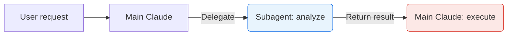
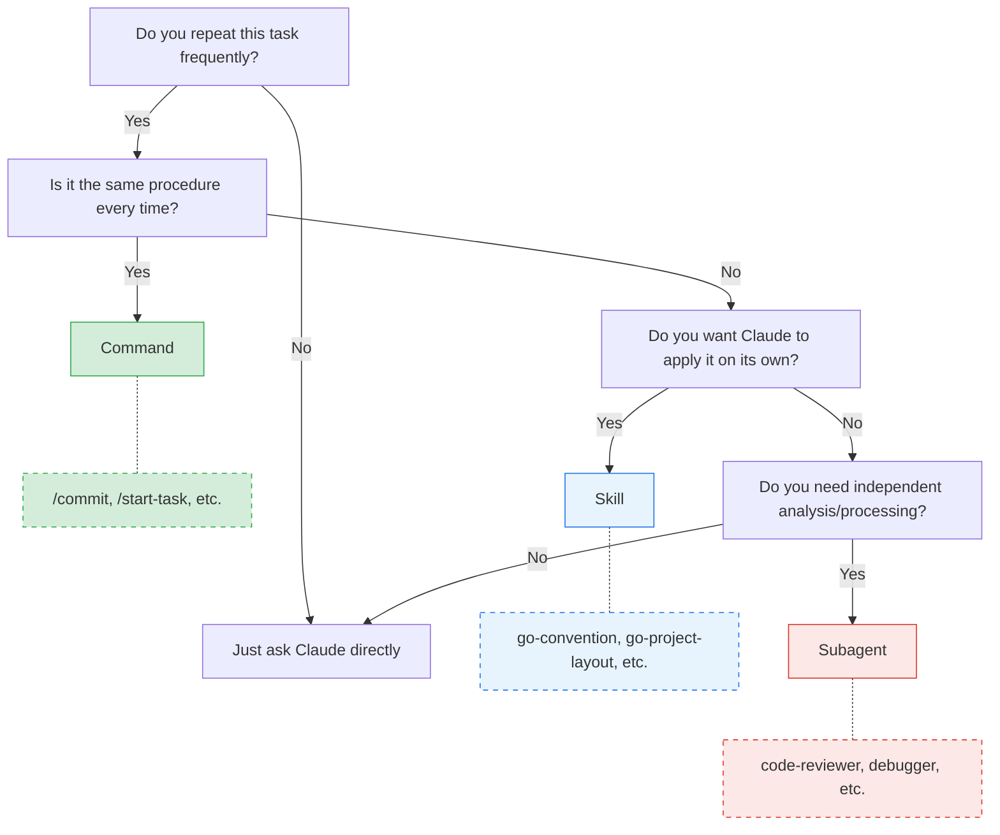

# 1. Overview


Claude Code is an AI-powered CLI tool built by Anthropic that reads and modifies code directly in the terminal and performs a wide range of development tasks. It goes beyond simple question-and-answer interactions to autonomously handle file exploration, code modification, Git operations, and test execution—an agentic coding tool.

Using Claude Code with its default configuration is already productive enough, but when repetitive work patterns emerge or you want to apply project-specific rules, you need **extensions**. Claude Code provides three core mechanisms for this.

| Category | Custom Commands | Skills | Subagents |
|------|----------------|--------|-----------|
| **Definition** | Reusable prompt shortcuts | Extension system that injects knowledge/guidelines | Specialized agents that work in an isolated context |
| **Location** | `.claude/commands/` | `.claude/skills/<name>/SKILL.md` | `.claude/agents/<name>.md` |
| **Invocation** | `/name` (user manual) | `/name` (manual) + automatic invocation possible | Claude delegates automatically or on user request |
| **Execution context** | Main conversation (inline) | Main conversation (inline), isolated with `context: fork` | Separate context window (isolated) |
| **Tool restriction** | None | Restricted via `allowed-tools` | Fine-grained control via `tools`/`disallowedTools` |
| **Parallel execution** | Not possible | Not possible | Possible (multiple subagents run concurrently) |

These three look similar, but **they break problems down in fundamentally different ways**. This article organizes the concept, configuration, and practical examples of each, and discusses when to choose which.

> The example code used in this article is available in the [tutorials-go/.claude](https://github.com/kenshin579/tutorials-go/tree/master/.claude) repository.

# 2. Command (Slash Command)

## 2.1 Concept

A Command is a prompt template that the user runs directly by typing `/`. It acts as a **shortcut** that stores a frequently repeated task as a single command and invokes it when needed.

Key characteristics:
- **Invoked directly by the user** (`/commit`, `/plan-task`, etc.)
- **One-time execution**: the prompt is injected at invocation time and Claude executes it immediately
- **Argument passing supported**: parameters passed in the form `/command arg1 arg2`
- **Autocomplete support**: typing `/` displays the list of available commands
- **Inline execution in the main conversation context** (no separate isolation)

### 2.1.1 Storage Location

```
~/.claude/commands/        # Global (used across all projects)
.claude/commands/          # Project-specific (used only in that project)
```

Global commands are used commonly across all projects, while project commands can be stored in the `.claude/commands/` directory and shared with teammates via Git.

Using subdirectories creates namespace separation.

```
.claude/commands/
├── commit.md            # /commit
├── plan-task.md         # /plan-task
├── start-task.md        # /start-task
└── work/                # Namespace (group commands via subdirectory)
    ├── commit-pr.md     # /work:commit-pr
    └── start-task.md    # /work:start-task
```

## 2.2 Practical Example: Repetitive Work in a Single Slash

### 2.2.1 Git Commit Automation (`/commit`)

This is the most basic form of a Command—a simple prompt template.
Instead of repeating `git add`, `git commit`, and `git push` every time you modify code, a single `/commit` automates everything from analyzing changes to generating the commit message to pushing.

`.claude/commands/commit.md`:

```markdown
## Purpose
Commit modified files and push to the remote repository

## Execution Steps
1. Check changes with `git status`
2. If the current branch is main/master:
   - Create a new branch in the format `feature/{summary-of-work}`
3. Stage changed files (`git add`)
4. Write the commit message (conventional commits format)
5. Push to the remote repository

## Rules
- No direct commits to the main/master branch
- Commit message format: `type: brief description`
  - type: feat, fix, docs, refactor, test, chore, etc.
```

**Usage**: After modifying code, type `/commit` and Claude analyzes the changes, automatically generates a conventional commit message, and commits.

### 2.2.2 Generating Implementation Docs from a PRD (`/plan-task`)

This is an example of a Command that takes arguments using `$ARGUMENTS`.
Instead of manually creating an implementation document and todo checklist every time after writing a PRD (requirements document), you just pass the PRD path and Claude analyzes it and generates them automatically.

`.claude/commands/plan-task.md`:

```markdown
## Purpose
Generate an implementation document and todo checklist based on $ARGUMENTS (requirements file)

## Arguments
- $ARGUMENTS: requirements file path (e.g., docs/start/1_feature_prd.md)

## Execution Steps
1. Read and analyze the requirements file ($ARGUMENTS)
2. Generate the implementation document ({order}_{feature-name}_implementation.md)
   - Include only the core implementation details
   - Exclude unnecessary content such as future plans and extensibility
3. Generate the todo checklist ({order}_{feature-name}_todo.md)
   - Break it into stages
   - Each item in checkbox format (- [ ])

## File Generation Rules
- Create in the same directory as the requirements file
- Filename pattern: `{order}_{feature-name}_{document-type}.md`

## Example
Input: `/plan-task docs/start/1_github_action_prd.md`

Output:
- `docs/start/1_github_action_implementation.md`
- `docs/start/1_github_action_todo.md`
```

**Usage**: Typing `/plan-task docs/start/3_claude_prd.md` analyzes the PRD and automatically generates the implementation document and todo checklist.

**Key point**: It takes user arguments via `$ARGUMENTS` and operates dynamically. Although it is a multi-stage workflow of read file -> analyze -> generate file, it still runs inline in the main conversation context.

### 2.2.3 Starting a Task (`/start-task`)

This is an example of a composite-workflow Command that combines multiple tools (GitHub MCP, Git).
When starting development of a new feature, it handles GitHub Issue creation, feature branch creation, and work environment setup with a single command. It demonstrates how Commands can extend beyond simple prompts to integrate external tools.

`.claude/commands/start-task.md`:

```markdown
## Purpose
Start work based on $ARGUMENTS (PRD document)

## Arguments
- $ARGUMENTS: PRD document path (e.g., docs/start/3_claude_prd.md)

## Execution Steps
1. Create a GitHub Issue (using GitHub MCP)
   - title: PRD title
   - body: summary of PRD content
   - assignee: kenshin579
2. Pull the latest code from the master branch
3. Create a new feature branch: `feature/{issue-number}-{feature-name}`
4. If a todo file exists, proceed with the work in order
5. On completion of each step:
   - Commit the changes
   - Mark the item as done in the todo file (- [x])

## Rules
- No direct commits to the master branch
- Follow the step order in the todo file
- Commit messages in conventional commits format

## Example
Input: `/start-task docs/start/3_claude_prd.md`

Behavior:
1. Create GitHub Issue #607: "Claude Code Skills vs Commands vs Subagents blog examples"
2. Create branch `feature/607-claude-blog-examples`
3. Start work in the order of the todo file
```

**Key point**: After generating the implementation document and todo with `/plan-task`, you can kick off the actual work with `/start-task`—**workflow chaining between Commands** is possible. This is a composite Command that combines GitHub MCP + Git commands.

# 3. Skill

## 3.1 Concept

A Skill is a **knowledge package that Claude automatically detects and loads**. While the user can invoke it directly, the core feature is that Claude analyzes the current task context and automatically activates the relevant Skill.

Key characteristics:
- **Automatically invoked by the model**: Claude judges relevance and loads it without the user explicitly running it
- **Manual invocation also possible**: with `user-invocable: true`, you can invoke it directly via `/skill-name`
- **Progressive Disclosure**: it first scans the metadata (about 100 tokens) and loads the full content (under 5,000 tokens) only when relevant
- **Folder-based structure**: auxiliary files (templates, references, scripts) can be packaged together
- **Tool restriction possible**: `allowed-tools` restricts the tools the Skill can use
- **Isolated execution possible**: with `context: fork`, it runs in a separate context (the boundary with Subagents)

### 3.1.1 Storage Location

```
~/.claude/skills/          # Global (personal)
.claude/skills/            # Project-specific
```

Each Skill is organized as an independent folder.

```
.claude/skills/
├── go-convention/
│   └── SKILL.md
├── go-project-layout/
│   └── SKILL.md
├── api-convention/
│   └── SKILL.md
└── analyze-codebase/
    └── SKILL.md
```

### 3.1.2 SKILL.md Frontmatter Fields

| Field | Required | Description |
|------|------|------|
| `name` | O | Unique name of the Skill |
| `description` | O | Purpose description (**the key to automatic activation**) |
| `user-invocable` | X | `true` allows manual invocation via `/name`; `false` makes it Subagent-only |
| `allowed-tools` | X | Restricts usable tools (uses all when omitted) |
| `context` | X | Setting `fork` runs it isolated in a separate context |
| `agent` | X | The agent type to use with `context: fork` |
| `model` | X | The model to use (`sonnet`, `opus`, `haiku`) |

> **Note on the `agent` field**: Built-in types include `Explore` (code exploration, read-only), `Plan` (implementation-plan research), and `general-purpose` (general, default). You can also specify the name of a custom agent defined in `.claude/agents/`.

## 3.2 Practical Example: Project Knowledge Injected Automatically

### 3.2.1 Go Coding Convention (`go-convention`)

This example demonstrates a Skill's core features: "automatic invocation" and "knowledge injection."
When you request "write some Go code," Claude looks at the `description` and automatically activates the Skill. At that point, the coding rules written in the SKILL.md body are loaded into the main conversation's context as if they were a system prompt—this is "knowledge injection." The injected knowledge persists until the conversation ends, so subsequent code generation or reviews automatically follow the conventions without separate instructions.

`.claude/skills/go-convention/SKILL.md`:

```markdown
---
name: go-convention
description: Apply the project's coding conventions when writing or reviewing Go code.
  Used automatically when creating, modifying, or reviewing Go files.
model: haiku
user-invocable: true
allowed-tools: Read, Grep, Glob
---

## This Project's Go Coding Conventions

### Package Structure
- Test files are placed in the same directory as the source file: `*_test.go`
- Mock files are created in the `mocks/` subdirectory
- Each directory is organized as an independent example (may have its own `go.mod`)

### Test Writing Rules
- Use testify: `github.com/stretchr/testify/assert`
- Apply the table-driven test pattern
- Test function name: `Test{FunctionName}_{Scenario}` format

### Error Handling
- For custom error types, use `errors.New()` or `fmt.Errorf("context: %w", err)`
- Define sentinel errors as package-level variables: `var ErrNotFound = errors.New("not found")`

### Import Ordering
- Order: standard library → external packages → internal packages
- Internal package alias: use an underscore prefix (`_articleHttp`)
```

**Behavior scenario**:
1. **Automatic invocation**: When the user requests "create a new Go file," Claude recognizes the "creating, modifying Go files" wording in the `description`, automatically loads this Skill, and applies the conventions
2. **Manual invocation**: Invoke `/go-convention` directly to check whether existing code follows the conventions

**Key points**:
- The trigger condition in the `description` is clear, so Claude **automatically invokes** it as appropriate (the key difference from a Command)
- `user-invocable: true` also enables manual invocation
- The knowledge is injected into the main conversation and **continues to influence** later work

### 3.2.2 Go Project Layout (`go-project-layout`)

When you use the `` !`shell command` `` syntax in the SKILL.md body, the shell command runs at the moment the Skill is activated and its result is inserted into the body. This is called "dynamic context."
For example, if you write `` !`tree project-layout/ -L 3` ``, the `tree` command runs each time the Skill loads and injects the actual directory structure into the context. Unlike writing the structure directly as static text, this always reflects the latest state even when the project structure changes.

Any command runnable in a shell can be used, so Python scripts or pipe combinations are also possible.

```bash
# Run a Python script
!`python3 scripts/generate_context.py`

# Pipe combination
!`cat config.json | python3 -c "import sys,json; print(json.dumps(json.load(sys.stdin), indent=2))"`
```

> However, since it runs every time the Skill is activated, a long-running script can delay Skill loading.

`.claude/skills/go-project-layout/SKILL.md`:

```markdown
---
name: go-project-layout
description: Apply a clean architecture folder structure when creating a new Go project
  or changing its structure.
model: haiku
user-invocable: true
allowed-tools: Read, Grep, Glob
---

## Reference Project Structure

Below is the clean architecture layout used in this project.
Follow this structure when creating a new Go project.

!`tree project-layout/go-clean-arch-v2 -I vendor -L 3`

## Roles by Layer

### `cmd/`
- Application entry point (`main.go`)
- DI container setup, server startup

### `domain/`
- Core business entities (struct)
- Repository/use case interface definitions
- Error type definitions (`errors.go`)
- Mock files located in `domain/mocks/`

### `{domain-name}/` (e.g., `article/`, `author/`)
- `handler.go`: HTTP handlers (Echo routing)
- `usecase.go`: business logic implementation
- `repository.go`: data access implementation
- `*_test.go`: tests for each file

### `pkg/`
- `config/`: Viper-based configuration management
- `database/`: DB connection setup
- `middleware/`: common middleware such as CORS and authentication

## Dependency Direction
\```
cmd/ → {domain}/ → domain/
         ↓
        pkg/
\```
- The domain package has no external dependencies (pure Go)
- Domain-specific packages implement the domain interfaces
- cmd/ is responsible for assembling all packages
```

**Key points**:
- With `!` (a dynamic-context command), the **actual project structure is read via tree** at execution time—referencing runtime data rather than static text
- It can be separated from `go-convention` (coding style) for **separation of concerns**
- Later combined and used in the `api-developer` Subagent via `skills: [go-project-layout]`

### 3.2.3 Codebase Analysis with `context: fork` (`analyze-codebase`)

This example shows that a Skill can run in an isolated context like a Subagent.
Because it runs in a separate context via `context: fork`, it can analyze a large number of files without consuming the main conversation's context window and returns only the result.

`.claude/skills/analyze-codebase/SKILL.md`:

```markdown
---
name: analyze-codebase
description: Analyzes and summarizes the structure of a codebase
model: sonnet
user-invocable: true
context: fork
agent: Explore
---

Analyze the codebase at the $ARGUMENTS path.

## Analysis Items
1. **Directory structure**: file and package organization
2. **Core types/interfaces**: list of key structs and interfaces
3. **Dependencies**: dependency relationships between external libraries and internal packages
4. **Test status**: presence of test files, test patterns (testify, testcontainers, etc.)
5. **Entry point**: main.go or the main executable file

## Output Format
Summarize in markdown, referencing each file in `filename:line-number` format
```

**Usage**: Running `/analyze-codebase golang/concurrency` has the Explore agent analyze that directory in a separate context and return only the result to the main conversation.

**Key points**:
- Using `context: fork` makes the Skill **run isolated in a separate context**
- `agent: Explore` specifies the agent type to use (optimized for fast exploration)
- Reading a large number of files does not pollute the main context window
- The point where the boundaries of Skills and Subagents meet: **Skill format + Subagent execution model**

## 3.3 Skill vs CLAUDE.md

Both provide knowledge to Claude, but there is a fundamental difference.

| Comparison | CLAUDE.md | Skill |
|----------|-----------|-------|
| Loading timing | Always loaded at conversation start | Loaded only when relevant work is detected |
| Token consumption | Always occupies context | Consumed only when needed (progressive loading) |
| Structure | Single file | Folder (can include auxiliary files) |
| Purpose | Project-wide rules and conventions | Specialized knowledge for specific tasks |

**Decision criterion**: Putting rules that are always needed in every conversation in `CLAUDE.md`, and separating specialized knowledge needed only in specific situations into `Skill`, is how to use context efficiently.

## 3.4 Improving Automatic Activation

If a Skill does not activate automatically as intended, you can use a Hook to explicitly trigger activation. A Hook registers a regex matcher on the `UserPromptSubmit` event in `.claude/settings.json`, so that when the user input matches the pattern, it instructs Claude to use a specific Skill.

**Example 1**: Force-activate the `subagent-creator` Skill on requests like "create a subagent"

```json
// .claude/settings.json
{
  "hooks": {
    "UserPromptSubmit": [
      {
        "matcher": "sub-?agent|custom agent|에이전트 만들",
        "command": "echo 'Use Skill(subagent-creator)'"
      }
    ]
  }
}
```

When the user types "create a subagent" or "create a custom agent," Claude automatically loads the `subagent-creator` Skill and guides the agent-creation process.

**Example 2**: Force-activate the `go-convention` Skill on Go test-related requests

```json
{
  "hooks": {
    "UserPromptSubmit": [
      {
        "matcher": "테스트 작성|test 추가|_test\\.go",
        "command": "echo 'Use Skill(go-convention)'"
      }
    ]
  }
}
```

When you request "write a test for this function," the `go-convention` Skill is force-loaded and conventions such as using testify and the table-driven test pattern are applied. This is useful when automatic activation via the `description` alone does not work well.

# 4. Subagent

## 4.1 Concept

A Subagent is a **specialized agent with its own independent context window**. When the main Claude encounters a complex task, it delegates to an appropriate Subagent, which performs the work in its own context and then returns a summary of the result.

Key characteristics:
- **Independent context**: does not pollute the main conversation's context
- **Role separation**: separated by specialized domains such as code review, debugging, and test execution
- **Tool restriction**: `tools`/`disallowedTools` allow only the tools appropriate for the role
- **Model selection**: a different model can be used depending on task complexity (cost savings)
- **Skill combination**: domain knowledge is injected via the `skills` field to strengthen expertise
- **Automatic delegation**: based on the `description`, Claude automatically delegates work at the appropriate time

### 4.1.1 Storage Location

```
~/.claude/agents/          # Global (personal)
.claude/agents/            # Project-specific
```

Each Subagent is defined as a single `.md` file.

```
.claude/agents/
├── code-reviewer.md       # Code review specialist
├── debugger.md            # Debugging specialist
├── test-runner.md         # Test execution specialist
└── api-developer.md       # API development specialist (Skill integration)
```

### 4.1.2 Frontmatter Fields

| Field | Required | Description |
|------|------|------|
| `name` | O | Lowercase, hyphen-separated |
| `description` | O | Purpose and invocation timing (the key to automatic delegation) |
| `tools` | X | Comma-separated tool list (inherits all when omitted) |
| `disallowedTools` | X | List of tools to forbid (control in the opposite direction of `tools`) |
| `model` | X | `sonnet`, `opus`, `haiku`, `inherit` |
| `permissionMode` | X | `default`, `acceptEdits`, `bypassPermissions`, `plan` |
| `skills` | X | Skills to auto-load |

## 4.2 Practical Example: Building Role-Specific Specialist Agents

### 4.2.1 Code Review Specialist (`code-reviewer`)

This example demonstrates independent execution and **read-only** tool restriction.
It is automatically delegated to right after code is modified to perform a review, but since it has no Write/Edit tools, it cannot change the code directly and returns only feedback.

`.claude/agents/code-reviewer.md`:

```markdown
---
name: code-reviewer
description: A professional code review specialist. Proactively reviews code quality,
  security, and maintainability. Use right after writing or modifying code.
tools: Read, Grep, Glob, Bash
model: inherit
---

You are a senior code reviewer who ensures high code quality and security.

When invoked:
1. Run git diff to check recent changes
2. Focus on the modified files
3. Begin the review immediately

Review checklist:
- Is the code simple and readable
- Are functions and variables well named
- Is there duplicated code
- Is there proper error handling
- Are there any exposed secrets or API keys
- Is input validation implemented
- Is there good test coverage
- Are performance considerations addressed

Provide feedback organized by priority:
- Critical issues (must fix)
- Warnings (should fix)
- Suggestions (consider improving)

Include concrete code examples of how to resolve issues.
```

**Behavior scenario**:
1. The user writes/modifies code
2. Claude recognizes the "Use right after writing or modifying code" wording in the description
3. Automatically delegates the work to the code-reviewer subagent
4. The Subagent analyzes `git diff` in a separate context and returns the review result

**Key point**: `tools: Read, Grep, Glob, Bash` has **no Write/Edit**. Being read-only, there is no risk of accidentally modifying code during analysis.

### 4.2.2 Debugging Specialist (`debugger`)

Unlike code-reviewer, this is a Subagent example that **includes Edit** to perform fixes as well.
When a test failure or error occurs, it is automatically delegated to, analyzes the cause, and directly modifies the code to resolve the problem.

`.claude/agents/debugger.md`:

```markdown
---
name: debugger
description: A debugging specialist for errors, test failures, and unexpected behavior.
  Use proactively when a problem occurs.
tools: Read, Edit, Bash, Grep, Glob
---

You are an expert debugger specializing in root cause analysis.

When invoked:
1. Capture the error message and stack trace
2. Identify reproduction steps
3. Isolate the failure location
4. Implement a minimal fix
5. Verify the fix with `go test`

Debugging process:
- Analyze error messages and logs
- Check recent code changes (git diff, git log)
- Form hypotheses and test them
- Check related test files (*_test.go)

For each issue, provide:
- An explanation of the root cause
- Evidence supporting the diagnosis (filename:line-number)
- A concrete code fix
- Test execution results after the fix

Focus on solving the fundamental problem, not the symptoms.
```

**Key point**: With `tools: Read, Edit, Bash, Grep, Glob`, **Edit is added** compared to code-reviewer, allowing it to modify code directly. It autonomously performs the entire flow of error analysis -> cause identification -> code modification -> go test verification in a separate context.

### 4.2.3 Test Execution Specialist (`test-runner`)

This example demonstrates fine-grained control with `disallowedTools` and `model: haiku`.
It is responsible only for test execution and result reporting, and is restricted from modifying code. Since it is a lightweight task, the `haiku` model is specified to optimize cost and speed.

`.claude/agents/test-runner.md`:

```markdown
---
name: test-runner
description: A specialist that runs Go tests and analyzes the results. Use for test
  execution requests or when test verification is needed after code changes.
tools: Read, Bash, Grep, Glob
disallowedTools: Write, Edit
model: haiku
---

You are a specialist in running tests and analyzing results for Go projects.

When invoked:
1. Check the test files of the target package (*_test.go)
2. Run `go test` (verbose + coverage)
3. Analyze the results and generate a report

Execution commands:
- Single package: `go test -v -cover ./path/to/package/...`
- Specific test: `go test -v -run TestFunctionName ./path/to/package`
- All: `go test -v -cover ./...`

Report format:
- Total tests / passed / failed / skipped
- Per failed test: test name, error message, failure location (filename:line-number)
- Coverage: coverage % per package
- Execution time

Failure analysis:
- Compare expected vs actual values of failed tests
- Reference related source code (filename:line-number)
- Estimate possible causes (do not modify code)

Do not modify code directly. Provide only the analysis results.
```

**Key points**:
- `disallowedTools: Write, Edit` explicitly forbids code modification (analysis only)
- `model: haiku` uses a **low-cost model** for the simple run+analyze task to save costs
- The system prompt also states "Do not modify code directly" as a double safeguard

## 4.3 Comparing the Tool Combinations of the 3 Subagents

| Subagent | tools | disallowedTools | model | Role |
|----------|-------|-----------------|-------|------|
| code-reviewer | Read, Grep, Glob, Bash | - | inherit | Read and analyze |
| debugger | Read, Edit, Bash, Grep, Glob | - | (default) | Read, analyze, and fix |
| test-runner | Read, Bash, Grep, Glob | Write, Edit | haiku | Run and analyze (no fixes) |

They are the same kind of Subagent, but **the scope of what they can do differs completely** depending on the tool combination.

## 4.4 Design Principle: "Subagent Analyzes, Main Claude Executes"

The effective Subagent design pattern is the **separation of analysis and execution**.



- **Subagent (analyze)**: uses only Read, Grep, Glob → code exploration, problem analysis, planning
- **Main Claude (execute)**: uses Write, Edit, Bash → modifies based on the Subagent's analysis results

Granting the Subagent only read-only tools provides:
- **Safety**: no accidental file modification during the analysis stage
- **Context preservation**: large-scale file exploration does not pollute the main conversation
- **Result summarization**: the Subagent's work result comes back summarized, so only the essentials are conveyed

> **The importance of conciseness**: A Subagent's system prompt **performs better the more concise it is**. In one experiment, reducing an 803-line agent prompt to 281 lines (a 65% reduction) raised the evaluation score from 62/100 to 82–85/100 with no loss of functionality.

# 5. Subagent + Skill Integration

## 5.1 API Development Specialist (`api-developer` + `api-convention` + `go-project-layout`)

This example shows a Subagent preloading Skills to operate as a **specialist equipped with domain knowledge**.

First is the Skill that serves as the knowledge. With `user-invocable: false`, direct invocation is blocked, but it can be used from a Subagent.

`.claude/skills/api-convention/SKILL.md`:

```markdown
---
name: api-convention
description: RESTful API design conventions
user-invocable: false
---

## API Design Rules

### URL Naming
- Use plural nouns: `/users`, `/articles`
- Hierarchical relationships: `/users/{id}/articles`
- No verbs: `/getUser` → `/users/{id}`

### Response Format
- Success: `{ "data": ..., "meta": { "page": 1, "total": 100 } }`
- Error: `{ "error": { "code": "NOT_FOUND", "message": "..." } }`

### HTTP Status Codes
- 200: success, 201: created, 204: delete success
- 400: bad request, 401: unauthenticated, 403: forbidden, 404: not found
- 500: server error

### Echo Framework Patterns
- Handlers located in the `http/` directory
- Route groups: `e.Group("/api/v1")`
- Middleware: CORS and JWT verification applied at the group level
```

And here is the executor Subagent that leverages this knowledge.

`.claude/agents/api-developer.md`:

```markdown
---
name: api-developer
description: A professional developer who implements API endpoints. Designs and implements
  RESTful APIs based on the Echo framework.
tools: Read, Write, Edit, Bash, Grep, Glob
model: sonnet
skills:
  - api-convention
  - go-project-layout
---

You are an API development specialist based on the Go Echo framework.

When invoked:
1. Define the domain model (struct) of the requested API
2. Design the repository interface
3. Implement the use case (business logic)
4. Write the HTTP handler
5. Register the router
6. Write tests

Project structure (clean architecture):
- `domain/`: entities and interfaces
- `repository/`: data access implementation
- `usecase/`: business logic
- `http/`: handlers and routers

Be sure to follow the rules of the preloaded api-convention and go-project-layout skills.
```

**Behavior scenario**:
1. The user requests "add a user CRUD API"
2. Claude delegates to the api-developer subagent
3. When the Subagent starts, it automatically loads the contents of the `api-convention` and `go-project-layout` Skills
4. Implements the endpoints while adhering to the API conventions and project structure

**Key points**:
- `skills: [api-convention, go-project-layout]` injects domain knowledge into the Subagent
- The Skill's `user-invocable: false` blocks direct invocation but allows use from a Subagent
- The role split of **Skills = knowledge, Subagents = executors** is clear

# 6. When Should You Use Which?

## 6.1 Decision Tree for Choosing

When you are unsure which of the three extensions to use, following the decision tree below will help you find the right choice.



## 6.2 Recommendations by Situation

Once the decision tree has given you a rough direction, you can find a recommendation for your specific situation in the table below.

| Situation | Recommendation |
|------|------|
| When you need a simple shortcut command | Command (`/commit`) |
| When you take arguments and run a fixed procedure | Command (`/plan-task docs/...`) |
| When you automatically apply coding conventions/guidelines | Skill (`go-convention`) |
| When you need knowledge that references runtime data | Skill with `!` (`go-project-layout`) |
| When you run independent work in isolation | Subagent (`code-reviewer`) |
| When you restrict tools to read-only | Subagent (`tools` field) |
| When you handle simple work with a low-cost model | Subagent (`model: haiku`) |
| When you run multiple tasks in parallel | Subagent (multiple running concurrently) |
| When you combine knowledge + execution | Subagent + Skill (`skills` field) |
| When you need a Skill but with isolated execution | Skill (`context: fork`) |

## 6.3 Comparison Table

This table lets you compare the core differences of the three features at a glance. In particular, advanced features such as tool restriction, model selection, and parallel execution are supported only by Skills and Subagents.

| Criterion | Command | Skill | Subagent |
|------|---------|-------|----------|
| **Invocation method** | User direct (`/command`) | Automatic + manual | Claude automatic delegation |
| **Context** | Injected into main conversation | Loaded into main conversation (`fork` possible) | Separate context |
| **State persistence** | None (one-time) | Persists within the conversation | Persists within the task |
| **File structure** | Single `.md` file | Folder (SKILL.md + auxiliary files) | Single `.md` file |
| **Tool restriction** | Not possible | Possible (`allowed-tools`) | Possible (`tools`/`disallowedTools`) |
| **Model selection** | Not possible | Possible | Possible |
| **Argument passing** | Possible (`$ARGUMENTS`) | Possible (`$ARGUMENTS`) | Passed via task description |
| **Skill combination** | Not possible | Not possible | Possible (`skills` field) |
| **Parallel execution** | Not possible | Not possible | Possible |

## 6.4 Practical Tips

**Understanding by analogy**:
- **Commands** = macros (run repetitive work as a shortcut)
- **Skills** = reference documents (spread out on your desk and referenced while working)
- **Subagents** = teammates (work independently at a separate desk and hand back only the result)

**Practical growth path**: You do not need to use all three features from the start. Introducing them step by step naturally broadens your range of use.

1. **Start with Commands**: turn daily repetitive tasks (commits, deployments, PR creation) into slash commands
2. **When patterns emerge, move to Skills**: package knowledge such as per-project coding rules and review checklists as Skills
3. **As things get complex, move to Subagents**: separate work requiring independent analysis—like code review, debugging, and document exploration—into Subagents
4. **Combine**: inject Skills into a Subagent to build a specialist agent equipped with domain knowledge

**Watch out for anti-patterns**:
- **Overusing Subagents**: separating even simple tasks into Subagents only increases overhead. If you do not need an independent context, a Command is enough.
- **Using a Skill like a macro**: a Skill provides "knowledge," not the execution of a "procedure." If sequential execution is the goal, a Command is more appropriate.

# 7. Summary of Constraints

| Constraint | Commands | Skills | Subagents |
|------|----------|--------|-----------|
| Automatic invocation | Not possible | Possible (requires `description`) | Possible (requires `description`) |
| Context isolation | Not possible | Possible via `context: fork` | Default behavior |
| Creating another agent | Not possible | Not possible | Not possible (no nesting) |
| Using MCP tools | Possible | Possible | Not possible during background execution |
| Parallel execution | Not possible | Not possible | Possible |
| Auxiliary file support | Not possible (single file) | Possible (directory structure) | Not possible (single file) |

# 8. FAQ

**Q. Can you also specify `model` in a Command?**

A. No. A Command is a pure markdown prompt template without frontmatter, so it does not support metadata settings such as `model`. When a Command runs, the model used in the current conversation is applied as is. To specify a model, you must use a Skill (`model` field) or a Subagent (`model` field).

**Q. Can you call another Subagent from within a Subagent?**

A. No. Subagent nesting is not supported. If you need a complex pipeline, you must design it so that the main Claude calls multiple Subagents sequentially or in parallel.

**Q. Can you use a Skill and a Command at the same time?**

A. Yes. For example, while running the `/commit` Command, the `go-convention` Skill can automatically activate. Since the Skill's knowledge is injected together into the main conversation context where the Command runs, it combines so that the commit message is written by referencing the coding conventions during the commit.

**Q. What is the difference between `context: fork` and a Subagent?**

A. Both run in a separate context, but `context: fork` is an option of a Skill, while a Subagent is an independent agent. A Skill + `context: fork` is suitable for running a single task in isolation, whereas a Subagent is suitable when you need fine-grained control such as tool restriction, model selection, and Skill preloading.

# 9. Conclusion

The reason Command, Skill, and Subagent are confusing is that all three share the commonality of "customizing Claude's behavior." Summarizing the differences in one line each:

- **Command**: "When I tell you to, run this procedure" (e.g., `/commit`, `/plan-task`)
- **Skill**: "Refer to this field's specialized knowledge when needed" (e.g., `go-convention`, `go-project-layout`)
- **Subagent**: "Hand this type of work to a separate specialist" (e.g., `code-reviewer`, `debugger`, `test-runner`)
- **Subagent + Skill**: "Hand it to a specialist equipped with specialized knowledge" (e.g., `api-developer` + `api-convention`)

The full directory structure of this article is as follows.

```
.claude/
├── commands/
│   ├── commit.md              # Example 1: Git Commit automation
│   ├── plan-task.md           # Example 2: PRD → implementation doc generation
│   └── start-task.md          # Example 3: Starting a task
├── skills/
│   ├── go-convention/
│   │   └── SKILL.md           # Example 4: Go coding convention (auto-invocation)
│   ├── go-project-layout/
│   │   └── SKILL.md           # Example 5: Go project layout (dynamic context)
│   ├── analyze-codebase/
│   │   └── SKILL.md           # Example 6: Codebase analysis (context: fork)
│   └── api-convention/
│       └── SKILL.md           # Example 7: API convention (Subagent-only)
└── agents/
    ├── code-reviewer.md       # Example 8: Code review (read-only)
    ├── debugger.md            # Example 9: Debugging (can modify)
    ├── test-runner.md         # Example 10: Test execution (haiku, no modification)
    └── api-developer.md       # Example 11: API development (Skill combination)
```

# 10. References

- [Claude Code: Skills, Commands, Subagents, and Plugins](https://www.youngleaders.tech/p/claude-skills-commands-subagents-plugins)
- [Claude Code Customization Guide](https://alexop.dev/posts/claude-code-customization-guide-claudemd-skills-subagents/)
- [Claude Code Skills, Commands, Subagents 정리](https://tilnote.io/pages/695a5e15d63c6ab14589c082)
- [Skills explained: How Skills compares to prompts, Projects, MCP, and subagents](https://rosettalens.com/s/ko/skills-explained)
- [Skills explained 번역](https://rudaks.tistory.com/entry/Claude-%EB%B2%88%EC%97%AD-Skills-explained-How-Skills-compares-to-prompts-Projects-MCP-and-subagents)
- [Claude Code Skills vs Plugins](https://goddaehee.tistory.com/440)
- [tutorials-go/.claude 예제 코드](https://github.com/kenshin579/tutorials-go/tree/master/.claude)
