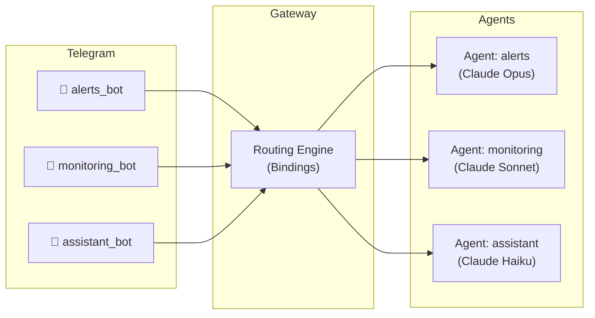
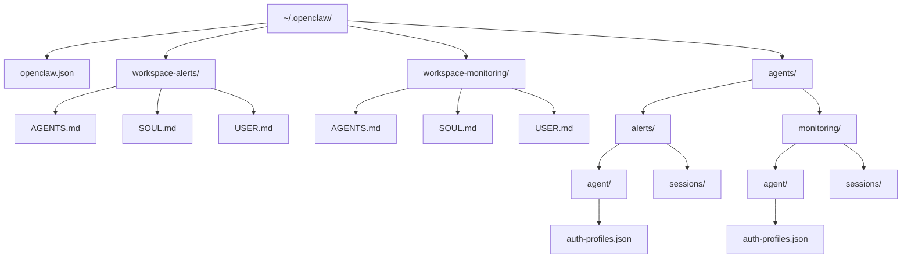
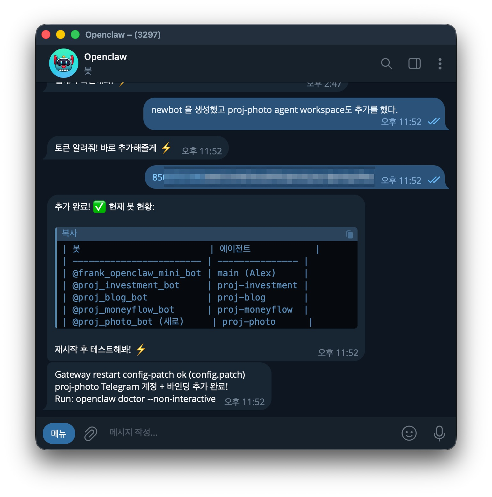
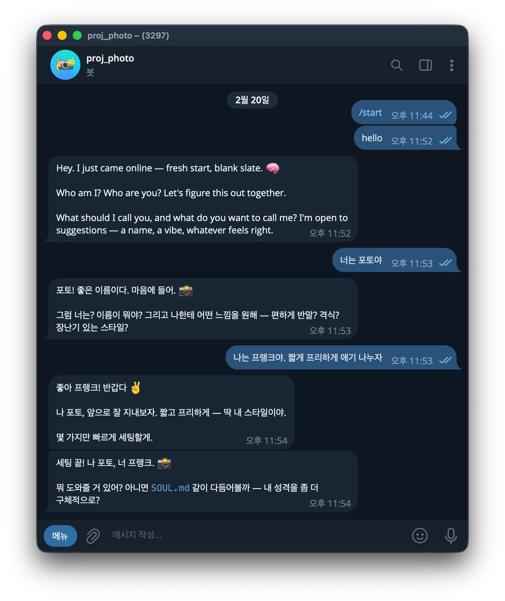

# 1. Overview

OpenClaw is a **self-hosted gateway** that connects messaging apps such as WhatsApp, Telegram, and Discord to AI agents. By default a single agent handles all messages, but in real-world operations you often want to separate bots by purpose.

For example:

- **Alert bot**: delivers only server failure or deployment notifications
- **Monitoring bot**: analyzes system metrics and produces reports
- **Assistant bot**: handles everyday questions and tasks

OpenClaw's **multi-agent** feature makes this kind of setup possible. Each agent runs as a completely isolated, independent "brain" and can be managed from a single Gateway.

This article walks through how to configure multiple Telegram bots as OpenClaw multi-agents, step by step. The whole process proceeds in the following four steps.

1. **Create Telegram bots** - Create as many bots as agents in BotFather
2. **Add agents** - Register agents with the OpenClaw CLI
3. **Pass bot tokens** - Hand the tokens to OpenClaw to auto-configure the bindings
4. **Verify and run** - Check the agent list and channel status

> For OpenClaw's basic concepts and installation, refer to the [Complete OpenClaw Guide](/article/openclaw-완벽-가이드) article.

# 2. Multi-Agent Architecture

## 2.1 Overall Structure

The core of a multi-agent system is that **a single Gateway manages multiple agents and routes messages according to binding rules**.



Each Telegram bot has an independent account (accountId) and is connected to a specific agent through binding rules.

## 2.2 Components of an Agent

Each agent has completely isolated components.

| Component | Path | Role |
|----------|------|------|
| **Workspace** | `~/.openclaw/workspace-<agentId>/` | AGENTS.md, SOUL.md, USER.md, local files |
| **State directory (agentDir)** | `~/.openclaw/agents/<agentId>/agent/` | Auth profiles, model registry, agent settings |
| **Session store** | `~/.openclaw/agents/<agentId>/sessions/` | Conversation history |

> **Caution**: never share the `agentDir` between agents. Sharing it causes authentication conflicts.

## 2.3 Directory Structure

The actual multi-agent structure on the filesystem looks like this.



Each agent's Workspace contains files that define the agent's character and role.

- **AGENTS.md**: the agent's instructions and tool settings
- **SOUL.md**: the agent's persona and personality
- **USER.md**: user information and preferences

# 3. Multi-Agent Configuration

## 3.1 Step 1 - Create Telegram Bots (BotFather)

In Telegram, chat with [@BotFather](https://t.me/BotFather) and create as many bots as you have agents.

1. Send the `/newbot` command to BotFather
2. Enter the bot name (e.g., `My Alert Bot`)
3. Enter the bot username (e.g., `my_alert_bot`)
4. Store the issued **bot token** securely

Repeat this process for the number of bots you need. For example, if you plan to run three agents, create three bots.

```
# Example tokens received from BotFather
alerts_bot:     123456:ABC-DEF1234ghIkl-zyx57W2v1u123ew11
monitoring_bot: 987654:XYZ-UVW9876tgHjk-abc34V3w9z456ty22
assistant_bot:  111222:GHI-JKL5678mnOpq-rst12X4y6z789ab33
```

## 3.2 Step 2 - Add Agents

Add each agent with the OpenClaw CLI.

```bash
openclaw agents add alerts
openclaw agents add monitoring
openclaw agents add assistant
```

Each command automatically creates the following.
- Workspace directory (`~/.openclaw/workspace-<agentId>/`)
- State directory (`~/.openclaw/agents/<agentId>/agent/`)
- Session store (`~/.openclaw/agents/<agentId>/sessions/`)

When you actually run `openclaw agents add`, an interactive wizard runs.

```
$ openclaw agents add proj-photo

🦞 OpenClaw 2026.2.17 (4134875) — The UNIX philosophy meets your DMs.

┌  Add OpenClaw agent
│
◇  Workspace directory
│  /Users/user/.openclaw/workspace-proj-photo
│
◇  Copy auth profiles from "main"?
│  Yes
│
◇  Auth profiles ─────────────────────╮
│                                     │
│  Copied auth profiles from "main".  │
│                                     │
├─────────────────────────────────────╯
│
◇  Configure model/auth for this agent now?
│  Yes
│
◇  Model/auth provider
│  Anthropic
│
◇  Anthropic auth method
│  Anthropic token (paste setup-token)
│
◇  Paste Anthropic setup-token
│  sk-ant-oat01-****
│
◇  Token name (blank = default)
│  proj-photo
│
◇  Configure chat channels now?
│  Yes
│
◇  Select a channel
│  Finished
│
└  Agent "proj-photo" ready.
```

Workspace, auth profiles, and model settings are all completed in one go.

## 3.3 Step 3 - Pass the Bot Tokens to OpenClaw

You don't need to edit `openclaw.json` directly. In the OpenClaw chat window (Dashboard or Telegram), tell it that you added a new bot and hand over the token; OpenClaw will add the configuration on its own and restart the Gateway.

```
User: "I added a new Telegram bot. Its name is alerts_bot and the token is 123456:ABC-DEF1234..."
OpenClaw: Configuration added → Gateway automatically restarted
```

**Actual workflow:**

1. Create a bot in BotFather → copy the token
2. Pass the token in the OpenClaw chat window
3. OpenClaw handles it automatically:
   - Adds the agent and Telegram account to `openclaw.json`
   - Creates binding rules
   - Restarts the Gateway

Below is what passing a bot token actually looks like in the OpenClaw Telegram chat window. Once you hand over the token, OpenClaw automatically adds the configuration and shows the bot status.



## 3.4 Understanding the openclaw.json Structure

OpenClaw generates the configuration automatically, but understanding the internal structure helps with customization and troubleshooting. `openclaw.json` consists of three main sections.

### agents Section

Defines each agent (AI brain). You can assign an independent workspace and model to each agent.

```json5
{
  agents: {
    list: [
      {
        id: "alerts",
        name: "Alert Agent",
        workspace: "~/.openclaw/workspace-alerts",
        agentDir: "~/.openclaw/agents/alerts/agent",
        model: "anthropic/claude-opus-4-6",
      },
      {
        id: "monitoring",
        name: "Monitoring Agent",
        workspace: "~/.openclaw/workspace-monitoring",
        agentDir: "~/.openclaw/agents/monitoring/agent",
        model: "anthropic/claude-sonnet-4-5",
      },
      {
        id: "assistant",
        name: "Assistant Agent",
        workspace: "~/.openclaw/workspace-assistant",
        agentDir: "~/.openclaw/agents/assistant/agent",
        model: "anthropic/claude-haiku-4-5",
      },
    ],
  },
}
```

Since each agent can use a different model, you can tune performance and cost to fit each purpose.

### channels Section

Configures Telegram bot tokens and access policies.

```json5
{
  channels: {
    telegram: {
      accounts: {
        alerts_bot: {
          botToken: "123456:ABC-DEF1234ghIkl-zyx57W2v1u123ew11",
          dmPolicy: "pairing",
        },
        monitoring_bot: {
          botToken: "987654:XYZ-UVW9876tgHjk-abc34V3w9z456ty22",
          dmPolicy: "allowlist",
          allowFrom: ["tg:123456789"],
        },
        assistant_bot: {
          botToken: "111222:GHI-JKL5678mnOpq-rst12X4y6z789ab33",
          dmPolicy: "open",
          allowFrom: ["*"],
        },
      },
    },
  },
}
```

`dmPolicy` controls who can send DMs to a bot.

| dmPolicy | Description |
|----------|------|
| `pairing` | Only users who enter the pairing code can chat (default) |
| `allowlist` | Only users registered in `allowFrom` can chat |
| `open` | Anyone can chat (`allowFrom: ["*"]` required) |
| `disabled` | DM disabled |

### bindings Section

Defines the routing rules for which bot's messages go to which agent.

```json5
{
  bindings: [
    {
      agentId: "alerts",
      match: { channel: "telegram", accountId: "alerts_bot" },
    },
    {
      agentId: "monitoring",
      match: { channel: "telegram", accountId: "monitoring_bot" },
    },
    {
      agentId: "assistant",
      match: { channel: "telegram", accountId: "assistant_bot" },
    },
  ],
}
```

> When you need advanced settings such as changing dmPolicy, swapping models, or refining bindings, you can edit this file directly.

## 3.5 Step 4 - Verify and Run

Once the configuration is complete, verify it with the following commands.

```bash
# Check the agent list and bindings
openclaw agents list --bindings

# Check channel status (verify bot token validity)
openclaw channels status --probe

# Restart the Gateway (when changing settings manually)
openclaw gateway restart
```

If everything is set up correctly, sending a message to each Telegram bot will get a response from the corresponding agent. Below is what an actual conversation with a newly added bot looks like.



# 4. Conclusion

With OpenClaw's multi-agent feature, you can run multiple Telegram bots independently from a single Gateway. To summarize the key points:

- Each agent is an independent AI brain with completely isolated **Workspace, agentDir, and sessions**
- Create bots in BotFather and **just hand the tokens to OpenClaw** for automatic configuration
- **Binding rules** route messages to agents, allowing branching per bot, per user, or per group
- Use a **different AI model** per agent to optimize performance and cost

Multi-agent isn't just about creating several bots; it's about giving each bot a **specialized role and context**. A well-designed agent separation raises both response quality and operational efficiency at the same time.

# 5. References

- [OpenClaw Official Documentation](https://docs.openclaw.ai)
- [Multi-Agent Concept](https://docs.openclaw.ai/concepts/multi-agent)
- [Telegram Channel Setup](https://docs.openclaw.ai/channels/telegram)
- [Getting Started Guide](https://docs.openclaw.ai/start/getting-started)
