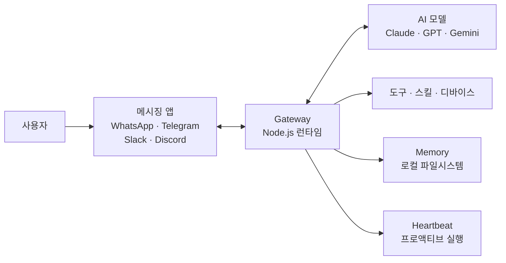

# 1. 개요

OpenClaw는 오스트리아 개발자 Peter Steinberger(PSPDFKit 창립자)가 2025년 11월에 공개한 **오픈소스 개인 AI 에이전트**이다. MIT 라이선스로 배포되며, 공식 슬로건은 다음과 같다.

> "Your own personal AI assistant. Any OS. Any Platform. The lobster way. 🦞"

2026년 1월 말 폭발적으로 성장하여 GitHub Star **180K+**를 기록하며, 역대 가장 빠르게 성장한 오픈소스 프로젝트 중 하나가 되었다.

## 1.1 이름 변천사

OpenClaw의 이름은 짧은 기간에 두 번 바뀌었다.

| 시기 | 이름 | 변경 사유 |
|------|------|----------|
| 2025.11 | **Clawdbot** | 최초 공개 |
| 2026.01.27 | **Moltbot** | Anthropic 상표 이슈로 변경 |
| 2026.01.30 | **OpenClaw** | 커뮤니티 투표로 최종 확정 |

## 1.2 핵심 철학

OpenClaw가 추구하는 세 가지 핵심 철학이 있다.

- **프라이버시 퍼스트**: 로컬에서 실행되며, 민감 데이터가 외부로 나가지 않는다
- **채널 불문**: WhatsApp, Telegram, Slack 등 이미 사용 중인 메시징 앱에서 동작한다
- **자율 에이전트**: 단순 질문-응답을 넘어, 사용자 대신 실제 작업(셸 명령, 이메일, 캘린더 등)을 수행한다

## 1.3 Claude Code와의 포지셔닝 비교

Claude Code가 **터미널 기반 코딩 전문 에이전트**라면, OpenClaw는 **메시징 기반 디지털 생활 전반 자동화 에이전트**이다. 두 도구는 경쟁이 아닌 **보완 관계**로, 코딩 작업은 Claude Code에게, 일정 관리·이메일·스마트홈 제어 등은 OpenClaw에게 맡기는 조합이 가능하다.

# 2. 아키텍처

## 2.1 Gateway 중심 구조

OpenClaw의 핵심은 **Gateway**이다. Gateway는 항상 실행되는 메시지 라우터이자 에이전트 런타임으로, 로컬 머신(Mac mini, VPS 등)에서 동작한다.



동작 흐름은 다음과 같다.

1. 사용자가 메시징 앱에서 메시지 전송
2. Gateway가 메시지 수신
3. 에이전트 턴(Brain) 실행: 컨텍스트 분석 + 도구 호출 결정
4. 필요한 도구/스킬 호출
5. AI 모델로 응답 생성
6. 메시징 앱을 통해 사용자에게 응답 전송

## 2.2 기술 스택

- **언어**: TypeScript
- **런타임**: Node.js ≥ 22
- **패키지 관리**: pnpm (빌드), Bun (옵션)
- **데이터 저장**: 로컬 파일시스템 (Markdown + YAML)
- **통신**: 각 채널별 API/프로토콜

데이터를 로컬 파일시스템에 Markdown과 YAML로 저장하기 때문에, Git으로 백업하거나 버전 관리를 할 수 있다는 것이 큰 장점이다.

## 2.3 지원 AI 모델

OpenClaw는 특정 AI 벤더에 종속되지 않는다. 다양한 LLM 프로바이더를 지원하며, 상황에 따라 모델을 교체할 수 있다.

| 프로바이더 | 지원 모델 |
|-----------|----------|
| **Anthropic** | Claude Opus 4.5, Sonnet 4.5, Haiku 4.5 |
| **OpenAI** | GPT-4o, GPT-4 Turbo |
| **Google** | Gemini Pro, Gemini Ultra |
| **Groq** | Llama 기반 모델 (저지연) |
| **Mistral** | Mistral Large, Medium |
| **OpenRouter** | 다양한 모델 통합 라우팅 |

## 2.4 채널 시스템

OpenClaw의 가장 큰 특징 중 하나는 50개 이상의 메시징 채널을 지원한다는 점이다. 새로운 앱을 설치할 필요 없이, 이미 사용 중인 메시징 앱에서 바로 AI 에이전트를 사용할 수 있다.

| 카테고리 | 지원 채널 |
|---------|----------|
| **주요 메시징** | WhatsApp, Telegram, Slack, Discord, Signal, iMessage |
| **협업 도구** | Microsoft Teams, Google Chat |
| **기타** | Matrix, WebChat, BlueBubbles, Zalo |
| **음성** | macOS/iOS/Android 음성 입출력 |

# 3. 설치 및 초기 설정

## 3.1 시스템 요구사항

| 항목 | 최소 사양 | 권장 사양 |
|------|----------|----------|
| **Node.js** | ≥ 22 | 최신 LTS |
| **RAM** | 2GB | 4GB+ |
| **디스크** | 10GB | 20GB+ |
| **OS** | macOS, Linux | macOS (가장 많은 통합 지원) |

## 3.2 설치 방법

### 3.2.1 npm 설치 (권장)

가장 간단한 설치 방법이다. npm 또는 pnpm으로 글로벌 설치 후, 온보딩 위자드를 실행한다.

```bash
npm install -g openclaw
openclaw onboard --install-daemon
```

`--install-daemon` 플래그를 사용하면 시스템 데몬으로 등록되어, 재부팅 후에도 자동으로 Gateway가 실행된다.

### 3.2.2 Docker 설치

격리된 환경에서 실행하고 싶다면 Docker를 사용할 수 있다.

```bash
docker run -d \
  --name openclaw \
  -v ~/.openclaw:/app/data \
  -p 3000:3000 \
  openclaw/openclaw:latest
```

볼륨 마운트(`-v`)를 통해 메모리와 설정 데이터를 호스트에 영속적으로 저장할 수 있다.

## 3.3 온보딩 위자드

설치 후 `openclaw onboard` 명령을 실행하면 대화형 온보딩 위자드가 시작된다. 설정하는 항목은 다음과 같다.

1. **AI Provider 설정**: Anthropic API 키 입력 (권장)
2. **기본 설정 구성**: 언어, 시간대, 기본 모델 선택
3. **메시징 채널 연결**: WhatsApp, Telegram 등 사용할 채널 인증

온보딩이 완료되면 선택한 메시징 앱에서 바로 AI 에이전트와 대화할 수 있다.

## 3.4 클라우드 배포

로컬 머신 대신 클라우드에 배포하면 24시간 안정적으로 운영할 수 있다. 주요 배포 옵션은 다음과 같다.

| 플랫폼 | 특징 |
|--------|------|
| **Fly.io** | 자동 HTTPS, 글로벌 리전, 영구 스토리지 |
| **Coolify** | 셀프호스팅 PaaS, Docker Compose 기반 |
| **DigitalOcean** | VPS 직접 설치, 완전 제어 |
| **Hostinger** | 원클릭 설정 가이드 제공 |

# 4. 핵심 기능

## 4.1 Memory 시스템 (영속적 기억)

OpenClaw의 가장 차별화된 기능은 **영속적 메모리 시스템**이다. 일반적인 AI 챗봇은 세션이 끝나면 대화 내용을 잊지만, OpenClaw는 세션 간 컨텍스트를 유지한다.

데이터는 다음과 같은 구조로 로컬 파일시스템에 저장된다.

```
~/.openclaw/
├── memory/
│   └── YYYY-MM-DD.md    # 일별 대화 로그 (append-only)
├── MEMORY.md             # 장기 기억 (큐레이션된 정보)
└── config.yaml           # 설정 파일
```

메모리 검색은 **하이브리드 서치** 방식을 사용한다.

- **BM25**: 키워드 기반 검색
- **벡터 검색**: 의미 기반 유사도 검색
- **리랭킹**: 두 결과를 조합하여 최적의 컨텍스트 선택

이를 통해 사용자의 선호도, 말투, 워크플로우를 학습하여 점점 더 개인화된 응답을 제공한다. 모든 데이터가 Markdown/YAML이므로 Git으로 백업이 가능하다는 점도 실용적이다.

## 4.2 Heartbeat (프로액티브 에이전트)

Heartbeat는 OpenClaw가 **주기적으로 스스로 깨어나서** 확인할 작업이 있는지 점검하는 기능이다.

- **기본 주기**: 30분 (Anthropic OAuth 사용 시 1시간)
- **실행 조건**: 메인 세션에서만 실행 (스팸 방지)
- **활용 사례**: 일정 알림, 이메일 요약, 뉴스 브리핑, 주기적 보고서 생성

예를 들어, "매일 아침 9시에 오늘의 일정과 중요 이메일을 요약해줘"라고 설정하면 OpenClaw가 자동으로 알림을 보내준다. 사용자가 먼저 말을 걸지 않아도 능동적으로 동작하는 것이 일반 챗봇과의 큰 차이점이다.

## 4.3 50+ 통합

OpenClaw는 50개 이상의 서비스와 통합된다. 이 통합들을 통해 하나의 메시징 인터페이스에서 다양한 서비스를 제어할 수 있다.

| 카테고리 | 통합 서비스 |
|---------|-----------|
| **생산성** | Gmail, Google Calendar, Todoist, Notion, Obsidian |
| **개발** | GitHub, 셸 명령, 파일 시스템, Cron Job, Webhook |
| **스마트홈** | Philips Hue, Home Assistant |
| **미디어** | Spotify, Apple Music |
| **건강** | WHOOP |
| **프로젝트 관리** | Trello, Apple Reminders, Things 3 |

## 4.4 Canvas

Canvas는 모바일(iOS/Android)에서 AI 에이전트와 **시각적으로 상호작용**할 수 있는 기능이다. 텍스트 기반 대화를 넘어, 차트나 다이어그램, 이미지 등을 실시간으로 렌더링하여 더 직관적인 상호작용을 제공한다.

# 5. 스킬 시스템과 ClawHub

## 5.1 스킬이란?

스킬(Skill)은 OpenClaw에게 **특정 작업을 수행하는 방법을 가르치는 확장 단위**이다. 간단한 프롬프트 텍스트 파일부터 복잡한 Node.js 모듈까지 다양한 형태를 가질 수 있다.

특히 흥미로운 점은 **자기 생성(Self-generation)** 기능이다. OpenClaw에게 "~하는 스킬을 만들어줘"라고 요청하면, 에이전트가 직접 스킬을 작성해준다.

```bash
# 예시: "매일 아침 GitHub 트렌딩을 요약해줘" → 스킬 자동 생성
openclaw skill create --name "github-trending-summary"
```

## 5.2 ClawHub 마켓플레이스

ClawHub는 OpenClaw의 **공식 스킬 마켓플레이스**이다. 2026년 2월 기준으로 **3,000개 이상**의 커뮤니티 제작 스킬이 등록되어 있다.

- **카테고리**: 이메일 관리, 암호화폐, 미디어 제어, 개발 자동화 등
- **설치**: 한 줄 명령으로 즉시 설치 가능

```bash
# ClawHub에서 스킬 검색 및 설치
openclaw skill search "email manager"
openclaw skill install <skill-name>
```

다만, 뒤에서 다룰 **보안 이슈**가 있으므로 스킬 설치 시 주의가 필요하다.

## 5.3 커스텀 스킬 만들기

직접 스킬을 만드는 것도 가능하다. 가장 간단한 형태는 프롬프트 기반 스킬이다.

```yaml
# skill.yaml
name: daily-standup
description: "팀 데일리 스탠드업 요약"
trigger: "스탠드업 요약"
prompt: |
  GitHub에서 어제 merge된 PR과 오늘 열린 이슈를 확인하고,
  다음 형식으로 요약해줘:
  - 어제 완료: ...
  - 오늘 할 일: ...
  - 블로커: ...
```

API 통합이 필요한 고급 스킬은 Node.js 모듈로 작성할 수 있다.

```typescript
// index.ts
import { Skill, SkillContext } from '@openclaw/sdk';

export default class WeatherSkill extends Skill {
  name = 'weather';
  description = '현재 날씨 정보를 조회합니다';

  async execute(ctx: SkillContext) {
    const location = ctx.extractParam('location');
    const weather = await fetch(
      `https://api.weather.com/v1/current?q=${location}`
    );
    return ctx.reply(await weather.json());
  }
}
```

작성한 스킬은 로컬에서 테스트 후 ClawHub에 배포할 수 있다.

```bash
openclaw skill test ./my-skill
openclaw skill publish ./my-skill
```

# 6. 보안 이슈와 대응

OpenClaw의 빠른 성장 이면에는 심각한 **보안 이슈**가 부각되고 있다. 특히 ClawHub를 통한 악성 스킬 유포와 프롬프트 인젝션 취약점이 주요 문제이다.

## 6.1 주요 보안 취약점

### 6.1.1 프롬프트 인젝션

악성 스킬이 안전 가이드라인을 우회하는 명령을 주입하거나, WhatsApp 메시지를 통한 **간접 프롬프트 인젝션**으로 `.env`, `creds.json` 같은 민감 파일을 탈취할 수 있는 취약점이 발견되었다.

또한 `curl` 명령을 통한 무인 데이터 외부 전송이 가능하여, 네트워크 호출이 사용자 인지 없이 실행되는 문제가 있다.

### 6.1.2 ClawHub 악성 스킬

2026년 1월 27일 이후 **230개 이상의 악성 스킬**이 ClawHub에 업로드된 것이 확인되었다. Snyk의 분석에 따르면, 전체 약 4,000개 스킬 중 **283개(7.1%)**에서 자격증명 노출 결함이 발견되었다.

대표적인 사례로 **"What Would Elon Do?"** 스킬이 있다. 이 스킬은 표면적으로는 유머 스킬이지만, 실제로는 사용자 데이터를 공격자 서버로 전송하는 기능적 멀웨어였다.

### 6.1.3 원격 코드 실행 (CVE-2026-25253)

**CVE-2026-25253**으로 등록된 이 취약점은 악성 링크 클릭만으로 원격 코드 실행(RCE)이 가능한 심각한 보안 결함이다. OpenClaw가 시스템 레벨 권한으로 동작하기 때문에, 이 취약점이 악용되면 파일 시스템 접근, 프로세스 실행 등 광범위한 피해가 발생할 수 있다.

## 6.2 보안 대응 현황

OpenClaw 팀과 커뮤니티는 다음과 같은 보안 대응을 진행 중이다.

- **VirusTotal 스캔 통합**: 스킬 업로드 시 자동 멀웨어 스캔 (단, 팀도 완벽하지 않음을 공식 인정)
- **Cisco AI Skill Scanner**: Cisco에서 공개한 스킬 보안 분석 도구
- **ClawHub 악성 스킬 신고 기능**: 커뮤니티가 악성 스킬을 신고할 수 있는 시스템 추가
- **커뮤니티 보안 감사**: 지속적인 코드 리뷰와 보안 감사 진행 중

## 6.3 안전하게 사용하기

OpenClaw를 안전하게 운영하기 위한 권장사항이다.

1. **신뢰할 수 있는 스킬만 설치**: Star 수, 작성자 이력, 코드 리뷰 확인
2. **API 키/인증 정보 격리**: 환경 변수로 관리하고, 스킬이 직접 접근하지 못하도록 설정
3. **샌드박스 환경에서 실행**: Docker 컨테이너 또는 VM 내에서 실행하여 호스트 시스템 격리
4. **네트워크 모니터링 활성화**: 비정상적인 외부 통신 감지
5. **정기적 보안 업데이트**: 최신 버전으로 업데이트하여 알려진 취약점 패치
6. **민감 파일 접근 제한**: `.env`, `creds.json` 등의 파일 권한 설정

# 7. 실전 활용 사례

OpenClaw는 다양한 영역에서 활용할 수 있다. 대표적인 사례를 소개한다.

**개발자 워크플로우:**
- GitHub 이슈가 생성되면 Slack으로 알림 전송
- CI/CD 파이프라인 실패 시 자동 알림 + 로그 요약
- 코드 리뷰 요청이 오면 PR 내용 요약 전달

**일상 자동화:**
- 매일 아침 일정 + 중요 이메일 요약 전송
- 뉴스 브리핑 (관심 키워드 기반 필터링)
- 쇼핑 리스트 관리 (메시지로 추가/삭제)

**스마트홈:**
- "퇴근했어" 메시지 한 마디로 조명 켜기 + 에어컨 가동
- Home Assistant 연동으로 기기 상태 확인
- 자동화 룰 설정 (시간대별 조명 색온도 조절)

**Claude Code + OpenClaw 조합:**
- 코딩 작업은 Claude Code로 터미널에서 처리
- 일정, 이메일, 스마트홈 등은 OpenClaw로 메시징 앱에서 처리
- 두 에이전트를 연계: "Claude Code로 빌드 완료되면 OpenClaw로 Slack 알림"

# 8. 다른 AI 에이전트와 비교

| 항목 | OpenClaw | Claude Code | ChatGPT | Cursor |
|------|----------|-------------|---------|--------|
| **유형** | 생활 자동화 에이전트 | 코딩 에이전트 | 대화형 AI | IDE 코파일럿 |
| **실행 환경** | 메시징 앱 | 터미널/IDE | 웹/앱 | IDE |
| **자율 실행** | O (Heartbeat) | △ (사용자 확인) | X | X |
| **영속 메모리** | O | X (세션 한정) | △ | X |
| **로컬 실행** | O (셀프호스팅) | O | X (클라우드) | X (클라우드) |
| **채널 통합** | 50+ | 터미널/IDE | API | IDE |
| **오픈소스** | O (MIT) | X | X | X |
| **주요 강점** | 멀티채널 자동화 | 코드 작성/수정 | 범용 대화 | 코드 자동완성 |

OpenClaw는 **메시징 기반 생활 자동화**에 특화되어 있고, Claude Code는 **터미널 기반 코딩 작업**에 특화되어 있다. ChatGPT는 범용 대화에 강하지만 자율 실행이 불가능하고, Cursor는 IDE 내 코파일럿으로 역할이 한정된다.

# 9. 마무리

OpenClaw는 오픈소스 AI 에이전트 분야에서 가장 빠르게 성장하고 있는 프로젝트이다. 핵심 내용을 정리하면 다음과 같다.

- **Gateway 중심 아키텍처**: 로컬에서 실행되는 메시지 라우터 + 에이전트 런타임
- **영속적 메모리**: 세션 간 컨텍스트 유지, 하이브리드 서치로 관련 기억 검색
- **50+ 채널 통합**: 새 앱 설치 없이 기존 메시징 앱에서 사용
- **ClawHub 스킬 생태계**: 3,000+ 커뮤니티 스킬, 자기 생성 기능
- **보안 주의 필요**: 악성 스킬, 프롬프트 인젝션, RCE 취약점에 대한 경계 필요

빠른 성장만큼 보안 이슈도 함께 부각되고 있으므로, Docker 격리 환경에서 실행하고 신뢰할 수 있는 스킬만 설치하는 것을 권장한다. OpenClaw와 Claude Code를 조합하면 코딩부터 일상까지 AI 에이전트가 커버하는 범위를 크게 넓힐 수 있다.

# 10. 참고

**공식 자료:**
- [OpenClaw 공식 사이트](https://openclaw.ai/)
- [OpenClaw GitHub](https://github.com/openclaw/openclaw)
- [OpenClaw 공식 문서](https://docs.openclaw.ai)
- [ClawHub 스킬 마켓플레이스](https://github.com/openclaw/clawhub)
- [OpenClaw Wikipedia](https://en.wikipedia.org/wiki/OpenClaw)

**가이드 & 튜토리얼:**
- [OpenClaw Tutorial: Installation to First Chat Setup - Codecademy](https://www.codecademy.com/article/open-claw-tutorial-installation-to-first-chat-setup)
- [OpenClaw AI: Complete Setup and Automation Guide 2026 - DigitalApplied](https://www.digitalapplied.com/blog/openclaw-ai-complete-guide-setup-skills-automation)
- [What is OpenClaw? - DigitalOcean](https://www.digitalocean.com/resources/articles/what-is-openclaw)
- [OpenClaw Mega Cheatsheet 2026 - Molt Founders](https://moltfounders.com/openclaw-mega-cheatsheet)

**배포 가이드:**
- [Docker 설치 가이드 - OpenClaw Docs](https://docs.openclaw.ai/install/docker)
- [Deploy OpenClaw on Fly.io - TechEduByte](https://www.techedubyte.com/deploy-openclaw-on-fly-io/)
- [OpenClaw on Coolify - Coolify Docs](https://coolify.io/docs/services/openclaw)

**보안 분석:**
- [Personal AI Agents like OpenClaw Are a Security Nightmare - Cisco Blog](https://blogs.cisco.com/ai/personal-ai-agents-like-openclaw-are-a-security-nightmare)
- [ToxicSkills: Malicious AI Agent Skills - Snyk](https://snyk.io/blog/toxicskills-malicious-ai-agent-skills-clawhub/)
- [OpenClaw Bug Enables One-Click RCE - The Hacker News](https://thehackernews.com/2026/02/openclaw-bug-enables-one-click-remote.html)
- [It's easy to backdoor OpenClaw - The Register](https://www.theregister.com/2026/02/05/openclaw_skills_marketplace_leaky_security/)
- [OpenClaw Security Vulnerabilities - Giskard](https://www.giskard.ai/knowledge/openclaw-security-vulnerabilities-include-data-leakage-and-prompt-injection-risks)

**비교 & 분석:**
- [OpenClaw vs Claude Code - AI Tool Discovery](https://www.aitooldiscovery.com/guides/openclaw-vs-claude-code)
- [OpenClaw vs ChatGPT vs Claude - Skywork](https://skywork.ai/blog/ai-agent/openclaw-vs-chatgpt-claude-cline-roo-code-comparison/)
- [What Is OpenClaw? Complete Guide - Milvus Blog](https://milvus.io/blog/openclaw-formerly-clawdbot-moltbot-explained-a-complete-guide-to-the-autonomous-ai-agent.md)
- [awesome-openclaw](https://github.com/rohitg00/awesome-openclaw)
