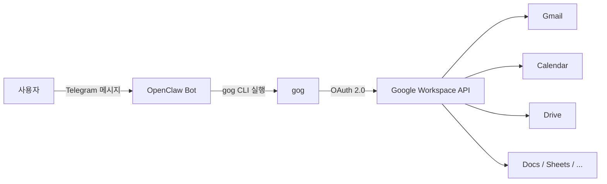

# 1. 개요

OpenClaw에 Google Workspace를 연동하면 Telegram 채팅만으로 Gmail, Calendar, Drive를 제어할 수 있다. 이 글에서는 [gog(Google Workspace CLI)](https://clawhub.ai/steipete/gog)를 OpenClaw에 설정하는 과정을 정리한다.

> **Google Cloud Console에서 OAuth JSON 파일을 다운로드한 이후, 모든 작업을 Telegram 채팅으로만 진행**했다. 터미널에서 직접 명령어를 입력한 적이 없다.

- Google Cloud Console에서 OAuth 설정 (웹 브라우저)
- JSON credential 파일을 Telegram으로 전송한 이후부터는 모두 Telegram으로 진행했고, CLI 명령어를 직접 입력하지 않았다.

> OpenClaw 기본 설치와 Telegram 봇 연동은 [OpenClaw 완벽 가이드](/openclaw-완벽-가이드) 글을 참고하자.

# 2. gog란?

gog는 Google Workspace를 터미널에서 제어하는 CLI 도구다.

지원 서비스:

- **Gmail** - 메일 검색, 읽기, 전송, 라벨 관리
- **Calendar** - 일정 조회, 생성, 수정
- **Drive** - 파일 검색, 업로드, 다운로드
- **Contacts** - 연락처 관리
- **Docs / Sheets / Slides** - 문서 관리
- **Tasks** - 할 일 관리
- **Chat** - Google Chat 메시지
- **Forms** - 설문 데이터 조회
- **Apps Script** - 스크립트 관리

OpenClaw과 연동하면 이 모든 것을 자연어 대화로 처리할 수 있다.



# 3. 사전 준비사항

- OpenClaw 설치 및 Telegram 봇 연동 완료
- macOS 환경 (brew 사용 가능)
- Google 계정

# 4. 설정 과정 전체 흐름

전체 흐름을 요약하면 다음과 같다.

1. **Google Cloud Console** - OAuth 프로젝트 생성 & Client ID 생성 → JSON 다운로드
2. **Telegram** - JSON 파일을 OpenClaw 봇에 전송
3. **Telegram** - Gmail 주소 전달 → OpenClaw이 인증 URL 생성
4. **브라우저** - Google 로그인 & 권한 승인 → callback URL 복사
5. **Telegram** - callback URL 붙여넣기 → OpenClaw이 토큰 교환 & 설정 완료
6. **Google Cloud Console** - Gmail, Calendar, Drive API 활성화
7. **Telegram** - "내일 일정 알려줘" → Google Workspace 사용 시작

# 5. gog 설치

Telegram에서 OpenClaw 봇에게 gog 설정 어떻게 하는지 문의를 해보았다.

> **나**: gog google workspace를 설정해보고 싶다. https://clawhub.ai/steipete/gog
>
> **OpenClaw**: 이전에 `gogcli`는 이미 설치했어. 이제 **Google 인증 설정**이 필요해. 단계별로 가자:
>
> Step 1: Google Cloud OAuth 클라이언트 만들기
>
> 1. **Google Cloud Console** 열기 — https://console.cloud.google.com/
> 2. **새 프로젝트** 생성 (이름: `gog-cli`)
> 3. **APIs & Services → OAuth consent screen** 설정
> 4. **APIs & Services → Credentials → Create Credentials → OAuth client ID**
>    - Application type: **Desktop app**
>    - `client_secret_xxxx.json` 다운로드


OpenClaw이 바로 전체 설정 단계를 안내해준다. gog가 아직 설치되어 있지 않은 경우, "gog 설치해줘"라고 말하면 OpenClaw이 백그라운드에서 `brew install gogcli`를 실행한다.

# 6. Google Cloud Console OAuth 설정

이 단계는 **사용자가 웹 브라우저에서 직접** 수행해야 하는 유일한 구간이다.

## 6.1 프로젝트 생성

[Google Cloud Console](https://console.cloud.google.com/)에 접속하여 새 프로젝트를 생성한다.

- 프로젝트 이름: `gog-cli` (원하는 이름)


## 6.2 OAuth consent screen 설정

APIs 및 서비스 → OAuth 동의 화면 클릭 하면 OAuth 개요 페이지로 이동하면 시작하기 버튼을 클릭한다

**앱 정보** 입력:

- 앱 이름: `gog-cli`
- 사용자 지원 이메일: 본인 이메일


**대상** 선택:

- **외부 (External)** 선택


연락처 정보 입력 후 완료한다.


## 6.3 OAuth Client ID 생성

APIs & Services → Credentials → **사용자 인증 정보 만들기** → **OAuth 클라이언트 ID**를 선택한다.


- 애플리케이션 유형: **데스크톱 앱**
- 이름: `gog-cli`
- **만들기** 클릭


생성이 완료되면 **JSON 다운로드** 버튼을 클릭하여 `client_secret_xxxx...xxxx.json` 파일을 다운로드한다.


> **여기까지가 웹 브라우저에서 하는 마지막 작업이다.** 이후부터는 다시 Telegram 채팅으로 돌아간다.

# 7. gog 인증 설정 (Telegram 채팅으로 진행)

> 이 섹션부터는 **터미널을 직접 조작하지 않는다.** 모든 CLI 명령은 OpenClaw이 대신 실행한다.

## 7.1 JSON 크리덴셜 파일 전달

다운로드한 JSON 파일을 Telegram 채팅에 파일 첨부로 전송한다.

> **나**: *(client_secret_xxxx...xxxx.json 파일 첨부)*
>
> **OpenClaw**: 파일 받았어! 설정 진행할게.
>
> **OpenClaw**: 크리덴셜 등록 완료! 이제 Google 계정 인증이 필요해.
> 네 Gmail 주소 알려줘 — `--manual` 모드로 실행해서 인증 URL 보내줄게!

**OpenClaw 백그라운드 작업:**

```bash
# 1. Telegram에서 받은 JSON 파일을 Mac Mini에 저장
mv /tmp/telegram_download/client_secret_xxxx.json ~/Downloads/

# 2. gog에 OAuth 크리덴셜 등록
gog auth credentials ~/Downloads/client_secret_xxxx...xxxx.json
```

## 7.2 Gmail 주소 전달 → 인증 URL 수신

Gmail 주소를 채팅에 입력하면 OpenClaw이 인증 URL을 보내준다.

> **나**: your-email...@gmail.com
>
> **OpenClaw**: 대기 중! 이제 아래 단계 따라해줘:
>
> **1.** 이 링크를 브라우저에서 열어:
> `https://accounts.google.com/o/oauth2/auth?access_type=offline&client_id=xxxx...xxxx&...`
>
> **2.** Google 로그인 후 권한 승인
>
> **3.** 페이지가 안 열리는 건 정상! 브라우저 **주소창의 전체 URL**을 복사해서 나한테 보내줘
> `http://127.0.0.1:.../oauth2/callback?state=...&code=...` 이런 식으로 생긴 URL이야!

**OpenClaw 백그라운드 작업:**

```bash
# --manual 모드로 인증 시작 (브라우저 대신 URL을 직접 출력)
gog auth add your-email...@gmail.com --manual

# 출력된 OAuth 인증 URL을 Telegram 메시지로 전달
# 로컬 콜백 서버(127.0.0.1:50554)를 백그라운드에서 대기
```

### 7.2.1 트러블슈팅: 403 access_denied

처음 인증 URL을 열면 403 에러가 발생할 수 있다.


> **나**: *(403 access_denied 스크린샷 전송)*
>
> **OpenClaw**: `403 access_denied` — OAuth 앱이 아직 **테스트 모드**라서 그래. 테스트 사용자를 추가해야 해.
>
> Google Cloud Console에서:
>
> 1. **APIs & Services → OAuth consent screen** 이동
> 2. **Test users** 섹션에서 **Add users** 클릭
> 3. 본인 이메일 추가
>
> **나**: 나는 테스트 사용자를 추가하고 싶지 않고 실제 동작하면 된다. 앱 게시를 클릭하면 될까?
>
> **OpenClaw**: 응, **앱 게시(Publish)** 하면 돼! 본인만 쓰는 거면 문제없어.
>
> **나**: 게시 완료했다

원인은 OAuth 앱이 기본적으로 **테스트 모드**로 생성되기 때문이다. 해결 방법은 두 가지:

1. **앱 게시**: OAuth consent screen → 대상 → **앱 게시** 클릭 (본인만 사용할 경우 권장)
2. **테스트 사용자 추가**: 대상 → 테스트 사용자에 본인 이메일 추가


### 7.2.2 Google 로그인 → callback URL 전달

앱 게시 후 인증 URL을 다시 열면 정상적으로 Google 로그인이 진행된다.

**1. 계정 선택**


**2. "Google에서 확인하지 않은 앱" 경고**

앱이 Google의 공식 검증을 받지 않았기 때문에 경고가 표시된다. 본인이 만든 앱이므로 **고급 → 계속**을 클릭한다.


**3. 권한 요청 승인**

gog-cli가 접근할 Google 서비스 목록이 표시된다. **계속**을 클릭하여 모든 권한을 승인한다.


**4. callback URL 복사**

승인 후 `http://127.0.0.1:50554/oauth2/callback?...` 주소로 리디렉션되는데, 페이지가 열리지 않는 것은 **정상**이다. 브라우저 주소창의 **전체 URL을 복사**하여 Telegram에 붙여넣는다.

> **나**: `http://127.0.0.1:50554/oauth2/callback?state=xxxx...xxxx&code=4/0Axxxx...xxxx&scope=email%20profile%20...`
>
> **OpenClaw**: 인증 완료!
>
> ```
> email     your-email...@gmail.com
> services  appscript, calendar, chat, classroom, contacts,
>           docs, drive, forms, gmail, people, sheets, slides, tasks
> ```

**OpenClaw 백그라운드 작업:**

```bash
# 1. 사용자가 보내준 callback URL에서 authorization code 추출
#    http://127.0.0.1:50554/oauth2/callback?code=4/0Axxxx...xxxx&...
#    → code = "4/0Axxxx...xxxx"

# 2. authorization code로 Google OAuth 토큰 교환
#    (gog 내부적으로 code → access_token + refresh_token 교환)

# 3. 토큰을 macOS 키체인에 안전하게 저장

# 4. 인증 결과 확인
gog auth list
# → email: your-email...@gmail.com, services: 13개 서비스 연동 확인
```

### 7.2.3 트러블슈팅: macOS 키체인 접근

gog는 인증 토큰을 macOS 키체인에 저장한다. 최초 실행 시 키체인 접근 허용 팝업이 뜰 수 있다.

> **OpenClaw**: `gog auth list`가 계속 멈추는데, macOS 키체인 접근 문제일 수 있어. Mac Mini에서 직접 터미널로 테스트해봐 — 키체인 접근 허용 팝업이 뜰 수 있어.
>
> **나**: 키체인 접근 팝업 창이 많이 떴는데, 일반 암호 입력하고 완료를 했다
>
> **OpenClaw**: 좋아! 키체인 접근 허용했으니 이제 될 거야. 다시 테스트해볼게!

키체인 팝업은 Mac Mini 화면에서 직접 처리해야 한다. 한 번 허용하면 이후에는 자동으로 접근된다.

## 7.3 환경변수 설정

`GOG_ACCOUNT` 환경변수를 설정해야 매번 `--account` 옵션을 붙이지 않아도 된다.

> **나**: GOG_ACCOUNT 환경 변수도 설정이 되어 있을까?
>
> **OpenClaw**: 안 돼있어! 설정해줄게.
>
> **OpenClaw**: 추가 완료!
>
> - `~/.zshrc`에 `export GOG_ACCOUNT=your-email...@gmail.com` 추가됨
> - 새 터미널 세션부터 자동 적용
>
> **나**: source ~/.zshrc 를 실행해줘
>
> **OpenClaw**: 설정 완료! `GOG_ACCOUNT=your-email...@gmail.com` 적용됐어.

**OpenClaw 백그라운드 작업:**

```bash
# 1. ~/.zshrc에 환경변수 추가
echo 'export GOG_ACCOUNT=your-email...@gmail.com' >> ~/.zshrc

# 2. 현재 세션에 적용
source ~/.zshrc
```

# 8. Google API 활성화

인증은 완료됐지만, Google Cloud 프로젝트에서 실제 사용할 API를 **활성화**해야 동작한다. OpenClaw이 테스트를 시도하면서 필요한 API 목록과 링크를 알려준다.

> **OpenClaw**: 진전이 있어! 키체인은 해결됐고, 이제 **Google Cloud에서 API를 활성화**해야 해.
>
> 1. **Gmail API**: `https://console.developers.google.com/apis/api/gmail.googleapis.com/...`
> 2. **Calendar API**: `https://console.developers.google.com/apis/api/calendar-json.googleapis.com/...`
> 3. **Drive API**: `https://console.developers.google.com/apis/api/drive.googleapis.com/...`

Google Cloud Console에서 각 API를 검색하여 **사용** 버튼을 클릭한다.


활성화 후 Telegram에서 알려주면 OpenClaw이 바로 테스트한다.


**OpenClaw 백그라운드 작업:**

```bash
# 사용자가 "활성화 시켰다"고 말하면 바로 테스트 실행
gog gmail search 'newer_than:1d'     # → Gmail API 정상 확인
gog calendar calendars                # → Calendar API 정상 확인
gog drive files list                  # → Drive API 정상 확인

# 결과를 정리하여 Telegram으로 응답
```

> 필요에 따라 Contacts, Tasks, Sheets 등 추가 API도 활성화할 수 있다.

# 9. 실전 활용

설정이 완료되면 자연어로 Google Workspace를 바로 사용할 수 있다.

## 9.1 캘린더 일정 조회


## 9.2 자연어 → gog 명령어 변환

사용자가 자연어로 요청하면 OpenClaw이 적절한 gog 명령어로 변환하여 실행한다. 사용자는 gog 명령어 문법을 전혀 알 필요가 없다.


| 사용자 (자연어)               | OpenClaw이 실행하는 명령                                              |
| ----------------------------- | --------------------------------------------------------------------- |
| "내일 일정 알려줘"            | `gog calendar events --from 2026-02-20 --to 2026-02-21`               |
| "3월 주말 일정도 알려줘"      | `gog calendar events --from 2026-03-01 --to 2026-03-31` + 주말 필터링 |
| "오늘 온 메일 확인해줘"       | `gog gmail search 'newer_than:1d'`                                    |
| "드라이브에서 XX 파일 찾아줘" | `gog drive files list --query 'name contains "XX"'`                   |

# 10. 마무리

전체 설정은 약 10분이면 완료되고, 그중 사용자가 직접 하는 작업은 Google Cloud Console과 브라우저 인증뿐이다.

설정 이후에는 Telegram에서 자연어로 요청만 하면 된다. "오늘 메일 확인해줘", "이번 주 일정 알려줘"처럼 말하면 OpenClaw이 gog 명령어를 알아서 선택하고, 실행 결과를 사람이 읽기 쉬운 형태로 정리해서 답변해준다.

# 11. 참고

- [gog 공식 문서 (ClaWHub)](https://clawhub.ai/steipete/gog)
- [Google Cloud Console](https://console.cloud.google.com/)
- [OpenClaw 완벽 가이드](/openclaw-완벽-가이드)
- [OpenClaw Telegram 멀티 에이전트 구성하기](/openclaw-telegram-멀티-에이전트-구성하기)
