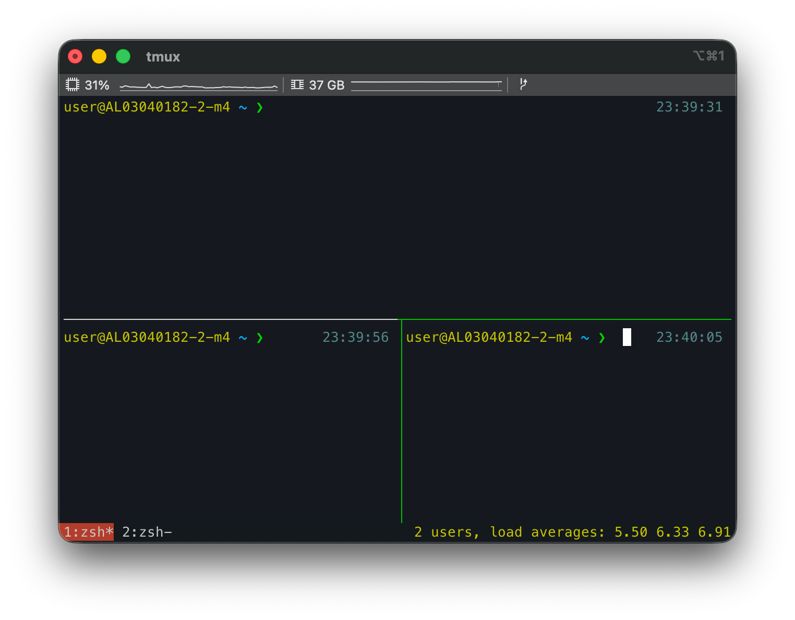

# 1. 들어가며

예전에 Linux 서버를 자주 다룰 때는 `tmux` 없이 일하는 게 상상이 안 됐다. 그러다 로컬 개발 위주로 일하면서 한동안 잊고 지냈는데, 요즘 Claude Code 같은 터미널 기반 AI 코딩 도구를 쓰면서 다시 손이 가기 시작했다. 이참에 입문자 관점에서 tmux를 처음부터 차근차근 정리해 둔다.

혹시 이런 경험이 있다면 tmux가 답이 될 수 있다.

- 터미널 탭이 10개씩 열려서 어디에 뭐가 있는지 모르겠다.
- 원격 서버에서 작업하다 SSH가 끊겨 돌아가던 빌드나 스크립트가 통째로 날아갔다.
- 한 화면에서 코드 편집과 로그를 같이 보고 싶은데 창을 계속 왔다 갔다 한다.

이 글은 설치를 macOS 기준으로 다루고, 개념부터 기본 사용법, 최소 설정까지 순서대로 짚은 뒤, 마지막에 Claude Code Session과 함께 쓰는 활용법을 소개한다. 위에서 아래로 그대로 따라 치면 된다.

# 2. tmux란?

tmux는 **t**erminal **mux**(multiplexer), 즉 "터미널 멀티플렉서"의 줄임말이다. 하나의 터미널 창 안에서 여러 작업 공간을 다루고, 그 작업 공간을 백그라운드에 띄워둘 수 있게 해주는 도구다.

입문자가 기억할 핵심 가치는 두 가지다.

**① Session 지속성(persistence)** — tmux Session은 터미널 창을 닫거나 SSH 연결이 끊겨도 백그라운드에 그대로 살아있다. 나중에 다시 붙기만(attach) 하면 하던 작업이 끊긴 적 없다는 듯 이어진다. 앞서 말한 "SSH가 끊겨 빌드가 날아갔다"는 문제가 바로 여기서 사라진다.

**② 화면 분할** — 하나의 화면을 여러 Window와 Pane으로 나눠 동시에 여러 작업을 볼 수 있다. 편집기, 로그, 개발 서버를 한눈에 두고 작업할 수 있다.

한 줄로 비유하면, tmux는 **닫아도 사라지지 않고, 칸막이를 자유롭게 나눌 수 있는 작업 공간**이다.

# 3. 설치 (macOS)

macOS에서는 Homebrew로 한 줄이면 끝난다.

```bash
brew install tmux
```

설치가 끝나면 버전을 확인해 본다.

```bash
tmux -V
# tmux 3.5a  (예시)
```

버전 문자열이 출력되면 준비 완료다. 이제 터미널에서 `tmux`라고 입력하면 첫 Session이 시작된다.

# 4. 핵심 개념: Session, Window, Pane

tmux를 쓰려면 세 가지 단위를 알아야 한다. 셋은 **Session > Window > Pane** 순서로 포함 관계를 이룬다.

- **Session**: tmux의 최상위 작업 공간 단위다. 보통 프로젝트나 작업 하나당 Session 하나를 쓴다. 앞서 말한 detach/attach의 대상이 바로 이 Session이다.
- **Window**: Session 안의 "탭"이라고 보면 된다. 화면 전체를 차지하며, 여러 Window를 번갈아 가며 본다.
- **Pane**: Window를 나눈 분할 화면이다. 한 Window 안에 여러 Pane이 동시에 보인다.

정리하면 Session 하나 안에 Window 여러 개가 있고, Window 하나 안에 Pane 여러 개가 들어가는 구조다. 브라우저에 비유하면 Window는 "탭", Pane은 한 탭을 좌우·상하로 나눈 "분할 화면"에 해당한다.

실제로 Window 하나를 세 개의 Pane으로 나누면 아래처럼 보인다. 위쪽 Pane 하나와 아래쪽 Pane 두 개가 한 화면에 동시에 떠 있고, 맨 아래 줄이 Window 목록과 상태를 보여주는 상태 표시줄이다.



# 5. 기본 사용법

tmux의 거의 모든 단축키는 **`Ctrl+b`를 먼저 누른 뒤** 다음 키를 누르는 방식이다. 이 `Ctrl+b`를 **prefix(접두) 키**라고 부른다. 예를 들어 `Ctrl+b c`는 "`Ctrl+b`를 누르고 손을 뗀 다음 `c`를 누른다"는 뜻이다. 동시에 누르는 게 아니라 순서대로 누른다는 점만 기억하면 된다. (이 prefix 키는 다른 키로 바꿀 수도 있는데, 6장에서 다룬다.)

## 5.1 Session

Session은 작업 공간 전체를 담는 단위다. 보통 프로젝트 하나에 Session 하나를 만들어 두고, 일이 끝나면 detach로 빠져나왔다가 나중에 다시 attach해서 이어 간다. 가장 자주 쓰는 건 이 세 가지다.

- 새 Session 시작(이름 지정): `tmux new -s my-project`
- Session에서 빠져나오기(detach): `Ctrl+b d` (Session은 계속 살아있음)
- Session에 다시 붙기(attach): `tmux attach -t my-project`

detach해도 Session 안의 작업은 백그라운드에서 계속 돌아간다. 이 detach/attach가 tmux의 핵심이다. 나머지 Session 관련 명령은 다음과 같다.

| 동작 | 명령 / 단축키 |
|------|---------------|
| 새 Session 시작 | `tmux new -s 이름` |
| detach (빠져나오기) | `Ctrl+b d` |
| attach (다시 붙기) | `tmux attach -t 이름` |
| 가장 최근 Session에 붙기 | `tmux a` |
| Session 목록 보기 | `tmux ls` |
| Session 목록에서 골라 전환 | `Ctrl+b s` |
| Session 이름 변경 | `Ctrl+b $` |
| Session 종료 | `tmux kill-session -t 이름` |

## 5.2 Window

Window는 Session 안의 "탭"이다. 작업 성격별로 Window를 나눠 두면(예: 하나는 편집용, 하나는 서버용) 번갈아 보기 편하다. 자주 쓰는 건 새 Window 만들기와 이동이다.

- 새 Window: `Ctrl+b c`
- 다음 / 이전 Window: `Ctrl+b n` / `Ctrl+b p`
- 번호로 이동: `Ctrl+b 0` ~ `Ctrl+b 9`

나머지 Window 관련 단축키는 다음과 같다.

| 동작 | 단축키 |
|------|--------|
| 새 Window | `Ctrl+b c` |
| 다음 / 이전 Window | `Ctrl+b n` / `Ctrl+b p` |
| 번호로 이동 | `Ctrl+b 0` ~ `Ctrl+b 9` |
| 직전에 보던 Window로 토글 | `Ctrl+b l` |
| Window 목록에서 골라 이동 | `Ctrl+b w` |
| Window 이름 변경 | `Ctrl+b ,` |
| 현재 Window 닫기 | `Ctrl+b &` (확인 후 y) |

## 5.3 Pane

Pane은 Window를 좌우·상하로 쪼갠 분할 화면이다. 한 화면에서 코드, 로그, 서버 출력을 동시에 보고 싶을 때 쓴다. 자주 쓰는 건 분할과 이동이다.

- 좌우 분할: `Ctrl+b %`
- 상하 분할: `Ctrl+b "`
- Pane 간 이동: `Ctrl+b 방향키`

나머지 Pane 관련 단축키는 다음과 같다.

| 동작 | 단축키 |
|------|--------|
| 좌우 분할 | `Ctrl+b %` |
| 상하 분할 | `Ctrl+b "` |
| Pane 간 이동 | `Ctrl+b 방향키` |
| 다음 Pane으로 순환 | `Ctrl+b o` |
| Pane 크기 조절 | `Ctrl+b Ctrl+방향키` |
| 현재 Pane 전체화면 토글(zoom) | `Ctrl+b z` |
| Pane 번호 표시 후 선택 | `Ctrl+b q` |
| 현재 Pane을 새 Window로 분리 | `Ctrl+b !` |
| 현재 Pane 닫기 | `Ctrl+b x` (확인 후 y) |

# 6. .tmux.conf 최소 설정

처음부터 화려하게 꾸밀 필요는 없다. 입문자에게 체감이 큰 네 가지만 `~/.tmux.conf`에 넣어보자.

```bash
# 1) prefix를 Ctrl+a로 변경 (Ctrl+b가 손에 안 맞으면)
unbind C-b
set -g prefix C-a
bind C-a send-prefix

# 2) 마우스로 Pane 선택/크기 조절/스크롤 가능
set -g mouse on

# 3) 분할 단축키를 직관적으로 ( | 좌우, - 상하 )
bind | split-window -h
bind - split-window -v

# 4) 설정 리로드 단축키 (prefix r)
bind r source-file ~/.tmux.conf \; display "Reloaded!"
```

저장한 뒤 적용하려면 tmux 안에서 `Ctrl+b r`을 누르면 된다. `tmux kill-server`로 다시 시작하는 방법도 있지만, 이건 **실행 중인 모든 Session이 종료되니** 주의하자. 보통은 `Ctrl+b r` 리로드로 충분하다.

참고로 1번 설정에서 prefix를 `Ctrl+a`로 바꾸는 것은 어디까지나 취향에 따른 **선택**이다. 바꾸면 기본 prefix와 달라지므로 헷갈릴 수 있다. 이 글의 나머지 본문에서 쓰는 단축키는 모두 **기본 prefix인 `Ctrl+b`** 기준이라는 점만 기억하자.

# 7. Claude Code와 함께 쓰기

여기까지가 tmux 기본기다. 이제 처음에 말했던, 내가 tmux를 다시 자주 쓰게 된 이유로 돌아와 보자. Claude Code와 tmux는 궁합이 꽤 좋다. 이유는 두 가지다.

- **장시간 자율 작업이 detach로 살아남는다.** Claude Code에 긴 작업을 맡겨두고 `Ctrl+b d`로 빠져나오면, 터미널을 닫아도 작업은 계속 돌아간다.
- **한 화면에서 병렬로 일할 수 있다.** Claude Code와 dev server, 로그를 Pane으로 나눠 동시에 보면 작업 흐름이 끊기지 않는다.

## 폴더마다 Session을 만들고 이름 붙이기

여러 프로젝트를 오가며 Claude Code를 쓰다 보면, 프로젝트(폴더)마다 tmux Session을 하나씩 띄워 두는 게 편하다. 여기에 머신을 여러 대(노트북, 데스크톱, 미니 PC 등) 쓴다면 Session 이름이 겹칠 수 있으니, **`<머신>-<폴더>` 규칙**으로 이름을 정해 두면 어디서 붙어도 헷갈리지 않는다. 예를 들어 데스크톱(`m4`)에서 `blog` 폴더를 열면 Session 이름은 `m4-blog`가 된다.

한 발 더 나아가, 각 Session에서 Claude Code를 띄울 때 같은 이름을 함께 넘겨주면 좋다. `-n <이름>`은 Claude 세션에 이름을 붙여 프롬프트와 resume 피커, 터미널 타이틀에 표시해 주고, `--remote-control <이름>`은 그 이름으로 원격 제어를 켜 준다. 폰이나 다른 PC에서 붙어도 "지금 이게 어느 작업인지"가 이름만으로 분명해진다.

아래는 내가 쓰는 스크립트를 단순화한 버전이다. `WORKSPACES`(폴더 목록)와 `VALID_MACHINES`(머신 이름)만 본인 환경에 맞게 바꾸면 된다.

```bash
#!/usr/bin/env bash
set -euo pipefail

# ===== 설정 (본인 환경에 맞게 수정) =====
WORKSPACES=(blog inspireme markora)   # ~/src 아래 폴더 이름들
VALID_MACHINES=(m1 m4 mini)           # 머신(노트북/데스크톱 등) 이름
SRC_DIR="${SRC_DIR:-$HOME/src}"
CLAUDE_CMD="${CLAUDE_CMD:-claude}"

# Session 이름 규칙: <머신>-<폴더>  (폴더의 . : 는 -로 치환)
session_name() { echo "$1-${2//[.:]/-}"; }

# Session에서 실행할 명령: Claude에 이름(-n)과 원격 제어 이름(--remote-control)을 부여
launch_cmd() { echo "$CLAUDE_CMD -n $1 --remote-control $1"; }

create_one() { # <머신> <디렉토리> <폴더>
  local session; session="$(session_name "$1" "$3")"
  if tmux has-session -t "$session" 2>/dev/null; then
    echo "이미 존재, 건너뜀 -> $session"
    return 0
  fi
  tmux new-session -d -s "$session" -c "$2" "$(launch_cmd "$session")"
  echo "생성됨 -> $session ($2)"
}

# 사용법: claude_tmux_sessions.sh <머신> [<폴더>]
#   폴더 생략 시 WORKSPACES 전부, 지정 시 그 폴더 하나만
machine="${1:?머신 이름이 필요합니다 (예: m4)}"
folder="${2:-}"

if [[ -n "$folder" ]]; then
  create_one "$machine" "$SRC_DIR/$folder" "$folder"
else
  for f in "${WORKSPACES[@]}"; do
    [[ -d "$SRC_DIR/$f" ]] && create_one "$machine" "$SRC_DIR/$f" "$f"
  done
fi

echo "----- 현재 tmux 세션 -----"
tmux ls
echo "접속: tmux attach -t <세션명>"
```

쓰는 법은 간단하다.

- 정의한 폴더를 한 번에 전부 띄우기: `claude_tmux_sessions.sh m4`
- 특정 폴더 하나만 띄우기: `claude_tmux_sessions.sh m4 blog`

그러면 `m4-blog`, `m4-inspireme` 같은 Session이 폴더마다 만들어지고, 각 Session 안에서 Claude Code가 같은 이름으로 떠 있다. 어디서든 `tmux attach -t m4-blog`로 붙어 이어서 작업하면 된다. detach해 두면 노트북을 닫거나 SSH가 끊겨도 작업은 계속 돌아가므로, 원격 서버에 띄워 두고 집·사무실·폰을 오가며 같은 작업을 이어 갈 수도 있다. (실제 스크립트에는 `--kill`로 만든 Session을 한꺼번에 정리하는 기능도 넣어 두었다.)

> 참고: `CLAUDE_CMD`에 `--dangerously-skip-permissions`를 붙이면 권한 확인을 매번 건너뛸 수 있지만, 도구가 확인 없이 명령을 실행하니 신뢰하는 환경에서만 쓰자. 또 `-n`, `--remote-control` 같은 옵션은 Claude Code 버전에 따라 다를 수 있으니 `claude --help`로 확인하면 된다.

> 주의: 같은 repo를 여러 Session에서 동시에 열어 Claude가 같은 파일을 동시에 고치면 충돌할 수 있다. 병렬 작업은 폴더를 나누거나 `git worktree`로 분리하는 것이 안전하다.

# 8. 마치며

tmux의 진짜 가치는 한 줄로 정리된다. **닫아도 사라지지 않는 작업 공간.** 화면 분할도 편하지만, 결국 가장 큰 변화는 "작업이 날아갈까 봐 터미널을 못 닫던" 상태에서 벗어나는 것이다.

처음부터 모든 단축키를 외울 필요는 없다. 아래 다섯 개부터 손에 익히면 된다.

- 새 Session: `tmux new -s 이름`
- 빠져나오기: `Ctrl+b d`
- 다시 붙기: `tmux attach -t 이름`
- 새 Window: `Ctrl+b c`
- 좌우 분할: `Ctrl+b %`

특히 `Ctrl+b d`(detach)와 `tmux attach`(다시 붙기)부터 익혀보길 권한다. 이 두 개만 손에 붙어도 터미널을 대하는 방식이 달라진다. 그다음 Claude Code 같은 장시간 작업에 얹어 쓰면, 왜 다시 tmux를 찾게 되는지 금방 체감할 것이다.

# 9. 참고

- [tmux + Claude Code: The Perfect Terminal Workflow](https://willness.dev/blog/tmux-claude-code-workflow)
- [Using tmux with Claude Code](https://hboon.com/using-tmux-with-claude-code/)
- [How to Run Claude Code with tmux on a VPS](https://codeongrass.com/blog/how-to-run-claude-code-with-tmux/)
- [Seamless Claude Code Handoff: SSH From Your Phone With tmux](https://elliotbonneville.com/phone-to-mac-persistent-terminal/)
- [Claude Code Multi-Agent tmux Setup](https://www.dariuszparys.com/claude-code-multi-agent-tmux-setup/)
