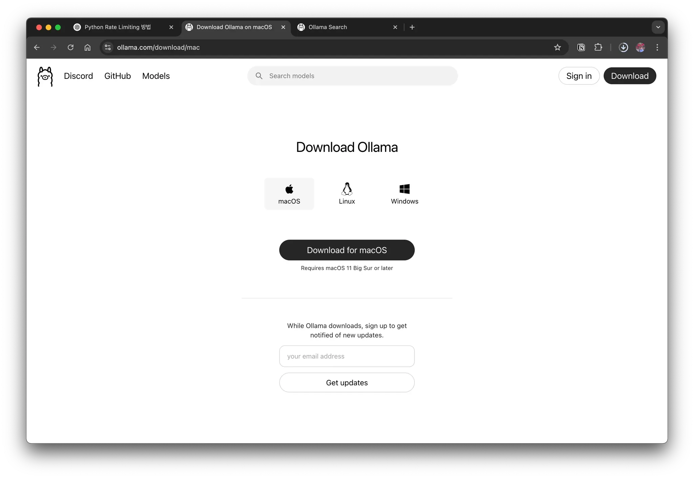
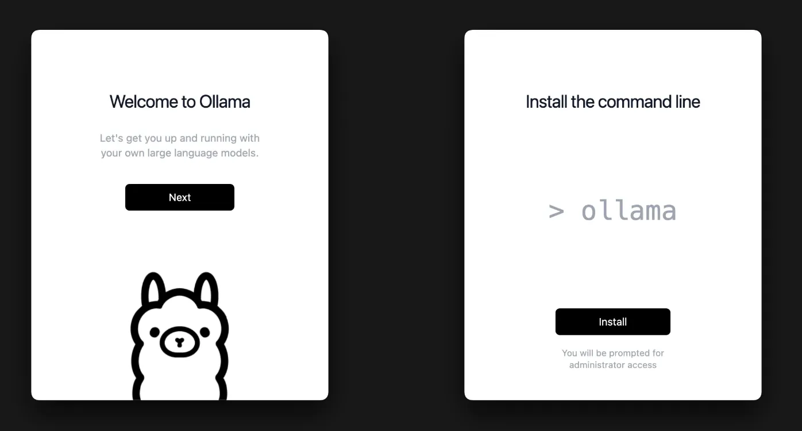
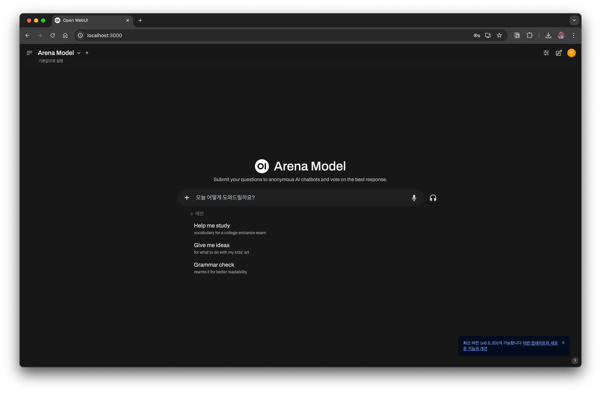
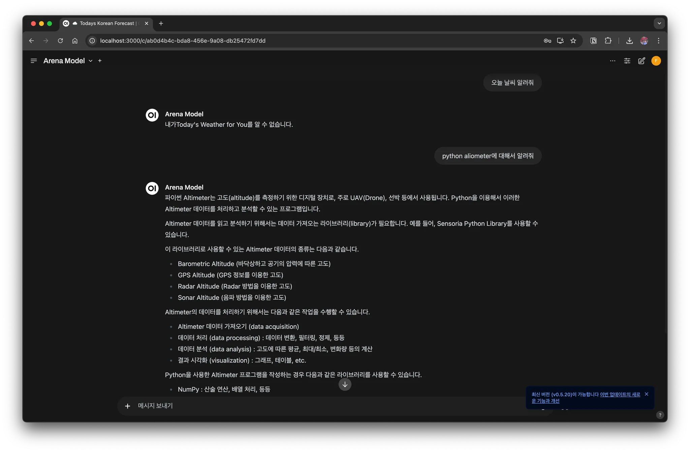

# 1. Overview

As AI-related services have become more widely used recently, the associated costs often become a burden. To address this, I'd like to introduce a way to build and use an `LLM` directly in a local environment. In this article, we cover how to install and use an `LLM` on macOS.

# 2. Installing an `LLM`

## 2.1 Installing and Verifying `Ollama`

First, install `Ollama`. `Ollama` is a tool that makes it easy to run an `LLM` locally.

### 2.1.1 Installation

Go to the website, download the build for your OS, and proceed with the installation.





If you'd like to install it from the terminal using a command, you can install it with `brew`.

```bash
> brew install --cask ollama
```

Once the installation is complete, verify that it was installed correctly.

```bash
> ollama -v
ollama version is 0.6.2
Warning: client version is 0.4.7
```

### 2.1.2 Running Ollama

After installation, you can now download and run a model.

```bash
> ollama run llama3.2
pulling manifest
pulling dde5aa3fc5ff... 100% ▕█████████████████████████████████████████▏ 2.0 GB
pulling 966de95ca8a6... 100% ▕█████████████████████████████████████████▏ 1.4 KB
pulling fcc5a6bec9da... 100% ▕█████████████████████████████████████████▏ 7.7 KB
pulling a70ff7e570d9... 100% ▕█████████████████████████████████████████▏ 6.0 KB
pulling 56bb8bd477a5... 100% ▕█████████████████████████████████████████▏   96 B
pulling 34bb5ab01051... 100% ▕█████████████████████████████████████████▏  561 B
verifying sha256 digest
writing manifest
success
>>> Send a message (/? for help)
```

When you type what you want at the `>>>` `LLM` prompt, you can see that it gives you an answer.

```bash
>>> hi
How can I help you today?
```

# 3. Using the `LLM`

## 3.1 Open WebUI

Using only the CLI environment can be inconvenient, so you can also use Open WebUI. Open WebUI is a web-based UI that makes it easy to use `Ollama`.

### 3.1.1 Installation

There are several methods, but here we'll simply run it with Docker.

```bash
# Create a volume folder to be used by Docker
> docker run -d -p 3000:8080 --add-host=host.docker.internal:host-gateway -v open-webui:/app/backend/data --name open-webui --restart always ghcr.io/open-webui/open-webui:main
```

Now, if you access [http://localhost:3000](http://localhost:3000) in your web browser, you can use `Ollama` through the web UI.



You can see that it looks similar to the ChatGPT web interface and works well.



## 3.2 Calling via the API

Ollama provides an API, so you can also call it directly using curl.

```bash
> curl -X POST "http://localhost:11434/api/generate" \
     -H "Content-Type: application/json" \
     -d '{"model": "llama3.2", "prompt": "Hello, what is AI?"}'
```

## 3.3 Calling from Python

For Python, a langchain library is provided, so you can use it to work with an `LLM`.

```python
from unittest import TestCase

from langchain.llms import Ollama
from langchain.chains import LLMChain
from langchain.prompts import PromptTemplate
from langchain.callbacks.manager import CallbackManager
from langchain.callbacks.streaming_stdout import StreamingStdOutCallbackHandler

class Test(TestCase):
    def test_ollam_example(self):
        # Initialize the Ollama model (the default model is llama3.2, but other models can also be specified)
        llm = Ollama(
            model="llama3.2",  # Specify the model to use (e.g., llama3.2, mistral, gemma, etc.)
            callback_manager=CallbackManager([StreamingStdOutCallbackHandler()]),
        )

        # Call the model with a simple prompt
        response = llm("What is Python?")
        print(f"\\nCompleted response: {response}")
```


# 4. Collection of Ollama Commands

The `ollama` command provides various subcommands, and the most frequently used ones are as follows.

- Check the list of models

  ```bash
  > ollama list
  NAME               ID              SIZE      MODIFIED
  llama3.2:latest    a80c4f17acd5    2.0 GB    6 hours ago
  mistral:latest     f974a74358d6    4.1 GB    3 months ago
  ```

- Add a new model

  - You can find downloadable models on the [library](https://ollama.com/library) site.

  ```bash
  > ollama pull gemma
  ```

- Remove a model

  ```bash
  > ollama rm mistral
  ```

- Run a model directly in your local environment

  ```bash
  > ollama run mistral
  ```

# 5. Conclusion

You've now learned how to build and use an `LLM` on macOS. With `Ollama` and Open WebUI, you can run AI models efficiently in a local environment, so I recommend trying it out for yourself.

# 6. References

- [LLM을 local에서 돌려보자](https://devocean.sk.com/blog/techBoardDetail.do?ID=165686&boardType=techBlog)
- [Ollama 를 활용해서 개인형 LLM 서버 구성하기](https://devocean.sk.com/blog/techBoardDetail.do?ID=165685&boardType=techBlog)
- [오픈소스 LLM 활용](https://wikidocs.net/232980)
- https://github.com/open-webui/open-webui
- https://github.com/ollama/ollama
