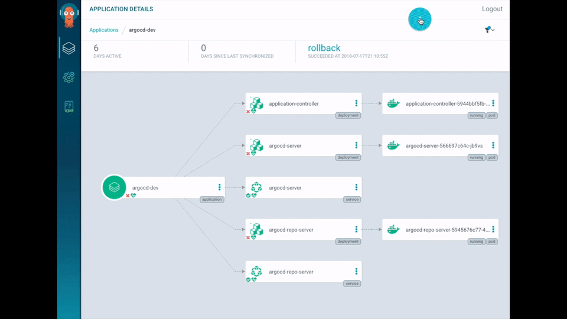
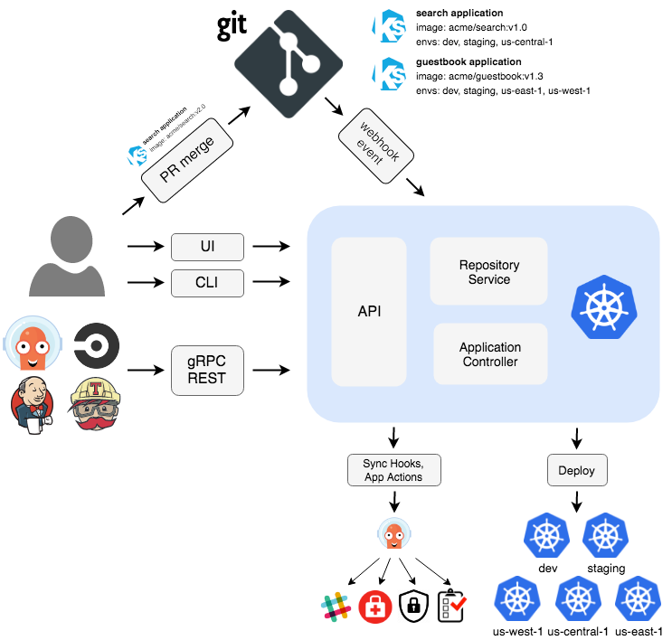
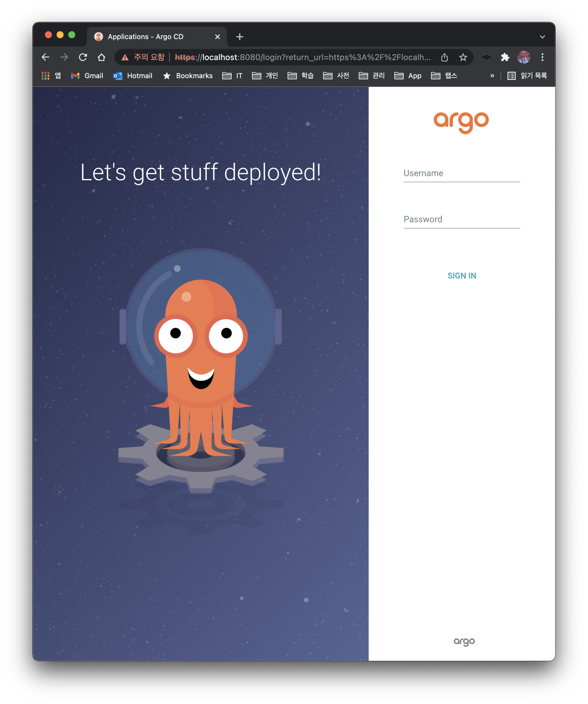
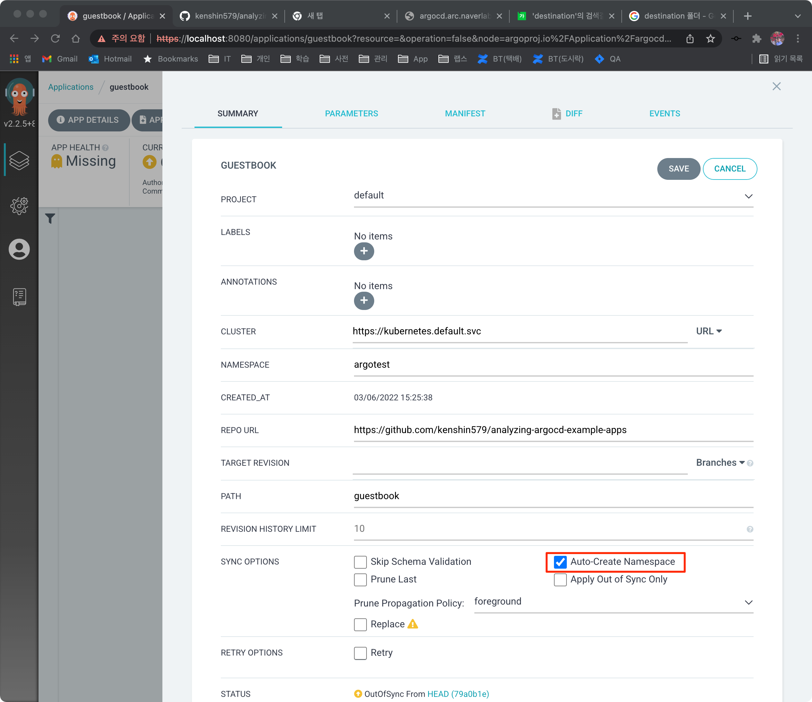
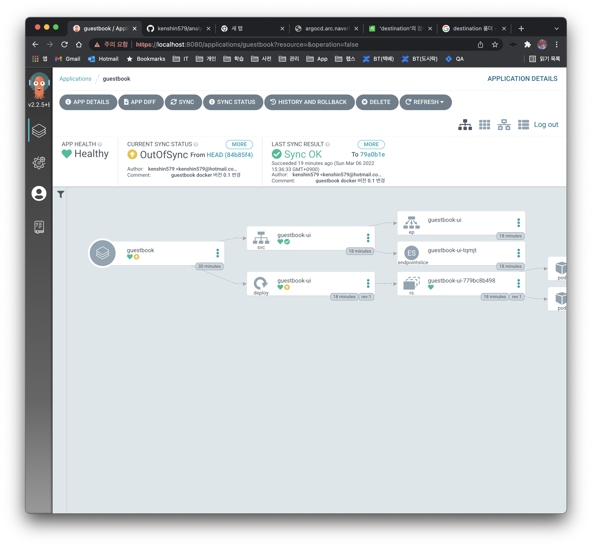
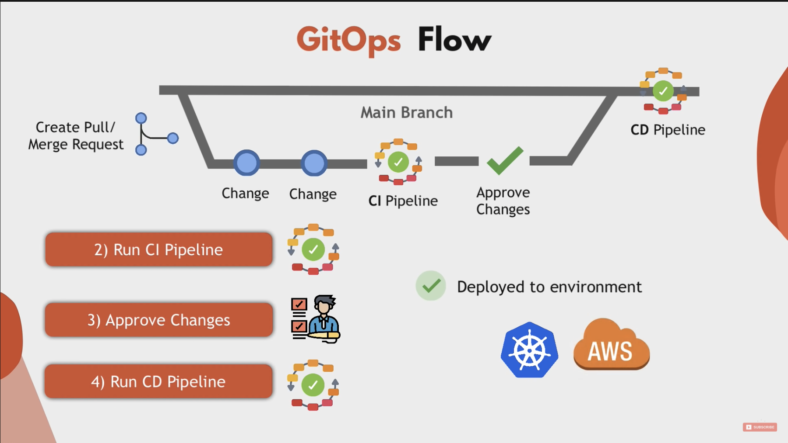

For the previous Argo Projects presentation, please refer to [here](https://blog.advenoh.pe.kr/argo-projects/).

# 1. Argo CD?

## 1.1 What?

Argo CD is a GitOps-based CD tool that provides the following features.



## 1.2 Feature

- Supports automatic deployment of applications to the target environment (as specified in the Git repository)
- Supports various template formats that generate Kubernetes manifest files
    - `Kustomize, Helm charts, plain-YAML, Ksonnet, Jsonnet`
- Supports the pull deployment model
    - Argo CD pulls changes to k8s manifests
- Ability to manage and deploy to multiple clusters
- SSO integrated authentication support (OIDC, OAuth2, LDAP, SAML 2.0, GitHub, GitLab, Microsoft, LinkedIn)
- Health status support for application resources
- Web UI and CLI support
- Webhook integration support (GitHub, BitBucket, GitLab)
- Also supports Presync, Sync, and Postsync hooks to support complex application rollouts

## 1.3 Architecture



Argo CD consists of **three components**. The roles Argo CD plays are as follows.

- **Continuously monitors** running applications
- Periodically **compares the current live state with the desired target state (as specified in the Git repository)**
    - A deployed application whose live state differs from the target state is considered **OutOfSync**
- Argo CD reports these differences and **visualizes them in the UI**
- Provides the ability to automatically or manually re-sync the live state back to the desired target state


- **API Server**
    - The API server exposes gRPC and REST APIs for use by the Web UI, CLI, and external systems
- Repository Server
    - Maintains a local cache of the Git repository that holds the application manifest files
    - Responsible for generating the manifest files stored in the Git repository
- **Application Controller**
    - The application controller continuously monitors running applications
    - Compares the live state with the target state and reports it in the UI (OutOfSync)

References

- https://argo-cd.readthedocs.io/en/stable/operator-manual/architecture/
- https://landscape.cncf.io/card-mode?project=incubating&selected=argo

# 2. When?

- As a CD (Continuous Delivery) tool, it is well suited for automatically deploying applications to Kubernetes environments

# 3. Why?

Compare the traditional Jenkins approach with Argo CD and decide for yourself which tool is more suitable for a Kubernetes environment.

- Jenkins
    - You have to install `kubectl` directly on the Jenkins server
    - You also need to configure credentials to access the k8s cluster
    - Once deployed, you cannot know the state of the deployment (no monitoring capability)
    - Push deployment

- Argo CD
    - It periodically monitors the target state (Git repository) and the current live state, so you can easily identify applications that need deployment
    - You can also verify whether the deployment succeeded after deployment
    - Pull deployment

# 4. How?

To install and use Argo CD, follow the steps below. This example was written by referring to the Argo CD [official documentation](https://argo-cd.readthedocs.io/en/stable/).

- Install Argo CD on a k8s cluster
- Create an Argo CD Application
    - Argo CLI
    - ArgoCD Web UI
    - kubernetes CRD

- Bump the Docker image version and sync it with Argo

# 5. Installing Argo CD in a Local Environment

To install `argo` in a local environment, run `minikube`. If you do not have the command, install it with `brew install minikube`.

```bash
$ minikube start
```

After creating the `argocd namespace`, install the Argo CD program.

```bash
$ kubectl create namespace argocd
$ kubectl apply -n argocd -f https://raw.githubusercontent.com/argoproj/argo-cd/stable/manifests/install.yaml
```

## 5.1 Accessing the Argo CD Web

Let's access the web server via port forwarding without exposing the Kubernetes service.

```bash
$ kubectl port-forward svc/argocd-server -n argocd 8080:443
```



The initial password for the admin account is generated automatically and stored as a base64 value in the `argocd-initial-admin-secret` secret. Use the `kubectl` command to easily check the password.

```bash
kubectl -n argocd get secret argocd-initial-admin-secret -o jsonpath="{.data.password}" | base64 -d; echo
HDzPVO0HOyGIDJD7
```


# 6. Creating an Argo CD Application

## 6.1 Creating with the Argo CLI

To create an application with the Argo CLI, you need to install the Argo CD CLI.

### 6.1.1 Installing the Argo CD CLI

With the CLI, you can create, query, and delete Argo applications.

```bash
$ brew install argocd
```

First, log in with `argocd login`. Use the same id/password you entered when logging in to the Web UI.

```bash
$ argocd login :8080
WARNING: server certificate had error: tls: either ServerName or InsecureSkipVerify must be specified in the tls.Config. Proceed insecurely (y/n)? y
Username: admin
Password:
'admin:login' logged in successfully
Context ':8080' updated

$ argocd app create guestbook --port-forward-namespace argocd --repo https://github.com/kenshin579/analyzing-argocd-example-apps --path guestbook --dest-server https://kubernetes.default.svc --dest-namespace argotest
```

> To test Argo by modifying and pushing files to a Git repository, I forked the argocd-example-apps repository provided in the Argo documentation.
>
> https://github.com/kenshin579/analyzing-argocd-example-apps
>

- repo
    - Specifies the repository to be managed by Argo CD
- path
    - Specifies the application directory by path within the repository
- dest-server
    - Specifies the target Kubernetes cluster URL
- dest-namespace
    - Specifies the target namespace where the application will be created


### 6.1.2 Verifying the Argo Application

```bash
$ argocd app get guestbook

Name:               guestbook
Project:            default
Server:             https://kubernetes.default.svc
Namespace:          argotest
URL:                https://:8080/applications/guestbook
Repo:               https://github.com/kenshin579/analyzing-argocd-example-apps
Target:
Path:               guestbook
SyncWindow:         Sync Allowed
Sync Policy:        <none>
Sync Status:        OutOfSync from  (79a0b1e)
Health Status:      Missing

GROUP  KIND        NAMESPACE  NAME          STATUS     HEALTH   HOOK  MESSAGE
       Service     argotest   guestbook-ui  OutOfSync  Missing
apps   Deployment  argotest   guestbook-ui  OutOfSync  Missing
```

### 6.1.3 Sync Application

If it is OutOfSync, you can also sync it via the command line.

```bash
$ argocd app sync guestbook
```

The sync failed because the `argotest namespace` did not exist. A simple way to resolve this is to create the `argotest namespace` and sync again.

```bash
TIMESTAMP                  GROUP        KIND   NAMESPACE                  NAME    STATUS    HEALTH        HOOK  MESSAGE
...(omitted)...
2022-03-06T15:28:22+09:00   apps  Deployment    argotest          guestbook-ui  OutOfSync  Missing              namespaces "argotest" not found

...(omitted)...
Phase:              Failed
Message:            one or more objects failed to apply, reason: namespaces "argotest" not found

GROUP  KIND        NAMESPACE  NAME          STATUS     HEALTH   HOOK  MESSAGE
       Service     argotest   guestbook-ui  OutOfSync  Missing        namespaces "argotest" not found
apps   Deployment  argotest   guestbook-ui  OutOfSync  Missing        namespaces "argotest" not found
FATA[0000] Operation has completed with phase: Failed
```

There is also an option to automatically create the desired namespace when deploying an application. In App Details, click the Auto-Create Namespace option, save it, and sync. You can then confirm that the k8s objects were created in the argotest namespace.



## 6.2 Creating from the Web UI

You can create it by clicking the Applications > New App button.

## 6.3 Creating with a Kubernetes Manifest File

```bash
$ cat applcation.yaml

apiVersion: argoproj.io/v1alpha1
kind: Application
metadata:
  name: myapp-argo-application
  namespace: argocd
spec:
  project: default
  source:
    repoURL: 'https://github.com/kenshin579/analyzing-argocd-example-apps'
    path: guestbook
  destination:
    server: 'https://kubernetes.default.svc'
    namespace: argotest
  syncPolicy:
    syncOptions:
      - CreateNamespace=true

$ kubectl -n argotest application.yaml
```


# 7. Bumping the Docker Image Version and Syncing with Argo

If you have built a new Docker image after developing your application, let's deploy it with Argo CD.

## 7.1 Modifying the Kubernetes Config File

Modify the Kubernetes config file in the Git repository. Bump the Docker image version, push, and then check it in Argo CD.

```bash
$ vim guestbook/guestbook-ui-deployment.yaml

apiVersion: apps/v1
kind: Deployment
metadata:
  name: guestbook-ui
spec:
  replicas: 2
  revisionHistoryLimit: 3
  selector:
    matchLabels:
      app: guestbook-ui
  template:
    metadata:
      labels:
        app: guestbook-ui
    spec:
      containers:
      - image: gcr.io/heptio-images/ks-guestbook-demo:0.2
        name: guestbook-ui
        ports:
        - containerPort: 80

```


## 7.2 Syncing from the Argo CD Web UI

Argo CD does not monitor the Git repository in real time but checks it periodically, so the UI does not immediately show OutOfSync. If you want to check it right away, click the Refresh button. Click the Sync button to sync.



# 8. FAQ

1. **What other GitOps-based CD tools are there?**

FluxCD, JenkinsX

References

- https://harness.io/blog/argo-cd-alternatives/
- https://blog.container-solutions.com/fluxcd-argocd-jenkins-x-gitops-tools

2. **Can't I manage the config settings together in the application repository?**

Because apps and configs have different purposes and life cycles, the best practice recommendation is to store them in separate Git repositories.

References

- https://kangwoo.kr/tag/argocd/
- https://argo-cd.readthedocs.io/en/stable/user-guide/best_practices/

# 9. Reference

- https://argo-cd.readthedocs.io/en/stable/
- https://ithub.tistory.com/345
- https://blog.wonizz.tk/2020/06/08/kubernetes-deploy-tool-argocd/


# 10. Terms

- CI (Continuous Integration)
- Refers to continuous integration, an automated process for developers
    - Continuous integration replaces the classic approach of applying quality control only after all development is complete, focusing on improving software quality and reducing the time it takes to deploy software.
    - ex. Jenkins, Github Action
- CD (Continuous Deployment)
    - Refers to automatically releasing developer changes from the repository all the way to a customer-facing production environment
    - ex. Jenkins, Argo CD

- CR (Custom Resource)
    - In addition to the object types Kubernetes provides by default (ex. Service, Secret), you can define and use resources of your own choosing
    - Kubernetes provides interfaces so you can easily develop custom controllers that operate based on user-defined CRDs

- CRD (Custom Resource Definition)
    - A CRD is a metadata object that declares what items are defined in the data of a CR
    - You write the file in YAML, just like an existing Kubernetes manifest file

- GitOps
    - The concept of GitOps is a term first coined by Weaveworks
    - It is a set of processes for managing and deploying declarative configuration files for infrastructure or applications through Git, in a way familiar to developers




# 11. References

- CR/CRD
    - https://blog.naver.com/PostView.naver?blogId=alice_k106&logNo=221579974362&redirect=Dlog&widgetTypeCall=true&directAccess=false
- CI/CD
    - https://kangwoo.kr/tag/argocd/
    - https://www.redhat.com/ko/topics/devops/what-is-ci-cd
- GitOps
    - https://www.samsungsds.com/kr/insights/gitops.html
    - https://coffeewhale.com/kubernetes/gitops/argocd/2020/02/10/gitops-argocd/
    - https://www.youtube.com/watch?v=MeU5_k9ssrs&t=2s
    - https://gruuuuu.github.io/cloud/argocd-gitops/
    - https://kangwoo.kr/tag/argocd/

# 12. Note

> This material was prepared for the CNCF study within our Platform Engineering team. If you are interested in the robot platform development we do, please refer to the links below, and if you would like to work with us in a challenging and passionate way, please apply.
>
> - Why did Naver build its second office building, 1784? https://www.youtube.com/watch?v=WG7JHLfClEo
> - Naver Labs - https://www.naverlabs.com/
