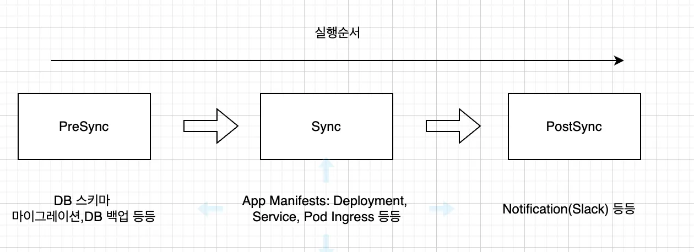
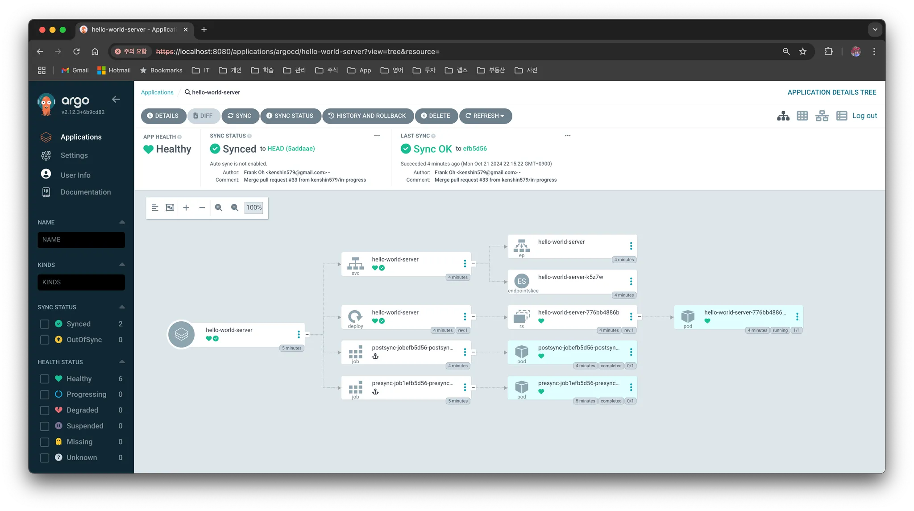
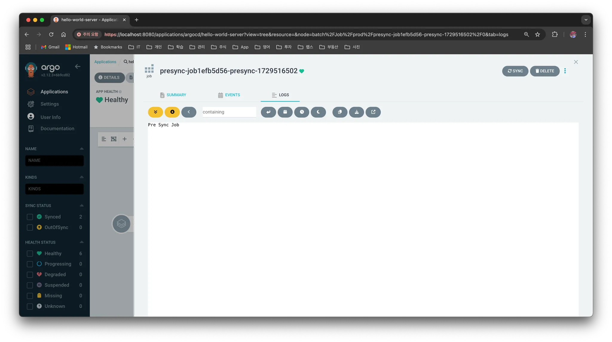
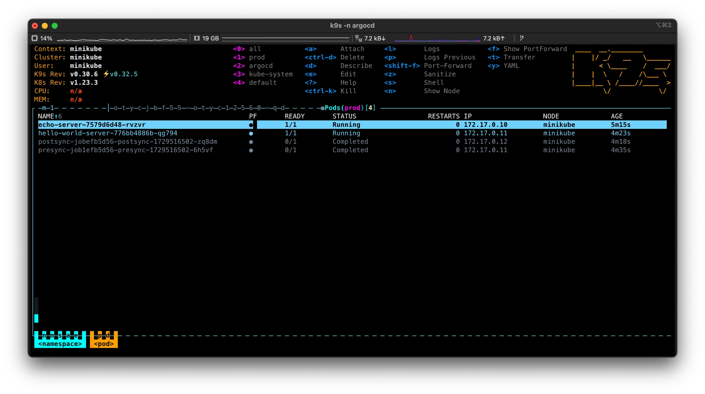
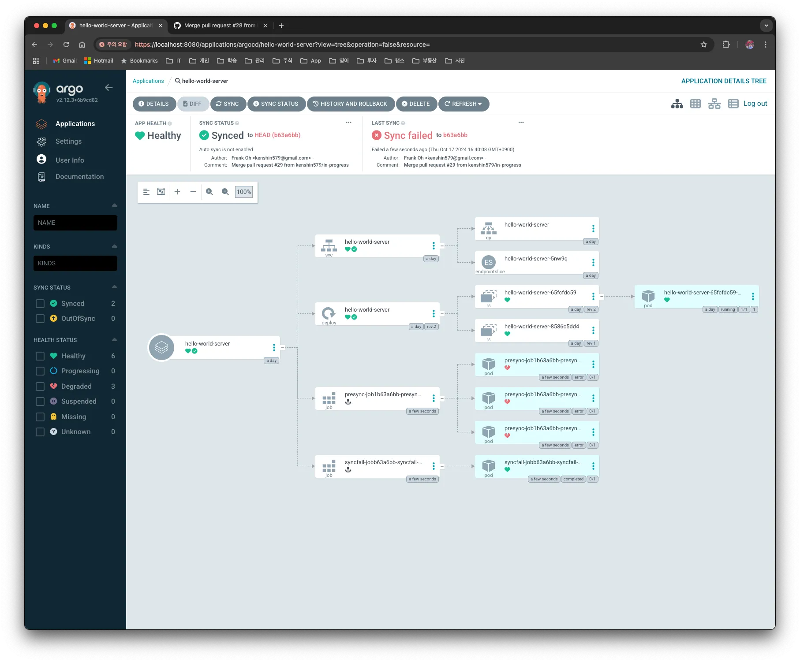
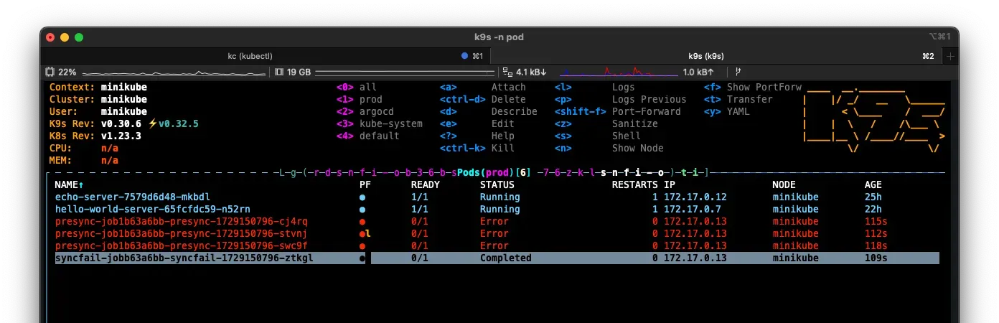
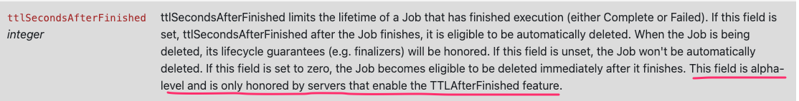
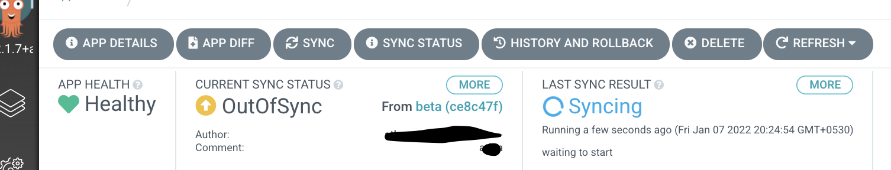
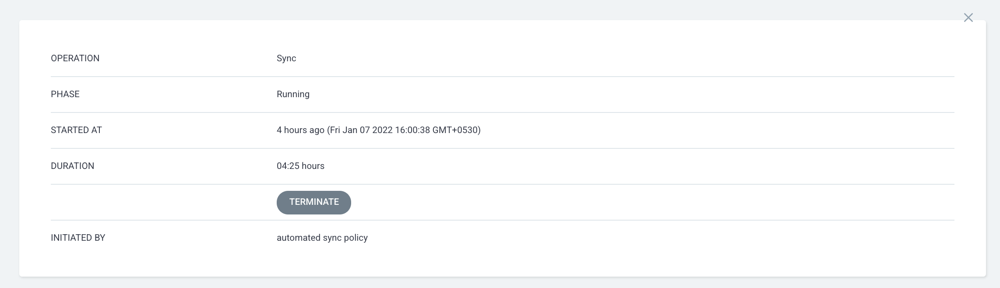

# 1. Overview

> What is [ArgoCD](https://blog.advenoh.pe.kr/argo-cd/)? Please refer here.

In this post, let's take a look at ArgoCD Resource Hooks.

In Argo CD, Sync is the process of synchronizing the declared state in the Git repository with the actual state of the Kubernetes cluster. Here, Resource Hooks are a feature ArgoCD provides for executing additional tasks (`PreSync`, Sync, `PostSync`, etc.) at specific points during this deployment process. With this, you can perform preparation tasks before deployment (e.g., DB schema migration) or verification tasks after deployment (e.g., notification).



The Resource Hooks provided by ArgoCD are as follows.

| Hook         | Description                                                  |
| ------------ | ------------------------------------------------------------ |
| `PreSync`    | Runs before the manifests are applied                       |
| `Sync`       | Runs alongside the manifest application after all `PreSync` hooks have completed successfully |
| `Skip`       | Specifies that Argo CD should skip applying the given manifest |
| `PostSync`   | Runs after all `Sync` hooks have completed successfully, the manifests have been applied successfully, and all resources are in a Healthy state |
| `SyncFail`   | Runs when the synchronization operation fails               |
| `PostDelete` | Runs after all application resources have been deleted (available from v2.10) |

# 2. How to Configure Resource Hooks

## 2.1 Configuring Resource Hooks

Let's look at how to apply a Resource Hook to an application.

Configuring a Resource Hook is as simple as adding an annotation. The following is an example that prints a message to the screen with the echo command in `PreSync`.

```yaml
---
apiVersion: batch/v1
kind: Job
metadata:
  generateName: presync-job
  annotations:
    argocd.argoproj.io/hook: PreSync
    argocd.argoproj.io/hook-delete-policy: HookSucceeded
spec:
  template:
    spec:
      containers:
        - name: presync-job
          image: ubuntu
          command:
            - /bin/bash
            - -c
            - |
              echo "Pre Sync Job"
      restartPolicy: Never
  backoffLimit: 2
```

The `yaml` file above should be written as a Job Resource in the `charts/template` folder of the Application you want to deploy.

```bash
❯ tree .
.
├── Chart.yaml
├── templates
│   ├── deployment.yaml
│   ├── pre-post-sync.yaml
│   └── service.yaml
└── values.yaml
```

Configuring `PostSync` is similar—you just write the `yaml` in the same way.

```yaml
apiVersion: batch/v1
kind: Job
metadata:
  generateName: postsync-job
  annotations:
    argocd.argoproj.io/hook: PostSync
    argocd.argoproj.io/hook-delete-policy: HookSucceeded
spec:
  template:
    spec:
      containers:
        - name: postsync-job
          image: ubuntu
          command:
            - /bin/bash
            - -c
            - |
              echo "Post Sync Job"
      restartPolicy: Never
  backoffLimit: 2
```

The example below is a `SyncFail` Hook that runs when synchronization fails.

```yaml
apiVersion: batch/v1
kind: Job
metadata:
  generateName: syncfail-job
  annotations:
    argocd.argoproj.io/hook: SyncFail
    argocd.argoproj.io/hook-delete-policy: HookSucceeded
spec:
  template:
    spec:
      containers:
        - name: syncfail-job
          image: curlimages/curl
          command:
            - "curl"
            - "-X"
            - "POST"
            - "-H"
            - "Content-Type: application/json"
            - "-d"
            - "payload={\\"status\\": \\"Failed\\"}"
            - "http://echo-server:8080/echo"
      restartPolicy: Never
  backoffLimit: 2
```

> What is `backOffLimit`?
>
> It is a property in a Kubernetes Job that specifies the number of retries for a failed task. If the Job's container fails, it retries according to the specified `backoffLimit` value, and if the number of retries exceeds this value, the Job is considered failed.
>
> `backoffLimit: 2`: means it will retry up to two times on failure


### 2.1.1 Hook Deletion Policy

How a Hook is deleted can be determined by the `argocd.argoproj.io/hook-delete-policy` annotation. The deletion policies provided by ArgoCD are as follows. If the annotation is not specified, it defaults to `BeforeHookCreation`.

| Policy               | Description                                                  |
| -------------------- | ------------------------------------------------------------ |
| `HookSucceeded`      | The hook resource is deleted after it succeeds (e.g., when a Job/Workflow completes successfully) |
| `HookFailed`         | The hook resource is deleted after it fails                 |
| `BeforeHookCreation` | The existing hook resource is deleted before a new hook is created (available from v1.3). This is designed to be used together with `/metadata/name` |

### 2.1.2 ArgoCD Execution Screen

When you actually run Sync, the ArgoCD UI displays it as shown below. A block with an `Anchor` mark is created, and by clicking it you can also check the value printed to the program screen in LOGS.





The Pods executed with `PreSync` and `PostSync` were not deleted because `hook-delete-policy` was not set. If you set it to `HookSucceeded`, the ArgoCD or Pod disappears after execution, so the actual result cannot be verified in the UI—therefore it was run without a deletion policy.



## 2.2 What is a Sync Wave?

A Sync Wave is a feature that controls the execution order when synchronizing multiple resources. For example, when you want a network configuration resource to be applied first and then the application to be deployed, you can set a Sync Wave value on each resource so they run sequentially.

- Each resource has `sync-wave: "0"` by default
- Resources with lower Wave numbers run first

> When there are multiple Pre Jobs

When defining multiple `PreSync` Jobs, you can set a `SyncWave` for each Job to specify the order. If there are multiple Jobs with the same Wave value, they run in parallel. For example, you can configure it as follows.

```bash
apiVersion: batch/v1
kind: Job
metadata:
  name: pre-sync-job-1
  annotations:
    argocd.argoproj.io/hook: PreSync
    argocd.argoproj.io/sync-wave: "0"
---
apiVersion: batch/v1
kind: Job
metadata:
  name: pre-sync-job-2
  annotations:
    argocd.argoproj.io/hook: PreSync
    argocd.argoproj.io/sync-wave: "1"
```

In the configuration above, `pre-sync-job-1` runs first, and then `pre-sync-job-2` runs afterward.

# 3. FAQ

## 3.1 If `PreSync` fails, will the next Hook not run?

If `PreSync` fails, it stops without moving on to the next Phase. In fact, if you force a failure as shown below and run it, you can confirm that `Sync` and `PostSync` also do not run.

```bash
---
apiVersion: batch/v1
kind: Job
metadata:
  generateName: presync-job
  annotations:
    argocd.argoproj.io/hook: PreSync
spec:
  template:
    spec:
      containers:
        - name: presync-job
          image: ubuntu
          command:
            - /bin/bash
            - -c
            - |
              echo "Pre Sync Job 1 - Fail" ; exit 1
      restartPolicy: Never
  backoffLimit: 2
```

In ArgoCD too, you can confirm that PreSync and PostSync are marked as failed, and finally the SyncFail Hook is executed.





## 3.2 If you specify the `HookSucceeded` deletion policy, it is deleted immediately after execution so you can't check the result—is there a way to delete it after, say, 5 minutes?

If you don't specify the `hook-delete-policy` annotation and instead set the `ttlSecondsAfterFinished: 600` value, it will be deleted after 600 seconds.

> What is `ttlSecondAfterFinished`?
> `ttlSecondsAfterFinished` is a field used in Kubernetes Jobs or CronJobs that sets, in seconds, the amount of time the resource remains before being deleted after the task completes.
>
> If you do not set the `ttlSecondsAfterFinished` field, the Job must be deleted manually and will continue to remain in the cluster.

```yaml
---
apiVersion: batch/v1
kind: Job
metadata:
  generateName: presync-job
  annotations:
    argocd.argoproj.io/hook: PreSync
spec:
  ttlSecondsAfterFinished: 600
  template:
    spec:
      containers:
        - name: presync-job
          image: ubuntu
          command:
            - /bin/bash
            - -c
            - |
              echo "Pre Sync Job"
      restartPolicy: Never
  backoffLimit: 2
```


> What if you applied `ttlSecondAfterFinished` but it is not deleted?
>
> It may not work depending on the Kubernetes version. It may not work if the version is too low or the feature is not enabled.
>
> 
> Reference: [JobSpec v1 batch (kubernetes v1.18)](https://k8s-dev-ko.netlify.app/docs/reference/generated/kubernetes-api/v1.18/)

## 3.3 The actual App version is the same so deployment isn't needed, but can I run `PreSync` and `PostSync` manually?

When you press the `Sync` button, it always runs `PreSync` → `Sync` → `PostSync`, so the Hooks are actually executed.

## 3.4 What should I do if Presync failed but the Deployment still needs to be deployed?

If a Pod was not deployed because an error occurred during Presync execution, you can deploy the Pod by selecting the deployment block in ArgoCD and manually starting it.

## 3.5 If it keeps Syncing/Terminating indefinitely, is there a way to forcibly terminate it?





You can forcibly terminate it by selecting the Application and clicking the `TERMINATE` button.


# 4. Conclusion

Argo CD's Resource Hooks are a powerful tool that lets you configure flexible tasks during the deployment process. With them, you can systematically manage tasks before, during, and after deployment, and achieve stable deployments even in complex environments.

By using Hooks and Sync Waves appropriately, you can precisely control the deployment order, which in turn improves the deployment speed and stability of the entire team.

> The content written in this post can be found here at [argocd-charts-sample](https://github.com/kenshin579/argocd-charts-sample).

# 5. References

- [ArgoCD Resource Hooks – Explained](https://foxutech.com/argocd-resource-hooks-explained/)
- [ArgoCD Phases](https://sungwook-choi.gitbook.io/argocd/sync-lifecycle/phases)
- [ArgoCD - Resource Hooks](https://argo-cd.readthedocs.io/en/stable/user-guide/resource_hooks/)
- [Argo CD — Resource Hooks (PreSync, PostSync, Sync, and SyncFail) and Sync Waves](https://medium.com/@raosharadhi11/argo-cd-resource-hooks-presync-postsync-sync-and-syncfail-and-sync-waves-e753c6f02d85)
