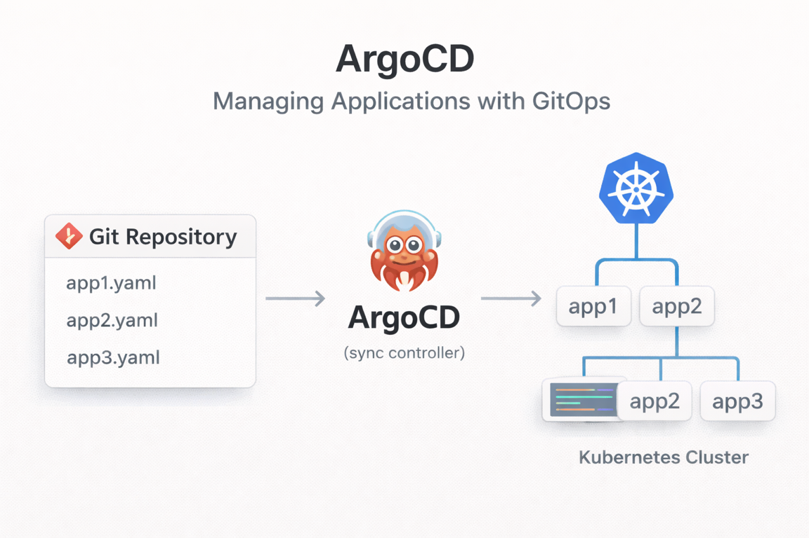

## 1. Overview



When managing multiple applications with `Helm Chart` in a `GitOps` environment, manually creating an `ArgoCD` Application for each application is tedious and error-prone.

For example, suppose you have the following `Helm Chart` structure.

```
chart/
├── echo-server/
├── hello-world-server/
└── hello-world-server-hook/
```

How should you deploy these three applications with `ArgoCD`?

### Deployment Patterns Provided by ArgoCD

| Pattern | Description | Automation Level | Flexibility |
| --- | --- | --- | --- |
| **Single Application** | Manually create an Application for each app | Low | High |
| **App of Apps** | A parent Application manages child Applications | Medium | Medium |
| **ApplicationSet** | Dynamically generate Applications via a `Generator` | High | Very High |

In this article, we compare the **App of Apps** pattern and the **ApplicationSet** pattern with real examples.

> Full sample code: [kenshin579/argocd-charts-sample](https://github.com/kenshin579/argocd-charts-sample)

---

## 2. Single Application

This is the most basic approach: you write a single Application `YAML` directly and deploy it.

```yaml
# bootstrap/single-app/single.yaml
apiVersion: argoproj.io/v1alpha1
kind: Application
metadata:
  name: hello-world-server
  namespace: argocd
spec:
  project: default
  source:
    repoURL: https://github.com/kenshin579/argocd-charts-sample
    path: chart/hello-world-server
    targetRevision: HEAD
    helm:
      valueFiles:
        - values.yaml
  destination:
    server: https://kubernetes.default.svc
    namespace: argocd-test
```

```bash
kubectl apply -f bootstrap/single-app/single.yaml -n argocd
```

This works fine when you only have a few applications, but as the number of managed targets grows, you have to write `YAML` files repeatedly, which makes maintenance harder.

---

## 3. App of Apps Pattern

### 3.1 Concept

This is a structure where a parent Application references a directory containing the child Application manifests. It can be implemented using only `ArgoCD`'s built-in features.

```
bootstrap/app-of-apps/
├── apps.yaml                          # Parent Application
└── applications/
    ├── echo-server.yaml               # Child Application 1
    ├── hello-world-server.yaml        # Child Application 2
    └── hello-world-server-hook.yaml   # Child Application 3
```

### 3.2 Parent Application

The parent Application specifies the `applications/` directory as `source.path`. `ArgoCD` automatically detects and creates all Application manifests inside this directory.

```yaml
# bootstrap/app-of-apps/apps.yaml
apiVersion: argoproj.io/v1alpha1
kind: Application
metadata:
  name: app-of-apps
  namespace: argocd
spec:
  project: default
  source:
    repoURL: https://github.com/kenshin579/argocd-charts-sample
    path: bootstrap/app-of-apps/applications
    targetRevision: HEAD
  destination:
    server: https://kubernetes.default.svc
    namespace: argocd
  syncPolicy:
    automated:
      prune: true
      selfHeal: true
```

### 3.3 Child Applications

Each child Application is defined as a separate `YAML` file that references an individual `Helm Chart`.

```yaml
# bootstrap/app-of-apps/applications/echo-server.yaml
apiVersion: argoproj.io/v1alpha1
kind: Application
metadata:
  name: echo-server
  namespace: argocd
spec:
  project: default
  source:
    repoURL: https://github.com/kenshin579/argocd-charts-sample
    path: chart/echo-server
    targetRevision: HEAD
    helm:
      valueFiles:
        - values.yaml
  destination:
    server: https://kubernetes.default.svc
    namespace: argocd-test
  syncPolicy:
    automated:
      prune: true
      selfHeal: true
```

```yaml
# bootstrap/app-of-apps/applications/hello-world-server.yaml
apiVersion: argoproj.io/v1alpha1
kind: Application
metadata:
  name: hello-world-server
  namespace: argocd
spec:
  project: default
  source:
    repoURL: https://github.com/kenshin579/argocd-charts-sample
    path: chart/hello-world-server
    targetRevision: HEAD
    helm:
      valueFiles:
        - values.yaml
  destination:
    server: https://kubernetes.default.svc
    namespace: argocd-test
  syncPolicy:
    automated:
      prune: true
      selfHeal: true
```

### 3.4 Deployment

```bash
kubectl apply -f bootstrap/app-of-apps/apps.yaml -n argocd
```

When you deploy the parent Application, `ArgoCD` reads the `YAML` files in the `applications/` directory and automatically creates the child Applications.

### 3.5 Pros and Cons

**Pros**
- Simple concept and easy to understand
- Each Application can be controlled independently and in fine detail
- Easy to debug (you can immediately identify which Application has an issue)

**Cons**
- Requires writing a `YAML` file every time you add a new application
- The number of files to manage grows as the number of applications increases
- Duplicate code is easy to occur

---

## 4. ApplicationSet Pattern

### 4.1 Concept

ApplicationSet is an `ArgoCD` extension feature that dynamically generates Applications using a `Generator` (ArgoCD 2.0+). Being template-based, it lets you define multiple Applications at once and keep the `DRY` principle.

The main `Generator` types are as follows.

| `Generator` | Description |
| --- | --- |
| `List` | Explicitly defines a list of applications |
| `Git` | Automatically detects the directory structure of a `Git` repository |
| `Matrix` | Combines multiple `Generator`s to produce a cartesian product |
| `Cluster` | Generates based on the list of registered clusters |

### 4.2 List Generator

Explicitly enumerate the list of applications to deploy. You can specify a name, path, namespace, and so on for each entry.

```yaml
# bootstrap/application-set/appset-list.yaml
apiVersion: argoproj.io/v1alpha1
kind: ApplicationSet
metadata:
  name: chart-applications-list
  namespace: argocd
spec:
  generators:
    - list:
        elements:
          - name: echo-server
            path: chart/echo-server
            namespace: argocd-test
          - name: hello-world-server
            path: chart/hello-world-server
            namespace: argocd-test
          - name: hello-world-server-hook
            path: chart/hello-world-server-hook
            namespace: argocd-test
  template:
    metadata:
      name: '{{name}}'
    spec:
      project: default
      source:
        repoURL: https://github.com/kenshin579/argocd-charts-sample
        targetRevision: HEAD
        path: '{{path}}'
        helm:
          valueFiles:
            - values.yaml
      destination:
        server: https://kubernetes.default.svc
        namespace: '{{namespace}}'
      syncPolicy:
        automated:
          prune: true
          selfHeal: true
        syncOptions:
          - CreateNamespace=true
```

```bash
kubectl apply -f bootstrap/application-set/appset-list.yaml -n argocd
```

In the `template` block, the `{{name}}`, `{{path}}`, and `{{namespace}}` variables are substituted with each entry in `generators.list.elements`, creating the Applications.

### 4.3 Git Generator

This automatically detects the directory structure of a `Git` repository and creates Applications. When you add a new `Chart` directory, an Application is automatically created without any separate configuration change.

```yaml
# bootstrap/application-set/appset.yaml
apiVersion: argoproj.io/v1alpha1
kind: ApplicationSet
metadata:
  name: chart-applications
  namespace: argocd
spec:
  generators:
    - git:
        repoURL: https://github.com/kenshin579/argocd-charts-sample
        revision: HEAD
        directories:
          - path: chart/*
  template:
    metadata:
      name: '{{path.basename}}'
    spec:
      project: default
      source:
        repoURL: https://github.com/kenshin579/argocd-charts-sample
        targetRevision: HEAD
        path: '{{path}}'
        helm:
          valueFiles:
            - values.yaml
      destination:
        server: https://kubernetes.default.svc
        namespace: argocd-test
      syncPolicy:
        automated:
          prune: true
          selfHeal: true
        syncOptions:
          - CreateNamespace=true
```

```bash
kubectl apply -f bootstrap/application-set/appset.yaml -n argocd
```

It detects all subdirectories under the `chart/*` path and uses `{{path.basename}}` (the directory name) as the Application name. Simply adding a `chart/new-app/` directory automatically creates a `new-app` Application.

### 4.4 Matrix Generator

This combines multiple `Generator`s to produce a cartesian product. It is useful for multi-environment (`dev`/`staging`/`prod`) deployments.

```yaml
# bootstrap/application-set/appset-matrix.yaml
apiVersion: argoproj.io/v1alpha1
kind: ApplicationSet
metadata:
  name: chart-applications-matrix
  namespace: argocd
spec:
  generators:
    - matrix:
        generators:
          - git:
              repoURL: https://github.com/kenshin579/argocd-charts-sample
              revision: HEAD
              directories:
                - path: chart/*
          - list:
              elements:
                - env: dev
                  namespace: argocd-dev
                  replicas: "1"
                - env: staging
                  namespace: argocd-staging
                  replicas: "2"
                - env: prod
                  namespace: argocd-prod
                  replicas: "3"
  template:
    metadata:
      name: '{{path.basename}}-{{env}}'
    spec:
      project: default
      source:
        repoURL: https://github.com/kenshin579/argocd-charts-sample
        targetRevision: HEAD
        path: '{{path}}'
        helm:
          valueFiles:
            - values.yaml
          parameters:
            - name: replicaCount
              value: '{{replicas}}'
      destination:
        server: https://kubernetes.default.svc
        namespace: '{{namespace}}'
      syncPolicy:
        automated:
          prune: true
          selfHeal: true
        syncOptions:
          - CreateNamespace=true
```

```bash
kubectl apply -f bootstrap/application-set/appset-matrix.yaml -n argocd
```

3 Charts detected by the `Git Generator` × 3 environments from the `List Generator` = a total of 9 Applications are created.

- `echo-server-dev`, `echo-server-staging`, `echo-server-prod`
- `hello-world-server-dev`, `hello-world-server-staging`, `hello-world-server-prod`
- `hello-world-server-hook-dev`, `hello-world-server-hook-staging`, `hello-world-server-hook-prod`

Since you can set `replicaCount` differently per environment, you can deploy the same `Chart` tailored to each environment.

### 4.5 Pros and Cons

**Pros**

- Adheres to the `DRY` principle (minimizes duplicate code)
- Easy to add new applications (auto-detection when using **Git Generator**)
- Easy multi-environment deployment (**Matrix Generator**)

**Cons**

- Requires learning `Generator` and template syntax
- Debugging is relatively harder for complex requirements
- Because the same configuration applies to all Applications, it is unsuitable when each app needs completely different settings

---

## 5. App of Apps vs ApplicationSet Comparison

| Category | App of Apps | ApplicationSet |
| --- | --- | --- |
| **Application Definition** | A separate `YAML` file for each | Template-based dynamic generation |
| **Adding a New App** | Requires writing a new `YAML` file | Automatic, or added to a list, depending on the `Generator` |
| **Code Duplication** | Easy to occur | Minimized |
| **Multi-Environment Support** | Requires file duplication | Easily implemented with `Matrix Generator` |
| **Fine-Grained Control** | Complete control per Application | Controlled via variables in the template |
| **Debugging** | Easy | Relatively hard |
| **`ArgoCD` Version** | Built-in feature | `ArgoCD` 2.0+ |

### When to Use Which Pattern

**When App of Apps Is a Good Fit**
- Teams adopting `ArgoCD` for the first time
- When each Application needs completely different settings
- When there are few Applications and changes are infrequent

**When ApplicationSet Is a Good Fit**
- When you need to manage a large number of Applications
- When deploying the same app across multiple environments (`dev`/`staging`/`prod`)
- When new applications are added frequently
- When managing many services in a microservices architecture

---

## 6. FAQ

### 6.1 How do I delete a specific Application in an ApplicationSet?

If you directly delete an Application created by an ApplicationSet using the `ArgoCD` UI or `kubectl delete`, the `ApplicationSet Controller` detects this and **recreates it**.

The correct way to delete it is to remove the corresponding entry from the `Generator`.

**Removing from a `List Generator`:**

```yaml
# Before
generators:
  - list:
      elements:
        - name: echo-server
          path: chart/echo-server
          namespace: argocd-test
        - name: hello-world-server
          path: chart/hello-world-server
          namespace: argocd-test

# After (echo-server removed)
generators:
  - list:
      elements:
        - name: hello-world-server
          path: chart/hello-world-server
          namespace: argocd-test
```

**Excluding from a `Git Generator`:**

```yaml
generators:
  - git:
      repoURL: https://github.com/kenshin579/argocd-charts-sample
      revision: HEAD
      directories:
        - path: chart/*
        - path: chart/echo-server
          exclude: true  # exclude echo-server
```

### 6.2 How do I create a Secret needed by a PreSync Job first?

You can control the resource creation order using `ArgoCD`'s **`Sync Wave`**. Resources with a lower `Sync Wave` value are created first.

**Secret definition (sync-wave: "-1")**

```yaml
apiVersion: v1
kind: Secret
metadata:
  name: hello-world-server-hook-secret
  namespace: argocd-test
  annotations:
    argocd.argoproj.io/hook: PreSync
    argocd.argoproj.io/sync-wave: "-1"  # runs first
type: Opaque
data:
  common_secret.yaml: "dGVzdDoKICBkYXRhOgogICAgYXV0aF9rZXk6IC..."
```

**PreSync Job definition (sync-wave: "1")**

```yaml
apiVersion: batch/v1
kind: Job
metadata:
  generateName: presync-job1
  annotations:
    argocd.argoproj.io/hook: PreSync
    argocd.argoproj.io/hook-delete-policy: BeforeHookCreation
    argocd.argoproj.io/sync-wave: "1"  # runs after the Secret
spec:
  backoffLimit: 2
  template:
    spec:
      volumes:
        - name: secret-volume
          secret:
            secretName: hello-world-server-hook-secret
      containers:
        - name: presync-job1
          image: busybox:1.36
          volumeMounts:
            - name: secret-volume
              mountPath: /opt/secret
          command:
            - /bin/sh
            - -c
            - |
              echo "Pre Sync Job - Secret available"
              cat /opt/secret/common_secret.yaml
      restartPolicy: Never
```

**`Sync Wave` execution order:**

```
sync-wave: "-1"  →  create Secret
sync-wave: "1"   →  run PreSync Job
(default: "0")   →  deploy normal resources (Deployment, Service, etc.)
PostSync         →  run PostSync Hook
```

Summary of key annotations:

| Annotation | Description |
| --- | --- |
| `argocd.argoproj.io/hook` | `Hook` type (`PreSync`, `Sync`, `PostSync`, `SyncFail`) |
| `argocd.argoproj.io/sync-wave` | Execution order (lower value runs first, default: "0") |
| `argocd.argoproj.io/hook-delete-policy` | `Hook` resource deletion policy (`BeforeHookCreation`, `HookSucceeded`, `HookFailed`) |

---

## 7. Conclusion

We have looked at the two main patterns for managing multiple applications in `ArgoCD`.

- **App of Apps**: Intuitive and able to control each Application individually, making it suitable for small projects or the early stages of adopting `ArgoCD`.
- **ApplicationSet**: Template-based, reducing duplication with a high level of automation, making it suitable for large-scale microservices or multi-environment deployments.

The two patterns are not mutually exclusive, so you can choose the appropriate one or mix them based on your project's scale and requirements.

---

## References

- [ArgoCD ApplicationSet Documentation](https://argo-cd.readthedocs.io/en/stable/user-guide/application-set/)
- [ArgoCD App of Apps Pattern](https://argo-cd.readthedocs.io/en/stable/operator-manual/cluster-bootstrapping/)
- [ArgoCD Sync Waves and Hooks](https://argo-cd.readthedocs.io/en/stable/user-guide/sync-waves/)
- [Example Repository - kenshin579/argocd-charts-sample](https://github.com/kenshin579/argocd-charts-sample)
