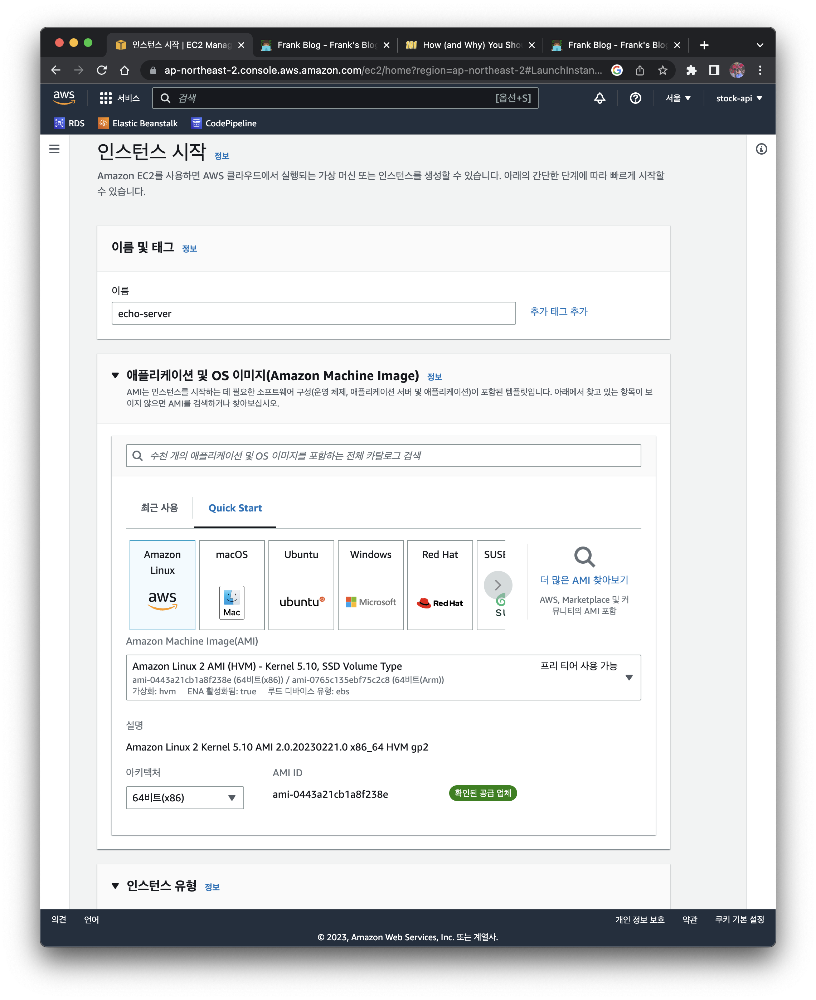
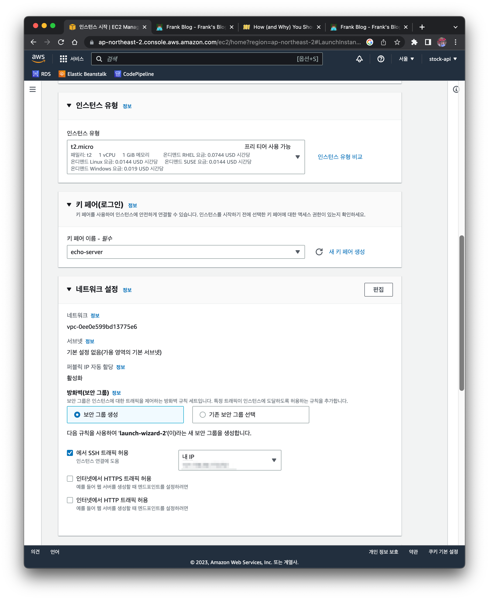
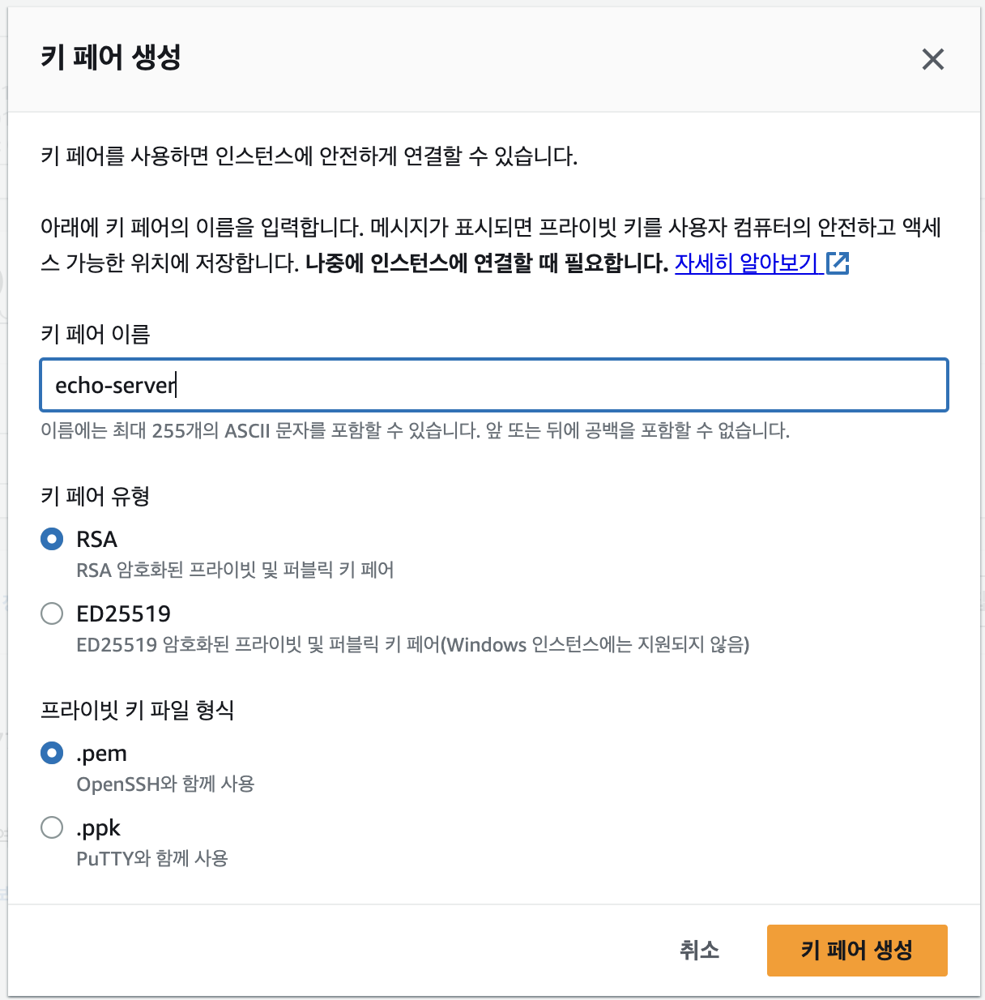
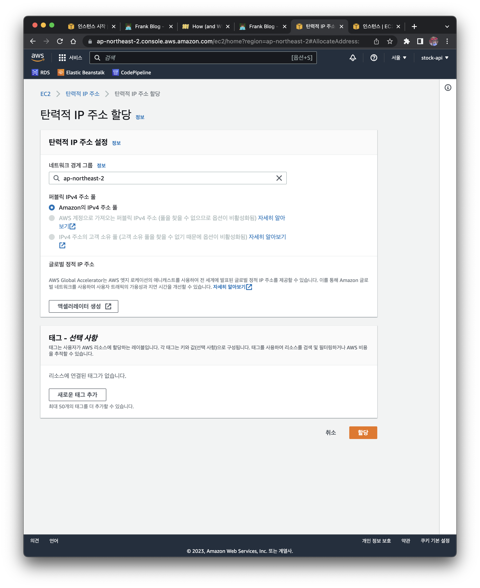
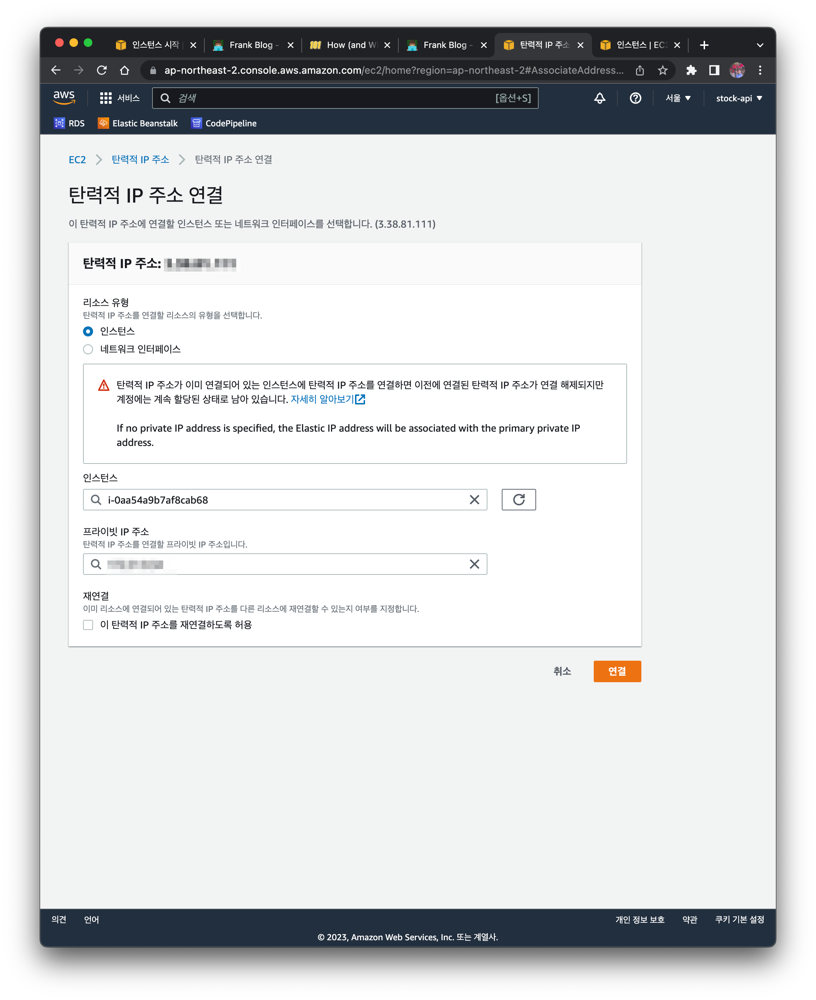
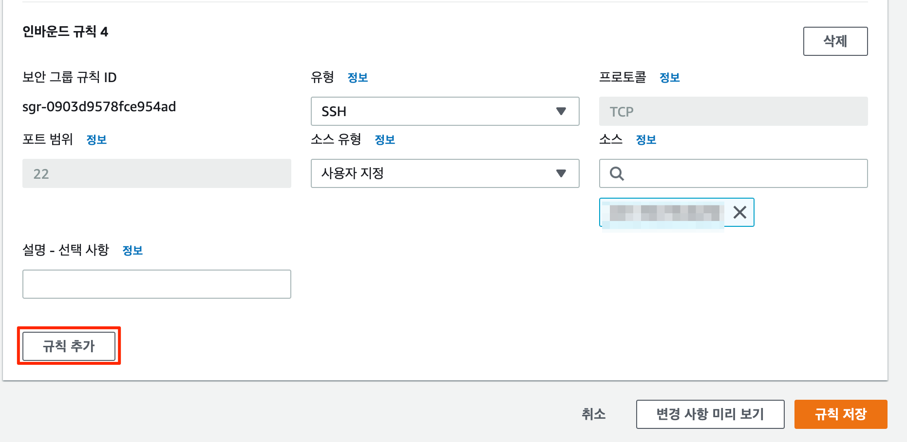
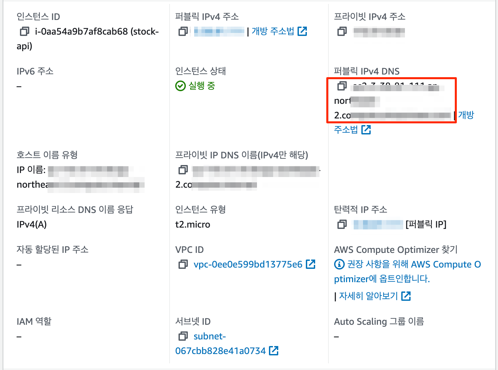

There are several services you can use to build an API server, as listed below.

- [Heroku](https://dashboard.heroku.com/)
- [GCP](https://cloud.google.com/)
- [PythonAnywhere](https://www.pythonanywhere.com/)
- [AWS](https://aws.amazon.com/) (Amazon Web Service)

Most of these services offer a free plan with limited resources and features. Personally, among the various services, I prefer AWS since it can still be used for free for a long period of 12 months. I don't set up EC2 very often, but whenever I build an API on EC2, the process of googling and configuring it each time takes time. As I built [stock-api](https://rapidapi.com/kenshin579-dCJkBINoF/api/stock-api7/) this time, I'm documenting it on the blog so I can refer back to it later.

# 1. Server Setup Prerequisites

## 1.1 Creating an AWS Account

An AWS account can be used for free for 12 months, but you need to create an account with an email address. Rather than creating a new email address each time, I recommend using Google's [alias feature](https://blog.advenoh.pe.kr/하나의-구글-계정으로-여러-이메일-주소-사용하기/).

Create an AWS account and log in to the console.

# 2. Building an EC2 Server on AWS

## 2.1 Creating an EC2 Instance

Find the EC2 service among the AWS services and create a virtual machine on AWS EC2. From the left menu, click Instances > Launch instances button.

By default, when creating an EC2 instance, the default values are already set. The values you need to fill in are as follows.

- Name: enter a name you want (ex. `echo-server`)

- Application and OS Images

    - Image: `Amazon Linux 2 AMI`
    - Architecture: `64-bit`

- Instance type: t2 micro

- Key pair (login): `echo-server`

    - The key pair is needed later to log in via ssh after the EC2 instance is created
    - First, click Create new key pair to generate it

- Network settings

    - Check the `Allow SSH traffic from` checkbox and select `My IP`
    - If `0.0.0.0/0` is selected, anyone can attempt to log in, so it's better to allow access only from a specific network or network address


- Configure storage: `30`
    - The free tier allows up to 30GB, so change it to `30`





### 2.1.1 Creating a Key Pair

When you create it, a `PEM` file is automatically downloaded. The key pair is the file used to access the instance after it is created.




## 2.2 Setting Up an Elastic IP

When you restart an EC2 instance, a new IP is assigned each time. When the IP changes, you have the hassle of checking the IP address every time you access it from your PC. To get a static IP that doesn't change each time, you need to set up an Elastic IP.

Click `EC2 menu` > `Network & Security` > `Elastic IPs` > `Allocate Elastic IP address` button. Allocate it with the settings below.



Select `EC2 menu` > `Network & Security` > `Elastic IPs` > `Actions pull-down menu` > `Associate Elastic IP address`. Enter the EC2 instance you created and the private IP address.



## 2.3 Connecting to the EC2 Server via ssh

To access via ssh using the `PEM` file downloaded above, enter the following command.

### 2.3.1 Specifying the PEM File in the ssh Option

```bash
$ ssh -i echo-server.pem xxx.xxxx.xxx.xxx # EC2's Elastic IP address
```

Since an IP address is not easy to remember and you have to enter a long command every time, configuring the ssh config file as follows lets you access it with a simple command.

### 2.3.2 Setting the PEM File and Server IP Address in Advance in the ssh Config

Copy the `PEM` file to the `.ssh` folder and change its permissions.

```bash
$ cp echo-server.pem ~/.ssh
$ chmod 0600 ~/.ssh/echo-server.pem
```

Create a `config` file and enter the following information.

```bash
$ vim ~/.ssh/config
# echo-server
Host echo-server #enter the service name you want
HostName xxx.xxxx.xxx.xxx #enter the Elastic IP address
User ec2-user
IdentityFile ~/.ssh/echo-server.pem

$ chmod 0700 ~/.ssh/config
```

Now, entering the command below lets you log in to the EC2 instance.

```bash
$ ssh echo-server
Last login: Tue Mar  7 20:08:03 2023 from 59.10.139.253

       __|  __|_  )
       _|  (     /   Amazon Linux 2 AMI
      ___|\___|___|

https://aws.amazon.com/amazon-linux-2/
19 package(s) needed for security, out of 22 available
Run "sudo yum update" to apply all updates.
[ec2-user@xxx.xxx.xxx.xxx ~]$
```

## 2.4 Additional EC2 Instance Configuration After Creating EC2

### 2.4.1 Changing the Timezone

The default timezone of the EC2 server is UTC. Change the timezone to match Korean time.

```bash
$ sudo rm /etc/localtime
$ sudo ln -s /usr/share/zoneinfo/Asia/Seoul /etc/localtime
```


### 2.4.2 Changing the Hostname

If you manage multiple servers, it's hard to tell which service a server belongs to from the IP address alone, so change the `Hostname`.

Here's how to change the hostname based on the Amazon Linux AMI 2 image.

```bash
$ sudo hostnamectl set-hostname echo-server
```

Additionally, registering the hostname in /etc/hosts makes it convenient to access by the registered hostname, so let's modify that together.

```bash
$ vim /etc/hosts
127.0.0.1 echo-server

$ reboot
```

You can access it using the registered hostname instead of the IP address.

```bash
$ curl echo-server
curl: (7) Failed to connect to echo-server port 80: Connection refused
```

The above error message appears because no server has been started yet, but you can confirm that running curl with the hostname works fine.

Reference

- https://bbeomgeun.tistory.com/157

## 2.5 (Optional) Additional EC2 Security Group Configuration

If you did not allow ssh traffic when creating the EC2 instance, you need to add the configuration to the security group.

Select `Network & Security` > `Security Groups` > `the security group applied to the EC2 instance` > `Actions pull-down menu` > `Edit inbound rules`.

Click the `Add rule` button at the bottom and select Source type > My IP so that it's accessible only from your computer.



# 3. Deploying the API to EC2


## 3.1 Downloading the Source Code from Github

Access the EC2 instance via ssh and download the source code from github.

```bash
$ ssh echo-server
$ git clone https://github.com/kenshin579/echo-server
```

## 3.2 Installing golang

The Echo server is written in golang, so install golang.

```bash
$ sudo yum install -y golang
```

## 3.3 Building the Source Code

A build command is specified in the Makefile, so you can easily build with make.

```bash
$ make build
go mod tidy
go build -v -o bin/go-echo-server cmd/server/main.go
go.uber.org/dig/internal/graph
go.uber.org/fx/internal/fxclock
go.uber.org/dig/internal/digerror
go.uber.org/dig/internal/digreflect
go.uber.org/dig/internal/dot
golang.org/x/tools/go/internal/cgo
go.uber.org/fx/internal/fxreflect
go.uber.org/fx/fxevent
go.uber.org/dig
github.com/labstack/echo/v4
golang.org/x/tools/go/loader
go.uber.org/fx/internal/lifecycle
go.uber.org/fx/internal/fxlog
github.com/swaggo/swag
go.uber.org/fx
github.com/kenshin579/echo-server/ping/route/http
github.com/kenshin579/echo-server/echo/route/http
github.com/labstack/echo/v4/middleware
github.com/kenshin579/echo-server/docs
github.com/swaggo/echo-swagger
github.com/kenshin579/echo-server/cmd/bootstrap
command-line-arguments
```

## 3.4 Running Echo and Testing It from the Outside

### 3.4.1 Running the API

```bash
$ go run cmd/server/main.go
[Fx] PROVIDE    *echo.Echo <= github.com/kenshin579/echo-server/cmd/bootstrap.newEcho()
[Fx] PROVIDE    fx.Lifecycle <= go.uber.org/fx.New.func1()
[Fx] PROVIDE    fx.Shutdowner <= go.uber.org/fx.(*App).shutdowner-fm()
[Fx] PROVIDE    fx.DotGraph <= go.uber.org/fx.(*App).dotGraph-fm()
[Fx] INVOKE             github.com/kenshin579/echo-server/echo/route/http.NewEchoHandler()
[Fx] INVOKE             github.com/kenshin579/echo-server/ping/route/http.NewPingHandler()
[Fx] INVOKE             github.com/kenshin579/echo-server/cmd/bootstrap.serve()
[Fx] HOOK OnStart               github.com/kenshin579/echo-server/cmd/bootstrap.serve.func1() executing (caller: github.com/kenshin579/echo-server/cmd/bootstrap.serve)
{"time":"2023-03-18T17:41:47.605105+09:00","level":"INFO","prefix":"-","file":"app.go","line":"46","message":"Starting echo api server."}
[Fx] HOOK OnStart               github.com/kenshin579/echo-server/cmd/bootstrap.serve.func1() called by github.com/kenshin579/echo-server/cmd/bootstrap.serve ran successfully in 179.625µs

   ____    __
  / __/___/ /  ___
 / _// __/ _ \/ _ \
/___/\__/_//_/\___/ v4.10.2
High performance, minimalist Go web framework
https://echo.labstack.com
____________________________________O/_______
                                    O\
[Fx] RUNNING
⇨ http server started on [::]:80

```

### 3.4.2 Accessing the API from the Outside

First, you need to know the EC2 public address to access it, so check it in the EC2 instance details.

`Instances` > `Instances` > select the instance ID from the instance list to see the IP address or DNS address.




When you call the API with the `curl` command, you can confirm that it works fine. Done!!

```bash
$ curl --location 'https://ec1-3-30-20-2342.ap-northeast-2.compute.amazonaws.com/ping'
Pong
```

# 4. References

- https://docs.aws.amazon.com/elasticbeanstalk/latest/dg/go-devenv.html
- https://ryanwoo.tistory.com/8
- https://technoracle.com/how-to-install-git-on-amazon-linux-2/
- https://chat.openai.com/chat
- http://www.yes24.com/Product/Goods/83849117
