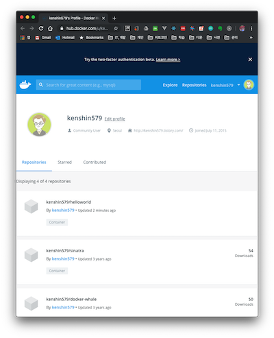

# 1. Introduction

Working with Docker can largely be divided into two categories.

- Working with Docker images
- Working with Docker containers

Since there are many Docker-related commands, I've put together a summary focusing on the ones that are used most often. For the full list of Docker commands, please refer to the [Docker documentation](https://docs.docker.com/engine/reference/commandline/docker/) site.


# 2. Docker Commands
## 2.1 Docker Help

You can check the Docker help from the command line with `help`.
```bash
$ docker help
Usage:  docker [OPTIONS] COMMAND
...(omitted)...

Management Commands:
  builder     Manage builds
  volume      Manage volumes

Commands:
  attach      Attach local standard input, output, and error streams to a running container
 ...(omitted)...

Run 'docker COMMAND --help' for more information on a command.

```

There are several management commands (subcommands) for working with Docker, and you can view their help in detail with the command below.

```bash
$ docker COMMAND
$ docker COMMAND --help
```

The help for the Docker volume command looks like this.

```bash
$ docker volume
Usage:  docker volume COMMAND

Manage volumes

Commands:
  create      Create a volume
  inspect     Display detailed information on one or more volumes
  ls          List volumes
  prune       Remove all unused local volumes
  rm          Remove one or more volumes

Run 'docker volume COMMAND --help' for more information on a command.
```


## 2.2 Working with Docker Images

Before running a Docker container, you need to search for the image you want or create a new image. Let's look at how to work with Docker images.

### 2.2.1 Searching for Docker Images

This searches for Docker images in the Docker Hub registry.

```bash
$ docker search redis
```

It shows a list of Redis-related images. The search results are sorted and displayed by GitHub star count. Looking at the list, most entries have a namespace prefixed before ####/redis, but the first item is just redis with no namespace. The namespace for official repositories is library, and this namespace can be omitted.

```bash
$ docker search redis
NAME   DESCRIPTION   STARS   OFFICIAL   AUTOMATED
redis Redis is an open source key-value store that…         7557   [OK]                
bitnami/redis   Bitnami Redis Docker Image                  132   [OK]
sameersbn/redis                                             78   [OK]
grokzen/redis-cluster   Redis cluster 3.0, 3.2, 4.0 & 5.0   62                                      

```

Since the search command can't search for multiple versions of redis, you can look them up through an API like the following.

> The jq command is a command for handling JSON format. If it's not installed on your Mac, you can install it with brew install jq

```bash
$ curl -s 'https://hub.docker.com/v2/repositories/library/redis/tags/?page_size=10'  | jq -r '.results[].name'                                                                              !10013
alpine3.10
alpine
5.0.6-alpine3.10
5.0.6-alpine
5.0-alpine3.10
5.0-alpine
5-alpine3.10
5-alpine
4.0.14-alpine3.10
4.0.14-alpine
```


### 2.2.2 Downloading Images

To pull a Docker image from a Docker registry, use the docker image pull command.

```bash
$ docker image pull [options] repository_name[:tag_name]
```

To download the redis image, you can do the following. If you omit the tag name, the latest tag is applied by default.

```bash
$ docker image pull redis
Using default tag: latest
latest: Pulling from library/redis
8d691f585fa8: Pull complete 
8ccd02d17190: Pull complete 
4719eb1815f2: Pull complete 
200531706a7d: Pull complete 
eed7c26916cf: Pull complete 
e1285fcc6a46: Pull complete 
Digest: sha256:fe80393a67c7058590ca6b6903f64e35b50fa411b0496f604a85c526fb5bd2d2
Status: Downloaded newer image for redis:latest
docker.io/library/redis:latest
```

### 2.2.3 Building Images

The docker image build command creates a Docker image, and the image is created according to what's defined in the Dockerfile.

- The -t option attaches an image name and a tag name together. It's used as an almost essential option

```bash
$ docker image build -t image_name[:tag_name] path_to_Dockerfile
```
Looking at the Dockerfile, it lists instructions for creating the image.

| Instruction | Description                                                  |
| ----------- | ------------------------------------------------------------ |
| FROM        | Downloads the specified image from the registry (ex. downloads the ubuntu:16.04 image) |
| COPY        | Copies a file from the host into the Docker image            |
| RUN         | Based on the image downloaded with FROM, runs the command defined in RUN to create a new image |
| CMD         | Defines the command that runs when the container starts      |

```bash
$ cat Dockerfile
FROM ubuntu:16.04

COPY helloworld.sh /usr/local/bin
RUN chmod +x /usr/local/bin/helloworld.sh

CMD ["helloworld.sh"]
```
> Note that once an image has been downloaded, the locally stored image is used. If you add the --pull =true option, the base image is forcibly re-downloaded every time.

```bash
$ docker image build -t helloworld:latest .
Sending build context to Docker daemon  3.072kB
Step 1/4 : FROM ubuntu:16.04
16.04: Pulling from library/ubuntu
e80174c8b43b: Pull complete 
d1072db285cc: Pull complete 
858453671e67: Pull complete 
3d07b1124f98: Pull complete 
Digest: sha256:bb5b48c7750a6a8775c74bcb601f7e5399135d0a06de004d000e05fd25c1a71c
Status: Downloaded newer image for ubuntu:16.04
 ---> 5f2bf26e3524
Step 2/4 : COPY helloworld.sh /usr/local/bin
 ---> b948d39a6b4f
Step 3/4 : RUN chmod +x /usr/local/bin/helloworld.sh
 ---> Running in 669a25a95285
Removing intermediate container 669a25a95285
 ---> a2ffdb53aaeb
Step 4/4 : CMD ["helloworld.sh"]
 ---> Running in 83864f5c36f6
Removing intermediate container 83864f5c36f6
 ---> b06d1d769f4f
Successfully built b06d1d769f4f
Successfully tagged helloworld:latest
```

### 2.2.4 Listing Images

With the docker image ls command, you can view the list of images you currently have. Images downloaded from Docker Hub and images you've built are shown in the list.

```bash
$ docker image ls
REPOSITORY   TAG   IMAGE   ID   CREATED   SIZE
example/mysql-data   latest   d4f1510aa2be        2 days ago          1.22MB
jenkins/jenkins      latest   55614b251a46        3 days ago          552MB
example/echo         latest   4a3aa6cc6b21        4 days ago          750MB

```

### 2.2.5 Tagging Images

With the docker image tag command, you can tag an image.

```bash
$ docker image tag base_image[:tag] new_image_name[:tag]
```
For example, to add the 0.1.0 tag to the helloworld image, you can run the following.

```bash
$ docker image tag helloworld:latest helloworld/test:0.1.0
$ docker image ls
REPOSITORY        TAG      IMAGE ID       CREATED      SIZE
helloworld/test   0.1.0    b06d1d769f4f   6 days ago   123MB
helloworld        latest   b06d1d769f4f   6 days ago   123MB

```

A new image is created every time you build in the following situations.

- When you build an image
- When you edit the Dockerfile
- When the contents of a file that's a target of COPY change

Let's modify the helloworld file that's the target of COPY and build it.

```bash
$ cat helloworld
#!/bin/sh
echo "Hello, World!"

$ vim helloworld
#!/bin/sh
echo "Hello, World!"
echo "Hi!!"
```

When you build the image and look it up, a new <none> has been added. The new image was created as helloworld:latest, and the previous older images are shown as <none>.

```bash
$ docker image build -t helloworld:latest . 
$ docker image ls
REPOSITORY   TAG      IMAGE ID       CREATED              SIZE
helloworld   latest   4427b4290f55   3 seconds ago        123MB
<none>       <none>   411cc8adaba2   About a minute ago   123MB


```

### 2.2.6 Sharing Images

With the docker image push command, you can register an image to a registry such as Docker Hub.

```bash
$ docker image push [options] image_name:[:tag]
```

Let's push the helloworld image to Docker Hub. Since the helloworld:latest image is already registered on Docker Hub, you can first change the image's namespace and then push it.

```bash
$ docker image tag helloworld:latest kenshin579/helloworld:latest
$ docker image ls
REPOSITORY               TAG                 IMAGE ID            CREATED             SIZE
kenshin579/helloworld    latest               4427b4290f55        5 days ago          123MB
helloworld               latest              4427b4290f55        5 days ago          123MB
```

If you're not logged in to Docker, log in first and then push the image, and it will be shared to Docker Hub.

```bash
$ docker login
$ docker image push kenshin579/helloworld:latest
The push refers to repository [docker.io/kenshin579/helloworld]
cde5c9054b7e: Pushed 
bc72fb2e7b74: Pushed 
903669ee7207: Pushed 
a5a5f8c62487: Pushed 
788b17b748c2: Pushed 
latest: digest: sha256:7906b00f23cc5eb44dcedcc2d0fe39e2a7253c3f2373b88f661cb7aa2bda4470 size: 1564

```



## 2.3 Working with Docker Containers

### 2.3.1 Running a Container

The docker container run command creates and runs a container.

```bash
$ docker container run [options] image_name[:tag] [command] [command_args...]
```

To run the redis image in the background, give it the -d option and run it as follows.

```bash
$ docker container run --name redis_test -d -p 7000:6379 redis
```

Since the -p option forwards host port 7000 -> container port 6379, you need to connect to redis using port number 7000 as follows.

```bash
$ redis-cli -p 7000
127.0.0.1:7000> set hello world
OK
127.0.0.1:7000> get hello
"world"
127.0.0.1:7000> 
```

**Container Options**

| Option | Description                                                  |
| ------ | ------------------------------------------------------------ |
| -d     | Runs in the background                                       |
| -p     | external_port:container_port (ex. 9000:8080)<br />If no port is specified, a random port is automatically assigned |
| -t     | Enables a Unix terminal connection<br />Often used together with the -i option, combined into the -it option |
| -i     | Keeps the connection to the container's standard input (stdout) open. You need to add this option to enter the container's shell. |
| -rm    | Destroys the container when it exits.                        |
| --name | Lets you give the container a name of your choice. You can look it up or delete it by name. |

#### 2.3.1.1 Running with Command Arguments

If you run the docker container run command with command arguments added, the CMD instruction defined in the Dockerfile is ignored and the container runs with the values passed as command arguments.

```bash
$ docker container run -it redis
1:C 07 Dec 2019 01:16:39.642 # oO0OoO0OoO0Oo Redis is starting oO0OoO0OoO0Oo
1:C 07 Dec 2019 01:16:39.642 # Redis version=5.0.6, bits=64, commit=00000000, modified=0, pid=1, just started
1:C 07 Dec 2019 01:16:39.642 # Warning: no config file specified, using the default config. In order to specify a config file use redis-server /path/to/redis.conf

```

While the command above runs the redis daemon, the command with the 'uname -a' argument added outputs the result of running the argument command.

```bash
$ docker container run -it redis uname -a 
Linux 36e0253d1a29 4.9.184-linuxkit #1 SMP Tue Jul 2 22:58:16 UTC 2019 x86_64 GNU/Linux
```


### 2.3.2 Listing Running Containers

With the docker container ls command, you can check the currently running containers. The container with ID 20e9f060fc15 is a container named redis_test, run with the --name option. If run without the --name option, a random name is assigned.

```bash
$ docker container ls
CONTAINER ID  IMAGE  COMMAND  CREATED  STATUS  PORTS  NAMES
20e9f060fc15  redis  "docker-entrypoint.s…"  25 hours ago  Up 25 hours  0.0.0.0:7000->6379/tcp   redis_test

```

#### 2.3.2.1 Filtering the Container List

With the --filter option, you can add filter conditions to filter the container list when querying.

```bash
$ docker container ls --filter "filter_name=value"
```

If you add name as a filter condition, it queries containers whose name contains redis.

```bash
$ docker container ls --filter "name=redis"
```

#### 2.3.2.2 Listing Stopped Containers

Stopped containers aren't shown in the list, but you can check stopped containers by adding the -a option.

```bash
$ docker container ls -a
```

### 2.3.3 Stopping a Running Container

With the docker container stop command, you can stop a running container by container ID or container name.

```bash
$ docker container stop containerID_OR_container_name
```

### 2.3.4 Restarting a Stopped Container

To restart a stopped container, use docker container restart.

```bash
$ docker container restart containerID_OR_container_name
```

### 2.3.5 Removing a Running Container

When you stop a container, it remains on disk while keeping the state from the moment it was stopped. To destroy it completely, add the rm command to delete it.

```bash
$ docker container rm containerID_OR_container_name
```

To automatically destroy a container after running and exiting it, add the --rm option when running the container, as in the following command.

```bash
$ docker container run --rm -d -p 7000:6379 redis
```

### 2.3.6 Outputting a Container's stdout to the Host stdout

With the docker container logs command, you can view a Docker container's standard output on the host screen.

```bash
$ docker container logs [options] containerID_OR_container_name
```

To view the output from the jenkins server after running the jenkins Docker container, enter the following command.

| Command | Option | Description                                                  |
| ------- | ------ | ------------------------------------------------------------ |
| logs    | -f     | Continuously outputs the logs to the screen. (ex. same option as tail -f) |
| ls      | -q     | The -q option in docker container ls retrieves the container's ID |

```bash
$ docker container run --rm -d jenkins
$ docker container logs -f $(docker container ls --filter "ancestor=jenkins" -q)
```

### 2.3.7 Running a Command in a Running Container

With the docker container exec command, you can execute a command in a currently running container.


```bash
$ docker container exec [options] containerID_OR_container_name command_to_run
```

If you want to open a shell to check internal files, use the following command.

```bash
$ docker container exec -it 5bb352057045 bash
$ jenkins@5bb352057045:/$ ls
bin  boot  dev  docker-java-home  etc  home  lib  lib64  media  mnt  opt  proc  root  run  sbin  srv  sys  tmp  usr  var
```

### 2.3.8 Copying Files

This is a command for copying files between a container <-> host.

```bash
$ docker container cp [OPTIONS] CONTAINER:SRC_PATH DEST_PATH # container -> host
$ docker container cp [OPTIONS] SRC_PATH CONTAINER:DEST_PATH # host -> container
```

To copy a host file to a container and view the copied text, you can do the following.

```bash
$ echo "hello world" > /tmp/test.txt
$ docker container cp /tmp/test.txt echo:/tmp
$ docker container exec cat echo:/tmp/test.txt
hello world
```


# 3. Appendix (Miscellaneous)

## 3.1 Docker Shorthand Commands

Since the docker container run command is long, shorthand commands are also provided. However, the general sentiment is to recommend using the full commands over the shorthand ones.

| Docker Full Command  | Shorthand Command |
| -------------------- | ----------------- |
| docker container run | docker run        |
| docker image pull    | docker pull       |
| docker image build   | docker build      |

## 3.2 Docker Operations Commands

### 3.2.1 Destroying Containers and Images

These are commands used to destroy containers or images. docker container prune is a command that deletes all containers that aren't currently running.

```bash
$ docker container ls -a
$ docker container prune
WARNING! This will remove all stopped containers.
Are you sure you want to continue? [y/N] y
Deleted Containers:
5bd169e3043f51d33347a165e483a03ea142442cb9ef83b5faf13440d0ca329b
350b12c364310514b7f2024ebbf8f19bdb9e5a2331337d143ef3329f90bfb089
460912b768d82b58d7158e32d55da684d449d7b69fa144e0bff556c038d2396f
dd91039088a7109cbcf8e365624671701c1751ea16324c1f45af3528c9bc5baa
...(omitted)...

Total reclaimed space: 28.49MB
```

Unused images also gradually accumulate and take up disk space, so it's good to delete them regularly.

docker image prune deletes all images that don't have a tag.

```bash
$ docker image ls
$ docker image prune 
WARNING! This will remove all dangling images.
Are you sure you want to continue? [y/N] y
Deleted Images:
deleted: sha256:411cc8adaba2c3fc9d2070aca8b8a4d58041f1cfb63aebfe617991115821ff9f
deleted: sha256:3f72f3ef13a37d85b13901e8cc89d3499beb7e452cab1d38e53041949502396f
...(omitted)...

Total reclaimed space: 84B
```

docker system prune is a command that deletes all resources at once, including images, containers, volumes, and networks.

```bash
$ docker system prune
```

### 3.2.2 Checking Container System Resource Usage

You can check the system resource usage of currently running containers. Like Linux's top command, it updates and displays the status in real time.

```bash
$ docker container stats [options] [containerID ...]
```

```bash
$ docker container stats
CONTAINER ID        NAME                CPU %               MEM USAGE / LIMIT     MEM %               NET I/O             BLOCK I/O           PIDS
5b3e2e966799        boring_sutherland   0.19%               1.68MiB / 1.952GiB    0.08%               648B / 0B           8.43MB / 0B         4
5bb352057045        vigorous_meninsky   0.17%               349.5MiB / 1.952GiB   17.48%              4.18MB / 91.5kB     124MB / 24.3MB      34

```

# 4. References

- Docker command reference
    - [https://docs.docker.com/engine/reference/commandline/docker/](https://docs.docker.com/engine/reference/commandline/docker/)
- Shorthand commands
    - https://www.slipp.net/wiki/pages/viewpage.action?pageId=41583363
- Book: Docker, Kubernetes를 활용한 컨테이너 개발 실전 입문
    - 
