# 1. 들어가며

서비스가 느려졌다는 얘기를 듣고 서버에 접속해 `top`을 치는 순간, 이미 늦었다. 지금 CPU가 몇 퍼센트인지는 보이지만 30분 전에는 어땠는지 알 방법이 없다. 원인을 찾으려면 과거의 수치가 필요한데 그게 아무 데도 남아 있지 않다. 모니터링 시스템이 하는 일이 결국 이거다. 수치를 계속 쌓아두고 나중에 되감아볼 수 있게 만드는 것.

요즘은 이 영역을 Observability(관측 가능성)라고 부르고, 보통 세 종류의 데이터로 나눠서 이야기한다.

| 요소 | 설명 | 대표 도구 |
|------|------|-----------|
| **Metrics** | 시간에 따른 수치 데이터 (CPU, 메모리, 요청 수 등) | Prometheus, Datadog |
| **Logs** | 이벤트 기록 (에러 메시지, 요청 로그 등) | Loki, ELK Stack |
| **Traces** | 요청의 흐름 추적 (서비스 간 호출 경로) | Tempo, Jaeger |

이 글은 시리즈의 첫 편이고, 셋 중 Metrics만 다룬다. Prometheus로 수치를 모으고 Grafana로 그리는 데까지가 범위다.

시리즈 구성은 다음과 같다.

| 편 | 제목 | 다루는 영역 |
|----|------|-------------|
| **편 1 (이 글)** | Prometheus와 Grafana 기초 | Metrics 기초 |
| 편 2 | Go 애플리케이션 커스텀 메트릭 | Metrics 심화 |
| 편 3 | Grafana Tempo 분산 트레이싱 | Traces |
| 편 4 | Grafana Pyroscope Continuous Profiling | Profiles |

이 글에서는 다음 내용을 다룬다.

- Prometheus의 아키텍처와 메트릭 타입 4가지
- PromQL 기본 문법과 실전 쿼리
- Grafana의 핵심 개념 (Data Source, Dashboard, Panel, Variables)
- docker-compose로 Prometheus + Grafana + node-exporter 환경 구축
- 시스템 모니터링 대시보드 만들기

> 이 글에서 사용한 전체 코드는 [GitHub](https://github.com/kenshin579/tutorials-go/tree/master/monitoring/grafana-metrics)에서 확인할 수 있다.

<!-- slides -->

# 2. Prometheus 핵심 개념

## 2.1 아키텍처 — Pull 기반 메트릭 수집

Prometheus는 메트릭을 직접 가져온다(Pull). 모니터링 대상이 `/metrics` HTTP 엔드포인트만 열어두면, Prometheus가 주기적으로 그 주소를 호출해(scrape) 값을 긁어온다. 대상 쪽은 어디로 보낼지 몰라도 된다.

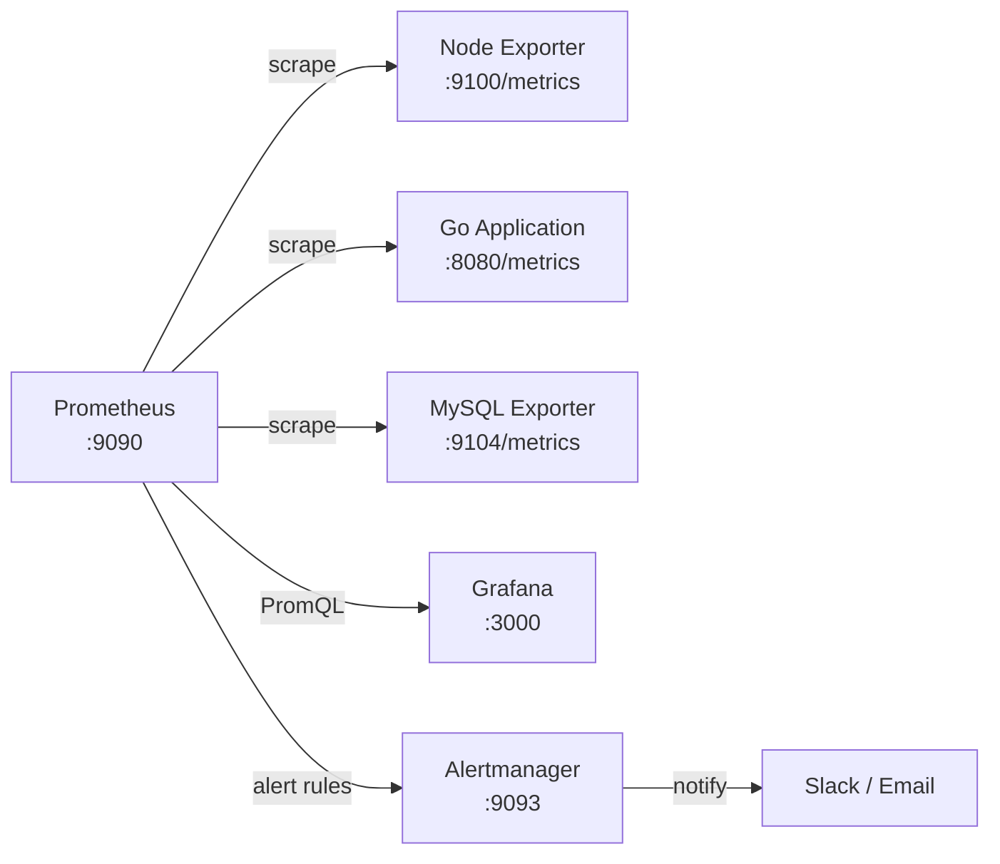

핵심 구성 요소는 다음과 같다.

| 구성 요소 | 역할 |
|-----------|------|
| **Prometheus Server** | 메트릭 수집(scrape), 저장(TSDB), PromQL 쿼리 엔진 |
| **Exporter** | 대상 시스템의 메트릭을 `/metrics` 엔드포인트로 노출 |
| **Alertmanager** | 알림 규칙에 따라 Slack, Email 등으로 알림 전송 |
| **Grafana** | PromQL로 Prometheus를 조회해 대시보드 시각화 |

Push 방식과 나란히 놓고 보면 차이가 분명해진다.

| 비교 항목 | Pull 방식 (Prometheus) | Push 방식 (Datadog, InfluxDB) |
|-----------|------------------------|-------------------------------|
| 데이터 흐름 | 서버가 타겟에서 가져감 | 타겟이 서버에 보냄 |
| 서비스 디스커버리 | 필요 (어디를 scrape할지 알아야 함) | 불필요 (타겟이 직접 전송) |
| 네트워크 요구사항 | 서버 → 타겟 접근 필요 | 타겟 → 서버 접근 필요 |
| 장점 | 타겟 상태 확인 가능 (scrape 실패 = 장애) | 방화벽 뒤 환경에서 유리 |
| 단점 | 방화벽 뒤 타겟 수집 어려움 | 타겟 장애 시 데이터 유실 감지 어려움 |

## 2.2 메트릭 타입 4가지

Prometheus는 4가지 메트릭 타입을 지원한다.

| 타입 | 특징 | 사용 예시 | 주요 함수 |
|------|------|-----------|-----------|
| **Counter** | 값이 감소 없이 증가만 한다 (재시작하면 0부터 다시) | HTTP 요청 수, 에러 수 | `rate()`, `increase()` |
| **Gauge** | 오르내린다 | CPU 사용률, 메모리 사용량, 활성 연결 수 | 직접 조회, `avg_over_time()` |
| **Histogram** | 값의 분포를 버킷(bucket)에 나눠 담는다 | 응답 시간, 요청 크기 | `histogram_quantile()` |
| **Summary** | 분위수(quantile)를 미리 계산해 저장한다 | 응답 시간 (클라이언트 측 계산) | 직접 조회 |

> 아래 Counter와 Histogram 화면은 시리즈 샘플 앱(2편에서 만든다)에 메트릭을 심고 캡처한 것이다. 4장에서 구축하는 환경만으로는 node-exporter와 Prometheus 자체 메트릭까지 볼 수 있다.

### 2.2.1 Counter — 단조 증가 값

Counter는 값이 쌓이기만 하는 메트릭이다. 서버가 재시작되면 0으로 돌아간다.

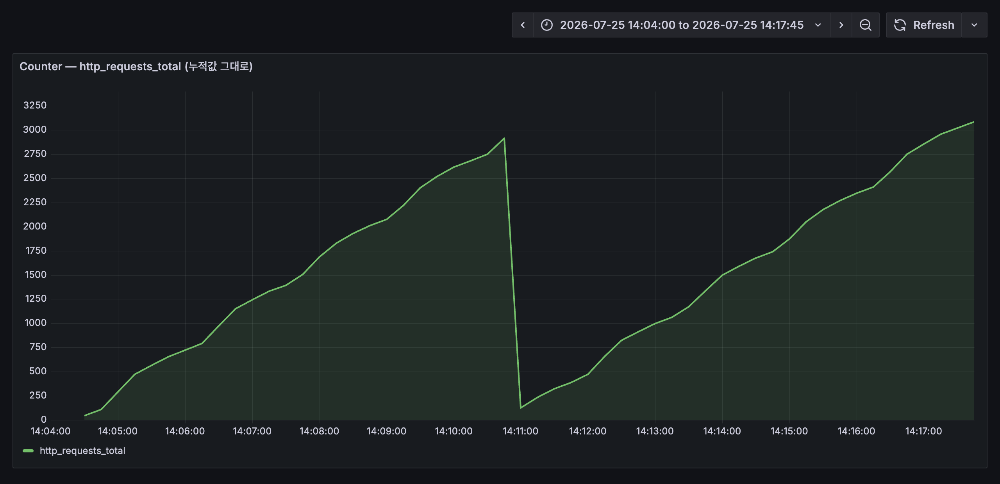

`http_requests_total`을 Time series 패널에 그대로 올린 화면이다. 14시 11분에 선이 바닥으로 떨어진 건 애플리케이션을 재시작한 시점이다. 그런데 이 그래프에서 읽어낼 수 있는 건 "계속 올라간다" 정도뿐이다. 정작 궁금한 "지금 요청이 얼마나 들어오고 있는가"는 값이 아니라 기울기에 들어 있기 때문이다.

같은 데이터에 `rate()`를 씌우면 그 기울기가 그대로 드러난다.

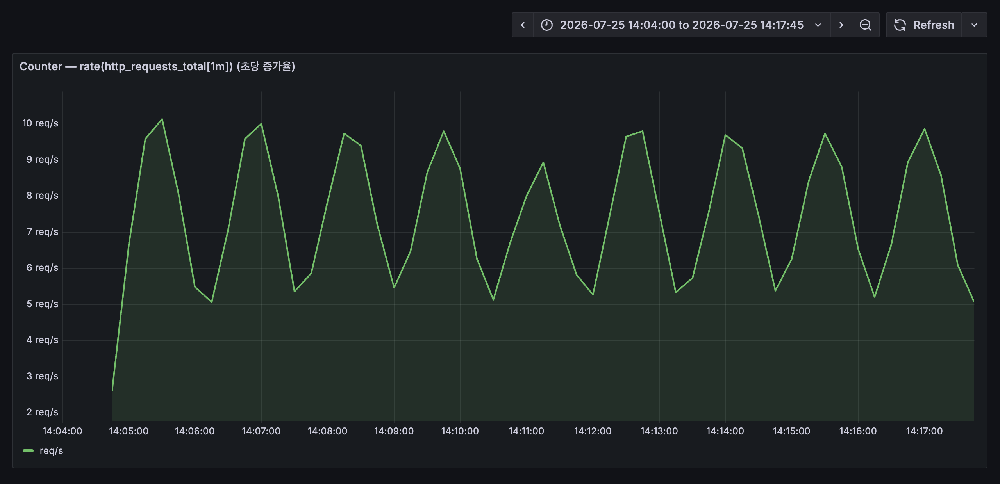

초당 5~10건 사이를 오르내리는 실제 요청량이 보인다. 재시작 지점에서도 선이 튀지 않는데, `rate()`가 카운터 리셋을 감지해 보정하기 때문이다. Counter를 볼 때 `rate()`부터 떠올려야 하는 이유가 이것이다.

```promql
# HTTP 요청의 초당 증가율 (5분 평균)
rate(http_requests_total[5m])

# 최근 1시간 동안 총 증가량
increase(http_requests_total[1h])
```

### 2.2.2 Gauge — 증감 가능한 현재 값

Gauge는 지금 이 순간의 값이라 오르내린다. CPU 사용률, 메모리 사용량, 활성 연결 수가 여기 속한다.

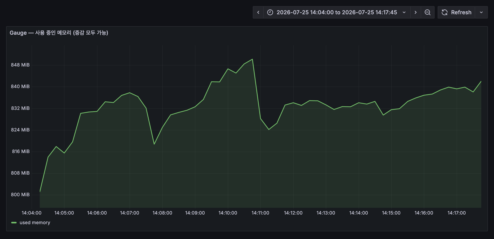

Counter와 달리 값 자체가 곧 답이라 `rate()`를 씌울 일이 없다. 여기서도 14시 11분 재시작 지점에 메모리가 잠깐 줄었다 다시 차오르는 게 보인다.

```promql
# 현재 활성 요청 수
http_requests_in_flight

# 5분 평균 CPU 사용률
avg_over_time(node_cpu_seconds_total{mode="idle"}[5m])
```

### 2.2.3 Histogram — 값의 분포 (버킷 기반)

Histogram은 값을 미리 정해둔 버킷에 나눠 담아 분포를 잡는다. 저장하는 건 버킷별 개수뿐이고, 백분위수는 쿼리하는 시점에 `histogram_quantile()`로 계산한다.

여기서 헷갈리기 쉬운 게 버킷이 누적이라는 점이다. `le="0.5"` 버킷은 0.5초 이하 요청을 전부 담고 있지, 0.25초와 0.5초 사이 구간만 세는 게 아니다. `histogram_quantile()`은 이 누적 개수에서 위치를 역산해 백분위수를 뽑아낸다.

분포 자체를 눈으로 보고 싶다면 Heatmap 패널을 쓴다. 쿼리 Format을 `Heatmap`으로 두면 누적 버킷을 구간별 개수로 되돌린 뒤, 가로축을 시간 세로축을 버킷으로 놓고 색 농도로 밀도를 표시해준다.

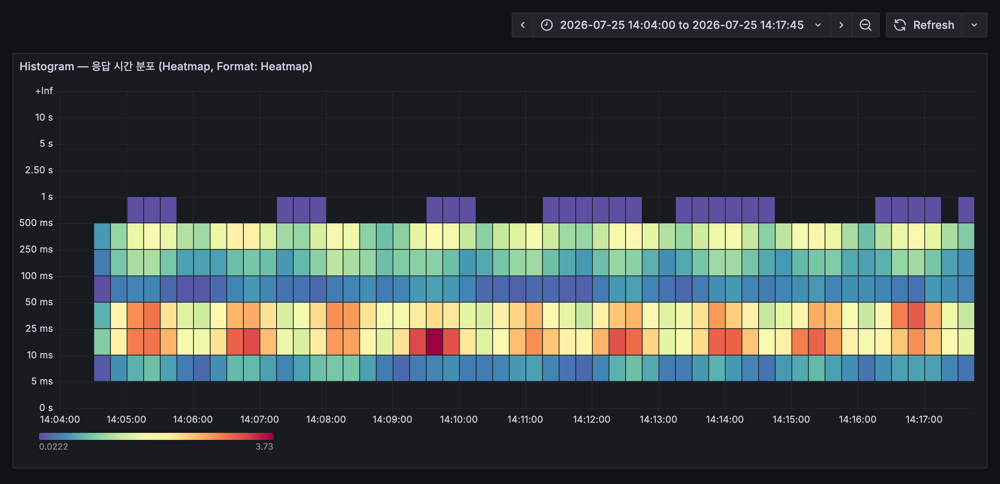

색이 진한 구간이 요청이 몰린 응답 시간대다. 10~25ms 부근과 250~500ms 부근, 두 군데가 따로 진하게 나타나는데 조회 API와 주문 생성 API의 응답 시간이 원래 다르기 때문이다. 평균 하나만 봤다면 이 둘은 100ms 언저리 숫자 하나로 뭉개졌을 것이다.

```promql
# P99 응답 시간 (상위 1%가 경험하는 최대 응답 시간)
histogram_quantile(0.99, rate(http_request_duration_seconds_bucket[5m]))

# P50 / P90 / P99 비교
histogram_quantile(0.50, rate(http_request_duration_seconds_bucket[5m]))
histogram_quantile(0.90, rate(http_request_duration_seconds_bucket[5m]))
histogram_quantile(0.99, rate(http_request_duration_seconds_bucket[5m]))
```

### 2.2.4 Summary — 값의 분포 (분위수 기반)

Summary도 분포를 다루지만, 분위수를 애플리케이션 쪽에서 미리 계산해 저장한다. 이미 계산이 끝난 값이라 여러 인스턴스의 Summary를 나중에 합칠 수 없다.

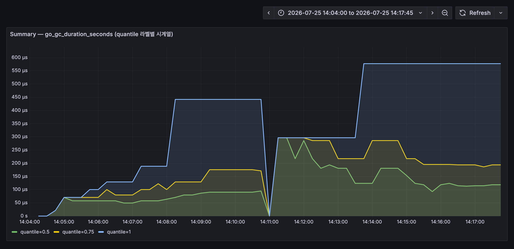

Go 런타임이 기본으로 내보내는 GC 일시정지 시간이 Summary다. `quantile` 라벨이 붙은 시계열로 들어오기 때문에 대시보드에서는 이렇게 라벨별 선을 겹쳐 그린다. 중앙값은 100µs 근처인데 최댓값은 500µs를 넘나드는 게 한눈에 보인다. 14시 11분에 세 선이 모두 0으로 떨어진 건 재시작이다.

Histogram이 버킷 개수를 넘겨 서버에서 계산하게 하는 쪽이라면, Summary는 계산 결과만 넘긴다. 서버 한 대의 p99는 이 값을 그대로 읽으면 되지만, 서버 세 대의 p99를 구하려고 이 값들을 평균 내면 그건 p99가 아니다.

| 비교 항목 | Histogram | Summary |
|-----------|-----------|---------|
| 분위수 계산 위치 | 서버 (쿼리 시점) | 클라이언트 (수집 시점) |
| 여러 인스턴스 합산 | 가능 | 불가능 |
| 버킷/분위수 변경 | 설정 변경 후 재시작 | 코드 변경 필요 |
| 권장 사용 | 대부분의 경우 | 정확한 분위수가 필요한 특수한 경우 |

> 서버가 여러 대라면 Histogram을 쓰는 게 낫다. Summary는 합산이 안 돼서 인스턴스가 늘어나는 순간 쓸모가 줄어든다.

## 2.3 Label과 Time Series

Prometheus가 저장하는 최소 단위는 **시계열(Time Series)** 하나다. 시계열은 별게 아니고, 이름표 하나에 `(시각, 값)` 쌍이 계속 붙어 나가는 목록이다. `http_requests_total`이라는 시계열은 실제로 이렇게 쌓인다.

| 시각 | 값 |
|------|-----|
| 14:30:00 | 1,204 |
| 14:30:15 | 1,251 |
| 14:30:30 | 1,298 |
| 14:30:45 | 1,344 |

15초마다 한 줄씩 늘어난다. 앞에서 정한 scrape 주기가 그대로 이 간격이 된다. 그래프에 찍히는 점 하나하나가 이 표의 한 줄이라고 보면 된다.

문제는 이름표가 `http_requests_total` 하나뿐이면 여기서 읽어낼 수 있는 게 "요청이 늘었다"까지라는 점이다. 어느 API가 늘었는지, 그중 실패가 몇 건인지는 이 숫자 안에 없다. 그래서 이름 뒤에 꼬리표를 붙인다. 그게 Label이다.

```
http_requests_total{method="GET",  path="/api/orders", status="200"}
http_requests_total{method="POST", path="/api/orders", status="201"}
http_requests_total{method="POST", path="/api/orders", status="500"}
```

이름은 셋 다 같지만 Prometheus는 이걸 **서로 다른 시계열 세 개**로 저장한다. 각각이 위 표 같은 값 목록을 따로 갖는다는 뜻이다. 덕분에 주문 생성이 실패한 건수(`status="500"`)만 따로 그래프로 그릴 수도 있고, 반대로 셋을 도로 더해 전체 요청 수를 볼 수도 있다. 쪼개는 것도 합치는 것도 Label이 있어서 가능하다. 합치는 문법은 바로 다음 절에서 다룬다.

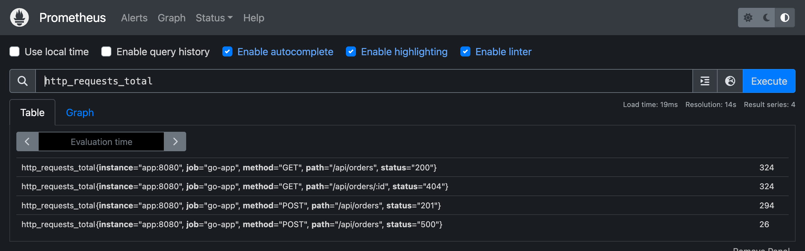

Prometheus UI에서 `http_requests_total`을 조회하면 이렇게 라벨 조합마다 한 줄씩 나온다. 메트릭 이름은 하나인데 실제 시계열은 여러 개인 것이다.

여기까지가 Label의 좋은 면이다. 그늘도 있다. 시계열 개수가 **곱셈으로** 늘어난다.

| Label | 값의 가짓수 |
|-------|------------|
| `method` | 5 (GET, POST, PUT, DELETE, PATCH) |
| `path` | 20 |
| `status` | 6 |

5 × 20 × 6 = 600. 메트릭 하나가 시계열 600개가 된다. 이 정도는 괜찮다. 그런데 "사용자별로도 보고 싶다"며 `user_id`를 하나 더 붙이면 어떻게 될까. 사용자가 10만 명이면 600 × 100,000 = **6천만 개**다. 시계열 하나하나가 메모리를 차지하니 Prometheus는 그대로 주저앉는다. 이걸 카디널리티(Cardinality) 폭발이라고 부른다.

> 판단 기준은 하나다. **이 Label의 값이 몇 가지인지 미리 셀 수 있는가?** `method`, `status`, `path`는 셀 수 있다. `user_id`, `session_id`, `request_id`, 이메일, IP 주소는 셀 수 없다. 셀 수 없는 값은 Label이 아니라 로그로 보내야 한다.

### 2.3.1 메트릭 이름은 어디서 오는가

Label 얘기를 했으니 나머지 절반인 이름도 짚고 가자. `http_requests_total`이나 `node_cpu_seconds_total` 같은 이름은 누가 정한 걸까. Prometheus에 미리 들어 있는 걸까?

아니다. 전부 누군가 코드에 적어 넣은 이름이다. `http_requests_total`은 이 시리즈의 샘플 앱이 이렇게 선언한 것이다.

```go
var HttpRequestsTotal = prometheus.NewCounterVec(
    prometheus.CounterOpts{
        Name: "http_requests_total",
        Help: "Total number of HTTP requests",
    },
    []string{"method", "path", "status"},
)
```

세 번째 인자가 이 메트릭이 쓸 Label 이름이다. 앞에서 본 `{method=..., path=..., status=...}`가 여기서 나온다. 이름 쪽은 Prometheus 입장에서 그냥 문자열이라, `my_stuff_counter`라고 지었어도 똑같이 수집되고 똑같이 쿼리된다.

그런데도 여기저기서 비슷한 모양의 이름이 보이는 건 공식 명명 규칙이 있기 때문이다.

| 규칙 | 공식 문서 표현 | 예 |
|------|----------------|-----|
| 도메인을 나타내는 한 단어를 앞에 붙인다 | "SHOULD have a (single-word) application prefix" | `node_`, `process_`, `prometheus_` |
| 단위를 복수형으로 뒤에 붙인다 | "SHOULD have a suffix describing the unit, in plural form" | `_seconds`, `_bytes` |
| 누적 카운트는 `_total`로 끝낸다 | "an accumulating count has `total` as a suffix" | `http_requests_total` |

공식 문서가 예로 드는 이름이 하필 `http_requests_total`이라, 이 이름은 사실상 관용어가 됐다. 직접 계측할 때도 이 규칙만 지키면 남이 봐도 타입과 단위를 짐작할 수 있다.

실제로 쓰게 되는 이름의 출처는 셋으로 갈린다.

| 출처 | 예 | 누가 정하나 |
|------|-----|------------|
| Exporter | `node_cpu_seconds_total`, `node_memory_MemTotal_bytes` | exporter 제작자 |
| 클라이언트 라이브러리 기본 수집기 | `go_goroutines`, `go_gc_duration_seconds`, `process_cpu_seconds_total` | 라이브러리가 자동 등록 |
| 직접 계측 | `http_requests_total`, `orders_created_total` | 애플리케이션 개발자 |

2.2.4에서 Summary 예시로 쓴 `go_gc_duration_seconds`가 두 번째 부류다. 아무도 선언하지 않았는데 존재하는 이유가 이것이다. Go 클라이언트 라이브러리를 붙이는 순간 런타임 메트릭이 딸려 온다.

### 2.3.2 어떤 메트릭이 있는지 찾기

이름을 외울 필요는 없다. 실행 중인 시스템에 직접 물어보면 된다.

```bash
# 타겟이 노출하는 메트릭 목록 (타입까지)
> curl -s http://localhost:9100/metrics | grep "^# TYPE"

# Prometheus가 알고 있는 전체 메트릭 이름
> curl -s 'http://localhost:9090/api/v1/label/__name__/values'

# 이름 + 타입 + 설명
> curl -s 'http://localhost:9090/api/v1/metadata'
```

Prometheus 웹 UI에서는 쿼리 입력창이 같은 목록으로 자동완성을 해준다. 이름 일부만 쳐도 후보가 뜨니 실제로는 이쪽을 더 자주 쓰게 된다. exporter별 전체 목록과 설명은 각 저장소 문서에 정리돼 있다.

## 2.4 PromQL 기본 문법

PromQL(Prometheus Query Language)은 저장된 메트릭을 조회하고 계산하는 쿼리 언어다. Grafana 패널 하나가 결국 PromQL 쿼리 한 줄이라, 대시보드를 만들려면 이건 피해갈 수 없다.

처음 보면 암호처럼 보이지만 구조는 단순하다. 어떤 쿼리든 다음 네 조각의 조합이다.

| 조각 | 정하는 것 | 예 |
|------|-----------|-----|
| 메트릭 이름 | 무엇을 볼지 | `http_requests_total` |
| 라벨 필터 | 그중 어떤 시계열만 볼지 | `{status="500"}` |
| 시간 범위 | 언제부터 언제까지의 값을 볼지 | `[5m]` |
| 함수·집계 | 그 값들을 어떻게 계산할지 | `rate(...)`, `sum by(path)` |

이 네 개를 합치면 이렇게 된다.

```promql
sum by(path) (rate(http_requests_total{status="500"}[5m]))
```

읽는 순서는 안쪽부터 바깥이다. `http_requests_total` 중에서 → `status="500"`인 것만 골라 → 최근 5분 구간을 → 초당 증가율로 바꾸고 → `path`별로 합친다. 이제 조각을 하나씩 보자.

### 2.4.1 라벨 필터 — 중괄호 안의 조건

`{}` 안에는 어떤 시계열을 고를지 조건을 쓴다. 연산자는 넷이다.

| 연산자 | 뜻 | 예시 |
|--------|-----|------|
| `=` | 값이 같은 것 | `{method="GET"}` |
| `!=` | 값이 다른 것 | `{device!="lo"}` |
| `=~` | 정규식에 맞는 것 | `{status=~"5.."}` |
| `!~` | 정규식에 안 맞는 것 | `{path!~"/health.*"}` |

`{status=~"5.."}`에서 `.`은 아무 문자 하나를 뜻하므로 500, 502, 503이 전부 걸린다. 즉 "5xx 전체"라는 뜻이다. 조건을 쉼표로 이으면 그 조건들을 모두 만족하는 시계열만 남는다.

```promql
http_requests_total{method="GET", status=~"5.."}   # GET 요청 중 5xx만
```

### 2.4.2 시간 범위 — `[5m]`이 붙으면 달라지는 것

PromQL에서 제일 헷갈리는 지점이다. 범위 표기가 없으면 시계열마다 **지금 값 하나**만 가져온다.

```promql
http_requests_total          # 시계열마다 값 1개 (예: 1,344)
```

대괄호를 붙이면 **그 기간에 쌓인 값 전부**를 가져온다.

```promql
http_requests_total[5m]      # 시계열마다 값 20개 (15초 간격 × 5분)
```

앞의 것을 instant vector, 뒤의 것을 range vector라고 부른다. 이 구분이 왜 중요하냐면, 함수마다 요구하는 입력이 다르기 때문이다.

`rate()`는 "얼마나 늘었나 ÷ 걸린 시간"을 계산하므로 최소 두 개의 값이 필요하다. 그래서 공식 문서도 `rate(v range-vector)`라고 못 박아 두었다. `rate(http_requests_total)`처럼 범위 없이 쓰면 에러가 나고, `rate(http_requests_total[5m])`이라야 동작한다. 반대로 Gauge를 그냥 볼 때는 지금 값이면 충분하니 범위가 필요 없다.

구간을 얼마로 잡을지는 scrape 주기에 달려 있다. 최소한 값이 두 개는 들어와야 하므로 scrape 주기보다는 넉넉히 잡아야 하고, 15초 주기라면 보통 1분 이상, 관례적으로 5분을 많이 쓴다. 짧게 잡으면 그래프가 예민하게 튀고, 길게 잡으면 변화가 뭉개진다.

### 2.4.3 집계 — 쪼갠 시계열을 다시 합치기

2.3에서 Label 때문에 시계열이 여러 개로 쪼개진다고 했다. 그걸 도로 합치는 게 집계 함수다.

| 함수 | 뜻 |
|------|-----|
| `sum()` | 전부 더한다 |
| `avg()` | 평균을 낸다 |
| `max()` / `min()` | 최댓값 / 최솟값 |
| `count()` | 시계열이 몇 개인지 센다 |

그냥 `sum(...)`을 쓰면 라벨을 전부 버리고 값 하나로 뭉갠다. 특정 라벨은 남기고 싶을 때 `by`를 붙인다.

```promql
sum(rate(http_requests_total[5m]))             # 전체 요청량 (선 1개)
sum by(path) (rate(http_requests_total[5m]))   # path별 요청량 (path 수만큼 선)
sum by(path, status) (...)                     # path × status 조합별
```

`by`가 "이 라벨만 남긴다"라면, `without`은 반대로 "이 라벨만 버리고 나머지는 남긴다"이다.

### 2.4.4 자주 쓰는 함수

| 함수 | 설명 | 쓰는 메트릭 타입 | 사용 예시 |
|------|------|------------------|-----------|
| `rate()` | 초당 평균 변화율 계산 | Counter | `rate(http_requests_total[5m])` |
| `increase()` | 지정 기간 동안 총 증가량 | Counter | `increase(http_requests_total[1h])` |
| `histogram_quantile()` | 백분위수 계산 | Histogram | `histogram_quantile(0.99, rate(...[5m]))` |
| `avg_over_time()` | 지정 기간 동안 평균값 | Gauge | `avg_over_time(metric[5m])` |

`rate()`에는 한 가지 편의가 더 있다. 2.2.1에서 본 카운터 리셋을 알아서 보정해준다. 공식 문서 표현으로는 "단조 증가가 깨지는 지점(타겟 재시작 등)은 자동으로 조정된다"이다. 재시작 때마다 그래프가 마이너스로 튀는 걸 직접 처리하지 않아도 된다는 뜻이다.

여기서 짚고 넘어갈 게 하나 있다. 위 표의 "쓰는 메트릭 타입"은 **PromQL이 검사해주는 값이 아니다.** Prometheus 서버는 어떤 메트릭이 Counter인지 Gauge인지 알지 못한다. 공식 문서도 서버가 "타입 정보를 아직 사용하지 않으며, 네이티브 히스토그램을 제외한 모든 타입을 타입 없는 부동소수점 시계열로 평탄화한다"고 밝히고 있다. 메트릭 타입은 계측 라이브러리가 정해서 `/metrics` 응답에 `# TYPE http_requests_total counter` 같은 주석으로 알려줄 뿐이다.

PromQL이 실제로 강제하는 건 벡터 타입이다. 함수 시그니처에 그대로 드러난다.

| 함수 | 시그니처 |
|------|----------|
| `rate` | `rate(v range-vector)` |
| `increase` | `increase(v range-vector)` |
| `avg_over_time` | `avg_over_time(range-vector)` |
| `histogram_quantile` | `histogram_quantile(φ scalar, b instant-vector)` |

그래서 다음 두 줄의 운명이 갈린다.

```promql
rate(node_memory_MemAvailable_bytes[5m])   # 에러 없음. Gauge인데도 계산된다
rate(http_requests_total)                  # 에러. range vector가 아니다
```

위쪽은 Gauge에 `rate()`를 씌운 잘못된 쿼리지만 Prometheus는 막지 않는다. 문법상 range vector를 넘겼으니 조건은 맞기 때문이다. 대신 메모리가 줄어든 구간을 카운터 리셋으로 오해해 보정해버리므로 결과가 엉뚱해진다. **에러로 걸러주는 건 벡터 타입까지고, 메트릭 타입이 맞는지는 쓰는 사람이 책임진다.**

어떤 메트릭이 무슨 타입인지 확인하려면 `/metrics` 응답의 `# TYPE` 줄을 보거나 Prometheus의 `/api/v1/metadata`를 조회하면 된다. 이름만 봐도 짐작할 수 있는데, `_total`로 끝나면 Counter, `_bucket`·`_sum`·`_count` 세트가 있으면 Histogram, `quantile` 라벨이 붙어 있으면 Summary다.

말로 설명하는 것보다 Prometheus가 실제로 긁어가는 원본을 보는 게 빠르다. 대상 애플리케이션의 엔드포인트를 그대로 호출해보면 된다.

```bash
> curl -s http://localhost:8080/metrics
```

네 가지 타입이 어떻게 실려 오는지 부분만 잘라보면 이렇다.

```
# HELP http_requests_total Total number of HTTP requests
# TYPE http_requests_total counter
http_requests_total{method="GET",path="/api/orders",status="200"} 272
http_requests_total{method="GET",path="/health",status="200"} 1
http_requests_total{method="POST",path="/api/orders",status="201"} 64
http_requests_total{method="POST",path="/api/orders",status="500"} 8

# HELP http_requests_in_flight Number of HTTP requests currently being processed
# TYPE http_requests_in_flight gauge
http_requests_in_flight 0

# HELP http_request_duration_seconds HTTP request duration in seconds
# TYPE http_request_duration_seconds histogram
http_request_duration_seconds_bucket{method="POST",path="/api/orders",le="0.005"} 0
http_request_duration_seconds_bucket{method="POST",path="/api/orders",le="0.01"} 0
http_request_duration_seconds_bucket{method="POST",path="/api/orders",le="0.025"} 0
http_request_duration_seconds_bucket{method="POST",path="/api/orders",le="0.05"} 0
http_request_duration_seconds_bucket{method="POST",path="/api/orders",le="0.1"} 7
http_request_duration_seconds_bucket{method="POST",path="/api/orders",le="0.25"} 32
http_request_duration_seconds_bucket{method="POST",path="/api/orders",le="0.5"} 72
http_request_duration_seconds_bucket{method="POST",path="/api/orders",le="1"} 72
http_request_duration_seconds_bucket{method="POST",path="/api/orders",le="+Inf"} 72
http_request_duration_seconds_sum{method="POST",path="/api/orders"} 19.577141632999997
http_request_duration_seconds_count{method="POST",path="/api/orders"} 72

# HELP go_gc_duration_seconds A summary of the pause duration of garbage collection cycles.
# TYPE go_gc_duration_seconds summary
go_gc_duration_seconds{quantile="0"} 3.925e-05
go_gc_duration_seconds{quantile="0.5"} 4.8208e-05
go_gc_duration_seconds{quantile="1"} 4.8208e-05
go_gc_duration_seconds_sum 8.7458e-05
go_gc_duration_seconds_count 2
```

여기서 눈여겨볼 게 몇 가지 있다.

- **`# TYPE` 줄이 타입의 출처다.** `#`으로 시작하지만 주석이 아니다. 공식 문서는 "`#`으로 시작하는 줄은 주석이며, `#` 다음 첫 토큰이 `HELP`나 `TYPE`이 아닌 경우 무시된다"고 규정한다. 즉 이 둘만 주석 문법을 빌려 쓴 메타데이터다. 빼먹으면 타입이 `untyped`가 될 뿐 수집 자체는 정상 동작하지만, 그러면 `/api/v1/metadata`에도 UI에도 타입이 뜨지 않아 남이 이 메트릭을 처음 봤을 때 판단할 근거가 사라진다. 클라이언트 라이브러리를 쓰면 알아서 붙으니 직접 쓸 일은 거의 없다.
- **Counter는 라벨 조합마다 한 줄씩이다.** 2.3에서 말한 "이름은 하나인데 시계열은 여러 개"가 눈으로 확인된다. 여기서는 네 줄이니 시계열도 네 개다.
- **Histogram은 이름 하나가 여러 줄로 펼쳐진다.** `le` 라벨이 붙은 `_bucket` 여러 줄에 `_sum`과 `_count`가 따라온다. 버킷 값이 `0 → 7 → 32 → 72`로 커지다가 그대로 유지되는데, 이게 2.2.3에서 말한 누적이다. 72건 전부가 0.5초 안에 끝났다는 뜻이기도 하다.
- **Summary에는 버킷이 없다.** `quantile` 라벨이 붙은 계산 완료된 값과 `_sum`·`_count`뿐이다. 합칠 원재료가 없으니 여러 인스턴스를 나중에 합산할 수 없다는 말이 여기서 분명해진다.
- **Gauge는 가장 단순하다.** 지금 값 하나로 끝이다.

### 2.4.5 실전 쿼리 읽어보기

이제 4장에서 쓸 쿼리를 해석할 수 있다. 가장 복잡해 보이는 CPU 사용률 쿼리를 안쪽부터 한 겹씩 벗겨보자.

```promql
100 - (avg by(instance) (rate(node_cpu_seconds_total{mode="idle"}[5m])) * 100)
```

| 순서 | 부분 | 하는 일 |
|------|------|---------|
| 1 | `node_cpu_seconds_total{mode="idle"}` | CPU가 놀고 있던 누적 시간 중 idle 모드만 고른다 |
| 2 | `[5m]` + `rate(...)` | 5분 구간의 기울기, 즉 초당 idle 시간을 구한다. 코어가 8개면 코어마다 시계열이 따로 나온다 |
| 3 | `avg by(instance)` | 코어별 값을 서버 단위로 평균 낸다. 결과는 0~1 사이이고 1이면 완전히 놀고 있다는 뜻 |
| 4 | `* 100` | 백분율로 바꾼다 |
| 5 | `100 - (...)` | "논 비율"을 뒤집어 "일한 비율"로 만든다 |

나머지 쿼리들도 같은 방식으로 읽으면 되는데, 각각 걸려 넘어지기 쉬운 지점이 하나씩 있다.

**에러율 (%)**

```promql
sum(rate(http_requests_total{status=~"5.."}[5m]))
  / sum(rate(http_requests_total[5m])) * 100
```

| 순서 | 부분 | 하는 일 |
|------|------|---------|
| 1 | `http_requests_total{status=~"5.."}` | 5xx 응답만 고른다 |
| 2 | `rate(...[5m])` | 초당 실패 건수로 바꾼다 |
| 3 | `sum(...)` | 라벨을 모두 걷어내 숫자 하나로 만든다 |
| 4 | 아래쪽도 동일하게 | 필터 없이 전체 요청의 초당 건수를 구한다 |
| 5 | 나눗셈 후 `* 100` | 실패 비율을 백분율로 |

여기서 3번의 `sum()`이 없으면 쿼리가 조용히 망가진다. PromQL의 나눗셈은 양쪽 시계열의 **라벨이 전부 같은 것끼리** 짝을 짓기 때문이다. `sum()` 없이 그냥 나누면 왼쪽의 `{status="500"}`은 오른쪽의 `{status="500"}`과 짝지어지고, 결과는 자기 자신을 나눈 값이라 언제나 1이 나온다. 실제로 돌려보면 이렇다.

```
# sum 없이 — 항상 1
{method="POST", path="/api/orders", status="500"}  1

# sum으로 라벨을 걷어낸 뒤 — 실제 에러율
{}  5.5
```

`status`를 라벨에서 없애는 게 핵심이라 `sum()` 대신 `by`로 남길 라벨을 지정해도 된다. 경로별 에러율이 필요하면 이렇게 쓴다.

```promql
sum by(path) (rate(http_requests_total{status=~"5.."}[5m]))
  / sum by(path) (rate(http_requests_total[5m])) * 100
```

**메모리 사용률 (%)**

```promql
(1 - node_memory_MemAvailable_bytes / node_memory_MemTotal_bytes) * 100
```

여기엔 `rate()`가 없다. 둘 다 Gauge라 지금 값이 곧 답이기 때문이다. 나눗셈으로 "사용 가능한 비율"을 구한 뒤 1에서 빼서 "쓰고 있는 비율"로 뒤집고, 100을 곱해 백분율로 만든다. 이 나눗셈은 양쪽 라벨이 `instance`, `job`으로 똑같아서 아무 조치 없이 짝이 맞는다. 에러율 쿼리와 갈린 지점이 여기다.

`MemFree`가 아니라 `MemAvailable`을 쓴 이유도 있다. 리눅스는 남는 메모리를 파일 캐시로 쓰는데, 이 캐시는 필요하면 즉시 회수된다. `MemFree`로 계산하면 캐시가 찬 서버는 항상 메모리 부족처럼 보인다. `MemAvailable`은 회수 가능한 몫까지 더해 "실제로 쓸 수 있는 양"을 알려준다.

**디스크 사용률 (%)**

```promql
(1 - node_filesystem_avail_bytes{mountpoint="/"} / node_filesystem_size_bytes{mountpoint="/"}) * 100
```

계산 방식은 메모리와 같다. 다만 파일시스템 메트릭은 마운트 지점마다 시계열이 따로 생기므로 `mountpoint="/"`로 하나를 지정해야 한다. 이 필터를 빼면 `/`, `/boot`, 도커 오버레이까지 전부 나와 그래프가 지저분해진다.

`avail`과 `free`도 구분해서 쓴다. 리눅스 파일시스템은 일부 블록을 root 전용으로 예약해두는데, `node_filesystem_free_bytes`는 그 예약분을 포함하고 `node_filesystem_avail_bytes`는 빼고 센다. 일반 프로세스가 실제로 쓸 수 있는 양은 후자다.

> 4장의 docker-compose로 띄운 node-exporter는 컨테이너 안에 갇혀 있어서 자기 파일시스템만 본다. 그래서 위 쿼리를 그대로 실행하면 `mountpoint="/"`가 없어 결과가 비어 있다. 리눅스 호스트라면 호스트 루트를 마운트해 해결한다.
>
> ```yaml
>   node-exporter:
>     image: prom/node-exporter:v1.8.1
>     volumes:
>       - /:/host:ro,rslave
>     command:
>       - '--path.rootfs=/host'
> ```
>
> 다만 macOS나 Windows의 Docker Desktop에서는 이렇게 해도 리눅스 VM의 파일시스템이 보일 뿐 내 노트북 디스크는 보이지 않는다(`rslave` 전파도 지원되지 않아 마운트 자체가 거부되기도 한다). 결과가 비어 있다면 먼저 어떤 마운트 지점이 실제로 있는지부터 확인하고 그중 하나를 쓰면 된다.
>
> ```bash
> > curl -s http://localhost:9100/metrics | grep "^node_filesystem_size_bytes"
> ```

# 3. Grafana 핵심 개념

Grafana는 여러 데이터 소스를 붙여 시각화하는 오픈소스 대시보드 도구다. Prometheus 말고도 Loki, Tempo, MySQL, Elasticsearch를 붙일 수 있다.

## 3.1 Data Source 연동

Data Source는 Grafana가 데이터를 읽어올 출처다. 대시보드를 만들기 전에 이것부터 등록해야 한다.

Prometheus를 Data Source로 추가하는 방법은 두 가지가 있다.

**방법 1: UI에서 직접 추가**

1. Grafana 좌측 메뉴 → **Connections** → **Data sources** → **Add data source**
2. Prometheus 선택
3. URL에 `http://prometheus:9090` 입력
4. **Save & Test** 클릭

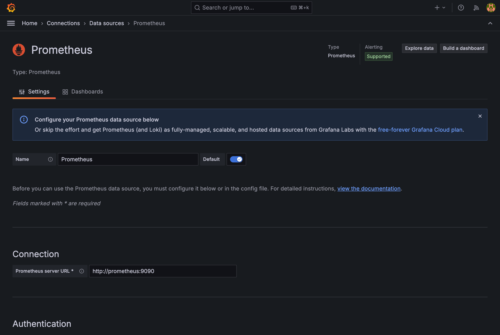

URL에 `localhost:9090`이 아니라 `prometheus:9090`을 넣는 게 포인트다. Grafana도 컨테이너 안에서 돌기 때문에 컨테이너 이름으로 찾아가야 한다. **Save & Test**를 누르면 "Successfully queried the Prometheus API" 메시지가 뜬다.

**방법 2: Provisioning 파일로 자동 설정**

docker-compose 환경에서는 YAML 파일로 Data Source를 자동 등록할 수 있다. 4장에서 이 방법을 사용한다.

```yaml
# provisioning/datasources/datasource.yml
apiVersion: 1

datasources:
  - name: Prometheus
    type: prometheus
    access: proxy
    url: http://prometheus:9090
    isDefault: true
    editable: true
```

## 3.2 Dashboard 구조 이해

Grafana Dashboard는 계층적 구조로 구성된다.

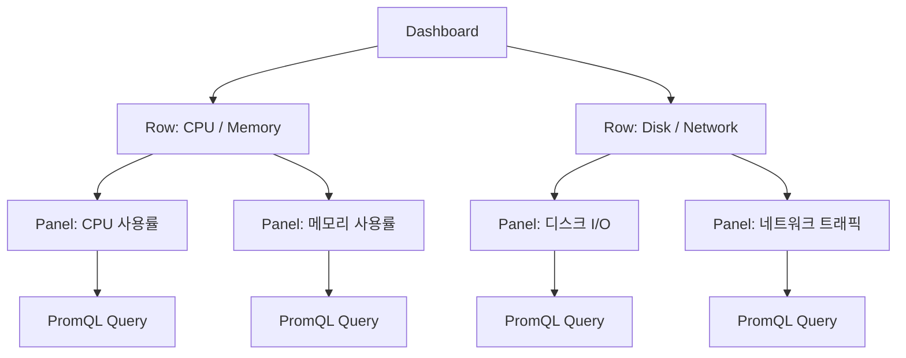

| 구성 요소 | 설명 |
|-----------|------|
| **Dashboard** | 여러 Panel을 모아놓은 화면. JSON으로 내보내기/가져오기 가능 |
| **Row** | Panel을 논리적으로 그룹화하는 접이식 영역 |
| **Panel** | 하나의 시각화 단위. PromQL 쿼리로 데이터를 가져와 차트로 표시 |
| **Query** | Panel 내부에서 Data Source에 보내는 PromQL 쿼리 |

## 3.3 주요 Panel 타입

Panel 타입은 여러 가지인데, 데이터 모양에 따라 어울리는 게 갈린다.

| Panel 타입 | 용도 | 적합한 데이터 |
|------------|------|---------------|
| **Time series** | 시간에 따른 값 변화 | CPU 사용률, 요청 수, 응답 시간 |
| **Stat** | 단일 숫자 강조 표시 | 현재 가동 시간, 총 요청 수 |
| **Gauge** | 범위 내 현재 값 (게이지 형태) | 디스크 사용률, 메모리 사용률 |
| **Table** | 표 형태로 데이터 나열 | 인스턴스별 상태, Top N 목록 |
| **Bar chart** | 카테고리별 비교 | 서비스별 에러 수, 엔드포인트별 요청 수 |
| **Heatmap** | 2차원 분포 시각화 | 응답 시간 분포, Histogram 버킷 |

## 3.4 Variables(변수)와 템플릿

Variables를 걸면 대시보드 상단에 드롭다운이 생긴다. 서버가 열 대든 스무 대든 대시보드는 하나만 만들어두고 골라 보면 된다.

Variable 설정 예시는 다음과 같다.

| 항목 | 값 |
|------|---|
| Name | `instance` |
| Type | Query |
| Data source | Prometheus |
| Query | `label_values(node_cpu_seconds_total, instance)` |
| Multi-value | 활성화 |

설정 후 Panel의 PromQL에서 `$instance` 변수를 사용할 수 있다.

```promql
# instance 변수를 활용한 CPU 사용률
100 - (avg by(instance) (rate(node_cpu_seconds_total{mode="idle", instance=~"$instance"}[5m])) * 100)
```

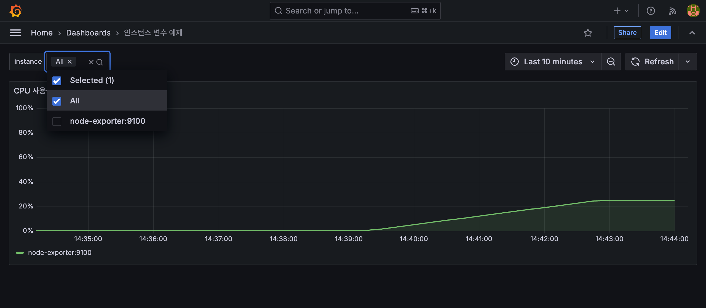

드롭다운에서 인스턴스를 고르면 그 인스턴스의 메트릭만 남는다. 위 화면은 node-exporter 한 대짜리 환경이라 목록이 짧지만, 서버를 늘리면 `label_values()`가 찾아낸 만큼 항목이 따라 늘어난다.

# 4. 실전: 로컬 환경 구축 (docker-compose)

이 장에서는 docker-compose로 Prometheus, Grafana, node-exporter를 실행하고, 시스템 모니터링 대시보드를 만들어본다.

## 4.1 docker-compose로 Prometheus + Grafana 실행

3개의 서비스로 구성된 docker-compose 파일을 작성한다.

```yaml
# docker-compose.yml
services:
  prometheus:
    image: prom/prometheus:v2.51.0
    container_name: prometheus
    ports:
      - "9090:9090"
    volumes:
      - ./prometheus/prometheus.yml:/etc/prometheus/prometheus.yml
    command:
      - '--config.file=/etc/prometheus/prometheus.yml'
      - '--storage.tsdb.retention.time=7d'

  grafana:
    image: grafana/grafana:11.4.0
    container_name: grafana
    ports:
      - "3000:3000"
    environment:
      - GF_SECURITY_ADMIN_PASSWORD=admin
    volumes:
      - ./provisioning:/etc/grafana/provisioning

  node-exporter:
    image: prom/node-exporter:v1.8.1
    container_name: node-exporter
    ports:
      - "9100:9100"
```

Prometheus 설정 파일을 작성한다. `scrape_configs`에서 수집 대상을 정의한다.

```yaml
# prometheus/prometheus.yml
global:
  scrape_interval: 15s      # 메트릭 수집 주기
  evaluation_interval: 15s   # 알림 규칙 평가 주기

scrape_configs:
  # Prometheus 자체 메트릭
  - job_name: 'prometheus'
    static_configs:
      - targets: ['localhost:9090']

  # node-exporter 시스템 메트릭
  - job_name: 'node-exporter'
    static_configs:
      - targets: ['node-exporter:9100']
```

Grafana Data Source를 자동 등록하기 위한 provisioning 파일도 작성한다.

```yaml
# provisioning/datasources/datasource.yml
apiVersion: 1

datasources:
  - name: Prometheus
    type: prometheus
    access: proxy
    url: http://prometheus:9090
    isDefault: true
    editable: true
```

실행한다.

```bash
> docker compose up -d
```

정상 실행 확인 후 각 서비스에 접속해본다.

| 서비스 | URL | 설명 |
|--------|-----|------|
| Prometheus | http://localhost:9090 | Prometheus 웹 UI |
| Grafana | http://localhost:3000 | Grafana 대시보드 (admin/admin) |
| node-exporter | http://localhost:9100/metrics | 시스템 메트릭 확인 |

Prometheus 웹 UI의 **Status → Targets** 메뉴에서 `node-exporter`와 `prometheus` 타겟이 `UP` 상태인지 확인한다.

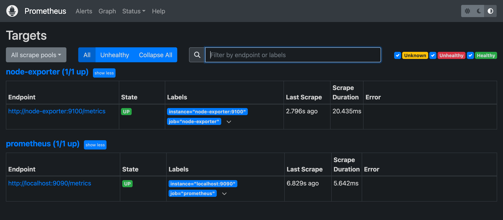

Endpoint, 마지막 scrape 시각, scrape에 걸린 시간까지 여기서 확인된다. 여기가 `DOWN`이면 대시보드를 아무리 만들어도 빈 그래프만 나오므로, 문제가 생기면 이 화면부터 본다.

## 4.2 node-exporter로 시스템 메트릭 수집

node-exporter는 Linux/macOS 시스템의 하드웨어 및 OS 수준 메트릭을 수집하는 Prometheus 공식 Exporter다. `http://localhost:9100/metrics`에 접속하면 수집되는 메트릭 목록을 확인할 수 있다.

주요 메트릭은 다음과 같다.

| 메트릭 | 타입 | 설명 |
|--------|------|------|
| `node_cpu_seconds_total` | Counter | CPU 모드별 사용 시간 (idle, user, system 등) |
| `node_memory_MemTotal_bytes` | Gauge | 전체 메모리 크기 |
| `node_memory_MemAvailable_bytes` | Gauge | 사용 가능한 메모리 크기 |
| `node_filesystem_size_bytes` | Gauge | 파일시스템 전체 크기 |
| `node_filesystem_avail_bytes` | Gauge | 파일시스템 사용 가능 크기 |
| `node_disk_read_bytes_total` | Counter | 디스크 읽기 바이트 수 |
| `node_disk_written_bytes_total` | Counter | 디스크 쓰기 바이트 수 |
| `node_network_receive_bytes_total` | Counter | 네트워크 수신 바이트 수 |
| `node_network_transmit_bytes_total` | Counter | 네트워크 송신 바이트 수 |

Prometheus 웹 UI에서 다음 쿼리를 실행해보자.

```promql
# CPU 사용률 확인
100 - (avg by(instance) (rate(node_cpu_seconds_total{mode="idle"}[5m])) * 100)
```

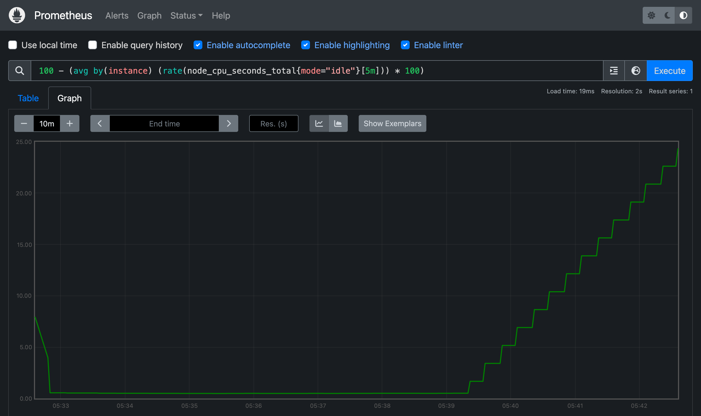

Grafana를 거치지 않고도 Prometheus 자체 UI에서 쿼리를 확인할 수 있다. 대시보드를 만들기 전에 여기서 쿼리가 원하는 값을 내는지 먼저 보는 편이 빠르다.

## 4.3 첫 번째 대시보드 만들기

Grafana에서 시스템 모니터링 대시보드를 만들어보자. 4개의 패널을 구성한다.

**대시보드 생성 순서:**

1. Grafana 좌측 메뉴 → **Dashboards** → **New** → **New Dashboard**
2. **Add visualization** 클릭
3. Data source로 **Prometheus** 선택
4. PromQL 쿼리 입력 후 **Apply**

### 4.3.1 Panel 1: CPU 사용률

CPU가 idle 모드가 아닌 시간의 비율을 계산한다.

| 항목 | 값 |
|------|---|
| Panel 타입 | Time series |
| Title | CPU 사용률 (%) |
| PromQL | 아래 참조 |
| Unit | Percent (0-100) |

```promql
100 - (avg by(instance) (rate(node_cpu_seconds_total{mode="idle"}[5m])) * 100)
```

### 4.3.2 Panel 2: 메모리 사용률

전체 메모리 대비 사용 가능 메모리의 비율로 사용률을 계산한다.

| 항목 | 값 |
|------|---|
| Panel 타입 | Time series |
| Title | 메모리 사용률 (%) |
| PromQL | 아래 참조 |
| Unit | Percent (0-100) |

```promql
(1 - node_memory_MemAvailable_bytes / node_memory_MemTotal_bytes) * 100
```

### 4.3.3 Panel 3: 디스크 I/O

디스크의 초당 읽기/쓰기 바이트 수를 표시한다.

| 항목 | 값 |
|------|---|
| Panel 타입 | Time series |
| Title | 디스크 I/O |
| PromQL (Read) | 아래 참조 |
| PromQL (Write) | 아래 참조 |
| Unit | bytes/sec (Bytes/sec IEC) |

```promql
# 디스크 읽기 속도
rate(node_disk_read_bytes_total[5m])

# 디스크 쓰기 속도
rate(node_disk_written_bytes_total[5m])
```

### 4.3.4 Panel 4: 네트워크 트래픽

네트워크 인터페이스의 초당 수신/송신 바이트 수를 표시한다.

| 항목 | 값 |
|------|---|
| Panel 타입 | Time series |
| Title | 네트워크 트래픽 |
| PromQL (Receive) | 아래 참조 |
| PromQL (Transmit) | 아래 참조 |
| Unit | bytes/sec (Bytes/sec IEC) |

```promql
# 네트워크 수신 속도
rate(node_network_receive_bytes_total{device!="lo"}[5m])

# 네트워크 송신 속도
rate(node_network_transmit_bytes_total{device!="lo"}[5m])
```

> `device!="lo"` 조건으로 loopback 인터페이스를 제외한다.

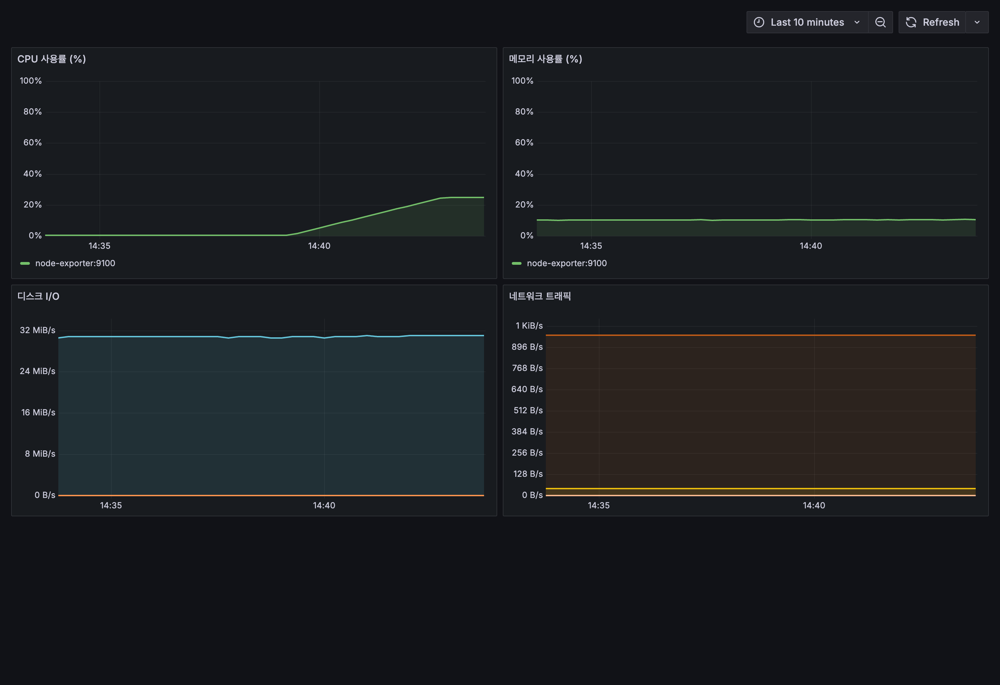

패널 넷을 다 올리면 CPU, 메모리, 디스크, 네트워크가 한 화면에 들어온다. 서버 한 대를 들여다보는 최소 구성이 여기까지다.

> 디스크와 네트워크 패널은 장치 수만큼 시계열이 잡힌다. 위 화면처럼 가상 장치가 많은 환경에서는 범례가 지저분해지므로, `device=~"nvme.*|sd.*"` 같은 조건으로 실제 장치만 남기거나 범례를 끄는 편이 낫다.

# 5. 퀴즈

여기까지 읽었으면 풀 수 있는 문제들이다. 답을 고르면 바로 해설이 나온다.

```quiz
- type: mcq
  q: "Prometheus는 타겟이 죽은 것을 어떻게 알아차리나?"
  choices: ["Prometheus가 직접 호출한 /metrics가 실패하기 때문에", "타겟이 죽었다는 이벤트를 스스로 push로 보내오기 때문에", "타겟이 남긴 로그를 주기적으로 수집해 분석하기 때문에", "타겟이 보내오던 heartbeat 신호가 끊어지기 때문에"]
  answer: 0
  explain: "Pull 방식이라 Prometheus가 직접 /metrics를 호출하기 때문이다. 호출이 실패하면 그 자체가 장애 신호가 된다. Push 방식은 타겟이 조용해졌을 때 그게 장애인지 그냥 트래픽이 없는 건지 구분하기 어렵다. (2.1)"

- type: mcq
  q: "누적 Counter 그래프가 어느 순간 바닥으로 뚝 떨어졌다. 무슨 일이 있었고, 왜 같은 구간의 rate() 그래프는 멀쩡한가?"
  choices: ["앱이 재시작돼 0부터 다시 세고, rate()가 리셋을 보정해서다", "네트워크가 끊겨 값이 유실됐고, rate()는 빈 구간을 건너뛰어서다", "카운터가 상한을 넘겨 초기화됐고, rate()는 상한을 무시해서다", "옛 데이터가 만료돼 삭제됐고, rate()는 최근 값만 봐서다"]
  answer: 0
  explain: "애플리케이션이 재시작돼 카운터가 0부터 다시 시작한 것이다. rate()는 이런 단조 증가의 단절을 자동으로 보정하기 때문에 리셋 지점에서도 값이 튀지 않는다. (2.2.1)"

- type: mcq
  q: "Histogram에서 le=\"0.5\" 버킷에는 어떤 요청이 담기나?"
  choices: ["0.5초 이하로 걸린 요청 전부", "0.5초를 초과해 걸린 요청 전부", "정확히 0.5초가 걸린 요청만", "0.5초에서 1.0초 사이의 요청만"]
  answer: 0
  explain: "0.5초 이하 요청 전부다. 0.25초와 0.5초 사이 구간만 세는 게 아니다. 버킷이 누적이라 막대가 오른쪽으로 갈수록 계속 커진다. (2.2.3)"

- type: mcq
  q: "서버 세 대의 p99 응답 시간을 구해야 한다. 무엇을 써야 하나?"
  choices: ["Histogram — 버킷 개수를 합산한 뒤 분위수를 계산할 수 있어서", "Summary — 각 서버가 미리 계산한 분위수를 그대로 합칠 수 있어서", "Summary — 세 서버의 p99를 평균 내면 전체 p99가 나와서", "Histogram — 서버마다 분위수를 미리 계산해 그대로 넘겨줘서"]
  answer: 0
  explain: "Histogram이다. Summary는 각 서버가 미리 계산한 분위수만 넘기므로 나중에 합칠 수 없다. 세 서버의 p99를 평균 내도 그건 전체 p99가 아니다. Histogram은 버킷 개수를 그대로 넘기니 서버에서 합산한 뒤 분위수를 계산할 수 있다. (2.2.4)"

- type: ox
  q: "요청을 사용자별로 보고 싶다면 user_id 같은 고유값을 Label로 추가하는 것이 권장되는 방법이다."
  answer: false
  explain: "시계열 수가 Label 값 가짓수의 곱으로 늘어나기 때문에 말려야 한다. method(5) × path(20) × status(6) = 600개짜리 메트릭에 사용자 10만 명을 곱하면 6천만 개가 된다. Label에는 값의 가짓수를 미리 셀 수 있는 것만 넣고, 셀 수 없는 값은 로그로 보낸다. (2.3)"

- type: code
  q: "이 쿼리를 실행하면 어떻게 되나?"
  lang: promql
  code: |
    rate(http_requests_total)
  choices: ["에러가 난다 — rate()에 range vector가 없어서", "지금 값 하나만으로 초당 증가율이 계산된다", "기본 범위 [5m]가 자동 적용돼 정상 동작한다", "누적 총합이 계산 없이 그대로 반환된다"]
  answer: 0
  explain: "rate()는 \"얼마나 늘었나 ÷ 걸린 시간\"을 계산해야 해서 값이 최소 두 개 필요하다. 범위 표기가 없으면 시계열마다 지금 값 하나(instant vector)만 오기 때문에 계산할 수가 없다. [5m]처럼 범위를 붙여 range vector로 만들어야 한다. (2.4.2)"

- type: mcq
  q: "{status=~\"5..\"}는 무엇을 고르는 조건인가?"
  choices: ["5로 시작하는 세 자리, 즉 5xx 응답 전체", "정확히 \"5..\"라는 문자열인 status 값", "5로 시작하면 자릿수는 상관없는 값 전체", "5를 포함하지 않는 나머지 status 전체"]
  answer: 0
  explain: "=~는 정규식 매칭이고 .은 아무 문자 하나를 뜻한다. 그래서 5로 시작하는 세 자리, 즉 500·502·503 같은 5xx 응답 전체가 걸린다. (2.4.1)"

- type: mcq
  q: "sum(rate(...))과 sum by(path)(rate(...))의 결과는 어떻게 다른가?"
  choices: ["앞은 라벨을 다 버려 선 1개, 뒤는 path별로 선이 나온다", "앞은 path별로 선이 나오고, 뒤는 라벨을 다 버려 선 1개다", "둘 다 선 1개지만, 뒤는 path 라벨만 툴팁에 남는다", "앞은 전체 평균을 내고, 뒤는 path별 합계를 낸다"]
  answer: 0
  explain: "앞은 라벨을 모두 버리고 값 하나로 합쳐 선이 하나만 나온다. 뒤는 path 라벨을 남기므로 경로 수만큼 선이 나온다. (2.4.3)"

- type: blank
  q: "docker-compose로 Grafana와 Prometheus를 함께 띄웠다. Grafana의 Data Source URL에는 localhost가 아니라 docker-compose가 붙여준 서비스 이름을 호스트로 써야 한다. http://___:9090 의 빈칸에 들어갈 이름은?"
  answer: ["prometheus"]
  explain: "Grafana도 컨테이너 안에서 돌기 때문이다. 컨테이너 입장에서 localhost는 자기 자신이라 Prometheus를 찾지 못한다. docker-compose가 만들어준 네트워크에서는 서비스 이름이 곧 호스트 이름이 되므로 http://prometheus:9090으로 지정한다. (3.1)"

- type: mcq
  q: "대시보드를 다 만들었는데 패널이 전부 비어 있다. 어디부터 확인해야 하나?"
  choices: ["Prometheus의 Status → Targets에서 타겟이 UP인지", "Grafana 패널의 색상과 축 범위 등 표시 설정이 맞는지", "대시보드에 걸린 조회 시간 범위가 미래로 잡혔는지", "PromQL 쿼리에 쓴 함수 이름에 오타가 없는지"]
  answer: 0
  explain: "Prometheus 웹 UI의 Status → Targets다. 타겟이 DOWN이면 애초에 데이터가 수집되지 않은 것이라 쿼리나 패널 설정을 아무리 만져도 소용이 없다. (4.1)"
```

# 6. 마무리

정리하면 이렇다.

- Prometheus는 Exporter가 열어둔 `/metrics`를 주기적으로 긁어 가는 Pull 방식이다
- 메트릭 타입은 넷이지만 실제로 손이 가는 건 Counter와 Histogram이다
- PromQL은 `rate()`, `increase()`, `histogram_quantile()`, `avg_over_time()` 네 개로 대부분 커버된다
- Label은 메트릭을 여러 차원으로 쪼개주지만, 고유 식별자를 넣는 순간 카디널리티가 터진다
- Grafana 대시보드는 Data Source → Dashboard → Row → Panel → Query 구조다
- Prometheus + Grafana + node-exporter는 docker-compose 파일 하나로 띄울 수 있다

다음 편에서는 node-exporter가 주는 시스템 메트릭에서 한 걸음 더 들어가, Go 애플리케이션에 직접 메트릭을 심는다. HTTP 요청 수와 응답 시간은 물론 주문 건수 같은 비즈니스 지표까지 계측해서 Grafana에 올려본다.

> 이 글에서 사용한 전체 코드는 [GitHub](https://github.com/kenshin579/tutorials-go/tree/master/monitoring/grafana-metrics)에서 확인할 수 있다.

# 7. 참고

- [Prometheus 공식 문서](https://prometheus.io/docs/introduction/overview/)
- [Grafana 공식 문서](https://grafana.com/docs/grafana/latest/)
- [PromQL 쿼리 가이드](https://prometheus.io/docs/prometheus/latest/querying/basics/)
- [node-exporter GitHub](https://github.com/prometheus/node_exporter)
- [Prometheus 메트릭 타입](https://prometheus.io/docs/concepts/metric_types/)
- [Grafana Provisioning](https://grafana.com/docs/grafana/latest/administration/provisioning/)
- [Grafana Dashboard Best Practices](https://grafana.com/docs/grafana/latest/dashboards/build-dashboards/best-practices/)
