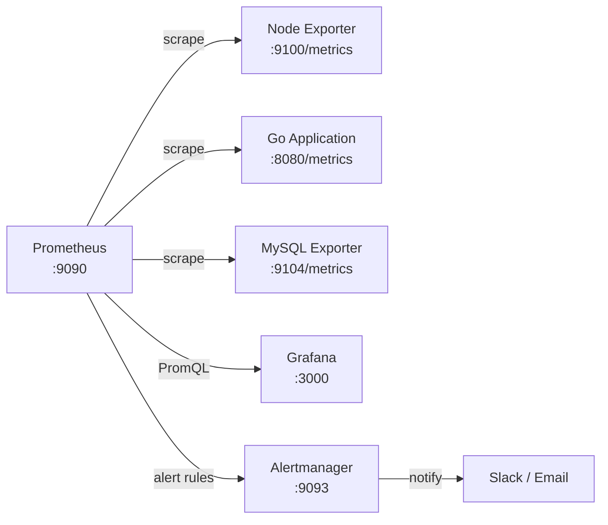
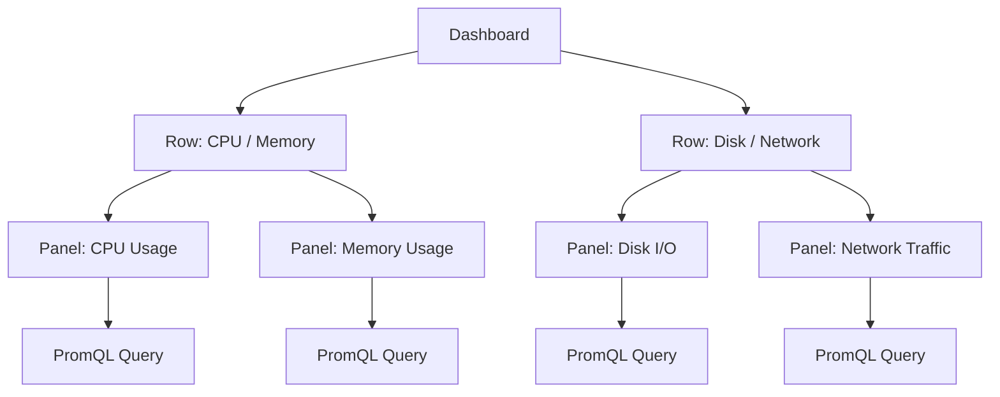

# 1. Introduction

By the time you hear the service is slow, SSH into the box, and type `top`, it is already too late. You can see what the CPU is doing right now, but there is no way to know what it was doing 30 minutes ago. Finding the cause requires numbers from the past, and those numbers are nowhere to be found. That is ultimately what a monitoring system does: it keeps piling up measurements so you can rewind to any moment later.

These days this area is called Observability, and it is usually discussed as three kinds of data.

| Signal | Description | Typical tools |
|------|------|-----------|
| **Metrics** | Numeric data over time (CPU, memory, request counts) | Prometheus, Datadog |
| **Logs** | Records of events (error messages, request logs) | Loki, ELK Stack |
| **Traces** | The path of a request (calls between services) | Tempo, Jaeger |

This is the first article in the series, and it covers only Metrics out of the three. The scope runs from collecting numbers with Prometheus to drawing them with Grafana.

The series is organized as follows.

| Part | Title | Area |
|----|------|-------------|
| **Part 1 (this article)** | Prometheus and Grafana Basics | Metrics basics |
| Part 2 | Custom Metrics in a Go Application | Metrics in depth |
| Part 3 | Distributed Tracing with Grafana Tempo | Traces |
| Part 4 | Continuous Profiling with Grafana Pyroscope | Profiles |

Here is what this article covers.

- Prometheus architecture and the four metric types
- PromQL syntax and practical queries
- Grafana core concepts (Data Source, Dashboard, Panel, Variables)
- Building a Prometheus + Grafana + node-exporter environment with docker-compose
- Creating a system monitoring dashboard

> The full code used in this article is available on [GitHub](https://github.com/kenshin579/tutorials-go/tree/master/monitoring/grafana-metrics).

<!-- slides -->

# 2. Prometheus Core Concepts

## 2.1 Architecture — Pull-based Metric Collection

Prometheus fetches metrics itself (Pull). As long as the monitored target exposes a `/metrics` HTTP endpoint, Prometheus periodically calls that address (scrape) and pulls the values. The target does not need to know where to send anything.



The core components are as follows.

| Component | Role |
|-----------|------|
| **Prometheus Server** | Collects metrics (scrape), stores them (TSDB), runs the PromQL query engine |
| **Exporter** | Exposes a target system's metrics on a `/metrics` endpoint |
| **Alertmanager** | Sends notifications to Slack, Email, and others based on alert rules |
| **Grafana** | Queries Prometheus with PromQL and visualizes dashboards |

Putting it side by side with the Push model makes the difference clear.

| Aspect | Pull (Prometheus) | Push (Datadog, InfluxDB) |
|-----------|------------------------|-------------------------------|
| Data flow | The server pulls from targets | Targets send to the server |
| Service discovery | Required (it must know what to scrape) | Not required (targets send directly) |
| Network requirement | Server → target access | Target → server access |
| Advantage | Target health is visible (scrape failure = outage) | Works well behind firewalls |
| Drawback | Hard to scrape targets behind firewalls | Hard to detect data loss when a target dies |

## 2.2 The Four Metric Types

Prometheus supports four metric types.

| Type | Characteristics | Examples | Common functions |
|------|------|-----------|-----------|
| **Counter** | Only ever increases (restarts back at 0) | HTTP request count, error count | `rate()`, `increase()` |
| **Gauge** | Goes up and down | CPU usage, memory usage, active connections | Direct query, `avg_over_time()` |
| **Histogram** | Distributes values into buckets | Response time, request size | `histogram_quantile()` |
| **Summary** | Stores quantiles computed in advance | Response time (computed client-side) | Direct query |

> The Counter and Histogram screenshots below were captured with metrics instrumented in the series sample app (built in Part 2). The environment built in chapter 4 on its own still exposes node-exporter and Prometheus's own metrics.

### 2.2.1 Counter — Monotonically Increasing Values

A Counter is a metric that only accumulates. When the server restarts, it goes back to 0.


This is `http_requests_total` dropped straight onto a Time series panel. The line falling to the floor at 14:11 is the moment the application restarted. The trouble is that all you can read from this graph is "it keeps going up." What you actually want to know — how many requests are coming in right now — lives in the slope, not the value.

Apply `rate()` to the same data and that slope becomes visible.


Now you can see the real traffic hovering between 5 and 10 requests per second. The line does not spike at the restart either, because `rate()` detects the counter reset and adjusts for it. This is why `rate()` should be the first thing that comes to mind when you look at a Counter.

```promql
# Per-second rate of HTTP requests (5-minute average)
rate(http_requests_total[5m])

# Total increase over the last hour
increase(http_requests_total[1h])
```

### 2.2.2 Gauge — A Current Value That Can Go Either Way

A Gauge is the value at this very moment, so it moves up and down. CPU usage, memory usage, and active connection counts belong here.


Unlike a Counter, the value itself is the answer, so there is no reason to wrap it in `rate()`. You can also see memory dipping and refilling at the 14:11 restart here.

```promql
# Current in-flight requests
http_requests_in_flight

# 5-minute average CPU usage
avg_over_time(node_cpu_seconds_total{mode="idle"}[5m])
```

### 2.2.3 Histogram — Distribution of Values (Bucket-based)

A Histogram captures a distribution by sorting values into predefined buckets. All it stores is the count per bucket, and percentiles are computed at query time with `histogram_quantile()`.

The easy thing to get wrong here is that buckets are cumulative. The `le="0.5"` bucket holds every request that took 0.5 seconds or less; it does not count only the slice between 0.25 and 0.5 seconds. `histogram_quantile()` works backwards from these cumulative counts to derive a percentile.

If you want to see the distribution itself, use a Heatmap panel. Setting the query Format to `Heatmap` converts the cumulative buckets back into per-interval counts, then plots time on the x-axis and buckets on the y-axis with color intensity showing density.


The darker areas are the response times where requests cluster. Two separate bands stand out, one around 10–25ms and another around 250–500ms, because the read API and the order creation API have inherently different response times. Had you looked only at an average, these two would have been flattened into a single number somewhere around 100ms.

```promql
# P99 response time (the worst latency the top 1% experience)
histogram_quantile(0.99, rate(http_request_duration_seconds_bucket[5m]))

# Comparing P50 / P90 / P99
histogram_quantile(0.50, rate(http_request_duration_seconds_bucket[5m]))
histogram_quantile(0.90, rate(http_request_duration_seconds_bucket[5m]))
histogram_quantile(0.99, rate(http_request_duration_seconds_bucket[5m]))
```

### 2.2.4 Summary — Distribution of Values (Quantile-based)

A Summary also deals with distribution, but the quantiles are computed on the application side and stored already finished. Because the math is done, Summaries from multiple instances cannot be combined afterwards.


The GC pause duration that the Go runtime exports by default is a Summary. It arrives as time series carrying a `quantile` label, so dashboards overlay one line per label like this. You can see at a glance that the median sits near 100µs while the maximum swings past 500µs. All three lines dropping to 0 at 14:11 is the restart.

If Histogram hands over bucket counts and lets the server do the math, Summary hands over only the result. The p99 of a single server is just this value read as-is, but averaging these values across three servers to get a p99 does not give you a p99.

| Aspect | Histogram | Summary |
|-----------|-----------|---------|
| Where quantiles are computed | Server (at query time) | Client (at collection time) |
| Aggregating across instances | Possible | Not possible |
| Changing buckets/quantiles | Config change and restart | Code change required |
| Recommended for | Most cases | Special cases needing exact quantiles |

> If you run more than one server, Histogram is the better choice. Summary cannot be aggregated, so it loses value the moment instances multiply.

## 2.3 Labels and Time Series

The smallest unit Prometheus stores is a single **time series**. A time series is nothing fancy: it is one name tag with `(timestamp, value)` pairs appended to it forever. The `http_requests_total` series actually accumulates like this.

| Timestamp | Value |
|------|-----|
| 14:30:00 | 1,204 |
| 14:30:15 | 1,251 |
| 14:30:30 | 1,298 |
| 14:30:45 | 1,344 |

One row is added every 15 seconds. The scrape interval you configured becomes exactly this spacing. Think of every dot plotted on a graph as one row of this table.

The problem is that when the name tag is only `http_requests_total`, the most you can read from it is "requests went up." Which API grew, and how many of those failed, is not in that number. So you attach tags after the name. Those are Labels.

```
http_requests_total{method="GET",  path="/api/orders", status="200"}
http_requests_total{method="POST", path="/api/orders", status="201"}
http_requests_total{method="POST", path="/api/orders", status="500"}
```

All three share a name, but Prometheus stores them as **three separate time series**. That means each one carries its own list of values like the table above. Thanks to that you can graph only the failed order creations (`status="500"`), or add the three back together to see total requests. Both splitting and combining are possible because Labels exist. The syntax for combining comes in the very next section.


Query `http_requests_total` in the Prometheus UI and you get one row per label combination like this. There is one metric name, but several actual time series.

That is the good side of Labels. There is a shadow too: the number of time series grows **multiplicatively**.

| Label | Distinct values |
|-------|------------|
| `method` | 5 (GET, POST, PUT, DELETE, PATCH) |
| `path` | 20 |
| `status` | 6 |

5 × 20 × 6 = 600. A single metric becomes 600 time series. That much is fine. But what happens when someone says "let's break it down per user" and adds `user_id`? With 100,000 users that is 600 × 100,000 = **60 million**. Every time series consumes memory, so Prometheus simply collapses. This is called a cardinality explosion.

> There is a single test for it. **Can you count the possible values of this Label in advance?** `method`, `status`, and `path` you can count. `user_id`, `session_id`, `request_id`, email addresses, and IP addresses you cannot. Values you cannot count belong in logs, not in Labels.

### 2.3.1 Where Metric Names Come From

Now that Labels are covered, let us deal with the other half: the name. Who decided on names like `http_requests_total` or `node_cpu_seconds_total`? Do they ship with Prometheus?

No. Every one of them is a name somebody typed into code. `http_requests_total` is declared by this series' sample app like this.

```go
var HttpRequestsTotal = prometheus.NewCounterVec(
    prometheus.CounterOpts{
        Name: "http_requests_total",
        Help: "Total number of HTTP requests",
    },
    []string{"method", "path", "status"},
)
```

The third argument holds the Label names this metric will use. The `{method=..., path=..., status=...}` you saw earlier comes from here. As for the name, Prometheus treats it as just a string, so `my_stuff_counter` would be collected and queried exactly the same way.

Names still look similar everywhere because there are official naming conventions.

| Rule | Wording in the official docs | Examples |
|------|----------------|-----|
| Prefix with a single word describing the domain | "SHOULD have a (single-word) application prefix" | `node_`, `process_`, `prometheus_` |
| Suffix with the unit, in plural form | "SHOULD have a suffix describing the unit, in plural form" | `_seconds`, `_bytes` |
| End accumulating counts with `_total` | "an accumulating count has `total` as a suffix" | `http_requests_total` |

The example the official docs happen to use is `http_requests_total`, which is how that name became practically idiomatic. Follow the same rules in your own instrumentation and anyone reading the name can guess the type and the unit.

The names you actually end up using come from three places.

| Source | Examples | Who decides |
|------|-----|------------|
| Exporters | `node_cpu_seconds_total`, `node_memory_MemTotal_bytes` | The exporter author |
| Default collectors in client libraries | `go_goroutines`, `go_gc_duration_seconds`, `process_cpu_seconds_total` | Registered automatically by the library |
| Your own instrumentation | `http_requests_total`, `orders_created_total` | The application developer |

`go_gc_duration_seconds`, used as the Summary example in 2.2.4, belongs to the second group. That is why it exists even though nobody declared it. The moment you wire in the Go client library, runtime metrics come along with it.

### 2.3.2 Finding Out Which Metrics Exist

You do not need to memorize names. Just ask the running system.

```bash
# Metrics a target exposes, with their types
> curl -s http://localhost:9100/metrics | grep "^# TYPE"

# Every metric name Prometheus knows about
> curl -s 'http://localhost:9090/api/v1/label/__name__/values'

# Names plus type and description
> curl -s 'http://localhost:9090/api/v1/metadata'
```

In the Prometheus web UI the query box autocompletes from the same list. Typing part of a name brings up candidates, so in practice this is what you will reach for most. The full list and descriptions per exporter are documented in each project's repository.

## 2.4 PromQL Basics

PromQL (Prometheus Query Language) is the query language for reading and computing over stored metrics. Every Grafana panel is ultimately one line of PromQL, so there is no way around it if you want dashboards.

It looks cryptic at first, but the structure is simple. Any query is a combination of the following four pieces.

| Piece | What it decides | Example |
|------|-----------|-----|
| Metric name | What to look at | `http_requests_total` |
| Label filter | Which of those series to keep | `{status="500"}` |
| Time range | Which window of values to read | `[5m]` |
| Function/aggregation | How to compute over those values | `rate(...)`, `sum by(path)` |

Put the four together and you get this.

```promql
sum by(path) (rate(http_requests_total{status="500"}[5m]))
```

Read it from the inside out. Out of `http_requests_total` → keep only the ones where `status="500"` → take the last 5 minutes → convert to a per-second rate → and sum by `path`. Now let us walk through the pieces one at a time.

### 2.4.1 Label Filters — Conditions Inside the Braces

Inside `{}` you write conditions for which series to select. There are four operators.

| Operator | Meaning | Example |
|--------|-----|------|
| `=` | Equal to the value | `{method="GET"}` |
| `!=` | Not equal to the value | `{device!="lo"}` |
| `=~` | Matches the regular expression | `{status=~"5.."}` |
| `!~` | Does not match the regular expression | `{path!~"/health.*"}` |

In `{status=~"5.."}` the `.` means any single character, so 500, 502, and 503 all match. In other words, "all 5xx." Chain conditions with commas and only the series satisfying all of them remain.

```promql
http_requests_total{method="GET", status=~"5.."}   # only 5xx among GET requests
```

### 2.4.2 Time Range — What Changes When You Add `[5m]`

This is the most confusing part of PromQL. Without a range, you get **one current value** per series.

```promql
http_requests_total          # 1 value per series (for example, 1,344)
```

Add brackets and you get **every value accumulated in that window**.

```promql
http_requests_total[5m]      # 20 values per series (15-second interval × 5 minutes)
```

The former is called an instant vector, the latter a range vector. This distinction matters because functions require different inputs.

`rate()` computes "how much it grew ÷ how long it took," so it needs at least two values. That is why the official docs spell it out as `rate(v range-vector)`. Writing `rate(http_requests_total)` without a range is an error; only `rate(http_requests_total[5m])` works. Conversely, when you simply look at a Gauge the current value is enough, so no range is needed.

How wide to make the window depends on the scrape interval. At least two values have to land inside it, so it needs comfortable headroom over the scrape interval; with a 15-second interval, a minute or more is typical, and 5 minutes is the conventional choice. Too short and the graph twitches, too long and changes get smoothed away.

### 2.4.3 Aggregation — Putting the Split Series Back Together

Section 2.3 explained how Labels split one metric into many time series. Aggregation functions put them back together.

| Function | Meaning |
|------|-----|
| `sum()` | Adds everything up |
| `avg()` | Takes the average |
| `max()` / `min()` | Maximum / minimum |
| `count()` | Counts how many series there are |

A plain `sum(...)` throws away every label and flattens it into a single value. When you want to keep specific labels, add `by`.

```promql
sum(rate(http_requests_total[5m]))             # total traffic (1 line)
sum by(path) (rate(http_requests_total[5m]))   # traffic per path (one line per path)
sum by(path, status) (...)                     # per path × status combination
```

If `by` means "keep only these labels," `without` is the opposite: "drop only these labels and keep the rest."

### 2.4.4 Frequently Used Functions

| Function | Description | Metric type it is used with | Example |
|------|------|------------------|-----------|
| `rate()` | Average per-second rate of change | Counter | `rate(http_requests_total[5m])` |
| `increase()` | Total increase over a period | Counter | `increase(http_requests_total[1h])` |
| `histogram_quantile()` | Computes a percentile | Histogram | `histogram_quantile(0.99, rate(...[5m]))` |
| `avg_over_time()` | Average value over a period | Gauge | `avg_over_time(metric[5m])` |

`rate()` throws in one more convenience: it adjusts for the counter resets seen in 2.2.1 on its own. In the words of the official docs, "Breaks in monotonicity (such as counter resets due to target restarts) are automatically adjusted for." You do not have to handle the negative spike at every restart yourself.

One thing deserves a pause here. The "metric type it is used with" column above is **not something PromQL verifies for you.** The Prometheus server does not know whether a metric is a Counter or a Gauge. The official docs state that the server "does not yet make use of the type information and flattens all types except native histograms into untyped time series of floating point values." The metric type is decided by the instrumentation library, which merely announces it in the `/metrics` response with a comment like `# TYPE http_requests_total counter`.

What PromQL does enforce is the vector type. The function signatures say so plainly.

| Function | Signature |
|------|----------|
| `rate` | `rate(v range-vector)` |
| `increase` | `increase(v range-vector)` |
| `avg_over_time` | `avg_over_time(range-vector)` |
| `histogram_quantile` | `histogram_quantile(φ scalar, b instant-vector)` |

Which is why these two lines meet different fates.

```promql
rate(node_memory_MemAvailable_bytes[5m])   # no error. It computes even though this is a Gauge
rate(http_requests_total)                  # error. Not a range vector
```

The first is a wrong query — `rate()` applied to a Gauge — yet Prometheus does not stop it, because syntactically a range vector was passed and that condition holds. What it does instead is mistake every drop in memory for a counter reset and "correct" it, producing nonsense. **Vector types are what errors catch; whether the metric type fits is on you.**

To check what type a metric is, look at the `# TYPE` line in the `/metrics` response or query Prometheus's `/api/v1/metadata`. The name alone is a decent hint: ending in `_total` means Counter, a `_bucket`·`_sum`·`_count` set means Histogram, and a `quantile` label means Summary.

Rather than explaining it in prose, it is faster to look at the raw output Prometheus actually scrapes. Just call the target application's endpoint yourself.

```bash
> curl -s http://localhost:8080/metrics
```

Trimmed down to show how the four types arrive, it looks like this.

```
# HELP http_requests_total Total number of HTTP requests
# TYPE http_requests_total counter
http_requests_total{method="GET",path="/api/orders",status="200"} 272
http_requests_total{method="GET",path="/health",status="200"} 1
http_requests_total{method="POST",path="/api/orders",status="201"} 64
http_requests_total{method="POST",path="/api/orders",status="500"} 8

# HELP http_requests_in_flight Number of HTTP requests currently being processed
# TYPE http_requests_in_flight gauge
http_requests_in_flight 0

# HELP http_request_duration_seconds HTTP request duration in seconds
# TYPE http_request_duration_seconds histogram
http_request_duration_seconds_bucket{method="POST",path="/api/orders",le="0.005"} 0
http_request_duration_seconds_bucket{method="POST",path="/api/orders",le="0.01"} 0
http_request_duration_seconds_bucket{method="POST",path="/api/orders",le="0.025"} 0
http_request_duration_seconds_bucket{method="POST",path="/api/orders",le="0.05"} 0
http_request_duration_seconds_bucket{method="POST",path="/api/orders",le="0.1"} 7
http_request_duration_seconds_bucket{method="POST",path="/api/orders",le="0.25"} 32
http_request_duration_seconds_bucket{method="POST",path="/api/orders",le="0.5"} 72
http_request_duration_seconds_bucket{method="POST",path="/api/orders",le="1"} 72
http_request_duration_seconds_bucket{method="POST",path="/api/orders",le="+Inf"} 72
http_request_duration_seconds_sum{method="POST",path="/api/orders"} 19.577141632999997
http_request_duration_seconds_count{method="POST",path="/api/orders"} 72

# HELP go_gc_duration_seconds A summary of the pause duration of garbage collection cycles.
# TYPE go_gc_duration_seconds summary
go_gc_duration_seconds{quantile="0"} 3.925e-05
go_gc_duration_seconds{quantile="0.5"} 4.8208e-05
go_gc_duration_seconds{quantile="1"} 4.8208e-05
go_gc_duration_seconds_sum 8.7458e-05
go_gc_duration_seconds_count 2
```

A few things here are worth noticing.

- **The `# TYPE` line is where the type comes from.** It starts with `#`, but it is not a comment. The official docs specify that "Lines with a `#` as the first non-whitespace character are comments. They are ignored unless the first token after `#` is either `HELP` or `TYPE`." In other words, only these two borrow comment syntax to carry metadata. Leaving it out only makes the type `untyped` — collection still works fine — but then the type shows up neither in `/api/v1/metadata` nor in the UI, and anyone seeing the metric for the first time has nothing to go on. Client libraries add it for you, so you will rarely write one by hand
- **A Counter gets one line per label combination.** The "one name, many time series" point from 2.3 is visible here. Four lines means four time series
- **A Histogram unfolds one name into many lines.** Several `_bucket` lines carrying an `le` label, followed by `_sum` and `_count`. Bucket values grow `0 → 7 → 32 → 72` and then hold steady, which is the cumulative behavior described in 2.2.3. It also means all 72 requests finished within 0.5 seconds
- **A Summary has no buckets.** Only finished values carrying a `quantile` label, plus `_sum` and `_count`. With no raw material to combine, the claim that instances cannot be aggregated later becomes obvious here
- **A Gauge is the simplest.** One current value and that is it

### 2.4.5 Reading Practical Queries

Now you can interpret the queries used in chapter 4. Let us peel the most intimidating one, CPU usage, from the inside out.

```promql
100 - (avg by(instance) (rate(node_cpu_seconds_total{mode="idle"}[5m])) * 100)
```

| Step | Part | What it does |
|------|------|---------|
| 1 | `node_cpu_seconds_total{mode="idle"}` | Out of the cumulative CPU time, keeps only the idle mode |
| 2 | `[5m]` + `rate(...)` | Takes the slope over 5 minutes, i.e. idle seconds per second. With 8 cores you get one series per core |
| 3 | `avg by(instance)` | Averages the per-core values into one per server. The result is between 0 and 1, where 1 means completely idle |
| 4 | `* 100` | Converts to a percentage |
| 5 | `100 - (...)` | Flips "percent idle" into "percent busy" |

The remaining queries read the same way, but each has one spot where it is easy to trip.

**Error rate (%)**

```promql
sum(rate(http_requests_total{status=~"5.."}[5m]))
  / sum(rate(http_requests_total[5m])) * 100
```

| Step | Part | What it does |
|------|------|---------|
| 1 | `http_requests_total{status=~"5.."}` | Keeps only 5xx responses |
| 2 | `rate(...[5m])` | Converts to failures per second |
| 3 | `sum(...)` | Strips every label down to a single number |
| 4 | Same on the bottom | Computes requests per second with no filter |
| 5 | Divide, then `* 100` | Turns the failure ratio into a percentage |

Without the `sum()` in step 3 the query breaks silently. Division in PromQL pairs up series **whose labels all match**. Divide without `sum()` and the left-hand `{status="500"}` pairs with the right-hand `{status="500"}`, so the result is a value divided by itself: always 1. Run it and you see exactly that.

```
# without sum — always 1
{method="POST", path="/api/orders", status="500"}  1

# after stripping labels with sum — the real error rate
{}  5.5
```

Removing `status` from the labels is the whole point, so instead of `sum()` you can use `by` to name the labels you want to keep. When you need the error rate per path, write it like this.

```promql
sum by(path) (rate(http_requests_total{status=~"5.."}[5m]))
  / sum by(path) (rate(http_requests_total[5m])) * 100
```

**Memory usage (%)**

```promql
(1 - node_memory_MemAvailable_bytes / node_memory_MemTotal_bytes) * 100
```

There is no `rate()` here. Both are Gauges, so the current value is the answer. The division gives the "available ratio," subtracting it from 1 flips it into the "in-use ratio," and multiplying by 100 makes it a percentage. This division works with no extra effort because both sides carry identical labels, `instance` and `job`. That is exactly where it parts ways with the error rate query.

There is also a reason for using `MemAvailable` rather than `MemFree`. Linux spends spare memory on file cache, and that cache is reclaimed the instant it is needed. Compute with `MemFree` and any server with a warm cache looks permanently out of memory. `MemAvailable` adds the reclaimable portion back in and tells you how much you can actually use.

**Disk usage (%)**

```promql
(1 - node_filesystem_avail_bytes{mountpoint="/"} / node_filesystem_size_bytes{mountpoint="/"}) * 100
```

The arithmetic is the same as memory. The difference is that filesystem metrics produce a separate series per mount point, so you have to pin one down with `mountpoint="/"`. Drop that filter and `/`, `/boot`, and every Docker overlay show up together, cluttering the graph.

`avail` and `free` are also distinct. Linux filesystems reserve some blocks for root; `node_filesystem_free_bytes` includes that reservation while `node_filesystem_avail_bytes` excludes it. What an ordinary process can actually use is the latter.

> The node-exporter launched by chapter 4's docker-compose is confined to its container and only sees its own filesystem. Run the query above as-is and the result is empty, because there is no `mountpoint="/"`. On a Linux host you fix this by mounting the host root.
>
> ```yaml
>   node-exporter:
>     image: prom/node-exporter:v1.8.1
>     volumes:
>       - /:/host:ro,rslave
>     command:
>       - '--path.rootfs=/host'
> ```
>
> On Docker Desktop for macOS or Windows, however, even this only reveals the Linux VM's filesystem, not your laptop's disk (`rslave` propagation is not supported either, so the mount itself may be rejected). If the result is empty, first check which mount points actually exist and pick one of those.
>
> ```bash
> > curl -s http://localhost:9100/metrics | grep "^node_filesystem_size_bytes"
> ```

# 3. Grafana Core Concepts

Grafana is an open source dashboard tool that visualizes data from many sources. Besides Prometheus, you can attach Loki, Tempo, MySQL, and Elasticsearch.

## 3.1 Connecting a Data Source

A Data Source is where Grafana reads data from. Register one before building any dashboard.

There are two ways to add Prometheus as a Data Source.

**Option 1: Add it through the UI**

1. Grafana left menu → **Connections** → **Data sources** → **Add data source**
2. Select Prometheus
3. Enter `http://prometheus:9090` as the URL
4. Click **Save & Test**


The key detail is putting `prometheus:9090` in the URL instead of `localhost:9090`. Grafana runs inside a container too, so it has to reach Prometheus by container name. Click **Save & Test** and the "Successfully queried the Prometheus API" message appears.

**Option 2: Configure it automatically with a provisioning file**

In a docker-compose environment you can register the Data Source automatically with a YAML file. Chapter 4 uses this approach.

```yaml
# provisioning/datasources/datasource.yml
apiVersion: 1

datasources:
  - name: Prometheus
    type: prometheus
    access: proxy
    url: http://prometheus:9090
    isDefault: true
    editable: true
```

## 3.2 Understanding Dashboard Structure

A Grafana Dashboard is organized hierarchically.



| Component | Description |
|-----------|------|
| **Dashboard** | A screen collecting multiple Panels. Can be exported/imported as JSON |
| **Row** | A collapsible area that groups Panels logically |
| **Panel** | A single visualization unit. Fetches data with a PromQL query and renders a chart |
| **Query** | The PromQL query a Panel sends to the Data Source |

## 3.3 Main Panel Types

There are many Panel types, and which one suits depends on the shape of your data.

| Panel type | Purpose | Data it fits |
|------------|------|---------------|
| **Time series** | Values changing over time | CPU usage, request counts, response times |
| **Stat** | Highlighting a single number | Current uptime, total requests |
| **Gauge** | A current value within a range (gauge style) | Disk usage, memory usage |
| **Table** | Data listed in tabular form | Per-instance status, Top N lists |
| **Bar chart** | Comparison across categories | Errors per service, requests per endpoint |
| **Heatmap** | Two-dimensional distribution | Response time distribution, Histogram buckets |

## 3.4 Variables and Templating

Add Variables and a dropdown appears at the top of the dashboard. Whether you run ten servers or twenty, you build one dashboard and pick from it.

An example Variable configuration looks like this.

| Field | Value |
|------|---|
| Name | `instance` |
| Type | Query |
| Data source | Prometheus |
| Query | `label_values(node_cpu_seconds_total, instance)` |
| Multi-value | Enabled |

Once configured, you can use the `$instance` variable in a Panel's PromQL.

```promql
# CPU usage using the instance variable
100 - (avg by(instance) (rate(node_cpu_seconds_total{mode="idle", instance=~"$instance"}[5m])) * 100)
```


Pick an instance from the dropdown and only that instance's metrics remain. The screen above comes from an environment with a single node-exporter, so the list is short, but as you add servers the entries grow with whatever `label_values()` finds.

# 4. Hands-on: Building a Local Environment (docker-compose)

This chapter runs Prometheus, Grafana, and node-exporter with docker-compose and builds a system monitoring dashboard.

## 4.1 Running Prometheus + Grafana with docker-compose

Write a docker-compose file with three services.

```yaml
# docker-compose.yml
services:
  prometheus:
    image: prom/prometheus:v2.51.0
    container_name: prometheus
    ports:
      - "9090:9090"
    volumes:
      - ./prometheus/prometheus.yml:/etc/prometheus/prometheus.yml
    command:
      - '--config.file=/etc/prometheus/prometheus.yml'
      - '--storage.tsdb.retention.time=7d'

  grafana:
    image: grafana/grafana:11.4.0
    container_name: grafana
    ports:
      - "3000:3000"
    environment:
      - GF_SECURITY_ADMIN_PASSWORD=admin
    volumes:
      - ./provisioning:/etc/grafana/provisioning

  node-exporter:
    image: prom/node-exporter:v1.8.1
    container_name: node-exporter
    ports:
      - "9100:9100"
```

Write the Prometheus configuration file. `scrape_configs` defines what to collect from.

```yaml
# prometheus/prometheus.yml
global:
  scrape_interval: 15s      # how often metrics are collected
  evaluation_interval: 15s   # how often alert rules are evaluated

scrape_configs:
  # Prometheus's own metrics
  - job_name: 'prometheus'
    static_configs:
      - targets: ['localhost:9090']

  # node-exporter system metrics
  - job_name: 'node-exporter'
    static_configs:
      - targets: ['node-exporter:9100']
```

Also write a provisioning file so the Grafana Data Source registers itself.

```yaml
# provisioning/datasources/datasource.yml
apiVersion: 1

datasources:
  - name: Prometheus
    type: prometheus
    access: proxy
    url: http://prometheus:9090
    isDefault: true
    editable: true
```

Start it up.

```bash
> docker compose up -d
```

Once it is running, visit each service.

| Service | URL | Description |
|--------|-----|------|
| Prometheus | http://localhost:9090 | Prometheus web UI |
| Grafana | http://localhost:3000 | Grafana dashboards (admin/admin) |
| node-exporter | http://localhost:9100/metrics | Check system metrics |

In the Prometheus web UI, open **Status → Targets** and confirm that the `node-exporter` and `prometheus` targets are `UP`.


The endpoint, the last scrape time, and how long the scrape took are all visible here. If this says `DOWN`, no amount of dashboard work will produce anything but empty graphs, so start from this screen whenever something is wrong.

## 4.2 Collecting System Metrics with node-exporter

node-exporter is the official Prometheus exporter that collects hardware and OS-level metrics from Linux/macOS systems. Visit `http://localhost:9100/metrics` to see the list of metrics it collects.

The main metrics are as follows.

| Metric | Type | Description |
|--------|------|------|
| `node_cpu_seconds_total` | Counter | CPU time per mode (idle, user, system, etc.) |
| `node_memory_MemTotal_bytes` | Gauge | Total memory size |
| `node_memory_MemAvailable_bytes` | Gauge | Available memory size |
| `node_filesystem_size_bytes` | Gauge | Total filesystem size |
| `node_filesystem_avail_bytes` | Gauge | Available filesystem size |
| `node_disk_read_bytes_total` | Counter | Bytes read from disk |
| `node_disk_written_bytes_total` | Counter | Bytes written to disk |
| `node_network_receive_bytes_total` | Counter | Bytes received over the network |
| `node_network_transmit_bytes_total` | Counter | Bytes transmitted over the network |

Try running the following query in the Prometheus web UI.

```promql
# Check CPU usage
100 - (avg by(instance) (rate(node_cpu_seconds_total{mode="idle"}[5m])) * 100)
```


You can check queries in Prometheus's own UI without going through Grafana. Before building a dashboard, it is faster to confirm here that the query returns what you expect.

## 4.3 Building Your First Dashboard

Let us build a system monitoring dashboard in Grafana with four panels.

**Steps to create the dashboard:**

1. Grafana left menu → **Dashboards** → **New** → **New Dashboard**
2. Click **Add visualization**
3. Select **Prometheus** as the Data source
4. Enter the PromQL query and click **Apply**

### 4.3.1 Panel 1: CPU Usage

Computes the share of time the CPU spent outside idle mode.

| Field | Value |
|------|---|
| Panel type | Time series |
| Title | CPU Usage (%) |
| PromQL | See below |
| Unit | Percent (0-100) |

```promql
100 - (avg by(instance) (rate(node_cpu_seconds_total{mode="idle"}[5m])) * 100)
```

### 4.3.2 Panel 2: Memory Usage

Computes usage from the ratio of available memory to total memory.

| Field | Value |
|------|---|
| Panel type | Time series |
| Title | Memory Usage (%) |
| PromQL | See below |
| Unit | Percent (0-100) |

```promql
(1 - node_memory_MemAvailable_bytes / node_memory_MemTotal_bytes) * 100
```

### 4.3.3 Panel 3: Disk I/O

Shows bytes read and written per second.

| Field | Value |
|------|---|
| Panel type | Time series |
| Title | Disk I/O |
| PromQL (Read) | See below |
| PromQL (Write) | See below |
| Unit | bytes/sec (Bytes/sec IEC) |

```promql
# Disk read throughput
rate(node_disk_read_bytes_total[5m])

# Disk write throughput
rate(node_disk_written_bytes_total[5m])
```

### 4.3.4 Panel 4: Network Traffic

Shows bytes received and transmitted per second on network interfaces.

| Field | Value |
|------|---|
| Panel type | Time series |
| Title | Network Traffic |
| PromQL (Receive) | See below |
| PromQL (Transmit) | See below |
| Unit | bytes/sec (Bytes/sec IEC) |

```promql
# Network receive throughput
rate(node_network_receive_bytes_total{device!="lo"}[5m])

# Network transmit throughput
rate(node_network_transmit_bytes_total{device!="lo"}[5m])
```

> The `device!="lo"` condition excludes the loopback interface.


With all four panels in place, CPU, memory, disk, and network fit on one screen. This is the minimum setup for watching a single server.

> The disk and network panels produce one series per device. In environments with many virtual devices like the screen above, the legend gets messy, so it is better to keep only real devices with a condition like `device=~"nvme.*|sd.*"` or turn the legend off.

# 5. Quiz

If you have read this far, you can answer these. Pick an answer and the explanation appears right away.

```quiz
- type: mcq
  q: "How does Prometheus notice that a target has died?"
  choices: ["The target itself pushes an event saying it has died", "It periodically collects and analyzes the target's logs", "The /metrics call Prometheus makes itself fails", "The heartbeat signal the target used to send stops"]
  answer: 2
  explain: "Because it is pull-based, Prometheus calls /metrics itself. When that call fails, the failure is the signal. With push, when a target goes quiet it is hard to tell an outage from simply having no traffic. (2.1)"

- type: mcq
  q: "A cumulative Counter graph drops to the floor at some point. What happened, and why does the rate() graph look fine over the same stretch?"
  choices: ["The app restarted and counts from 0, and rate() corrects the reset", "The network dropped and lost values, and rate() skips the empty span", "The counter hit its ceiling and reset, and rate() ignores the ceiling", "Old data expired and was deleted, and rate() sees only recent values"]
  answer: 0
  explain: "The application restarted and the counter started again from 0. rate() automatically adjusts for these breaks in monotonicity, so the value does not spike at the reset point. (2.2.1)"

- type: mcq
  q: "In a Histogram, which requests land in the le=\"0.5\" bucket?"
  choices: ["Every request that took more than 0.5 seconds", "Every request that took 0.5 seconds or less", "Only requests that took exactly 0.5 seconds", "Only requests between 0.5 and 1.0 seconds"]
  answer: 1
  explain: "Every request that took 0.5 seconds or less. It does not count only the slice between 0.25 and 0.5 seconds. Because buckets are cumulative, the bars keep growing toward the right. (2.2.3)"

- type: mcq
  q: "You need the p99 response time across three servers. Which should you use?"
  choices: ["Summary — you can just combine the quantiles each server precomputed", "Summary — averaging the p99 of three servers gives the overall p99", "Histogram — each server precomputes the quantile and hands it over as-is", "Histogram — you can aggregate the bucket counts, then compute the quantile"]
  answer: 3
  explain: "Histogram. Summary only hands over quantiles each server computed in advance, so they cannot be combined later. Averaging the p99 of three servers does not give you the overall p99. Histogram passes the bucket counts as-is, so the server can aggregate them first and then compute the quantile. (2.2.4)"

- type: ox
  q: "To analyze requests per user, adding a unique value like user_id as a Label is the recommended approach."
  answer: false
  explain: "You should stop them, because the number of time series grows as the product of label value counts. A metric at method(5) × path(20) × status(6) = 600 series becomes 60 million once you multiply by 100,000 users. Put only values you can count in advance into Labels, and send the uncountable ones to logs. (2.3)"

- type: code
  q: "What happens when you run this query?"
  lang: promql
  code: |
    rate(http_requests_total)
  choices: ["It computes a per-second rate from the single current value", "It errors — rate() has no range vector to work on", "A default [5m] range is applied and it runs fine", "The cumulative total is returned as-is, uncomputed"]
  answer: 1
  explain: "rate() has to compute \"how much it grew ÷ how long it took,\" so it needs at least two values. Without a range, each series delivers only its current value (an instant vector), which leaves nothing to compute. You have to attach a range like [5m] to make it a range vector. (2.4.2)"

- type: mcq
  q: "What does {status=~\"5..\"} select?"
  choices: ["Only the status value that is literally the string \"5..\"", "Any value starting with 5, regardless of digit count", "Every remaining status that does not contain a 5", "Three-digit values starting with 5, i.e. all 5xx responses"]
  answer: 3
  explain: "=~ is regular expression matching and . means any single character. So it matches three-digit values starting with 5, meaning all 5xx responses like 500, 502, and 503. (2.4.1)"

- type: mcq
  q: "How do the results of sum(rate(...)) and sum by(path)(rate(...)) differ?"
  choices: ["The first drops all labels for 1 line; the second gives one line per path", "The first gives one line per path; the second drops all labels for 1 line", "Both give 1 line, but the second keeps the path label only in the tooltip", "The first takes the overall average; the second sums per path"]
  answer: 0
  explain: "The first drops every label and collapses into a single value, giving one line. The second keeps the path label, so you get one line per path. (2.4.3)"

- type: blank
  q: "You ran Grafana and Prometheus together with docker-compose. Grafana's Data Source URL must use the service name docker-compose assigns as the host, not localhost. What name fills the blank in http://___:9090?"
  answer: ["prometheus"]
  explain: "Because Grafana runs inside a container as well. From the container's point of view localhost is itself, so it cannot find Prometheus. On the network that docker-compose creates, the service name becomes the hostname, so you point it at http://prometheus:9090. (3.1)"

- type: mcq
  q: "You finished building the dashboard but every panel is empty. Where do you look first?"
  choices: ["The Grafana panel's color and axis range settings", "Whether the dashboard's time range is set into the future", "Prometheus's Status → Targets, to see if the target is UP", "Whether the PromQL query has a typo in a function name"]
  answer: 2
  explain: "Status → Targets in the Prometheus web UI. If a target is DOWN, no data was collected in the first place, so no amount of fiddling with queries or panel settings will help. (4.1)"
```

# 6. Conclusion

To summarize.

- Prometheus is pull-based, periodically scraping the `/metrics` endpoints exporters expose
- There are four metric types, but the ones you actually reach for are Counter and Histogram
- `rate()`, `increase()`, `histogram_quantile()`, and `avg_over_time()` cover most of PromQL
- Labels slice a metric into dimensions, but cardinality explodes the moment you put a unique identifier in one
- A Grafana dashboard follows the Data Source → Dashboard → Row → Panel → Query structure
- Prometheus + Grafana + node-exporter can be started from a single docker-compose file

The next part goes one step beyond the system metrics node-exporter gives you and instruments a Go application directly. We will measure HTTP request counts and response times as well as business indicators like order counts, and put them on Grafana.

> The full code used in this article is available on [GitHub](https://github.com/kenshin579/tutorials-go/tree/master/monitoring/grafana-metrics).

# 7. References

- [Prometheus Documentation](https://prometheus.io/docs/introduction/overview/)
- [Grafana Documentation](https://grafana.com/docs/grafana/latest/)
- [PromQL Querying Basics](https://prometheus.io/docs/prometheus/latest/querying/basics/)
- [node-exporter GitHub](https://github.com/prometheus/node_exporter)
- [Prometheus Metric Types](https://prometheus.io/docs/concepts/metric_types/)
- [Grafana Provisioning](https://grafana.com/docs/grafana/latest/administration/provisioning/)
- [Grafana Dashboard Best Practices](https://grafana.com/docs/grafana/latest/dashboards/build-dashboards/best-practices/)
