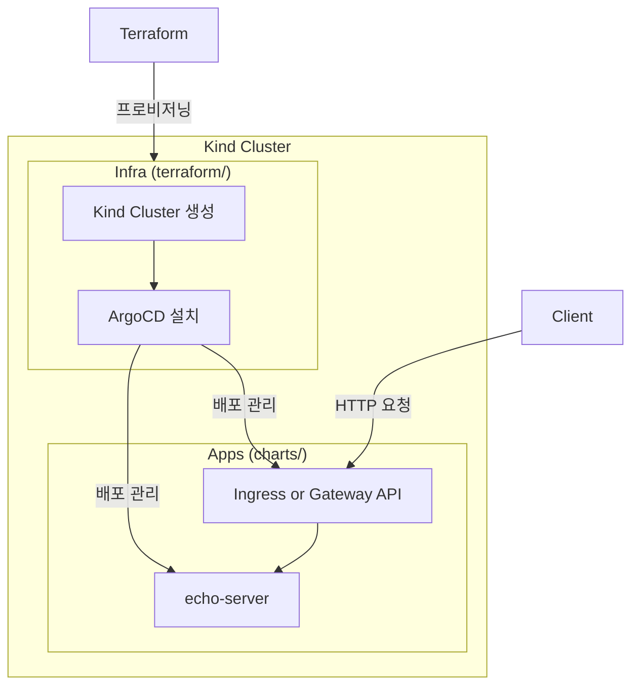

# 1. 개요

Kubernetes 환경에서 가장 널리 사용되던 `Ingress Controller` 중 하나인 `Ingress NGINX`가 **2026년 3월을 기점으로 공식 지원 종료(EOL)**를 예고했다.

지원 종료는 단순히 "더 이상 업데이트가 없다"는 의미에 그치지 않는다.

- 신규 기능 개발 중단
- 보안 패치 제공 중단 가능성
- Kubernetes 생태계 내에서의 점진적 비권장(`Deprecated`) 포지션

즉, 장기적으로 `Ingress NGINX`에 의존하는 구조는 기술 부채가 된다는 의미다. 이로 인해 Kubernetes 공식 `SIG-Network`에서 제안한 차세대 표준인 `Gateway API`로의 전환이 사실상 선택이 아닌 필수가 되고 있다.

> **참고**: 은퇴하는 대상은 `Ingress NGINX Controller`(구현체)이며, `Ingress` API 자체는 Kubernetes 1.19부터 GA 상태로 `Deprecated` 계획은 없다. 다만 `Gateway API`가 차세대 표준으로 자리잡고 있다.

이 글에서는 다음 내용을 다룬다.

- 기존 `Ingress` 구조의 한계
- `Gateway API`의 개념과 핵심 리소스
- `Ingress`에서 `Gateway`로의 마이그레이션 전략
- `NGINX Gateway Fabric`을 이용한 실제 구성 방법

> 이 글에서 사용하는 예제 코드는 [GitHub 저장소](https://github.com/kenshin579/tutorials-go/tree/master/cloud/ingress-gateway)에서 확인할 수 있다.

# 2. 기존 Ingress 구조와 한계

`Ingress`는 Kubernetes 클러스터 외부 트래픽을 내부 `Service`로 라우팅하기 위한 리소스다. HTTP/HTTPS 기반 라우팅을 간단한 YAML로 정의할 수 있다는 장점 때문에 오랫동안 표준처럼 사용되어 왔다.

기본적인 `Ingress` 리소스는 다음과 같이 정의된다. 예제 프로젝트의 `echo-server`를 `Ingress`로 라우팅하는 설정이다.

```yaml
# charts/ingress/ingress-routes/templates/ingress.yaml
apiVersion: networking.k8s.io/v1
kind: Ingress
metadata:
  name: echo-server-ingress
  annotations:
    nginx.ingress.kubernetes.io/rewrite-target: /
spec:
  ingressClassName: nginx
  rules:
    - host: echo.local
      http:
        paths:
          - path: /
            pathType: Prefix
            backend:
              service:
                name: echo-server
                port:
                  number: 80
```

하지만 `Ingress`에는 구조적인 한계가 존재한다.

## 2.1 역할 분리가 어렵다

`Ingress` 리소스 하나에 다음 책임이 모두 섞여 있다.

- **인프라 레벨 설정**: `LoadBalancer`, TLS, IP 정책
- **애플리케이션 레벨 라우팅**: `path`, `host` 기반 라우팅

이로 인해 인프라 팀과 애플리케이션 팀의 역할 분리가 어렵다. 하나의 리소스를 양쪽에서 수정해야 하므로 충돌과 혼란이 발생하기 쉽다.

## 2.2 확장성과 표현력의 한계

- TCP / UDP 지원이 제한적이다
- 고급 라우팅(헤더 기반, 가중치 기반 등)은 `Annotation`에 의존한다
- `Controller` 구현체마다 `Annotation`이 다르다

결과적으로 표준은 느슨하고, 구현체 의존성은 강해지는 구조가 된다. 예를 들어 NGINX에서 사용하던 `Annotation`을 `Traefik`에서는 다르게 작성해야 한다.

# 3. Ingress vs Gateway API 비교

| 구분 | `Ingress` | `Gateway API` |
|------|---------|-------------|
| 표준화 수준 | 낮음 (`Annotation` 의존) | 높음 (`SIG-Network` 주도) |
| 역할 분리 | 없음 (단일 리소스) | 명확함 (`GatewayClass`/`Gateway`/`Route`) |
| 확장성 | 제한적 (HTTP/HTTPS 중심) | L4~L7 멀티 프로토콜 지원 |
| 구현 의존성 | 강함 | 상대적으로 낮음 |
| 고급 라우팅 | `Annotation` 필요 | 네이티브 지원 (헤더, 가중치 등) |
| 멀티 테넌시 | 미지원 | `ReferenceGrant`로 네임스페이스 간 제어 |

`Gateway API`는 이러한 `Ingress`의 한계를 해결하기 위해 등장했다.

# 4. Gateway API란?

`Gateway API`는 Kubernetes에서 트래픽 진입 계층을 표준화하기 위한 차세대 API다. `Ingress`를 대체하기 위해 설계되었으며, 처음부터 **확장성과 역할 분리**를 전제로 한다.

## 4.1 핵심 리소스

`Gateway API`는 역할에 따라 리소스를 분리하여 관리한다. 이 구조는 `StorageClass`/`PersistentVolume` 패턴과 유사하다.

### GatewayClass

어떤 구현체를 사용할지 정의한다. 인프라 제공자가 관리하는 리소스다.

```yaml
apiVersion: gateway.networking.k8s.io/v1
kind: GatewayClass
metadata:
  name: nginx
spec:
  controllerName: gateway.nginx.org/nginx-gateway-controller
```

- 예: NGINX, `Istio`, `Kong`, `Traefik` 등

### Gateway

실제 트래픽 진입 지점이다. `LoadBalancer`, `Listener`(TLS/HTTP) 설정을 담당하며 **인프라 관점의 리소스**다.

```yaml
# charts/gateway/gateway-routes/templates/gateway.yaml
apiVersion: gateway.networking.k8s.io/v1
kind: Gateway
metadata:
  name: echo-gateway
spec:
  gatewayClassName: nginx
  listeners:
    - name: http
      port: 80
      protocol: HTTP
      allowedRoutes:
        namespaces:
          from: All
```

TLS를 사용하는 경우 HTTPS 리스너를 추가할 수 있다.

```yaml
    - name: https
      port: 443
      protocol: HTTPS
      allowedRoutes:
        namespaces:
          from: All
      tls:
        mode: Terminate
        certificateRefs:
          - kind: Secret
            name: echo-tls
```

### HTTPRoute

요청을 어떤 `Service`로 보낼지 정의한다. **애플리케이션 관점의 리소스**다.

```yaml
# charts/gateway/gateway-routes/templates/httproutes.yaml
apiVersion: gateway.networking.k8s.io/v1
kind: HTTPRoute
metadata:
  name: echo-server-route
spec:
  parentRefs:
    - name: echo-gateway
  hostnames:
    - echo.local
  rules:
    - matches:
        - path:
            type: PathPrefix
            value: /
      backendRefs:
        - name: echo-server
          namespace: app
          port: 80
```

이 구조를 통해 인프라 설정(`Gateway`)과 애플리케이션 라우팅(`HTTPRoute`)을 명확히 분리할 수 있다.

## 4.2 역할 기반 설계

`Gateway API`는 팀 간 책임 분리를 명확하게 한다.

| 역할 | 담당 리소스 | 설명 |
|------|------------|------|
| 인프라 제공자 | `GatewayClass` | 구현체 정의 |
| 클러스터 운영자 | `Gateway` | 트래픽 진입점, TLS 설정 |
| 애플리케이션 개발자 | `HTTPRoute` | 서비스 라우팅 규칙 |

## 4.3 지원하는 Route 종류

`Gateway API`는 HTTP뿐만 아니라 다양한 프로토콜을 지원한다.

- **`HTTPRoute`**: HTTP/HTTPS 트래픽 라우팅
- **`GRPCRoute`**: gRPC 트래픽 라우팅
- **`TLSRoute`**: TLS 패스스루 라우팅
- **`TCPRoute`**: TCP 트래픽 라우팅
- **`UDPRoute`**: UDP 트래픽 라우팅

# 5. Gateway API 구현체 종류

`Gateway API`는 인터페이스일 뿐이며, 실제 동작은 구현체가 담당한다. 대표적인 구현체는 다음과 같다.

| 구현체 | 특징 |
|--------|------|
| **NGINX Gateway Fabric** | NGINX 기반, `Ingress NGINX` 사용자에게 가장 자연스러운 전환 |
| **Istio** | 서비스 메시와 통합, 고급 트래픽 관리 |
| **Kong Gateway** | API Gateway 기능 풍부, 플러그인 생태계 |
| **Traefik** | 자동 설정, `Let's Encrypt` 통합 |
| **Envoy Gateway** | `Envoy` 프록시 기반, CNCF 프로젝트 |

이 글에서는 `Ingress NGINX` 사용자에게 가장 자연스러운 선택지인 **NGINX Gateway Fabric**을 기준으로 설명한다.

# 6. Ingress → Gateway 마이그레이션 전략

`Ingress`에서 `Gateway`로의 전환은 한 번에 갈아엎는 방식이 아니다. 단계적인 접근이 중요하다.

## 6.1 기존 Ingress 구성 분석

먼저 현재 사용 중인 `Ingress`를 정리한다.

- `host` / `path` 규칙
- TLS 설정
- `Annotation` 사용 여부
- `Controller` 종속 기능 여부

특히 `Annotation` 기반 기능은 `Gateway API`에서 다른 방식으로 표현해야 한다.

## 6.2 Ingress ↔ HTTPRoute 매핑

`Ingress`의 주요 요소는 `HTTPRoute`로 다음과 같이 대응된다.

| `Ingress` | `Gateway API` |
|---------|-------------|
| `host` | `HTTPRoute.hostnames` |
| `path` | `HTTPRoute.rules.matches` |
| `backend service` | `HTTPRoute.rules.backendRefs` |
| `TLS` | `Gateway.listener` |
| `annotations` | 네이티브 필드 또는 Policy 리소스 |

예제 프로젝트의 `Ingress`와 `HTTPRoute`를 1:1로 비교하면 다음과 같다.

**`Ingress` 방식:**

```yaml
# charts/ingress/ingress-routes/values.yaml
ingress:
  name: echo-server-ingress
  className: nginx
  annotations:
    nginx.ingress.kubernetes.io/rewrite-target: /
  hosts:
    - host: echo.local
      paths:
        - path: /
          pathType: Prefix
          serviceName: echo-server
          servicePort: 80
```

**`Gateway API` 방식:**

```yaml
# charts/gateway/gateway-routes/values.yaml
gateway:
  name: echo-gateway
  className: nginx
  listeners:
    - name: http
      port: 80
      protocol: HTTP
      allowedRoutes:
        from: All

httpRoutes:
  - name: echo-server-route
    hostnames:
      - echo.local
    rules:
      - matches:
          - path:
              type: PathPrefix
              value: /
        backendRefs:
          - name: echo-server
            namespace: app
            port: 80
```

구조적으로 `Ingress` → `HTTPRoute` 변환은 비교적 직관적이다. `Gateway API`에서는 인프라 설정(`Gateway`)과 라우팅 규칙(`HTTPRoute`)이 분리되어 있다는 점이 핵심 차이다.

> **Tip**: Cursor나 Claude Code 같은 AI 코딩 도구를 활용하면 기존 `Ingress` YAML을 `Gateway API` 형식으로 빠르게 전환할 수 있다. 매핑 규칙이 명확하므로 변환 정확도가 높고, 리소스가 많아도 일괄 변환이 가능하다.

# 7. NGINX Gateway Fabric으로 Gateway 구성하기

이 섹션에서는 [예제 프로젝트](https://github.com/kenshin579/tutorials-go/tree/master/cloud/ingress-gateway)를 기반으로 실제 `Gateway` 구성 방법을 설명한다.

## 7.1 아키텍처 개요

예제 프로젝트는 `Kind` 클러스터 위에 `ArgoCD`를 통해 `Ingress`와 `Gateway`를 각각 배포하는 구조다. `Terraform`으로 `Kind` 클러스터와 `ArgoCD`를 프로비저닝하고, `ArgoCD`가 `Helm` 차트 기반으로 `Ingress` 또는 `Gateway API` 리소스와 `echo-server` 애플리케이션을 배포한다. 동일한 `echo-server`를 대상으로 `Ingress` 방식과 `Gateway` 방식을 교차 배포하면서 차이를 비교할 수 있다.



프로젝트 디렉토리 구조는 다음과 같다.

```
.
├── Makefile                    # 자동화 명령어
├── terraform/                  # Kind 클러스터 + ArgoCD 설치
├── bootstrap/                  # ArgoCD Applications
│   ├── apps.yaml               # echo-server 배포
│   ├── infra-ingress.yaml      # Ingress 인프라
│   └── infra-gateway.yaml      # Gateway 인프라
└── charts/                     # Helm Charts
    ├── echo-server/            # 샘플 애플리케이션
    ├── ingress/                # Ingress 관련 차트
    │   ├── nginx-ingress/      # NGINX Ingress Controller
    │   └── ingress-routes/     # Ingress 리소스
    └── gateway/                # Gateway API 관련 차트
        ├── gateway-api-crds/   # Gateway API CRDs
        ├── cert-manager/       # cert-manager (TLS 인증서 관리)
        ├── nginx-gateway/      # NGINX Gateway Fabric
        └── gateway-routes/     # Gateway, HTTPRoute, TLS 리소스
```

예제를 실행하려면 [Terraform](https://www.terraform.io/downloads) >= 1.0, [kubectl](https://kubernetes.io/docs/tasks/tools/), [Docker](https://www.docker.com/get-started), [Kind](https://kind.sigs.k8s.io/docs/user/quick-start/#installation)가 필요하다.

## 7.2 클러스터 생성 및 Gateway 배포

먼저 `Terraform`으로 `Kind` 클러스터를 생성하고 `ArgoCD`를 설치한다.

```bash
make tf-init
make tf-apply
```

`Gateway API` 기반으로 배포하려면 다음 명령어를 실행한다.

```bash
make deploy-gateway
```

이 명령은 `bootstrap/infra-gateway.yaml` `ArgoCD` `ApplicationSet`을 적용하여 다음 컴포넌트를 순차적으로 배포한다.

```yaml
# bootstrap/infra-gateway.yaml
apiVersion: argoproj.io/v1alpha1
kind: ApplicationSet
metadata:
  name: gateway-infra
  namespace: argocd
spec:
  generators:
    - list:
        elements:
          - name: gateway-api-crds
            namespace: gateway
            path: cloud/ingress-gateway/charts/gateway/gateway-api-crds
          - name: nginx-gateway
            namespace: gateway
            path: cloud/ingress-gateway/charts/gateway/nginx-gateway
          - name: gateway-routes
            namespace: gateway
            path: cloud/ingress-gateway/charts/gateway/gateway-routes
  template:
    metadata:
      name: "{{name}}"
    spec:
      project: default
      source:
        repoURL: https://github.com/kenshin579/tutorials-go
        targetRevision: HEAD
        path: "{{path}}"
      destination:
        server: https://kubernetes.default.svc
        namespace: "{{namespace}}"
      syncPolicy:
        automated:
          prune: true
          selfHeal: true
        syncOptions:
          - CreateNamespace=true
```

배포 흐름은 다음과 같다.

1. **Gateway API CRDs 설치** - `Gateway`, `HTTPRoute` 등의 커스텀 리소스 정의
2. **`NGINX Gateway Fabric` 설치** - `Gateway API` 구현체 (`Helm` 차트, 버전 2.2.1)
3. **Gateway Routes 배포** - `Gateway`와 `HTTPRoute` 리소스 생성

## 7.3 Gateway 리소스 구성

`Gateway API`를 사용하려면 구현체 설정, 실제 라우팅 리소스 정의, 그리고 필요에 따라 TLS 인증서 설정까지 구성해야 한다.
이 섹션에서는 `NGINX Gateway Fabric` 설정부터 `Gateway`/`HTTPRoute` 정의, TLS 설정까지 순서대로 살펴본다.

### 7.3.1 NGINX Gateway Fabric 설정

`NGINX Gateway Fabric`은 `Helm` 차트로 설치되며, `Kind` 클러스터 환경에 맞게 다음과 같이 설정한다.

```yaml
# charts/gateway/nginx-gateway/values.yaml
nginx-gateway-fabric:
  service:
    type: NodePort
  nginxGateway:
    gwAPIExperimentalFeatures:
      enable: true
  nodeSelector:
    ingress-ready: "true"
  tolerations:
    - key: "node-role.kubernetes.io/control-plane"
      operator: "Equal"
      effect: "NoSchedule"
    - key: "node-role.kubernetes.io/master"
      operator: "Equal"
      effect: "NoSchedule"
```

- `NodePort` 타입으로 서비스를 노출 (`Kind` 환경)
- `gwAPIExperimentalFeatures` 활성화로 `Gateway API` experimental 채널 리소스 사용 가능 (`TLSRoute`, `TCPRoute`, `UDPRoute` 등)
- Control Plane 노드에 스케줄링 가능하도록 `tolerations` 설정

### 7.3.2 Gateway 및 HTTPRoute

`Gateway`는 트래픽 진입점을, `HTTPRoute`는 서비스 라우팅 규칙을 정의한다. 예제 프로젝트에서는 `Helm` 템플릿으로 관리하며, `values` 파일만 수정하면 다양한 환경에 맞게 배포할 수 있다.

#### Gateway 리소스

`Gateway`는 외부 트래픽이 클러스터로 들어오는 진입점을 정의한다. 어떤 `GatewayClass`를 사용할지, 어떤 포트와 프로토콜로 리스닝할지, 어떤 네임스페이스의 `Route`를 허용할지를 설정한다.

```yaml
# charts/gateway/gateway-routes/templates/gateway.yaml
apiVersion: gateway.networking.k8s.io/v1
kind: Gateway
metadata:
  name: {{ .Values.gateway.name }}
  namespace: {{ .Release.Namespace }}
spec:
  gatewayClassName: {{ .Values.gateway.className }}
  listeners:
    {{- range .Values.gateway.listeners }}
    - name: {{ .name }}
      port: {{ .port }}
      protocol: {{ .protocol }}
      {{- if .tls }}
      tls:
        mode: {{ .tls.mode }}
        certificateRefs:
          {{- range .tls.certificateRefs }}
          - kind: {{ .kind }}
            name: {{ .name }}
          {{- end }}
      {{- end }}
      allowedRoutes:
        namespaces:
          from: {{ .allowedRoutes.from }}
    {{- end }}
```

#### HTTPRoute 리소스

`HTTPRoute`는 `Gateway`로 들어온 요청을 호스트명과 경로 조건에 따라 어떤 백엔드 `Service`로 전달할지 정의한다. 하나의 `Gateway`에 여러 `HTTPRoute`를 연결할 수 있어 서비스별로 독립적인 라우팅 관리가 가능하다.

```yaml
# charts/gateway/gateway-routes/templates/httproutes.yaml
{{- range .Values.httpRoutes }}
---
apiVersion: gateway.networking.k8s.io/v1
kind: HTTPRoute
metadata:
  name: {{ .name }}
  namespace: {{ $.Release.Namespace }}
spec:
  parentRefs:
    - name: {{ $.Values.gateway.name }}
      namespace: {{ $.Release.Namespace }}
  hostnames:
    {{- range .hostnames }}
    - {{ . }}
    {{- end }}
  rules:
    {{- range .rules }}
    - matches:
        {{- range .matches }}
        - path:
            type: {{ .path.type }}
            value: {{ .path.value }}
        {{- end }}
      backendRefs:
        {{- range .backendRefs }}
        - name: {{ .name }}
          namespace: {{ .namespace }}
          port: {{ .port }}
        {{- end }}
    {{- end }}
{{- end }}
```

실제 `values` 파일로 렌더링되면 다음과 같은 리소스가 생성된다.

```yaml
# Gateway: echo-gateway (port 80, HTTP)
# HTTPRoute: echo-server-route
#   - host: echo.local
#   - path: / (PathPrefix)
#   - backend: echo-server (namespace: app, port: 80)
```

### 7.3.3 TLS/HTTPS 설정 (선택적)

HTTPS를 사용하려면 `cert-manager`를 활성화하고 관련 설정을 추가한다.

#### 1단계: cert-manager 활성화

`bootstrap/infra-gateway.yaml`에서 `cert-manager` 항목의 주석을 해제한다.

```yaml
elements:
  - name: gateway-api-crds
    namespace: gateway
    path: cloud/ingress-gateway/charts/gateway/gateway-api-crds
  - name: cert-manager      # 주석 해제
    namespace: gateway
    path: cloud/ingress-gateway/charts/gateway/cert-manager
  - name: nginx-gateway
    namespace: gateway
    path: cloud/ingress-gateway/charts/gateway/nginx-gateway
  - name: gateway-routes
    namespace: gateway
    path: cloud/ingress-gateway/charts/gateway/gateway-routes
```

#### 2단계: TLS 관련 values 설정

`charts/gateway/gateway-routes/values.yaml`에서 TLS를 활성화한다.

```yaml
tls:
  enabled: true  # false -> true로 변경

gateway:
  listeners:
    - name: http
      port: 80
      protocol: HTTP
      allowedRoutes:
        from: All
    - name: https        # 주석 해제
      port: 443
      protocol: HTTPS
      allowedRoutes:
        from: All
      tls:
        mode: Terminate
        certificateRefs:
          - kind: Secret
            name: echo-tls

letsencrypt:
  email: your-email@example.com
  environment: staging  # staging 또는 prod

certificate:
  name: echo-tls
  dnsNames:
    - echo.local
```

TLS가 활성화되면 다음 리소스가 추가로 생성된다.

`ClusterIssuer`는 `cert-manager`에서 인증서를 발급할 CA(인증 기관)를 정의하는 리소스다. 클러스터 전체에서 공유되며, 아래 예제에서는 `Let's Encrypt` ACME 서버를 사용한다.

```yaml
# charts/gateway/gateway-routes/templates/clusterissuer.yaml
apiVersion: cert-manager.io/v1
kind: ClusterIssuer
metadata:
  name: letsencrypt-staging
spec:
  acme:
    email: your-email@example.com
    server: https://acme-staging-v02.api.letsencrypt.org/directory
    privateKeySecretRef:
      name: letsencrypt-staging-key
    solvers:
      - http01:
          gatewayHTTPRoute:
            parentRefs:
              - name: echo-gateway
                kind: Gateway
```

`Certificate`는 실제 TLS 인증서 발급을 요청하는 리소스다. 발급된 인증서는 지정한 `Secret`에 저장되며, `Gateway`의 TLS 리스너에서 참조한다.

```yaml
# charts/gateway/gateway-routes/templates/certificate.yaml
apiVersion: cert-manager.io/v1
kind: Certificate
metadata:
  name: echo-tls
spec:
  secretName: echo-tls
  dnsNames:
    - echo.local
  issuerRef:
    name: letsencrypt-staging
    kind: ClusterIssuer
```

## 7.4 테스트

배포가 완료되면 다음 명령으로 동작을 확인한다.

```bash
# Gateway 테스트
make test-gateway

# 직접 curl 호출
curl -H "Host: echo.local" http://localhost/ping
```

## 7.5 Ingress 방식과의 비교 배포

같은 `echo-server`를 `Ingress` 방식으로 배포하려면 다음 명령을 사용한다.

```bash
make deploy-ingress
```

이 경우 `bootstrap/infra-ingress.yaml`이 적용되어 `NGINX Ingress Controller`와 `Ingress` 리소스가 배포된다. 두 방식을 교차 배포하면서 차이를 직접 비교해볼 수 있다.

# 8. 마무리

`Ingress NGINX` 지원 종료는 아직 시간이 남아 있는 이슈처럼 보일 수 있다. 하지만 인프라 전환은 준비에 가장 많은 시간이 드는 작업이다.

- 단순한 서비스라면 `Ingress`를 당장 제거할 필요는 없다
- 하지만 신규 서비스나 장기 운영 서비스라면 `Gateway API` 전환을 고려하는 것이 합리적이다
- 특히 `Ingress NGINX` 사용자라면 `NGINX Gateway Fabric`은 가장 자연스러운 선택지다
- `Ingress`와 `Gateway`는 공존 가능하므로 단계적 전환이 가능하다

`Gateway API`는 단순한 `Ingress` 대체재가 아니라, Kubernetes 네트워크 계층의 구조를 재정의한 표준이다.

# 9. 참고

- [Ingress NGINX 지원 종료 안내](https://nginxstore.com/blog/kubernetes/ingress-nginx-%EC%A7%80%EC%9B%90-%EC%A2%85%EB%A3%8C-%EC%95%88%EB%82%B4-kubernetes-ingress-controller/)
- [Gateway API 개요 - 요즘IT](https://yozm.wishket.com/magazine/detail/3559/)
- [Gateway API 실습 정리 - somaz](https://somaz.tistory.com/403)
- [Gateway API 실습 정리 - chabin](https://chabin37.tistory.com/133)
- [Gateway API 공식 문서](https://gateway-api.sigs.k8s.io/)
- [NGINX Gateway Fabric GitHub](https://github.com/nginxinc/nginx-gateway-fabric)
- [예제 코드 저장소](https://github.com/kenshin579/tutorials-go/tree/master/cloud/ingress-gateway)
