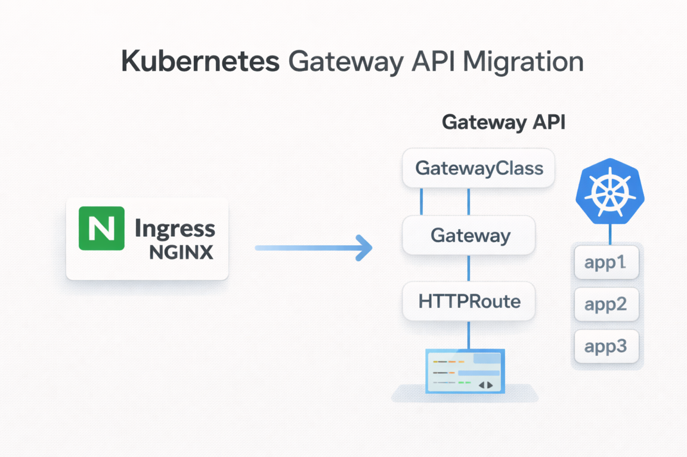
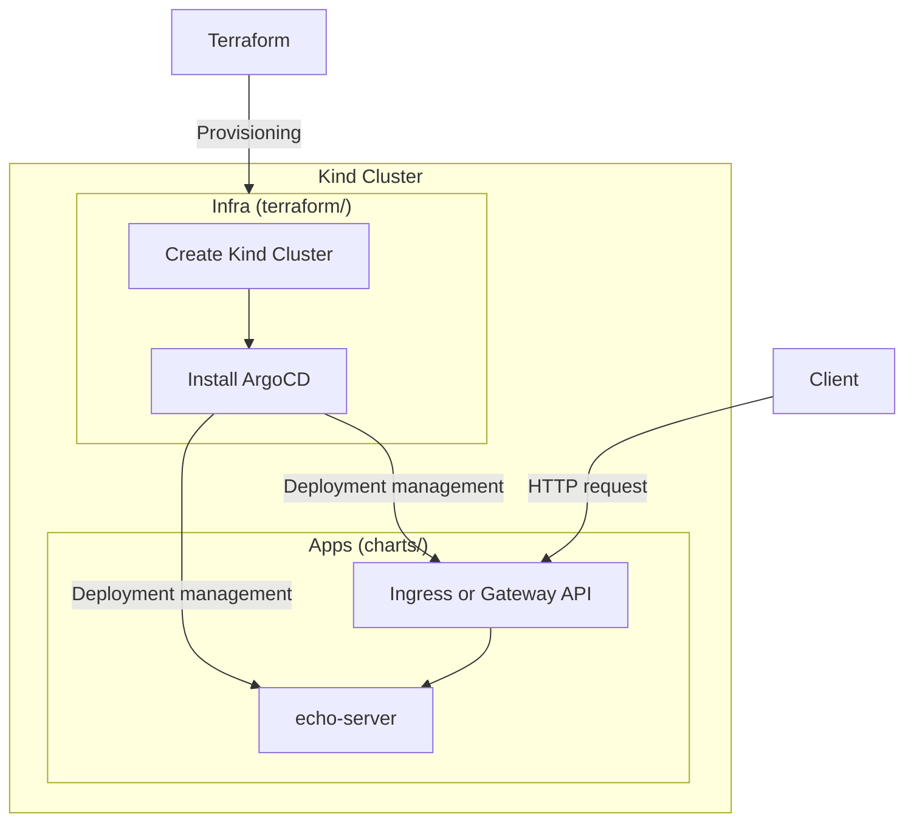

# 1. Overview



`Ingress NGINX`, one of the most widely used `Ingress Controllers` in Kubernetes environments, has announced its **official end of life (EOL) as of March 2026**.

End of support does not simply mean "no more updates."

- No more new feature development
- Possible discontinuation of security patches
- A gradual `Deprecated` position within the Kubernetes ecosystem

In other words, a structure that depends on `Ingress NGINX` over the long term becomes technical debt. As a result, transitioning to `Gateway API`—the next-generation standard proposed by the official Kubernetes `SIG-Network`—is becoming a necessity rather than a choice.

> **Note**: What is being retired is the `Ingress NGINX Controller` (the implementation), while the `Ingress` API itself has been in GA status since Kubernetes 1.19 and has no `Deprecated` plan. That said, `Gateway API` is establishing itself as the next-generation standard.

This article covers the following topics.

- Limitations of the existing `Ingress` structure
- Concepts and core resources of `Gateway API`
- Migration strategy from `Ingress` to `Gateway`
- How to actually configure it using `NGINX Gateway Fabric`

> The example code used in this article can be found in the [GitHub repository](https://github.com/kenshin579/tutorials-go/tree/master/cloud/ingress-gateway).

# 2. Existing Ingress Structure and Its Limitations

`Ingress` is a resource for routing external traffic of a Kubernetes cluster to internal `Services`. It has long been used as a de facto standard thanks to the advantage of being able to define HTTP/HTTPS-based routing with simple YAML.

A basic `Ingress` resource is defined as follows. This configuration routes the example project's `echo-server` via `Ingress`.

```yaml
# charts/ingress/ingress-routes/templates/ingress.yaml
apiVersion: networking.k8s.io/v1
kind: Ingress
metadata:
  name: echo-server-ingress
  annotations:
    nginx.ingress.kubernetes.io/rewrite-target: /
spec:
  ingressClassName: nginx
  rules:
    - host: echo.local
      http:
        paths:
          - path: /
            pathType: Prefix
            backend:
              service:
                name: echo-server
                port:
                  number: 80
```

However, `Ingress` has structural limitations.

## 2.1 Separation of Roles Is Difficult

A single `Ingress` resource mixes all of the following responsibilities.

- **Infrastructure-level settings**: `LoadBalancer`, TLS, IP policies
- **Application-level routing**: `path` and `host` based routing

This makes it difficult to separate the roles of the infrastructure team and the application team. Since a single resource must be modified by both sides, conflicts and confusion are likely to occur.

## 2.2 Limitations in Extensibility and Expressiveness

- TCP / UDP support is limited
- Advanced routing (header-based, weight-based, etc.) relies on `Annotations`
- `Annotations` differ across `Controller` implementations

As a result, the structure becomes one where the standard is loose while implementation dependency grows stronger. For example, an `Annotation` used in NGINX must be written differently in `Traefik`.

# 3. Ingress vs Gateway API Comparison

| Category | `Ingress` | `Gateway API` |
|------|---------|-------------|
| Standardization level | Low (`Annotation` dependent) | High (`SIG-Network` led) |
| Role separation | None (single resource) | Clear (`GatewayClass`/`Gateway`/`Route`) |
| Extensibility | Limited (HTTP/HTTPS centered) | L4–L7 multi-protocol support |
| Implementation dependency | Strong | Relatively low |
| Advanced routing | `Annotation` required | Native support (headers, weights, etc.) |
| Multi-tenancy | Not supported | Cross-namespace control via `ReferenceGrant` |

`Gateway API` emerged to solve these limitations of `Ingress`.

# 4. What Is Gateway API?

`Gateway API` is the next-generation API for standardizing the traffic ingress layer in Kubernetes. It is designed to replace `Ingress` and assumes **extensibility and role separation** from the ground up.

## 4.1 Core Resources

`Gateway API` separates and manages resources by role. This structure is similar to the `StorageClass`/`PersistentVolume` pattern.

### 4.1.1 GatewayClass

Defines which implementation to use. This is a resource managed by the infrastructure provider.

```yaml
apiVersion: gateway.networking.k8s.io/v1
kind: GatewayClass
metadata:
  name: nginx
spec:
  controllerName: gateway.nginx.org/nginx-gateway-controller
```

- e.g., NGINX, `Istio`, `Kong`, `Traefik`, etc.

### 4.1.2 Gateway

The actual traffic ingress point. It handles `LoadBalancer` and `Listener` (TLS/HTTP) settings and is an **infrastructure-perspective resource**.

```yaml
# charts/gateway/gateway-routes/templates/gateway.yaml
apiVersion: gateway.networking.k8s.io/v1
kind: Gateway
metadata:
  name: echo-gateway
spec:
  gatewayClassName: nginx
  listeners:
    - name: http
      port: 80
      protocol: HTTP
      allowedRoutes:
        namespaces:
          from: All
```

If TLS is used, an HTTPS listener can be added.

```yaml
    - name: https
      port: 443
      protocol: HTTPS
      allowedRoutes:
        namespaces:
          from: All
      tls:
        mode: Terminate
        certificateRefs:
          - kind: Secret
            name: echo-tls
```

### 4.1.3 HTTPRoute

Defines which `Service` a request should be sent to. This is an **application-perspective resource**.

```yaml
# charts/gateway/gateway-routes/templates/httproutes.yaml
apiVersion: gateway.networking.k8s.io/v1
kind: HTTPRoute
metadata:
  name: echo-server-route
spec:
  parentRefs:
    - name: echo-gateway
  hostnames:
    - echo.local
  rules:
    - matches:
        - path:
            type: PathPrefix
            value: /
      backendRefs:
        - name: echo-server
          namespace: app
          port: 80
```

Through this structure, the infrastructure settings (`Gateway`) and application routing (`HTTPRoute`) can be clearly separated.

## 4.2 Role-Based Design

`Gateway API` makes the separation of responsibilities between teams explicit.

| Role | Responsible Resource | Description |
|------|------------|------|
| Infrastructure provider | `GatewayClass` | Defines the implementation |
| Cluster operator | `Gateway` | Traffic ingress point, TLS settings |
| Application developer | `HTTPRoute` | Service routing rules |

## 4.3 Supported Route Types

`Gateway API` supports not only HTTP but also various protocols.

- **`HTTPRoute`**: HTTP/HTTPS traffic routing
- **`GRPCRoute`**: gRPC traffic routing
- **`TLSRoute`**: TLS passthrough routing
- **`TCPRoute`**: TCP traffic routing
- **`UDPRoute`**: UDP traffic routing

# 5. Types of Gateway API Implementations

`Gateway API` is only an interface; the actual behavior is handled by the implementation. Representative implementations are as follows.

| Implementation | Characteristics |
|--------|------|
| **NGINX Gateway Fabric** | NGINX-based; the most natural transition for `Ingress NGINX` users |
| **Istio** | Integrated with the service mesh, advanced traffic management |
| **Kong Gateway** | Rich API Gateway features, plugin ecosystem |
| **Traefik** | Automatic configuration, `Let's Encrypt` integration |
| **Envoy Gateway** | Based on the `Envoy` proxy, a CNCF project |

This article explains things based on **NGINX Gateway Fabric**, the most natural choice for `Ingress NGINX` users.

# 6. Ingress → Gateway Migration Strategy

The transition from `Ingress` to `Gateway` is not a rip-and-replace approach all at once. A phased approach is important.

## 6.1 Analyzing the Existing Ingress Configuration

First, organize the `Ingress` currently in use.

- `host` / `path` rules
- TLS settings
- Whether `Annotations` are used
- Whether `Controller`-dependent features are used

In particular, `Annotation`-based features must be expressed differently in `Gateway API`.

## 6.2 Ingress ↔ HTTPRoute Mapping

The main elements of `Ingress` map to `HTTPRoute` as follows.

| `Ingress` | `Gateway API` |
|---------|-------------|
| `host` | `HTTPRoute.hostnames` |
| `path` | `HTTPRoute.rules.matches` |
| `backend service` | `HTTPRoute.rules.backendRefs` |
| `TLS` | `Gateway.listener` |
| `annotations` | Native fields or Policy resources |

Comparing the example project's `Ingress` and `HTTPRoute` one-to-one looks like this.

**`Ingress` approach:**

```yaml
# charts/ingress/ingress-routes/values.yaml
ingress:
  name: echo-server-ingress
  className: nginx
  annotations:
    nginx.ingress.kubernetes.io/rewrite-target: /
  hosts:
    - host: echo.local
      paths:
        - path: /
          pathType: Prefix
          serviceName: echo-server
          servicePort: 80
```

**`Gateway API` approach:**

```yaml
# charts/gateway/gateway-routes/values.yaml
gateway:
  name: echo-gateway
  className: nginx
  listeners:
    - name: http
      port: 80
      protocol: HTTP
      allowedRoutes:
        from: All

httpRoutes:
  - name: echo-server-route
    hostnames:
      - echo.local
    rules:
      - matches:
          - path:
              type: PathPrefix
              value: /
        backendRefs:
          - name: echo-server
            namespace: app
            port: 80
```

Structurally, the `Ingress` → `HTTPRoute` conversion is relatively intuitive. The key difference is that in `Gateway API`, the infrastructure settings (`Gateway`) and routing rules (`HTTPRoute`) are separated.

> **Tip**: Using AI coding tools such as Cursor or Claude Code, you can quickly convert existing `Ingress` YAML into the `Gateway API` format. Since the mapping rules are clear, the conversion accuracy is high, and batch conversion is possible even when there are many resources.

# 7. Configuring Gateway with NGINX Gateway Fabric

This section explains how to actually configure a `Gateway` based on the [example project](https://github.com/kenshin579/tutorials-go/tree/master/cloud/ingress-gateway).

## 7.1 Architecture Overview

The example project has a structure that deploys `Ingress` and `Gateway` separately via `ArgoCD` on top of a `Kind` cluster. It provisions the `Kind` cluster and `ArgoCD` with `Terraform`, and `ArgoCD` deploys the `Ingress` or `Gateway API` resources and the `echo-server` application based on `Helm` charts. You can compare the differences by cross-deploying the `Ingress` approach and the `Gateway` approach against the same `echo-server`.



The project directory structure is as follows.

```
.
├── Makefile                    # Automation commands
├── terraform/                  # Kind cluster + ArgoCD installation
├── bootstrap/                  # ArgoCD Applications
│   ├── apps.yaml               # echo-server deployment
│   ├── infra-ingress.yaml      # Ingress infrastructure
│   └── infra-gateway.yaml      # Gateway infrastructure
└── charts/                     # Helm Charts
    ├── echo-server/            # Sample application
    ├── ingress/                # Ingress-related charts
    │   ├── nginx-ingress/      # NGINX Ingress Controller
    │   └── ingress-routes/     # Ingress resources
    └── gateway/                # Gateway API-related charts
        ├── gateway-api-crds/   # Gateway API CRDs
        ├── cert-manager/       # cert-manager (TLS certificate management)
        ├── nginx-gateway/      # NGINX Gateway Fabric
        └── gateway-routes/     # Gateway, HTTPRoute, TLS resources
```

To run the example, you need [Terraform](https://www.terraform.io/downloads) >= 1.0, [kubectl](https://kubernetes.io/docs/tasks/tools/), [Docker](https://www.docker.com/get-started), and [Kind](https://kind.sigs.k8s.io/docs/user/quick-start/#installation).

## 7.2 Creating the Cluster and Deploying Gateway

First, create a `Kind` cluster with `Terraform` and install `ArgoCD`.

```bash
make tf-init
make tf-apply
```

To deploy based on `Gateway API`, run the following command.

```bash
make deploy-gateway
```

This command applies the `bootstrap/infra-gateway.yaml` `ArgoCD` `ApplicationSet` to deploy the following components sequentially.

```yaml
# bootstrap/infra-gateway.yaml
apiVersion: argoproj.io/v1alpha1
kind: ApplicationSet
metadata:
  name: gateway-infra
  namespace: argocd
spec:
  generators:
    - list:
        elements:
          - name: gateway-api-crds
            namespace: gateway
            path: cloud/ingress-gateway/charts/gateway/gateway-api-crds
          - name: nginx-gateway
            namespace: gateway
            path: cloud/ingress-gateway/charts/gateway/nginx-gateway
          - name: gateway-routes
            namespace: gateway
            path: cloud/ingress-gateway/charts/gateway/gateway-routes
  template:
    metadata:
      name: "{{name}}"
    spec:
      project: default
      source:
        repoURL: https://github.com/kenshin579/tutorials-go
        targetRevision: HEAD
        path: "{{path}}"
      destination:
        server: https://kubernetes.default.svc
        namespace: "{{namespace}}"
      syncPolicy:
        automated:
          prune: true
          selfHeal: true
        syncOptions:
          - CreateNamespace=true
```

The deployment flow is as follows.

1. **Install Gateway API CRDs** - Custom resource definitions such as `Gateway`, `HTTPRoute`, etc.
2. **Install `NGINX Gateway Fabric`** - The `Gateway API` implementation (`Helm` chart, version 2.2.1)
3. **Deploy Gateway Routes** - Create `Gateway` and `HTTPRoute` resources

## 7.3 Configuring Gateway Resources

To use `Gateway API`, you need to configure the implementation settings, define the actual routing resources, and, if necessary, set up TLS certificates.
This section walks through, in order, from `NGINX Gateway Fabric` configuration to `Gateway`/`HTTPRoute` definitions and TLS settings.

### 7.3.1 NGINX Gateway Fabric Configuration

`NGINX Gateway Fabric` is installed via a `Helm` chart and is configured as follows to suit the `Kind` cluster environment.

```yaml
# charts/gateway/nginx-gateway/values.yaml
nginx-gateway-fabric:
  service:
    type: NodePort
  nginxGateway:
    gwAPIExperimentalFeatures:
      enable: true
  nodeSelector:
    ingress-ready: "true"
  tolerations:
    - key: "node-role.kubernetes.io/control-plane"
      operator: "Equal"
      effect: "NoSchedule"
    - key: "node-role.kubernetes.io/master"
      operator: "Equal"
      effect: "NoSchedule"
```

- Expose the service with the `NodePort` type (`Kind` environment)
- Enabling `gwAPIExperimentalFeatures` allows the use of `Gateway API` experimental channel resources (`TLSRoute`, `TCPRoute`, `UDPRoute`, etc.)
- Configure `tolerations` so it can be scheduled on Control Plane nodes

### 7.3.2 Gateway and HTTPRoute

`Gateway` defines the traffic ingress point, and `HTTPRoute` defines the service routing rules. The example project manages them as `Helm` templates, so you can deploy them to suit various environments by modifying only the `values` file.

#### 7.3.2.1 Gateway Resource

`Gateway` defines the ingress point where external traffic enters the cluster. It configures which `GatewayClass` to use, which port and protocol to listen on, and which namespaces' `Routes` to allow.

```yaml
# charts/gateway/gateway-routes/templates/gateway.yaml
apiVersion: gateway.networking.k8s.io/v1
kind: Gateway
metadata:
  name: {{ .Values.gateway.name }}
  namespace: {{ .Release.Namespace }}
spec:
  gatewayClassName: {{ .Values.gateway.className }}
  listeners:
    {{- range .Values.gateway.listeners }}
    - name: {{ .name }}
      port: {{ .port }}
      protocol: {{ .protocol }}
      {{- if .tls }}
      tls:
        mode: {{ .tls.mode }}
        certificateRefs:
          {{- range .tls.certificateRefs }}
          - kind: {{ .kind }}
            name: {{ .name }}
          {{- end }}
      {{- end }}
      allowedRoutes:
        namespaces:
          from: {{ .allowedRoutes.from }}
    {{- end }}
```

#### 7.3.2.2 HTTPRoute Resource

`HTTPRoute` defines, based on hostname and path conditions, which backend `Service` to forward requests that come into the `Gateway`. Multiple `HTTPRoutes` can be connected to a single `Gateway`, enabling independent routing management per service.

```yaml
# charts/gateway/gateway-routes/templates/httproutes.yaml
{{- range .Values.httpRoutes }}
---
apiVersion: gateway.networking.k8s.io/v1
kind: HTTPRoute
metadata:
  name: {{ .name }}
  namespace: {{ $.Release.Namespace }}
spec:
  parentRefs:
    - name: {{ $.Values.gateway.name }}
      namespace: {{ $.Release.Namespace }}
  hostnames:
    {{- range .hostnames }}
    - {{ . }}
    {{- end }}
  rules:
    {{- range .rules }}
    - matches:
        {{- range .matches }}
        - path:
            type: {{ .path.type }}
            value: {{ .path.value }}
        {{- end }}
      backendRefs:
        {{- range .backendRefs }}
        - name: {{ .name }}
          namespace: {{ .namespace }}
          port: {{ .port }}
        {{- end }}
    {{- end }}
{{- end }}
```

When rendered with the actual `values` file, the following resources are created.

```yaml
# Gateway: echo-gateway (port 80, HTTP)
# HTTPRoute: echo-server-route
#   - host: echo.local
#   - path: / (PathPrefix)
#   - backend: echo-server (namespace: app, port: 80)
```

### 7.3.3 TLS/HTTPS Configuration (Optional)

To use HTTPS, enable `cert-manager` and add the related settings.

#### 7.3.3.1 Step 1: Enable cert-manager

Uncomment the `cert-manager` entry in `bootstrap/infra-gateway.yaml`.

```yaml
elements:
  - name: gateway-api-crds
    namespace: gateway
    path: cloud/ingress-gateway/charts/gateway/gateway-api-crds
  - name: cert-manager      # Uncomment
    namespace: gateway
    path: cloud/ingress-gateway/charts/gateway/cert-manager
  - name: nginx-gateway
    namespace: gateway
    path: cloud/ingress-gateway/charts/gateway/nginx-gateway
  - name: gateway-routes
    namespace: gateway
    path: cloud/ingress-gateway/charts/gateway/gateway-routes
```

#### 7.3.3.2 Step 2: Configure TLS-related values

Enable TLS in `charts/gateway/gateway-routes/values.yaml`.

```yaml
tls:
  enabled: true  # change from false -> true

gateway:
  listeners:
    - name: http
      port: 80
      protocol: HTTP
      allowedRoutes:
        from: All
    - name: https        # Uncomment
      port: 443
      protocol: HTTPS
      allowedRoutes:
        from: All
      tls:
        mode: Terminate
        certificateRefs:
          - kind: Secret
            name: echo-tls

letsencrypt:
  email: your-email@example.com
  environment: staging  # staging or prod

certificate:
  name: echo-tls
  dnsNames:
    - echo.local
```

When TLS is enabled, the following resources are additionally created.

`ClusterIssuer` is a resource that defines the CA (Certificate Authority) from which `cert-manager` issues certificates. It is shared across the entire cluster, and the example below uses the `Let's Encrypt` ACME server.

```yaml
# charts/gateway/gateway-routes/templates/clusterissuer.yaml
apiVersion: cert-manager.io/v1
kind: ClusterIssuer
metadata:
  name: letsencrypt-staging
spec:
  acme:
    email: your-email@example.com
    server: https://acme-staging-v02.api.letsencrypt.org/directory
    privateKeySecretRef:
      name: letsencrypt-staging-key
    solvers:
      - http01:
          gatewayHTTPRoute:
            parentRefs:
              - name: echo-gateway
                kind: Gateway
```

`Certificate` is a resource that requests the actual issuance of a TLS certificate. The issued certificate is stored in the specified `Secret` and is referenced by the `Gateway`'s TLS listener.

```yaml
# charts/gateway/gateway-routes/templates/certificate.yaml
apiVersion: cert-manager.io/v1
kind: Certificate
metadata:
  name: echo-tls
spec:
  secretName: echo-tls
  dnsNames:
    - echo.local
  issuerRef:
    name: letsencrypt-staging
    kind: ClusterIssuer
```

## 7.4 Testing

Once the deployment is complete, verify the behavior with the following commands.

```bash
# Gateway test
make test-gateway

# Direct curl call
curl -H "Host: echo.local" http://localhost/ping
```

## 7.5 Comparative Deployment with the Ingress Approach

To deploy the same `echo-server` using the `Ingress` approach, use the following command.

```bash
make deploy-ingress
```

In this case, `bootstrap/infra-ingress.yaml` is applied, deploying the `NGINX Ingress Controller` and the `Ingress` resource. You can directly compare the differences by cross-deploying the two approaches.

# 8. Conclusion

The end of support for `Ingress NGINX` may look like an issue that still has time left. However, an infrastructure transition is the kind of task that requires the most time for preparation.

- For a simple service, there is no need to remove `Ingress` right away
- However, for a new service or a long-term operational service, it is reasonable to consider transitioning to `Gateway API`
- In particular, for `Ingress NGINX` users, `NGINX Gateway Fabric` is the most natural choice
- Since `Ingress` and `Gateway` can coexist, a phased transition is possible

`Gateway API` is not merely a replacement for `Ingress`, but a standard that redefines the structure of the Kubernetes network layer.

# 9. References

- [Ingress NGINX End of Support Notice](https://nginxstore.com/blog/kubernetes/ingress-nginx-%EC%A7%80%EC%9B%90-%EC%A2%85%EB%A3%8C-%EC%95%88%EB%82%B4-kubernetes-ingress-controller/)
- [Gateway API Overview - 요즘IT](https://yozm.wishket.com/magazine/detail/3559/)
- [Gateway API Hands-on Notes - somaz](https://somaz.tistory.com/403)
- [Gateway API Hands-on Notes - chabin](https://chabin37.tistory.com/133)
- [Gateway API Official Docs](https://gateway-api.sigs.k8s.io/)
- [NGINX Gateway Fabric GitHub](https://github.com/nginxinc/nginx-gateway-fabric)
- [Example Code Repository](https://github.com/kenshin579/tutorials-go/tree/master/cloud/ingress-gateway)
