> This material was prepared for the CNCF study within our Platform Engineering team. If you are interested in the robot platform development we work on, please check out the links below, and if you want to work with us in a challenging and passionate way, please apply.
>
> - Why did Naver build its second office building, 1784? https://www.youtube.com/watch?v=WG7JHLfClEo
> - Naver Labs - https://www.naverlabs.com/

# 1. What is Jaeger?

## 1.1 Distributed Tracing?

In a distributed environment separated into multiple components, such as microservices, it is not easy to identify problems using logs alone. In particular, most problems in microservices are communication issues between several different services (e.g., wrong request, latency), and in such an environment it is not easy to quickly find the root cause of a problem.

> Distributed Tracing?
>
> - *‘call-stacks’ for distributed services.*
> - Distributed tracing is the practice of tracking and observing service requests as they flow through a distributed system


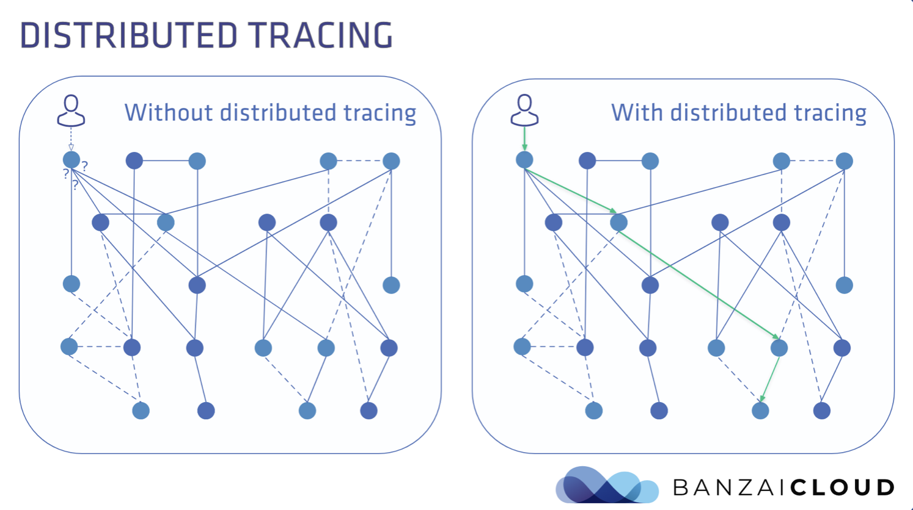


### 1.1.1 The basic idea of Distributed Tracing

- Establish execution time and additional information for each component that runs
- Store the collected information in a DB
- Recombine the relationships between components using the information stored in the DB and display them with a visualization tool

## 1.2 Jaeger?

Jaeger is an open-source distributed tracing system created by Uber in 2015. Jaeger was designed from the start to support the OpenTracing standard. (Standardization means vendor-neutral tracing data modeling.)


### 1.2.1 Tracing Specification

- OpenTracing
    - A CNCF project, currently deprecated
    - OpenTracing provides a vendor-neutral standardized API for sending telemetry data (metrics, logs, traces) to an OpenTracing observability backend server
    - Developers must implement the libraries themselves in accordance with the OpenTracing API standardization
- OpenCensus
    - An open-source community project from Google
    - OpenCensus provides a set of language-specific libraries that allow developers to instrument their applications and send telemetry data to a backend
- OpenTelemetry (OTel)
    - The OpenTracing + OpenCensus projects were merged into one
    - Adopted as a CNCF Incubation project in 2019
    - The project maturity is still at the Incubating level
    - It is a vendor-neutral open-source observability framework for instrumenting, generating, collecting, and exporting telemetry data such as traces, metrics, and logs


### 1.2.2 Reference

- https://opencensus.io/
- https://opentracing.io/
- https://opentelemetry.io/docs/concepts/what-is-opentelemetry/


### 1.2.3 History

- Dapper (Google) : Foundation of all tracers
    - Topics related to tracing started to appear from the 1990s
    - It became mainstream after Google published the paper [Dapper, a Large-Scale Distributed Systems Tracing Infrastructure](https://research.google/pubs/pub36356/) in 2010
- [Zipkin](https://zipkin.io/) and OpenZipkin (Twitter)
    - The first open-source tracing system
    - Released by Twitter in 2012
- [Jaeger](https://www.jaegertracing.io/) (Uber)
    - Created by Uber in 2015 and open-sourced in 2017
    - Adopted as a CNCF Incubation project in September 2017
    - Approved as a Graduated project in 2019
- StackDriver Trace -> [Cloud Trace](https://cloud.google.com/trace?hl=ko) (Google)
- [X-Ray](https://aws.amazon.com/ko/xray/) (AWS)


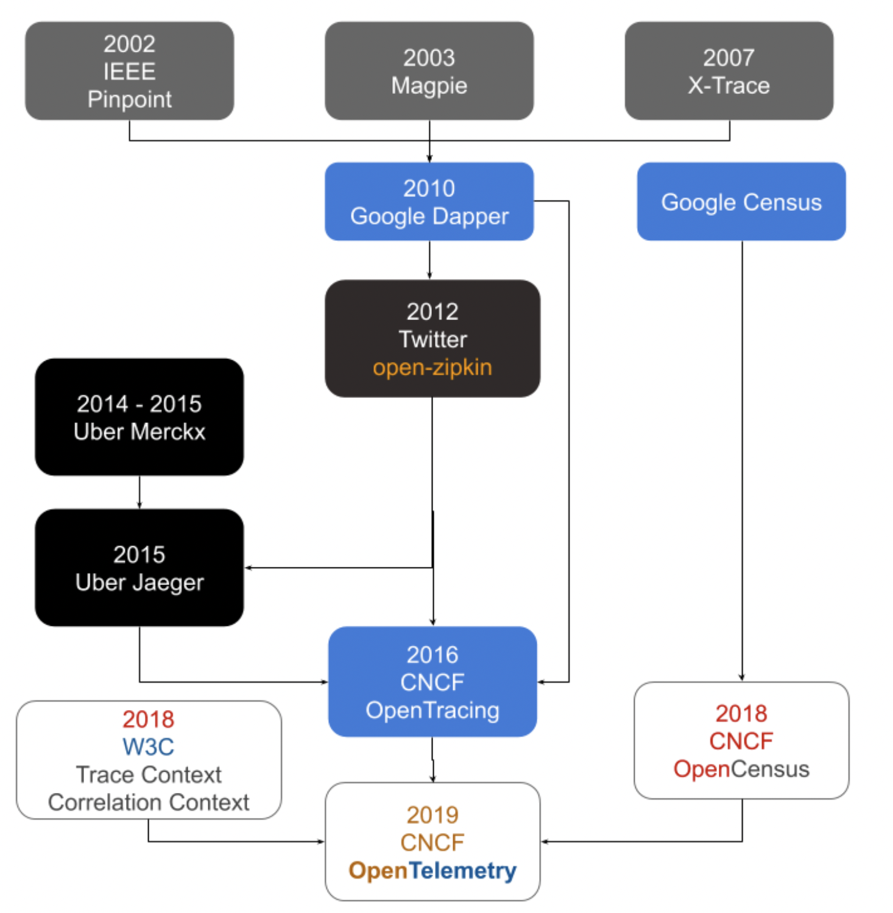


### 1.2.4 Feature

- Designed with High Scalability in mind
    - Supports auto-scaling of the collector

- Supports OpenTracing and OpenTelemetry
    - Designed from the start to support the OpenTracing standard
    - Since v1.35, the Jaeger backend can receive trace data from the OpenTelemetry SDK
- Modern Web UI (built with React)
- Cloud Native Deployment
    - Supports deployment as Jaeger backend Docker images
- Also supports backward compatibility with Zipkin
- Topology Graphs
    - There are two types of service graphs in the Jaeger UI
        - System Architecture, Deep Dependency Graph
- Sampling
    - Supports Adaptive sampling

- Supports multiple storage backends
    - Memory (default), Cassandra, Elasticsearch
- Post-collection data processing pipeline (coming soon)
- Service Performance Monitoring (SPM)

### 1.2.5 Getting familiar with Tracing terminology

#### 1.2.5.1 Span
- The most basic building block in distributed tracing, representing a unit of work executed in a distributed system
    - ex. HTTP request, call to DB
- A Span has the following information
    - Span Name (operation Name)
    - Start/Finish Timestamp
    - Span Tags, Logs (key:value)
    - Span Context : tracing information that distinguishes each Span within a Trace as it is passed from one service to another (ex. Span id, Trace id)

#### 1.2.5.2 Trace
- A Trace represents the data/execution path across the entire system
- It consists of one or more Spans, and multiple Spans come together to complete a single Trace

#### 1.2.5.3 Instrumentation
- Various libraries are provided as open source depending on the application (ex. DB)
- Spans are generated through instrumentation libraries


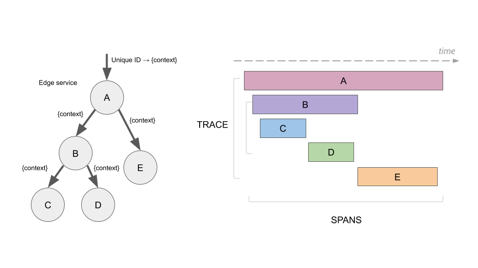

# 2. Jaeger Tracing Architecture

Jaeger consists of several components to collect, store, and display tracing data.

- ~~Jaeger client~~ / OpenTelemetry Distro (SDK)
    - The Jaeger Client is a language-specific implementation of the OpenTracing API for distributed tracing
    - The OpenTelemetry SDK is now used
- Jaeger Agent
    - A network daemon that listens for spans sent over User Datagram Protocol (UDP), deployed on the same host as the instrumented application
- Jaeger Collector
    - Receives Spans and places them in a queue for processing
- Storage Backends
    - A data store that can store Traces
- Jaeger Query
    - The Query service retrieves data from storage and provides the API needed by the UI
- Jaeger UI

## 2.1 Jaeger Architecture

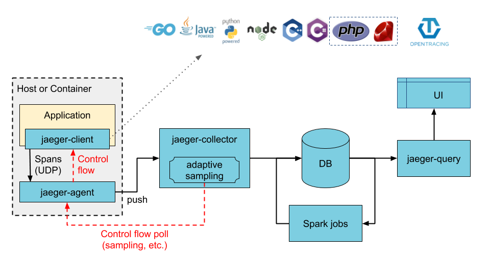


### 2.1.1 Jaeger Architecture w/ Kafka - Intermediate Buffer

- Ingester
    - Kafka can be used as an intermediate buffer between the Collector and the DB
    - The Ingester is responsible for reading data from Kafka and writing it to other storage


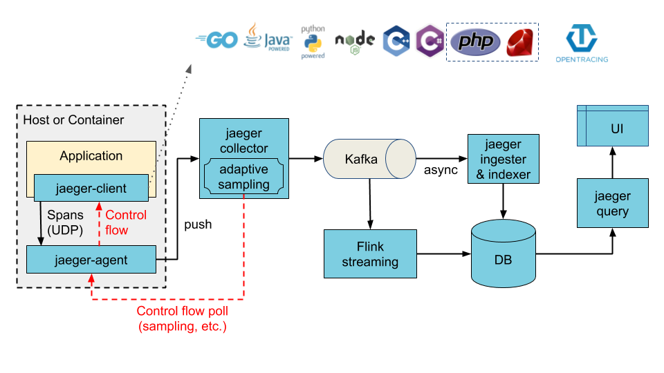


### 2.1.2 Instrumentation

There are two ways to generate a Span

- Auto Instrumentation
    - The OpenTelemetry community has already created libraries for various applications (ex. Redis, MongoDB) and provides them on the registry site
    - https://opentelemetry.io/registry/
- Manual Instrumentation
    - When not provided as open source, you have to manually generate Spans directly in the application during development

### 2.1.3 Sampling

Instead of storing all tracing information raw, sampling is used to reduce the number of traces stored in the backend.

- Head-based sampling
    - A method where the sampling rule is determined at the very front of the jaeger-client
- Tail-based sampling
    - It is called tail-based because sampling is done at the collector
    - It also supports Adaptive sampling (since v1.27), which can automatically adjust sampling based on the traffic and the number of traces coming into the system

# 3. Running Jaeger Docker on Local Machine

## 3.1 Running the Hot R.O.D - Rides on Demand Sample

HotROD is a "ride on demand" demo application provided on the Jaeger GitHub, and it is a version that uses the OpenTracing API. It runs standalone, and multiple microservices run on separate ports to operate in a simple MSA-like form. In this example, no separate instrumentation is used; instead, Spans are generated directly.

### 3.1.1 Running Jaeger

For quick execution, we run it using the all-in-one Docker image that contains all of Jaeger's components.

> In a production environment, if you run with the all-in-one Docker image and the container dies, it becomes a single source of failure and ultimately has a major impact on the production service. For production environments, we recommend deploying as individual components.

```bash
$ docker run -d -p6831:6831/udp -p16686:16686 jaegertracing/all-in-one:latest
```

After the container is running, to access the Jaeger UI, go to this address: http://localhost:16686

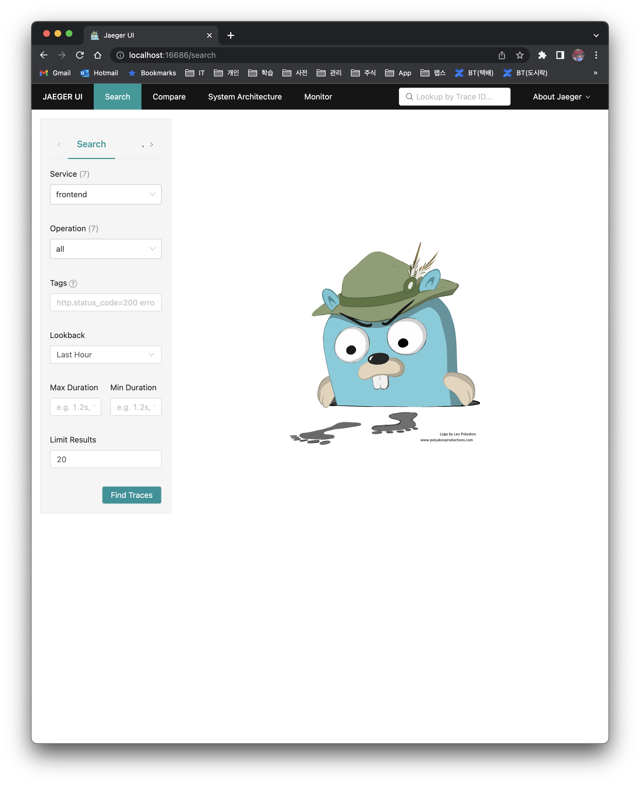

### 3.1.2 Running the Hot R.O.D sample program

The HotROD sample code is written in golang, so you need to install the go toolchain in advance.

Download the source from GitHub and run it.

```bash
$ git clone https://github.com/jaegertracing/jaeger
$ cd jaeger/examples/hotrod
$ go run ./main.go all
```

With the all option, you can run all of HotROD's services at once, and after startup you can access it at http://127.0.0.1:8080.

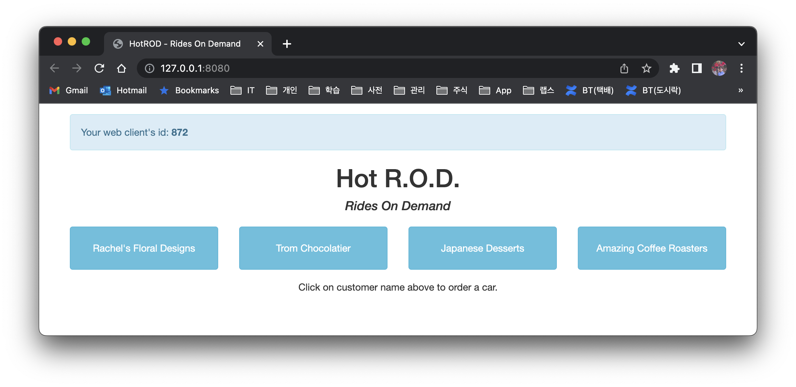

## 3.2 Play around with Jaeger

When you click a button in HotROD to request a ride, you can check the trace for the API in Jaeger.

### 3.2.1 System Architecture > DAG

- On this screen, you can see all the components at a glance

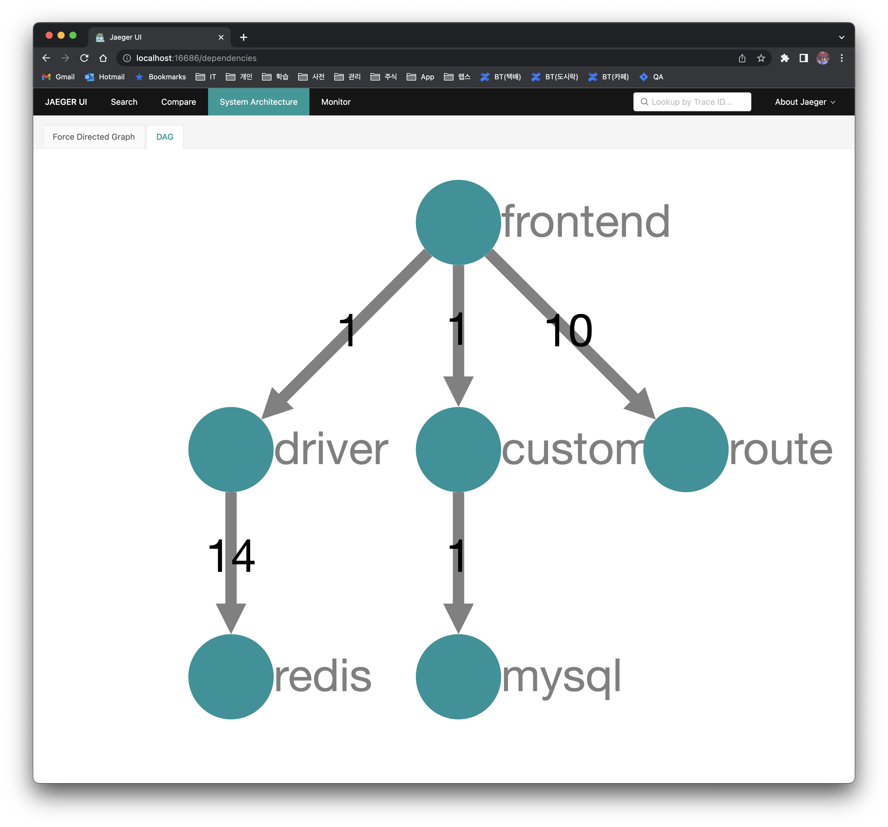

When an error occurs, it is not easy to find which service segment it occurred in using logs.

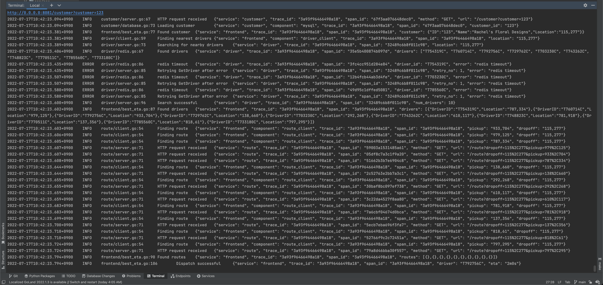


### 3.2.2 Advantages of Jaeger Tracing

- You can easily find which segment a failure occurred in
- You can also easily check which segment has a bottleneck among the various components

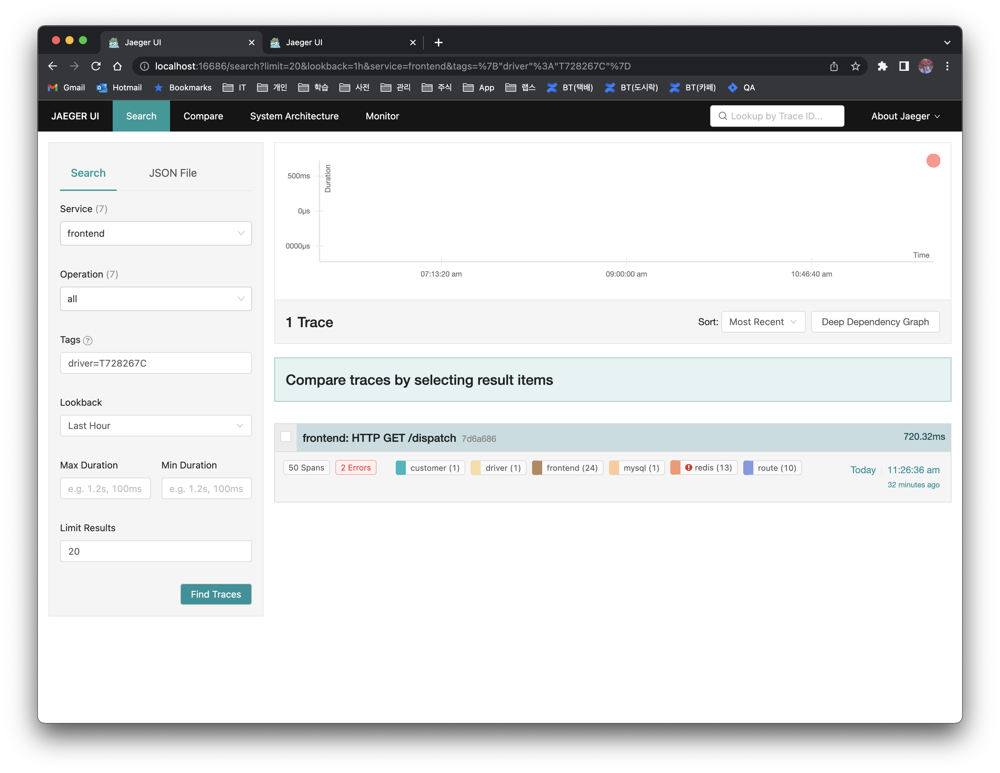

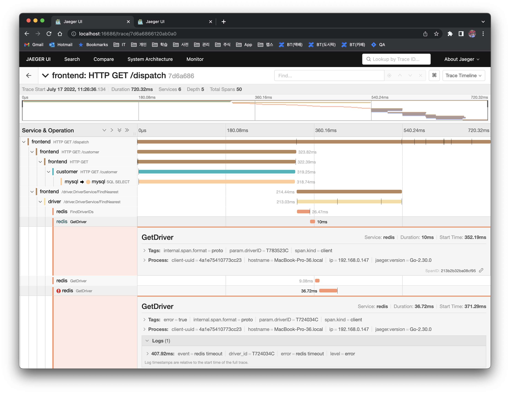

# 4. Sample code using OpenTelemetry - using MongoDB, Gin instrumentation

The HotROD application is a version implemented using the OpenTracing SDK + Manual Instrumentation approach. Let's also look at a version implemented with the SDK based on the latest OpenTelemetry standardization.

When developing a web application, you use various DBs and web frameworks, and instrumentation for these has also been developed as open source, so it can be easily applied to applications.

Looking at the Todo web service written as an example on the Aspecto blog, it uses MongoDB and the Gin web framework. You don't generate Spans directly; you just configure the DB or framework properly.

- Applying to MongoDB

```go
func connectMongo() {
  opts := options.Client()
  //Mongo OpenTelemetry instrumentation
  opts.Monitor = otelmongo.NewMonitor() // that's all it takes
  opts.ApplyURI("mongodb://localhost:27017")
  client, _ = mongo.Connect(context.Background(), opts)
...omitted...
}
```

- Applying to the Gin web framework

```go
r := gin.Default()
  //Gin OpenTelemetry instrumentation
r.Use(otelgin.Middleware("todo-service")) //that's all it takes
```


## 4.1 Reference

- https://medium.com/opentracing/take-opentracing-for-a-hotrod-ride-f6e3141f7941
- https://www.aspecto.io/blog/opentelemetry-go-getting-started/

# 5. Conclusion

> *Frank's inner voice: When there's a problem, I no longer want to look at Kibana logs. Wouldn't it be urgent to introduce an APM/distributed trace system within the team to quickly grasp things at once?*

Since adopting Jaeger ultimately incurs operational management costs, it would be best to use an in-house APM/distributed trace system whenever possible. In our company, Pinpoint is already provided, so it seems good to use that.

> The service is already running in the [1784](https://www.navercorp.com/naver/1784) office building, and there is a lot of work to do both in terms of infrastructure and development, and we are short-handed. If you are interested in robot platform development, please apply.

I learned this for the first time this time, but Pinpoint is also included as a CNCF project.

- https://landscape.cncf.io/?selected=pinpoint

# 6. Terminology

- Observability
    - The concept of Observability was first introduced by the engineer [Rudolf E. Kálmán](https://en.wikipedia.org/wiki/Rudolf_E._K%C3%A1lm%C3%A1n)
    - **"The ability to understand the current state of a system using only its external outputs"**
    - The three pillars of Observability : logs, metrics, traces
- Tag
    - A Tag is a Key:value value defined by the user to query and filter Trace data
    - ex. http.method=GET
    - http.status.code=200
- Telemetry data
    - Telemetry data; there are three types: metrics, logs, and traces


# 7. Reference

- https://www.aspecto.io/blog/jaeger-tracing-the-ultimate-guide/
- https://www.slideshare.net/OracleDeveloperkr/opentracing-jaeger
- https://www.aspecto.io/blog/logging-vs-tracing-why-logs-arent-enough-to-debug-your-microservices/
- https://www.jaegertracing.io/docs/1.36/
- https://www.redhat.com/ko/topics/microservices/what-is-jaeger
- https://twofootdog.tistory.com/67
- https://opentracing.io/docs/
- https://access.redhat.com/documentation/ko-kr/openshift_container_platform/4.9/html/distributed_tracing/_jaeger-architecture
- https://litaro.tistory.com/entry/Jaeger-with-Go
- https://www.elastic.co/kr/blog/distributed-tracing-opentracing-and-elastic-apm
- https://speakerdeck.com/simonz130/distributed-tracing-and-monitoring-with-opentelemetry?slide=26
- https://docs.logz.io/user-guide/distributed-tracing/what-is-tracing
- https://opentelemetry.uptrace.dev/guide/distributed-tracing.html#what-is-tracing
