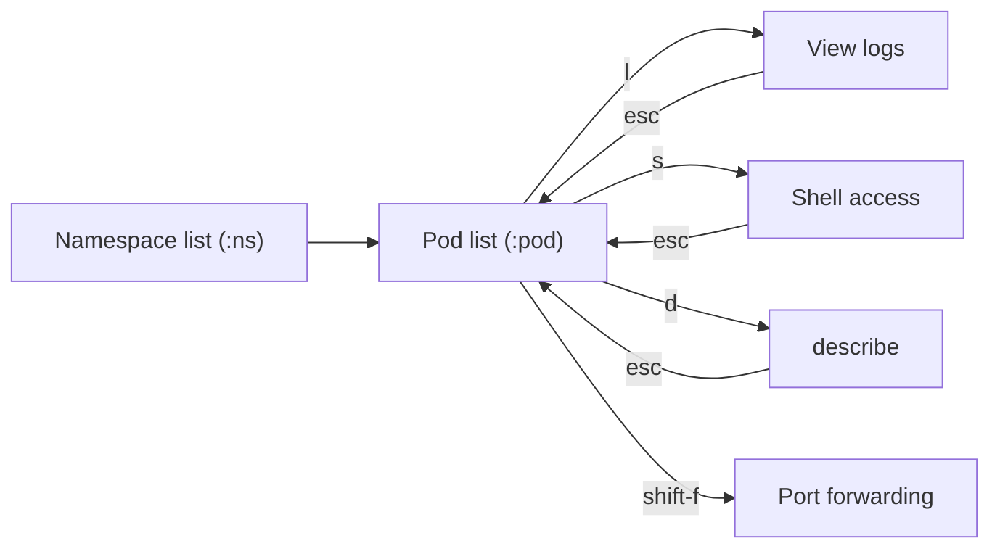
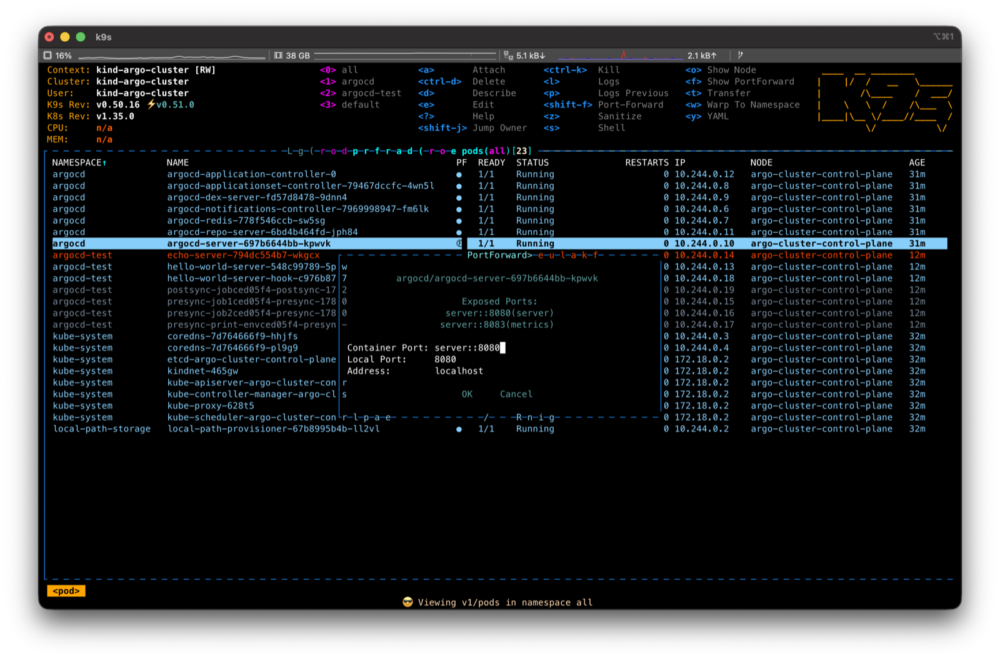

# 1. Introduction — Is kubectl Alone Enough?

If you deploy your own components to Kubernetes, you've probably gotten fairly comfortable with `kubectl`. But in day-to-day operations, when you want to check "Why isn't my Pod coming up?" or "Did the thing I just deployed start correctly?", memorizing and repeatedly typing the `kubectl get` → `describe` → `logs` sequence gets surprisingly tedious.

Picture the flow of checking the logs of a single Pod with `kubectl`.

```bash
kubectl get pods -n my-namespace
# Find the name by eye and copy it
kubectl describe pod my-app-7d9f8b6c4-x2k9p -n my-namespace
kubectl logs my-app-7d9f8b6c4-x2k9p -n my-namespace -f
```

It's fine when nothing is wrong, but fatigue builds up when moments like these keep repeating.

- You have to copy the Pod name hash (`7d9f8b6c4-x2k9p`) every single time
- You forget the namespace (`-n`) and get a "no resources found" message
- The status doesn't update in real time, so you keep re-running `get pods`

`kubectl` is a tool you drive by memorizing and typing commands. k9s, on the other hand, is a tool for exploring your cluster on screen. That difference changes your debugging speed quite a bit.

> To avoid any misunderstanding up front: k9s is not a replacement for `kubectl`. Under the hood it uses the same kubeconfig and API. For scripts and CI, `kubectl` is the right fit; k9s shines when a human is directly inspecting and debugging a cluster.

This article is an introductory guide for developers who can use `kubectl` but are new to k9s. It covers everyday tasks, from install through status checks, logs, shell access, port forwarding, and rollouts, with a focus on keyboard shortcuts.

# 2. What Is k9s?

In a word, k9s is a terminal UI (TUI) for Kubernetes clusters. When you run it, resource lists appear in table form inside your terminal, and you move between them with keyboard shortcuts to view logs or open a shell. The lists auto-refresh in real time, so there's no need to re-type `get pods`.

It doesn't spin up a separate daemon or server. It uses the exact same kubeconfig (context and namespace permissions) that `kubectl` is currently looking at. In other words, any cluster `kubectl` can reach, k9s can reach the same way.

## 2.1 kubectl vs k9s

| Aspect | kubectl | k9s |
|------|---------|-----|
| Interaction | Memorize and type commands | On-screen navigation + shortcuts |
| Status refresh | Re-run the command | Real-time auto-refresh |
| Targeting a Pod | Type the name (hash) directly | Select from the list with the cursor |
| Strength | Scripts, CI, precise control | Fast exploration and debugging |
| Learning cost | Memorize commands and flags | A handful of shortcuts |

Here's the navigation flow as a diagram. From a single screen, a few keystrokes take you deep in and back out.



# 3. Install and First Run

## 3.1 Install

On macOS and Linux, Homebrew is the simplest option.

```bash
brew install k9s
# Check the version
k9s version
```

> On Windows use `scoop install k9s` or `choco install k9s`; for other environments, grab a binary from [GitHub Releases](https://github.com/derailed/k9s/releases).

## 3.2 First Run and Screen Layout

Just type this in your terminal.

```bash
k9s
```

k9s automatically detects and launches with the current context from `~/.kube/config`. The first screen is divided into roughly three areas.

- **Top (header)**: Information about "where am I looking right now": current context, cluster, namespace, k9s version, and so on. It's a good habit to confirm the context is correct here before you start debugging
- **Center (resource list)**: The main area where resources like Pods and Deployments are shown in a table. Colors differ by status
- **Bottom / top-right (shortcut hints)**: The shortcuts available on the current screen are always displayed. No need to memorize them; just look at the screen


# 4. Learning the Basic Controls

The core of operating k9s comes down to just three keys: `:` (command), `/` (filter), and `?` (help). Once you know these, you can follow the on-screen hints for the rest.

## 4.1 Command Mode (`:`)

Press `:` and a command input box appears at the bottom. Type the kind of resource you want to see and press Enter to jump to that list. It's the same idea as `kubectl get <resource>`.

```text
:pod      → Pod list
:deploy   → Deployment list
:svc      → Service list
:ns       → Namespace list
:ctx      → Context list (switching)
```

It accepts singular, plural, abbreviated, and alias forms. `:pod`, `:pods`, and `:po` all work.

## 4.2 Filter (`/`)

When a list is long, press `/` and type a search term to filter in real time. For example, typing `/my-app` leaves only items whose name contains `my-app`.

```text
/my-app        → Names containing my-app
/!Running      → Only those 'not' Running (inverse filter)
/-l app=web    → Filter by label selector
```

The inverse filter (`/!Running`) is especially handy when you want to quickly narrow down to just the problem Pods.

## 4.3 Switching Namespaces and Contexts

What you'd do with the `-n` flag and `kubectl config use-context` in `kubectl`, you do in k9s by switching screens.

- **Switch namespace**: `:ns` → select the namespace you want from the list. From then on every screen is scoped to that namespace. (`0` is all namespaces)
- **Switch context**: `:ctx` → select from the list of clusters (contexts). Use this when moving between production and staging clusters

## 4.4 Help and Getting Out

- `?` : View all shortcuts available on the current screen
- `Esc` : Go back one step (clear the filter, return to the previous screen)
- `:q` or `Ctrl-c` : Quit k9s

If you get lost, pressing `Esc` a few times brings you back to the list screen. When you're stuck, press `?`. Remember just these two keys and you can poke around freely without worry.

# 5. In Practice: Everyday Tasks

This is the part you'll actually use most often. Common premise: after entering the Pod list with `:pod`, place the cursor on the target Pod with the arrow keys or `j`/`k`, then press the shortcuts below.

## 5.1 Checking Pod Status and Finding Problem Pods

In the Pod list, status is distinguished by color. You can tell healthy from unhealthy at a glance.

- Cyan: healthy (Running, Completed)
- Orange: in progress / waiting (Pending, ContainerCreating, etc.)
- Red: problem (CrashLoopBackOff, Error, ImagePullBackOff, etc.)

The `STATUS` and `RESTARTS` columns give you clues about what's wrong. If the restart count keeps climbing, suspect a CrashLoop. To see detailed events, press `d` (describe) on the Pod. It shows the same content as `kubectl describe pod ...`.


## 5.2 Viewing Logs in Real Time

Press `l` on the target Pod to enter the log screen. Real-time tail (auto-scroll) is on by default. The keys you use on the log screen are as follows.

| Key | Action |
|----|------|
| `l` | View logs (enter) |
| `p` | Previous container logs (essential for tracing the cause of a crashed container) |
| `0` | Full logs from the beginning |
| `1`~`5` | Only the last N minutes of logs |
| `f` | Toggle full screen |
| `w` | Toggle line wrap |
| `c` | Clear the screen |
| `Esc` | Exit the log screen |

When a container dies and restarts, as with CrashLoopBackOff, the current container's logs may not reveal the cause. In that case, `p` (previous container logs) gives the decisive clue.


## 5.3 Getting Inside a Pod (shell)

Press `s` on the target Pod to open a shell inside the container. It replaces `kubectl exec -it ... -- sh`. Use it to inspect files inside the container or directly check environment variables (`env`) and networking (`curl`). To leave, type `exit`.

> If a Pod has multiple containers, first press Enter on the Pod to go into the container list, then select the target container and press `s`.

## 5.4 Restarting / Deleting a Pod

k9s has no button to directly "restart" a Pod. Instead, when you delete a Pod, the controller (Deployment/ReplicaSet) automatically brings up a new one. That is effectively a restart.

- `Ctrl-d` : Delete (a confirmation dialog appears; confirm with `Tab`+`Enter`)
- `Ctrl-k` : Immediate force delete (no confirmation; be careful)

This is the fastest way when you want to bring up just one specific Pod fresh. If you want to restart many Pods at once with no downtime, use the Deployment rollout restart in the next section.

## 5.5 Port Forwarding

When you want to connect directly to a service inside the cluster from your local machine, use port forwarding. Press `Shift-f` on the target Pod (or container) and the forwarding setup box appears. Specify the local port and the container port, and you can connect at `localhost:<port>`.

You can view and release the currently active port forwards with `:pf` (or `:portforward`). It amounts to managing inside k9s what you used to keep running as `kubectl port-forward` in a separate terminal.




## 5.6 Deployment Scaling and Rollouts

Once you enter the Deployment list with `:deploy`, you can use shortcuts different from the Pod view (always visible at the bottom of the screen).

- `s` : Adjust scale (change the replica count). Use it to respond to traffic or to pause (set to 0)
- `r` : Rollout restart (equivalent to `kubectl rollout restart`). Use it to bring up all Pods anew with no downtime after a config/secret change
- `d` : Check rollout status and events with describe
- `Enter` : Drill down into the Pods managed by this Deployment

To confirm a change you just deployed has been applied, enter the Pod list from the Deployment with `Enter` and watch in real time as new Pods turn Cyan and reach `Running`.


## 5.7 Checking Resource Usage

You can see actual usage in the `CPU` and `MEM` columns of the `:pod` list (they only show up if metrics-server is installed in the cluster). To look at it per node, go to `:node` and check each node's CPU and memory utilization. This screen is useful when you suspect a particular Pod is eating too much memory and dying from OOM.

# 6. Good Tips to Know

## 6.1 Cheat Sheet of Frequently Used Shortcuts

At first, just keeping this table beside you is enough.

| Category | Key | Action |
|------|----|------|
| Navigate | `:pod` `:deploy` `:svc` | Go to a resource list |
| Navigate | `:ns` `:ctx` | Switch namespace / context |
| Explore | `/` | Filter the list |
| Explore | `?` | Shortcut help |
| Explore | `Esc` | Back / clear filter |
| Action | `d` | describe |
| Action | `l` / `p` | Logs / previous container logs |
| Action | `s` | Shell access (Pod) / scale (Deployment) |
| Action | `y` / `e` | View / edit YAML |
| Action | `Shift-f` | Port forwarding |
| Action | `r` | Rollout restart (Deployment) |
| Danger | `Ctrl-d` / `Ctrl-k` | Delete / force delete |
| Quit | `:q` | Quit k9s |

## 6.2 Read-Only Mode and a Note on Permissions

Because k9s lets you delete, edit, and scale right from the screen, mistakes can be dangerous on a production cluster before you're used to it. Keep two things in mind.

- **Read-only mode**: Running with `k9s --readonly` disables changing operations like delete and edit. It's safe when you only want to look at a production cluster
- **Permissions follow your kubeconfig**: What k9s can do is ultimately within the RBAC permission scope of the current context. If you don't have permission, k9s is blocked too

Beyond this, you can customize the skin (theme), default namespace, columns, and more via the configuration under `~/.config/k9s/`. The defaults are enough at first, so leave it until you're comfortable.

# 7. Wrapping Up

k9s is not a tool for throwing away `kubectl`. It's a tool that makes the work of a human inspecting and debugging a cluster faster.

At first, knowing just `:` (navigate), `/` (filter), `?` (help), `Esc` (back), plus `l` (logs), `s` (shell), and `d` (describe) is enough. The remaining shortcuts are always shown at the bottom of the screen, so they'll come naturally as you use them. Today, try entering the namespace where your own components are running with `k9s`.

# 8. References

- [k9s official site](https://k9scli.io/)
- [k9s GitHub (derailed/k9s)](https://github.com/derailed/k9s)
- [k9s Commands docs](https://k9scli.io/topics/commands/)
