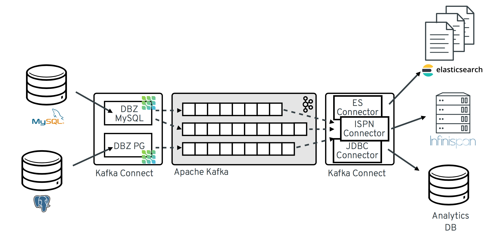
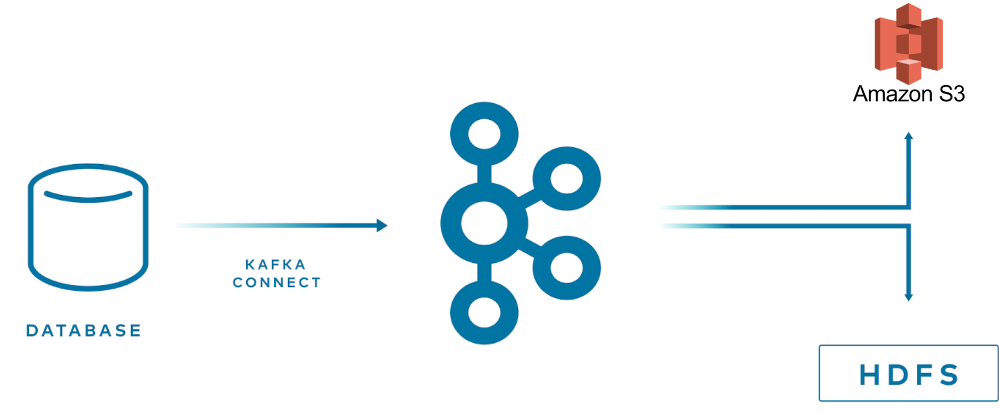
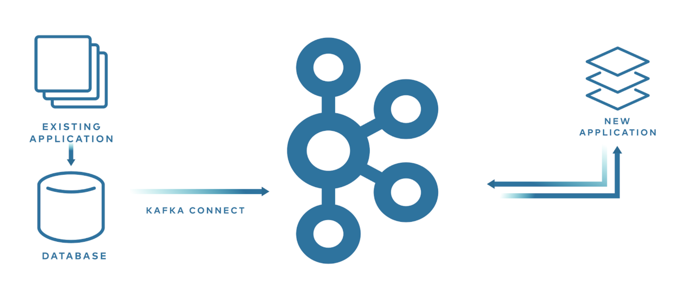
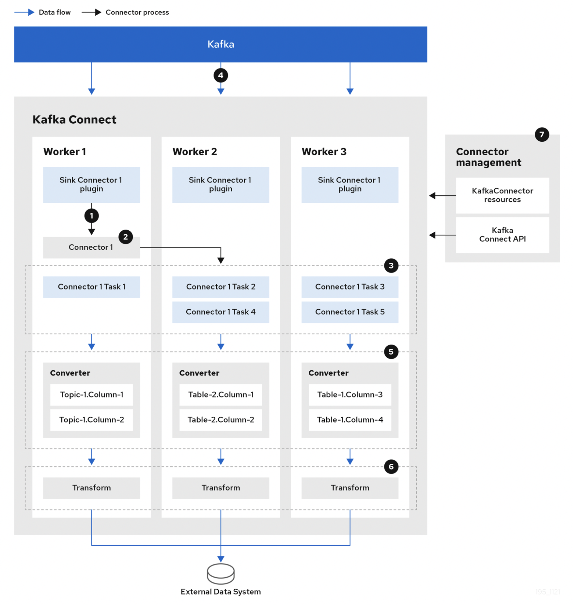
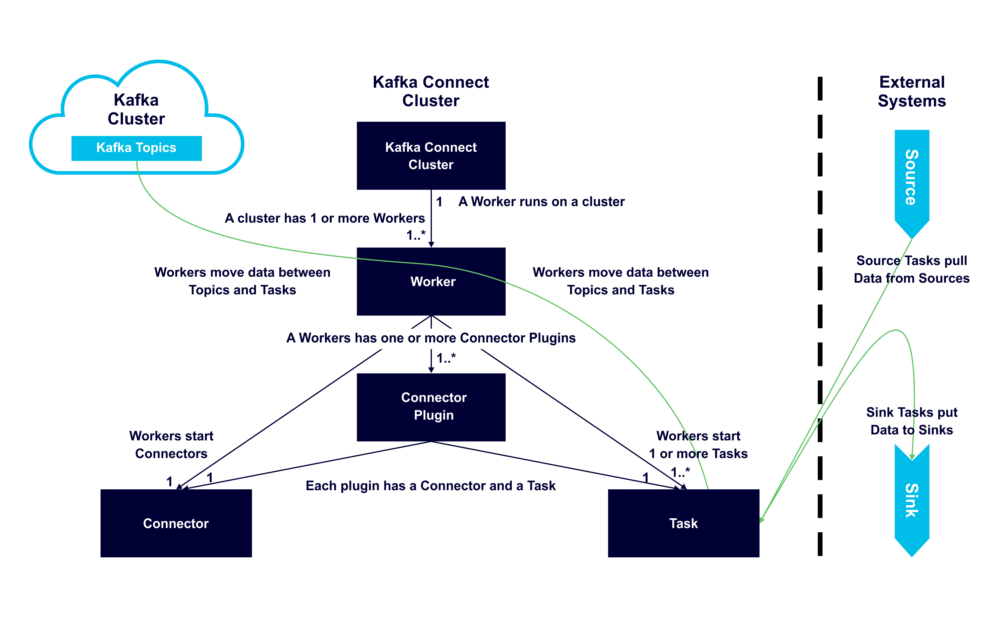
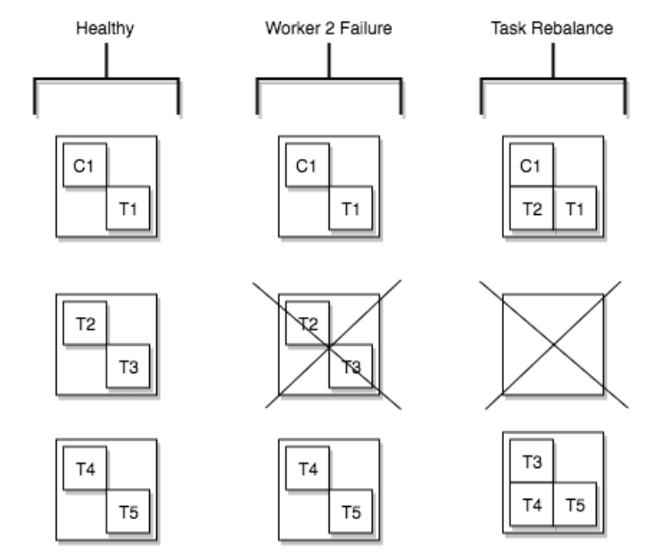
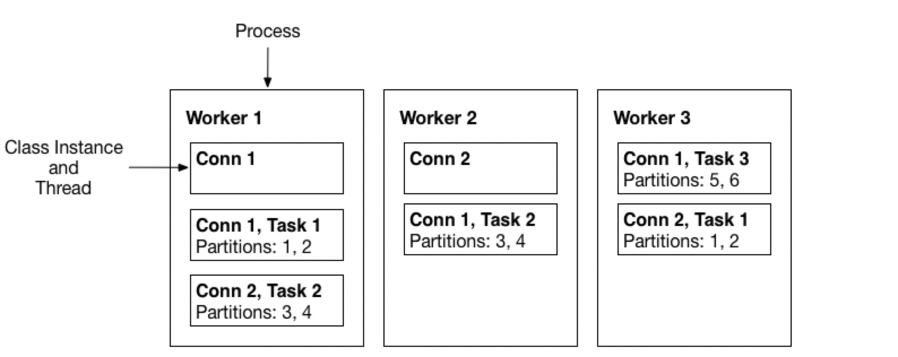

# 1. Introduction to Kafka Connect

If you are considering using Kafka Connect, I assume you already know Kafka well and have looked into it, so I'll mention Kafka only briefly and move straight on to introducing Kafka Connect.

> Apache Kafka is an **open-source message broker** project developed in Scala by the Apache Software Foundation. ...
> In short, it can be defined as a highly scalable **pub/sub message queue built on a distributed transaction log, providing high-value features for enterprise infrastructure that processes streaming data**.
>
> From [Wikipedia](https://ko.wikipedia.org/wiki/%EC%95%84%ED%8C%8C%EC%B9%98_%EC%B9%B4%ED%94%84%EC%B9%B4)

Kafka is one of many message broker projects, and like other projects it is a distributed message queue system that supports the pub-sub model. It was first developed at [LinkedIn](https://www.linkedin.com/feed/), open-sourced and released in early 2011, and at the end of 2014 the developers who built Kafka founded a new company called Confluent to focus on Kafka development.

Let's look at the role Kafka Connect plays within the Kafka ecosystem.

## 1.1 Kafka Connect

Kafka Connect is an open-source framework for exchanging data between Kafka and other systems. It provides various built-in Connectors (e.g. mongo) that help connect to existing systems and exchange data with Kafka. The characteristics and advantages of Kafka Connect are as follows.

- For repetitive pipeline creation tasks, developing, deploying, and operating producer/consumer applications every single time is inefficient
- Using Connectors, you can reduce repetitive work by running a Connector that has been templated for a specific type of task
    - This lets you focus solely on business logic and also simplifies the internal system code
- There are two types of Connectors
    - A Source Connector is a Connector that brings data from an external system into Kafka (External System -> Kafka)

    - A Sink Connector is a Connector that pulls data out of Kafka and puts it into an external system (Kafka -> External System)
- A wide variety of Connectors exist (e.g. open-source, paid), and developers can also build the Connectors they want themselves
    - MongoDB, JDBC, Redis, HTTP, S3, Elasticsearch, AWS Lambda, etc
    - [Connector list](https://www.confluent.io/product/connectors/?utm_medium=sem&utm_source=google&utm_campaign=ch.sem_br.nonbrand_tp.prs_tgt.kafka-connectors_mt.mbm_rgn.apac_lng.eng_dv.all_con.kafka-connectors&utm_term=%2Bkafka+%2Bconnector&placement=&device=c&creative=&gclid=CjwKCAjwopWSBhB6EiwAjxmqDQK_IP1BwHGk2QuxnbEMBpLSzpELe-SxeCH5U_kd8VdmaM22beSGTBoC4yEQAvD_BwE)
    - [Confluent Hub](https://www.confluent.io/hub/?_ga=2.105942858.818878415.1648561146-1727219079.1644563166&_gac=1.183425876.1648562015.Cj0KCQjw3IqSBhCoARIsAMBkTb3IVhJSR686GZrLNaiMPSNYbde-qKWCTOL8TR0_Hdew4qqm6MDPY4saAv1kEALw_wcB) - Connector App Store

## 1.2 Kafka Connect Usecase

There are many ways to stream data from another system into Kafka and from Kafka into another system, but rather than building it yourself, it's worth first considering whether Kafka Connect can solve it easily. Let's look at a few examples of how it can be used in various ways.

### 1.2.1 Streaming to multiple target systems

With Kafka Connect, connectors are already provided for many target systems, so you can easily stream data stored in Kafka. Business needs may require a new target system, and Kafka Connect lets you move quickly into the development phase.

- kafka -> (kafka connect) -> multiple targets (s3, hdfs)

### 1.2.2 When data needs to be delivered from various external systems to other places

There are several ways to deliver data from one component to another.

- A component -> db (ex. mysql) -> (mysql sink connect) -> kafka -> B component (consume)

    - An admin-type component stores configuration values in mysql
    - When these values need to be used by another component, you can register a mysql source connector to easily deliver them to the other component

- A component (exposes http API) -> (http source connect) -> kafka -> (mongo sink connector) -> db (ex.mongo) -> B component

    - B component is an application that can read/write to mongodb, but depending on A component's role and domain, accessing the db directly may be inappropriate, so it is developed in an event-based manner using kafka

    - A component could write to kafka directly, but by exposing an http API and using an http source connector to deliver to kafka, then using a mongo sink connector to put it into the db, data can be delivered to B component without additional development in each component

### 1.2.3 Migrating to a new application

- db(ex. mysql) -> (mysql sink connect) -> kafka -> new application (consume)

When developing a new application, using Kafka Connect can make migration easier without affecting the existing application. MySQL and MongoDB support Change Data Capture (CDC), so using the corresponding sink connector lets you capture changes for schema changes as well as INSERT, UPDATE, and DELETE, and stream the data into Kafka. This way you can develop a new application without modifying the existing application at all.

# 2. Internal Components and How It Works

Kafka Connect is broadly made up of five elements.

- Worker
    - A process that runs Connectors and tasks
    - The Worker is responsible for handling REST API requests
        - It handles registering, configuring, starting, and stopping Connectors
    - It supports two modes
        - standalone: a single process runs the connector and task
        - distributed
            - Distributed mode provides Kafka Connect's scalability and automatic fault tolerance
            - It can run across multiple worker processes
- Connector
    - A Connector is an abstract object for a pipeline and is responsible for managing Tasks
        - Determining the number of tasks to run and dividing work among Tasks
        - Fetching configuration values for Tasks from the Worker and passing them to the Tasks
    - The actual Worker drives the Tasks
- Task
    - Does the work of pulling data from or pushing data into Kafka, and is the actual element that runs the pipeline
    - A Source Task polls data from the source system, and the worker sends the fetched data to a Kafka topic
    - A Sink Task pulls records from Kafka through the Worker and writes the records to the sink system
    - It also provides a Task Rebalancing feature
- Converter
    - When the Worker receives data, it uses a converter to transform the data into the appropriate format
- Transform
    - Responsible for transforming each message that flows through the Connector

## 2.1 How Kafka Streams Data

The following Sink Connector shows the flow when streaming data from Kafka to an external system. A Source Connector is the reverse, streaming from an external system into Kafka, but the basic data streaming process is similar.

1. Plugins provide the implementation artifacts of connectors and tasks that are deployed to each worker
2. The Worker starts connector instances
3. The Connector creates tasks to process data
4. Tasks run in parallel to poll Kafka and return records
5. The Converter transforms records into a format suitable for the external system
6. The Transform performs transformation work such as filtering and renaming on records according to the defined transformation configuration

Some of this has already been mentioned above, but the following diagram helps you easily understand each component, the relationships between them, and their roles.

- One or more Workers run on a server
- A Worker has one or more Connector Plugins
    - Each plugin has a connector and a task
- The Worker moves data between topics and tasks
- The Worker starts connectors and tasks

## 2.1 Task Rebalancing

Task rebalancing occurs to redistribute work among workers when a new worker is added or a worker is forcibly terminated. The cases in which task rebalancing happens are as follows.

1. When a new connector is registered in the cluster
    - All connectors and tasks are rebalanced so that each worker holds an equal amount of tasks
2. Task rebalancing happens when you change the configured number of tasks or change connector configuration values
3. When a single worker fails
    - The failed worker's tasks are reassigned to active workers, but the failed task is not automatically restarted and must be restarted manually via the API

Worker 2's process died, so the T2 and T3 tasks it was running were rebalanced to the remaining workers.

## 2.2 Workers

A Worker is a process that runs connectors and tasks, and can be run in two modes.

- Standalone Mode
    - A single process runs the connector and task
    - Mainly used for development or testing on a local machine
    - Does not support fault tolerance
- Distributed Mode
    - It can run across multiple processes, and in distributed mode it inherently supports scalability and fault tolerance
    - Mainly used in production systems
    - Started with the same `group.id`, it automatically runs by coordinating connectors and tasks well across all available workers

## 2.3 Converters

Several converters are provided to support specific data formats when writing to and reading from Kafka. A Task uses a converter to convert the bytes data format into Connect's internal data format.

- AvroConverter
    - `io.confluent.connect.avro.AvroConverter`: uses Schema Registry (O)
- ProtobufConverter
    - `io.confluent.connect.protobuf.ProtobufConverter`: uses Schema Registry (O)
- JsonSchemaConverter
    - `io.confluent.connect.json.JsonSchemaConverter`: uses Schema Registry (O)
- JsonConverter
    - `org.apache.kafka.connect.json.JsonConverter` (does not use Schema Registry): Json data
- StringConverter
    - `org.apache.kafka.connect.storage.StringConverter`: string data
- ByteArrayConverter
    - `org.apache.kafka.connect.converters.ByteArrayConverter`: provides a no-conversion option

## 2.4 Transforms

A Transform transforms existing data in the process of fetching and inserting data between Kafka <-> an external system. You configure how to transform when registering a Connector. A Transform is a simple transformation operation that takes a single record as input and returns the modified record as the result. If there are multiple transforms, they run as a pipeline.

The commonly used transforms are already included in Kafka Connect by default, but users can also create and use their own transform implementations.

- Renaming a field
- Deleting a field, adding a new field
- Changing to a different value (ex. id -> _id)

By default, a Transform processes a single message and is used for simple transformations. For more complex transformations or multi-message processing, I recommend using [ksqlDB](https://docs.confluent.io/platform/current/ksqldb/index.html#ksql-home) or [Kafka Streams](https://docs.confluent.io/platform/current/streams/index.html#kafka-streams).

# 3. Conclusion

Using Kafka Connect lets you eliminate much of the work that applications would otherwise have to develop repeatedly, which naturally gives you the advantage of being able to focus on business logic. If you are developing based on an Event Driven Architecture, I recommend adopting Kafka Connect.

In this post, we briefly looked at what the components are and how data streaming processing works. In the next post, I'll cover an example of registering a Kafka Connector in a local environment and fetching and inserting data between Kafka <-> an external system.

# 4. References

- https://en.wikipedia.org/wiki/Apache_Kafka
- https://www.confluent.io/ko-kr/blog/kafka-connect-deep-dive-error-handling-dead-letter-queues/
- https://www.kai-waehner.de/blog/2020/10/20/apache-kafka-event-streaming-use-cases-architectures-examples-real-world-across-industries/
- https://www.baeldung.com/kafka-connectors-guide
- https://docs.confluent.io/platform/current/connect/index.html
- https://strimzi.io/docs/operators/latest/overview.html
- https://www.confluent.io/blog/kafka-connect-tutorial/
- https://www.instaclustr.com/blog/apache-kafka-connect-architecture-overview/
