# 1. What

ksqlDB (formerly Kafka SQL, KSQL) is a streaming SQL engine for Kafka. Because it provides a SQL interface, it helps developers easily perform streaming processing on Kafka using familiar SQL syntax. The features that ksqlDB provides are as follows.

## 1.1 Feature

- Enables real-time streaming processing in a way similar to how you access a relational database, through familiar and lightweight SQL syntax
- ksqlDB is designed to be fault-tolerant and scalable
- Provides the ability to manage Kafka Connect within ksqlDB
- Supports a wide range of functions for streaming operations, including data filtering, transformation, aggregation, joins, windowing, and sessionization
    - ex. `SUM`, `COUNT`, `UCASE`, `REPLACE`, `TRIM`
- Also supports implementing KSQL user-defined functions
    - Lambda functions are supported as well


References

- https://docs.ksqldb.io/en/latest/developer-guide/ksqldb-reference/functions/
- https://docs.confluent.io/5.4.0/ksql/docs/developer-guide/udf.html
- https://docs.ksqldb.io/en/latest/how-to-guides/use-lambda-functions/


## 1.2 ksqlDB Architecture

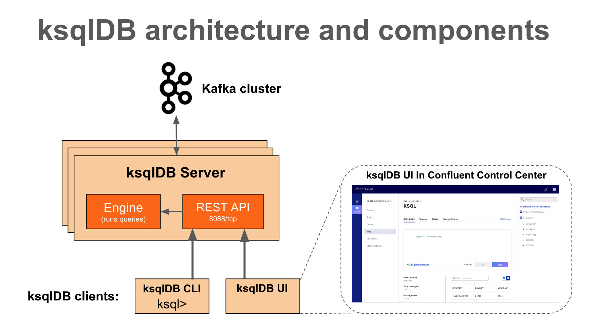

**ksqlDB client**

- ksqlDB CLI
    - Provides a command interface (CLI) console similar to MySQL or PostgreSQL
- ksqlDB UI
    - Control Center (the paid version) is a GUI that lets you manage and monitor major components—including Kafka clusters, brokers, topics, Connectors, and ksqlDB—in one place

**REST Interface**

- Helps the ksqlDB client access the ksqlDB Engine

**ksqlDB Engine**

- Executes KSQL statements and queries
- Users define application logic with KSQL statements, and the engine parses and builds the KSQL statements and runs them on the KSQL server
- Each KSQL server runs a KSQL engine as an instance
- The engine uses RocksDB as its internal state store
    - ksqlDB uses RocksDB to store Materialized Views locally on disk
    - RocksDB is a fast embedded key-value store provided as a library

> "RocksDB is an open-source database development project started at Facebook. It is suitable for processing large volumes of data such as server workloads and is optimized to deliver high performance on fast storage devices, especially flash storage."


References

- https://docs.confluent.io/5.4.3/ksql/docs/index.html
- https://docs.ksqldb.io/en/latest/operate-and-deploy/how-it-works/
- https://www.confluent.io/blog/ksql-streaming-sql-for-apache-kafka/
- https://docs.ksqldb.io/en/latest/tutorials/event-driven-microservice/
- https://github.com/confluentinc/ksql
- https://docs.ksqldb.io/en/latest/operate-and-deploy/how-it-works/
- https://www.confluent.io/blog/ksqldb-architecture-and-advanced-features/
- https://www.confluent.io/blog/ksqldb-pull-queries-high-availability/?_ga=2.35560801.1998071110.1666397521-1519298907.1666271761
- https://www.confluent.io/blog/how-to-tune-rocksdb-kafka-streams-state-stores-performance/
- https://www.datanami.com/2019/11/20/confluent-reveals-ksqldb-a-streaming-database-built-on-kafka/
- https://meeeejin.gitbooks.io/rocksdb-wiki-kr/content/overview.html
- https://cwiki.apache.org/confluence/display/KAFKA/Kafka+Streams+Internal+Data+Management
- https://stackoverflow.com/questions/58621917/ksql-query-and-tables-storage

# 2. Why

Let's look at why ksqlDB is worth using.

## 2.1 Three Approaches to Kafka Stream Processing

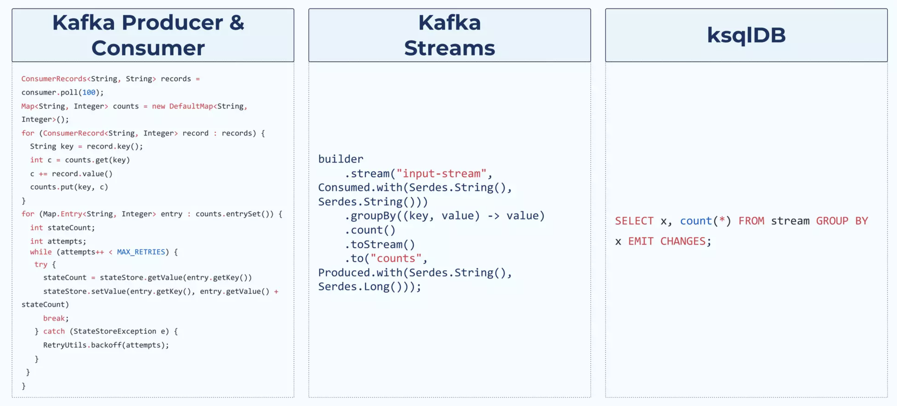

## 2.2 ksqlDB vs Kafka Streams

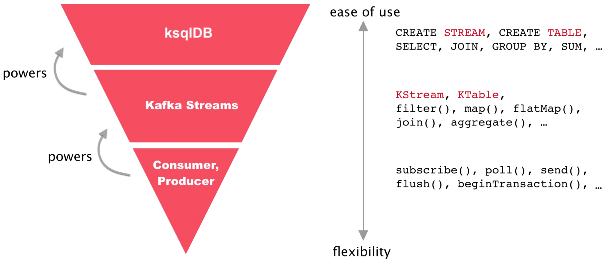

- ksqlDB
    - Built on top of the Kafka Streams library
    - You can interactively check streaming processing right away through the KSQL CLI
    - You can quickly try streaming processing using familiar SQL syntax
- Kafka Streams
    - A library that helps you perform Kafka-based streaming processing
    - When you need more complex streaming processing, using Kafka Streams may be a better choice
    - Compared to ksqlDB, it requires more learning and a deeper understanding of and experience with the library

References

- https://engineering.linecorp.com/ko/blog/applying-kafka-streams-for-internal-message-delivery-pipeline/
- https://yooloo.tistory.com/m/115
- https://developer.confluent.io/tutorials/transform-a-stream-of-events/kafka.html#create-the-code-that-does-the-transformation
- https://laredoute.io/blog/why-how-and-when-to-use-ksql/
- https://www.slideshare.net/ConfluentInc/ksqldb-253336471


# 3. Who

ksqlDB has been developed by Confluent since 2017.

## 3.1 History

**Kafka**

- Created in 2010 at LinkedIn to solve issues occurring within the company
- First released to the world as open source in 2011 as Apache Kafka
- Confluent was founded in 2014
    - The co-creators of Kafka left LinkedIn to start a new company

**Kafka Connect**

- Included in the Kafka 0.9.0.0 release in 2015

**Kafka Stream**

- Included in the Kafka 0.10.0.0 release in 2016

**ksqlDB**
- Released in 2017 as the KSQL Developer Preview
- Renamed in 2019 from KSQL (Kafka SQL) to ksqlDB as part of a rebranding


References

- https://docs.ksqldb.io/en/latest/operate-and-deploy/changelog/?_ga=2.211885267.679177078.1665747634-256754440.1665501546&_gac=1.60161119.1665905457.Cj0KCQjw166aBhDEARIsAMEyZh6DZ-g9fEdHzNf4ywXk1Oj2Q93_PLdfgAe_phLu9UaUpztGK_aOoFYaAsqyEALw_wcB
- https://docs.confluent.io/platform/current/installation/versions-interoperability.html#ksqldb
- https://dbdb.io/db/ksqldb
- https://www.buesing.dev/post/kafka-versions/
- https://www.linkedin.com/pulse/kafkas-origin-story-linkedin-tanvir-ahmed/


# 4. Where

Many companies officially use ksqlDB, as shown below. In Korea, LINE reportedly improved its AB Test Report system using ksqlDB.

- Naver LINE
    - [AB Test Report](https://velog.io/@anjinwoong/Line-Developer-Day-2021-KSETL%EB%A1%9C-Kafka-%EC%8A%A4%ED%8A%B8%EB%A6%BC-ETL-%EC%8B%9C%EC%8A%A4%ED%85%9C%EC%9D%84-%EB%B9%A0%EB%A5%B4%EA%B2%8C-%EA%B5%AC%EC%84%B1%ED%95%98%EA%B8%B0)
    - In the previous system architecture, event logs stored in Redis were fetched to implement a join window
    - Using ksqlDB simplified the architecture (join two streams without redis)
- [ticketmaster](https://www.ticketmaster.com/) - a ticket-selling company
- [Nuuly](https://www.nuuly.com/) - a clothing rental and resale service
- [ACERTUS](https://acertusdelivers.com/) - a vehicle pickup/delivery service
- [optimove](https://www.optimove.com/) - a private company that develops and sells CRM marketing software (w/ AI) as a service
- [Bosch](https://www.bosch.com/): a leading company in automotive and industrial technology, consumer goods, and building technology
- [Voicebridge](https://voicebridge.io/): voice-based systems for rural populations in developing countries that lack internet access

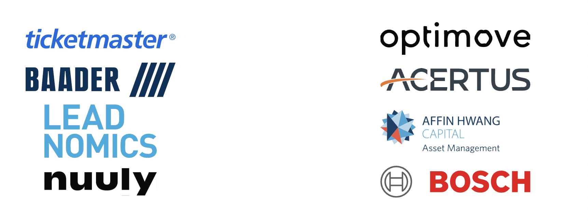

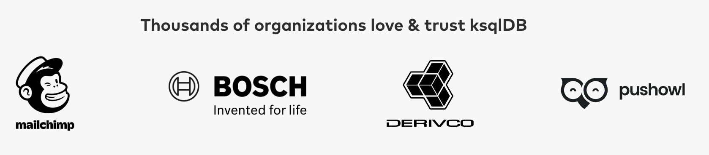

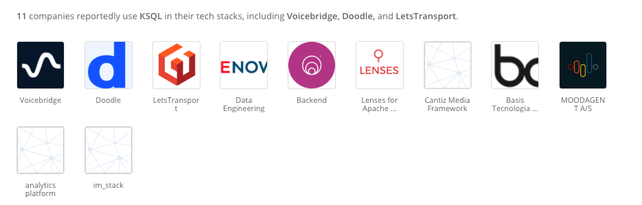

References

- https://stackshare.io/ksql
- https://ksqldb.io/
- https://www.confluent.io/ko-kr/product/ksqldb/

# 5. How

## 5.1 Installation on local-machine

To easily run the various Kafka components in a local environment, we run them with `docker-compose`. First, download the `docker-compose.yml` file.

```bash
$ curl --output docker-compose.yml \
  https://raw.githubusercontent.com/kenshin579/tutorials-go/master/kafka/confluent/docker-compose.yml
```

Start the Confluent Platform stack.

```bash
$ docker-compose up -d
```

Start the KSQL Interactive CLI

```bash
$ docker exec -it ksqldb-cli ksql http://ksqldb-server:8088
OpenJDK 64-Bit Server VM warning: Option UseConcMarkSweepGC was deprecated in version 9.0 and will likely be removed in a future release.

                  ===========================================
                  =       _              _ ____  ____       =
                  =      | | _____  __ _| |  _ \| __ )      =
                  =      | |/ / __|/ _` | | | | |  _ \      =
                  =      |   <\__ \ (_| | | |_| | |_) |     =
                  =      |_|\_\___/\__, |_|____/|____/      =
                  =                   |_|                   =
                  =        The Database purpose-built       =
                  =        for stream processing apps       =
                  ===========================================

Copyright 2017-2022 Confluent Inc.

CLI v7.2.2, Server v7.2.2 located at http://ksqldb-server:8088
Server Status: RUNNING

Having trouble? Type 'help' (case-insensitive) for a rundown of how things work!

ksql>
```

## 5.2 KSQL Usage

Let's learn a bit more about ksqlDB through examples.

## 5.3 Collections : Stream vs Table

### 5.3.1 Stream

- A persistent, unbounded collection of streaming events
    - Data is managed by partitions

- Once a Row is created, it cannot be changed (immutable, append-only)
    - Each Row is stored in a specific partition
    - Only INSERT is possible
- You can create a new Stream from a Stream, Table, or Kafka Topic

```sql
# Create a Stream from an existing Kafka topic, or it is auto-created if the topic does not exist
ksql> CREATE STREAM riderLocations (profileId VARCHAR, latitude DOUBLE, longitude DOUBLE)
  WITH (kafka_topic='locations', value_format='json', partitions=1);
  
# You can create a new Stream from another Stream
ksql> CREATE STREAM myCurrentLocation AS
SELECT profileId,
       latitude AS la,
       longitude AS lo
FROM riderlocations
WHERE profileId = 'c2309eec'
    EMIT CHANGES;
```

- `kafka_topic` - Creates a Stream from an existing Kafka topic, or auto-creates the topic if it does not exist
- `value_format` - Specifies the encoding format of messages stored in the Kafka topic
- `partitions` - Specifies the number of partitions of the Kafka topic


### 5.3.2 Table (Materialized view)

- Table data is a mutable collection of events that holds the current latest state
- Rows are mutable and must have a Primary Key
- INSERT, UPDATE, and DELETE are possible
- You can create a new Table from a Stream, Table, or Kafka Topic

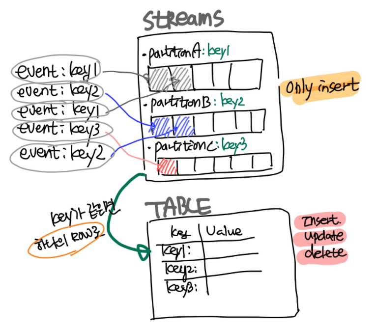


```sql
# Create a materialized view that tracks the latest location of riders
ksql> CREATE TABLE currentLocation AS
  SELECT profileId,
         LATEST_BY_OFFSET(latitude) AS la,
         LATEST_BY_OFFSET(longitude) AS lo
  FROM riderlocations
  GROUP BY profileId
  EMIT CHANGES;
  
# Create a table that checks how far a rider is from a given location
ksql> CREATE TABLE ridersNearMountainView AS
SELECT ROUND(GEO_DISTANCE(la, lo, 37.4133, -122.1162), -1) AS distanceInMiles,
       COLLECT_LIST(profileId) AS riders,
       COUNT(*) AS count
  FROM currentLocation
  GROUP BY ROUND(GEO_DISTANCE(la, lo, 37.4133, -122.1162), -1);
```

- `LATEST_BY_OFFSET`
    - An aggregate function that returns the latest value of a specific column
- `EMIT CHANGES`
    - Adding the EMIT CHANGES clause lets you continuously receive all changes
- `COLLECT_LIST(col1)`
    - Returns an array containing all values of col1

References

- https://www.slideshare.net/ConfluentInc/ksqldb
- https://devidea.tistory.com/73


## 5.4 Query


### 5.4.1 Push Query (Continous Query)

- A push query lets you subscribe to results that change in real time
- The EMIT clause keeps the query running persistently
- To stop a push query started in the CLI, you must press `ctrl+C`

```sql
# Continuously query the Stream's data, and the query keeps running
ksql> SELECT * FROM riderLocations
WHERE GEO_DISTANCE(latitude, longitude, 37.4133, -122.1162) <= 5 EMIT CHANGES;

# Continuously query the Table's data, and the query keeps running
ksql> SELECT * FROM currentLocation EMIT CHANGES;
```


Let's put some actual data into ksqlDB. The following inserts into the riderLocations stream, which is the same as publishing to the Kafka Topic associated with riderLocations.

```sql
ksql> INSERT INTO riderLocations (profileId, latitude, longitude) VALUES ('c2309eec', 37.7877, -122.4205);
INSERT INTO riderLocations (profileId, latitude, longitude) VALUES ('18f4ea86', 37.3903, -122.0643);
INSERT INTO riderLocations (profileId, latitude, longitude) VALUES ('4ab5cbad', 37.3952, -122.0813);
INSERT INTO riderLocations (profileId, latitude, longitude) VALUES ('8b6eae59', 37.3944, -122.0813);
INSERT INTO riderLocations (profileId, latitude, longitude) VALUES ('4a7c7b41', 37.4049, -122.0822);
INSERT INTO riderLocations (profileId, latitude, longitude) VALUES ('4ddad000', 37.7857, -122.4011);
```

You can also publish using the Kafka CLI command.

```bash
$ kafka-console-producer.sh --bootstrap-server localhost:9092 --topic locations
> {"profileId": "c2309ee5", "latitude": 42.7877, "longitude": -122.4205}
```


### 5.4.2 Pull Query (Classic Query)

- A pull query fetches the current state of a table

```sql
# Search for all riders currently within 10 miles of Mountain View
ksql> SELECT * from ridersNearMountainView WHERE distanceInMiles <= 10;
```

References

- https://www.rittmanmead.com/blog/2017/10/ksql-streaming-sql-for-apache-kafka/

- https://docs.ksqldb.io/en/latest/concepts/time-and-windows-in-ksqldb-queries/


## 5.5 Control Center

So far, we've only used ksqlDB from the CLI. Let's also use ksqlDB from the Control Center. Access [http://localhost:9021](http://localhost:9021).

## 5.6 Datagen Source Connector

The Datagen Source Connector is a connector that generates Mock data for development and testing. It periodically generates data according to the configured values, making it possible to simulate continuously receiving a stream of data.

### 5.6.1 Generate Mock Data

Create `pageviews` and `users` as mocks.

**Click Connect > the Add Connector button > select DatagenConnector**, then enter the following information.

```json
# Generate pageviews mock data
{
  "name": "datagen-pageviews",
  "config": {
    "name": "datagen-pageviews",
    "connector.class": "io.confluent.kafka.connect.datagen.DatagenConnector",
    "key.converter": "org.apache.kafka.connect.storage.StringConverter",
    "kafka.topic": "pageviews",
    "max.interval": "100",
    "quickstart": "pageviews"
  }
}

# Generate users mock data
{
  "name": "datagen-users",
  "config": {
    "name": "datagen-users",
    "connector.class": "io.confluent.kafka.connect.datagen.DatagenConnector",
    "key.converter": "org.apache.kafka.connect.storage.StringConverter",
    "kafka.topic": "users",
    "max.interval": "1000",
    "quickstart": "users"
  }
}
```


**Click Topics > pageviews > the Messages tab.** You can see that data is being published to the pageviews topic in real time.

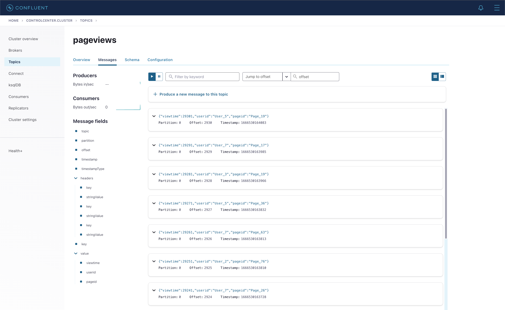

References

- https://docs.confluent.io/kafka-connectors/datagen/current/index.html#datagen-source-connector-for-cp
- https://always-kimkim.tistory.com/entry/kafka-develop-kafka-connect-datagen
- https://www.confluent.io/blog/easy-ways-generate-test-data-kafka/
- https://github.com/confluentinc/kafka-connect-datagen/tree/master/src/main/resources


## 5.7 Joins Collections

ksqlDB's Join and a traditional relational database's Join are similar in that they combine two or more pieces of data. You can use Join syntax to merge streams events that occur in real time.

```sql
# 1. create stream
ksql> CREATE STREAM pageviews_stream
  WITH (KAFKA_TOPIC='pageviews', VALUE_FORMAT='AVRO');

# 2. create table
ksql> CREATE TABLE users_table (id VARCHAR PRIMARY KEY)
    WITH (KAFKA_TOPIC='users', VALUE_FORMAT='AVRO');
```

Join the `pageviews` stream and the `users` table to create `user_pageviews`.

```sql
# user_pageviews creates a USER_PAGEVIEWS topic
ksql> CREATE STREAM user_pageviews
  AS SELECT users_table.id AS userid, pageid, regionid, gender
     FROM pageviews_stream
              LEFT JOIN users_table ON pageviews_stream.userid = users_table.id
         EMIT CHANGES;

# Create a separate pageviews from the user_pageviews stream where regionId ends with 8 or 9
ksql> CREATE STREAM pageviews_region_like_89
  WITH (KAFKA_TOPIC='pageviews_filtered_r8_r9', VALUE_FORMAT='AVRO')
    AS SELECT * FROM user_pageviews
       WHERE regionid LIKE '%_8' OR regionid LIKE '%_9'
           EMIT CHANGES;
```


## 5.8 Windows

### 5.8.1 Time

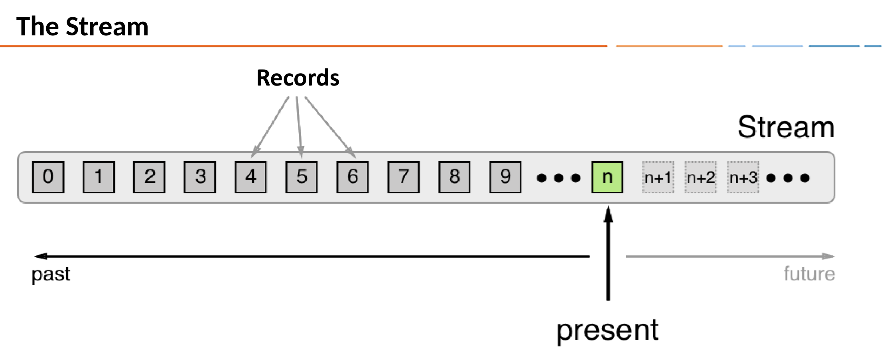

- Each Record contains a timestamp
- The timestamp is set by the producer application or the Kafka broker
- The timestamp is used in time-dependent operations such as aggregation and join

### 5.8.2 Window

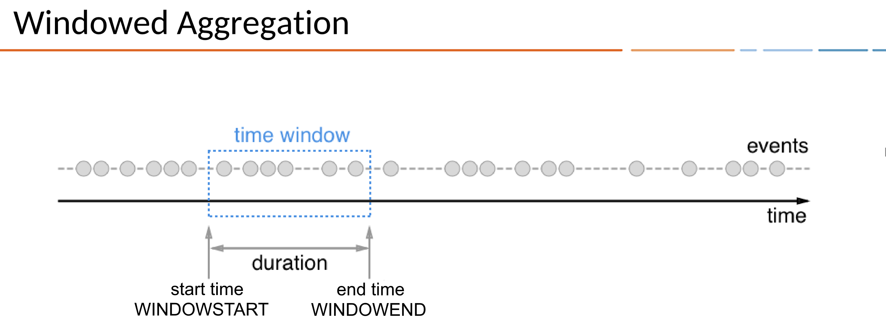


- ksqlDB provides Window queries that use a stream to aggregate events over a specific period (Window) and send them out
- A specific period is represented as a Duration, which can be expressed with `WINDOWSTART` / `WINDOWEND`
- `WINDOWSTART` / `WINDOWEND` can be declared and used in the SELECT clause once you create a Window query

### 5.8.3 Window Types

There are three ways to define Time Windows in KSQL.

- Tumbling
    - Time-based
    - Fixed-duration, non-overlapping, gap-less windows
    - ex. `WINDOW TUMBLING (SIZE 1 HOUR)`
- Hopping
    - Time-based
    - Fixed-duration, overlapping windows
    - ex. `WINDOW HOPPING (SIZE 30 SECONDS, ADVANCE BY 10 SECOND)`
- Session
    - Session-based
    - Dynamically-sized, non-overlapping, data-driven windows
    - Creates a Session Window by distinguishing active periods using the inactivity gap value
    - Session Windows are especially useful for user behavior analysis (ex. number of unique visitors)
    - ex. `WINDOW SESSION (60 SECONDS)`


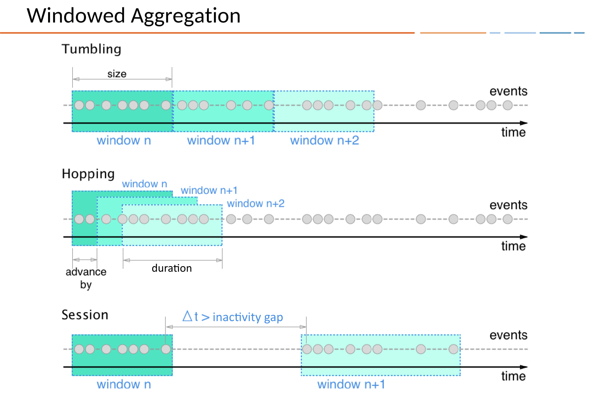


```sql
# Create a Table named pageviews_per_region_89 that counts the number of pageviews for regions 8 and 9 in a 30-second tumbling window
ksql> CREATE TABLE pageviews_per_region_89 WITH (KEY_FORMAT='JSON')
  AS SELECT userid, gender, regionid, COUNT(*) AS numusers
    FROM pageviews_region_like_89
    WINDOW TUMBLING (SIZE 30 SECOND)
    GROUP BY userid, gender, regionid
    HAVING COUNT(*) > 1
EMIT CHANGES;
```


```sql
ksql> SELECT * FROM pageviews_per_region_89 EMIT CHANGES;
```

References

- https://ojt90902.tistory.com/1117?category=1007571

## 5.9 REST API

```bash
$ curl --location --request POST 'http://localhost:8088/ksql' \
--header 'Content-Type: application/json' \
--data-raw '{
  "ksql": "show streams;",
  "streamProperties":{}
}'

[
  {
    "@type": "streams",
    "statementText": "show streams;",
    "streams": [
      {
        "type": "STREAM",
        "name": "RIDERLOCATIONS",
        "topic": "locations",
        "keyFormat": "KAFKA",
        "valueFormat": "JSON",
        "isWindowed": false
      },
      ...omitted...
      {
        "type": "STREAM",
        "name": "USER_PAGEVIEWS",
        "topic": "USER_PAGEVIEWS",
        "keyFormat": "KAFKA",
        "valueFormat": "AVRO",
        "isWindowed": false
      }
    ],
    "warnings": []
  }
]

```

The ksqlDB server provides a REST API. Please refer to the links below for the full API documentation.

- https://rmoff.net/2019/01/17/ksql-rest-api-cheatsheet/
- https://docs.ksqldb.io/en/latest/developer-guide/api/

## 5.10 Connector Management

> Please refer to [Kafka Connector](https://blog.advenoh.pe.kr/kafka-connect에-대한-소개/) here

ksqlDB can run connectors in two modes. The mode determines how and where the connector runs.

- Embedded
    - In Embedded mode, ksqlDB runs the connector directly on the server
- External
    - This mode communicates with an external Kafka Connect cluster


```sql
ksql> CREATE SINK CONNECTOR `mongodb-test-sink-connector` WITH (
   "connector.class"='com.mongodb.kafka.connect.MongoSinkConnector',
   "key.converter"='org.apache.kafka.connect.json.JsonConverter',
   "value.converter"='org.apache.kafka.connect.json.JsonConverter',
   "key.converter.schemas.enable"='false',
   "value.converter.schemas.enable"='false',
   "tasks.max"='1',
   "connection.uri"='mongodb://MongoDBIPv4Address:27017/admin?readPreference=primary&appname=ksqldbConnect&ssl=false',
   "database"='local',
   "collection"='mongodb-connect',
   "topics"='test.topic'
);
```

References

- https://medium.com/@rt.raviteja95/mongodb-connector-with-ksqldb-with-confluent-kafka-2a3b18dc4c25
- https://docs.ksqldb.io/en/latest/how-to-guides/use-connector-management/


## 5.11 KSQL Library

- golang
    - https://github.com/VinGarcia/ksql
    - https://github.com/rmoff/ksqldb-go
- java
    - https://www.baeldung.com/ksqldb
    - https://docs.ksqldb.io/en/latest/developer-guide/ksqldb-clients/java-client/

# 6. When

Because ksqlDB processes data based on Kafka, it is used where real-time data transformation, integration, and analysis are needed immediately. It can be used in various fields, such as:

- Anomaly and pattern detection
- Real-time analytics
- Predictive analytics
- Logistics and IoT management
- Real-time alerts and notifications
- Infrastructure modernization
- Customer 360
- Cybersecurity

References

- https://developer.confluent.io/tutorials/
- https://blog.voidmainvoid.net/227
- https://github.com/confluentinc/ksql/tree/0.1.x/docs#ksql-documentation
- https://www.confluent.io/blog/stream-processing-vs-batch-processing/

# 7. FAQ

For various ksqlDB FAQs, please refer below.

- https://docs.ksqldb.io/en/latest/faq/

## 7.1 Is ksqlDB licensed under Apache License 2.0?

- It is not the Apache License
- ksqlDB is granted the Confluent Community License and is managed as a Confluent product

## 7.2 What restrictions does the Confluent Community License have?

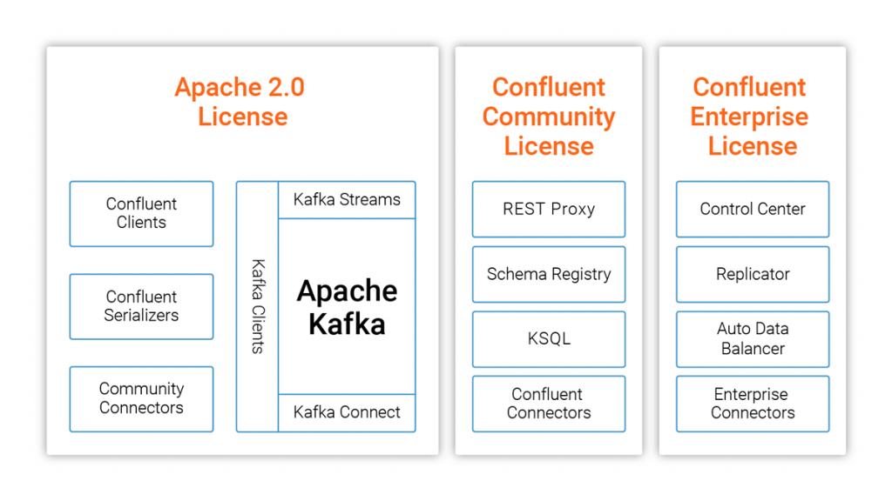

- It appears you can use ksqlDB as long as you do not provide the same kind of service that Confluent offers
    - KSQL itself must not be provided as a SaaS product
    - To use it in an internal company project, a license review is likely needed before use
- https://www.confluent.io/confluent-community-license-faq/
- https://www.confluent.io/ko-kr/blog/license-changes-confluent-platform/

# 8. Wrap up

ksqlDB helps you easily perform streaming processing on Kafka using SQL syntax that is already familiar to us.

For creating just a few Streams and Tables, you can comfortably create and use them in the Control Center or CLI, but when you need a Pipeline across multiple Streams, it would be good to try the [Stream Designer](https://www.confluent.io/product/stream-designer/) UI, which is easier to use.

- Visual Builder for Streaming Data Pipeline
- Provided in Confluent Cloud

- https://www.confluent.io/blog/building-streaming-data-pipelines-visually

# 9. Reference

- ksql syntax
    - https://docs.ksqldb.io/en/latest/developer-guide/ksqldb-reference/show-streams/

- ksql
    - https://ksqldb.io/quickstart.html?utm_source=thenewstack&utm_medium=website&utm_content=inline-mention&utm_campaign=platform
    - https://always-kimkim.tistory.com/entry/kafka101-ksql
    - https://www.rittmanmead.com/blog/2017/10/ksql-streaming-sql-for-apache-kafka/
    - https://www.confluent.io/blog/intro-to-ksqldb-sql-database-streaming/
    - https://docs.confluent.io/platform/current/platform-quickstart.html#ce-quickstart?utm_source=github&utm_medium=demo&utm_campaign=ch.examples_type.community_content.cp-quickstart
    - https://github.com/confluentinc/demo-scene/blob/master/introduction-to-ksqldb/demo_introduction_to_ksqldb_01.adoc
    - https://www.confluent.io/blog/guide-to-stream-processing-and-ksqldb-fundamentals/
    - https://hevodata.com/learn/kafka-ksql-streaming-sql-for-kafka/
