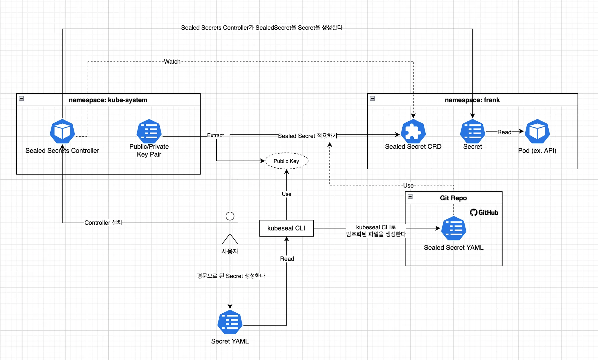
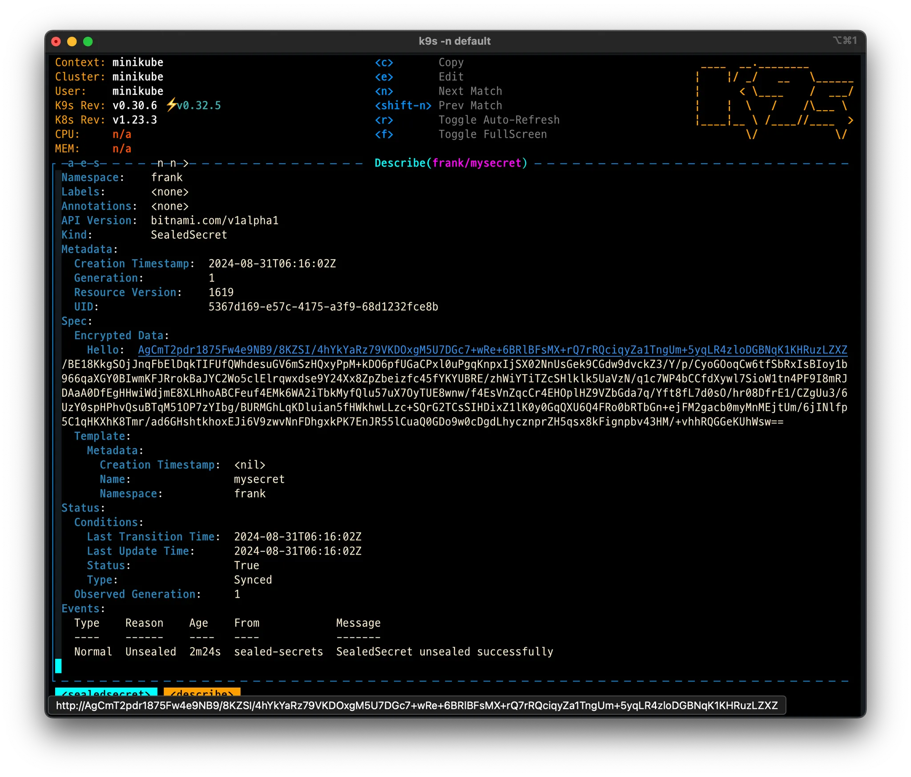
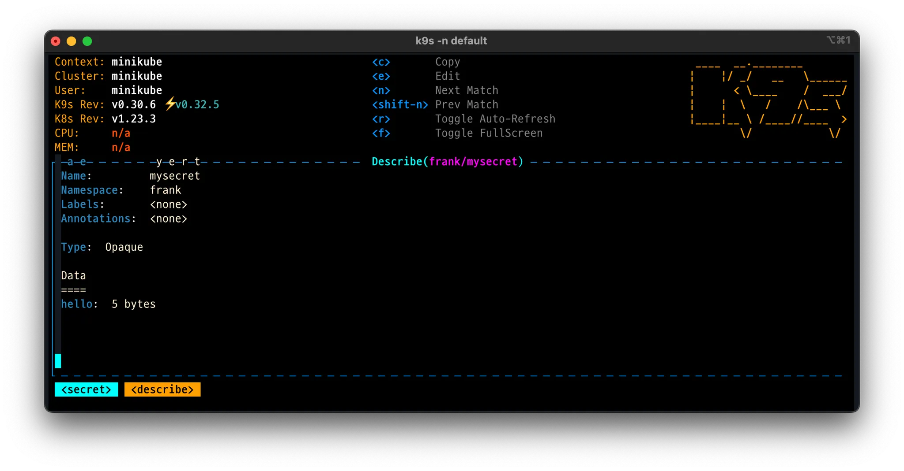
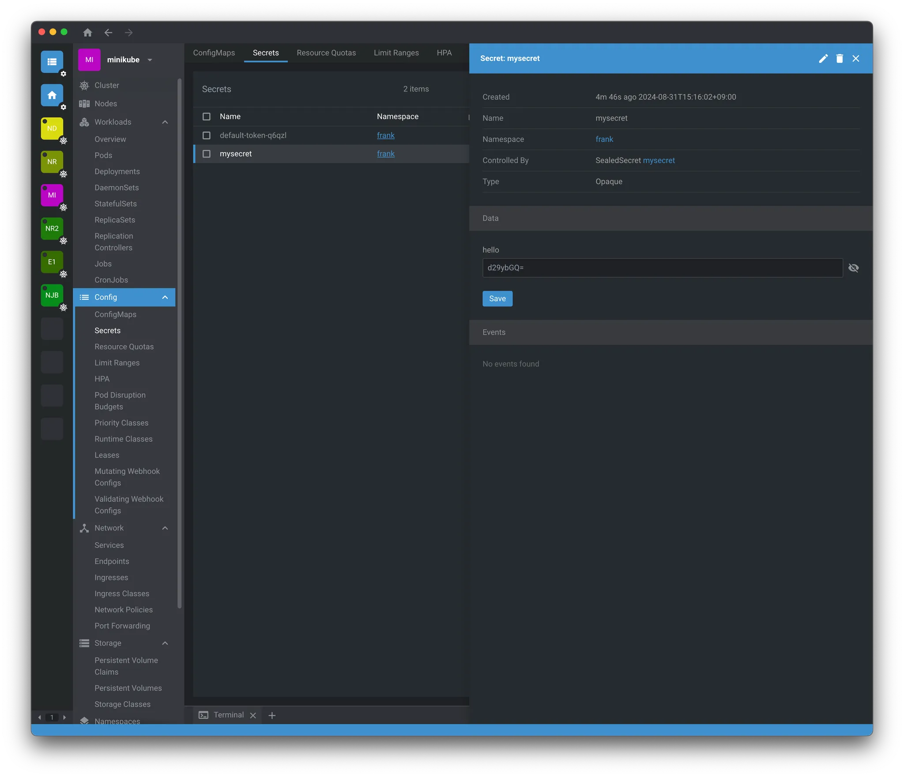

# 1. Overview

To deploy a developed application to Kubernetes, we store the configuration the application needs using helm charts. Since sensitive information such as IDs and passwords is stored in a Git repository, there is a security issue where it is exposed as-is to any user who has access to Git.

To solve this, let's take a look at Sealed Secrets.

# 1.1 How It Works

Sealed Secrets works in the following way.

- The user creates secret data in plaintext
- Using the `kubeseal` CLI tool, this data is converted into an encrypted Sealed Secret resource
- When the SealedSecret resource is applied to the Kubernetes cluster, the Sealed Secrets controller decrypts it and converts it into a regular Secret resource
- The decryption process happens only within the cluster, and it cannot be decrypted from outside



# 2. Installing Sealed Secrets

> Since we will be running Kubernetes in a local environment, we use minikube

```bash
> minikube start
```

Installing Sealed Secrets is divided into installing the kubeseal CLI tool and installing the Sealed Secrets controller.

# 2.1 Installing kubeseal

The kubeseal CLI is used by the user to encrypt secret data. The installation method is as follows.

> Installation is explained based on macOS

```bash
> brew install kubeseal
```

# 2.2 Installing the Sealed Secrets Controller

The Sealed Secrets controller is responsible for decrypting SealedSecret resources within the Kubernetes cluster. There are several installation methods (e.g. helm, kubectl), but here we install it with helm.

Install the Sealed Secrets controller using Helm.

```bash
# Add the sealed-secrets helm repo
> helm repo add sealed-secrets <https://bitnami-labs.github.io/sealed-secrets>
> helm repo update
```

Check that the installation went well with the command below.

```bash
> kubectl get pods -n kube-system -l app.kubernetes.io/name=sealed-secrets
NAME                              READY   STATUS    RESTARTS   AGE
sealed-secrets-697689447c-f6dkv   1/1     Running   0          93s
```

# 3. Creating and Encrypting a Secret

Let's look at how to create and encrypt secret data using Sealed Secrets.

# 3.1 Creating a Sample Secret YAML

First, create a YAML file containing plaintext secret data.

```bash
# Create a sample Secret file
> kubectl create -n frank secret generic mysecret --from-literal hello=world --dry-run=client -oyaml > mysecret.yaml
```

The command above generates the `yaml` below, and the `value` of `hello` is a value encoded with `base64`.

```yaml
apiVersion: v1
data:
  hello: d29ybGQ= # base64-encoded value
kind: Secret
metadata:
  creationTimestamp: null
  name: mysecret
  namespace: frank
```

When writing `yaml` manually, values that need to be represented as secrets must be base64-encoded in order to create a sealed secret. When encoding with base64, make sure to run it with the `-n` option. Remember that running it without the option adds a newline.

> You must run it with the `-n` option so that it is added without a newline
>
> ```bash
> echo -n "string" | base64
> ```

# 3.2 Encrypting Secrets

Use the kubeseal CLI tool to convert the Secret into an encrypted SealedSecret.

```bash
# Generate a sealed-secret from the secret file with the kubeseal command
> kubeseal --controller-name=sealed-secrets \\
 --controller-namespace=kube-system --format yaml < mysecret.yaml > mysealed_secret.yaml
---
apiVersion: bitnami.com/v1alpha1
kind: SealedSecret
metadata:
  creationTimestamp: null
  name: mysecret
  namespace: frank
spec:
  encryptedData:
    hello: AgCmT2pdr1875Fw4e9NB9/8KZSI/4hYkYaRz79VKDOxgM5U7DGc7+wRe+6BRlBFsMX+rQ7rRQciqyZa1TngUm+5yqLR4zloDGBNqK1KHRuzLZXZ/BE18KkgSOjJnqFbElDqkTIFUfQWhdesuGV6mSzHQxyPpM+kDO6pfUGaCPxl0uPgqKnpxIjSX02NnUsGek9CGdw9dvckZ3/Y/p/CyoGOoqCw6tfSbRxIsBIoy1b966qaXGY0BIwmKFJRrokBaJYC2Wo5clElrqwxdse9Y24Xx8ZpZbeizfc45fYKYUBRE/zhWiYTiTZcSHlklk5UaVzN/q1c7WP4bCCfdXywl7SioW1tn4PF9I8mRJDAaA0DfEgHHwiWdjmE8XLHhoABCFeuf4EMk6WA2iTbkMyfQlu57uX7OyTUE8wnw/f4EsVnZqcCr4EHOplHZ9VZbGda7q/Yft8fL7d0sO/hr08DfrE1/CZgUu3/6UzY0spHPhvQsuBTqM51OP7zYIbg/BURMGhLqKDluian5fHWkhwLLzc+SQrG2TCsSIHDixZ1lK0y0GqQXU6Q4FRo0bRTbGn+ejFM2gacb0myMnMEjtUm/6jINlfp5C1qHKXhK8Tmr/ad6GHshtkhoxEJi6V9zwvNnFDhgxkPK7EnJR55lCuaQ0GDo9w0cDgdLhycznprZH5qsx8kFignpbv43HM/+vhhRQGGeKUhWsw==
  template:
    metadata:
      creationTimestamp: null
      name: mysecret
      namespace: frank
```

# 3.3  Applying Sealed Secrets to Kubernetes

Apply the encrypted SealedSecret to the Kubernetes cluster.

```bash
> kubectl create ns frank
namespace/frank created

> kubectl -n frank apply -f mysealed_secret.yaml
sealedsecret.bitnami.com/mysecret created
```

# 3.4 Verifying That It Was Applied Correctly

You can verify that the `secrets` were created correctly with the `kubectl` command.

```bash
> kubectl get sealedsecrets
NAME       STATUS   SYNCED   AGE
mysecret            True     3m8s

> kubectl get secrets
NAME                  TYPE                                  DATA   AGE
default-token-q6qzl   kubernetes.io/service-account-token   3      3m25s
mysecret              Opaque                                1      3m20s
```

> You can also easily check it with `k9s`





> If you check with OpenLens, you can also see the actual decrypted value.




# 4. References

- [How to create an actually safe secrets for GitOps](https://jaehong21.com/posts/k3s/06-sealed-secrets/)
- [Managing secrets deployment in Kubernetes using Sealed Secrets](https://aws.amazon.com/ko/blogs/opensource/managing-secrets-deployment-in-kubernetes-using-sealed-secrets/)
- [How to Encrypt Kubernetes Secrets Using Sealed Secrets in DOKS](https://www.digitalocean.com/community/developer-center/how-to-encrypt-kubernetes-secrets-using-sealed-secrets-in-doks)
