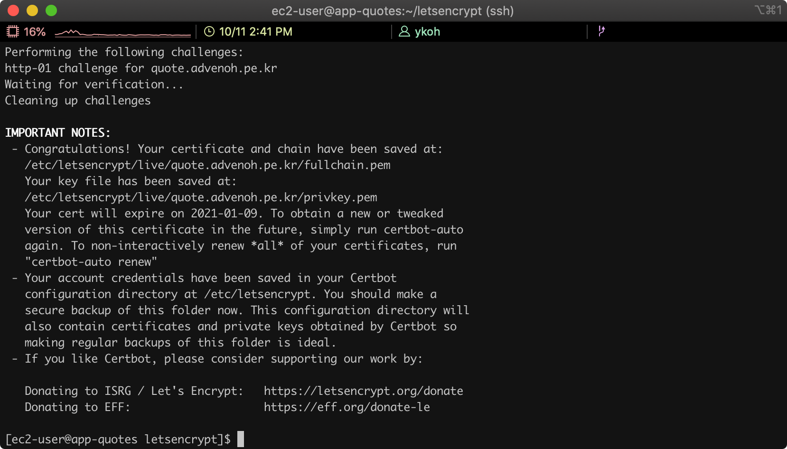
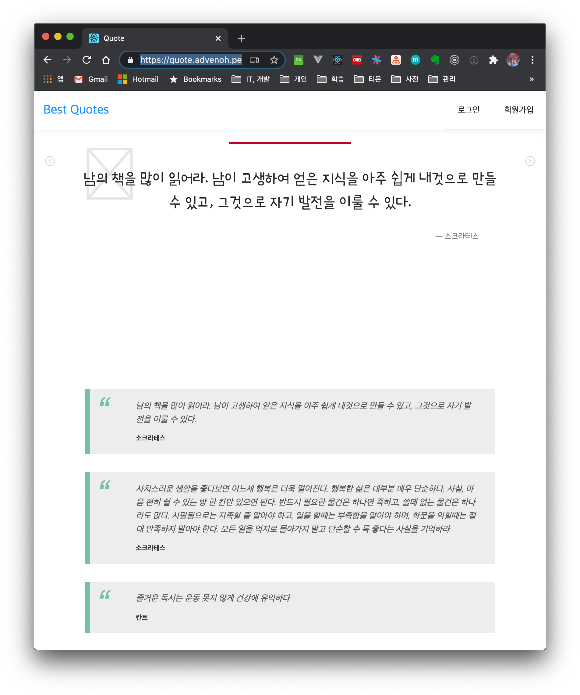

# 1. Introduction

Let's look at how to configure a website with HTTPS. To switch from HTTP to HTTPS, the following steps are required.

- Issue an SSL certificate
    - You can get an SSL certificate for free from [letsencrypt](https://letsencrypt.org/)
- Install the SSL certificate on the server and configure the web server

## 1.1 Development Environment

- Server: Amazon Linux
- Web server: Nginx server
- Target site: http://quote.advenoh.pe.kr

#2.  Tool Installation and Environment Setup

## 2.1 Installing the Certificate with Certbot

Let's Encrypt provides the certbot command, which automatically issues or renews Let's Encrypt certificates.

First, install the certbot command.

```bash
$ git clone https://github.com/letsencrypt/letsencrypt
```

Let's generate a certificate using the standalone method.

```bash
$ cd letsencrypt
$ ./certbot-auto certonly --standalone --debug -d quote.advenoh.pe.kr
```

The standalone method is one in which certbot runs a temporary web server to handle the domain validation request. Because this temporary server uses ports 80 and 443, the certificate cannot be issued if the Nginx server is using the same ports.

Before running certbot, stop the Nginx service.

```bash
$ sudo service nginx stop
```

If everything is generated without issues, you will see a message like the screen below.



## 2.2 Changing the Nginx Server Configuration

Now let's add the HTTPS configuration to the Nginx web server.

```bash
$ vim /etc/ngnix/nginx.conf
```

Add the following below the server block related to port 80.

```bash
server {
        listen       443 ssl;
        listen       [::]:443;
        server_name  quote.advenoh.pe.kr;
        root         /usr/share/nginx/html;

        ssl_certificate "/etc/letsencrypt/live/quote.advenoh.pe.kr/fullchain.pem";
        ssl_certificate_key "/etc/letsencrypt/live/quote.advenoh.pe.kr/privkey.pem";
        ssl_session_cache shared:SSL:1m;
        ssl_session_timeout  10m;

        # Load configuration files for the default server block.
        include /etc/nginx/default.d/*.conf;
        include /etc/nginx/conf.d/service-url.inc;

        location / {
            proxy_pass $service_url;
            proxy_set_header X-Real-IP $remote_addr;
            proxy_set_header X-Forwarded-For $proxy_add_x_forwarded_for;
            proxy_set_header X-Forwarded-Proto https;
            proxy_set_header Host $http_host;
        }

        error_page 404 /404.html;
            location = /40x.html {
        }

				error_page 500 502 503 504 /50x.html;
            location = /50x.html {
        }
}

```

Restart the Nginx server and connect using the https address.

```bash
$ sudo service nginx restart
```




## 2.3 Troubleshooting and Other Settings

### 2.3.1 Automatically Renewing the Let's Encrypt Certificate

A Let's Encrypt certificate must be renewed every 3 months. Set up a cron job so that it renews automatically.

```bash
$ sudo crontab -e 
0 10 9 */3 * /home/ec2-user/letsencrypt/certbot-auto renew
0 10 9 */3 * service ngnix restart
```


### 2.3.2 "Problem binding to port 80" Error Message

Stop the Nginx server and run certbot again.

```bash
- - - - - - - - - - - - - - - - - - - - - - - - - - - - - - - - - - - - - - - -
Would you be willing, once your first certificate is successfully issued, to
share your email address with the Electronic Frontier Foundation, a founding
partner of the Let's Encrypt project and the non-profit organization that
develops Certbot? We'd like to send you email about our work encrypting the web,
EFF news, campaigns, and ways to support digital freedom.
- - - - - - - - - - - - - - - - - - - - - - - - - - - - - - - - - - - - - - - -
(Y)es/(N)o: n
Obtaining a new certificate
Performing the following challenges:
http-01 challenge for quote.advenoh.pe.kr
Cleaning up challenges
Exiting abnormally:
Traceback (most recent call last):
  File "/opt/eff.org/certbot/venv/bin/letsencrypt", line 11, in <module>
    sys.exit(main())
  File "/opt/eff.org/certbot/venv/local/lib/python2.7/site-packages/certbot/main.py", line 15, in main
    return internal_main.main(cli_args)
  File "/opt/eff.org/certbot/venv/local/lib/python2.7/site-packages/certbot/_internal/main.py", line 1362, in main
    return config.func(config, plugins)
  File "/opt/eff.org/certbot/venv/local/lib/python2.7/site-packages/certbot/_internal/main.py", line 1243, in certonly
    lineage = _get_and_save_cert(le_client, config, domains, certname, lineage)
  File "/opt/eff.org/certbot/venv/local/lib/python2.7/site-packages/certbot/_internal/main.py", line 122, in _get_and_save_cert
    lineage = le_client.obtain_and_enroll_certificate(domains, certname)
  File "/opt/eff.org/certbot/venv/local/lib/python2.7/site-packages/certbot/_internal/client.py", line 418, in obtain_and_enroll_certificate
    cert, chain, key, _ = self.obtain_certificate(domains)
  File "/opt/eff.org/certbot/venv/local/lib/python2.7/site-packages/certbot/_internal/client.py", line 351, in obtain_certificate
    orderr = self._get_order_and_authorizations(csr.data, self.config.allow_subset_of_names)
  File "/opt/eff.org/certbot/venv/local/lib/python2.7/site-packages/certbot/_internal/client.py", line 398, in _get_order_and_authorizations
    authzr = self.auth_handler.handle_authorizations(orderr, best_effort)
  File "/opt/eff.org/certbot/venv/local/lib/python2.7/site-packages/certbot/_internal/auth_handler.py", line 70, in handle_authorizations
    resps = self.auth.perform(achalls)
  File "/opt/eff.org/certbot/venv/local/lib/python2.7/site-packages/certbot/_internal/plugins/standalone.py", line 156, in perform
    return [self._try_perform_single(achall) for achall in achalls]
  File "/opt/eff.org/certbot/venv/local/lib/python2.7/site-packages/certbot/_internal/plugins/standalone.py", line 163, in _try_perform_single
    _handle_perform_error(error)
  File "/opt/eff.org/certbot/venv/local/lib/python2.7/site-packages/certbot/_internal/plugins/standalone.py", line 210, in _handle_perform_error
    raise error
StandaloneBindError: Problem binding to port 80: Could not bind to IPv4 or IPv6.
Please see the logfiles in /var/log/letsencrypt for more details.

```


### 2.3.3 Redirecting http -> https

Change the Nginx configuration so that http connections are redirected to https.

```bash
server {
        listen       80 default_server;
        listen       [::]:80 default_server;
        server_name  quote.advenoh.pe.kr;
        return 301 https://$server_name:$request_uri;
}
```

# 3. Conclusion

Let's Encrypt provides SSL certificates for free and also offers certbot, which makes them easy to install. With the certbot command, I was able to set up https in almost 5 minutes. For the full Nginx configuration, please refer to this [gist](https://gist.github.com/kenshin579/489a13d194e310ec741f64f508c1f987).

# 4. References

* Installing an SSL certificate
    * https://levelup.gitconnected.com/how-to-install-ssl-certificate-for-nginx-server-in-amazon-linux-2986f51371fb
    * https://medium.com/@devAsterisk/certbot%EC%9D%84-%ED%86%B5%ED%95%9C-%EB%AC%B4%EB%A3%8C%EC%9D%B8%EC%A6%9D%EC%84%9C-%EC%83%9D%EC%84%B1-707f86b642d1
    * https://elfinlas.github.io/2018/03/19/certbot-ssl/
* Cron expression
    * https://crontab.guru/#0_10_9_*/3_*
