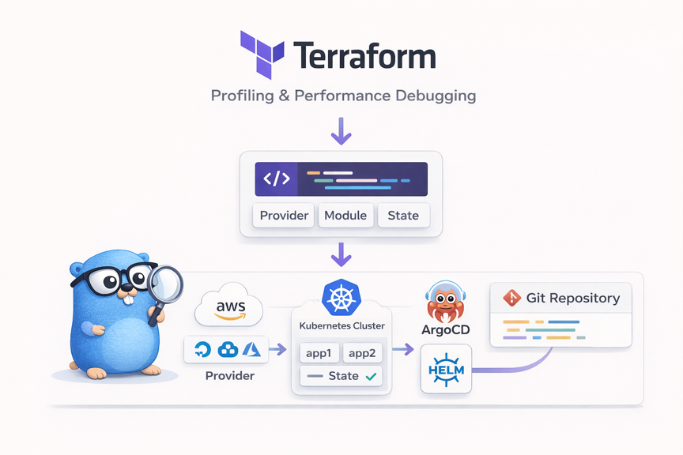
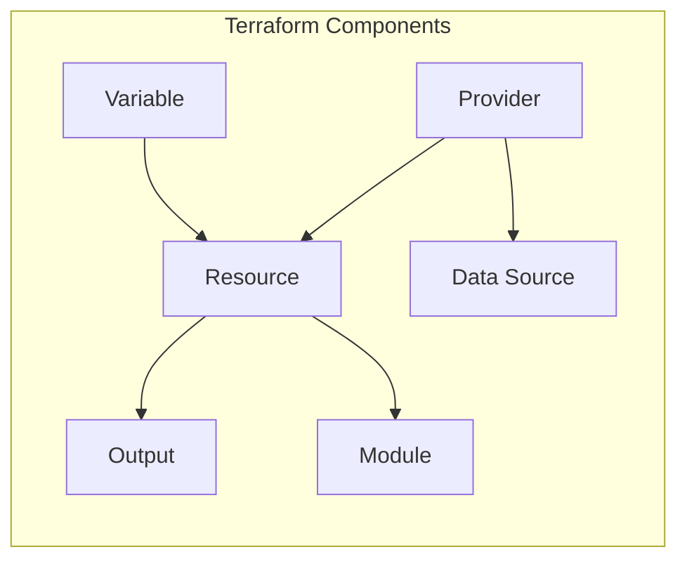
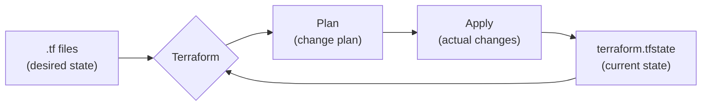
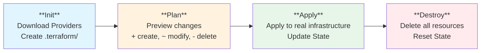
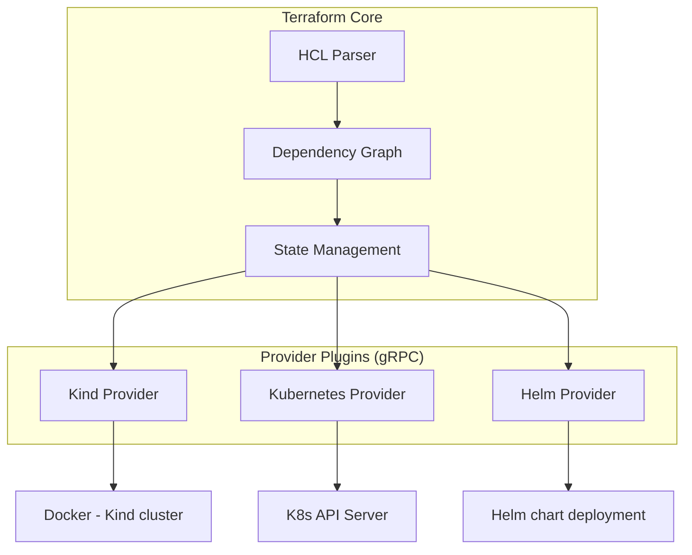
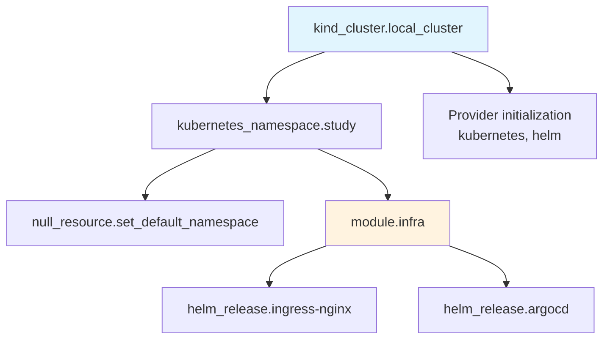
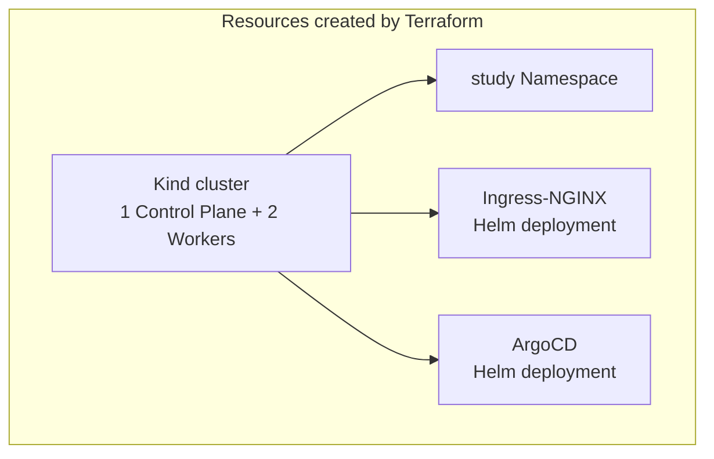
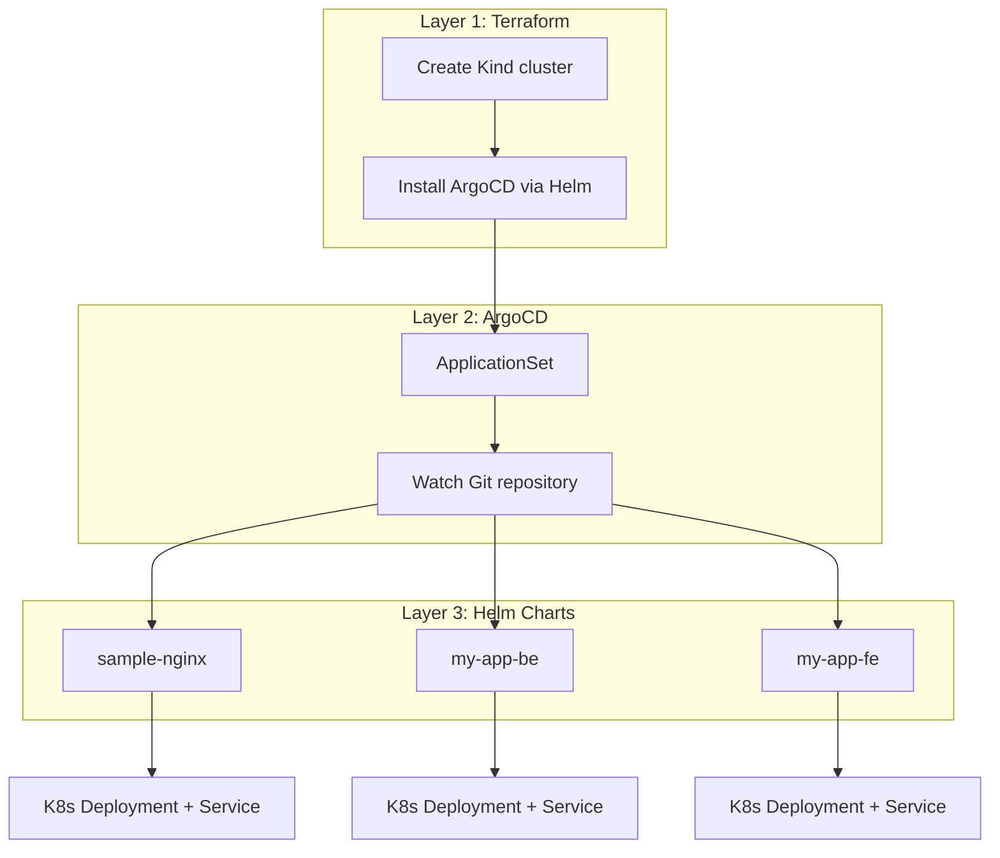
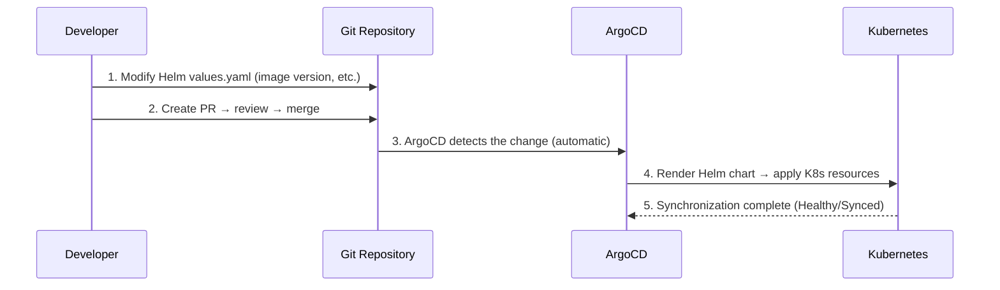

# 1. Introduction



When managing infrastructure, you often run into the question: "Who changed this server setting, when, and why?" You click around in the console manually, type commands into the CLI, and try to document the process, but eventually a gap appears between the actual state and the documentation.

**IaC (Infrastructure as Code)** solves this problem. When you define infrastructure as code:

- **Version control**: You can track change history with Git
- **Reproducibility**: Running the same code produces the same environment
- **Code review**: Infrastructure changes can also be reviewed via PRs
- **Automation**: It can be integrated into CI/CD pipelines

## 1.1 Why Terraform

There are several IaC tools available.

| Tool | Characteristics | Approach |
|------|------|-----------|
| **Terraform** | Multi-cloud, declarative, large ecosystem | Declarative |
| Pulumi | Uses general-purpose programming languages (Go, Python, etc.) | Imperative |
| CloudFormation | AWS-only, deep AWS integration | Declarative |
| Ansible | Configuration-management focused, agentless | Imperative/Declarative |

The reasons for choosing Terraform are as follows:

- **Declarative approach**: You define "what" you want rather than "how." Terraform calculates the difference between the current state and the desired state and applies it
- **Provider ecosystem**: There are thousands of Providers, including AWS, GCP, and Azure, as well as Kubernetes, Helm, Docker, GitHub, and more
- **Plan feature**: You can preview what changes will occur before actually applying them
- **Community**: As the most widely used IaC tool, it has abundant resources and modules

> In this article, after understanding Terraform's basic concepts, we will walk through a hands-on exercise of deploying ArgoCD to a Kind cluster. Finally, I introduce the Terraform + ArgoCD + Helm combination that I actually use.
>
> The full source code is available on [GitHub](https://github.com/kenshin579/tutorials-go/tree/main/cloud/terraform).

# 2. Terraform Basic Concepts

## 2.1 HCL (HashiCorp Configuration Language)

Terraform uses its own configuration language called **HCL**. It is easier to read than JSON and has clearer typing than YAML.

```hcl
# Basic syntax structure
resource "resource_type" "name" {
  attribute1 = "value"
  attribute2 = 123

  nested_block {
    attribute3 = true
  }
}
```

Key characteristics of HCL:

- **Block-based**: Organized into block units wrapped in `{}`
- **Attribute assignment**: Values are assigned with `=`
- **Comments**: Use `#` or `//`
- **String interpolation**: You can reference variables like `"${var.name}"` (for simple references, `var.name` is sufficient)

## 2.2 Core Components

The core components of Terraform can be summarized as follows. The order below is arranged based on dependencies and learning flow. You need a Provider to create Resources, you configure Resources flexibly with Variables/Outputs, you query existing resources with Data Sources, and you bundle all of this into reusable units with Modules.



### 2.2.1 Provider

A **Provider** is a plugin that allows Terraform to communicate with external services. There is a Provider for each service, such as AWS, Kubernetes, and Helm.
A Provider is the starting point for everything—without a Provider, you cannot create Resources. When you run `terraform init`, the declared Providers are downloaded automatically, and by pinning versions, the entire team can work in an identical environment.

```hcl
# Provider declaration
terraform {
  required_providers {
    kind = {
      source  = "tehcyx/kind"    # Provider source
      version = "0.8"            # Version constraint
    }
    kubernetes = {
      source  = "hashicorp/kubernetes"
      version = "2.36"
    }
  }
}

# Provider configuration
provider "kubernetes" {
  config_path = kind_cluster.local_cluster.kubeconfig_path
}
```

### 2.2.2 Resource

A **Resource** is an actual infrastructure object that Terraform creates and manages. It is declared in the form `resource "type" "name"`.
Any infrastructure supported by a Provider—servers, networks, databases, and so on—can be defined as a Resource, and Terraform manages the entire lifecycle from creation to modification to deletion.

```hcl
# Kind cluster resource declaration
resource "kind_cluster" "local_cluster" {
  name           = var.kind_cluster_name
  wait_for_ready = true
  node_image     = "kindest/node:v1.28.15"
}

# Kubernetes Namespace resource declaration
resource "kubernetes_namespace" "study" {
  depends_on = [kind_cluster.local_cluster]
  metadata {
    name = var.study_namespace
  }
}
```

- `kind_cluster.local_cluster`: A unique identifier combining the resource type and name
- `depends_on`: An explicit dependency declaration between resources (in this case, the cluster must be created first)

### 2.2.3 Variable and Output

**Variable** allows configuration values to be injected from the outside, and **Output** outputs the generated results.
Using Variables, you can apply different values per environment (dev/staging/prod), and Output is useful when other modules or scripts need to reference information about created resources.

```hcl
# Variable: input value definition
variable "kind_cluster_name" {
  description = "Kind cluster name"
  type        = string
  default     = "terraform-study-cluster"
}

# Output: result value output
output "kubeconfig_path" {
  description = "Path to the Kind cluster's kubeconfig file"
  value       = kind_cluster.local_cluster.kubeconfig_path
}
```

How to override a Variable value:

```bash
# CLI argument
terraform apply -var="kind_cluster_name=my-cluster"

# Environment variable
export TF_VAR_kind_cluster_name="my-cluster"

# terraform.tfvars file
kind_cluster_name = "my-cluster"
```

### 2.2.4 Data Source

A **Data Source** reads information about resources that already exist outside of Terraform. If a Resource is about "creating," a Data Source is about "querying."
For example, you can fetch information about a VPC or Namespace that was already created manually and reference it from other resources, naturally connecting existing infrastructure with new resources.

```hcl
# Query information about an existing Namespace
data "kubernetes_namespace" "default" {
  metadata {
    name = "default"
  }
}

# Use the queried information
resource "kubernetes_config_map" "example" {
  metadata {
    namespace = data.kubernetes_namespace.default.metadata[0].name
  }
}
```

### 2.2.5 Module

A **Module** bundles related resources into a single reusable package. By separating them into directory units, it improves code organization and reusability.
You can use community modules published on the Terraform Registry, or you can turn common in-house infrastructure patterns into modules and use them consistently across multiple projects.

```hcl
# Module call (main.tf)
module "infra" {
  source          = "./modules/infra"            # Module path
  study_namespace = kubernetes_namespace.study.metadata[0].name  # Pass variable

  depends_on = [kubernetes_namespace.study]
}
```

```hcl
# Inside the module (modules/infra/infra.tf)
# - Create resources using the passed-in variables
resource "helm_release" "argocd" {
  name       = "argocd"
  repository = "https://argoproj.github.io/argo-helm"
  chart      = "argo-cd"
  version    = "7.8.28"
  namespace  = kubernetes_namespace.argocd.metadata[0].name
  # ...
}
```

## 2.3 State (State Management)

Terraform records the current state of infrastructure in a **State file** (`terraform.tfstate`). This file is the heart of Terraform.



- **During Plan**: Compares the `.tf` files (desired state) and the State file (current state) to calculate the differences
- **During Apply**: Applies the calculated changes to the actual infrastructure and updates the State file

State management methods:

| Method | Description | Suitable Environment |
|------|------|-------------|
| **Local** | Stored as a local file (default) | Personal projects, learning |
| **Remote** | Remote storage such as S3, GCS, etc. | Team collaboration, production |

> **Note**: The State file may contain sensitive information such as passwords and API keys. Be sure to add it to `.gitignore`, and use a Remote Backend in team environments.

# 3. Architecture

## 3.1 How Terraform Works

The Terraform workflow consists of four stages.



| Stage | Command | Description |
|------|--------|------|
| **Init** | `terraform init` | Download Provider plugins, create the `.terraform/` directory |
| **Plan** | `terraform plan` | Compare the current state with the code and output a change plan |
| **Apply** | `terraform apply` | Apply the changes from the Plan to the actual infrastructure |
| **Destroy** | `terraform destroy` | Delete all resources created with Terraform |

## 3.2 Provider Plugin Architecture

Terraform Core is responsible for HCL parsing and state management, while the actual infrastructure manipulation is performed by Provider Plugins.



- Providers are separate binaries that communicate with Terraform Core via gRPC
- When you run `terraform init`, the required Providers are downloaded automatically
- By pinning Provider versions, reproducible builds are guaranteed

## 3.3 Dependency Graph

Terraform manages dependency relationships between resources as a **DAG (Directed Acyclic Graph)**. Resources without dependencies are created in parallel, which speeds things up.



In the graph above, the Kind cluster is created first, and then the Namespace and Provider initialization proceed in parallel. After that, Ingress-NGINX and ArgoCD inside the infra module are also installed in parallel.

You can view the dependency graph with the following command:

```bash
terraform graph | dot -Tpng > graph.png
```

# 4. Installation and Basic Usage

## 4.1 Installation

On macOS, installing via Homebrew is the simplest.

```bash
# Install via Homebrew
brew install terraform

# Check version
terraform version
```

If you need to use different Terraform versions across multiple projects, **tfenv** (a version manager) is recommended.

```bash
# Install tfenv
brew install tfenv

# Install and use a specific version
tfenv install 1.10.0
tfenv use 1.10.0

# Check the currently used version
tfenv list
```

## 4.2 Key CLI Commands

The commonly used commands can be summarized as follows.

```bash
# Initialize: download Providers and install modules
terraform init
terraform init -upgrade    # Upgrade Providers to the latest allowed version

# Code validation and formatting
terraform validate         # Validate configuration file syntax
terraform fmt              # Automatically format code (to the standard style)
terraform fmt -check       # Only check whether formatting changes are needed

# Review the change plan
terraform plan             # Preview which resources will be created/modified/deleted

# Apply
terraform apply            # Apply changes (shows a confirmation prompt)
terraform apply -auto-approve  # Apply immediately without confirmation

# Check state
terraform show             # Detailed information about resources in the current State
terraform output           # Output the Output values
terraform state list       # List of managed resources

# Delete
terraform destroy          # Delete all resources
terraform destroy -target=kind_cluster.local_cluster  # Delete only a specific resource
```

## 4.3 File Structure Convention

A Terraform project usually separates files as follows.

```
project/
├── main.tf          # Provider configuration, module calls
├── variables.tf     # Variable definitions
├── outputs.tf       # Output definitions
├── terraform.tfvars # Variable values (optional, target for .gitignore)
├── modules/         # Reusable modules
│   └── infra/
│       ├── infra.tf
│       └── variables.tf
└── .gitignore       # Exclude State, Provider cache
```

Items that should be included in `.gitignore`:

```
.terraform/          # Provider binary cache
*.tfstate            # State files
*.tfstate.backup     # State backups
*.tfvars             # Sensitive variable values
```

# 5. Hands-on: Deploying a Kind Cluster + ArgoCD

The hands-on code is available at [tutorials-go/cloud/terraform](https://github.com/kenshin579/tutorials-go/tree/main/cloud/terraform). In this exercise, we will go through the process of creating a local Kubernetes cluster with Terraform and installing ArgoCD.

## 5.1 Hands-on Goals and Architecture



## 5.2 Step 1: Provider Configuration (main.tf)

First, declare the Providers you will use.

```hcl
terraform {
  required_providers {
    kind = {
      source  = "tehcyx/kind"
      version = "0.8"
    }
    kubernetes = {
      source  = "hashicorp/kubernetes"
      version = "2.36"
    }
    helm = {
      source  = "hashicorp/helm"
      version = "3.0.0-pre2"
    }
    null = {
      source = "hashicorp/null"
    }
  }
}
```

The Kubernetes and Helm Providers connect by referencing the Kind cluster's kubeconfig.

```hcl
provider "kubernetes" {
  config_path = kind_cluster.local_cluster.kubeconfig_path
}

provider "helm" {
  kubernetes = {
    config_path = kind_cluster.local_cluster.kubeconfig_path
  }
}
```

## 5.3 Step 2: Create the Kind Cluster (kind.tf)

Define the Kind cluster. It consists of 1 Control Plane and 2 Worker nodes.

```hcl
resource "kind_cluster" "local_cluster" {
  name           = var.kind_cluster_name
  wait_for_ready = true
  node_image     = "kindest/node:v1.28.15"

  kind_config {
    kind        = "Cluster"
    api_version = "kind.x-k8s.io/v1alpha4"

    node {
      role = "control-plane"
      extra_port_mappings {
        container_port = 30080
        host_port      = 30080
        listen_address = "127.0.0.1"
      }
      extra_mounts {
        host_path      = "/tmp/kind-storage"
        container_path = "/opt/local-path-provisioner"
      }
    }

    node { role = "worker" }
    node { role = "worker" }
  }
}
```

- `extra_port_mappings`: Maps ports so that NodePort services can be accessed from the host
- `extra_mounts`: Stores Persistent Volume data on the host disk

## 5.4 Step 3: Deploy ArgoCD with a Module (modules/infra/)

The infrastructure installation is separated into a module for management. The module is called from `main.tf`.

```hcl
module "infra" {
  source          = "./modules/infra"
  study_namespace = kubernetes_namespace.study.metadata[0].name

  depends_on = [kubernetes_namespace.study]
}
```

Inside the module, ArgoCD is installed using the Helm Provider.

```hcl
# modules/infra/infra.tf
resource "helm_release" "argocd" {
  name       = "argocd"
  repository = "https://argoproj.github.io/argo-helm"
  chart      = "argo-cd"
  version    = "7.8.28"
  namespace  = kubernetes_namespace.argocd.metadata[0].name

  values = [
    <<-EOT
    configs:
      secret:
        argocdServerAdminPassword: ${var.argocd_password}
    server:
      service:
        type: "ClusterIP"
    EOT
  ]
}
```

`helm_release` performs the same operation as `helm install`. In the `values` block, you can define Helm values inline.

## 5.5 Step 4: Run and Verify

```bash
# 1. Initialize
make tf-init

# 2. Preview changes with Plan
terraform plan

# 3. Apply
make tf-install

# 4. Check the created resources
kubectl get nodes
kubectl get pods -n argocd

# 5. Access the ArgoCD UI (port forwarding)
kubectl port-forward svc/argocd-server -n argocd 8080:443
# Access https://localhost:8080 in your browser
# ID: admin / PW: password
```

When you run `terraform plan`, the resources to be created are displayed as follows:

```
Plan: 7 to add, 0 to change, 0 to destroy.
```

## 5.6 Step 5: Deploy an Application with ArgoCD

Now that the cluster and ArgoCD are ready with Terraform, let's register and deploy an application in ArgoCD. We will use `bootstrap/sample-apps.yaml` and `charts/sample-nginx/` included in the sample code.

### Helm Chart Structure

First, let's look at the Helm chart structure of the sample NGINX app to be deployed.

```
charts/sample-nginx/
├── Chart.yaml           # Chart metadata
├── values.yaml          # Definition of settings like image, replica count, resources
└── templates/
    ├── deployment.yaml  # K8s Deployment template that references settings via {{ .Values.xxx }}
    └── service.yaml     # K8s Service template
```

### Registering Apps in ArgoCD with an ApplicationSet

When registering apps in ArgoCD, use an **ApplicationSet**. An ApplicationSet lets you define multiple Applications at once based on a template.

```yaml
# bootstrap/sample-apps.yaml
apiVersion: argoproj.io/v1alpha1
kind: ApplicationSet
metadata:
  name: sample-apps
  namespace: argocd
spec:
  generators:
    - list:
        elements:
          - appName: sample-nginx      # List of apps to deploy
  template:
    metadata:
      name: "{{appName}}"
    spec:
      project: default
      source:
        repoURL: https://github.com/kenshin579/tutorials-go.git
        targetRevision: main
        path: "cloud/terraform/charts/{{appName}}"   # Helm chart path
      destination:
        server: https://kubernetes.default.svc
        namespace: study
      syncPolicy:
        automated:
          prune: true       # Resources deleted from Git are also deleted in K8s
          selfHeal: true    # Automatically restores to the Git state on manual changes
        syncOptions:
          - CreateNamespace=true
```

- `generators.list.elements`: The list of apps to deploy. To add a new app, just add an entry here
- `source.path`: The Helm chart path within the Git repository. `{{appName}}` is substituted with the actual app name
- `syncPolicy.automated`: When a change is detected in Git, it is automatically applied to K8s

### Running and Verifying the Deployment

```bash
# 1. Apply the ApplicationSet
kubectl apply -f bootstrap/sample-apps.yaml

# 2. Check the ArgoCD Application status
kubectl get applications -n argocd
# NAME           SYNC STATUS   HEALTH STATUS
# sample-nginx   Synced        Healthy

# 3. Check the deployed Pods
kubectl get pods -n study
# NAME                            READY   STATUS    RESTARTS   AGE
# sample-nginx-xxxxx-xxxxx        1/1     Running   0          30s

# 4. Check the Service
kubectl get svc -n study
# NAME           TYPE        CLUSTER-IP     EXTERNAL-IP   PORT(S)   AGE
# sample-nginx   ClusterIP   10.96.x.x      <none>        80/TCP    30s

# 5. NGINX access test
kubectl port-forward svc/sample-nginx -n study 8081:80
# Access http://localhost:8081 in your browser
```

In the ArgoCD UI (`https://localhost:8080`), you can also confirm that the `sample-nginx` app is registered in the Synced/Healthy state.

### Testing a Configuration Change

Let's verify ArgoCD's automatic synchronization. If you change the replica count in `values.yaml` and Git push, ArgoCD applies it automatically.

```yaml
# Modify charts/sample-nginx/values.yaml
replicaCount: 2   # Change from 1 to 2
```

```bash
# After Git push, wait a moment and ArgoCD detects it automatically
kubectl get pods -n study
# NAME                            READY   STATUS    RESTARTS   AGE
# sample-nginx-xxxxx-aaaaa        1/1     Running   0          5m
# sample-nginx-xxxxx-bbbbb        1/1     Running   0          10s   ← newly created
```

Without touching the Terraform code at all, the deployment was completed by modifying only the Helm chart's `values.yaml`. This is the key advantage of the Terraform + ArgoCD + Helm combination.

## 5.7 Step 6: Cleanup

```bash
# Delete the ArgoCD Application
kubectl delete -f bootstrap/sample-apps.yaml

# Delete all Terraform resources (Kind cluster + ArgoCD)
make tf-destroy

# Clean up even the Terraform cache
make tf-clean
```

# 6. The Way I Use It: Terraform + ArgoCD + Helm

## 6.1 Why Minimize Terraform's Scope

You could manage all Kubernetes resources with Terraform. But in practice, the following problems arise:

- **Increased State management complexity**: As the number of apps grows, the State file becomes bloated and `terraform plan` slows down
- **Deployment speed**: Even changing the configuration of a single app requires checking the entire State
- **Difficult role separation**: Infrastructure engineers and app developers have to manage the same Terraform code

That's why I **limit Terraform's role to the minimum**.

| Role | Tool | What It Manages |
|------|------|-----------|
| **Cluster provisioning** | Terraform | Kind cluster, ArgoCD installation |
| **App deployment automation** | ArgoCD | App registration/synchronization via ApplicationSet |
| **App configuration management** | Helm Charts | Deployment, Service, ConfigMap, etc. |

## 6.2 Overall Structure



The directory structure of the project I actually use is as follows.

```
charts/
├── main.tf                          # Provider configuration
├── k8s.tf                           # Kind cluster definition (1 CP + 3 Workers)
├── variables.tf
├── outputs.tf
├── modules/
│   └── infra/
│       └── infra.tf                 # Managed by Terraform: installs only ArgoCD
├── bootstrap/                       # ArgoCD ApplicationSet definitions
│   ├── macmini-infra.yaml           #   → DB (MySQL, Redis)
│   ├── macmini-app.yaml             #   → Apps (10+)
│   └── macmini-gateway.yaml         #   → Gateway (NGINX, cert-manager)
├── charts/                          # Collection of Helm charts (20+)
│   ├── mysql/                       #   infrastructure
│   ├── redis/
│   ├── nginx-gateway/
│   ├── cert-manager/
│   ├── inspireme-be/                #   applications
│   ├── inspireme-fe/
│   ├── moneyflow-be/
│   ├── moneyflow-fe/
│   ├── ai-chatbot-be/
│   └── ...
└── Makefile
```

The key point is that `modules/infra/infra.tf` installs **only ArgoCD**. Infrastructure DBs like MySQL and Redis and all applications are registered in ArgoCD via the ApplicationSet in `bootstrap/`, and the actual K8s resource definitions are managed in each Helm chart under `charts/`.

The core of this structure is the **separation of concerns**:

- **Terraform**: Only responsible for "the cluster exists and ArgoCD is installed"
- **ArgoCD**: Manages "which apps should be deployed"
- **Helm Charts**: Define "how each app is configured"

## 6.3 Real-World Workflow

The flow in actual operations is as follows.



To change an app's configuration, you only need to **modify the Helm chart's `values.yaml`**. There is no need to touch the Terraform code.

### ApplicationSet Example

When registering apps in ArgoCD, use an ApplicationSet. The following is an example included in the sample code.

```yaml
apiVersion: argoproj.io/v1alpha1
kind: ApplicationSet
metadata:
  name: sample-apps
  namespace: argocd
spec:
  generators:
    - list:
        elements:
          - appName: sample-nginx
  template:
    metadata:
      name: "{{appName}}"
    spec:
      project: default
      source:
        repoURL: https://github.com/kenshin579/tutorials-go.git
        targetRevision: main
        path: "cloud/terraform/charts/{{appName}}"
      destination:
        server: https://kubernetes.default.svc
        namespace: study
      syncPolicy:
        automated:
          prune: true       # Resources deleted from Git are also deleted in K8s
          selfHeal: true    # Automatically restores to the Git state on manual changes
```

- `generators.list`: The list of apps to deploy. To add a new app, just add an entry here
- `syncPolicy.automated`: When ArgoCD detects a Git change, it is automatically applied to K8s

### Helm Chart Example

Each app's Kubernetes resources are defined with a Helm chart.

```yaml
# charts/sample-nginx/values.yaml
replicaCount: 1

image:
  repository: nginx
  tag: "1.27.0"

service:
  type: ClusterIP
  port: 80

resources:
  requests:
    cpu: 50m
    memory: 64Mi
  limits:
    cpu: 100m
    memory: 128Mi
```

If you want to change the replica count, just modify `replicaCount` in `values.yaml` and Git push, and ArgoCD applies it automatically.

## 6.4 Advantages of This Structure

1. **The scope of changes is clear**: App configuration is changed only in Helm Charts, and the cluster only in Terraform
2. **The Terraform State is concise**: Since it only manages the cluster and ArgoCD, the State is small and fast
3. **ArgoCD detects drift**: Even if someone manually changes a K8s resource, ArgoCD restores it to the original state
4. **Adding an app is simple**: Just create a Helm chart and add its name to the ApplicationSet, and you're done

# 7. Conclusion

In this article, we looked at Terraform's basic concepts (Provider, Resource, Variable, Module, State) and walked through a hands-on exercise of deploying ArgoCD to a Kind cluster.

Key takeaways:

- **Terraform**: A declarative IaC tool. Define infrastructure with `.tf` files and apply it via `plan → apply`
- **State**: The core mechanism by which Terraform tracks the current infrastructure state
- **Module**: Separates resources into reusable units to structure the code
- **Real-world structure**: Separating roles with the combination of Terraform (cluster) + ArgoCD (deployment automation) + Helm (app configuration) makes management much easier

## References

- [Terraform Official Documentation](https://developer.hashicorp.com/terraform/docs)
- [Terraform Registry - Provider List](https://registry.terraform.io/browse/providers)
- [Kind Provider Documentation](https://registry.terraform.io/providers/tehcyx/kind/latest/docs)
- [ArgoCD Official Documentation](https://argo-cd.readthedocs.io/)
- [Full Source Code - GitHub](https://github.com/kenshin579/tutorials-go/tree/main/cloud/terraform)
