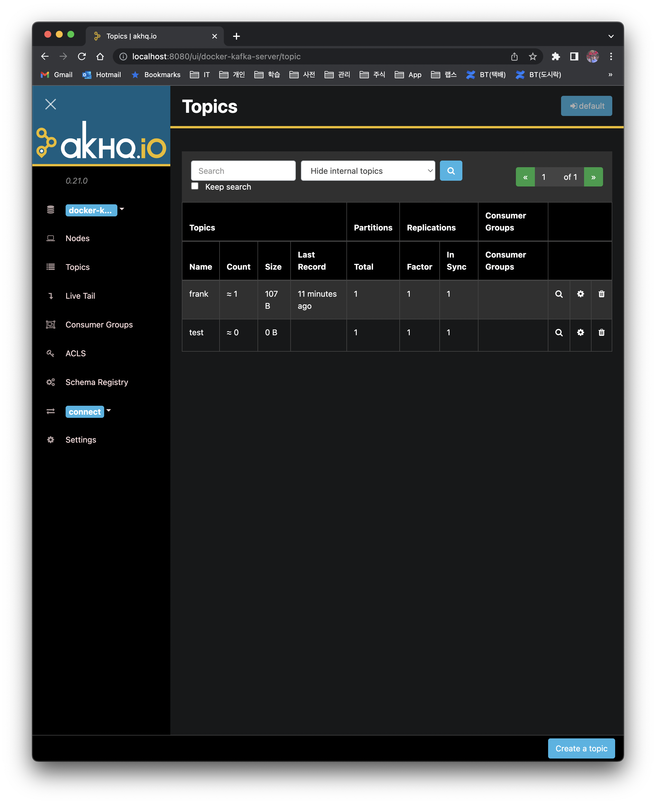

Let's look at how to run Kafka in a local environment. Since my personal MacBook is an M1, the execution instructions are described based on the M1.

# 1. Prerequisites

To run Kafka using the `docker-compose` command, the following conditions must be satisfied. These conditions are basic, so they are not explained further in this post.

- Docker must be running
- `docker-compose` must be installed

# 2. Running Kafka

To make it easy for users to run Kafka, several open source projects provide `docker-compose` or `helm` configuration files. Let's run Kafka using files from a publicly available project.

# 2.1 Running Only the Kafka Components

Run Docker using the `docker-compose.yml` file provided by [wurstmeister](https://github.com/wurstmeister/kafka-docker).

```bash
$ git clone https://github.com/wurstmeister/kafka-docker
$ cd kafka-docker
$ docker-compose up
```

Use the `telnet` command to check whether port `9092` is accessible. You can see `Connected to localhost` printed out, which confirms that the Kafka server is running properly.

```bash
$ telnet localhost 9092
Trying ::1...
Connected to localhost.
Escape character is '^]'.
```

## 2.2 Running Kafka + Akhq (UI) Together

If you only run the Kafka server, then to create and query topics you need to download the kafka binary, run it with kafka commands, and be well-versed in various options. To use and manage Kafka more easily, several Kafka Manager UIs are provided. Among them, let's also run AKHQ, one of the most commonly used ones.

AKHQ already provides a `docker-compose` configuration file, so you can just use this file.

```bash
$ git clone https://github.com/tchiotludo/akhq
$ cd akhq
```

It runs fine with the default settings, but let's also apply the configuration below.

- Add the `platform` option so it can run on the M1 as well
- Add the `ports` setting so the Kafka server can be accessed from the local environment

```bash
$ vim docker-compose.yml
```


```yaml
...omitted...
services:
  akhq:
    platform: linux/x86_64
    image: tchiotludo/akhq
...omitted...

  zookeeper:
    platform: linux/x86_64
...omitted...

  kafka:
    platform: linux/x86_64
    image: confluentinc/cp-kafka
    KAFKA_ADVERTISED_LISTENERS: PLAINTEXT://kafka:9092,PLAINTEXT_HOST://localhost:29092
    KAFKA_LISTENER_SECURITY_PROTOCOL_MAP: PLAINTEXT:PLAINTEXT,PLAINTEXT_HOST:PLAINTEXT
...omitted...
    ports:
      - "29092:29092"
    links:
      - zookeeper

  schema-registry:
    platform: linux/x86_64
    image: confluentinc/cp-schema-registry
...omitted...

  connect:
    platform: linux/x86_64
    image: confluentinc/cp-kafka-connect
...omitted...

  test-data:
    platform: linux/x86_64
...omitted...

  kafkacat:
    platform: linux/x86_64
...omitted...
```

When you run the `docker-compose.yml` provided by AKHQ, the components below are also run together. It's fine to comment out the components you don't use. Since you may use multiple components during development, we'll leave them as is for now. Now let's run Kafka + AKHQ.

- Kafka
- AKHQ
- Kafka Connect
- Schema Registry

```bash
$ docker-compose up
```

Check with the `telnet` command whether the Kafka server is accessible from the local environment.

```bash
$ telnet localhost 29092
Trying ::1...
Connected to localhost.
Escape character is '^]'.
```

To access the AKHQ UI, go to http://localhost:8080.



# References

- https://akhq.io/docs/#installation

- https://github.com/wurstmeister/kafka-docker

- https://towardsdatascience.com/overview-of-ui-tools-for-monitoring-and-management-of-apache-kafka-clusters-8c383f897e80

  

