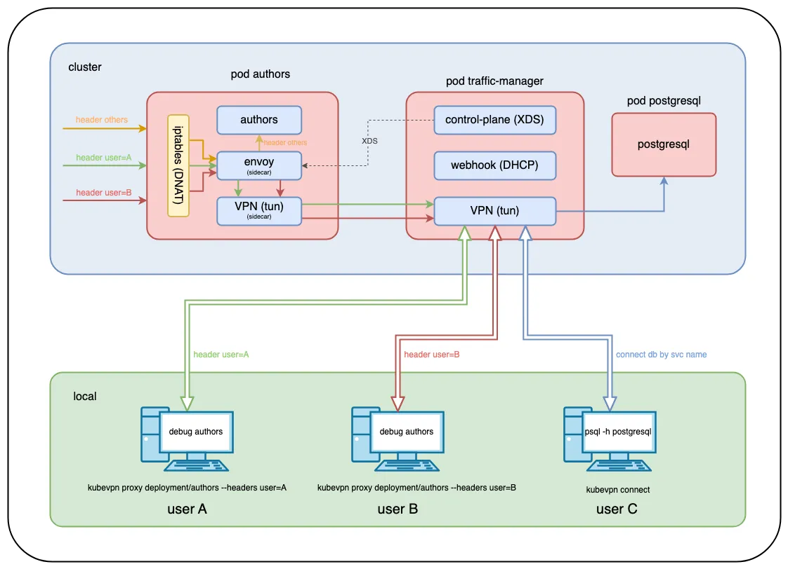

# 1. Overview

## 1.1 What is KubeVPN?

`KubeVPN` is a tool that provides seamless network connectivity between a `Kubernetes` cluster and your local environment. It differs from the traditional port forwarding approach in the following ways.

| Method              | Description                                                  |
| ------------------- | ------------------------------------------------------------ |
| **Port Forwarding** | Forwards a specific port to your local machine to access a single service, but becomes inconvenient when multiple ports or complex network configurations are required |
| **KubeVPN**         | Extends the entire network as if it were inside the cluster, allowing direct use of Pod IPs and native DNS |

## 1.2 KubeVPN's Technical Architecture



`KubeVPN`'s architecture connects the cluster's internal network and your local environment through a VPN tunnel, enabling seamless communication. The main components are as follows.

- **Proxy Pod**: Handles network tunneling inside the cluster
- **VPN Client**: Configured so the local machine can access the cluster network
- **Traffic Routing**: Redirects traffic to the local environment based on conditions such as HTTP headers

## 1.3 Key Features of KubeVPN

1. Direct Cluster Networking

- Direct communication via Pod IP addresses: enables Pod-to-Pod network communication as if inside the cluster
- Native Kubernetes DNS Resolution: lets you use the DNS provided by the cluster as-is

2. Route Traffic from Cluster to Local Machine

- Can redirect traffic to the local environment based on HTTP request header conditions
- Supports network connectivity between the local environment and the cluster for smooth debugging and development

3. Multi-Cluster Connection Support

- Connect multiple `Kubernetes` clusters simultaneously to build a unified network environment

------

# 2. How to Use KubeVPN

> To try out `KubeVPN`, run a k8s cluster locally with Minikube.
> Reference: [Easily Building a Local Kubernetes Cluster on Mac with Minikube](https://blog.advenoh.pe.kr/맥에서-minikube로-로컬-kubernetes-클러스터-쉽게-구축하기/)

Deploy a sample application for testing.

```bash
> kubectl apply -f https://raw.githubusercontent.com/kubenetworks/kubevpn/master/samples/bookinfo.yaml
```

## 2.1 Installing KubeVPN

You can easily install it using `Homebrew`.

```bash
> brew install kubevpn
```

Check the version to confirm it installed correctly.

```bash
> kubevpn version
KubeVPN: CLI
    Version: v2.3.13
    Daemon: unknown
    Image: docker.io/naison/kubevpn:v2.3.13
    Branch: master
    Git commit: brew
    Built time: 2025-02-23 13:42:21
    Built OS/Arch: darwin/arm64
    Built Go version: go1.24.0
```

> 💡 Tip: Setting up an alias. If the `KubeVPN` command feels too long, setting up an `alias` as shown below is convenient.

```bash
> echo 'alias kv="kubevpn"' >> ~/.zshrc
> source ~/.zshrc
> kv version
```

## 2.2 Connecting to a Kubernetes Cluster with KubeVPN

To connect to a `k8s` cluster, run the following command.

```bash
> kubevpn connect
Starting connect
Getting network CIDR from cluster info...
Getting network CIDR from CNI...
Getting network CIDR from services...
Labeling Namespace default
Creating ServiceAccount kubevpn-traffic-manager
Creating Roles kubevpn-traffic-manager
Creating RoleBinding kubevpn-traffic-manager
Creating Service kubevpn-traffic-manager
Creating MutatingWebhookConfiguration kubevpn-traffic-manager
Creating Deployment kubevpn-traffic-manager

Pod kubevpn-traffic-manager-75dc49c46f-bpr5b is Pending...
Container     Reason            Message
control-plane ContainerCreating 
vpn           ContainerCreating 
webhook       ContainerCreating 

Pod kubevpn-traffic-manager-75dc49c46f-bpr5b is Running...
Container     Reason           Message
control-plane ContainerRunning 
vpn           ContainerRunning 
webhook       ContainerRunning 

Forwarding port...
Connected tunnel
Adding route...
Configuring DNS service...
Configured DNS service
+----------------------------------------------------------+
| Now you can access resources in the kubernetes cluster ! |
+----------------------------------------------------------+
```

Check the connection status with `kubevpn status`.

```bash
> kubevpn status
ID    Mode   Cluster    Kubeconfig                 Namespace   Status      Netif
0     full   minikube   /Users/user/.kube/config   default     Connected   utun7
```

## 2.3 Testing Network Status

Check the Pod's IP address and verify the network status with `ping`.

```bash
> kubectl get pod -o wide
NAME                                       READY   STATUS    RESTARTS   AGE     IP           NODE       NOMINATED NODE   READINESS GATES
authors-54bf85cb9c-qcfww                   2/2     Running   0          2m10s   10.244.0.7   minikube   <none>           <none>
details-7ff4648765-b575k                   1/1     Running   0          2m10s   10.244.0.3   minikube   <none>           <none>
kubevpn-traffic-manager-75dc49c46f-8svpd   3/3     Running   0          19s     10.244.0.9   minikube   <none>           <none>
productpage-84bb8d95cc-clvst               1/1     Running   0          2m10s   10.244.0.6   minikube   <none>           <none>
ratings-dbb78b449-tnzzl                    1/1     Running   0          2m10s   10.244.0.4   minikube   <none>           <none>
reviews-56bf74fbdc-8g5q8                   1/1     Running   0          2m10s   10.244.0.5   minikube   <none>           <none>

> ping 10.244.0.3
PING 10.244.0.3 (10.244.0.3): 56 data bytes
64 bytes from 10.244.0.3: icmp_seq=0 ttl=63 time=4.274 ms
64 bytes from 10.244.0.3: icmp_seq=1 ttl=63 time=9.553 ms
```

If you cannot reach service IP addresses, you need to connect with the `--netstack gvisor` option. When the `k8s` cluster's kube-proxy is using `ipvs` mode, access via service IP may fail, so connecting with the above option to use `gVisor` resolves the issue.

```bash
> kubevpn connect --netstack gvisor
```

Reference

- [Can not access Service IP or Service name, but can access Pod IP?](https://kubevpn.dev/docs/faq/5)

# 3. Conclusion

Connecting to multiple pods previously required port forwarding every time, but with `KubeVPN` you can access all pods in the cluster, making development and debugging much smoother.

# 4. References

- [QuickStart - KubeVPN](https://kubevpn.dev/docs/quickstart/)
- [Using port-forward too often? KubeVPN Can help!](https://www.kubeblogs.com/kubevpn-revolutionizing-kubernetes-local-development/)
- [kubevpn github](https://github.com/kubenetworks/kubevpn)
