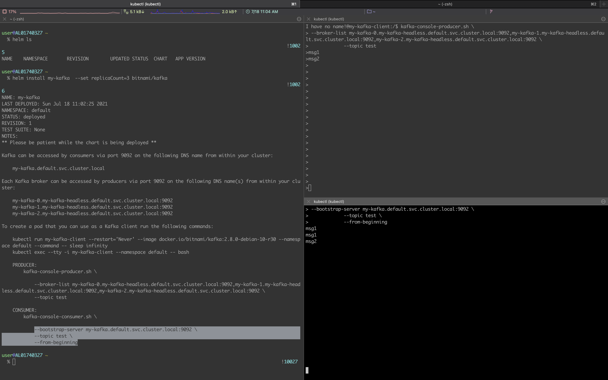

# 1. Introduction

Let's look at how to install Kafka with Helm in a local environment.

# 2. Installing Kafka

## 2.1 Adding the Helm repo and installing with Helm

If Bitnami is not in your Helm Repository, add the repository with the command below. Installing Kafka with the `helm install` command makes the setup quick and simple.

```bash
$ helm repo add bitnami https://charts.bitnami.com/bitnami

# Install kafka
$ helm install my-kafka bitnami/kafka
```


> If you install without additional options, only 1 broker is created by default. To increase the number of brokers, enter the desired count in the `replicateCount` option to install Kafka with multiple brokers.

```bash
$ helm install my-kafka --set replicaCount=3 bitnami/kafka
```

After installation, you can check the installed Kafka with `kubectl` and see that it works fine.

```bash
$ kubectl get all
NAME                       READY   STATUS    RESTARTS   AGE
pod/my-kafka-0             1/1     Running   2          4h11m
pod/my-kafka-zookeeper-0   1/1     Running   1          4h11m

NAME                                  TYPE        CLUSTER-IP      EXTERNAL-IP   PORT(S)                      AGE
service/kubernetes                    ClusterIP   10.96.0.1       <none>        443/TCP                      4d22h
service/my-kafka                      ClusterIP   10.98.229.159   <none>        9092/TCP                     4h11m
service/my-kafka-headless             ClusterIP   None            <none>        9092/TCP,9093/TCP            4h11m
service/my-kafka-zookeeper            ClusterIP   10.107.53.255   <none>        2181/TCP,2888/TCP,3888/TCP   4h11m
service/my-kafka-zookeeper-headless   ClusterIP   None            <none>        2181/TCP,2888/TCP,3888/TCP   4h11m

NAME                                  READY   AGE
statefulset.apps/my-kafka             1/1     4h11m
statefulset.apps/my-kafka-zookeeper   1/1     4h11m
```

# 3. Testing Kafka

After installing Kafka, let's test whether it works properly by simply sending a message to the broker server and checking that we receive the message back from the broker.

## 3.1 Producer - Sending a message to the broker

When you install Kafka with Helm, the terminal kindly tells you how to connect to the Kafka broker and test it after installation. We'll run the same test using the guidance provided.

```bash
# Run a pod for the Kafka client
$ kubectl run my-kafka-client --restart='Never' --image docker.io/bitnami/kafka:2.7.0-debian-10-r109 --namespace default --command -- sleep infinity

# Connect to the kafka client pod
$ kubectl exec --tty -i my-kafka-client --namespace default -- bash
```

Running the `kafka-console-producer.sh` script lets you keep writing messages to the `test` topic. The messages keep accumulating in the broker.

```bash
$ kafka-console-producer.sh \
--broker-list my-kafka-0.my-kafka-headless.default.svc.cluster.local:9092 \
--topic test

hello
world
```


## 3.2 Consumer - Receiving messages from the broker

To receive messages from the broker, connect to the kafka client pod in a separate terminal.

```bash
$ kubectl exec --tty -i my-kafka-client --namespace default -- bash
```

To receive all the messages stored in Kafka so far, use the `--from-beginning` option.

```bash
$ kafka-console-consumer.sh \
--bootstrap-server my-kafka.default.svc.cluster.local:9092 \
--topic test \
--from-beginning
```

# 4. Conclusion

In this post, we easily installed Kafka with a Helm chart and tested sending and receiving messages using the various scripts included in the kafka client pod. Next time, you can run the same test with the `kafkacat` utility command as shown below. Please stay tuned for how to use `kafkacat` in the next post.

```bash
$ kafkacat -b my-kafka.default.svc.cluster.local:9092 -t test -C
```

> The bitnami/kafka image is a non-root Docker image, so it seems you cannot install other packages with root privileges. (If anyone knows a way, please leave a comment.)
>
> For reference, I used a different Docker image to install kafkacat.
>
> $ kubectl run -i --tty ubuntu --image=ubuntu:16.04 --restart=Never -- bash -il
>
> $ apt-get update && apt-get install kafkacat

Let's wrap up with the screen from our test. Great work today :)



# 5. References

- https://artifacthub.io/packages/helm/bitnami/kafka
