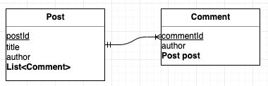

# 1. Introduction

When working with JPA, you will inevitably run into the N+1 problem. Let's look at when the N+1 issue can occur and what methods exist to solve it.

# 2. Development Environment

The code mentioned in this post is available on GitHub.

* OS : Mac OS
* IDE: Intellij
* Java : JDK 1.8
* Source code : [github](https://github.com/kenshin579/tutorials-java/tree/master/springboot-jpa-n1-problem)
* Software management tool : Maven

# 3. The N+1 Problem and How to Solve It

The N+1 problem in JPA can have a major impact on performance, so if you are developing with JPA you should definitely understand it. Let's look at when the N+1 problem can occur.

The `Post` and `Comment` entities are as follows.



## 3.1 Cases Where the N+1 Problem Occurs

### 3.1.1 Changing to Eager Loading (fetchType.EAGER) and Querying with findAll()

The `Post` and `Comment` entities have a many-to-one bidirectional association. The default `fetch` value of the @OneToMany annotation is lazy loading, but if you change it to eager loading the N+1 problem can occur.

```java
@Table(name = "post")
public class Post extends DateAudit {
    @Id
    @GeneratedValue(strategy = GenerationType.IDENTITY)
    @Column(name = "post_id")
    private Long postId;
  
    @JsonIgnore //Prevents infinite loops during JSON conversion
    @OneToMany(mappedBy = "post", fetch = FetchType.EAGER) //Changed to eager loading
    private List<Comment> commentList = new ArrayList<>();
}
```


```java
@Table(name = "comment")
public class Comment extends DateAudit {
    @Id
    @GeneratedValue(strategy = GenerationType.IDENTITY)
    @Column(name = "comment_id")
    private Long commentId;

    //Association mapping
    @ManyToOne(fetch = FetchType.EAGER)
    @JoinColumn(name = "post_id", nullable = false)
    private Post post;
}
```

Let's query all Posts with the `findAll()` method.

```java
@Test
public void test_N1_문제_발생_즉시로딩_하는_경우() throws JsonProcessingException {
  savePostWithComments(4, 2);
  List<Post> posts = postRepository.findAll(); //N+1 occurs
}
```

This creates 4 `Post` entities, each with 2 `Comment` entities, and then queries them with the findAll() method.

If you look at the actual queries that run, the `Post` select query is executed first. Then, to fetch the `Comment` entities for each `Post`, 4 additional queries are issued — one for each `Post`. Issuing queries proportional to the number of records is what we call the **N+1 problem**. The more data there is, the more queries are required, which has a significant impact on performance.

```sql
Hibernate: select post0_.post_id as post_id1_1_, post0_.create_dt as create_d2_1_, post0_.updated_dt as updated_3_1_, post0_.author as author4_1_, post0_.content as content5_1_, post0_.like_count as like_cou6_1_, post0_.title as title7_1_ from post post0_

Hibernate: select commentlis0_.post_id as post_id6_0_0_, commentlis0_.comment_id as comment_1_0_0_, commentlis0_.comment_id as comment_1_0_1_, commentlis0_.create_dt as create_d2_0_1_, commentlis0_.updated_dt as updated_3_0_1_, commentlis0_.author as author4_0_1_, commentlis0_.content as content5_0_1_, commentlis0_.post_id as post_id6_0_1_ from comment commentlis0_ where commentlis0_.post_id=?

Hibernate: select commentlis0_.post_id as post_id6_0_0_, commentlis0_.comment_id as comment_1_0_0_, commentlis0_.comment_id as comment_1_0_1_, commentlis0_.create_dt as create_d2_0_1_, commentlis0_.updated_dt as updated_3_0_1_, commentlis0_.author as author4_0_1_, commentlis0_.content as content5_0_1_, commentlis0_.post_id as post_id6_0_1_ from comment commentlis0_ where commentlis0_.post_id=?

Hibernate: select commentlis0_.post_id as post_id6_0_0_, commentlis0_.comment_id as comment_1_0_0_, commentlis0_.comment_id as comment_1_0_1_, commentlis0_.create_dt as create_d2_0_1_, commentlis0_.updated_dt as updated_3_0_1_, commentlis0_.author as author4_0_1_, commentlis0_.content as content5_0_1_, commentlis0_.post_id as post_id6_0_1_ from comment commentlis0_ where commentlis0_.post_id=?

Hibernate: select commentlis0_.post_id as post_id6_0_0_, commentlis0_.comment_id as comment_1_0_0_, commentlis0_.comment_id as comment_1_0_1_, commentlis0_.create_dt as create_d2_0_1_, commentlis0_.updated_dt as updated_3_0_1_, commentlis0_.author as author4_0_1_, commentlis0_.content as content5_0_1_, commentlis0_.post_id as post_id6_0_1_ from comment commentlis0_ where commentlis0_.post_id=?
```

The quickest way to fix this is to change to lazy loading.

```java
@Table(name = "post")
public class Post extends DateAudit {
    ...(omitted)...
  
    @JsonIgnore //Prevents infinite loops during JSON conversion
    @OneToMany(mappedBy = "post", fetch = FetchType.LAZY) //Changed to LAZY
    private List<Comment> commentList = new ArrayList<>();
}
```

```java
@Transactional
@Test
public void test_N1_문제_발생_지연로딩_하는_경우() throws JsonProcessingException {
savePostWithComments(4, 2);
List<Post> posts = postRepository.findAll(); //N+1 does not occur
}
```

After the change, calling the `findAll()` method only executes the `Post` select query because it uses lazy loading.


```sql
Hibernate: select post0_.post_id as post_id1_1_, post0_.create_dt as create_d2_1_, post0_.updated_dt as updated_3_1_, post0_.author as author4_1_, post0_.content as content5_1_, post0_.like_count as like_cou6_1_, post0_.title as title7_1_ from post post0_
```
With lazy loading, the corresponding select query is issued only when you actually access the values of the `Comment` entities.

```java
log.info("post : {}", posts.get(0).getCommentList()); //The query is executed
```
```sql
Hibernate: select commentlis0_.post_id as post_id6_0_0_, commentlis0_.comment_id as comment_1_0_0_, commentlis0_.comment_id as comment_1_0_1_, commentlis0_.create_dt as create_d2_0_1_, commentlis0_.updated_dt as updated_3_0_1_, commentlis0_.author as author4_0_1_, commentlis0_.content as content5_0_1_, commentlis0_.post_id as post_id6_0_1_ from comment commentlis0_ where commentlis0_.post_id=?
```

As you may have already guessed, querying inside a loop produces the same result as eager loading.

### 3.1.2 Changing to Lazy Loading (LAZY) + Querying in a Loop

After changing the `fetch` of @OneToMany to lazy loading, let's query inside a loop.

```java
@Table(name = "post")
public class Post extends DateAudit {
    ...(omitted)...
  
    @JsonIgnore //Prevents infinite loops during JSON conversion
    @OneToMany(mappedBy = "post", fetch = FetchType.LAZY) //After changing to LAZY
    private List<Comment> commentList = new ArrayList<>();
}
```

```java
@Transactional
@Test
public void test_N1_문제_발생_지연로딩설정_loop으로_조회하는_경우() throws JsonProcessingException {
  savePostWithComments(4, 2);
  List<Post> posts = postRepository.findAll(); //N+1 does not occur

  List<Comment> commentList;
  for (Post post : posts) {
    commentList = post.getCommentList();
    log.info("post author: {}", commentList.size()); //N+1 occurs
  }
}

```

As in [3.1.1](), the same N+1 issue occurs.

```sql
Hibernate: select post0_.post_id as post_id1_1_, post0_.create_dt as create_d2_1_, post0_.updated_dt as updated_3_1_, post0_.author as author4_1_, post0_.content as content5_1_, post0_.like_count as like_cou6_1_, post0_.title as title7_1_ from post post0_

Hibernate: select commentlis0_.post_id as post_id6_0_0_, commentlis0_.comment_id as comment_1_0_0_, commentlis0_.comment_id as comment_1_0_1_, commentlis0_.create_dt as create_d2_0_1_, commentlis0_.updated_dt as updated_3_0_1_, commentlis0_.author as author4_0_1_, commentlis0_.content as content5_0_1_, commentlis0_.post_id as post_id6_0_1_ from comment commentlis0_ where commentlis0_.post_id=?

Hibernate: select commentlis0_.post_id as post_id6_0_0_, commentlis0_.comment_id as comment_1_0_0_, commentlis0_.comment_id as comment_1_0_1_, commentlis0_.create_dt as create_d2_0_1_, commentlis0_.updated_dt as updated_3_0_1_, commentlis0_.author as author4_0_1_, commentlis0_.content as content5_0_1_, commentlis0_.post_id as post_id6_0_1_ from comment commentlis0_ where commentlis0_.post_id=?

Hibernate: select commentlis0_.post_id as post_id6_0_0_, commentlis0_.comment_id as comment_1_0_0_, commentlis0_.comment_id as comment_1_0_1_, commentlis0_.create_dt as create_d2_0_1_, commentlis0_.updated_dt as updated_3_0_1_, commentlis0_.author as author4_0_1_, commentlis0_.content as content5_0_1_, commentlis0_.post_id as post_id6_0_1_ from comment commentlis0_ where commentlis0_.post_id=?

Hibernate: select commentlis0_.post_id as post_id6_0_0_, commentlis0_.comment_id as comment_1_0_0_, commentlis0_.comment_id as comment_1_0_1_, commentlis0_.create_dt as create_d2_0_1_, commentlis0_.updated_dt as updated_3_0_1_, commentlis0_.author as author4_0_1_, commentlis0_.content as content5_0_1_, commentlis0_.post_id as post_id6_0_1_ from comment commentlis0_ where commentlis0_.post_id=?
```

### 3.1.3 The Cause of the N+1 Problem

When you execute an interface method defined in `JpaRepository`, JPA analyzes the method name, generates JPQL, and executes it. JPQL is an object-oriented query language that abstracts SQL; it is not tied to a specific SQL dialect and queries using entity objects and field names.

Now let's look at why N+1 queries are generated and executed when querying with lazy loading + loop.

```java
@Transactional
@Test
public void test_N1_문제_발생_지연로딩설정_loop으로_조회하는_경우() throws JsonProcessingException {
  savePostWithComments(4, 2);
  List<Post> posts = postRepository.findAll(); //(1) N+1 does not occur

  List<Comment> commentList;
  for (Post post : posts) {
    commentList = post.getCommentList();
    log.info("post author: {}", commentList.size()); //(2) N+1 occurs
  }
}
```

(1) When findAll() runs with lazy loading, it queries information related to the `Post` object.

```sql
select post0_.post_id as post_id1_1_, post0_.create_dt as create_d2_1_, post0_.updated_dt as updated_3_1_, post0_.author as author4_1_, post0_.content as content5_1_, post0_.like_count as like_cou6_1_, post0_.title as title7_1_ from post post0_ 
```

(2) When you query the Comment information here, the query for Post has already finished, so it is not generated as a JOIN. It can only query by the Post's ID information, so it generates a JPQL query in the form of where comment.postId=?. Because of this, a query is generated every time, resulting in the issue of running it N times.

```sql
Hibernate: select commentlis0_.post_id as post_id6_0_0_, commentlis0_.comment_id as comment_1_0_0_, commentlis0_.comment_id as comment_1_0_1_, commentlis0_.create_dt as create_d2_0_1_, commentlis0_.updated_dt as updated_3_0_1_, commentlis0_.author as author4_0_1_, commentlis0_.content as content5_0_1_, commentlis0_.post_id as post_id6_0_1_ from comment commentlis0_ where commentlis0_.post_id=?
```


## 3.2 Solutions

Let's look at how to solve the N+1 problem.

### 3.2.1 Using a JPQL Fetch Join - Recommended

By using the fetch join keyword in JPQL, you can query the join target together. When querying `Post`, `p.commentList` is also joined and fetched.

```java
@Repository
public interface PostRepository extends JpaRepository<Post, Long> {
    @Query("select p from Post p left join fetch p.commentList")
    List<Post> findAllWithFetchJoin();
}
```
With lazy loading enabled, using a loop previously caused N+1, but when the `findAllWithFetchJoin()` method runs, it fetches the related targets all at once, so the N+1 issue does not occur.

```java
@Transactional
@Test
public void test_N1_문제_해결방법_fetch_join_사용() {
  savePostWithComments(4, 2);
  List<Post> posts = postRepository.findAllWithFetchJoin(); //Fetched all at once.

  List<Comment> commentList;
  for (Post post : posts) {
    commentList = post.getCommentList();
    log.info("post author: {}", commentList.size()); //N+1 does not occur
  }
}
```

You can also see in the logs that it is fetched with a left outer join.


```sql
Hibernate: select post0_.post_id as post_id1_1_0_, commentlis1_.comment_id as comment_1_0_1_, post0_.create_dt as create_d2_1_0_, post0_.updated_dt as updated_3_1_0_, post0_.author as author4_1_0_, post0_.content as content5_1_0_, post0_.like_count as like_cou6_1_0_, post0_.title as title7_1_0_, commentlis1_.create_dt as create_d2_0_1_, commentlis1_.updated_dt as updated_3_0_1_, commentlis1_.author as author4_0_1_, commentlis1_.content as content5_0_1_, commentlis1_.post_id as post_id6_0_1_, commentlis1_.post_id as post_id6_0_0__, commentlis1_.comment_id as comment_1_0_0__ from post post0_ left outer join comment commentlis1_ on post0_.post_id=commentlis1_.post_id
```

### 3.2.2 Specifying a Batch Size + Eager Loading

Instead of a JPQL fetch join, there is also a method that specifies a batch size. Set the size in the @BatchSize annotation and set the fetch type to eager.

```java
@Table(name = "post")
public class Post extends DateAudit {
 		...(omitted)...
    @JsonIgnore //Prevents infinite loops during JSON conversion
    @BatchSize(size = 2) //Specifies the batch size
    @OneToMany(mappedBy = "post", fetch = FetchType.EAGER) //Changed to eager loading
    private List<Comment> commentList = Lists.newArrayList();
}
```

```sql
@Transactional
@Test
public void test_N1_문제_해결방법_증시로딩설정_loop으로_조회하는_경우() throws JsonProcessingException {
		savePostWithComments(4, 2);
		List<Post> posts = postRepository.findAll(); //Fetched in batch-size chunks
}
```

```sql
Hibernate: select post0_.post_id as post_id1_1_, post0_.create_dt as create_d2_1_, post0_.updated_dt as updated_3_1_, post0_.author as author4_1_, post0_.content as content5_1_, post0_.like_count as like_cou6_1_, post0_.title as title7_1_ from post post0_

Hibernate: select commentlis0_.post_id as post_id6_0_1_, commentlis0_.comment_id as comment_1_0_1_, commentlis0_.comment_id as comment_1_0_0_, commentlis0_.create_dt as create_d2_0_0_, commentlis0_.updated_dt as updated_3_0_0_, commentlis0_.author as author4_0_0_, commentlis0_.content as content5_0_0_, commentlis0_.post_id as post_id6_0_0_ from comment commentlis0_ where commentlis0_.post_id in (?, ?)

Hibernate: select commentlis0_.post_id as post_id6_0_1_, commentlis0_.comment_id as comment_1_0_1_, commentlis0_.comment_id as comment_1_0_0_, commentlis0_.create_dt as create_d2_0_0_, commentlis0_.updated_dt as updated_3_0_0_, commentlis0_.author as author4_0_0_, commentlis0_.content as content5_0_0_, commentlis0_.post_id as post_id6_0_0_ from comment commentlis0_ where commentlis0_.post_id in (?, ?)
```

Each time `findAll()` is called, it fetches in batch-size chunks using a where-in query. If the number exceeds the batch size, an additional query is generated to fetch the rest.

The batch-size approach requires changing the global fetch strategy to eager loading, and it can only fetch as many as the batch size, so it does not perfectly solve the N+1 problem and is therefore not the recommended solution.

# 4. FAQ
# 4.1 What is the default global fetch strategy in JPA?

- Eager loading (EAGER)
    - @OneToOne
    - @ManyToOne
- Lazy loading (LAZY)
    - @OneToMany
    - @ManyToMany

## 4.2 Are there any caveats when using a fetch join?

Fetch joins can query related entities all at once, reducing the number of queries, so they are widely used for performance optimization. However, fetch joins have the following limitations.

Reference - Book: Java ORM Standard JPA Programming

- You cannot use an alias on a fetch join
- You cannot fetch more than one collection
    - Depending on the collection implementation, fetching may be possible, but there are cases where it is not, so caution is needed
- You cannot use the paging API when you fetch-join a collection
    - If you fetch-join a collection and use the paging API, a warning log is left and paging is processed in memory.
        - If there is a lot of data, an out-of-memory exception can occur
    - Collections (one-to-many) cannot use the paging API
        - For single-valued association fields (one-to-one, many-to-one), you can use a fetch join.

# 5. References

- JPA N+1
    - https://cheese10yun.github.io/jpa-nplus-1
    - https://lng1982.tistory.com/298
    - https://tech.wheejuni.com/2018/06/16/jpa-cartesian/
- Book: Java ORM Standard JPA Programming
    - <a href="http://www.yes24.com/Product/Goods/19040233?scode=032&OzSrank=2"></a>
