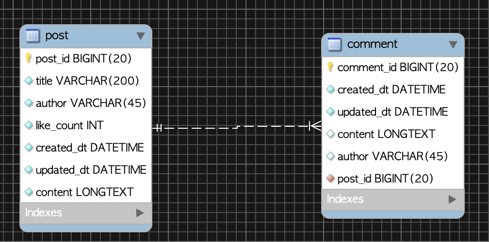
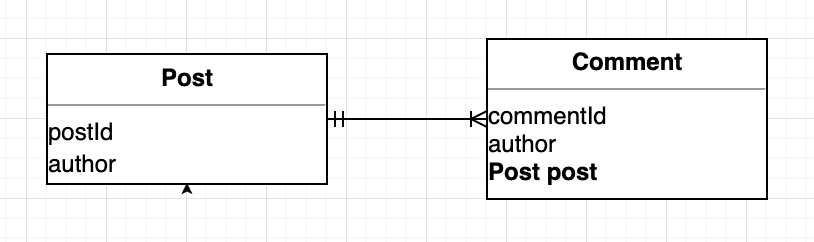
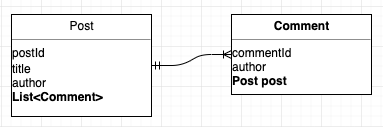
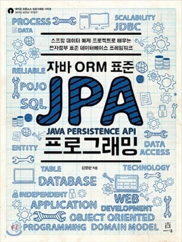
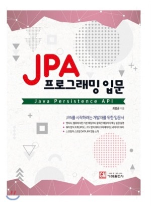

# 1. Introduction

For details on JPA association mapping, please refer to the [JPA Association Mapping Summary](https://blog.advenoh.pe.kr/jpa-연관관계-매핑-정리/) post. In this post, let's look at the many-to-one (N:1) association — the one most frequently used in JPA — and its opposite direction, the one-to-many (1:N) association.

> - Post (one)
> - Comment (many)
    >   - In the table, the foreign key exists on the many side
>   - In a bidirectional relationship, the many side becomes the owner of the association
>



# 2. Development Environment

For the sample code, please refer to the GitHub links below.

* OS : Mac OS
* IDE: Intellij
* Java : JDK 1.8
* Source code : github
    * [Unidirectional](https://github.com/kenshin579/tutorials-java/tree/master/springboot-jpa-many-to-one-unidirectional)
    * [Bidirectional](https://github.com/kenshin579/tutorials-java/tree/master/springboot-jpa-many-to-one-bidirectional)
* Software management tool : Maven

# 3. Many-to-One (N:1) Association

## 3.1 Many-to-One Association

### 3.1.1 Many-to-One Unidirectional

Let's look at the Post and Comment code.



The Post entity has no association-related annotations.

```java
@Getter
@Setter
@Entity
@NoArgsConstructor
@Table(name = "post")
public class Post extends DateAudit {
    @Id
    @GeneratedValue(strategy = GenerationType.IDENTITY)
    @Column(name = "post_id")
    private Long postId;

    private String title;
		...(omitted)...
     
    @Lob
    private String content;
		...(omitted)...
}
```

```java
@Getter
@Setter
@Entity
@NoArgsConstructor
@Table(name = "comment")
public class Comment extends DateAudit {
    @Id
    @GeneratedValue(strategy = GenerationType.IDENTITY)
    @Column(name = "comment_id")
    private Long commentId;
		...(omitted)...

    //Association mapping
    @ManyToOne
    @JoinColumn(name = "post_id")
    private Post post;
  	...(omitted)...
}
```

Only the Comment entity has a Post field, so it establishes a unidirectional relationship with the @ManyToOne annotation.

- @ManyToOne
    - Configures a many-to-one relationship
- @JoinColumn
    - Specifies post_id as the foreign key

The explanation of the JoinColumn and ManyToOne option settings is as follows.

#### 3.1.1.1 Attributes of @JoinColumn

The @JoinColumn annotation is used when mapping a foreign key, and its default attributes are as follows.

| Attribute                                                    | Description                                                  |
| ------------------------------------------------------------ | ------------------------------------------------------------ |
| name                                                         | Used to specify the name of the foreign key to map<br />Default: field name + _ + referenced table's column name (e.g. post_post_id) |
| referenceColumnName                                          | The column name of the target table that the foreign key references<br />Default: the table's primary key column name (e.g. post_id) |
| unique<br />nullable<br />insertable<br />updatable<br />columnDefinition<br />table | Same as the attributes of @Column                            |

#### 3.1.1.2 Attributes of @ManyToOne

The @ManyToOne annotation is used to map a many-to-one association, and the generated query syntax differs slightly depending on its attributes. When querying, you should check via logs how the query is generated.

| Attribute    | Description                                                  |
| ------------ | ------------------------------------------------------------ |
| optional     | If true, it means the object can hold null. <br />Note that even in the @Column annotation, setting nullable=true allows null to be stored<br />Default: true<br />For how the select query is generated depending on the option setting, refer to [FAQ 4.3](https://blog.advenoh.pe.kr/jpa-다대일-many-to-one-연관관계/#43-ManyToOne-옵션-중에-optional-속성이-true-false인-경우에-쿼리-구문이-어떻게-다르게-생성이-되나)<br /> |
| fetch        | If fetchType is EAGER, the related entity is loaded immediately. <br />If fetchType is LAZY, the related entity is not loaded immediately and is loaded when the object is actually accessed<br />Defaults <br />@ManyToOne=FetchType.EAGER<br />@OneToMany=FetchType.LAZY |
| cascade      | Allows you to configure persistence cascade behavior. For the setting values, refer to cascadeType below. |
| targetEntity | Configures the type information of the related entity, but is rarely used. |

#### 3.1.1.3 Values of CascadeType

> Post (parent) -> Comment (child)

The cascade option is a feature you can configure when you want a child entity that is associated to also become persistent when the parent entity becomes persistent. The various values can be configured as follows.

In the Post and Comment relationship, no cascade was configured separately. This is because there may be no Comment when creating a Post.

| Value   | Description                                                  |
| ------- | ------------------------------------------------------------ |
| PERSIST | When the parent entity is saved, the child entity is also saved.         |
| REMOVE  | When the parent entity is deleted, the child entity is also deleted.          |
| DETACH  | When the parent entity becomes detached, the child entity also becomes detached and its changes are not reflected. |
| REFRESH | When the parent entity reloads its data from the DB, the child entity also reloads its data from the DB |
| MERGE   | If the parent entity, while detached, adds/changes a child entity and then the parent entity performs a merge, the child entity's changes are also applied. |
| ALL     | All cascade options are applied.                                |

So far we have looked at the various options you can apply in the ManyToOne annotation. Let's verify in a Unit Test that the entity designed as many-to-one is properly saved and queried.

We create a single Post object and query it to confirm whether it was saved correctly and to check the actual stored value.

```java
@Slf4j
@RunWith(SpringRunner.class)
@DataJpaTest
public class PostRepositoryTest {
    @Autowired
    private PostRepository postRepository;

    @Test
    public void save_post_확인() {
        postRepository.save(Post.builder()
                .title("title1")
                .author("frank")
                .likeCount(5)
                .content("content").build());
        List<Post> posts = postRepository.findAll();
        assertThat(posts.get(0).getTitle()).isEqualTo("title1");
    }
}
```

Let's also save and query the Comment entity. We also create and save a Post object.

```java

@Slf4j
@RunWith(SpringRunner.class)
@DataJpaTest
public class CommentRepositoryTest {
    @Autowired
    private CommentRepository commentRepository;

    @Autowired
    private PostRepository postRepository;

    @Test
    public void save_post_comment_확인() {
        Post post = postRepository.save(Post.builder()
                .title("title")
                .author("postAuthor")
                .likeCount(5)
                .build());

        Comment comment = Comment.builder()
                .author("frank")
                .content("content").build();
        comment.setPost(post);

        commentRepository.save(comment);
        List<Comment> comments = commentRepository.findAll();

        assertThat(comments.get(0).getAuthor()).isEqualTo("frank");
        assertThat(comments.get(0).getPost().getAuthor()).isEqualTo("postAuthor");
    }
}
```

### 3.1.2 Many-to-One Bidirectional

In a many-to-one bidirectional relationship, the Post and Comment entities each have a field that references the other.



Let's look at the Post and Comment code to see how the code changes in the bidirectional case.

```java
@ToString(exclude = "post")
@Entity
@Table(name = "comment")
public class Comment extends DateAudit {
    @Id
    @GeneratedValue(strategy = GenerationType.IDENTITY)
    @Column(name = "comment_id")
    private Long commentId;
		...(omitted)...

    //Association mapping
    @ManyToOne
    @JoinColumn(name = "post_id", nullable = false)
    private Post post; //becomes the owner of the association
		...(omitted)...
}
```

The Comment entity is the same as before.

```java
@Entity
@Table(name = "post")
public class Post extends DateAudit {
    @Id
    @GeneratedValue(strategy = GenerationType.IDENTITY)
    @Column(name = "post_id")
    private Long postId;
  	...(omitted)...

    //Bidirectional association setup
    @JsonIgnore //Prevents infinite loops during JSON conversion
    @OneToMany(mappedBy = "post", fetch = FetchType.LAZY)
    private List<Comment> comments = new ArrayList<>();
		...(omitted)...
}
```
Post -> Comment is a one-to-many relationship, so the @OneToMany annotation is used and it is declared as a List<Comment> comments collection.

#### 3.1.2.1 The Owner of the Association

While a table has only a single foreign key, configuring objects bidirectionally creates two places that manage the foreign key. To have only one side manage it, you need to designate the owner of the association.

In a many-to-one relationship, the many side becomes the owner of the association, so you must specify the owner of the association via the mappedBy attribute value in @OneToMany. In the code, since comments is not the owner of the association, mappedBy is used to declare that the post in the Comment entity is the owner of the association.

- Owner of the association (e.g. Comment.post)
    - The association can be set only here.
        - new Comment().setPost(new Post())
    - The entity manager manages the foreign key only through the owner of the association (e.g. Comment.post)
    - It is reflected in the DB
- Not the owner of the association (e.g. Post.comments)
    - It is managed only in the pure object
        - post.getComments().add(new Comment())
    - It is not reflected in the DB

#### 3.1.2.2 Association Convenience Methods

```java
comment.setPost(post); //(1) Comment -> Post
post.getComments().add(comment); //(2) Post -> Comment - not used during saving
```

When set up bidirectionally, you need to write code like the above so that it is properly reflected not only in the DB but also when saving/querying objects. However, you might mistakenly fail to call post.*getComments*().add(comment), which can break the bidirectional consistency. To prevent this, it is good to write a convenience method so that the association is set without mistakes.

```java
public class Comment extends DateAudit {
	public void setPost(Post post) {
    if (this.post != null) { //Removes the existing post relationship
			this.post.getComments().remove(this);
    }
    this.post = post;
    post.getComments().add(this);
  }
}
```


> A convenience method can be written in just one place or in both. However, if you write it in both places, make sure to add a check condition so that you don't fall into an infinite loop.

```java
public class Comment extends DateAudit {
  	...(omitted)...
    public void setPost(Post post) {
        this.post = post;
        //Check to avoid falling into an infinite loop
        if (!post.getComments().contains(this)) {
            post.getComments().add(this);
        }
    }
}
```

```java
public class Post extends DateAudit {
    ...(omitted)...
    public void addComment(Comment comment) {
        this.comments.add(comment);
        //Check to avoid falling into an infinite loop
        if (comment.getPost() != this) {
            comment.setPost(this);
        }
    }
}
```


## 3.2 Caveats

### 3.2.1 Cases of Falling into an Infinite Loop

With bidirectional mapping, you can fall into an infinite loop, so caution is needed. For example, if Comment.toString() calls getPost(), it can fall into an infinite loop.

- When converting an entity to JSON
    - Refer to [How to Resolve Infinite Recursion in Jackson](https://blog.advenoh.pe.kr/jackson에서-infinite-recursion-이슈-해결방법/)
- When using toString()
    - This can also occur when using the Lombok library, so exclude it with toString(exclude={##, ##})

# 4. FAQ

## 4.1 When should I use bidirectional vs. unidirectional?

You can decide what to use based on your business logic.

- Unidirectional

    - e.g. OrderItem (the product info the customer ordered) -> Product (information about the product)
    - There are many occasions where an order item references information about a product, but a product rarely references an order item, so you can configure it as unidirectional

- Bidirectional

    - e.g. Department -> Employee, Employee -> Department
    - When you want to know which department an employee works in, and you also want to know which employees are in a department, you can configure it as bidirectional

When you are not sure which to use, first use unidirectional mapping, and if you need object-graph navigation in the opposite direction, change it to bidirectional.

## 4.2 When fetch = FetchType.LAZY is set, when is the data loaded and fetched?

- Eager loading
    - The associated entity is always queried immediately. It is fetched at once using a JOIN.
- Lazy loading
    - The associated entity is queried later through a proxy. When the actual associated entity is used, the proxy is initialized and queried from the database.

### 4.2.1 Eager Loading

The @ManyToOne annotation is set with the fetch option default of FetchType.EAGER, so when querying the Comment entity it always fetches the Post object as well.

```java
@Table(name = "comment")
public class Comment extends DateAudit {
		...(omitted)...   
    @ManyToOne
    @JoinColumn(name = "post_id")
    private Post post;
}
```


```java
@Test
public void save_post_comment_확인_eager_loading() throws JsonProcessingException {
  Post post = postRepository.save(Post.builder()
                                  .title("title")
                                  .author("postAuthor")
                                  .likeCount(5)
                                  .build());

  Comment comment = Comment.builder()
    .author("frank")
    .content("content").build();
  comment.setPost(post);

  commentRepository.save(comment);

  Comment foundComment = commentRepository.findById(1L).get(); //At this point it JOINs and also fetches the Post object.
  assertThat(foundComment.getAuthor()).isEqualTo("frank");

  assertThat(foundComment.getPost().getAuthor()).isEqualTo("postAuthor");
}
```

You can confirm that when the findById() method runs, it JOINs Comment and Post to fetch the data.

```sql
select comment0_.comment_id as comment_1_0_0_, comment0_.create_dt as create_d2_0_0_, comment0_.updated_dt as updated_3_0_0_, comment0_.author as author4_0_0_, comment0_.content as content5_0_0_, comment0_.post_id as post_id6_0_0_, post1_.post_id as post_id1_1_1_, post1_.create_dt as create_d2_1_1_, post1_.updated_dt as updated_3_1_1_, post1_.author as author4_1_1_, post1_.content as content5_1_1_, post1_.like_count as like_cou6_1_1_, post1_.title as title7_1_1_ from comment comment0_ inner join post post1_ on comment0_.post_id=post1_.post_id where comment0_.comment_id=?
```


### 4.2.2 Lazy Loading

If you set the fetch option to FetchType.LAZY, the Post entity is not immediately queried from the DB when the Comment entity is queried.

```java
@Table(name = "comment")
public class Comment extends DateAudit {
		...(omitted)...   
    @ManyToOne(fetch=FetchType.LAZY)
    @JoinColumn(name = "post_id")
    private Post post;
}
```

```java
@Transactional
@Test
public void save_post_comment_확인_lazy_loading_test() throws JsonProcessingException {
  Post post = postRepository.save(Post.builder()
                                  .title("title")
                                  .author("postAuthor")
                                  .likeCount(5)
                                  .build());

  Comment comment = Comment.builder()
    .author("frank")
    .content("content").build();
  comment.setPost(post);

  commentRepository.save(comment);

  Comment foundComment = commentRepository.findById(1L).get();
  assertThat(foundComment.getAuthor()).isEqualTo("frank");

  Post foundPost = foundComment.getPost(); //(1) Object-graph navigation
  String author = foundPost.getAuthor(); //(2) Actual use of the Post object
  assertThat(author).isEqualTo("postAuthor");
}
```

At (1), the Post entity is not queried when fetched, and the data comes from the DB when the getAuthor() method, which actually uses the Post object, is called.

> When you call (2), the select statement is not executed, but you can confirm that the author is fetched correctly. Since the queried target already exists in the persistence context, the proxy does not call the DB and instead returns the object directly.

## 4.3 Among the @ManyToOne options, how does the query syntax differ when the optional attribute is true vs. false?

### 4.3.1 @ManyToOne (optional=true) - An Optional Relationship

Since the default is optional=true, the Post object can be null. This also means that with @JoinColumn's nullable=true (the default) attribute, it can be stored as null.

```java
@Table(name = "comment")
public class Comment extends DateAudit {
		...(omitted)...   
    @ManyToOne
    @JoinColumn(name = "post_id")
    private Post post;
}
```

```java
Comment foundComment = commentRepository.findById(1L).get();
```

When you query with a select statement, null may be included, so it is generated as a LEFT OUTER JOIN as shown below.

```sql
Hibernate: select comment0_.comment_id as comment_1_0_0_, comment0_.create_dt as create_d2_0_0_, comment0_.updated_dt as updated_3_0_0_, comment0_.author as author4_0_0_, comment0_.content as content5_0_0_, comment0_.post_id as post_id6_0_0_, post1_.post_id as post_id1_1_1_, post1_.create_dt as create_d2_1_1_, post1_.updated_dt as updated_3_1_1_, post1_.author as author4_1_1_, post1_.content as content5_1_1_, post1_.like_count as like_cou6_1_1_, post1_.title as title7_1_1_ from comment comment0_ left outer join post post1_ on comment0_.post_id=post1_.post_id where comment0_.comment_id=?
```


### 4.3.2 @ManyToOne(optional=false) - A Mandatory Relationship

If you set optional=false, the Post object cannot be null, so it must be included. The same applies when using the @JoinColumn(nullable=false) annotation.

```java
@Table(name = "comment")
public class Comment extends DateAudit {
		...(omitted)...   
    @ManyToOne(optional=false)
    @JoinColumn(name = "post_id")
    private Post post;
}
```
Looking at the select query syntax, it is generated as an INNER JOIN.

```sql
select comment0_.comment_id as comment_1_0_0_, comment0_.create_dt as create_d2_0_0_, comment0_.updated_dt as updated_3_0_0_, comment0_.author as author4_0_0_, comment0_.content as content5_0_0_, comment0_.post_id as post_id6_0_0_, post1_.post_id as post_id1_1_1_, post1_.create_dt as create_d2_1_1_, post1_.updated_dt as updated_3_1_1_, post1_.author as author4_1_1_, post1_.content as content5_1_1_, post1_.like_count as like_cou6_1_1_, post1_.title as title7_1_1_ from comment comment0_ inner join post post1_ on comment0_.post_id=post1_.post_id where comment0_.comment_id=?
```

It is necessary to develop the habit of configuring entity attributes and then checking the query syntax via logs to confirm it is the query you want.

# 5. Summary

We have looked at the many-to-one relationship, the most fundamental of JPA associations. In addition, let's get familiar with one-to-one and many-to-many relationships in the series posts.

# 6. References

- JPA - one-to-many mapping
    - [https://www.callicoder.com/hibernate-spring-boot-jpa-one-to-many-mapping-example/](https://www.callicoder.com/hibernate-spring-boot-jpa-one-to-many-mapping-example/)
    - [https://www.baeldung.com/hibernate-one-to-many](https://www.baeldung.com/hibernate-one-to-many)
    - [https://jdm.kr/blog/141](https://jdm.kr/blog/141)
- ManyToOne options
    - fetch
        - https://victorydntmd.tistory.com/210
    - optional
        - https://feco.tistory.com/102
        - https://whiteship.tistory.com/1152
    - cascade
        - [http://chomman.github.io/blog/java/jpa/programming/jpa-cascadetype-%EC%A2%85%EB%A5%98/](http://chomman.github.io/blog/java/jpa/programming/jpa-cascadetype-종류/)
- LazyInitializationException
    - [https://bebong.tistory.com/entry/JPA-Lazy-Evaluation-LazyInitializationException-could-not-initialize-proxy-%E2%80%93-no-Session](https://bebong.tistory.com/entry/JPA-Lazy-Evaluation-LazyInitializationException-could-not-initialize-proxy-–-no-Session)
- H2 options
    - [https://www.h2database.com/javadoc/org/h2/engine/DbSettings.html](https://www.h2database.com/javadoc/org/h2/engine/DbSettings.html)
- Book: Java ORM Standard JPA Programming
    - <a href="http://www.yes24.com/Product/Goods/19040233?scode=032&OzSrank=2"></a>
- Book: Introduction to JPA Programming
    - <a href="http://www.yes24.com/Product/Goods/41787023?scode=029"></a>
