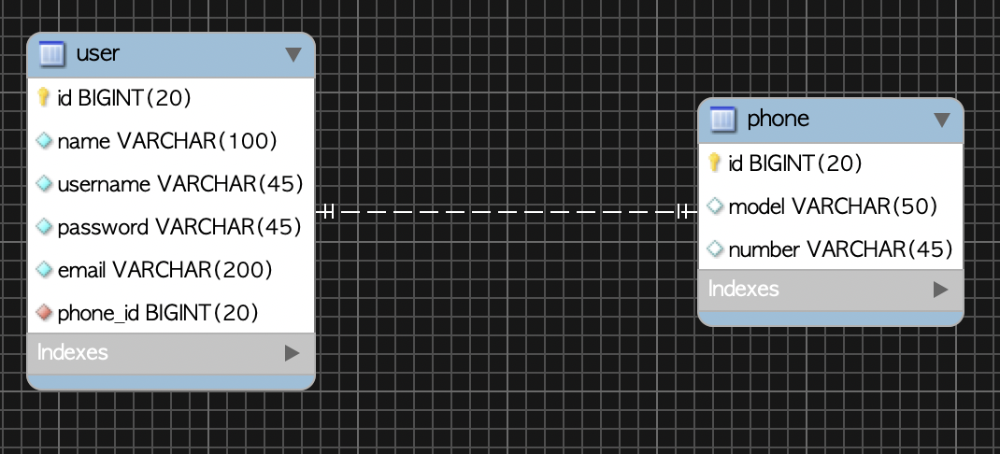
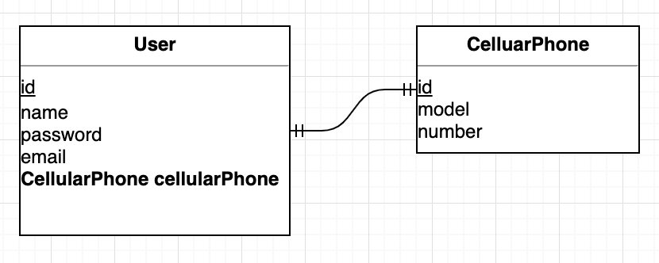
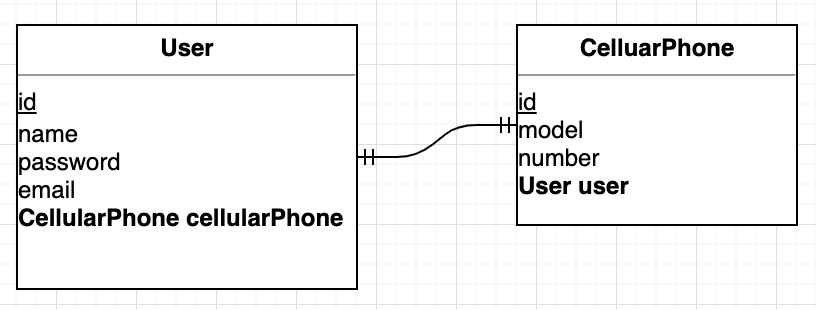
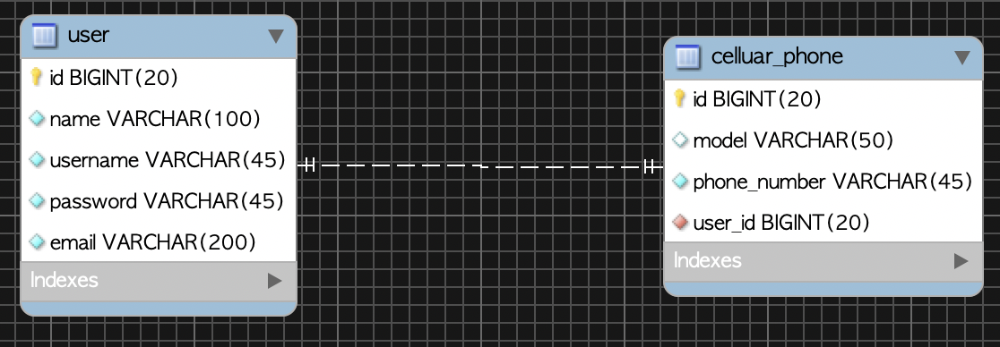

# 1. Introduction

In this post, let's look at one-to-one (1:1) mapping.


# 2. Development Environment

The code written in this post is available on GitHub.

* OS : Mac OS
* IDE: Intellij
* Java : JDK 1.8
* Source code :
    * Foreign key on the owning table
        * [Unidirectional](https://github.com/kenshin579/tutorials-java/tree/master/springboot-jpa-one-to-one-unidirectional)
        * [Bidirectional](https://github.com/kenshin579/tutorials-java/tree/master/springboot-jpa-one-to-one-bidirectional)
    * Foreign key on the target table
        * [Bidirectional](https://github.com/kenshin579/tutorials-java/tree/master/springboot-jpa-one-to-one-bidirectional-target)
* Software management tool : Maven

# 3. One-to-One (1:1) Association

In a one-to-one relationship, the reverse direction is also a one-to-one relationship. In a many-to-one relationship the many (N) side always holds the foreign key, but in a one-to-one relationship you can place the foreign key on either the owning table or the target table, so during development you have to choose which side to put it on.

## 3.1 When the Foreign Key Is on the Owning Table

When the foreign key is on the owning table, you map it with a structure where the owning object also holds an object reference.

- Owning table : `User`
    - When it has the foreign key (phone_id)
- Target table : `CelluarPhone`



### 3.1.1 One-to-One Unidirectional

Let's configure it as one-to-one unidirectional. After declaring @OneToOne on the `User` entity (the owning object), declare the `CellularPhone` object, which is the target table. It is a structure where you can query the user's phone information through the `User` object.



```java
@Table(name = "user")
public class User extends DateAudit {
    @Id
    @GeneratedValue(strategy = GenerationType.IDENTITY)
    @Column(name = "user_id", unique = true, nullable = false)
    private Long id;

    private String username;
    ...(omitted)...

    @OneToOne
    @JoinColumn(name = "id")
    private CellularPhone cellularPhone;
		...(omitted)...
}
```


```java
@Table(name = "cellular_phone")
public class CellularPhone extends DateAudit {
    @Id
    @GeneratedValue(strategy = GenerationType.IDENTITY)
    @Column(name = "phone_id")
    private Long id;

    private String phoneNumber;

    private String model;
		...(omitted)...
}
```

Let's save and query the `User` and `CellularPhone` objects.

```java
@Test
public void save_user_phone() {
  CellularPhone cellularPhone = CellularPhone.builder()
    .model("android")
    .phoneNumber("010-2342-5234")
    .build();
  phoneRepository.save(cellularPhone);

  User user = User.builder()
    .name("Frank")
    .email("sdf@sdf.com")
    .username("id1234")
    .password("1234")
    .build();
  
  user.setCellularPhone(cellularPhone); //Establishes the association

  userRepository.save(user);

  List<User> users = userRepository.findAll();
  assertThat(users.get(0).getName()).isEqualTo("Frank");
  assertThat(users.get(0).getCellularPhone().getPhoneNumber()).isEqualTo("010-2342-5234");
}
```


### 3.1.2 One-to-One Bidirectional

Now let's configure it bidirectionally. We make the `CellularPhone` object also hold a `User` object.



We declare an additional @OneToOne annotation on the `CellularPhone` entity. And since it is bidirectional, we specify the owner of the association with the `mappedBy` attribute. Since the `user` table holds the foreign key, we set `User`'s `cellularPhone` as the owner of the association.

```java
@Table(name = "cellular_phone")
public class CellularPhone extends DateAudit {
    @Id
    @GeneratedValue(strategy = GenerationType.IDENTITY)
    @Column(name = "phone_id")
    private Long id;
  	...(omitted)...

    @OneToOne(mappedBy = "cellularPhone")
    private User user;
}
```

Let's save the entities and query them in a Unit Test.

```java
@Test
public void save_user_phone() {
  CellularPhone cellularPhone = CellularPhone.builder()
    .model("android")
    .phoneNumber("010-2342-5234")
    .build();

  User user = User.builder()
    .name("Frank")
    .email("sdf@sdf.com")
    .username("id1234")
    .password("1234")
    .build();
  user.setCellularPhone(cellularPhone);

  cellularPhone.setUser(user); //Sets the User object from CellularPhone
  userRepository.save(user);
  phoneRepository.save(cellularPhone);

  List<User> users = userRepository.findAll();
  assertThat(users.get(0).getName()).isEqualTo("Frank");
  assertThat(users.get(0).getCellularPhone().getPhoneNumber()).isEqualTo("010-2342-5234");

  assertThat(cellularPhone.getUser().getName()).isEqualTo("Frank"); //Checks the User information from the CellularPhone object
}
```


> **Caveat**
>
> In a one-to-one relationship, even if you configure lazy loading, there are cases where eager loading occurs. For example,
>
> - `User.cellularPhone` : lazy loading works
> - `CellularPhone.user` : lazy loading does not work
    >   - Due to a limitation of proxies, in a one-to-one relationship where the foreign key is not directly managed, eager loading occurs even if you configure lazy loading
>
> For reference, the default fetch type of the @OneToOne annotation is eager loading (EAGER).
>
> ```java
> @Test
> public void 일대일관계에서_지연로딩_테스트() {
> saveUserWithPhones(1, 1);
> 
> List<User> users = userRepository.findAll();
> assertThat(users.get(0).getCellularPhone().getModel()).startsWith("android"); //(1).Works with lazy loading
> 
> List<CellularPhone> phones = phoneRepository.findAll(); //(2).User is also fetched together.
> }
> ```
>
> - (1) You can confirm that lazy loading works well, as the SQL statement is executed when `users.get(0).getCelluarPhone().getModel()` is called
> - (2) Although `CelluarPhone.user` is configured for lazy loading, you can confirm that it is eagerly loaded when `findAll()` is called

## 3.2 When the Foreign Key Is on the Target Table

Let's look at how things change when the foreign key exists not on the owning table but on the target table.

- Owning table : `User`
- Target table : `CellularPhone`
    - When it has the foreign key (user_id)



### 3.2.1 One-to-One Unidirectional

The foreign key is on the `cellular_phone` table, and a one-to-one association like the one below is not supported by JPA, so it cannot be mapped.


### 3.2.2 One-to-One Bidirectional


If you want to place the foreign key on the target table `celluar_phone`, you can configure it as below. Configure the @OneToOne annotation on the `CellularPhone` entity, and in the `User` entity use the @OneToOne annotation with the `mappedBy` attribute to designate `CellularPhone`'s `user`, which owns the foreign key, as the owner of the association.

```java
@Table(name = "cellular_phone")
public class CellularPhone extends DateAudit {
    @Id
    @GeneratedValue(strategy = GenerationType.IDENTITY)
    @Column(name = "phone_id")
    private Long id;
		...(omitted)...

    @OneToOne
    @JoinColumn(name = "id")
    private User user;
		...(omitted)...
}
```


```java

@Table(name = "user")
public class User extends DateAudit {
    @Id
    @GeneratedValue(strategy = GenerationType.IDENTITY)
    @Column(name = "user_id", unique = true, nullable = false)
    private Long id;
		...(omitted)...
          
    @OneToOne(mappedBy = "user")
    private CellularPhone cellularPhone;
		...(omitted)...
}
```

# 4. References

* One-to-one
    * [https://kwonnam.pe.kr/wiki/java/jpa/one-to-one](https://kwonnam.pe.kr/wiki/java/jpa/one-to-one)
    * [https://riptutorial.com/ko/jpa/example/22229/%EC%A7%81%EC%9B%90%EA%B3%BC-%EC%B1%85%EC%83%81-%EA%B0%84%EC%9D%98-%EC%9D%BC%EB%8C%80%EC%9D%BC-%EA%B4%80%EA%B3%84](https://riptutorial.com/ko/jpa/example/22229/직원과-책상-간의-일대일-관계)
    * [https://www.popit.kr/spring-boot-jpa-step-08-onetoone-%EA%B4%80%EA%B3%84-%EC%84%A4%EC%A0%95-%ED%8C%81/](https://www.popit.kr/spring-boot-jpa-step-08-onetoone-관계-설정-팁/)
* Book: Java ORM Standard JPA Programming
    * <a href="http://www.yes24.com/Product/Goods/19040233?	scode=032&OzSrank=2"></a>
