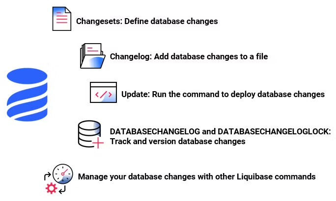
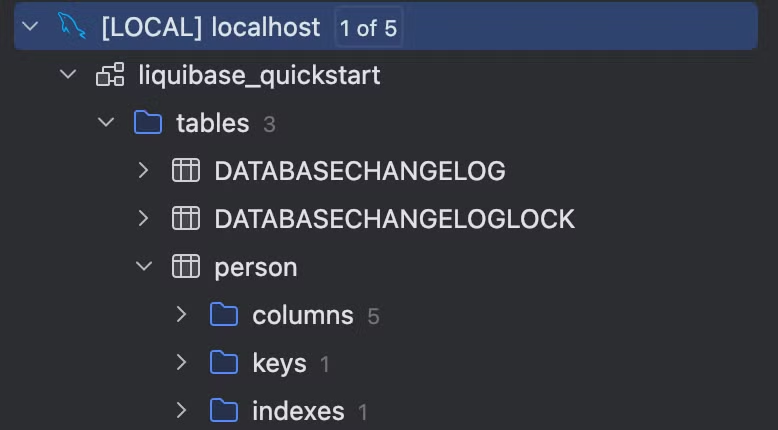

# 1. Overview

> A colleague I work with applied this to a project we are currently developing, so I'm organizing my notes for study purposes.

`Liquibase` is an open-source tool that helps you track and manage database changes. This tool records database schema changes and is used to maintain consistency by tying them to application deployments. `Liquibase` is advantageous for multiple teams collaborating to manage a database in a consistent way, and it provides powerful features that let you manage the state of your database just like you manage code versions.

In particular, `Liquibase` is a database migration tool that lets you record and roll back database changes in various ways. The basic principle of `Liquibase` is to keep the file that defines the changes (`Changelog`) in sync with the environment (DB) where they will be executed.

## 1.1 Key Features

- Automatic migration
  - `Liquibase` applies changes automatically and automatically updates the database state
- Rollback feature
  - It provides a rollback feature to undo incorrect changes - available only in the paid version
  - In the free version, the user must write the rollback script themselves. We have ChatGPT, so it should be fine
- Support for various formats
  - You can manage database changes in various formats such as `XML`, `SQL`, `YAML`, and `JSON`
- Database independence
  - `Liquibase` supports various database systems (`MySQL`, `PostgreSQL`, `Oracle`, `SQL Server`, etc.), so you can apply the same changes to multiple databases
- Database change history tracking
  - `Liquibase` can track when, who, and what change was applied

## 1.2 Basic Concepts

`Liquibase` uses the following elements as core concepts for database change management.

### 1.2.1 Terminology

1. `Changelog`
   - A file that gathers multiple `changeset`s to manage the database schema change history; an `XML`, `YAML`, `JSON`, or `SQL` file
   - It records the database change history and tracks when each `changeset` was applied
2. `Changeset`
   - A block describing a specific change (a unit of work) to apply to the database
   - It describes a single change operation to apply to the database, and each `changeset` has a unique ID, an author, and the relevant change
   - e.g. adding a table, modifying a column, adding an index, etc.
3. `Changetype`
   - The type of concrete database change operation to execute within each `changeset`
   - It defines the type of change to apply to the database's schema or data
   - e.g. `createTable`, `addColumn`, `dropColumn`, `insert`, etc.

### 1.2.2 Basic Operating Principle

The basic operation of managing SQL using `Liquibase` is as follows.

1. Write `Changelog` and `Changeset` files
   - Write a `Changelog` file that records the database schema changes. This file contains the `Changeset`s to apply to the database
2. Apply them to the DB with the Liquibase CLI
   - Use the `liquibase update` command to apply the written `Changeset`s to the database. `Liquibase` first checks the database's `DATABASECHANGELOG` table to identify already-applied changesets, and executes only new changesets
   - When a `Changeset` runs successfully, `Liquibase` saves that record in the `DATABASECHANGELOG` table. This prevents already-applied `Changeset`s from being executed again
3. In the case of a Rollback
   - To undo an incorrect change, use the `rollback` command to restore the database to its state at a specific point in time



# 2. Installing the Liquibase CLI

## 2.1 Installing the CLI

> The installation is explained based on macOS.

Use Homebrew to install `Liquibase` easily.

```bash
> brew install liquibase
```

## 2.2 Running a MySQL Docker Container for Practice

For practice, run a MySQL Docker container and create a database.

```bash
> cd cloud/docker/mysql
make mysql-create
```

Log in to the DB server and create the database below.

```sql
> create database liquibase_quickstart;
```

# 3. Basic Liquibase Usage

To use `Liquibase`, follow the steps below.

- Create a liquibase.properties file and enter the DB connection information
- Create a `Changelog` file
- Apply the `Changelog` to the DB with a Liquibase CLI command

## 3.1 Creating a Project

### 3.1.1 (Optional) Generating with the init project Command

The `init project` command generates `Liquibase` sample files. Some of these files are usable only in the paid version, so there is no real need to use this command. I'm adding it for study purposes, to show what kind of command it is.

```bash
mkdir quickstart
❯ cd quickstart
> liquibase init project
...omitted...
Setup new liquibase.properties, flowfile, and sample changelog? Enter (Y)es with defaults, yes with (C)ustomization, or (N)o. [Y]: 
c
Enter a relative path to desired project directory [./]: 

Enter name for sample changelog file to be created or (s)kip [example-changelog]: 

Enter your preferred changelog format (options: sql, xml, json, yml, yaml) [sql]: 

Enter name for defaults file to be created or (s)kip [liquibase.properties]: 

Enter the JDBC url without username or password to be used (What is a JDBC url? <url>) [jdbc:h2:tcp://localhost:9090/mem:dev]: 
jdbc:mysql://localhost:3306/liquibase_quickstart
Enter username to connect to JDBC url [dbuser]: 
root
Enter password to connect to JDBC url [letmein]: 
go-mysql
Setting up new Liquibase project in '/Users/user/GolandProjects/tutorials-go/liquibase/quickstart/.'...

Created example changelog file '/Users/user/GolandProjects/tutorials-go/liquibase/quickstart/example-changelog.sql'
Created example defaults file '/Users/user/GolandProjects/tutorials-go/liquibase/quickstart/liquibase.properties'
Created example flow file '/Users/user/GolandProjects/tutorials-go/liquibase/quickstart/liquibase.advanced.flowfile.yaml'
Created example flow file '/Users/user/GolandProjects/tutorials-go/liquibase/quickstart/liquibase.flowvariables.yaml'
Created example flow file '/Users/user/GolandProjects/tutorials-go/liquibase/quickstart/liquibase.endstage.flow'
Created example flow file '/Users/user/GolandProjects/tutorials-go/liquibase/quickstart/liquibase.flowfile.yaml'
Created example checks package '/Users/user/GolandProjects/tutorials-go/liquibase/quickstart/liquibase.checks-package.yaml'

To use the new project files make sure your database is active and accessible and run "liquibase update".
For more details, visit the Getting Started Guide at <https://docs.liquibase.com/start/home.html>
Liquibase command 'init project' was executed successfully.
```

### 3.1.2 Creating It Manually

The directory structure of a `Liquibase` project can be organized as shown below. For details on structuring a `Liquibase` project, please refer to [Design Your Liquibase Project](https://docs.liquibase.com/start/design-liquibase-project.html).

```bash
❯ tree .
.
├── db
│   └── changelog
│       ├── 1_init.sql
│       └── changelog.yaml
├── liquibase.properties
```

## 3.2 Configuring Liquibase

To use `Liquibase`, you must write a configuration file so that it can connect to the database. Create a `liquibase.properties` file and configure it as shown below.

```bash
changeLogFile=changelog.yaml
liquibase.command.url=jdbc:mysql://localhost:3306/liquibase_quickstart
liquibase.command.username=root
liquibase.command.password=password
classpath=lib/mysql-connector-j-8.0.33.jar
```

> The mysql connector jar file can be downloaded from the [[mysql.com](http://mysql.com)](http://mysql.comhttps://downloads.mysql.com/archives/c-j/) site

# 4. Creating a SQL Changelog

In `Liquibase`, you write a Changelog file to record database changes. The format of a `Changelog` can be `SQL`, `XML`, `JSON`, or `YAML` so that it is not tied to a specific database. Here, we write the `Changelog` in `yaml` and write the `Changeset` in SQL syntax, which is familiar to developers.

```yaml
databaseChangeLog:
  - include:
      file: db/changelog/1_init.sql
--liquibase formatted sql

--changeset your.name:1 labels:example-label context:example-context
--comment: example comment
create table person
(
    id       int primary key auto_increment not null,
    name     varchar(50)                    not null,
    address1 varchar(50),
    address2 varchar(50),
    city     varchar(30)
);
--rollback DROP TABLE person;
```

This `Changeset` follows the formatted SQL approach and includes the following details.

- `--liquibase formatted sql`
  - This comment specifies that the file is a Liquibase formatted SQL file. Every Liquibase formatted SQL file must start with this comment
  
- `--changeset your.name:1 labels:example-label context:example-context`
  - `your.name` is the name of the Changeset author and `1` is the unique ID of the Changeset. The combination of the same author name and ID must be unique within the project
  - `labels`: You can filter Changesets using a specific label, e.g. if you use a label called `example-label`, you can later run only the Changesets tagged with that specific label
  - `context`: Defines the specific context in which the Changeset runs. Here it is defined as `example-context`, and the Changeset runs only in that context
  
- `--comment: example comment`
  - A comment that lets you add a description for the Changeset. In this example, a simple description `example comment` is included
  
- `--rollback DROP TABLE person;`
  - This comment defines the SQL statement to execute when rolling back the Changeset

Reference

- [Example Changelogs: SQL Format](https://docs.liquibase.com/concepts/changelogs/sql-format.html)

## 4.1 Applying the Changelog to the DB

To apply the written `Changelog` to the DB, run a `Liquibase` command. You can use Docker or run the `Liquibase` command directly.

### 4.1.1 Running with the Liquibase Command

```sql
❯ liquibase --defaultsFile=liquibase.properties update
...omitted...
Running Changeset: db/changelog/1_init.sql::1::your.name

UPDATE SUMMARY
Run:                          1
Previously run:               0
Filtered out:                 0
-------------------------------
Total change sets:            1

Liquibase: Update has been successful. Rows affected: 1
Liquibase command 'update' was executed successfully.
```

When you run the `update` command, it references the `Changelog` file specified in the configuration file and applies not-yet-applied changes (`Changeset`s) to the database. On the first run, you can confirm that Liquibase-related tables are also created.



### 4.1.2 Running the Liquibase Command with Docker

Running it with Docker lets you easily run `Liquibase` without a separate installation process, but a few caveats are needed.

- To run `Liquibase` in a Docker environment, you must configure the MySQL and `Liquibase` containers so that they can communicate with each other

```yaml
# Create a Docker network
> docker network create mysql-network

# Connect the mysql container to the created network
> docker network connect mysql-network go-mysql
```

Through the above process, the MySQL container (`go-mysql`) and the `Liquibase` container can communicate on the same network.

- You need to configure the MySQL address in the [liquibase.properties](http://liquibase.properties) file

Inside a Docker container, `localhost` refers to each container itself. Therefore, to access the container where MySQL is running, you must specify the name of the MySQL container as the address. e.g. `go-mysql`

```yaml
liquibase.command.url=jdbc:mysql://go-mysql:3306/liquibase_quickstart
```

You can run Liquibase with Docker using the command below.

```bash
> docker run --rm --network mysql-network \\
  -v $(pwd):/liquibase/changelog \\
  -e INSTALL_MYSQL=true \\
  liquibase/liquibase \\
  --log-level=info \\
  --defaultsFile=/liquibase/changelog/liquibase.docker.properties update
```

- `--rm`: Automatically removes the container after it runs
- `--network mysql-network`: Uses the `mysql-network` network created earlier so that MySQL and Liquibase can communicate
- `-v $(pwd):/liquibase/changelog`: Mounts the current directory (`$(pwd)`) to the `/liquibase/changelog` path inside the Docker container
- `-e INSTALL_MYSQL=true`: Installs the MySQL JDBC driver inside the container
- `--defaultsFile`: Specifies the Liquibase configuration file (`liquibase.docker.properties`)
- `update`: The Liquibase command that applies changes to the database

# 5. Liquibase Commands

`Liquibase` provides various commands, as shown below. I'll organize the ones that seem likely to be used frequently. For more details, please refer to Liquibase Commands.

## 5.1 Update Commands

The `update` command of `Liquibase` is the basic command that applies changes to the database. However, the `update` command has several useful variations tailored to different situations.

- `update-sql` : Outputs the changes to a SQL file without actually applying them to the database. With this command, you can review the changes in advance or apply them manually

```bash
> liquibase --defaultsFile=liquibase.properties update-sql
...omitted...
--  Lock Database
UPDATE liquibase_quickstart.DATABASECHANGELOGLOCK SET `LOCKED` = 1, LOCKEDBY = 'MacBook-Pro-1647.local (172.30.1.5)', LOCKGRANTED = NOW() WHERE ID = 1 AND `LOCKED` = 0;

--  *********************************************************************
--  Update Database Script
--  *********************************************************************
--  Change Log: db/changelog/changelog.yaml
--  Ran at: 24. 9. 20. 오후 2:54
--  Against: root@172.17.0.1@jdbc:mysql://localhost:3306/liquibase_quickstart
--  Liquibase version: 4.29.1
--  *********************************************************************

--  Changeset db/changelog/2_insert.sql::2::your.name
INSERT INTO liquibase_quickstart.person (id, name, address1, address2, city) VALUES (1, 'John Doe', '123 Main St', 'Apt 1', 'Beverly Hills');

INSERT INTO liquibase_quickstart.DATABASECHANGELOG (ID, AUTHOR, FILENAME, DATEEXECUTED, ORDEREXECUTED, MD5SUM, `DESCRIPTION`, COMMENTS, EXECTYPE, CONTEXTS, LABELS, LIQUIBASE, DEPLOYMENT_ID) VALUES ('2', 'your.name', 'db/changelog/2_insert.sql', NOW(), 2, '9:ac8dc4edceb0733373ac291b4a1bf9be', 'sql', '', 'EXECUTED', NULL, NULL, '4.29.1', '6811656895');

--  Release Database Lock
UPDATE liquibase_quickstart.DATABASECHANGELOGLOCK SET `LOCKED` = 0, LOCKEDBY = NULL, LOCKGRANTED = NULL WHERE ID = 1;

Liquibase command 'update-sql' was executed successfully.
```

- `update-count-sql`: Outputs a specific number of `Changeset`s to a SQL file so that you can review them without applying them directly to the database

```bash
> liquibase --defaultsFile=liquibase.properties update-count-sql 2
```

- `update-count` : Applies the specified number of changes (`Changeset`s) from the `Changelog` file to the database. This command is useful when you want to apply changes partially

```bash
> liquibase --defaultsFile=liquibase.properties update-count 2
```

## 5.2 Rollback Commands

The `rollback` command of `Liquibase` provides the ability to revert database changes to a previous state. You can perform rollbacks in various ways based on specific conditions.

- `rollback` : Rolls back all `Changeset`s up to a specific condition (tag, date, etc.). This lets you restore the database to a specified previous state

```bash
> liquibase --defaultsFile=liquibase.properties rollback --tag v1.0
```

- `rollback-sql` : Without performing the actual rollback, it outputs the SQL script needed for the rollback so that you can review the changes in advance, which is why it is used frequently


```bash
> liquibase --defaultsFile=liquibase.properties rollback-sql v1.0
...omitted...
--  Lock Database
UPDATE liquibase_quickstart.DATABASECHANGELOGLOCK SET `LOCKED` = 1, LOCKEDBY = 'MacBook-Pro-1647.local (172.30.1.5)', LOCKGRANTED = NOW() WHERE ID = 1 AND `LOCKED` = 0;

--  *********************************************************************
--  Rollback to 'v1.0' Script
--  *********************************************************************
--  Change Log: db/changelog/changelog.yaml
--  Ran at: 24. 9. 20. 오후 6:07
--  Against: root@172.17.0.1@jdbc:mysql://localhost:3306/liquibase_quickstart
--  Liquibase version: 4.29.1
--  *********************************************************************

--  Rolling Back ChangeSet: db/changelog/3_update.sql::3::your.name
ALTER TABLE liquibase_quickstart.person DROP COLUMN zip;

DELETE FROM liquibase_quickstart.DATABASECHANGELOG WHERE ID = '3' AND AUTHOR = 'your.name' AND FILENAME = 'db/changelog/3_update.sql';

--  Rolling Back ChangeSet: db/changelog/2_insert.sql::2::your.name
DELETE FROM liquibase_quickstart.person WHERE id = 1;

DELETE FROM liquibase_quickstart.DATABASECHANGELOG WHERE ID = '2' AND AUTHOR = 'your.name' AND FILENAME = 'db/changelog/2_insert.sql';

--  Release Database Lock
UPDATE liquibase_quickstart.DATABASECHANGELOGLOCK SET `LOCKED` = 0, LOCKEDBY = NULL, LOCKGRANTED = NULL WHERE ID = 1;

Liquibase command 'rollback-sql' was executed successfully.
```

- `rollbackCount` : Rolls back the specified number of `Changeset`s

```bash
> liquibase --defaultsFile=liquibase.properties rollbackCount 1
...omitted...
Rolling Back Changeset: db/changelog/3_update.sql::3::your.name
Liquibase command 'rollbackCount' was executed successfully.
```

## 5.3 Database Inspection Commands

Commands used to check or compare the current state of the database.

- `diff` : Useful for comparing the actual server's DB state with the `Changelog` you want to apply. Before actually applying a new `Changelog` to the server, it is good to check in advance whether there is a difference from the server

```bash
# For testing, arbitrarily add a new column to the liquibase_quickstart_ref.person table
sql> alter table person
    add address3 varchar(30) null comment 'test' after address2;

# Compare the two databases
> liquibase --defaultsFile=liquibase.properties \\
	--referenceUrl=jdbc:mysql://localhost:3306/liquibase_quickstart_ref \\
	--referenceUsername=root \\
	--referencePassword=password \\
	diff
...omitted...
	Diff Results:
Reference Database: root@172.17.0.1 @ jdbc:mysql://localhost:3306/liquibase_quickstart_ref (Default Schema: liquibase_quickstart_ref)
Comparison Database: root@172.17.0.1 @ jdbc:mysql://localhost:3306/liquibase_quickstart (Default Schema: liquibase_quickstart)
Compared Schemas: liquibase_quickstart_ref -> liquibase_quickstart
Product Name: EQUAL
Product Version: EQUAL
Missing Catalog(s): NONE
Unexpected Catalog(s): NONE
Changed Catalog(s): NONE
Missing Column(s): 
     liquibase_quickstart_ref.person.address3
Unexpected Column(s): NONE
Changed Column(s): 
     liquibase_quickstart_ref.person.city
          order changed from '6' to '5'
Missing Foreign Key(s): NONE
Unexpected Foreign Key(s): NONE
Changed Foreign Key(s): NONE
Missing Index(s): NONE
Unexpected Index(s): NONE
Changed Index(s): NONE
Missing Primary Key(s): NONE
Unexpected Primary Key(s): NONE
Changed Primary Key(s): NONE
Missing Table(s): NONE
Unexpected Table(s): NONE
Changed Table(s): NONE
Missing Unique Constraint(s): NONE
Unexpected Unique Constraint(s): NONE
Changed Unique Constraint(s): NONE
Missing View(s): NONE
Unexpected View(s): NONE
Changed View(s): NONE
Liquibase command 'diff' was executed successfully.
```

- `diff-changelog` : Generates a `Changelog` file for the differences between two databases

```bash
> liquibase --defaultsFile=liquibase.properties \\
	--changeLogFile=changelog.mysql.sql \\
	--referenceUrl=jdbc:mysql://localhost:3306/liquibase_quickstart_ref \\
	--referenceUsername=root \\
	--referencePassword=password \\
	diff-changelog
...omitted...
BEST PRACTICE: The changelog generated by diffChangeLog/generateChangeLog should be inspected for correctness and completeness before being deployed. Some database objects and their dependencies cannot be represented automatically, and they may need to be manually updated before being deployed.
Liquibase command 'diff-changelog' was executed successfully.
```

If you check the `changelog.mysql.sql` file that `Liquibase` generated, you'll see it generates it nicely as shown below.

```bash
...omitted...
-- liquibase formatted sql

-- changeset user:1726817103402-1
ALTER TABLE person
    ADD address3 VARCHAR(30) NULL COMMENT 'test';
```

## 5.4 Change Tracking Commands

The Change Tracking commands of `Liquibase` are used to track the changes applied to the database, check the current state, or generate a record of changes.

- `history` : With this command, you can track what change was applied and when

```bash
> liquibase --defaultsFile=liquibase.properties history
...omitted...
Liquibase History for jdbc:mysql://localhost:3306/liquibase_quickstart

+---------------+--------------------+-------------------------+------------------+--------------+------+
| Deployment ID | Update Date        | Changelog Path          | Changeset Author | Changeset ID | Tag  |
+---------------+--------------------+-------------------------+------------------+--------------+------+
| 6731865868    | 24. 9. 19. 오전 7:44 | db/changelog/1_init.sql | your.name        | 1            | v1.0 |
+---------------+--------------------+-------------------------+------------------+--------------+------+

Liquibase command 'history' was executed successfully.
```

- `status` : You can check whether there are `Changeset`s that have not been applied to the database

```bash
> liquibase --defaultsFile=liquibase.properties status
...omitted...
2 changesets have not been applied to root@172.17.0.1@jdbc:mysql://localhost:3306/liquibase_quickstart
     db/changelog/2_insert.sql::2::your.name
     db/changelog/3_update.sql::3::your.name
Liquibase command 'status' was executed successfully.
```

- `generate-changelog` : Generates a new `Changelog` file based on the current schema state of the database. It is useful when you first switch to `Liquibase`
  - The format to generate is determined by the file name. If you want to generate it as yaml, run it with `--changeLogFile=changelog.yaml`

```bash
> liquibase --defaultsFile=liquibase.properties \\
	--changeLogFile=changelog.mysql.sql \\
	generate-changelog

BEST PRACTICE: The changelog generated by diffChangeLog/generateChangeLog should be inspected for correctness and completeness before being deployed. Some database objects and their dependencies cannot be represented automatically, and they may need to be manually updated before being deployed.

BEST PRACTICE: When generating formatted SQL changelogs, always check if the 'splitStatements' attribute
works for your environment. See <https://docs.liquibase.com/commands/inspection/generate-changelog.html> for more information. 

Generated changelog written to changelog.mysql.sql
Liquibase command 'generate-changelog' was executed successfully.
```

## 5.5 Utility Commands

`Liquibase` provides utility commands that let you manage the database state and track changes.

- `tag` : Assigns a tag to the current database state so that you can roll back to that point later. Set a tag at a specific deployment or an important change point

```bash
> liquibase --defaultsFile=liquibase.properties tag v1.0
```

- `validate` :  Checks the structure or syntax errors of the `changelog` file to verify whether there are problems before applying changes. The validation check prevents an incorrect `Changeset` from being applied

```bash
> liquibase --defaultsFile=liquibase.properties validate
...omitted...
No validation errors found.
Liquibase command 'validate' was executed successfully.
```

- `changelog-sync` : Used to manually synchronize the changelog file with the state of Liquibase's tables. It records already-applied `Changeset`s in the database, but does not actually apply the changes in the `Changelog`

```bash
> liquibase --defaultsFile=liquibase.properties changelog-sync
```

- `changelog-sync-sql` : Performs the same function as the `changelog-sync` command, but instead of running the actual synchronization, it outputs the corresponding SQL statements. With this, you can review the SQL in advance or run it manually

```bash
> liquibase --defaultsFile=liquibase.properties changelog-sync-sql
...omitted...
--  Lock Database
UPDATE liquibase_quickstart.DATABASECHANGELOGLOCK SET `LOCKED` = 1, LOCKEDBY = 'MacBook-Pro-1647.local (172.30.1.5)', LOCKGRANTED = NOW() WHERE ID = 1 AND `LOCKED` = 0;

--  *********************************************************************
--  SQL to add all changesets to database history table
--  *********************************************************************
--  Change Log: db/changelog/changelog.yaml
--  Ran at: 24. 9. 20. 오후 4:17
--  Against: root@172.17.0.1@jdbc:mysql://localhost:3306/liquibase_quickstart
--  Liquibase version: 4.29.1
--  *********************************************************************

INSERT INTO liquibase_quickstart.DATABASECHANGELOG (ID, AUTHOR, FILENAME, DATEEXECUTED, ORDEREXECUTED, MD5SUM, `DESCRIPTION`, COMMENTS, EXECTYPE, CONTEXTS, LABELS, LIQUIBASE, DEPLOYMENT_ID) VALUES ('2', 'your.name', 'db/changelog/2_insert.sql', NOW(), 2, '9:ac8dc4edceb0733373ac291b4a1bf9be', 'sql', '', 'EXECUTED', NULL, NULL, '4.29.1', '6816665001');

INSERT INTO liquibase_quickstart.DATABASECHANGELOG (ID, AUTHOR, FILENAME, DATEEXECUTED, ORDEREXECUTED, MD5SUM, `DESCRIPTION`, COMMENTS, EXECTYPE, CONTEXTS, LABELS, LIQUIBASE, DEPLOYMENT_ID) VALUES ('3', 'your.name', 'db/changelog/3_update.sql', NOW(), 3, '9:5ce7a1f50046b2f71d0696d52d6e7c1c', 'sql', '', 'EXECUTED', NULL, NULL, '4.29.1', '6816665001');

--  Release Database Lock
UPDATE liquibase_quickstart.DATABASECHANGELOGLOCK SET `LOCKED` = 0, LOCKEDBY = NULL, LOCKGRANTED = NULL WHERE ID = 1;

Liquibase command 'changelog-sync-sql' was executed successfully.
```

# 6. FAQ

## 6.1 What is the difference between `context` and `label`?

`Context` and `Label` are both features in `Liquibase` that define the environment or condition under which a specific `Changeset` is applied, but their purposes differ slightly.

- `Context` :  Used to apply a `Changeset` tailored to a specific environment (development, test, production, etc.). e.g. if you specify `--contexts=dev`, that `Changeset` runs only in the dev environment

```sql
--changeset author:1 context:dev
CREATE TABLE example_dev (id INT PRIMARY KEY);
# Only the part defined with the dev environment context runs
> liquibase --defaultsFile=liquibase.properties --contexts=dev update
```

- `Label` : Used to distinguish `Changeset`s like tags and run them under specific conditions. You can logically group multiple `Changeset`s to track them — "this change is related to feature A" — or run them selectively. With `--labels=pre`, you can run only the `Changeset`s with a specific label.
- When you need pre/post SQL processing, you can use `Label`

```sql
--changeset author:1 labels:pre
CREATE TABLE example_feature (id INT PRIMARY KEY);
```

> To summarize, `Context` mainly controls `Changeset` execution tailored to the deployment environment, whereas `Label` is used for logical grouping or tracking purposes

## 6.2 What is the unit of a rollback?

- Although there are multiple rollback commands within a changeset, a rollback runs at the changeset unit, so you can think of the entire set of rollback commands below as being executed

```sql
--liquibase formatted sql
--changeset your.name:4
create table employee
(
    id       int primary key auto_increment not null,
    name     varchar(50) not null,
    address1 varchar(50),
    address2 varchar(50),
    city     varchar(30)
);

INSERT INTO liquibase_quickstart.employee (id, name, address1, address2, city)
VALUES (1, 'John Doe', '123 Main St', 'Apt 1', 'Beverly Hills');

INSERT INTO liquibase_quickstart.employee (id, name, address1, address2, city)
VALUES (2, 'John Doe2', '123 Main St', 'Apt 1', 'Beverly Hills');

ALTER TABLE liquibase_quickstart.employee ADD COLUMN email VARCHAR(50);

UPDATE liquibase_quickstart.employee SET email = 'user1@naver.com' WHERE id = 1;
UPDATE liquibase_quickstart.employee SET email = 'user2@naver.com' WHERE id = 2;


--comment When you run rollback, the entire set below runs at once. The unit of a rollback seems to be the changeset
--rollback UPDATE liquibase_quickstart.employee SET email = NULL WHERE id = 2;
--rollback UPDATE liquibase_quickstart.employee SET email = NULL WHERE id = 1;
--rollback ALTER TABLE liquibase_quickstart.employee DROP COLUMN email;
--rollback DELETE FROM liquibase_quickstart.employee WHERE id = 2;
--rollback DELETE FROM liquibase_quickstart.employee WHERE id = 1;
--rollback DROP TABLE employee;

```


# 7. Wrap-up

`Liquibase` is a powerful tool that lets you manage database changes safely and efficiently across various environments. You can control environment-specific execution using `Context` and `Label`, and easily undo mistakes or changes through `rollback`. In addition, since you can easily set it up and run it via Docker, it provides a convenient option for developers.

When applying it to a real environment, you mainly use the following commands.

- `validate`: Validates the `Changelog` to prevent errors in advance
- `diff`: Lets you compare the schema differences between two databases
- `update`: Applies changes to the database
- `rollback` : I recommend actually running a rollback to confirm that the rollback script works. Since you can also catch poorly written scripts in advance, you should definitely test the rollback as well

With `Liquibase`, you can review the SQL schema like code, and it resolves issues where the DB schema gradually diverges and becomes unmanaged because SQL was executed manually and directly on the DB per environment. It's great that managing the DB has become simpler by leveraging `Liquibase`.

# 8. References

- [Liquibase Documentation](https://docs.liquibase.com/home.html)
- [Liquibase에 대해 자세히 알아보기: DB 스키마 버전 관리의 핵심 도구](https://velog.io/@gun_123/Liquibase에-대해-자세히-알아보기-DB-스키마-버전-관리의-핵심-도구)
- [데이터 베이스 형상관리(Migration)툴 비교 Flyway vs Liquibase](https://velog.io/@kjy0302014/데이터-베이스-형상관리Migration툴-비교)
