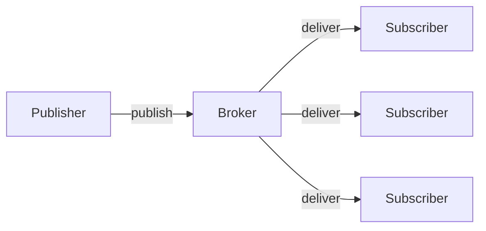
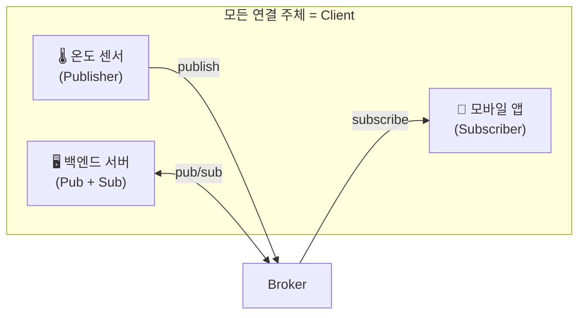
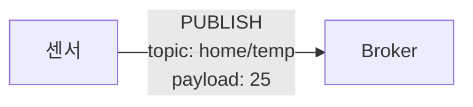
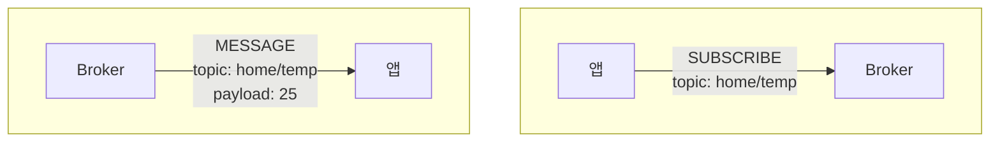
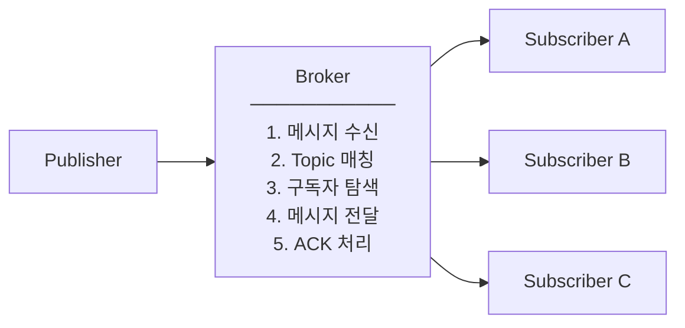

> 회사에서 MQTT를 사용하게 되면서, 프로토콜에 익숙해지기 위해 스터디한 내용을 정리한다.
> 이 글에서는 MQTT v5의 기본 개념과 아키텍처를 중심으로 살펴보고, 이후 시리즈에서는 Topic 설계, QoS, 세션 관리, 재연결 전략 등 실제 업무에서 자주 마주치는 내용들을 하나씩 다뤄볼 예정이다.

# 1. 개요


이 장에서는 MQTT가 무엇인지, 왜 필요한지, 그리고 v3 -> v5에서 어떤 점이 개선되었는지 알아본다. MQTT의 기본 개념을 이해하면 이후 장에서 다루는 Topic 설계, QoS 선택, 재연결 전략 등을 더 쉽게 이해할 수 있다.

## 1.1 MQTT란 무엇인가

MQTT는 "Message Queuing Telemetry Transport"의 약자로 **이벤트 기반 메시징 프로토콜**이다. 경량 프로토콜로 설계되어 헤더 크기가 최소 2바이트에 불과하며, 이는 HTTP 헤더(수백 바이트)와 비교하면 매우 작은 크기이다.

- **이벤트 기반 (Event-driven)**
  - 상태를 주기적으로 확인하는 폴링 방식과 달리, **변경이 발생했을 때만 이벤트를 발생시켜 효율적으로 데이터를 전달**한다

- **메시징 (Messaging)**
  - 데이터는 메시지 단위로 교환되며, **Topic 기반 라우팅**을 통해 송신자와 수신자를 느슨하게 결합한다

- **프로토콜 (Protocol)**
  - TCP/IP 스택 위에서 동작하는 경량 메시징 프로토콜로, **WebSocket 지원을 통해 웹 브라우저 환경에서도 활용 가능**하다


### Broker 중심 구조

MQTT의 가장 큰 특징은 **Broker**가 중간에 있다는 것이다. 클라이언트들은 서로 직접 통신하지 않고, 모든 메시지가 중앙의 Broker를 통해 전달된다. 이 구조 덕분에 클라이언트는 다른 클라이언트의 존재나 위치를 알 필요가 없으며, Broker만 알면 된다.



- **Publisher**
  - 데이터를 생성하여 **특정 Topic으로 메시지를 발행(publish)**하는 주체이다

- **Subscriber**
  - 관심 있는 **Topic을 구독**하고, 해당 Topic으로 전달되는 메시지를 수신하는 주체이다

- **Broker**
  - 메시지 중계 서버로서, **Publisher로부터 수신한 메시지를 Topic 기준으로 분류하여 적절한 Subscriber에게 전달**한다


Publisher와 Subscriber는 서로를 직접 알지 못한다. Broker만 알면 된다. 이러한 느슨한 결합(Loose Coupling) 덕분에 시스템 확장이 용이한다. 새로운 Subscriber를 추가해도 Publisher를 수정할 필요가 없고, 반대로 Publisher를 추가해도 기존 Subscriber에 영향을 주지 않는다.

### HTTP 와의 근본적인 차이

MQTT를 이해하는 가장 좋은 방법은 익숙한 HTTP와 비교하는 것이다. 두 프로토콜은 근본적으로 다른 통신 패턴을 사용하며, 각각 적합한 사용 사례가 있다.

| 구분 | HTTP | MQTT |
|------|------|------|
| 통신 방식 | 요청-응답 (Request-Response) | 발행-구독 (Publish-Subscribe) |
| 연결 | 요청할 때마다 연결 | 한 번 연결하면 유지 |
| 방향 | 클라이언트 → 서버 | 양방향 가능 |
| 적합한 경우 | 웹 페이지, REST API | IoT, 실시간 알림, 채팅 |

## 1.2 MQTT v5가 해결하려는 문제

MQTT v5는 2019년에 OASIS 표준으로 발표되었다. v3.1.1이 2014년에 발표된 이후 5년간의 실무 경험을 바탕으로 많은 개선이 이루어졌다. 특히 대규모 IoT 시스템을 운영하면서 발견된 문제점들을 해결하는 데 초점을 맞췄다.

### 1.2.1 v3의 한계

MQTT v3.1.1은 오랫동안 사용되었지만 실무에서 몇 가지 한계가 드러났다. 특히 장애 상황에서 원인을 파악하거나 시스템을 확장하는 데 어려움이 있었다.

1. **왜 실패했는지 알 수 없음**
   - 연결이 끊어져도 이유를 모름
   - 메시지 전송 실패 시 원인 파악 불가

2. **메타데이터 전달 불가**
   - 메시지 본문(Payload) 외에 추가 정보를 보낼 방법이 없음

3. **확장성 부족**
   - 대규모 시스템에서 필요한 기능들이 부족

### 1.2.2 v5에서 추가된 핵심 기능

**1. Reason Code (관측 가능성)**

모든 응답에 실패 원인을 알려준다.

```
v3: 연결 실패 (이유 모름)
v5: 연결 실패 - Reason Code 134 (Bad User Name or Password)
```

**2. User Properties (확장성)**

메시지에 원하는 정보를 추가할 수 있다.

```
메시지 본문: {"temperature": 25}
User Properties:
  - device_id: "sensor-001"
  - trace_id: "abc-123"
  - version: "1.0"
```

**3. 기타 유용한 기능들**
- Message Expiry Interval: 메시지 유효 시간
- Request/Response 패턴 지원
- Shared Subscription: 로드 밸런싱

---

# 2. MQTT v5 기본 아키텍처

MQTT 시스템의 핵심 요소와 메시지 흐름을 살펴본다.

## 2.1 구성 요소

### 2.1.1 Client (클라이언트)

MQTT 시스템에서 메시지를 보내거나 받는 모든 것이 Client이다. 여기서 중요한 점은 "클라이언트"라는 용어가 HTTP에서의 의미와 다르다는 것이다. HTTP에서 클라이언트는 서버에 요청을 보내는 쪽이지만, MQTT에서 클라이언트는 Broker에 연결하는 모든 참여자를 의미한다. 백엔드 서버도 Broker에 연결하면 MQTT 클라이언트가 된다.

- **센서, 모바일 앱, 서버 애플리케이션 모두 Client**: 온도 센서, 모바일 앱, 백엔드 서버 모두 동등한 Client이다
- **Publisher이면서 동시에 Subscriber일 수 있음**: 스마트 조명처럼 명령을 구독하면서 자신의 상태를 발행할 수 있다
- **Broker에 연결해서 동작**: 모든 Client는 Broker를 통해서만 메시지를 주고받으며 Client 간 직접 연결은 없다



### 2.1.2 Broker (브로커)

메시지를 중계하는 서버로 모든 메시지가 Broker를 통해 흐른다.

**주요 역할**

- **Client 연결 관리**: 수천에서 수백만 개의 동시 연결과 인증, 세션 상태, Keep Alive를 관리한다
- **Topic별 메시지 라우팅**: Publisher가 보낸 메시지를 해당 Topic 구독자들에게 전달한다
- **메시지 저장 (필요시)**: QoS 1, 2 메시지와 Retained Message를 저장한다
- **인증/인가**: 클라이언트 신원 확인(인증)과 Topic 접근 권한을 결정한다(인가)

**대표적인 Broker**

| Broker | 언어 | 라이선스 | 클러스터링 | 적합한 환경 |
|--------|------|----------|------------|-------------|
| Mosquitto | C | EPL/EDL (오픈소스) | X (기본) | 학습, 소규모, 에지 |
| EMQX | Erlang/OTP | Apache 2.0 / 상용 | O | 대규모 IoT, 엔터프라이즈 |
| HiveMQ | Java | 상용 / CE 무료 | O | 엔터프라이즈, 미션크리티컬 |
| VerneMQ | Erlang | Apache 2.0 | O | 중대규모, 클라우드 |
| NanoMQ | C | MIT | X | 에지, 임베디드 |

### 2.1.3 Topic (토픽)

메시지를 분류하는 "주소"이다.

```
home/livingroom/temperature
home/livingroom/humidity
home/bedroom/temperature
```

- 슬래시(/)로 계층 구분
- 대소문자 구분함
- UTF-8 문자열

## 2.2 메시지 흐름

### 2.2.1 Publish 흐름 (메시지 보내기)

Publisher가 메시지를 발행하면 Broker가 이를 수신하여 해당 Topic을 구독하는 모든 Subscriber에게 전달한다.

1. Publisher가 Broker에 연결
2. Publisher가 Topic과 함께 메시지 발행
3. Broker가 메시지를 수신하고 저장
4. Broker가 해당 Topic 구독자들에게 전달




### 2.2.2 Subscribe 흐름 (메시지 받기)

Subscriber는 관심 있는 Topic을 구독하고, 해당 Topic으로 메시지가 발행되면 Broker로부터 메시지를 전달받는다.

1. Subscriber가 Broker에 연결
2. Subscriber가 관심 있는 Topic 구독 요청
3. Broker가 구독 정보 저장
4. 해당 Topic에 메시지가 오면 전달



### 2.2.3 Broker 내부 역할



Broker는 "똑똑한 우체국"과 같다:
- 보낸 사람이 받는 사람을 몰라도 된다
- 주소(Topic)만 보고 배달한다
- 같은 주소로 여러 명에게 동시 배달이 가능하다

---

# 3. 마무리

이 글에서는 MQTT v5의 기본 개념과 아키텍처를 살펴보았다.

- MQTT는 경량 이벤트 기반 메시징 프로토콜로, Broker를 중심으로 Publisher와 Subscriber가 느슨하게 결합된다
- HTTP의 요청-응답 방식과 달리 발행-구독 패턴을 사용하여 실시간 양방향 통신에 적합하다
- v5에서는 Reason Code, User Properties 등이 추가되어 디버깅과 확장성이 크게 개선되었다
- Client, Broker, Topic이 핵심 구성 요소이며, 모든 메시지는 Broker를 통해 라우팅된다

> **다음 편 안내**: MQTT v5 완벽 가이드 (2)에서는 Topic 설계와 메시지 모델을 다룬다.

# 4. 참고

- [MQTT v5 스펙](https://docs.oasis-open.org/mqtt/mqtt/v5.0/mqtt-v5.0.html)
- [EMQX 문서](https://www.emqx.io/docs)
- [Mosquitto 문서](https://mosquitto.org/documentation/)
