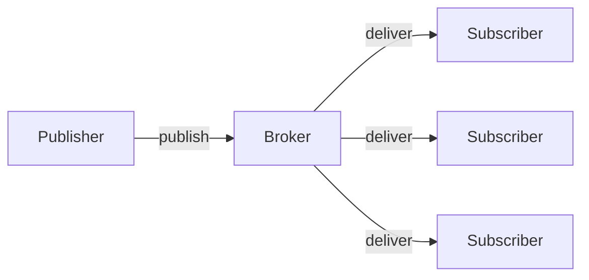
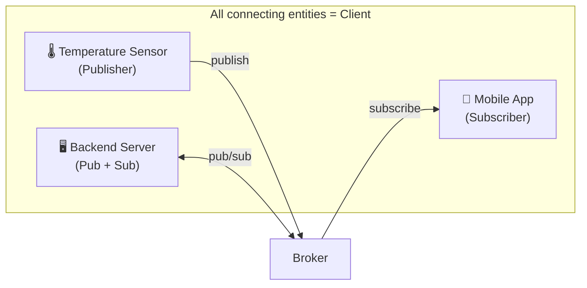
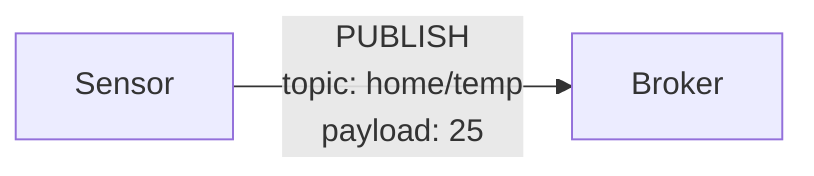
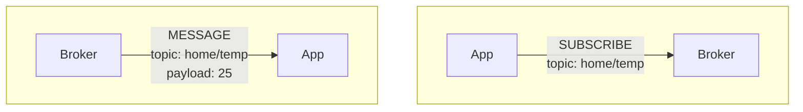
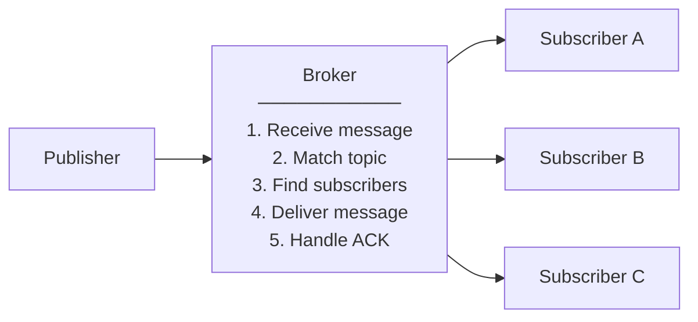

> As I started using MQTT at work, I put together these study notes to get familiar with the protocol.
> This article focuses on the basic concepts and architecture of MQTT v5, and later parts of the series will cover topics frequently encountered in real-world work such as topic design, QoS, session management, and reconnection strategies, one by one.

# 1. Overview


This chapter explains what MQTT is, why it is needed, and what improvements were made from v3 to v5. Understanding the basic concepts of MQTT makes it easier to grasp the topic design, QoS selection, and reconnection strategies covered in later chapters.

## 1.1 What Is MQTT

MQTT stands for "Message Queuing Telemetry Transport" and is an **event-driven messaging protocol**. Designed as a lightweight protocol, its header is as small as 2 bytes at minimum, which is extremely small compared to an HTTP header (hundreds of bytes).

- **Event-driven**
  - Unlike polling, which checks state periodically, it **delivers data efficiently by emitting an event only when a change occurs**

- **Messaging**
  - Data is exchanged in message units, and **topic-based routing** loosely couples senders and receivers

- **Protocol**
  - It is a lightweight messaging protocol running on top of the TCP/IP stack, and **WebSocket support makes it usable in web browser environments as well**


### 1.1.1 Broker-Centric Structure

The most distinctive feature of MQTT is that a **broker** sits in the middle. Clients do not communicate directly with each other; all messages are relayed through the central broker. Thanks to this structure, a client does not need to know about the existence or location of other clients—it only needs to know the broker.



- **Publisher**
  - The entity that generates data and **publishes messages to a specific topic**

- **Subscriber**
  - The entity that **subscribes to topics** of interest and receives messages delivered to those topics

- **Broker**
  - A message relay server that **classifies messages received from publishers by topic and delivers them to the appropriate subscribers**


Publishers and subscribers do not know each other directly. They only need to know the broker. Thanks to this loose coupling, the system is easy to scale. Adding a new subscriber requires no changes to the publisher, and conversely, adding a publisher does not affect existing subscribers.

### 1.1.2 Fundamental Differences from HTTP

The best way to understand MQTT is to compare it with the familiar HTTP. The two protocols use fundamentally different communication patterns, and each has its own suitable use cases.

| Category | HTTP | MQTT |
|------|------|------|
| Communication model | Request-Response | Publish-Subscribe |
| Connection | Connect for each request | Connect once and keep alive |
| Direction | Client → Server | Bidirectional possible |
| Best suited for | Web pages, REST APIs | IoT, real-time notifications, chat |

## 1.2 The Problems MQTT v5 Aims to Solve

MQTT v5 was released as an OASIS standard in 2019. Building on five years of practical experience since v3.1.1 was released in 2014, many improvements were made. In particular, it focused on solving problems discovered while operating large-scale IoT systems.

### 1.2.1 Limitations of v3

MQTT v3.1.1 was used for a long time, but several limitations surfaced in practice. In particular, it was difficult to identify the cause of failures or to scale the system.

1. **No way to know why something failed**
   - Even when a connection dropped, the reason was unknown
   - When a message failed to send, the cause could not be identified

2. **No way to convey metadata**
   - There was no way to send additional information beyond the message payload

3. **Lack of scalability**
   - It lacked features needed in large-scale systems

### 1.2.2 Key Features Added in v5

**1. Reason Code (Observability)**

Every response now reports the cause of failure.

```
v3: Connection failed (reason unknown)
v5: Connection failed - Reason Code 134 (Bad User Name or Password)
```

**2. User Properties (Extensibility)**

You can add any desired information to a message.

```
Message payload: {"temperature": 25}
User Properties:
  - device_id: "sensor-001"
  - trace_id: "abc-123"
  - version: "1.0"
```

**3. Other Useful Features**
- Message Expiry Interval: how long a message remains valid
- Request/Response pattern support
- Shared Subscription: load balancing

---

# 2. MQTT v5 Basic Architecture

Let's look at the core components of an MQTT system and the message flow.

## 2.1 Components

### 2.1.1 Client

In an MQTT system, anything that sends or receives messages is a client. The important point here is that the term "client" differs from its meaning in HTTP. In HTTP, the client is the side that sends requests to a server, but in MQTT, the client refers to every participant that connects to the broker. A backend server also becomes an MQTT client once it connects to the broker.

- **Sensors, mobile apps, and server applications are all clients**: a temperature sensor, a mobile app, and a backend server are all equally clients
- **A client can be both a publisher and a subscriber**: like a smart light that subscribes to commands while publishing its own state
- **Operates by connecting to the broker**: every client exchanges messages only through the broker, and there is no direct connection between clients



### 2.1.2 Broker

The broker is the server that relays messages, and all messages flow through it.

**Main Roles**

- **Managing client connections**: it manages thousands to millions of concurrent connections, along with authentication, session state, and keep-alive
- **Routing messages by topic**: it delivers messages sent by publishers to the subscribers of the corresponding topic
- **Storing messages (when needed)**: it stores QoS 1 and 2 messages as well as retained messages
- **Authentication/authorization**: it verifies client identity (authentication) and determines topic access permissions (authorization)

**Representative Brokers**

| Broker | Language | License | Clustering | Suitable Environment |
|--------|------|----------|------------|-------------|
| Mosquitto | C | EPL/EDL (open source) | X (by default) | Learning, small-scale, edge |
| EMQX | Erlang/OTP | Apache 2.0 / commercial | O | Large-scale IoT, enterprise |
| HiveMQ | Java | Commercial / CE free | O | Enterprise, mission-critical |
| VerneMQ | Erlang | Apache 2.0 | O | Medium-to-large scale, cloud |
| NanoMQ | C | MIT | X | Edge, embedded |

### 2.1.3 Topic

A topic is the "address" used to classify messages.

```
home/livingroom/temperature
home/livingroom/humidity
home/bedroom/temperature
```

- Hierarchy is separated by a slash (/)
- Case-sensitive
- UTF-8 string

## 2.2 Message Flow

### 2.2.1 Publish Flow (Sending Messages)

When a publisher publishes a message, the broker receives it and delivers it to all subscribers of that topic.

1. The publisher connects to the broker
2. The publisher publishes a message along with a topic
3. The broker receives and stores the message
4. The broker delivers it to the subscribers of that topic




### 2.2.2 Subscribe Flow (Receiving Messages)

A subscriber subscribes to topics of interest, and when a message is published to that topic, it is delivered from the broker.

1. The subscriber connects to the broker
2. The subscriber requests a subscription to a topic of interest
3. The broker stores the subscription information
4. When a message arrives on that topic, it is delivered



### 2.2.3 The Broker's Internal Roles



A broker is like a "smart post office":
- The sender does not need to know the recipient
- It delivers based solely on the address (topic)
- It can deliver to multiple recipients simultaneously at the same address

---

# 3. Conclusion

In this article, we looked at the basic concepts and architecture of MQTT v5.

- MQTT is a lightweight, event-driven messaging protocol in which publishers and subscribers are loosely coupled around a broker
- Unlike HTTP's request-response model, it uses a publish-subscribe pattern, making it well suited for real-time bidirectional communication
- v5 added features such as Reason Code and User Properties, greatly improving debugging and extensibility
- Client, broker, and topic are the core components, and all messages are routed through the broker

> **Next part**: In Part 2 of the MQTT v5 Complete Guide, we will cover topic design and the message model.

# 4. References

- [MQTT v5 Specification](https://docs.oasis-open.org/mqtt/mqtt/v5.0/mqtt-v5.0.html)
- [EMQX Documentation](https://www.emqx.io/docs)
- [Mosquitto Documentation](https://mosquitto.org/documentation/)
