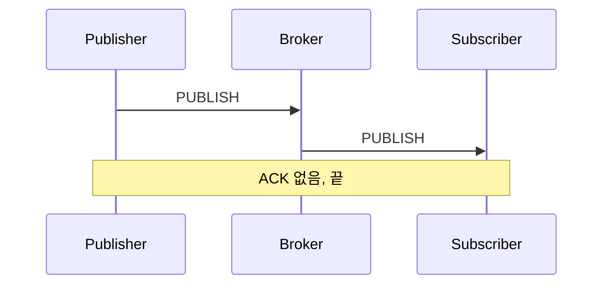
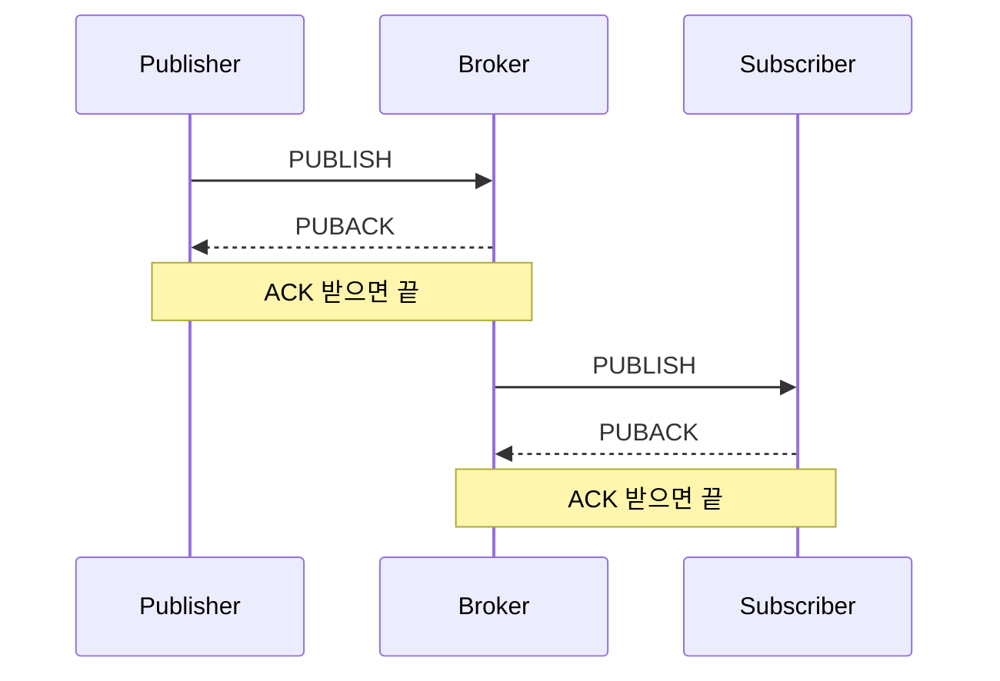
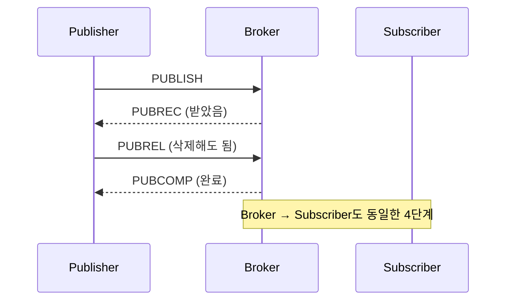
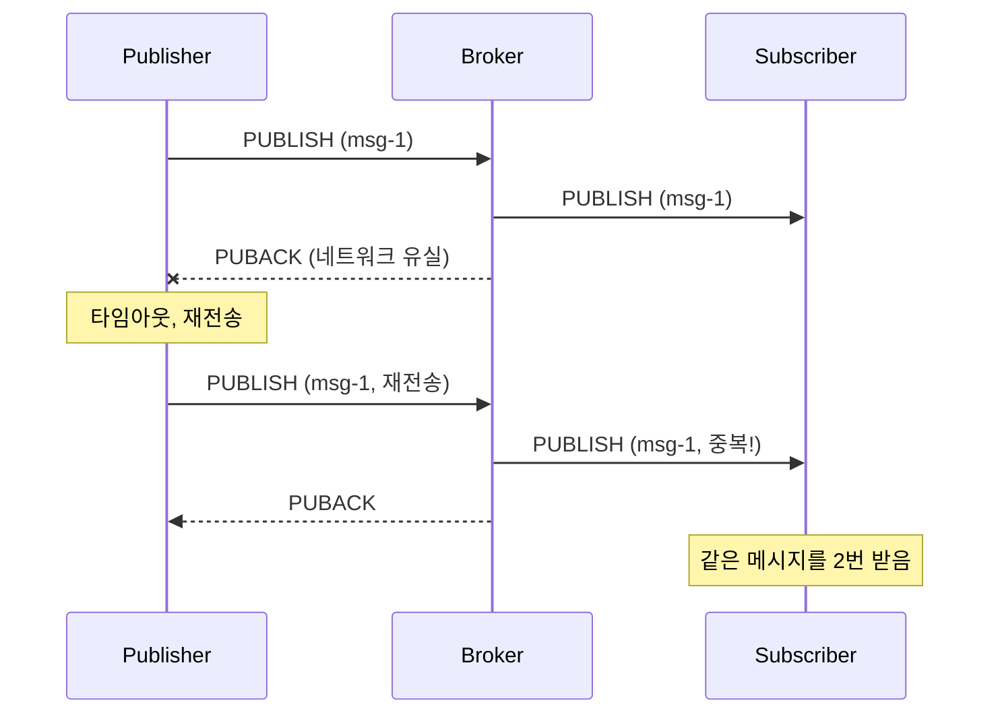
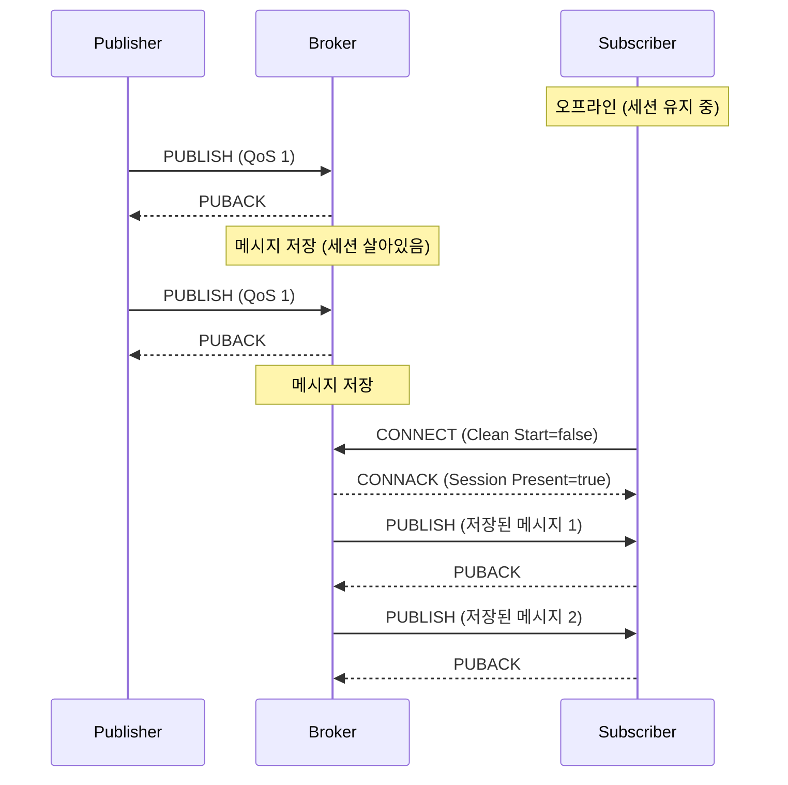
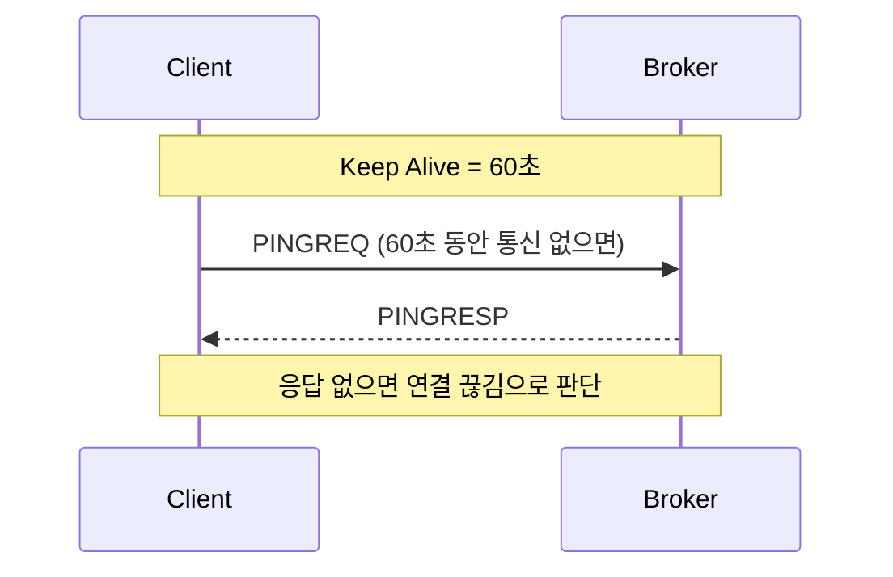
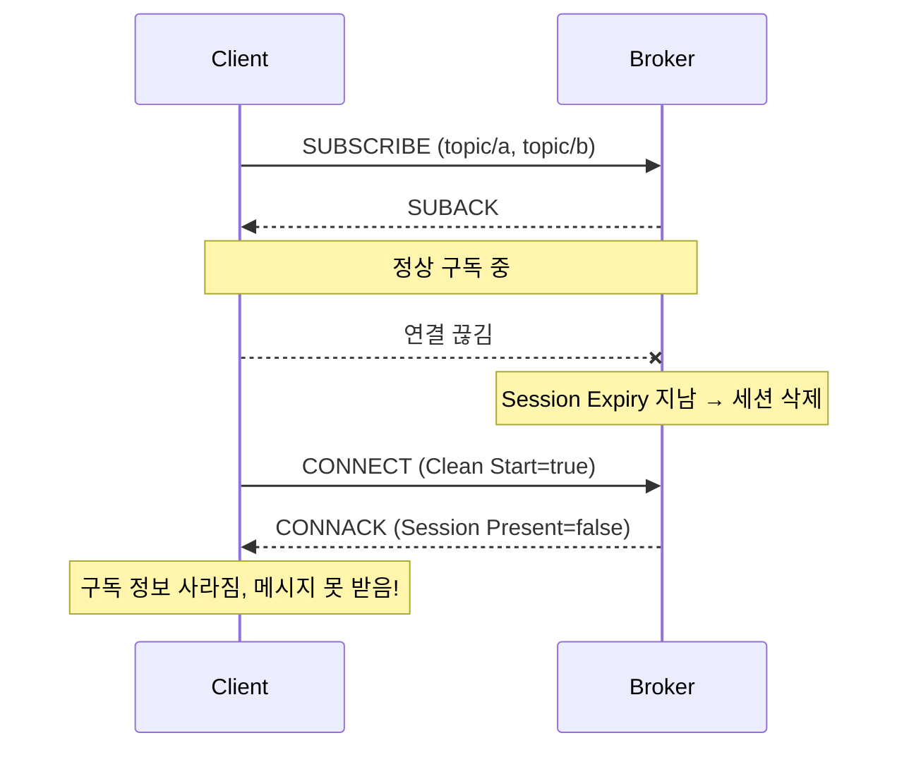
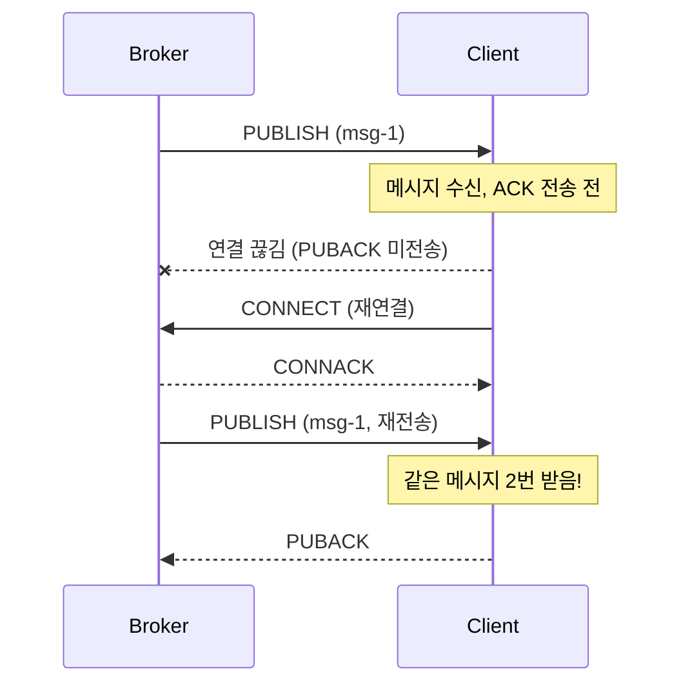
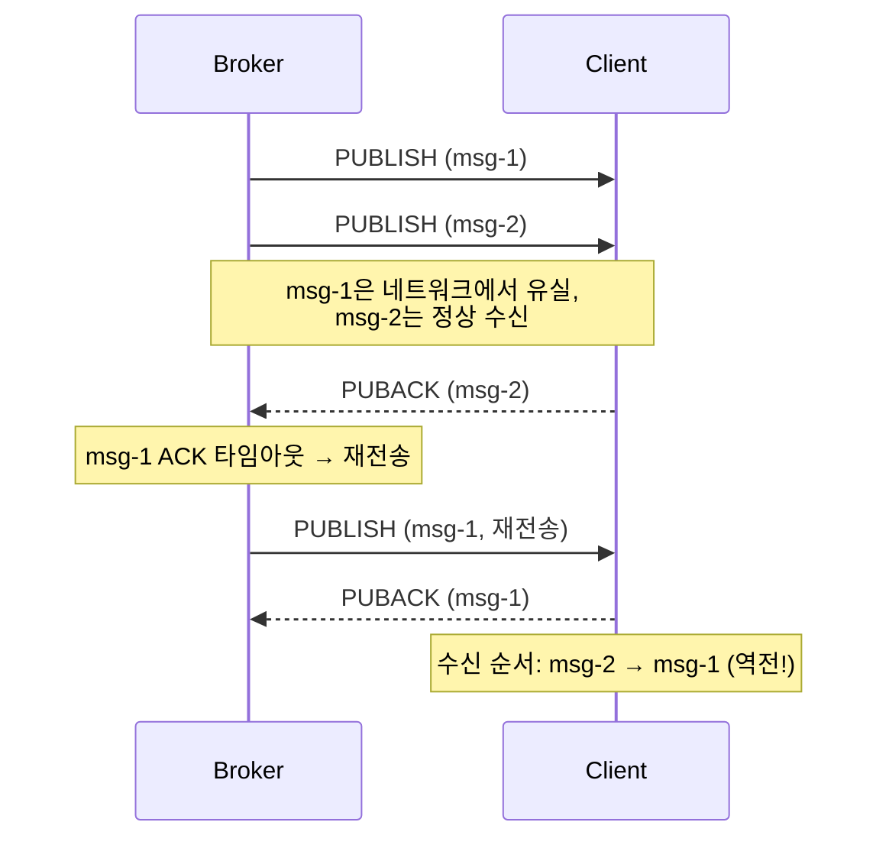

# 1. QoS 완전 정복

`QoS`(Quality of Service)는 메시지의 **전달 보장 수준**을 의미한다. `MQTT`에서 가장 중요한 개념 중 하나로, 네트워크 상태와 메시지의 중요도에 따라 적절한 `QoS`를 선택해야 한다. `QoS` 선택은 시스템의 **신뢰성과 성능 간 트레이드오프**를 수반한다. `QoS` 수준이 높을수록 메시지 전달은 더 확실해지지만, 그만큼 네트워크 오버헤드와 지연이 증가한다.

이 장에서는 각 `QoS` 레벨의 동작 원리를 살펴보고, 실무에서 어떤 상황에 어떤 `QoS`를 선택하는 것이 적절한지 알아본다. 또한 `QoS` 1에서 발생할 수 있는 **중복 메시지 처리 방법**에 대해서도 함께 다룬다.

## 1.1 QoS 0 / 1 / 2 동작 원리

### 1.1.1 QoS 0: At Most Once (최대 한 번)

"보내고 잊어버린다" 방식이다. 메시지를 한 번 전송하고 응답을 기다리지 않는다. 네트워크 문제로 메시지가 유실되어도 재전송하지 않는다. 가장 빠르고 가벼운 방식이지만, 메시지 전달을 보장하지 않는다.



**특징:**
- 가장 빠름
- 메시지 유실 가능
- `ACK` 없음

**비유**: 엽서 보내기 - 보냈는지 확인 안 함

### 1.1.2 QoS 1: At Least Once (최소 한 번)

"받았다고 확인할 때까지 재전송" 방식이다.



**특징:**
- 메시지 전달 보장
- 중복 가능 (`ACK` 유실 시 재전송)
- 가장 많이 사용됨

**비유**: 등기 우편 - 받았다는 확인 필요

### 1.1.3 QoS 2: Exactly Once (정확히 한 번)

"중복 없이 정확히 한 번 전달" 방식이다.



**특징:**
- 중복 없음 보장
- 가장 느림 (4번의 핸드셰이크)
- 거의 사용되지 않음

**비유**: 은행 송금 - 정확히 한 번만 실행되어야 함

### 1.1.4 MQTT Control Packet 타입

위 다이어그램에서 사용된 `PUBLISH`, `PUBACK` 등은 `MQTT` 프로토콜에서 정의한 공식 패킷 타입이다.

| 패킷 | 용도 |
|------|------|
| `CONNECT` / `CONNACK` | 연결 요청 / 응답 |
| `PUBLISH` | 메시지 발행 |
| `PUBACK` | `QoS` 1 응답 |
| `PUBREC` / `PUBREL` / `PUBCOMP` | `QoS` 2 핸드셰이크 (3단계) |
| `SUBSCRIBE` / `SUBACK` | 구독 요청 / 응답 |
| `UNSUBSCRIBE` / `UNSUBACK` | 구독 해제 요청 / 응답 |
| `PINGREQ` / `PINGRESP` | Keep Alive 체크 |
| `DISCONNECT` | 연결 종료 |
| `AUTH` | 인증 (v5에서 추가) |


### 1.1.5 한눈에 비교

| QoS | 이름 | 전달 보장 | 중복 가능 | 속도 |
|-----|------|-----------|-----------|------|
| 0 | At Most Once | X | X | 빠름 |
| 1 | At Least Once | O | O | 보통 |
| 2 | Exactly Once | O | X | 느림 |

## 1.2 QoS 선택 기준

### 1.2.1 상태 보고: QoS 0 또는 1

온도, 습도 같은 센서 데이터는 주기적으로 전송되므로 하나쯤 놓쳐도 다음 값이 곧 온다. 따라서 전송 빈도와 데이터 중요도에 따라 `QoS` 0 또는 1을 선택한다.

```
# 예: 온도 센서가 1초마다 값 전송
topic: sensor/temp
payload: 25.5
qos: 0  # 하나쯤 놓쳐도 다음 값이 옴
```

**판단 기준:**
- 주기적으로 전송됨 → `QoS` 0
- 가끔 전송되고 중요함 → `QoS` 1

### 1.2.2 이벤트: QoS 1

문 열림, 버튼 클릭 같은 이벤트는 한 번 발생하면 끝이므로 놓치면 복구가 어렵다. 반드시 전달되어야 하므로 `QoS` 1을 사용한다.

```
# 예: 문 열림 이벤트
topic: door/event/opened
payload: {"time": "10:30:00"}
qos: 1  # 이벤트는 놓치면 안 됨
```

### 1.2.3 명령: QoS 1 또는 2

디바이스에 보내는 명령은 반드시 전달되어야 한다. 대부분 `QoS` 1이면 충분하지만, 결제처럼 중복 실행이 치명적인 경우에는 `QoS` 2 또는 Idempotent 처리를 고려한다.

```
# 예: 조명 끄기 명령
topic: light/cmd/off
payload: {}
qos: 1  # 반드시 전달되어야 함
```

**중복 실행이 문제가 되는 경우:**
```
# 예: 결제 요청
topic: payment/process
payload: {"amount": 10000}
qos: 2  # 정확히 한 번만 실행
# 또는 QoS 1 + Idempotent 처리
```

## 1.3 QoS와 중복 처리

### 1.3.1 At-Least-Once의 현실

`QoS` 1은 메시지 전달을 보장하지만, `PUBACK`이 유실되면 Publisher가 같은 메시지를 재전송하여 중복이 발생할 수 있다. 이는 `QoS` 1의 설계상 의도된 동작이므로, Subscriber 측에서 중복을 처리에 대한 작업이 필요하다.



### 1.3.2 Idempotent Consumer 설계

중복 메시지를 받아도 결과가 동일하도록 설계하는 것이 **멱등성(Idempotency)**이다. `QoS` 2의 오버헤드 없이도 실질적으로 "정확히 한 번" 처리와 동일한 효과를 얻을 수 있어, 실무에서는 `QoS` 1 + 멱등성 조합이 가장 널리 사용된다.

**방법 1: 메시지 ID로 중복 체크**
```go
func handleMessage(msg Message) {
    // 이미 처리한 메시지인지 확인
    if processed[msg.ID] {
        return  // 무시
    }

    processMessage(msg)
    processed[msg.ID] = true
}
```

**방법 2: 상태 기반 처리**
```go
// 나쁜 예: 잔액 증가 (중복되면 문제)
balance += amount

// 좋은 예: 상태 설정 (중복되어도 같은 결과)
balance = newBalance
status = "completed"
```

**방법 3: 타임스탬프 활용**
```go
func handleState(msg StateMessage) {
    // 오래된 메시지는 무시
    if msg.Timestamp < lastTimestamp {
        return
    }

    updateState(msg)
    lastTimestamp = msg.Timestamp
}
```

---

# 2. Session & 연결 관리

`MQTT`에서 세션(Session)은 단순히 `TCP` 연결을 넘어서는 개념이다. 세션에는 구독 정보, 전달되지 않은 메시지, `QoS` 흐름 상태 등이 포함된다. 올바른 세션 관리는 네트워크가 불안정한 환경에서 메시지 손실을 방지하는 핵심이다. 이 장에서는 세션의 생명주기와 Keep Alive 메커니즘, 그리고 Retained Message 활용법을 다룬다.

## 2.1 Session Expiry Interval

세션은 Client와 Broker 간의 **연결 상태 정보**이다. v5에서는 Session Expiry Interval을 통해 연결이 끊어진 후에도 세션을 얼마나 유지할지 세밀하게 제어할 수 있다. 이 기능은 모바일 앱처럼 연결이 자주 끊어지는 환경에서 특히 유용하다.

### 2.1.1 Clean Start vs Session 유지

Clean Start 플래그는 연결 시 이전 세션을 어떻게 처리할지 결정한다. 이 설정은 시스템의 동작 방식에 큰 영향을 미치므로 신중하게 선택해야 한다.

**Clean Start = true (새 세션)**
```
연결 시:
  - 이전 세션 정보 삭제
  - 구독 정보 초기화
  - 저장된 메시지 삭제

사용 케이스:
  - 임시 연결
  - 상태가 필요 없는 Publisher
```

**Clean Start = false (세션 유지)**
```
연결 시:
  - 이전 세션 정보 복원
  - 구독 정보 유지
  - 오프라인 동안의 메시지 전달

사용 케이스:
  - 지속적인 구독자
  - 메시지를 놓치면 안 되는 경우
```

### 2.1.2 Session Expiry Interval

세션을 얼마나 유지할지 설정한다.

```go
// 세션 설정 예시
SessionExpiryInterval: 3600  // 1시간

// 동작
1. Client 연결 끊김
2. Broker가 1시간 동안 세션 유지
3. 1시간 내 재연결 → 세션 복원, 밀린 메시지 전달
4. 1시간 후 재연결 → 새 세션 시작
```

**권장 값:**
- 모바일 앱: 1-24시간
- `IoT` 기기: 필요에 따라 (분~일)
- 임시 연결: 0 (세션 유지 안 함)

### 2.1.3 오프라인 메시지

Session이 유지되는 동안 Broker가 메시지를 저장한다. Client가 오프라인이더라도 세션이 살아있으면 `QoS` 1 이상의 메시지는 Broker에 쌓이고, 재연결 시 한꺼번에 전달된다. 이 덕분에 네트워크가 불안정한 환경에서도 메시지 유실 없이 안정적으로 데이터를 수신할 수 있다.



**주의사항:**
- `QoS` 0 메시지는 저장되지 않음
- 저장 용량에 제한이 있을 수 있음
- Session Expiry 전에 재연결해야 함

## 2.2 Keep Alive

연결이 살아있는지 확인하는 메커니즘이다. `TCP` 연결은 상대방이 비정상 종료되어도 이를 즉시 감지하지 못하는 경우가 많기 때문에, `MQTT`는 주기적으로 `PINGREQ`/`PINGRESP`를 교환하여 연결 상태를 확인한다. 이를 통해 끊어진 연결을 빠르게 감지하고 재연결을 시도할 수 있다.

### 2.2.1 Ping 메커니즘



**동작 방식:**
1. Client가 Keep Alive 간격 설정 (예: 60초)
2. 해당 시간 동안 메시지가 없으면 `PINGREQ` 전송
3. Broker가 `PINGRESP`로 응답
4. Keep Alive * 1.5 시간 내 응답 없으면 연결 종료

### 2.2.2 네트워크 품질과의 관계

```
# 안정적인 네트워크
keep_alive: 60~120초

# 불안정한 네트워크 (모바일, IoT)
keep_alive: 15~30초
# 더 자주 체크하지만 오버헤드 증가

# 매우 안정적인 환경 (데이터센터 내)
keep_alive: 300초 이상
```

**Trade-off:**
- 짧은 Keep Alive: 빠른 끊김 감지, 높은 오버헤드
- 긴 Keep Alive: 낮은 오버헤드, 느린 끊김 감지

## 2.3 Retained Message

Topic에 **마지막 메시지를 저장**하는 기능이다. Broker가 해당 Topic의 가장 최근 메시지를 보관하고 있다가, 새로운 Subscriber가 구독하면 즉시 전달한다. 이를 통해 Subscriber는 Publisher의 다음 발행을 기다리지 않고도 현재 상태를 바로 알 수 있다.

### 2.3.1 Last Known State 패턴

```
# 온도 센서가 Retained 메시지 발행
PUBLISH
  topic: sensor/temperature
  payload: 25
  retain: true

# Broker가 이 메시지를 저장

# 나중에 새 Subscriber가 구독하면
SUBSCRIBE topic: sensor/temperature
# → 즉시 마지막 값(25)을 받음
```

**왜 유용한가:**
- 새로 연결한 Client도 현재 상태를 즉시 알 수 있음
- 센서가 자주 전송하지 않아도 됨
- "현재 상태가 뭐야?" 질문에 답할 수 있음

### 2.3.2 오용 사례

```
# 나쁜 사용: 이벤트에 Retain
PUBLISH
  topic: door/event/opened
  payload: {"time": "10:30:00"}
  retain: true  # 잘못됨!

# 문제: 새 구독자가 "문이 열렸다"는 과거 이벤트를 받음
# 현재 문 상태인지, 과거 이벤트인지 구분 불가
```

**Retain을 써야 하는 경우:**
- 상태 (온도, 습도, 전원 상태)
- 설정 값
- 현재 위치

**Retain을 쓰면 안 되는 경우:**
- 이벤트 (버튼 클릭, 문 열림)
- 명령
- 로그

---

# 3. 재연결(Reconnect) 전략

> 이 장은 실무에서 **가장 중요한** 부분이다.

많은 `MQTT` 튜토리얼이 연결과 메시지 전송만 다루지만, 실제 프로덕션 코드에서는 재연결 로직이 전체 코드의 상당 부분을 차지한다. 네트워크는 반드시 끊기며, 이에 대한 준비 없이는 안정적인 서비스를 운영할 수 없다. 이 장에서는 재연결이 필요한 이유, 재연결 시 발생하는 문제들, 그리고 검증된 재연결 전략을 상세히 다룬다.

## 3.1 재연결이 반드시 필요한 이유

### 3.1.1 현실 세계의 네트워크

이상적인 세계에서는 한 번 연결하면 영원히 유지된다. 하지만 현실은 다르다. 네트워크 연결은 다양한 이유로 끊어질 수 있으며, 이는 버그가 아닌 정상적인 운영 환경의 일부이다. 따라서 재연결은 예외 처리가 아니라 핵심 기능으로 설계해야 한다.

**네트워크 끊김 원인들:**
- Wi-Fi → `LTE` 전환 (모바일)
- 터널, 엘리베이터 (모바일)
- 라우터 재시작
- ISP 장애
- Broker 재시작
- 로드밸런서 타임아웃
- 메모리 부족으로 인한 강제 종료

### 3.1.2 환경별 특성

**모바일**
- 수시로 네트워크 전환
- 백그라운드 진입 시 OS가 연결 끊음
- 배터리 절약으로 인한 제한

**로봇/차량**
- 이동 중 기지국 전환
- 음영 지역 통과
- 하드웨어 재부팅

**`IoT` 센서**
- 전원 불안정
- 무선 간섭
- 펌웨어 업데이트로 재시작

### 3.1.3 Broker 장애

Broker도 죽을 수 있다:
- 메모리 부족
- 디스크 가득 참
- 업그레이드/패치
- 하드웨어 장애

**결론**: 재연결은 "만약"이 아니라 "언제" 발생하느냐의 문제이다.

## 3.2 재연결 시 발생하는 문제들

### 3.2.1 구독 유실

Clean Start 설정에 따라 구독이 사라질 수 있다. Session Expiry가 지났거나 Clean Start=true로 재연결하면 Broker가 이전 세션을 삭제하므로, 기존 구독 정보가 모두 사라진다. 이 경우 Client는 메시지를 받지 못하면서도 구독 중이라고 착각할 수 있어 디버깅이 어렵다.



### 3.2.2 중복 메시지

재연결 시점에 따라 같은 메시지를 여러 번 받을 수 있다. Client가 메시지를 수신했지만 `PUBACK`을 보내기 전에 연결이 끊기면, Broker는 전달이 실패했다고 판단하고 재연결 후 같은 메시지를 다시 전송한다. 이는 `QoS` 1의 At-Least-Once 보장 때문이며, 앞서 다룬 Idempotent 설계로 대응해야 한다.



### 3.2.3 메시지 순서 깨짐

`QoS` 1에서 여러 메시지가 동시에 전송 중(inflight)일 때, 일부 메시지가 유실되어 재전송되면 원래 순서와 다르게 도착할 수 있다. 순서에 의존하는 로직이 있는 경우, 타임스탬프나 시퀀스 번호를 기반으로 올바른 순서를 보장하는 처리가 필요하다.



## 3.3 재연결 설계 전략

### 3.3.1 Auto Reconnect

대부분의 `MQTT` 클라이언트 라이브러리는 자동 재연결을 지원한다.

```go
// Paho v5 예시
config := autopaho.ClientConfig{
    ConnectRetryDelay: 10 * time.Second,  // 재시도 간격
    // ...
}
```

**자동 재연결이 하는 일:**
1. 연결 끊김 감지
2. 일정 시간 대기
3. 재연결 시도
4. 실패하면 다시 대기 후 재시도

### 3.3.2 Backoff 전략

재연결 실패 시 대기 시간을 점점 늘리는 전략이다.

```
# Fixed Backoff (고정)
시도 1: 1초 대기
시도 2: 1초 대기
시도 3: 1초 대기
...

# Exponential Backoff (지수)
시도 1: 1초 대기
시도 2: 2초 대기
시도 3: 4초 대기
시도 4: 8초 대기
...

# Exponential Backoff with Jitter (+ 랜덤)
시도 1: 1초 + random(0~500ms)
시도 2: 2초 + random(0~500ms)
...
```

**왜 Jitter가 필요한가:**
```
# 시나리오: Broker 재시작
1. 1000개 Client가 동시에 끊김
2. 모두 1초 후 재연결 시도
3. Broker에 1000개 연결 요청 폭주
4. Broker 과부하

# Jitter 적용 시
1. 1000개 Client가 동시에 끊김
2. 각자 1초 + 랜덤 시간 후 재연결
3. 연결 요청이 분산됨
4. Broker 안정적 처리
```

### 3.3.3 Session 유지 vs 초기화

```go
// Session 유지 (권장)
CleanStart: false
SessionExpiryInterval: 3600  // 1시간

// 장점:
// - 구독 정보 유지
// - 오프라인 메시지 받음

// Session 초기화
CleanStart: true

// 필요한 경우:
// - 완전히 새로 시작해야 할 때
// - 문제가 발생해서 리셋할 때
```

## 3.4 재연결 후 처리 로직

### 3.4.1 재구독 전략

Session이 만료되었거나 Clean Start를 사용한 경우, 재구독이 필요하다.

```go
// 재연결 성공 시 콜백
func onConnect(client *paho.Client) {
    // 필요한 Topic들 재구독
    topics := []string{
        "device/+/state",
        "command/mydevice/#",
    }

    for _, topic := range topics {
        client.Subscribe(topic, qos)
    }
}
```

**Best Practice: 구독 목록 관리**
```go
type SubscriptionManager struct {
    subscriptions map[string]byte  // topic -> qos
}

func (sm *SubscriptionManager) Resubscribe(client *paho.Client) {
    for topic, qos := range sm.subscriptions {
        client.Subscribe(topic, qos)
    }
}
```

### 3.4.2 미처리 메시지 처리

재연결 후 밀린 메시지를 받을 때 고려사항:

```go
func onMessage(msg Message) {
    // 1. 메시지 나이 확인
    age := time.Since(msg.Timestamp)
    if age > maxMessageAge {
        log.Warn("Discarding old message", age)
        return
    }

    // 2. 중복 확인
    if isProcessed(msg.ID) {
        return
    }

    // 3. 처리
    processMessage(msg)
    markAsProcessed(msg.ID)
}
```

### 3.4.3 상태 동기화 패턴

재연결 후 현재 상태를 동기화하는 패턴이다.

**방법 1: Retained Message 활용**
```
# 구독하면 마지막 상태 즉시 수신
SUBSCRIBE topic: device/+/state
→ 각 디바이스의 마지막 상태 수신
```

**방법 2: 명시적 상태 요청**
```
# 재연결 후 상태 요청
PUBLISH topic: device/mydevice/cmd/get_state
→ 디바이스가 현재 상태 응답
```

**방법 3: 시퀀스 번호 기반**
```go
// 마지막 처리한 시퀀스 저장
lastSequence := loadLastSequence()

// 재연결 후
for _, msg := range messages {
    if msg.Sequence <= lastSequence {
        continue  // 이미 처리함
    }
    processMessage(msg)
    saveLastSequence(msg.Sequence)
}
```

---

# 4. 마무리

이번 편에서 다룬 핵심 내용을 정리한다.

**QoS 선택**
- `QoS` 0: 빠르지만 유실 가능. 주기적 상태 보고에 적합
- `QoS` 1: 전달 보장하지만 중복 가능. 가장 많이 사용
- `QoS` 2: 정확히 한 번 전달. 오버헤드가 커서 거의 사용 안 함
- 중복 처리는 Idempotent 설계로 해결

**Session 관리**
- Clean Start=false로 세션 유지하면 오프라인 메시지 수신 가능
- Session Expiry Interval로 세션 유지 시간 설정
- Keep Alive로 연결 상태 확인. 네트워크 환경에 따라 조절
- Retained Message는 상태 정보에만 사용. 이벤트에는 부적합

**재연결 전략**
- 네트워크 끊김은 "만약"이 아니라 "언제"의 문제
- Exponential Backoff + Jitter로 Broker 부하 분산
- 재연결 후 재구독, 중복 체크, 상태 동기화 필수

실무에서는 재연결 로직이 전체 코드의 상당 부분을 차지한다. 안정적인 `MQTT` 시스템을 구축하려면 이 세 가지를 확실히 이해해야 한다.

---

> **다음 편 안내**: [MQTT v5 완벽 가이드 (4): 고급 기능과 보안](/database/mqtt-v5-완벽-가이드-4-고급-기능과-보안)에서는 Shared Subscription, Request/Response 패턴, Reason Code, 그리고 TLS 보안 설정을 다룬다.

---

# 5. 참고

- [MQTT v5 스펙](https://docs.oasis-open.org/mqtt/mqtt/v5.0/mqtt-v5.0.html)
- [Eclipse Paho Go Client](https://github.com/eclipse/paho.golang)
