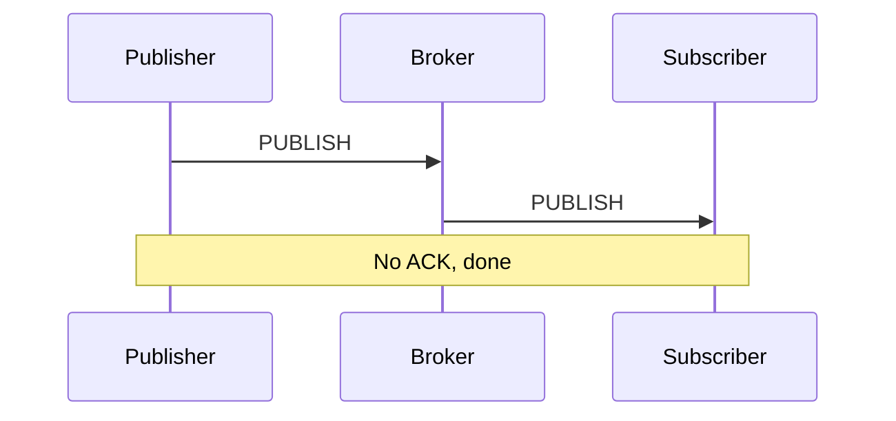
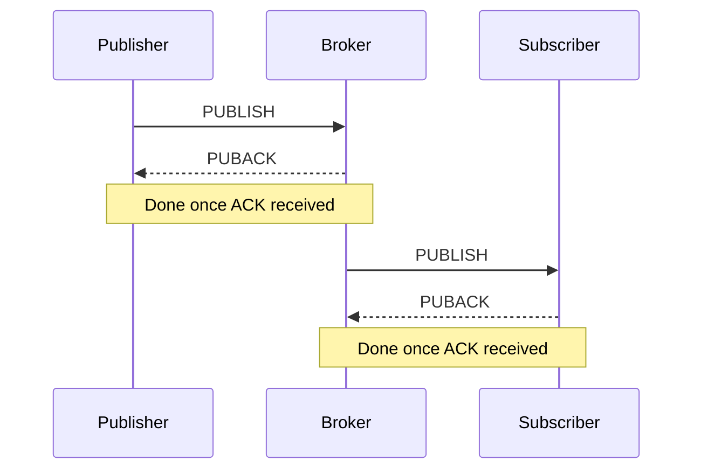
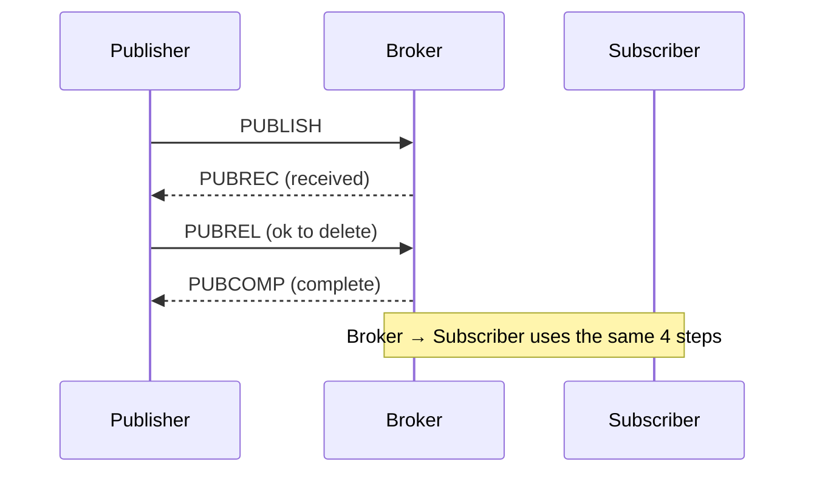
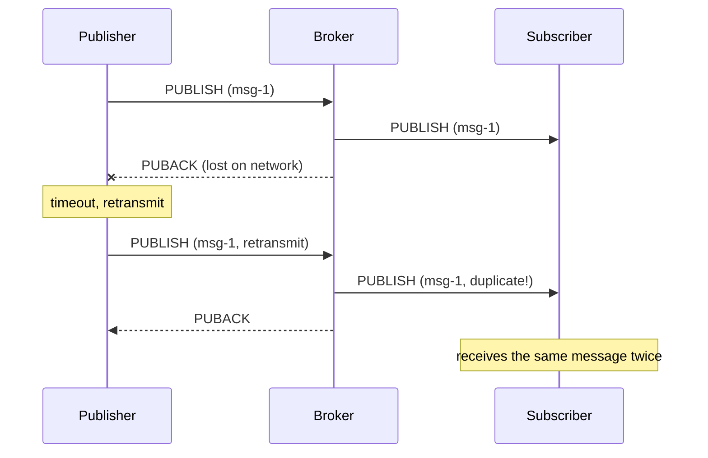
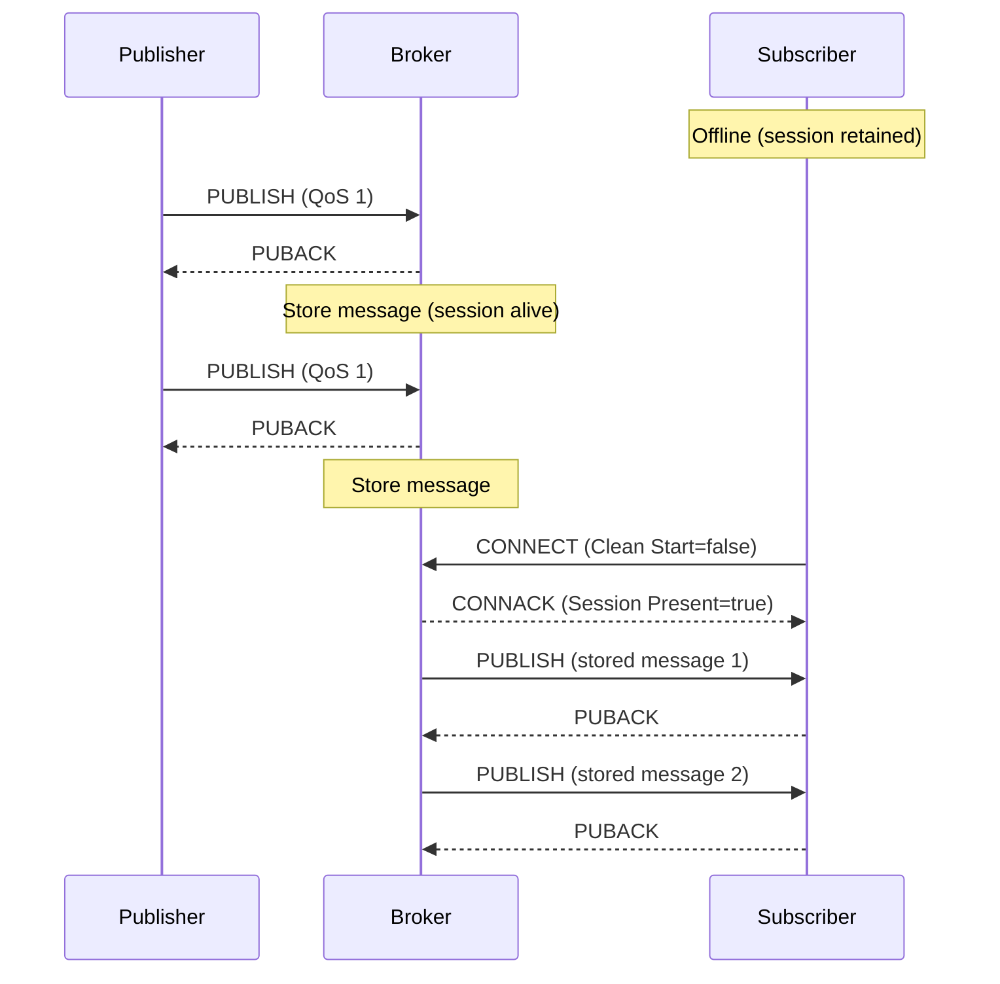
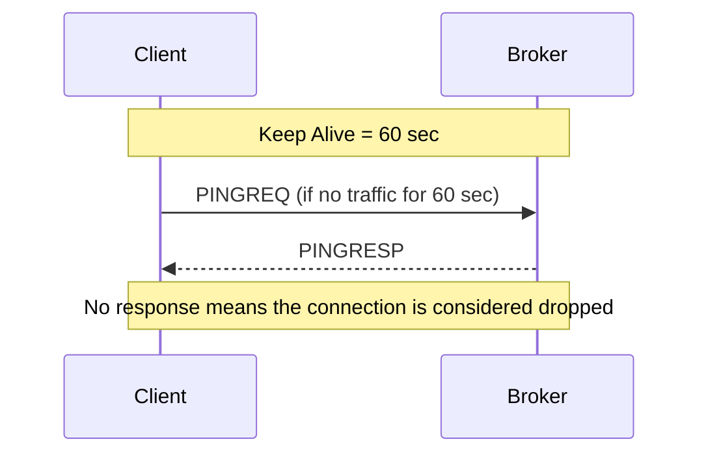
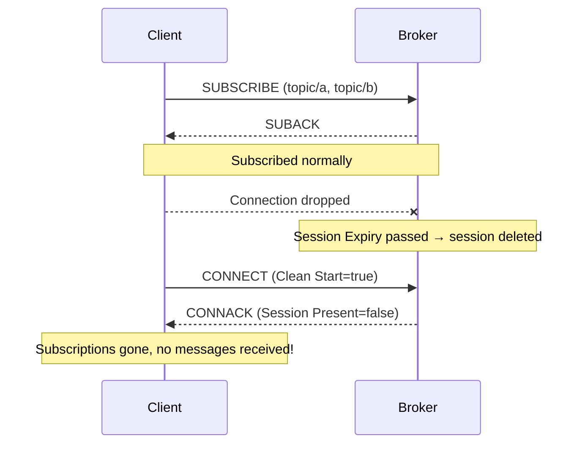
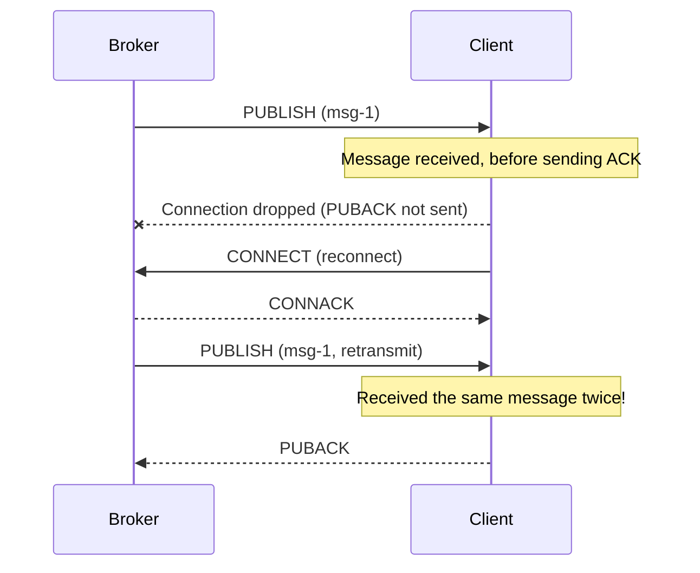
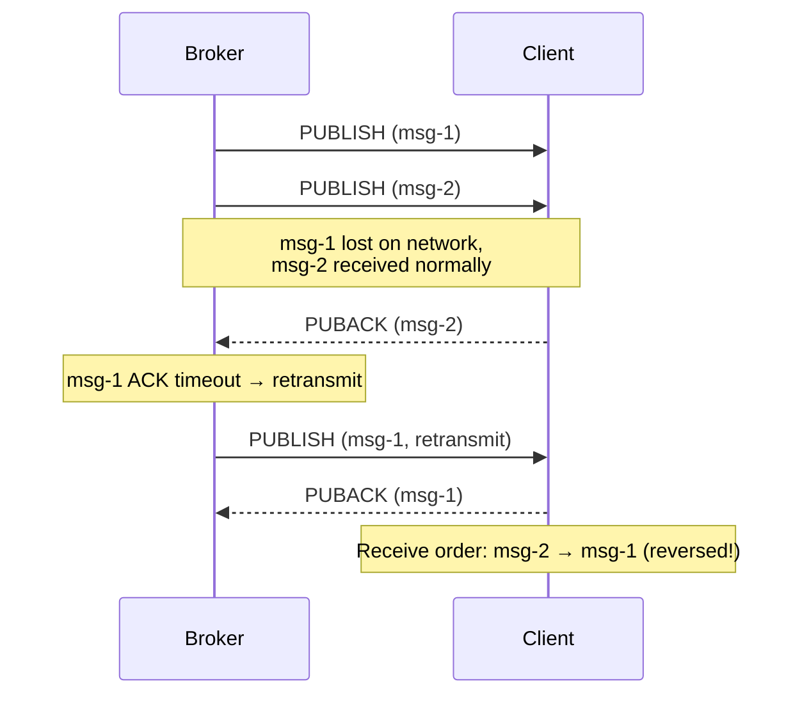

# 1. Mastering QoS


`QoS` (Quality of Service) refers to the **delivery guarantee level** of a message. It is one of the most important concepts in `MQTT`, and you must choose the appropriate `QoS` based on network conditions and message importance. Choosing a `QoS` involves a **trade-off between reliability and performance**. The higher the `QoS` level, the more certain message delivery becomes, but network overhead and latency increase accordingly.

This chapter examines how each `QoS` level works and explores which `QoS` is appropriate for which situation in practice. It also covers **how to handle duplicate messages** that can occur with `QoS` 1.

## 1.1 How QoS 0 / 1 / 2 Work

### 1.1.1 QoS 0: At Most Once

This is the "fire and forget" approach. The message is sent once without waiting for a response. Even if the message is lost due to network issues, it is not retransmitted. It is the fastest and lightest approach, but it does not guarantee message delivery.



**Characteristics:**
- Fastest
- Message loss possible
- No `ACK`

**Analogy**: Sending a postcard—you don't confirm whether it arrived

### 1.1.2 QoS 1: At Least Once

This is the "retransmit until acknowledged" approach.



**Characteristics:**
- Message delivery guaranteed
- Duplicates possible (retransmission if `ACK` is lost)
- Most commonly used

**Analogy**: Registered mail—confirmation of receipt required

### 1.1.3 QoS 2: Exactly Once

This is the "delivered exactly once without duplicates" approach.



**Characteristics:**
- No-duplicate guarantee
- Slowest (4 handshakes)
- Rarely used

**Analogy**: Bank transfer—must be executed exactly once

### 1.1.4 MQTT Control Packet Types

The `PUBLISH`, `PUBACK`, and other packets used in the diagrams above are official packet types defined by the `MQTT` protocol.

| Packet | Purpose |
|------|------|
| `CONNECT` / `CONNACK` | Connection request / response |
| `PUBLISH` | Message publish |
| `PUBACK` | `QoS` 1 response |
| `PUBREC` / `PUBREL` / `PUBCOMP` | `QoS` 2 handshake (3 steps) |
| `SUBSCRIBE` / `SUBACK` | Subscription request / response |
| `UNSUBSCRIBE` / `UNSUBACK` | Unsubscribe request / response |
| `PINGREQ` / `PINGRESP` | Keep Alive check |
| `DISCONNECT` | Connection termination |
| `AUTH` | Authentication (added in v5) |


### 1.1.5 At a Glance

| QoS | Name | Delivery Guarantee | Duplicates Possible | Speed |
|-----|------|-----------|-----------|------|
| 0 | At Most Once | X | X | Fast |
| 1 | At Least Once | O | O | Moderate |
| 2 | Exactly Once | O | X | Slow |

## 1.2 Criteria for Choosing QoS

### 1.2.1 Status Reports: QoS 0 or 1

Sensor data such as temperature and humidity is sent periodically, so missing one is fine because the next value arrives soon. Therefore, choose `QoS` 0 or 1 depending on the transmission frequency and data importance.

```
# Example: temperature sensor sends a value every second
topic: sensor/temp
payload: 25.5
qos: 0  # missing one is fine, the next value arrives
```

**Decision criteria:**
- Sent periodically → `QoS` 0
- Sent occasionally and important → `QoS` 1

### 1.2.2 Events: QoS 1

An event such as a door opening or a button click happens once and is over, so missing it makes recovery difficult. Since it must be delivered, use `QoS` 1.

```
# Example: door-opened event
topic: door/event/opened
payload: {"time": "10:30:00"}
qos: 1  # an event must not be missed
```

### 1.2.3 Commands: QoS 1 or 2

Commands sent to a device must be delivered. `QoS` 1 is sufficient in most cases, but for cases where duplicate execution is critical—such as payments—consider `QoS` 2 or idempotent handling.

```
# Example: turn-off-light command
topic: light/cmd/off
payload: {}
qos: 1  # must be delivered
```

**When duplicate execution is a problem:**
```
# Example: payment request
topic: payment/process
payload: {"amount": 10000}
qos: 2  # executed exactly once
# or QoS 1 + idempotent handling
```

## 1.3 QoS and Duplicate Handling

### 1.3.1 The Reality of At-Least-Once

`QoS` 1 guarantees message delivery, but if the `PUBACK` is lost, the publisher retransmits the same message, which can cause duplicates. This is intended behavior by design in `QoS` 1, so the subscriber side needs to handle duplicates.



### 1.3.2 Designing an Idempotent Consumer

Designing so that the result is the same even when a duplicate message is received is **idempotency**. It achieves effectively the same "exactly once" processing without the overhead of `QoS` 2, which is why the `QoS` 1 + idempotency combination is the most widely used in practice.

**Method 1: Check for duplicates by message ID**
```go
func handleMessage(msg Message) {
    // Check whether the message has already been processed
    if processed[msg.ID] {
        return  // ignore
    }

    processMessage(msg)
    processed[msg.ID] = true
}
```

**Method 2: State-based handling**
```go
// Bad: incrementing balance (a problem if duplicated)
balance += amount

// Good: setting state (same result even if duplicated)
balance = newBalance
status = "completed"
```

**Method 3: Use timestamps**
```go
func handleState(msg StateMessage) {
    // Ignore older messages
    if msg.Timestamp < lastTimestamp {
        return
    }

    updateState(msg)
    lastTimestamp = msg.Timestamp
}
```

---

# 2. Session & Connection Management

In `MQTT`, a session is a concept that goes beyond a simple `TCP` connection. A session includes subscription information, undelivered messages, `QoS` flow state, and more. Proper session management is key to preventing message loss in unstable network environments. This chapter covers the session lifecycle, the Keep Alive mechanism, and how to use Retained Messages.

## 2.1 Session Expiry Interval

A session is **connection state information** between a client and a broker. In v5, the Session Expiry Interval lets you finely control how long a session is retained even after the connection drops. This feature is especially useful in environments where connections drop frequently, such as mobile apps.

### 2.1.1 Clean Start vs. Session Retention

The Clean Start flag determines how the previous session is handled upon connection. This setting greatly affects how the system behaves, so it must be chosen carefully.

**Clean Start = true (new session)**
```
On connect:
  - Delete previous session info
  - Reset subscription info
  - Delete stored messages

Use cases:
  - Temporary connections
  - Publishers that don't need state
```

**Clean Start = false (retain session)**
```
On connect:
  - Restore previous session info
  - Retain subscription info
  - Deliver messages from the offline period

Use cases:
  - Persistent subscribers
  - Cases where messages must not be missed
```

### 2.1.2 Session Expiry Interval

This sets how long a session is retained.

```go
// Example session configuration
SessionExpiryInterval: 3600  // 1 hour

// Behavior
1. Client disconnects
2. Broker retains the session for 1 hour
3. Reconnect within 1 hour → session restored, backlogged messages delivered
4. Reconnect after 1 hour → new session starts
```

**Recommended values:**
- Mobile apps: 1-24 hours
- `IoT` devices: as needed (minutes to days)
- Temporary connections: 0 (no session retention)

### 2.1.3 Offline Messages

While the session is retained, the broker stores messages. Even if the client is offline, as long as the session is alive, messages of `QoS` 1 or higher pile up at the broker and are delivered all at once upon reconnection. Thanks to this, you can reliably receive data without message loss even in unstable network environments.



**Caveats:**
- `QoS` 0 messages are not stored
- There may be a limit on storage capacity
- You must reconnect before Session Expiry

## 2.2 Keep Alive

This is the mechanism for checking whether a connection is alive. Because a `TCP` connection often cannot immediately detect when the other side terminates abnormally, `MQTT` periodically exchanges `PINGREQ`/`PINGRESP` to verify the connection state. This allows a dropped connection to be detected quickly and a reconnection to be attempted.

### 2.2.1 The Ping Mechanism



**How it works:**
1. The client sets the Keep Alive interval (e.g., 60 seconds)
2. If there are no messages during that time, it sends a `PINGREQ`
3. The broker responds with a `PINGRESP`
4. If there is no response within Keep Alive * 1.5, the connection is terminated

### 2.2.2 Relationship with Network Quality

```
# Stable network
keep_alive: 60-120 sec

# Unstable network (mobile, IoT)
keep_alive: 15-30 sec
# Checks more often but increases overhead

# Very stable environment (within a data center)
keep_alive: 300 sec or more
```

**Trade-off:**
- Short Keep Alive: fast disconnect detection, high overhead
- Long Keep Alive: low overhead, slow disconnect detection

## 2.3 Retained Message

This is a feature that **stores the last message** on a topic. The broker keeps the most recent message for that topic, and when a new subscriber subscribes, it delivers it immediately. This lets the subscriber know the current state right away without waiting for the publisher's next publish.

### 2.3.1 Last Known State Pattern

```
# Temperature sensor publishes a Retained message
PUBLISH
  topic: sensor/temperature
  payload: 25
  retain: true

# The broker stores this message

# Later, when a new subscriber subscribes
SUBSCRIBE topic: sensor/temperature
# → immediately receives the last value (25)
```

**Why it is useful:**
- A newly connected client can immediately know the current state
- The sensor doesn't have to send frequently
- It can answer the question "what is the current state?"

### 2.3.2 Misuse Cases

```
# Bad use: Retain on an event
PUBLISH
  topic: door/event/opened
  payload: {"time": "10:30:00"}
  retain: true  # wrong!

# Problem: a new subscriber receives the past "door opened" event
# Can't distinguish whether it's the current door state or a past event
```

**When to use Retain:**
- State (temperature, humidity, power status)
- Configuration values
- Current location

**When not to use Retain:**
- Events (button click, door opening)
- Commands
- Logs

---

# 3. Reconnection Strategies

> This chapter is the **most important** part in practice.

Many `MQTT` tutorials cover only connecting and sending messages, but in real production code, reconnection logic accounts for a significant portion of the entire codebase. Networks inevitably drop, and without preparing for this, you cannot operate a stable service. This chapter covers in detail why reconnection is necessary, the problems that arise during reconnection, and proven reconnection strategies.

## 3.1 Why Reconnection Is Essential

### 3.1.1 Real-World Networks

In an ideal world, once you connect, the connection lasts forever. But reality is different. A network connection can drop for various reasons, and this is part of normal operation, not a bug. Therefore, reconnection should be designed as a core feature, not as exception handling.

**Causes of network drops:**
- Wi-Fi → `LTE` switch (mobile)
- Tunnels, elevators (mobile)
- Router restart
- ISP outage
- Broker restart
- Load balancer timeout
- Forced termination due to out of memory

### 3.1.2 Characteristics by Environment

**Mobile**
- Frequent network switching
- The OS drops the connection when the app goes into the background
- Restrictions due to battery saving

**Robots/Vehicles**
- Base station handoff while moving
- Passing through dead zones
- Hardware reboots

**`IoT` Sensors**
- Unstable power
- Wireless interference
- Restart due to firmware updates

### 3.1.3 Broker Failures

The broker can die too:
- Out of memory
- Disk full
- Upgrade/patch
- Hardware failure

**Conclusion**: Reconnection is not a question of "if" but of "when" it happens.

## 3.2 Problems That Arise During Reconnection

### 3.2.1 Lost Subscriptions

Subscriptions can disappear depending on the Clean Start setting. If Session Expiry has passed or you reconnect with Clean Start=true, the broker deletes the previous session, so all existing subscription information disappears. In this case, the client may mistakenly believe it is still subscribed while not receiving messages, which makes debugging difficult.



### 3.2.2 Duplicate Messages

Depending on the timing of reconnection, you can receive the same message multiple times. If the client received a message but the connection dropped before sending the `PUBACK`, the broker determines that delivery failed and retransmits the same message after reconnection. This is due to the At-Least-Once guarantee of `QoS` 1 and must be addressed with the idempotent design covered earlier.



### 3.2.3 Broken Message Order

In `QoS` 1, when multiple messages are inflight at the same time, if some are lost and retransmitted, they can arrive out of their original order. If you have logic that depends on order, you need handling that guarantees the correct order based on timestamps or sequence numbers.



## 3.3 Reconnection Design Strategies

### 3.3.1 Auto Reconnect

Most `MQTT` client libraries support automatic reconnection.

```go
// Paho v5 example
config := autopaho.ClientConfig{
    ConnectRetryDelay: 10 * time.Second,  // retry interval
    // ...
}
```

**What automatic reconnection does:**
1. Detects the connection drop
2. Waits for a certain amount of time
3. Attempts to reconnect
4. If it fails, waits again and retries

### 3.3.2 Backoff Strategies

This is a strategy that progressively increases the wait time when reconnection fails.

```
# Fixed Backoff
Attempt 1: wait 1 sec
Attempt 2: wait 1 sec
Attempt 3: wait 1 sec
...

# Exponential Backoff
Attempt 1: wait 1 sec
Attempt 2: wait 2 sec
Attempt 3: wait 4 sec
Attempt 4: wait 8 sec
...

# Exponential Backoff with Jitter (+ random)
Attempt 1: 1 sec + random(0~500ms)
Attempt 2: 2 sec + random(0~500ms)
...
```

**Why Jitter is needed:**
```
# Scenario: Broker restart
1. 1000 clients disconnect simultaneously
2. All attempt to reconnect after 1 second
3. A flood of 1000 connection requests hits the broker
4. Broker overload

# With Jitter applied
1. 1000 clients disconnect simultaneously
2. Each reconnects after 1 second + a random time
3. Connection requests are spread out
4. Broker handles them stably
```

### 3.3.3 Retaining vs. Resetting the Session

```go
// Retain the session (recommended)
CleanStart: false
SessionExpiryInterval: 3600  // 1 hour

// Advantages:
// - Subscription info retained
// - Receives offline messages

// Reset the session
CleanStart: true

// When needed:
// - When you must start completely fresh
// - When a problem occurs and you need to reset
```

## 3.4 Post-Reconnection Logic

### 3.4.1 Resubscription Strategy

If the session has expired or you used Clean Start, resubscription is necessary.

```go
// Callback on successful reconnection
func onConnect(client *paho.Client) {
    // Resubscribe to the required topics
    topics := []string{
        "device/+/state",
        "command/mydevice/#",
    }

    for _, topic := range topics {
        client.Subscribe(topic, qos)
    }
}
```

**Best Practice: Manage a subscription list**
```go
type SubscriptionManager struct {
    subscriptions map[string]byte  // topic -> qos
}

func (sm *SubscriptionManager) Resubscribe(client *paho.Client) {
    for topic, qos := range sm.subscriptions {
        client.Subscribe(topic, qos)
    }
}
```

### 3.4.2 Handling Unprocessed Messages

Considerations when receiving backlogged messages after reconnection:

```go
func onMessage(msg Message) {
    // 1. Check message age
    age := time.Since(msg.Timestamp)
    if age > maxMessageAge {
        log.Warn("Discarding old message", age)
        return
    }

    // 2. Check for duplicates
    if isProcessed(msg.ID) {
        return
    }

    // 3. Process
    processMessage(msg)
    markAsProcessed(msg.ID)
}
```

### 3.4.3 State Synchronization Patterns

These are patterns for synchronizing the current state after reconnection.

**Method 1: Use Retained Messages**
```
# Subscribing immediately receives the last state
SUBSCRIBE topic: device/+/state
→ Receive the last state of each device
```

**Method 2: Explicit state request**
```
# Request state after reconnection
PUBLISH topic: device/mydevice/cmd/get_state
→ The device responds with its current state
```

**Method 3: Sequence-number based**
```go
// Store the last processed sequence
lastSequence := loadLastSequence()

// After reconnection
for _, msg := range messages {
    if msg.Sequence <= lastSequence {
        continue  // already processed
    }
    processMessage(msg)
    saveLastSequence(msg.Sequence)
}
```

---

# 4. Conclusion

Here is a summary of the key points covered in this part.

**Choosing QoS**
- `QoS` 0: fast but loss is possible. Suitable for periodic status reports
- `QoS` 1: guarantees delivery but duplicates are possible. Most commonly used
- `QoS` 2: delivered exactly once. High overhead, so rarely used
- Solve duplicate handling with idempotent design

**Session Management**
- Retaining the session with Clean Start=false allows receiving offline messages
- Set the session retention time with the Session Expiry Interval
- Verify the connection state with Keep Alive. Tune it according to the network environment
- Use Retained Messages only for state information. Not suitable for events

**Reconnection Strategies**
- Network drops are a matter of "when," not "if"
- Distribute broker load with Exponential Backoff + Jitter
- Resubscription, duplicate checks, and state synchronization after reconnection are essential

In practice, reconnection logic accounts for a significant portion of the entire codebase. To build a stable `MQTT` system, you must thoroughly understand these three areas.

---

> **Next part**: In [MQTT v5 Complete Guide Part 4: Advanced Features and Security](/database/mqtt-v5-완벽-가이드-4-고급-기능과-보안), we cover Shared Subscriptions, the Request/Response pattern, Reason Codes, and TLS security configuration.

---

# 5. References

- [MQTT v5 Spec](https://docs.oasis-open.org/mqtt/mqtt/v5.0/mqtt-v5.0.html)
- [Eclipse Paho Go Client](https://github.com/eclipse/paho.golang)
