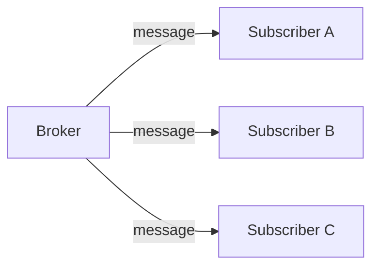
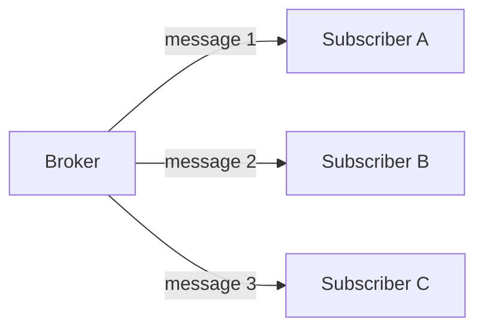
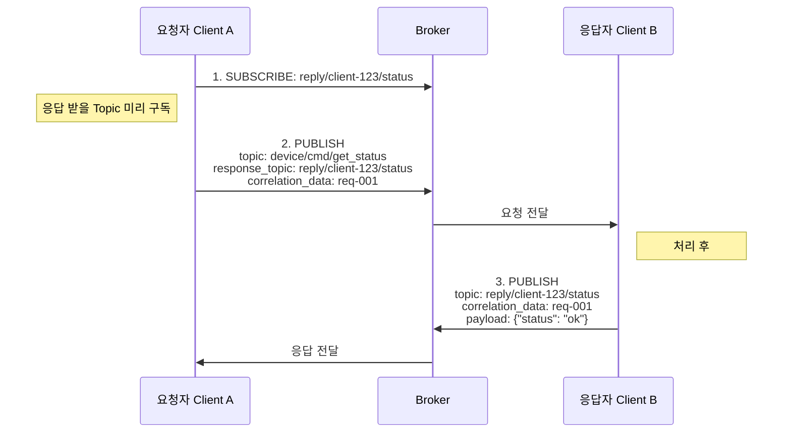
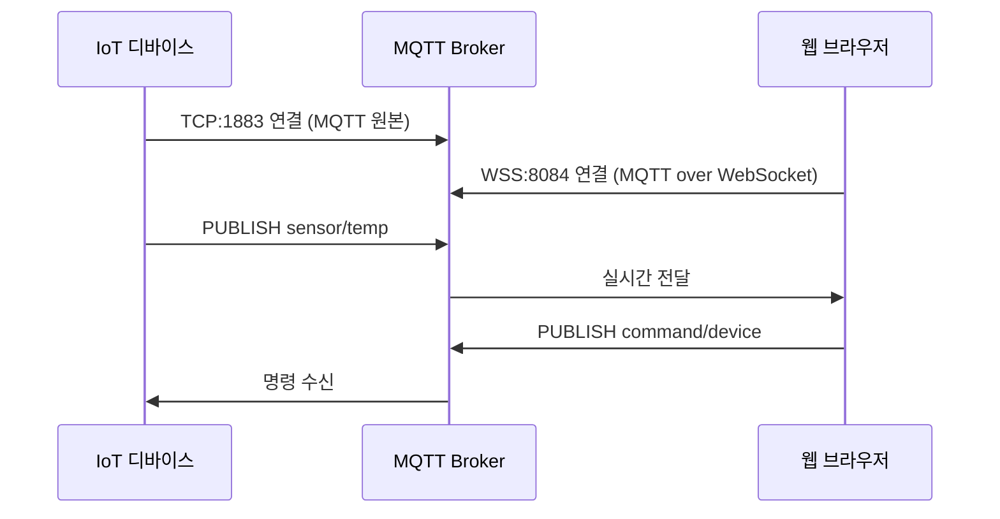

# 1. MQTT v5 고급 기능

MQTT v5에서는 실무에서 자주 필요한 고급 기능들이 추가되었다. 이 장에서는 로드 밸런싱을 위한 Shared Subscription, HTTP 스타일의 Request/Response 패턴, 그리고 디버깅에 필수적인 Reason Code를 다룬다. 이 기능들을 활용하면 더 확장성 있고 운영하기 쉬운 시스템을 구축할 수 있다.

## 1.1 Shared Subscription

여러 Subscriber가 **메시지를 나눠서** 처리하는 기능이다. 일반적인 MQTT 구독에서는 같은 Topic을 구독하는 모든 Subscriber가 동일한 메시지를 받는다. 하지만 Shared Subscription을 사용하면 메시지가 구독자들 사이에 분배되어 로드 밸런싱 효과를 얻을 수 있다. 이는 대량의 메시지를 처리해야 하는 시스템에서 수평 확장을 가능하게 한다.

### 1.1.1 개념

Shared Subscription의 핵심은 같은 그룹 내의 Subscriber들이 메시지를 분배받는다는 것이다. 이를 통해 단일 Subscriber의 처리 한계를 넘어서는 대량의 메시지를 처리할 수 있다.

**일반 구독** - 같은 메시지를 모두에게 전달:



**Shared Subscription** - 메시지를 분배:



**사용 방법:**
```
# Topic 앞에 $share/그룹명/ 추가
$share/mygroup/sensor/temperature

# 같은 그룹 내에서 메시지 분배
# 다른 그룹은 독립적으로 모든 메시지 수신
```

### 1.1.2 로드 분산 vs 순서 보장

Shared Subscription은 처리량을 높여주지만, 메시지가 여러 Subscriber에 분배되므로 전체 순서가 보장되지 않는다. 이 트레이드오프를 이해하고 사용해야 한다.

**로드 분산 관점:**
```
처리량 = 단일 Subscriber 처리량 × Subscriber 수
```

**순서 보장 관점:**
```
# 문제
Message 1 → Subscriber A
Message 2 → Subscriber B
Message 3 → Subscriber A

# Subscriber A 입장에서 순서: 1, 3 (2가 없음)
# 전체 순서 보장 안 됨!
```

### 1.1.3 언제 쓰면 안 되는가

**쓰면 안 되는 경우:**

1. 메시지 순서가 중요할 때
   - 거래 처리
   - 상태 변경 추적
2. 상태를 유지해야 할 때
   - 특정 디바이스의 모든 메시지를 한 곳에서 처리

**적합한 경우:**

1. 독립적인 메시지 처리
   - 로그 수집
   - 이미지 처리
   - 알림 발송

## 1.2 Request / Response 패턴

MQTT는 기본적으로 Publish/Subscribe 모델이지만, v5에서 추가된 Response Topic과 Correlation Data를 활용하면 HTTP처럼 요청-응답 패턴을 구현할 수 있다. 디바이스 상태 조회나 원격 명령 실행 등 응답이 필요한 시나리오에서 유용하다.

### 1.2.1 Response Topic

요청자는 PUBLISH 메시지의 `response_topic` 속성에 응답을 받을 Topic을 지정한다. 응답자는 이 Topic으로 결과를 PUBLISH하므로, 요청자는 반드시 해당 Topic을 미리 SUBSCRIBE 해두어야 한다.



**핵심 포인트:**

- **요청자**는 요청 전에 `response_topic`을 미리 **SUBSCRIBE** 해야 함
- **응답자**는 요청의 `response_topic`으로 **PUBLISH**하여 응답
- 요청과 응답 모두 PUBLISH이며, 구독은 응답을 받기 위한 사전 준비

### 1.2.2 Correlation Data

하나의 Response Topic으로 여러 요청의 응답이 올 수 있으므로, 어떤 요청에 대한 응답인지 구분할 수단이 필요하다. Correlation Data는 요청 시 설정한 임의의 바이트 값으로, 응답에 그대로 포함되어 돌아오기 때문에 요청-응답을 정확히 매칭할 수 있다.

```go
// 요청 보내기
request := &paho.Publish{
    Topic:   "device/cmd",
    Payload: []byte("get_status"),
    Properties: &paho.PublishProperties{
        ResponseTopic:   "reply/my-client",
        CorrelationData: []byte("req-12345"),
    },
}

// 응답 받기 (reply/my-client 구독 중)
func onMessage(msg Message) {
    correlationID := string(msg.Properties.CorrelationData)
    // correlationID == "req-12345" 로 매칭
}
```

### 1.2.3 Timeout 처리

MQTT는 비동기 프로토콜이므로 응답이 오지 않을 수 있다. 응답자가 오프라인이거나 처리에 실패한 경우를 대비하여 반드시 타임아웃을 설정하고, 시간 내에 응답이 없으면 재시도하거나 에러로 처리해야 한다.

```go
func requestWithTimeout(request Message, timeout time.Duration) (Response, error) {
    // 1. 응답 채널 생성
    responseChan := make(chan Response)
    pending[request.CorrelationID] = responseChan

    // 2. 요청 전송
    client.Publish(request)

    // 3. 응답 또는 타임아웃 대기
    select {
    case resp := <-responseChan:
        return resp, nil
    case <-time.After(timeout):
        delete(pending, request.CorrelationID)
        return Response{}, ErrTimeout
    }
}
```

**Best Practice:**
- 항상 타임아웃 설정
- 타임아웃 시 재시도 또는 에러 처리
- 오래된 응답은 무시

## 1.3 Reason Code

MQTT v3에서는 연결이나 구독이 실패해도 구체적인 원인을 알기 어려웠다. v5에서는 CONNACK, PUBACK, SUBACK 등 모든 응답에 Reason Code가 포함되어, 성공 여부뿐 아니라 실패 원인까지 정확히 파악할 수 있다. 이를 통해 클라이언트 측에서 적절한 에러 처리와 디버깅이 가능해진다.

### 1.3.1 성공/실패 세분화

Reason Code는 0~255 범위의 숫자로, 0은 성공을 의미하고 128 이상은 에러를 나타낸다. 연결, 발행, 구독 등 각 동작마다 고유한 Reason Code 집합이 정의되어 있다.

```
# 연결 응답 Reason Code 예시
0   = Success
128 = Unspecified error
129 = Malformed Packet
130 = Protocol Error
131 = Implementation specific error
132 = Unsupported Protocol Version
133 = Client Identifier not valid
134 = Bad User Name or Password
135 = Not authorized
```

### 1.3.2 장애 원인 파악

Reason Code를 활용하면 연결 실패 시 인증 문제인지, 권한 문제인지, 서버 문제인지를 코드 레벨에서 구분하여 처리할 수 있다. 운영 환경에서는 이를 로깅하여 장애 원인을 빠르게 파악하는 데 활용한다.

```go
// 연결 실패 시
func onConnectError(err error, reasonCode byte) {
    switch reasonCode {
    case 134:
        log.Error("인증 실패: 사용자명/비밀번호 확인 필요")
    case 135:
        log.Error("권한 없음: ACL 설정 확인 필요")
    case 137:
        log.Error("서버 사용 불가: 잠시 후 재시도")
    default:
        log.Error("연결 실패", reasonCode)
    }
}
```

**v3과의 차이:**
```
v3: "연결 실패" (왜?)
v5: "연결 실패 - Reason Code 134: Bad User Name or Password"
```

---

# 2. 보안

MQTT 시스템의 보안은 세 가지 축으로 구성된다: 인증(Authentication), 인가(Authorization), 그리고 암호화(Encryption). 인증은 "당신이 누구인가"를 확인하고, 인가는 "무엇을 할 수 있는가"를 결정하며, 암호화는 "통신 내용이 노출되지 않는가"를 보장한다. 특히 IoT 환경에서는 수많은 디바이스가 연결되므로 보안 설계가 더욱 중요한다.

## 2.1 인증

Client가 **누구인지** 확인한다. MQTT에서는 연결 시점에 인증이 이루어지며, 한 번 인증된 연결은 세션이 유지되는 동안 유효한다. 인증에 실패하면 Broker는 연결을 거부하고, v5에서는 Reason Code를 통해 실패 원인을 알려준다.

### 2.1.1 Username / Password

가장 기본적인 인증 방식이다. 설정이 간단하여 개발 및 테스트 환경에서 많이 사용된다. 하지만 보안 수준이 높지 않으므로 프로덕션에서는 TLS와 함께 사용하거나 다른 인증 방식을 고려해야 한다.

```go
// 연결 시 인증 정보 제공
config := paho.Connect{
    ClientID: "my-device",
    Username: "device-001",
    Password: []byte("secret-password"),
}
```

**주의사항:**
- 평문으로 전송됨 (TLS 필수)
- 비밀번호 관리 필요
- 각 디바이스별 고유 인증 정보 권장

### 2.1.2 Token 기반 인증

JWT 등의 토큰을 사용하는 방식이다.

```go
// JWT 토큰을 Password로 사용
token := generateJWT(deviceID, expiry)
config := paho.Connect{
    ClientID: "my-device",
    Username: "jwt",
    Password: []byte(token),
}
```

**장점:**
- 만료 시간 설정 가능
- 추가 정보 포함 가능 (권한 등)
- 비밀번호 저장 불필요

## 2.2 인가

인증된 Client가 **무엇을 할 수 있는지** 결정한다. ACL(Access Control List)은 **Broker 측에서 설정**하며, 클라이언트 코드가 아닌 Broker의 설정 파일이나 관리 시스템에서 구성한다.

### 2.2.1 Broker별 ACL 설정 방식

| Broker | 설정 방식 |
|--------|----------|
| **Mosquitto** | `acl_file` 설정 파일 (텍스트) |
| **EMQX** | Dashboard UI, REST API, 또는 외부 DB 연동 |
| **HiveMQ** | XML 설정 또는 Extension |
| **VerneMQ** | `vmq.acl` 파일 또는 플러그인 |

### 2.2.2 Topic 기반 ACL

**Mosquitto 설정 예시:**

```bash
# mosquitto.conf에서 ACL 파일 지정
password_file /mosquitto/config/passwd
acl_file /mosquitto/config/acl
```

```
# /mosquitto/config/acl
user sensor-001
topic read sensor/+/state     # 읽기만 가능
topic write sensor/001/#      # 자기 토픽만 쓰기

user admin
topic readwrite #             # 모든 토픽 읽기/쓰기
```

### 2.2.3 ACL 변경 적용 방법

ACL 파일을 수정한 후에는 Broker에 변경 사항을 적용해야 한다.

**Mosquitto 적용 방법:**

| 방법 | 명령어 | 설명 |
|------|--------|------|
| 재시작 | `docker restart mosquitto` | 모든 연결 끊김 |
| 설정 리로드 | `kill -SIGHUP $(pidof mosquitto)` | 연결 유지하며 리로드 (Linux) |
| Dynamic Security | REST API 호출 | 런타임 변경 가능 (v2.0+) |

**Broker별 동적 변경 지원:**

| Broker | 동적 변경 | 방법 |
|--------|----------|------|
| **Mosquitto** | △ (플러그인 필요) | Dynamic Security 플러그인 |
| **EMQX** | O | Dashboard/REST API로 즉시 반영 |
| **HiveMQ** | O | Control Center에서 즉시 반영 |
| **VerneMQ** | △ | `vmq-admin` CLI로 리로드 |

### 2.2.4 Mosquitto Dynamic Security 플러그인

Mosquitto 2.0부터 제공되는 **Dynamic Security 플러그인**을 사용하면 Broker 재시작 없이 런타임에 사용자, 그룹, ACL을 관리할 수 있다.

**활성화 방법:**

```bash
# mosquitto.conf
listener 1883
allow_anonymous false
plugin /usr/lib/mosquitto_dynamic_security.so
plugin_opt_config_file /mosquitto/config/dynamic-security.json
```

**초기 설정:**

```bash
# 관리자 계정 생성
mosquitto_ctrl dynsec init /mosquitto/config/dynamic-security.json admin-user

# 클라이언트 추가
mosquitto_ctrl dynsec createClient sensor-001 -p password123

# ACL 설정
mosquitto_ctrl dynsec addClientRole sensor-001 sensor-role
```

**장점:**
- Broker 재시작 없이 사용자/권한 관리
- JSON 기반 설정으로 백업/복원 용이
- `mosquitto_ctrl` CLI 또는 MQTT 메시지로 관리 가능

### 2.2.5 mosquitto-go-auth 플러그인

외부 시스템과 연동하여 동적으로 ACL을 체크하려면 **mosquitto-go-auth** 플러그인을 사용할 수 있다. 이 오픈소스 플러그인은 매 요청마다 외부 Backend에서 권한을 조회하므로, Broker 재시작 없이 실시간으로 권한 변경이 반영된다.

- GitHub: https://github.com/iegomez/mosquitto-go-auth

**지원하는 Backend:**

| Backend | 설명 |
|---------|------|
| **HTTP** | 외부 API 호출로 인증/인가 |
| **PostgreSQL** | DB에서 사용자/ACL 조회 |
| **MySQL** | DB에서 사용자/ACL 조회 |
| **Redis** | 캐시 기반 빠른 조회 |
| **MongoDB** | Document DB 연동 |
| **JWT** | 토큰 기반 인증 |
| **SQLite** | 경량 DB |

**HTTP Backend 설정 예시:**

```bash
# mosquitto.conf
auth_plugin /mosquitto/go-auth.so
auth_opt_backends http
auth_opt_http_host your-auth-server.com
auth_opt_http_port 8080
auth_opt_http_aclcheck_uri /mqtt/acl
auth_opt_http_usercheck_uri /mqtt/user
```

**인증 서버 구현 예시 (Go):**

```go
// POST /mqtt/acl
// Body: {"username": "sensor-001", "topic": "sensor/001/data", "acc": 2}
// acc: 1=subscribe, 2=publish

func checkACL(w http.ResponseWriter, r *http.Request) {
    var req struct {
        Username string `json:"username"`
        Topic    string `json:"topic"`
        Acc      int    `json:"acc"`  // 1: subscribe, 2: publish
    }
    json.NewDecoder(r.Body).Decode(&req)

    // DB에서 권한 조회 후 동적으로 판단
    allowed := checkPermissionFromDB(req.Username, req.Topic, req.Acc)

    if allowed {
        w.WriteHeader(http.StatusOK)       // 200: 허용
    } else {
        w.WriteHeader(http.StatusForbidden) // 403: 거부
    }
}
```

**장점:**
- 매 요청마다 실시간 ACL 체크
- Broker 재시작 없이 권한 변경 즉시 반영
- 비즈니스 로직에 맞는 복잡한 권한 체크 가능
- 기존 인증 시스템(LDAP, OAuth 등)과 통합 용이

프로덕션 환경에서는 동적 변경이 가능한 방식을 선택하는 것이 운영에 유리한다.

### 2.2.6 Publish / Subscribe 권한 분리

```
# 센서는 자기 데이터만 발행
sensor-001:
  publish: sensor/001/data
  subscribe: command/001/#

# 대시보드는 모든 센서 데이터 구독, 명령 발행
dashboard:
  publish: command/+/#
  subscribe: sensor/+/data
```

## 2.3 TLS

통신 내용을 **암호화**한다. MQTT는 기본적으로 평문 통신을 하므로, 인터넷을 통한 통신이나 민감한 데이터 전송 시 TLS를 반드시 적용해야 한다.

### 2.3.1 MQTT 포트 규약

| 포트 | 프로토콜 | 설명 |
|------|----------|------|
| **1883** | MQTT (평문) | 개발/테스트 또는 폐쇄망 |
| **8883** | MQTTS (TLS) | 프로덕션 표준 |
| **8084** | WSS (WebSocket + TLS) | 브라우저 연결 시 |

### 2.3.2 TLS 인증 방식

| 방식 | 설명 | 사용 사례 |
|------|------|----------|
| **Server Auth Only** | 클라이언트가 서버 인증서 검증 | 일반적인 웹 서비스와 동일 |
| **Mutual TLS (mTLS)** | 서버와 클라이언트 상호 인증 | 높은 보안이 필요한 IoT |

### 2.3.3 Mosquitto TLS 설정

**1. 인증서 생성 (테스트용 Self-signed)**

```bash
# CA 인증서 생성
openssl genrsa -out ca.key 2048
openssl req -x509 -new -nodes -key ca.key -sha256 -days 365 \
    -out ca.crt -subj "/CN=MQTT CA"

# 서버 인증서 생성
openssl genrsa -out server.key 2048
openssl req -new -key server.key -out server.csr \
    -subj "/CN=mqtt.example.com"
openssl x509 -req -in server.csr -CA ca.crt -CAkey ca.key \
    -CAcreateserial -out server.crt -days 365 -sha256
```

**2. Mosquitto 설정 (mosquitto.conf)**

```bash
# 평문 포트 (개발용, 프로덕션에서는 비활성화 권장)
listener 1883 localhost

# TLS 포트
listener 8883
cafile /mosquitto/certs/ca.crt
certfile /mosquitto/certs/server.crt
keyfile /mosquitto/certs/server.key

# TLS 버전 설정 (1.2 이상 권장)
tls_version tlsv1.2

# Mutual TLS (클라이언트 인증서 요구 시)
# require_certificate true
# use_identity_as_username true
```

**3. Docker Compose 예시**

```yaml
version: '3'
services:
  mosquitto:
    image: eclipse-mosquitto:2
    ports:
      - "1883:1883"
      - "8883:8883"
    volumes:
      - ./mosquitto.conf:/mosquitto/config/mosquitto.conf
      - ./certs:/mosquitto/certs
```

### 2.3.4 Go 클라이언트 TLS 설정

```go
import (
    "crypto/tls"
    "crypto/x509"
    "os"
)

func createTLSConfig(caFile string) (*tls.Config, error) {
    // CA 인증서 로드
    caCert, err := os.ReadFile(caFile)
    if err != nil {
        return nil, err
    }

    caCertPool := x509.NewCertPool()
    caCertPool.AppendCertsFromPEM(caCert)

    return &tls.Config{
        RootCAs:            caCertPool,
        MinVersion:         tls.VersionTLS12,
        InsecureSkipVerify: false,  // 프로덕션에서는 반드시 false
    }, nil
}

// autopaho에서 사용
func main() {
    tlsConfig, _ := createTLSConfig("/path/to/ca.crt")

    brokerURL, _ := url.Parse("tls://mqtt.example.com:8883")

    config := autopaho.ClientConfig{
        BrokerUrls: []*url.URL{brokerURL},
        TlsCfg:     tlsConfig,  // TLS 설정 적용
        // ...
    }
}
```

### 2.3.5 Mutual TLS (mTLS) 설정

클라이언트도 인증서를 제출해야 하는 양방향 인증이다.

```go
func createMutualTLSConfig(caFile, certFile, keyFile string) (*tls.Config, error) {
    // CA 인증서 로드
    caCert, err := os.ReadFile(caFile)
    if err != nil {
        return nil, err
    }
    caCertPool := x509.NewCertPool()
    caCertPool.AppendCertsFromPEM(caCert)

    // 클라이언트 인증서 로드
    clientCert, err := tls.LoadX509KeyPair(certFile, keyFile)
    if err != nil {
        return nil, err
    }

    return &tls.Config{
        RootCAs:      caCertPool,
        Certificates: []tls.Certificate{clientCert},
        MinVersion:   tls.VersionTLS12,
    }, nil
}
```

### 2.3.6 성능과 보안의 균형

| 항목 | TLS 1.2 | TLS 1.3 |
|------|---------|---------|
| 핸드셰이크 | 2-RTT | 1-RTT (더 빠름) |
| 암호화 스위트 | 다양함 | 간소화됨 |
| 0-RTT 재연결 | X | O |
| 권장 환경 | 레거시 호환 필요 시 | 신규 시스템 |

**경량 디바이스 고려사항:**
- TLS 1.3 사용 권장 (핸드셰이크 오버헤드 감소)
- 하드웨어 암호화 가속 지원 여부 확인
- 리소스 제약 시 VPN으로 네트워크 레벨 보안 대체 고려

## 2.4 MQTT over WebSocket

브라우저는 TCP 소켓을 직접 사용할 수 없기 때문에, 웹 애플리케이션에서 MQTT를 사용하려면 WebSocket으로 감싸야 한다. MQTT over WebSocket을 사용하면 프론트엔드에서도 실시간으로 MQTT Topic을 구독하고 메시지를 발행할 수 있다.

### 2.4.1 동작 원리



**핵심 포인트:**
- WebSocket 클라이언트도 일반 MQTT 클라이언트와 **동일하게 동작**
- 같은 Topic을 공유하며 서로 메시지를 주고받을 수 있음
- Broker 입장에서는 연결 방식만 다를 뿐 동일한 클라이언트

### 2.4.2 Mosquitto WebSocket 설정

```bash
# mosquitto.conf

# 일반 MQTT (TCP)
listener 1883

# WebSocket (평문) - 개발용
listener 8083
protocol websockets

# WebSocket (TLS) - 프로덕션
listener 8084
protocol websockets
cafile /mosquitto/certs/ca.crt
certfile /mosquitto/certs/server.crt
keyfile /mosquitto/certs/server.key
```

### 2.4.3 프론트엔드 연동 (JavaScript)

**MQTT.js 설치:**

```bash
npm install mqtt
```

**React/Vue 등에서 사용:**

```javascript
import mqtt from 'mqtt';

// WebSocket으로 MQTT Broker 연결
const client = mqtt.connect('wss://mqtt.example.com:8084/mqtt', {
    clientId: 'web-dashboard-' + Math.random().toString(16).substr(2, 8),
    username: 'dashboard-user',
    password: 'secret',
    clean: true,
});

// 연결 성공
client.on('connect', () => {
    console.log('MQTT Connected!');

    // Topic 구독
    client.subscribe('sensor/+/temperature', { qos: 1 });
    client.subscribe('sensor/+/humidity', { qos: 1 });
});

// 실시간 메시지 수신
client.on('message', (topic, message) => {
    const data = JSON.parse(message.toString());
    console.log(`${topic}:`, data);

    // 예: sensor/livingroom/temperature: { value: 25.5, unit: "°C" }
    // UI 업데이트 로직
    updateDashboard(topic, data);
});

// 메시지 발행 (디바이스 제어)
function sendCommand(deviceId, command) {
    client.publish(
        `command/${deviceId}`,
        JSON.stringify(command),
        { qos: 1 }
    );
}

// 사용 예: sendCommand('light-001', { action: 'turn_on', brightness: 80 });
```

**연결 해제:**

```javascript
// 컴포넌트 언마운트 시
client.end();
```

### 2.4.4 React Hook 예시

```javascript
import { useEffect, useState } from 'react';
import mqtt from 'mqtt';

function useMQTT(brokerUrl, topics) {
    const [messages, setMessages] = useState({});
    const [client, setClient] = useState(null);
    const [isConnected, setIsConnected] = useState(false);

    useEffect(() => {
        const mqttClient = mqtt.connect(brokerUrl);

        mqttClient.on('connect', () => {
            setIsConnected(true);
            topics.forEach(topic => mqttClient.subscribe(topic));
        });

        mqttClient.on('message', (topic, message) => {
            setMessages(prev => ({
                ...prev,
                [topic]: JSON.parse(message.toString())
            }));
        });

        mqttClient.on('error', (err) => console.error('MQTT Error:', err));
        mqttClient.on('close', () => setIsConnected(false));

        setClient(mqttClient);

        return () => mqttClient.end();
    }, [brokerUrl]);

    const publish = (topic, message) => {
        if (client && isConnected) {
            client.publish(topic, JSON.stringify(message));
        }
    };

    return { messages, isConnected, publish };
}

// 사용 예시
function Dashboard() {
    const { messages, isConnected, publish } = useMQTT(
        'wss://mqtt.example.com:8084/mqtt',
        ['sensor/+/temperature', 'sensor/+/humidity']
    );

    return (
        <div>
            <p>연결 상태: {isConnected ? 'O 연결됨' : 'X 끊김'}</p>
            <p>거실 온도: {messages['sensor/livingroom/temperature']?.value}°C</p>
            <button onClick={() => publish('command/ac', { action: 'turn_on' })}>
                에어컨 켜기
            </button>
        </div>
    );
}
```

### 2.4.5 실제 사용 사례

| 사용 사례 | 설명 |
|----------|------|
| **IoT 대시보드** | 센서 데이터 실시간 시각화 |
| **스마트홈 앱** | 조명, 에어컨 등 원격 제어 |
| **실시간 알림** | 이벤트 발생 시 즉시 알림 |
| **채팅 애플리케이션** | 메시지 실시간 전송/수신 |
| **라이브 모니터링** | 서버/장비 상태 실시간 확인 |
| **협업 도구** | 문서 동시 편집 상태 공유 |

### 2.4.6 WebSocket vs HTTP Polling

| 항목 | WebSocket (MQTT) | HTTP Polling |
|------|------------------|--------------|
| 지연 시간 | 수 ms (실시간) | 폴링 간격에 의존 |
| 서버 부하 | 낮음 (연결 유지) | 높음 (반복 요청) |
| 양방향 통신 | O 기본 지원 | X 별도 구현 필요 |
| 배터리 소모 | 낮음 | 높음 |

**결론:** 실시간성이 중요한 웹 애플리케이션에서는 MQTT over WebSocket이 HTTP Polling보다 효율적이다.

---

> **다음 편 안내**: [MQTT v5 완벽 가이드 (5): Go + Paho 실전 구현과 운영](/database/mqtt-v5-완벽-가이드-5-go-paho-실전-구현과-운영)에서는 Go 언어로 MQTT v5 클라이언트를 구현하는 방법과 프로덕션 운영 전략을 다룬다.

---

# 3. 참고

- [MQTT v5 스펙](https://docs.oasis-open.org/mqtt/mqtt/v5.0/mqtt-v5.0.html)
- [Mosquitto 문서](https://mosquitto.org/documentation/)
- [mosquitto-go-auth](https://github.com/iegomez/mosquitto-go-auth)
