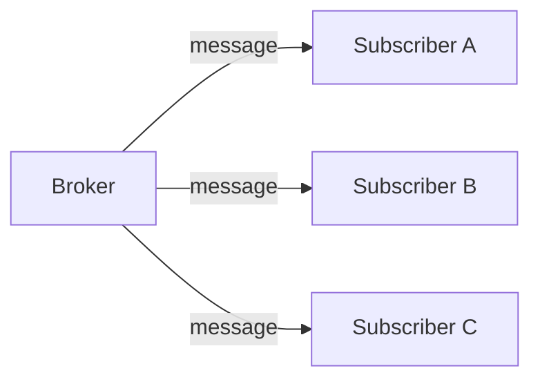
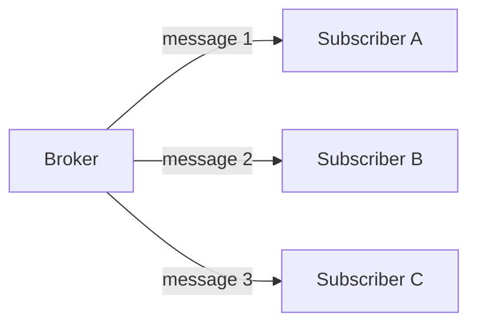
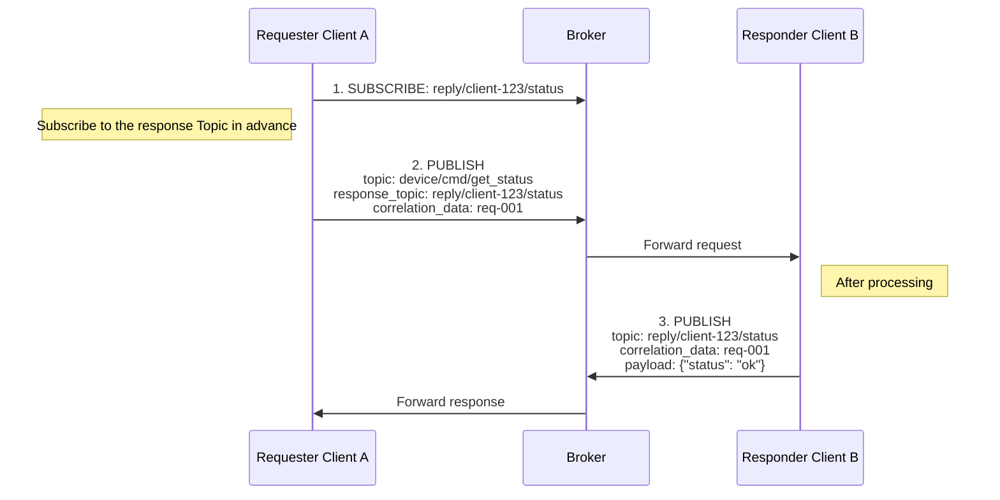
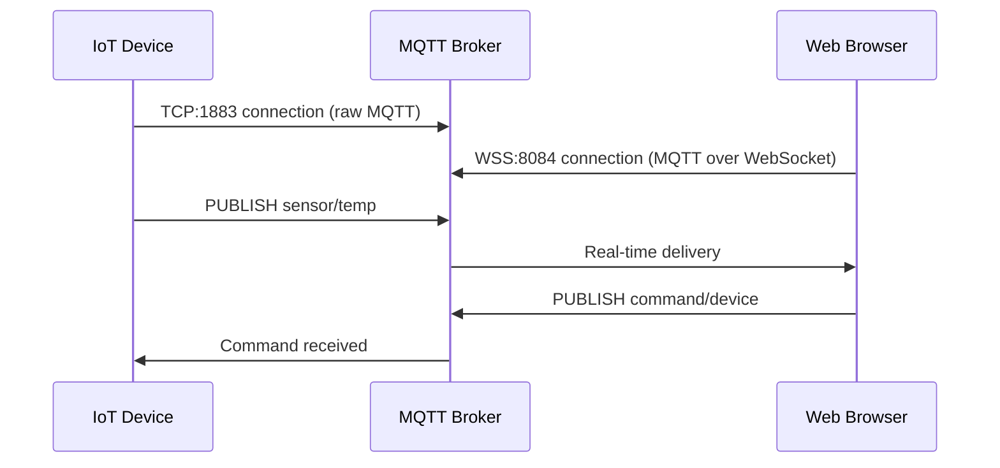

# 1. MQTT v5 Advanced Features


`MQTT` v5 added advanced features that are frequently needed in practice. This chapter covers Shared Subscription for load balancing, the `HTTP`-style Request/Response pattern, and Reason Codes that are essential for debugging. Using these features, you can build systems that are more scalable and easier to operate.

## 1.1 Shared Subscription

This is a feature where multiple Subscribers **share the work** of processing messages. In a typical `MQTT` subscription, every Subscriber subscribing to the same Topic receives the same message. With Shared Subscription, however, messages are distributed among the subscribers, providing a load balancing effect. This enables horizontal scaling in systems that need to process large volumes of messages.

### 1.1.1 Concept

The core idea of Shared Subscription is that Subscribers within the same group share the distribution of messages. This allows you to process volumes of messages that exceed the processing limit of a single Subscriber.

**Normal subscription** - delivers the same message to everyone:



**Shared Subscription** - distributes messages:



**How to use:**
```
# Add $share/groupname/ in front of the Topic
$share/mygroup/sensor/temperature

# Messages are distributed within the same group
# Other groups independently receive all messages
```

### 1.1.2 Load Distribution vs Order Guarantee

Shared Subscription increases throughput, but since messages are distributed across multiple Subscribers, overall ordering is not guaranteed. You need to understand and account for this trade-off.

**Load distribution perspective:**
```
Throughput = single Subscriber throughput × number of Subscribers
```

**Order guarantee perspective:**
```
# Problem
Message 1 → Subscriber A
Message 2 → Subscriber B
Message 3 → Subscriber A

# Order from Subscriber A's view: 1, 3 (2 is missing)
# Overall ordering is NOT guaranteed!
```

### 1.1.3 When Not to Use It

**Cases where you should not use it:**

1. When message ordering matters
   - Transaction processing
   - State change tracking
2. When you need to maintain state
   - Processing all messages from a specific device in one place

**Suitable cases:**

1. Independent message processing
   - Log collection
   - Image processing
   - Notification dispatch

## 1.2 Request / Response Pattern

`MQTT` is fundamentally a `Publish`/`Subscribe` model, but by using the Response Topic and Correlation Data added in v5, you can implement a request-response pattern like `HTTP`. This is useful in scenarios that require a response, such as querying device state or executing remote commands.

### 1.2.1 Response Topic

The requester specifies the Topic where it wants to receive the response in the `response_topic` property of the `PUBLISH` message. The responder `PUBLISH`es the result to this Topic, so the requester must `SUBSCRIBE` to that Topic in advance.



**Key points:**

- The **requester** must `SUBSCRIBE` to the `response_topic` before sending the request
- The **responder** responds by `PUBLISH`ing to the request's `response_topic`
- Both request and response are `PUBLISH`, and the subscription is preparation for receiving the response

### 1.2.2 Correlation Data

Since responses to multiple requests can arrive on a single Response Topic, you need a way to distinguish which request a response belongs to. Correlation Data is an arbitrary byte value set at request time. It is returned unchanged in the response, allowing you to match requests and responses precisely.

```go
// Send request
request := &paho.Publish{
    Topic:   "device/cmd",
    Payload: []byte("get_status"),
    Properties: &paho.PublishProperties{
        ResponseTopic:   "reply/my-client",
        CorrelationData: []byte("req-12345"),
    },
}

// Receive response (subscribed to reply/my-client)
func onMessage(msg Message) {
    correlationID := string(msg.Properties.CorrelationData)
    // Match by correlationID == "req-12345"
}
```

### 1.2.3 Timeout Handling

Since `MQTT` is an asynchronous protocol, a response may never arrive. To prepare for cases where the responder is offline or processing fails, you must always set a timeout and retry or handle it as an error if no response arrives in time.

```go
func requestWithTimeout(request Message, timeout time.Duration) (Response, error) {
    // 1. Create response channel
    responseChan := make(chan Response)
    pending[request.CorrelationID] = responseChan

    // 2. Send request
    client.Publish(request)

    // 3. Wait for response or timeout
    select {
    case resp := <-responseChan:
        return resp, nil
    case <-time.After(timeout):
        delete(pending, request.CorrelationID)
        return Response{}, ErrTimeout
    }
}
```

**Best Practice:**
- Always set a timeout
- On timeout, retry or handle as an error
- Ignore stale responses

## 1.3 Reason Code

In `MQTT` v3, it was hard to know the specific cause when a connection or subscription failed. In v5, all responses such as `CONNACK`, `PUBACK`, and `SUBACK` include a Reason Code, so you can determine not only success but also the exact cause of failure. This enables proper error handling and debugging on the client side.

### 1.3.1 Distinguishing Success/Failure in Detail

A Reason Code is a number in the range 0–255, where 0 means success and 128 or higher indicates an error. Each operation, such as connect, publish, and subscribe, has its own defined set of Reason Codes.

```
# Example connection response Reason Codes
0   = Success
128 = Unspecified error
129 = Malformed Packet
130 = Protocol Error
131 = Implementation specific error
132 = Unsupported Protocol Version
133 = Client Identifier not valid
134 = Bad User Name or Password
135 = Not authorized
```

### 1.3.2 Identifying the Cause of Failures

Using Reason Codes, you can distinguish at the code level whether a connection failure is due to an authentication issue, an authorization issue, or a server issue, and handle it accordingly. In production environments, you log these to quickly identify the cause of failures.

```go
// On connection failure
func onConnectError(err error, reasonCode byte) {
    switch reasonCode {
    case 134:
        log.Error("Authentication failed: check username/password")
    case 135:
        log.Error("Not authorized: check ACL configuration")
    case 137:
        log.Error("Server unavailable: retry later")
    default:
        log.Error("Connection failed", reasonCode)
    }
}
```

**Difference from v3:**
```
v3: "Connection failed" (why?)
v5: "Connection failed - Reason Code 134: Bad User Name or Password"
```

---

# 2. Security

Security in an `MQTT` system is built on three pillars: Authentication, Authorization, and Encryption. Authentication verifies "who you are," authorization determines "what you can do," and encryption ensures "your communication content is not exposed." Especially in IoT environments, where countless devices are connected, security design becomes even more important.

## 2.1 Authentication

This verifies **who** the Client is. In `MQTT`, authentication occurs at connection time, and once a connection is authenticated, it remains valid for the duration of the session. If authentication fails, the Broker rejects the connection, and in v5 it communicates the cause of failure through a Reason Code.

### 2.1.1 Username / Password

This is the most basic authentication method. It is simple to configure, so it is widely used in development and testing environments. However, it does not provide a high level of security, so in production you should use it together with `TLS` or consider another authentication method.

```go
// Provide credentials at connection time
config := paho.Connect{
    ClientID: "my-device",
    Username: "device-001",
    Password: []byte("secret-password"),
}
```

**Caveats:**
- Transmitted in plaintext (`TLS` required)
- Requires password management
- Unique credentials per device recommended

### 2.1.2 Token-Based Authentication

This method uses tokens such as `JWT`.

```go
// Use JWT token as the Password
token := generateJWT(deviceID, expiry)
config := paho.Connect{
    ClientID: "my-device",
    Username: "jwt",
    Password: []byte(token),
}
```

**Advantages:**
- Expiration time can be set
- Can include additional information (permissions, etc.)
- No need to store passwords

## 2.2 Authorization

This determines **what** an authenticated Client can do. The `ACL` (Access Control List) is **configured on the Broker side**, set up in the Broker's configuration files or management system rather than in client code.

### 2.2.1 ACL Configuration Methods by Broker

| Broker | Configuration Method |
|--------|----------|
| **Mosquitto** | `acl_file` configuration file (text) |
| **EMQX** | Dashboard UI, REST API, or external DB integration |
| **HiveMQ** | XML configuration or Extension |
| **VerneMQ** | `vmq.acl` file or plugin |

### 2.2.2 Topic-Based ACL

**Mosquitto configuration example:**

```bash
# Specify ACL files in mosquitto.conf
password_file /mosquitto/config/passwd
acl_file /mosquitto/config/acl
```

```
# /mosquitto/config/acl
user sensor-001
topic read sensor/+/state     # Read only
topic write sensor/001/#      # Write to own topic only

user admin
topic readwrite #             # Read/write all topics
```

### 2.2.3 How to Apply ACL Changes

After modifying the `ACL` file, you need to apply the changes to the Broker.

**Mosquitto application methods:**

| Method | Command | Description |
|------|--------|------|
| Restart | `docker restart mosquitto` | All connections dropped |
| Reload config | `kill -SIGHUP $(pidof mosquitto)` | Reloads while keeping connections (Linux) |
| Dynamic Security | REST API call | Runtime changes possible (v2.0+) |

**Dynamic change support by Broker:**

| Broker | Dynamic Change | Method |
|--------|----------|------|
| **Mosquitto** | △ (plugin required) | Dynamic Security plugin |
| **EMQX** | O | Applied immediately via Dashboard/REST API |
| **HiveMQ** | O | Applied immediately from Control Center |
| **VerneMQ** | △ | Reload with `vmq-admin` CLI |

### 2.2.4 Mosquitto Dynamic Security Plugin

Using the **Dynamic Security plugin** provided from Mosquitto 2.0, you can manage users, groups, and `ACL`s at runtime without restarting the Broker.

**How to enable:**

```bash
# mosquitto.conf
listener 1883
allow_anonymous false
plugin /usr/lib/mosquitto_dynamic_security.so
plugin_opt_config_file /mosquitto/config/dynamic-security.json
```

**Initial setup:**

```bash
# Create admin account
mosquitto_ctrl dynsec init /mosquitto/config/dynamic-security.json admin-user

# Add client
mosquitto_ctrl dynsec createClient sensor-001 -p password123

# Configure ACL
mosquitto_ctrl dynsec addClientRole sensor-001 sensor-role
```

**Advantages:**
- Manage users/permissions without restarting the Broker
- Easy backup/restore with JSON-based configuration
- Manageable via the `mosquitto_ctrl` CLI or `MQTT` messages

### 2.2.5 mosquitto-go-auth Plugin

To check `ACL`s dynamically by integrating with external systems, you can use the **mosquitto-go-auth** plugin. This open-source plugin queries permissions from an external Backend on every request, so permission changes are reflected in real time without restarting the Broker.

- GitHub: https://github.com/iegomez/mosquitto-go-auth

**Supported Backends:**

| Backend | Description |
|---------|------|
| **HTTP** | Authentication/authorization via external API calls |
| **PostgreSQL** | Query users/ACLs from a DB |
| **MySQL** | Query users/ACLs from a DB |
| **Redis** | Fast cache-based lookups |
| **MongoDB** | Document DB integration |
| **JWT** | Token-based authentication |
| **SQLite** | Lightweight DB |

**HTTP Backend configuration example:**

```bash
# mosquitto.conf
auth_plugin /mosquitto/go-auth.so
auth_opt_backends http
auth_opt_http_host your-auth-server.com
auth_opt_http_port 8080
auth_opt_http_aclcheck_uri /mqtt/acl
auth_opt_http_usercheck_uri /mqtt/user
```

**Authentication server implementation example (Go):**

```go
// POST /mqtt/acl
// Body: {"username": "sensor-001", "topic": "sensor/001/data", "acc": 2}
// acc: 1=subscribe, 2=publish

func checkACL(w http.ResponseWriter, r *http.Request) {
    var req struct {
        Username string `json:"username"`
        Topic    string `json:"topic"`
        Acc      int    `json:"acc"`  // 1: subscribe, 2: publish
    }
    json.NewDecoder(r.Body).Decode(&req)

    // Query permissions from DB and decide dynamically
    allowed := checkPermissionFromDB(req.Username, req.Topic, req.Acc)

    if allowed {
        w.WriteHeader(http.StatusOK)       // 200: allowed
    } else {
        w.WriteHeader(http.StatusForbidden) // 403: denied
    }
}
```

**Advantages:**
- Real-time `ACL` check on every request
- Permission changes reflected immediately without restarting the Broker
- Complex permission checks tailored to business logic
- Easy integration with existing authentication systems (`LDAP`, `OAuth`, etc.)

In production environments, choosing a method that supports dynamic changes is advantageous for operations.

### 2.2.6 Separating Publish / Subscribe Permissions

```
# Sensor only publishes its own data
sensor-001:
  publish: sensor/001/data
  subscribe: command/001/#

# Dashboard subscribes to all sensor data, publishes commands
dashboard:
  publish: command/+/#
  subscribe: sensor/+/data
```

## 2.3 TLS

This **encrypts** the communication content. Since `MQTT` communicates in plaintext by default, you must apply `TLS` when communicating over the internet or transmitting sensitive data.

### 2.3.1 MQTT Port Conventions

| Port | Protocol | Description |
|------|----------|------|
| **1883** | MQTT (plaintext) | Development/testing or closed networks |
| **8883** | MQTTS (TLS) | Production standard |
| **8084** | WSS (WebSocket + TLS) | For browser connections |

### 2.3.2 TLS Authentication Methods

| Method | Description | Use Case |
|------|------|----------|
| **Server Auth Only** | Client verifies the server certificate | Same as typical web services |
| **Mutual TLS (mTLS)** | Mutual authentication between server and client | IoT requiring high security |

### 2.3.3 Mosquitto TLS Configuration

**1. Generate certificates (self-signed for testing)**

```bash
# Generate CA certificate
openssl genrsa -out ca.key 2048
openssl req -x509 -new -nodes -key ca.key -sha256 -days 365 \
    -out ca.crt -subj "/CN=MQTT CA"

# Generate server certificate
openssl genrsa -out server.key 2048
openssl req -new -key server.key -out server.csr \
    -subj "/CN=mqtt.example.com"
openssl x509 -req -in server.csr -CA ca.crt -CAkey ca.key \
    -CAcreateserial -out server.crt -days 365 -sha256
```

**2. Mosquitto configuration (mosquitto.conf)**

```bash
# Plaintext port (for development, disabling recommended in production)
listener 1883 localhost

# TLS port
listener 8883
cafile /mosquitto/certs/ca.crt
certfile /mosquitto/certs/server.crt
keyfile /mosquitto/certs/server.key

# TLS version setting (1.2 or higher recommended)
tls_version tlsv1.2

# Mutual TLS (when requiring client certificates)
# require_certificate true
# use_identity_as_username true
```

**3. Docker Compose example**

```yaml
version: '3'
services:
  mosquitto:
    image: eclipse-mosquitto:2
    ports:
      - "1883:1883"
      - "8883:8883"
    volumes:
      - ./mosquitto.conf:/mosquitto/config/mosquitto.conf
      - ./certs:/mosquitto/certs
```

### 2.3.4 Go Client TLS Configuration

```go
import (
    "crypto/tls"
    "crypto/x509"
    "os"
)

func createTLSConfig(caFile string) (*tls.Config, error) {
    // Load CA certificate
    caCert, err := os.ReadFile(caFile)
    if err != nil {
        return nil, err
    }

    caCertPool := x509.NewCertPool()
    caCertPool.AppendCertsFromPEM(caCert)

    return &tls.Config{
        RootCAs:            caCertPool,
        MinVersion:         tls.VersionTLS12,
        InsecureSkipVerify: false,  // Must be false in production
    }, nil
}

// Used with autopaho
func main() {
    tlsConfig, _ := createTLSConfig("/path/to/ca.crt")

    brokerURL, _ := url.Parse("tls://mqtt.example.com:8883")

    config := autopaho.ClientConfig{
        BrokerUrls: []*url.URL{brokerURL},
        TlsCfg:     tlsConfig,  // Apply TLS configuration
        // ...
    }
}
```

### 2.3.5 Mutual TLS (mTLS) Configuration

This is bidirectional authentication where the client must also present a certificate.

```go
func createMutualTLSConfig(caFile, certFile, keyFile string) (*tls.Config, error) {
    // Load CA certificate
    caCert, err := os.ReadFile(caFile)
    if err != nil {
        return nil, err
    }
    caCertPool := x509.NewCertPool()
    caCertPool.AppendCertsFromPEM(caCert)

    // Load client certificate
    clientCert, err := tls.LoadX509KeyPair(certFile, keyFile)
    if err != nil {
        return nil, err
    }

    return &tls.Config{
        RootCAs:      caCertPool,
        Certificates: []tls.Certificate{clientCert},
        MinVersion:   tls.VersionTLS12,
    }, nil
}
```

### 2.3.6 Balancing Performance and Security

| Item | TLS 1.2 | TLS 1.3 |
|------|---------|---------|
| Handshake | 2-RTT | 1-RTT (faster) |
| Cipher suites | Varied | Simplified |
| 0-RTT reconnection | X | O |
| Recommended environment | When legacy compatibility is needed | New systems |

**Considerations for lightweight devices:**
- Using `TLS` 1.3 recommended (reduces handshake overhead)
- Check whether hardware encryption acceleration is supported
- When resources are constrained, consider replacing with VPN for network-level security

## 2.4 MQTT over WebSocket

Browsers cannot use TCP sockets directly, so to use `MQTT` in a web application, you must wrap it in WebSocket. Using `MQTT` over WebSocket lets the frontend also subscribe to `MQTT` Topics and publish messages in real time.

### 2.4.1 How It Works



**Key points:**
- WebSocket clients **behave the same** as regular `MQTT` clients
- They share the same Topics and can exchange messages with each other
- From the Broker's perspective, they are the same clients, only the connection method differs

### 2.4.2 Mosquitto WebSocket Configuration

To enable WebSocket in Mosquitto, add a separate listener and specify `protocol websockets`. In development environments, use plaintext WebSocket (`8083`); in production, use `WSS` (`8084`) with `TLS` applied.

```bash
# mosquitto.conf

# Regular MQTT (TCP)
listener 1883

# WebSocket (plaintext) - for development
listener 8083
protocol websockets

# WebSocket (TLS) - for production
listener 8084
protocol websockets
cafile /mosquitto/certs/ca.crt
certfile /mosquitto/certs/server.crt
keyfile /mosquitto/certs/server.key
```

### 2.4.3 Frontend Integration (JavaScript)

To use `MQTT` in the browser, use the MQTT.js library. By connecting to the Broker with a WebSocket URL (`wss://`), you can subscribe to Topics and publish messages just like a regular `MQTT` client.

**Install MQTT.js:**

```bash
npm install mqtt
```

**Usage in React/Vue, etc.:**

```javascript
import mqtt from 'mqtt';

// Connect to MQTT Broker over WebSocket
const client = mqtt.connect('wss://mqtt.example.com:8084/mqtt', {
    clientId: 'web-dashboard-' + Math.random().toString(16).substr(2, 8),
    username: 'dashboard-user',
    password: 'secret',
    clean: true,
});

// Connection success
client.on('connect', () => {
    console.log('MQTT Connected!');

    // Subscribe to Topics
    client.subscribe('sensor/+/temperature', { qos: 1 });
    client.subscribe('sensor/+/humidity', { qos: 1 });
});

// Receive real-time messages
client.on('message', (topic, message) => {
    const data = JSON.parse(message.toString());
    console.log(`${topic}:`, data);

    // e.g., sensor/livingroom/temperature: { value: 25.5, unit: "°C" }
    // UI update logic
    updateDashboard(topic, data);
});

// Publish messages (device control)
function sendCommand(deviceId, command) {
    client.publish(
        `command/${deviceId}`,
        JSON.stringify(command),
        { qos: 1 }
    );
}

// Usage example: sendCommand('light-001', { action: 'turn_on', brightness: 80 });
```

**Disconnect:**

```javascript
// On component unmount
client.end();
```

### 2.4.4 React Hook Example

To reuse the `MQTT` connection in React, abstracting it into a custom `Hook` is effective. By handling connection state management, Topic subscription, and message reception inside the `Hook`, components only need to consume the data.

```javascript
import { useEffect, useState } from 'react';
import mqtt from 'mqtt';

function useMQTT(brokerUrl, topics) {
    const [messages, setMessages] = useState({});
    const [client, setClient] = useState(null);
    const [isConnected, setIsConnected] = useState(false);

    useEffect(() => {
        const mqttClient = mqtt.connect(brokerUrl);

        mqttClient.on('connect', () => {
            setIsConnected(true);
            topics.forEach(topic => mqttClient.subscribe(topic));
        });

        mqttClient.on('message', (topic, message) => {
            setMessages(prev => ({
                ...prev,
                [topic]: JSON.parse(message.toString())
            }));
        });

        mqttClient.on('error', (err) => console.error('MQTT Error:', err));
        mqttClient.on('close', () => setIsConnected(false));

        setClient(mqttClient);

        return () => mqttClient.end();
    }, [brokerUrl]);

    const publish = (topic, message) => {
        if (client && isConnected) {
            client.publish(topic, JSON.stringify(message));
        }
    };

    return { messages, isConnected, publish };
}

// Usage example
function Dashboard() {
    const { messages, isConnected, publish } = useMQTT(
        'wss://mqtt.example.com:8084/mqtt',
        ['sensor/+/temperature', 'sensor/+/humidity']
    );

    return (
        <div>
            <p>Connection status: {isConnected ? 'O Connected' : 'X Disconnected'}</p>
            <p>Living room temperature: {messages['sensor/livingroom/temperature']?.value}°C</p>
            <button onClick={() => publish('command/ac', { action: 'turn_on' })}>
                Turn on AC
            </button>
        </div>
    );
}
```

# 3. Conclusion

In this part, we covered the advanced features and security of `MQTT` v5.

- **Shared Subscription** lets you distribute messages across multiple Subscribers to implement load balancing
- The **Request/Response pattern** enables request-response communication using the Response Topic and Correlation Data
- **Reason Code** lets you precisely identify the cause of connection, subscription, and publish failures
- **Authentication/Authorization** is built by combining Username/Password, `JWT`, and `ACL`
- **`TLS`/`mTLS`** encrypts communication, and **WebSocket** lets you use MQTT even in the browser

In the next part, we will look at how to actually implement these features in the `Go` language.


> **Next part preview**: In [MQTT v5 Complete Guide Part 5: Go + Paho Hands-on Implementation and Operations](/mqtt-v5-완벽-가이드-5-go-paho-실전-구현과-운영), we cover how to implement an `MQTT` v5 client in the Go language and production operation strategies.

# 4. References

- [MQTT v5 Specification](https://docs.oasis-open.org/mqtt/mqtt/v5.0/mqtt-v5.0.html)
- [Mosquitto Documentation](https://mosquitto.org/documentation/)
- [mosquitto-go-auth](https://github.com/iegomez/mosquitto-go-auth)
