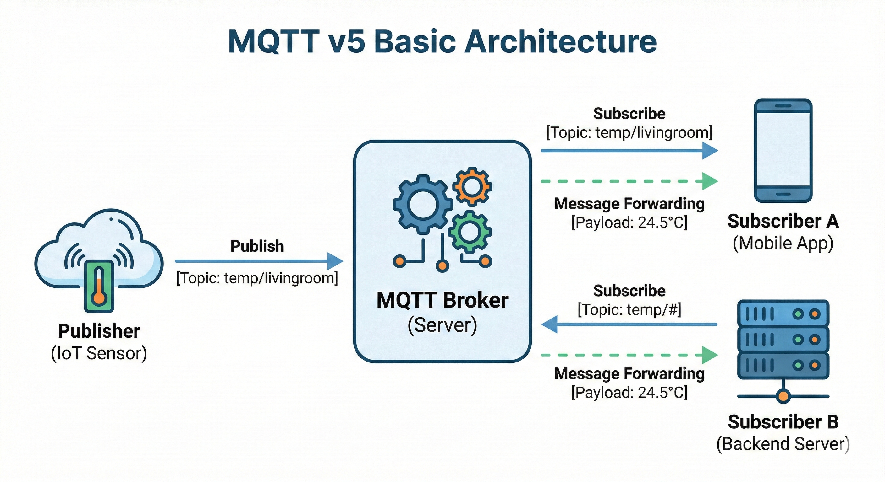
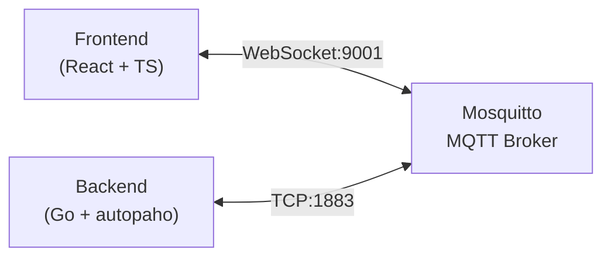
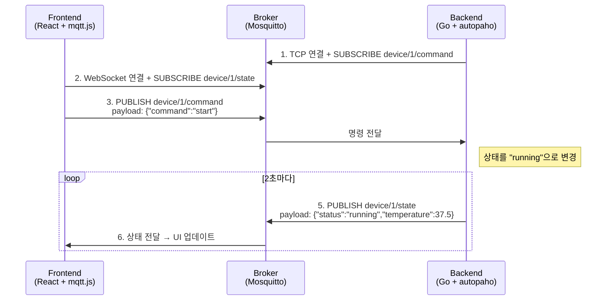

# 1. Go + Paho (v5) 사용법

 

이 장에서는 `Go` 언어로 `MQTT` v5 클라이언트를 구현하는 방법을 다룬다. Eclipse Paho 프로젝트에서 제공하는 `paho.golang` 패키지를 사용하며, 특히 자동 재연결을 지원하는 `autopaho` 패키지의 사용법을 중심으로 설명한다. 앞서 배운 개념들을 실제 코드로 구현하는 방법을 익히면 바로 프로덕션에 적용할 수 있다.

## 1.1 Paho v5 구조 이해

`Go`에서 `MQTT` v5를 사용하려면 `eclipse/paho.golang` 패키지를 사용한다. 이 패키지는 두 가지 레벨의 API를 제공한다. `paho` 패키지는 저수준 API로 세밀한 제어가 가능하고, `autopaho` 패키지는 자동 재연결 등 편의 기능이 포함된 고수준 API이다. 실무에서는 대부분 `autopaho`를 사용하는 것이 좋다.

### 1.1.1 주요 패키지

`paho`는 `MQTT` 프로토콜의 저수준 동작(연결, 발행, 구독)을 직접 제어할 수 있는 패키지이고, `autopaho`는 자동 재연결과 세션 복구를 내장한 래퍼 패키지이다. 프로덕션 환경에서는 네트워크 불안정에 대응하기 위해 `autopaho` 사용을 권장한다.

```go
import (
    "github.com/eclipse/paho.golang/paho"           // 기본 클라이언트
    "github.com/eclipse/paho.golang/autopaho"       // 자동 재연결
)
```

### 1.1.2 ClientConfig (autopaho)

`autopaho`의 핵심 설정 구조체이다. `Broker` 주소, Keep Alive 주기, 재연결 간격, 연결 성공/실패 콜백 등을 한 곳에서 정의한다. 이 설정을 기반으로 `ConnectionManager`가 생성되어 연결 생명주기를 자동으로 관리한다.

```go
config := autopaho.ClientConfig{
    // Broker 주소
    BrokerUrls: []*url.URL{brokerURL},

    // Keep Alive 간격
    KeepAlive: 30,

    // 재연결 간격
    ConnectRetryDelay: 10 * time.Second,

    // 연결 성공 시 콜백
    OnConnectionUp: func(cm *autopaho.ConnectionManager, connAck *paho.Connack) {
        // 구독 설정
    },

    // 연결 끊김 시 콜백
    OnConnectError: func(err error) {
        log.Error("Connection error", err)
    },
}
```

### 1.1.3 ConnectionManager

`ConnectionManager`는 `autopaho`의 핵심 객체로, `Broker`와의 연결 생명주기를 관리한다. 연결이 끊어지면 자동으로 재연결을 시도하며, `AwaitConnection`으로 연결 완료를 대기할 수 있다.

```go
// 연결 시작
cm, err := autopaho.NewConnection(ctx, config)

// 연결 대기
err = cm.AwaitConnection(ctx)

// 연결 종료
err = cm.Disconnect(ctx)
```

### 1.1.4 Handler 구조

수신된 메시지를 처리하는 콜백 함수를 `Router`에 등록하는 방식이다. `Topic` 패턴별로 핸들러를 분리할 수 있어, Wildcard 구독 시에도 메시지를 체계적으로 처리할 수 있다.

```go
// 메시지 수신 핸들러
func messageHandler(msg *paho.Publish) {
    fmt.Printf("Topic: %s, Payload: %s\n",
        msg.Topic, string(msg.Payload))
}

// Router 설정
router := paho.NewStandardRouter()
router.RegisterHandler("sensor/#", messageHandler)
```

## 1.2 기본 사용 흐름

`MQTT` 클라이언트의 기본 동작은 Connect → Subscribe → Publish 순서로 이루어진다. 각 단계별 `autopaho` 코드를 살펴본다.

### 1.2.1 Connect (연결)

`autopaho`로 `Broker`에 연결하는 기본 코드이다. `ClientConfig`에 Broker 주소, 인증 정보, Client ID를 설정하고 `NewConnection`으로 연결을 시작한다.

```go
package main

import (
    "context"
    "log"
    "net/url"

    "github.com/eclipse/paho.golang/autopaho"
    "github.com/eclipse/paho.golang/paho"
)

func main() {
    ctx := context.Background()

    brokerURL, _ := url.Parse("mqtt://localhost:1883")

    config := autopaho.ClientConfig{
        BrokerUrls: []*url.URL{brokerURL},
        KeepAlive:  30,

        ConnectUsername: "user",
        ConnectPassword: []byte("password"),

        ClientConfig: paho.ClientConfig{
            ClientID: "my-client",
            Router:   paho.NewStandardRouter(),
        },
    }

    cm, err := autopaho.NewConnection(ctx, config)
    if err != nil {
        log.Fatal(err)
    }

    err = cm.AwaitConnection(ctx)
    if err != nil {
        log.Fatal(err)
    }

    log.Println("Connected!")
}
```

### 1.2.2 Subscribe (구독)

Router에 `Topic` 패턴별 핸들러를 먼저 등록한 뒤, `Subscribe`로 `Broker`에 구독을 요청한다. Wildcard(`+`)를 사용하면 여러 센서의 메시지를 하나의 핸들러로 처리할 수 있다.

```go
func setupSubscription(cm *autopaho.ConnectionManager, router *paho.StandardRouter) {
    // 핸들러 등록
    router.RegisterHandler("sensor/+/temperature", func(msg *paho.Publish) {
        log.Printf("Temperature: %s", msg.Payload)
    })

    // 구독 요청
    cm.Subscribe(context.Background(), &paho.Subscribe{
        Subscriptions: []paho.SubscribeOptions{
            {Topic: "sensor/+/temperature", QoS: 1},
        },
    })
}
```

### 1.2.3 Publish (발행)

`Publish` 구조체에 `Topic`, `QoS`, `Payload`를 설정하여 메시지를 발행한다. v5의 `UserProperties`를 활용하면 `Payload` 외에 디바이스 ID 등 메타데이터도 함께 전달할 수 있다.

```go
func publishMessage(cm *autopaho.ConnectionManager) {
    msg := &paho.Publish{
        Topic:   "sensor/001/temperature",
        QoS:     1,
        Payload: []byte(`{"value": 25.5}`),
        Properties: &paho.PublishProperties{
            UserProperties: []paho.UserProperty{
                {Key: "device-id", Value: "sensor-001"},
            },
        },
    }

    _, err := cm.Publish(context.Background(), msg)
    if err != nil {
        log.Error("Publish failed", err)
    }
}
```

## 1.3 재연결 구현 방식

네트워크 불안정이나 `Broker` 재시작으로 연결이 끊어지는 상황은 프로덕션에서 빈번하게 발생한다. `autopaho`가 제공하는 자동 재연결 설정과 콜백을 활용하여 안정적인 연결 복구를 구현한다.

### 1.3.1 자동 재연결 설정

`autopaho`는 연결이 끊어지면 `ConnectRetryDelay` 간격으로 자동 재연결을 시도한다. 기본적으로 Exponential Backoff가 적용되어 `Broker`에 과도한 부하를 주지 않는다.

```go
config := autopaho.ClientConfig{
    // 재연결 간격
    ConnectRetryDelay: 10 * time.Second,

    // 최대 재연결 간격 (Backoff)
    // 기본적으로 Exponential Backoff 적용됨
}
```

### 1.3.2 OnConnectionUp

연결 성공 시 호출된다. 재구독에 사용한다.

```go
config.OnConnectionUp = func(cm *autopaho.ConnectionManager, connAck *paho.Connack) {
    log.Println("Connected!")

    // Session이 새로 시작되었는지 확인
    if !connAck.SessionPresent {
        log.Println("Session not present, resubscribing...")
        resubscribe(cm)
    }
}

func resubscribe(cm *autopaho.ConnectionManager) {
    topics := []paho.SubscribeOptions{
        {Topic: "sensor/+/temperature", QoS: 1},
        {Topic: "command/my-device/#", QoS: 1},
    }

    cm.Subscribe(context.Background(), &paho.Subscribe{
        Subscriptions: topics,
    })
}
```

### 1.3.3 OnServerDisconnect

`Broker`가 연결을 끊었을 때 호출된다. `ReasonCode`를 통해 인증 만료, 세션 인수 등 구체적인 원인을 파악할 수 있다.

```go
config.ClientConfig.OnServerDisconnect = func(d *paho.Disconnect) {
    if d.ReasonCode != 0 {
        log.Printf("Server disconnected: reason=%d", d.ReasonCode)
    }
}
```

### 1.3.4 OnClientError

네트워크 장애나 프로토콜 오류 등 클라이언트 측 에러 발생 시 호출된다. 로깅이나 알림 전송 등 에러 모니터링 로직을 여기에 추가한다.

```go
config.ClientConfig.OnClientError = func(err error) {
    log.Printf("Client error: %v", err)
}
```

## 1.4 안전한 Handler 설계

메시지 핸들러의 구현 방식에 따라 전체 시스템의 처리 성능이 크게 달라진다. 핸들러 블로킹을 방지하고 Worker Pool로 병렬 처리하는 패턴을 살펴본다.

### 1.4.1 Blocking 금지

`paho`의 메시지 핸들러는 단일 고루틴에서 순차적으로 실행된다. 핸들러가 블로킹되면 후속 메시지 수신이 지연되므로, 무거운 작업은 채널로 넘기고 핸들러는 즉시 리턴해야 한다.

```go
// 나쁜 예: 핸들러에서 직접 처리
func badHandler(msg *paho.Publish) {
    result := heavyProcessing(msg.Payload)  // 10초 걸림
    saveToDatabase(result)                   // 1초 걸림
    // 이 동안 다른 메시지 처리 못함!
}

// 좋은 예: 채널로 전달하고 바로 리턴
func goodHandler(msg *paho.Publish) {
    messageQueue <- msg  // 즉시 리턴
}

// 별도 고루틴에서 처리
go func() {
    for msg := range messageQueue {
        result := heavyProcessing(msg.Payload)
        saveToDatabase(result)
    }
}()
```

### 1.4.2 Worker Pool 패턴

채널로 넘긴 메시지를 여러 고루틴이 동시에 처리하는 패턴이다. Worker 수와 큐 크기를 조절하여 처리량과 메모리 사용량을 제어할 수 있다.

```go
type MessageProcessor struct {
    queue   chan *paho.Publish
    workers int
}

func NewMessageProcessor(workers, queueSize int) *MessageProcessor {
    mp := &MessageProcessor{
        queue:   make(chan *paho.Publish, queueSize),
        workers: workers,
    }

    // Worker 시작
    for i := 0; i < workers; i++ {
        go mp.worker(i)
    }

    return mp
}

func (mp *MessageProcessor) worker(id int) {
    for msg := range mp.queue {
        log.Printf("Worker %d processing: %s", id, msg.Topic)
        processMessage(msg)
    }
}

func (mp *MessageProcessor) Enqueue(msg *paho.Publish) {
    select {
    case mp.queue <- msg:
        // 큐에 추가됨
    default:
        log.Warn("Queue full, dropping message")
    }
}

// 핸들러에서 사용
func handler(msg *paho.Publish) {
    processor.Enqueue(msg)
}
```

---

# 2. 운영 관점 MQTT v5

`MQTT` 시스템을 프로덕션에서 안정적으로 운영하려면 적절한 모니터링과 장애 대응 전략이 필요한다. 이 장에서는 반드시 모니터링해야 할 핵심 지표와 흔히 발생하는 장애 시나리오별 대응 방법을 다룬다. 사전에 이러한 상황들을 준비해두면 장애 발생 시 빠르게 대응할 수 있다.

## 2.1 Mosquitto 모니터링 도구

`Mosquitto`를 사용하는 경우 다양한 방법으로 `Broker` 상태를 모니터링할 수 있다. 환경과 규모에 따라 적합한 도구를 선택한다.

### 2.1.1 $SYS Topic (내장 기능)

`Mosquitto`는 자체 상태 정보를 `$SYS/#` `Topic`으로 발행한다. 별도 설치 없이 바로 사용할 수 있어 빠른 상태 확인에 유용한다.

```bash
# 모든 시스템 메트릭 구독
mosquitto_sub -h localhost -t '$SYS/#' -v
```

**주요 메트릭:**

| Topic | 설명 |
|-------|------|
| `$SYS/broker/clients/connected` | 현재 연결된 클라이언트 수 |
| `$SYS/broker/clients/total` | 총 등록된 클라이언트 수 |
| `$SYS/broker/messages/received` | 수신한 총 메시지 수 |
| `$SYS/broker/messages/sent` | 발송한 총 메시지 수 |
| `$SYS/broker/load/messages/received/1min` | 1분간 수신 메시지 비율 |
| `$SYS/broker/load/publish/sent/1min` | 1분간 발송 메시지 비율 |
| `$SYS/broker/uptime` | Broker 가동 시간 (초) |
| `$SYS/broker/bytes/received` | 수신한 총 바이트 |
| `$SYS/broker/bytes/sent` | 발송한 총 바이트 |

**활성화 설정 (mosquitto.conf):**

```bash
# $SYS 메트릭 발행 간격 (초, 기본값 10)
sys_interval 10
```

### 2.1.2 MQTT Explorer (GUI 도구)

개발 및 테스트 환경에서 가장 쉽게 사용할 수 있는 데스크톱 앱이다.

- **다운로드**: https://mqtt-explorer.com
- **주요 기능**:
  - `Topic` 트리 시각화
  - 실시간 메시지 모니터링
  - 메시지 발행/구독 테스트
  - `Payload` 히스토리 및 차트
  - Retained Message 관리

```
# 연결 설정 예시
Host: localhost
Port: 1883
Username: (선택)
Password: (선택)
```

### 2.1.3 Prometheus + Grafana

프로덕션 환경에서 권장하는 방식이다. 메트릭 수집, 저장, 시각화, 알림까지 통합 관리할 수 있다.


**mosquitto-exporter 사용:**

```yaml
# docker-compose.yml
version: '3'
services:
  mosquitto:
    image: eclipse-mosquitto:2
    ports:
      - "1883:1883"
    volumes:
      - ./mosquitto.conf:/mosquitto/config/mosquitto.conf

  mosquitto-exporter:
    image: sapcc/mosquitto-exporter
    ports:
      - "9234:9234"
    environment:
      - BROKER_ENDPOINT=tcp://mosquitto:1883
    depends_on:
      - mosquitto

  prometheus:
    image: prom/prometheus
    ports:
      - "9090:9090"
    volumes:
      - ./prometheus.yml:/etc/prometheus/prometheus.yml

  grafana:
    image: grafana/grafana
    ports:
      - "3000:3000"
    environment:
      - GF_SECURITY_ADMIN_PASSWORD=admin
```

**prometheus.yml:**

```yaml
global:
  scrape_interval: 15s

scrape_configs:
  - job_name: 'mosquitto'
    static_configs:
      - targets: ['mosquitto-exporter:9234']
```

**Grafana 대시보드 설정:**
1. `Grafana` 접속 (http://localhost:3000)
2. Data Source에 `Prometheus` 추가
3. Dashboard Import에서 `Mosquitto` 템플릿 검색 또는 직접 생성

### 2.1.4 Cedalo Management Center

`Mosquitto`를 만든 Cedalo에서 제공하는 공식 상용 관리 도구이다.

- **사이트**: https://cedalo.com/mqtt-management-center
- **주요 기능**:
  - 웹 기반 대시보드
  - 실시간 클라이언트 관리
  - ACL 동적 관리 (GUI)
  - 클러스터 모니터링
  - 감사 로그

### 2.1.5 환경별 추천 도구

| 환경 | 추천 도구 | 이유 |
|------|----------|------|
| **개발/테스트** | `MQTT` Explorer | 설치 쉽고 직관적인 GUI |
| **소규모 프로덕션** | $SYS `Topic` + 스크립트 | 추가 인프라 불필요 |
| **중규모 프로덕션** | `Prometheus` + `Grafana` | 알림, 히스토리, 대시보드 |
| **대규모/엔터프라이즈** | Cedalo 또는 EMQX 전환 | 전문 지원, 클러스터링 |

**$SYS Topic 모니터링 스크립트 예시 (Go):**

```go
func monitorBroker(cm *autopaho.ConnectionManager) {
    topics := []string{
        "$SYS/broker/clients/connected",
        "$SYS/broker/messages/received",
        "$SYS/broker/load/messages/received/1min",
    }

    for _, topic := range topics {
        cm.Subscribe(context.Background(), &paho.Subscribe{
            Subscriptions: []paho.SubscribeOptions{
                {Topic: topic, QoS: 0},
            },
        })
    }
}

// 메시지 핸들러에서 메트릭 수집
func handleSysMessage(msg *paho.Publish) {
    switch msg.Topic {
    case "$SYS/broker/clients/connected":
        clientCount, _ := strconv.Atoi(string(msg.Payload))
        if clientCount > threshold {
            alertSlack("클라이언트 수 임계치 초과: " + string(msg.Payload))
        }
    }
}
```

---

# 3. 실전 프로젝트: 디바이스 대시보드

지금까지 배운 `MQTT` v5 개념을 종합 적용한 실전 프로젝트를 살펴본다. 이 프로젝트는 `Go` 백엔드와 `React` 프론트엔드로 구성된 실시간 디바이스 모니터링 대시보드이다. `Topic` 설계, `QoS` 선택, 자동 재연결 등 실무에서 필요한 패턴들이 모두 포함되어 있다.

## 3.1 프로젝트 개요

### 3.1.1 프로젝트 목적

이 프로젝트는 `MQTT` v5의 핵심 개념들을 실제 동작하는 코드로 확인하기 위해 만들어졌다. 단순히 "Hello World" 수준이 아니라, 실무에서 마주치는 패턴들을 최소한의 코드로 구현했다.

**학습 목표:**
- `Go`에서 autopaho를 사용한 `MQTT` 클라이언트 구현
- 브라우저에서 `WebSocket`을 통한 `MQTT` 연결 (`mqtt.js`)
- 양방향 통신 패턴 (상태 모니터링 + 명령 전송)
- `QoS` 선택 기준의 실제 적용
- 자동 재연결과 세션 관리

**왜 Go + React 조합인가:**
- **Go**: `IoT` 백엔드에서 많이 사용되며 autopaho가 자동 재연결을 잘 지원함
- **React**: 대시보드 UI 구현에 적합하며 `mqtt.js`가 브라우저 환경을 잘 지원함
- **Mosquitto**: 가볍고 설정이 간단한 오픈소스 `Broker`

### 3.1.2 아키텍처



**왜 두 가지 프로토콜을 사용하는가:**

- **Backend (TCP)**: 서버 환경에서는 `TCP`가 더 효율적이고 안정적이며 방화벽 이슈도 적다
- **Frontend (WebSocket)**: 브라우저는 `TCP` 소켓을 직접 열 수 없으므로 `WebSocket`이 유일한 선택지이다
- `Mosquitto`는 두 프로토콜을 동시에 지원하므로 하나의 `Broker`로 양쪽 클라이언트를 모두 처리할 수 있다

### 3.1.3 주요 기능

- 실시간 디바이스 상태 모니터링 (온도, 상태)
- Start/Stop 명령 전송
- 연결 상태 표시
- 메시지 로그 히스토리
- 자동 재연결

### 3.1.4 데이터 흐름



이 흐름에서 Frontend와 Backend는 서로의 존재를 모른다. 오직 `Topic`을 통해서만 통신한다. 이것이 `Pub/Sub` 패턴의 핵심이다.

## 3.2 토픽 설계

이 프로젝트에서는 단순하지만 실무 패턴을 따르는 토픽 구조를 사용한다. 2편에서 배운 토픽 설계 원칙을 적용했다.

### 3.2.1 토픽 구조

| 토픽 | Publisher | Subscriber | `QoS` | 용도 |
|------|-----------|------------|-----|------|
| `device/1/state` | Backend | Frontend | 0 | 상태 발행 (2초 주기) |
| `device/1/command` | Frontend | Backend | 1 | 명령 전송 (start/stop) |

**토픽 네이밍 분석:**
- `device`: 최상위 카테고리 (디바이스 관련)
- `1`: 디바이스 ID (확장 시 `device/2`, `device/3` 등 추가 가능)
- `state` / `command`: 메시지 유형 (상태 vs 명령)

이 구조는 확장에 유리하다. 디바이스가 100개로 늘어나도 `device/+/state`로 모든 상태를 구독할 수 있다.

### 3.2.2 QoS 선택 이유

**상태 (QoS 0)를 선택한 이유:**
- 2초마다 새 데이터가 발행되므로 한 번 유실되어도 금방 복구됨
- 네트워크 오버헤드 최소화 (`ACK` 없음)
- 실시간성이 중요한 센서 데이터에 적합
- 3편에서 배운 "주기적 데이터는 `QoS` 0" 원칙 적용

**명령 (QoS 1)을 선택한 이유:**
- 사용자가 버튼을 클릭한 액션이므로 반드시 전달되어야 함
- 명령 유실 시 사용자가 다시 클릭해야 하는 불편함 발생
- `QoS` 2까지는 필요 없음 (중복 명령이 와도 결과는 동일 - idempotent)

### 3.2.3 메시지 형식

`JSON`을 사용한다. 바이너리 대비 오버헤드가 있지만, 디버깅이 쉽고 스키마 변경에 유연하다.

```json
// State (Backend → Frontend)
{
  "deviceId": "1",
  "status": "running",
  "temperature": 37.5,
  "timestamp": 1705580400
}
```

- `deviceId`: 어떤 디바이스의 상태인지 식별
- `status`: 현재 상태 ("idle" 또는 "running")
- `temperature`: 센서 값 (35~40도 사이 랜덤)
- `timestamp`: Unix timestamp (클라이언트에서 지연 시간 계산 가능)

```json
// Command (Frontend → Backend)
{
  "action": "start"  // or "stop"
}
```

- `action`: 수행할 명령 ("start" 또는 "stop")
- 단순한 구조지만, 필요 시 `{ "action": "setTemperature", "value": 25 }` 형태로 확장 가능

## 3.3 Backend 구현 (Go + autopaho)

Backend는 두 가지 역할을 한다: (1) 디바이스 상태를 주기적으로 발행, (2) 명령을 수신하여 처리. 1장에서 배운 autopaho 패턴을 실제로 적용한다.

### 3.3.1 MQTT 클라이언트 래퍼

autopaho를 감싸는 클라이언트 구조체이다. 직접 autopaho를 사용해도 되지만, 래퍼를 만들면 테스트와 유지보수가 쉬워진다.

```go
// internal/mqtt/client.go
package mqtt

type Client struct {
    conn *autopaho.ConnectionManager
}

func NewClient(ctx context.Context, brokerURL string, clientID string,
    onMessage func(topic string, payload []byte)) (*Client, error) {

    u, _ := url.Parse(brokerURL)

    cfg := autopaho.ClientConfig{
        ServerUrls:                    []*url.URL{u},
        KeepAlive:                     30,
        CleanStartOnInitialConnection: false,
        SessionExpiryInterval:         60,

        // 연결 성공 시 구독 설정 (재연결 시에도 호출됨)
        OnConnectionUp: func(cm *autopaho.ConnectionManager, connAck *paho.Connack) {
            cm.Subscribe(ctx, &paho.Subscribe{
                Subscriptions: []paho.SubscribeOptions{
                    {Topic: "device/1/command", QoS: 1},
                },
            })
        },

        ClientConfig: paho.ClientConfig{
            ClientID: clientID,
            OnPublishReceived: []func(paho.PublishReceived) (bool, error){
                func(pr paho.PublishReceived) (bool, error) {
                    onMessage(pr.Packet.Topic, pr.Packet.Payload)
                    return true, nil
                },
            },
        },
    }

    conn, _ := autopaho.NewConnection(ctx, cfg)
    conn.AwaitConnection(ctx)

    return &Client{conn: conn}, nil
}

func (c *Client) Publish(ctx context.Context, topic string, payload []byte,
    qos byte, retain bool) error {
    _, err := c.conn.Publish(ctx, &paho.Publish{
        Topic:   topic,
        QoS:     qos,
        Retain:  retain,
        Payload: payload,
    })
    return err
}
```

**핵심 설정 상세 설명:**

| 설정 | 값 | 의미 |
|------|-----|------|
| `ServerUrls` | `mqtt://localhost:1883` | `Broker` 주소. `mqtt://`는 `TCP`, `ws://`는 `WebSocket` |
| `KeepAlive` | 30 | 30초마다 PING 전송. `Broker`가 클라이언트 생존 확인 |
| `CleanStartOnInitialConnection` | false | 기존 세션 유지. true면 매번 새 세션 시작 |
| `SessionExpiryInterval` | 60 | 연결 끊겨도 60초간 세션 보존. 재연결 시 미수신 메시지 받을 수 있음 |

**OnConnectionUp의 중요성:**

```go
OnConnectionUp: func(cm *autopaho.ConnectionManager, connAck *paho.Connack) {
    cm.Subscribe(ctx, &paho.Subscribe{...})
}
```

이 콜백은 **최초 연결뿐 아니라 재연결 시에도 호출**된다. 따라서 여기서 구독을 설정하면 네트워크가 끊겼다가 복구되어도 자동으로 구독이 복원된다. 3편에서 배운 "재연결 시 재구독" 패턴의 실제 구현이다.

**OnPublishReceived 패턴:**

```go
OnPublishReceived: []func(paho.PublishReceived) (bool, error){
    func(pr paho.PublishReceived) (bool, error) {
        onMessage(pr.Packet.Topic, pr.Packet.Payload)
        return true, nil  // true = 메시지 처리 완료
    },
},
```

메시지 핸들러를 슬라이스로 받는 이유는 여러 핸들러를 체인으로 연결할 수 있기 때문이다. 첫 번째 핸들러가 `false`를 반환하면 다음 핸들러로 넘어간다.

### 3.3.2 디바이스 시뮬레이터

실제 하드웨어 대신 가상 디바이스 상태를 관리하는 시뮬레이터이다. 실제 프로젝트에서는 이 부분이 센서 읽기, 액추에이터 제어 등으로 대체된다.

```go
// internal/device/simulator.go
package device

type State struct {
    DeviceID    string  `json:"deviceId"`
    Status      string  `json:"status"`
    Temperature float64 `json:"temperature"`
    Timestamp   int64   `json:"timestamp"`
}

type Simulator struct {
    mu     sync.RWMutex
    status string
}

func NewSimulator() *Simulator {
    return &Simulator{status: "idle"}
}

func (s *Simulator) GetState() State {
    s.mu.RLock()
    defer s.mu.RUnlock()

    return State{
        DeviceID:    "1",
        Status:      s.status,
        Temperature: 35.0 + rand.Float64()*5.0,
        Timestamp:   time.Now().Unix(),
    }
}

func (s *Simulator) HandleCommand(action string) {
    s.mu.Lock()
    defer s.mu.Unlock()

    switch action {
    case "start":
        s.status = "running"
    case "stop":
        s.status = "idle"
    }
}
```

**동시성 처리 (sync.RWMutex):**

시뮬레이터는 두 고루틴에서 동시에 접근된다:
1. 메인 루프: `GetState()` 호출하여 상태 읽기
2. 메시지 핸들러: `HandleCommand()` 호출하여 상태 변경

`sync.RWMutex`를 사용하여 읽기는 동시에 허용하고(`RLock`), 쓰기는 배타적으로 처리한다(`Lock`). 이는 `Go`에서 공유 상태를 다룰 때의 표준 패턴이다.

### 3.3.3 메인 로직

메인 함수는 전체 흐름을 조율한다. 2초마다 상태를 발행하고, 명령을 수신하여 처리한다.

```go
// cmd/main.go
func main() {
    ctx, stop := signal.NotifyContext(context.Background(),
        os.Interrupt, syscall.SIGTERM)
    defer stop()

    sim := device.NewSimulator()

    // 명령 수신 핸들러
    onMessage := func(topic string, payload []byte) {
        var cmd struct { Action string `json:"action"` }
        json.Unmarshal(payload, &cmd)
        sim.HandleCommand(cmd.Action)
    }

    client, _ := mqtt.NewClient(ctx, "mqtt://localhost:1883",
        "go-backend-device-1", onMessage)

    // 2초마다 상태 발행
    ticker := time.NewTicker(2 * time.Second)
    for {
        select {
        case <-ctx.Done():
            client.Disconnect(context.Background())
            return
        case <-ticker.C:
            if sim.IsRunning() {
                state := sim.GetState()
                payload, _ := json.Marshal(state)
                client.Publish(ctx, "device/1/state", payload, 0, true)
            }
        }
    }
}
```

**코드 흐름 분석:**

1. **시그널 처리**: `signal.NotifyContext`로 Ctrl+C (SIGINT) 또는 SIGTERM 수신 시 graceful shutdown
2. **의존성 주입**: `onMessage` 함수를 클라이언트에 전달하여 메시지 처리 로직 분리
3. **Ticker 패턴**: `time.NewTicker`로 정확한 2초 간격 보장 (sleep과 달리 drift 없음)
4. **조건부 발행**: `sim.IsRunning()` 체크로 idle 상태에서는 불필요한 메시지 발행 방지

**Retain 플래그 (true):**

```go
client.Publish(ctx, "device/1/state", payload, 0, true)  // retain=true
```

마지막 상태를 `Broker`에 저장한다. 새로운 Subscriber가 연결되면 즉시 최신 상태를 받을 수 있다. Dashboard를 새로고침해도 바로 현재 상태가 표시되는 이유다.

## 3.4 Frontend 구현 (React + mqtt.js)

Frontend는 브라우저에서 실행되므로 `WebSocket`을 통해 `MQTT`에 연결한다. `React`의 훅 패턴을 사용하여 `MQTT` 연결 상태와 메시지를 관리한다.

### 3.4.1 MQTT 커스텀 훅

`MQTT` 연결 로직을 재사용 가능한 커스텀 훅으로 분리했다. 이 패턴은 여러 컴포넌트에서 `MQTT`를 사용할 때 유용하다.

```typescript
// hooks/useMqtt.ts
import mqtt from 'mqtt';

interface DeviceState {
  deviceId: string;
  status: 'idle' | 'running';
  temperature: number;
  timestamp: number;
}

export function useMqtt(brokerUrl: string) {
  const [client, setClient] = useState<MqttClient | null>(null);
  const [connected, setConnected] = useState(false);
  const [deviceState, setDeviceState] = useState<DeviceState | null>(null);

  useEffect(() => {
    // MQTT v5 + WebSocket + 자동 재연결
    const mqttClient = mqtt.connect(brokerUrl, {
      protocolVersion: 5,
      reconnectPeriod: 1000,
    });

    mqttClient.on('connect', () => {
      setConnected(true);
      mqttClient.subscribe('device/1/state');
    });

    mqttClient.on('close', () => setConnected(false));

    mqttClient.on('message', (topic, payload) => {
      if (topic === 'device/1/state') {
        const state = JSON.parse(payload.toString());
        setDeviceState(state);
      }
    });

    setClient(mqttClient);
    return () => { mqttClient.end(); };
  }, [brokerUrl]);

  const sendCommand = useCallback((action: 'start' | 'stop') => {
    if (client && connected) {
      client.publish('device/1/command',
        JSON.stringify({ action }), { qos: 1 });
    }
  }, [client, connected]);

  return { connected, deviceState, sendCommand };
}
```

**핵심 설정 상세 설명:**

| 설정 | 값 | 의미 |
|------|-----|------|
| `protocolVersion` | 5 | `MQTT` v5 사용. 생략하면 v3.1.1 |
| `reconnectPeriod` | 1000 | 연결 끊기면 1초 후 재연결 시도 |

**mqtt.js의 자동 재연결:**

`mqtt.js`는 autopaho처럼 자동 재연결을 내장하고 있다. `reconnectPeriod`를 설정하면 네트워크가 끊겨도 자동으로 복구를 시도한다. 단, 재연결 후 구독은 자동으로 복원되지 않으므로 `connect` 이벤트에서 다시 구독해야 한다.

```typescript
mqttClient.on('connect', () => {
  setConnected(true);
  mqttClient.subscribe('device/1/state');  // 재연결 시에도 호출됨
});
```

**useEffect와 cleanup:**

```typescript
useEffect(() => {
  const mqttClient = mqtt.connect(brokerUrl, {...});
  // ... 이벤트 핸들러 등록
  setClient(mqttClient);

  return () => { mqttClient.end(); };  // cleanup
}, [brokerUrl]);
```

컴포넌트가 언마운트되거나 `brokerUrl`이 변경되면 cleanup 함수가 호출되어 기존 연결을 정리한다. 이렇게 하지 않으면 연결이 누적되어 메모리 누수가 발생한다.

**useCallback으로 sendCommand 최적화:**

```typescript
const sendCommand = useCallback((action: 'start' | 'stop') => {
  if (client && connected) {
    client.publish('device/1/command', JSON.stringify({ action }), { qos: 1 });
  }
}, [client, connected]);
```

`useCallback`을 사용하여 `client`나 `connected`가 변경될 때만 함수를 재생성한다. 이 함수를 props로 전달할 때 불필요한 리렌더링을 방지한다.

### 3.4.2 대시보드 컴포넌트

```tsx
// components/DeviceStatus.tsx
export function DeviceStatus() {
  const { connected, deviceState, sendCommand } = useMqtt('ws://localhost:9001');

  return (
    <div>
      <h1>Device Dashboard</h1>

      <div>
        Connection: {connected ? '🟢 Connected' : '🔴 Disconnected'}
      </div>

      {deviceState && (
        <table>
          <tr>
            <td>Status</td>
            <td>{deviceState.status}</td>
          </tr>
          <tr>
            <td>Temperature</td>
            <td>{deviceState.temperature.toFixed(1)}°C</td>
          </tr>
        </table>
      )}

      <button onClick={() => sendCommand('start')} disabled={!connected}>
        Start
      </button>
      <button onClick={() => sendCommand('stop')} disabled={!connected}>
        Stop
      </button>
    </div>
  );
}
```

**UI/UX 고려사항:**

- **연결 상태 표시**: 사용자가 현재 상태를 즉시 파악할 수 있도록 이모지 사용
- **버튼 비활성화**: 연결이 끊긴 상태에서 버튼 클릭 방지 (`disabled={!connected}`)
- **조건부 렌더링**: `deviceState`가 없으면 테이블을 표시하지 않음

## 3.5 Broker 설정 (Mosquitto)

`Mosquitto`는 `TCP`와 `WebSocket` 두 가지 프로토콜을 동시에 지원한다. 각각 다른 포트에서 리스닝하도록 설정한다.

```ini
# mosquitto/config/mosquitto.conf
listener 1883
listener 9001
protocol websockets

allow_anonymous true
```

**설정 상세 설명:**

| 설정 | 의미 |
|------|------|
| `listener 1883` | `TCP` 리스너. Backend가 연결 |
| `listener 9001` | 두 번째 리스너 (기본값은 `TCP`) |
| `protocol websockets` | 바로 위 리스너를 `WebSocket`으로 변경 |
| `allow_anonymous true` | 인증 없이 연결 허용 (개발용) |

**주의:** `protocol websockets`는 바로 위의 `listener`에만 적용된다. 순서가 중요하다.

**프로덕션 환경에서는:**

```ini
listener 1883
listener 9001
protocol websockets

# 인증 활성화
allow_anonymous false
password_file /mosquitto/config/passwd

# TLS 설정
listener 8883
certfile /mosquitto/certs/server.crt
keyfile /mosquitto/certs/server.key
```

**Docker Compose:**

```yaml
# docker-compose.yml
version: '3'
services:
  mosquitto:
    image: eclipse-mosquitto:2
    ports:
      - "1883:1883"
      - "9001:9001"
    volumes:
      - ./mosquitto/config:/mosquitto/config
```

## 3.6 실행 및 테스트

### 3.6.1 실행 순서

```bash
# 1. Broker 실행
docker-compose up -d

# 2. Backend 실행
cd backend && go run cmd/main.go

# 3. Frontend 실행
cd frontend && npm run dev
```

### 3.6.2 동작 확인

1. http://localhost:3000 접속
2. "Connected" 상태 확인
3. "Start" 버튼 클릭 → 상태가 "running"으로 변경, 온도 데이터 수신 시작
4. "Stop" 버튼 클릭 → 상태가 "idle"로 변경

**재연결 테스트:**

1. Backend 실행 중 Ctrl+C로 종료
2. Frontend에서 상태 업데이트 중단 확인
3. Backend 다시 실행
4. 자동으로 상태 업데이트 재개 확인

### 3.6.3 수동 테스트

mosquitto 클라이언트를 사용하여 각 컴포넌트를 독립적으로 테스트할 수 있다.

```bash
# 상태 구독 (Backend가 발행하는 메시지 확인)
mosquitto_sub -h localhost -p 1883 -t "device/1/state" -v

# 명령 발행 (Frontend 대신 직접 명령 전송)
mosquitto_pub -h localhost -p 1883 -t "device/1/command" -m '{"action":"start"}'
```

**디버깅 팁:**
- `mosquitto_sub -t '#' -v`: 모든 토픽의 메시지 확인
- `mosquitto_sub -t '$SYS/#' -v`: `Broker` 상태 메트릭 확인

### 3.6.4 트러블슈팅

**증상: Frontend가 연결되지 않음**
```
WebSocket connection to 'ws://localhost:9001/' failed
```
- 원인: `Mosquitto` `WebSocket` 리스너가 실행되지 않음
- 해결: `mosquitto.conf`에 `listener 9001`과 `protocol websockets` 확인

**증상: Backend가 연결되지 않음**
```
[MQTT] Connection error: dial tcp 127.0.0.1:1883: connect: connection refused
```
- 원인: `Mosquitto`가 실행되지 않음
- 해결: `docker-compose up -d` 실행

**증상: 메시지가 전달되지 않음**
- 원인 1: 토픽 이름 오타 (`device/1/state` vs `device/1/status`)
- 원인 2: `QoS` 설정 문제
- 해결: `mosquitto_sub -t '#' -v`로 실제 발행되는 메시지 확인

## 3.7 프로젝트 소스

전체 소스 코드는 GitHub에서 확인할 수 있다:
- https://github.com/kenshin579/tutorials-go/tree/main/message-queue/go-mqtt-dashboard

**프로젝트 실행에 필요한 것:**
- `Docker` & `Docker` Compose
- `Go` 1.21+
- Node.js 18+

# 4. 마무리

이번 편에서는 `Go` 언어로 `MQTT` v5 클라이언트를 실전 구현하는 방법을 다뤘다.

- `autopaho`의 `ClientConfig`, `ConnectionManager`, `Router`를 활용하여 Connect → Subscribe → Publish 흐름을 구현할 수 있다
- 자동 재연결은 `ConnectRetryDelay`와 `OnConnectionUp` 콜백으로 처리하며, 세션 복구 여부에 따라 재구독을 판단한다
- 메시지 핸들러는 블로킹하지 않고 채널과 Worker Pool 패턴으로 병렬 처리한다
- `Mosquitto`의 `$SYS` `Topic`, `Prometheus` + `Grafana` 등으로 `Broker` 상태를 모니터링할 수 있다
- 실전 프로젝트에서는 `Go` Backend(`TCP`)와 `React` Frontend(`WebSocket`)가 `Mosquitto` `Broker`를 통해 양방향 통신하는 구조를 구현했다

이 시리즈를 통해 `MQTT` v5의 개념부터 실전 구현까지 전체적인 흐름을 살펴보았다. 실무에 적용할 때 참고가 되길 바란다.

# 5. 참고

- [MQTT v5 스펙](https://docs.oasis-open.org/mqtt/mqtt/v5.0/mqtt-v5.0.html)
- [Eclipse Paho Go Client](https://github.com/eclipse/paho.golang)
- [EMQX 문서](https://www.emqx.io/docs)
- [Mosquitto 문서](https://mosquitto.org/documentation/)

