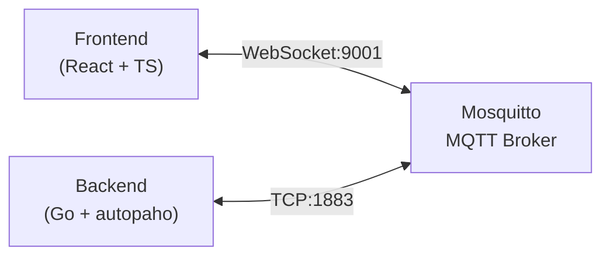
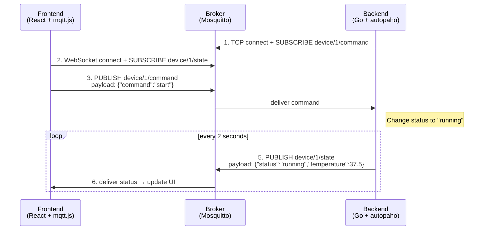

# 1. Using Go + Paho (v5)

 

This chapter covers how to implement an `MQTT` v5 client in the `Go` language. We use the `paho.golang` package provided by the Eclipse Paho project, focusing in particular on the `autopaho` package, which supports automatic reconnection. Once you learn how to implement the concepts covered earlier in actual code, you can apply them directly to production.

## 1.1 Understanding the Paho v5 Structure

To use `MQTT` v5 in `Go`, you use the `eclipse/paho.golang` package. This package provides two levels of API. The `paho` package is a low-level API that allows fine-grained control, while the `autopaho` package is a high-level API that includes convenience features such as automatic reconnection. In practice, it is generally best to use `autopaho`.

### 1.1.1 Main Packages

`paho` is a package that lets you directly control the low-level behavior of the `MQTT` protocol (connecting, publishing, subscribing), while `autopaho` is a wrapper package with built-in automatic reconnection and session recovery. In production environments, using `autopaho` is recommended to cope with network instability.

```go
import (
    "github.com/eclipse/paho.golang/paho"           // basic client
    "github.com/eclipse/paho.golang/autopaho"       // automatic reconnection
)
```

### 1.1.2 ClientConfig (autopaho)

This is the core configuration struct of `autopaho`. The `Broker` address, Keep Alive interval, reconnection interval, connection success/failure callbacks, and more are defined in one place. Based on this configuration, a `ConnectionManager` is created that automatically manages the connection lifecycle.

```go
config := autopaho.ClientConfig{
    // Broker address
    BrokerUrls: []*url.URL{brokerURL},

    // Keep Alive interval
    KeepAlive: 30,

    // reconnection interval
    ConnectRetryDelay: 10 * time.Second,

    // callback on successful connection
    OnConnectionUp: func(cm *autopaho.ConnectionManager, connAck *paho.Connack) {
        // set up subscriptions
    },

    // callback on connection loss
    OnConnectError: func(err error) {
        log.Error("Connection error", err)
    },
}
```

### 1.1.3 ConnectionManager

`ConnectionManager` is the core object of `autopaho` and manages the connection lifecycle with the `Broker`. When the connection drops, it automatically attempts to reconnect, and you can wait for the connection to complete with `AwaitConnection`.

```go
// start the connection
cm, err := autopaho.NewConnection(ctx, config)

// wait for the connection
err = cm.AwaitConnection(ctx)

// close the connection
err = cm.Disconnect(ctx)
```

### 1.1.4 Handler Structure

This is the approach of registering callback functions that process received messages in a `Router`. You can separate handlers per `Topic` pattern, so even with Wildcard subscriptions you can process messages in an organized way.

```go
// message reception handler
func messageHandler(msg *paho.Publish) {
    fmt.Printf("Topic: %s, Payload: %s\n",
        msg.Topic, string(msg.Payload))
}

// Router setup
router := paho.NewStandardRouter()
router.RegisterHandler("sensor/#", messageHandler)
```

## 1.2 Basic Usage Flow

The basic operation of an `MQTT` client follows the order Connect → Subscribe → Publish. Let's look at the `autopaho` code for each step.

### 1.2.1 Connect

This is the basic code for connecting to the `Broker` with `autopaho`. You set the Broker address, authentication credentials, and Client ID in `ClientConfig`, then start the connection with `NewConnection`.

```go
package main

import (
    "context"
    "log"
    "net/url"

    "github.com/eclipse/paho.golang/autopaho"
    "github.com/eclipse/paho.golang/paho"
)

func main() {
    ctx := context.Background()

    brokerURL, _ := url.Parse("mqtt://localhost:1883")

    config := autopaho.ClientConfig{
        BrokerUrls: []*url.URL{brokerURL},
        KeepAlive:  30,

        ConnectUsername: "user",
        ConnectPassword: []byte("password"),

        ClientConfig: paho.ClientConfig{
            ClientID: "my-client",
            Router:   paho.NewStandardRouter(),
        },
    }

    cm, err := autopaho.NewConnection(ctx, config)
    if err != nil {
        log.Fatal(err)
    }

    err = cm.AwaitConnection(ctx)
    if err != nil {
        log.Fatal(err)
    }

    log.Println("Connected!")
}
```

### 1.2.2 Subscribe

After first registering handlers per `Topic` pattern in the Router, you request a subscription from the `Broker` with `Subscribe`. Using a Wildcard (`+`), you can process messages from multiple sensors with a single handler.

```go
func setupSubscription(cm *autopaho.ConnectionManager, router *paho.StandardRouter) {
    // register handler
    router.RegisterHandler("sensor/+/temperature", func(msg *paho.Publish) {
        log.Printf("Temperature: %s", msg.Payload)
    })

    // request subscription
    cm.Subscribe(context.Background(), &paho.Subscribe{
        Subscriptions: []paho.SubscribeOptions{
            {Topic: "sensor/+/temperature", QoS: 1},
        },
    })
}
```

### 1.2.3 Publish

You publish a message by setting the `Topic`, `QoS`, and `Payload` in the `Publish` struct. By leveraging v5's `UserProperties`, you can also transmit metadata such as a device ID alongside the `Payload`.

```go
func publishMessage(cm *autopaho.ConnectionManager) {
    msg := &paho.Publish{
        Topic:   "sensor/001/temperature",
        QoS:     1,
        Payload: []byte(`{"value": 25.5}`),
        Properties: &paho.PublishProperties{
            UserProperties: []paho.UserProperty{
                {Key: "device-id", Value: "sensor-001"},
            },
        },
    }

    _, err := cm.Publish(context.Background(), msg)
    if err != nil {
        log.Error("Publish failed", err)
    }
}
```

## 1.3 Reconnection Implementation Approach

Situations where the connection drops due to network instability or a `Broker` restart occur frequently in production. We implement stable connection recovery by leveraging the automatic reconnection settings and callbacks that `autopaho` provides.

### 1.3.1 Automatic Reconnection Settings

When the connection drops, `autopaho` automatically attempts to reconnect at the `ConnectRetryDelay` interval. By default, Exponential Backoff is applied so as not to put excessive load on the `Broker`.

```go
config := autopaho.ClientConfig{
    // reconnection interval
    ConnectRetryDelay: 10 * time.Second,

    // maximum reconnection interval (Backoff)
    // Exponential Backoff is applied by default
}
```

### 1.3.2 OnConnectionUp

This is called on successful connection. It is used for resubscription.

```go
config.OnConnectionUp = func(cm *autopaho.ConnectionManager, connAck *paho.Connack) {
    log.Println("Connected!")

    // check whether the Session was newly started
    if !connAck.SessionPresent {
        log.Println("Session not present, resubscribing...")
        resubscribe(cm)
    }
}

func resubscribe(cm *autopaho.ConnectionManager) {
    topics := []paho.SubscribeOptions{
        {Topic: "sensor/+/temperature", QoS: 1},
        {Topic: "command/my-device/#", QoS: 1},
    }

    cm.Subscribe(context.Background(), &paho.Subscribe{
        Subscriptions: topics,
    })
}
```

### 1.3.3 OnServerDisconnect

This is called when the `Broker` closes the connection. Through the `ReasonCode`, you can identify the specific cause, such as authentication expiry or session takeover.

```go
config.ClientConfig.OnServerDisconnect = func(d *paho.Disconnect) {
    if d.ReasonCode != 0 {
        log.Printf("Server disconnected: reason=%d", d.ReasonCode)
    }
}
```

### 1.3.4 OnClientError

This is called when a client-side error occurs, such as a network failure or protocol error. Add error-monitoring logic here, such as logging or sending notifications.

```go
config.ClientConfig.OnClientError = func(err error) {
    log.Printf("Client error: %v", err)
}
```

## 1.4 Designing Safe Handlers

The processing performance of the entire system varies greatly depending on how the message handler is implemented. Let's look at patterns that prevent handler blocking and process in parallel with a Worker Pool.

### 1.4.1 No Blocking

`paho`'s message handler runs sequentially in a single goroutine. If the handler blocks, the reception of subsequent messages is delayed, so heavy work should be handed off to a channel and the handler should return immediately.

```go
// Bad example: processing directly in the handler
func badHandler(msg *paho.Publish) {
    result := heavyProcessing(msg.Payload)  // takes 10 seconds
    saveToDatabase(result)                   // takes 1 second
    // can't process other messages during this time!
}

// Good example: hand off to a channel and return immediately
func goodHandler(msg *paho.Publish) {
    messageQueue <- msg  // returns immediately
}

// process in a separate goroutine
go func() {
    for msg := range messageQueue {
        result := heavyProcessing(msg.Payload)
        saveToDatabase(result)
    }
}()
```

### 1.4.2 Worker Pool Pattern

This is a pattern where multiple goroutines concurrently process messages handed off to a channel. By tuning the number of Workers and the queue size, you can control throughput and memory usage.

```go
type MessageProcessor struct {
    queue   chan *paho.Publish
    workers int
}

func NewMessageProcessor(workers, queueSize int) *MessageProcessor {
    mp := &MessageProcessor{
        queue:   make(chan *paho.Publish, queueSize),
        workers: workers,
    }

    // start Workers
    for i := 0; i < workers; i++ {
        go mp.worker(i)
    }

    return mp
}

func (mp *MessageProcessor) worker(id int) {
    for msg := range mp.queue {
        log.Printf("Worker %d processing: %s", id, msg.Topic)
        processMessage(msg)
    }
}

func (mp *MessageProcessor) Enqueue(msg *paho.Publish) {
    select {
    case mp.queue <- msg:
        // added to the queue
    default:
        log.Warn("Queue full, dropping message")
    }
}

// use in a handler
func handler(msg *paho.Publish) {
    processor.Enqueue(msg)
}
```

---

# 2. MQTT v5 from an Operations Perspective

To operate an `MQTT` system stably in production, you need appropriate monitoring and a failure-response strategy. This chapter covers the key metrics you must monitor and how to respond to commonly occurring failure scenarios. Preparing for these situations in advance lets you respond quickly when failures occur.

## 2.1 Mosquitto Monitoring Tools

When using `Mosquitto`, you can monitor the `Broker` state in various ways. Choose the tool that fits your environment and scale.

### 2.1.1 $SYS Topic (Built-in Feature)

`Mosquitto` publishes its own status information to the `$SYS/#` `Topic`. It can be used right away without any additional installation, making it useful for quick status checks.

```bash
# subscribe to all system metrics
mosquitto_sub -h localhost -t '$SYS/#' -v
```

**Key metrics:**

| Topic | Description |
|-------|------|
| `$SYS/broker/clients/connected` | Number of currently connected clients |
| `$SYS/broker/clients/total` | Total number of registered clients |
| `$SYS/broker/messages/received` | Total number of messages received |
| `$SYS/broker/messages/sent` | Total number of messages sent |
| `$SYS/broker/load/messages/received/1min` | Message receive rate over 1 minute |
| `$SYS/broker/load/publish/sent/1min` | Message send rate over 1 minute |
| `$SYS/broker/uptime` | Broker uptime (seconds) |
| `$SYS/broker/bytes/received` | Total bytes received |
| `$SYS/broker/bytes/sent` | Total bytes sent |

**Enabling configuration (mosquitto.conf):**

```bash
# $SYS metric publish interval (seconds, default 10)
sys_interval 10
```

### 2.1.2 MQTT Explorer (GUI Tool)

This is the desktop app that is easiest to use in development and test environments.

- **Download**: https://mqtt-explorer.com
- **Key features**:
  - `Topic` tree visualization
  - Real-time message monitoring
  - Message publish/subscribe testing
  - `Payload` history and charts
  - Retained Message management

```
# connection settings example
Host: localhost
Port: 1883
Username: (optional)
Password: (optional)
```

### 2.1.3 Prometheus + Grafana

This is the recommended approach for production environments. You can integrate metric collection, storage, visualization, and alerting into a single managed solution.


**Using mosquitto-exporter:**

```yaml
# docker-compose.yml
version: '3'
services:
  mosquitto:
    image: eclipse-mosquitto:2
    ports:
      - "1883:1883"
    volumes:
      - ./mosquitto.conf:/mosquitto/config/mosquitto.conf

  mosquitto-exporter:
    image: sapcc/mosquitto-exporter
    ports:
      - "9234:9234"
    environment:
      - BROKER_ENDPOINT=tcp://mosquitto:1883
    depends_on:
      - mosquitto

  prometheus:
    image: prom/prometheus
    ports:
      - "9090:9090"
    volumes:
      - ./prometheus.yml:/etc/prometheus/prometheus.yml

  grafana:
    image: grafana/grafana
    ports:
      - "3000:3000"
    environment:
      - GF_SECURITY_ADMIN_PASSWORD=admin
```

**prometheus.yml:**

```yaml
global:
  scrape_interval: 15s

scrape_configs:
  - job_name: 'mosquitto'
    static_configs:
      - targets: ['mosquitto-exporter:9234']
```

**Grafana dashboard setup:**
1. Access `Grafana` (http://localhost:3000)
2. Add `Prometheus` as a Data Source
3. In Dashboard Import, search for the `Mosquitto` template or create one directly

### 2.1.4 Cedalo Management Center

This is the official commercial management tool provided by Cedalo, the creators of `Mosquitto`.

- **Site**: https://cedalo.com/mqtt-management-center
- **Key features**:
  - Web-based dashboard
  - Real-time client management
  - Dynamic ACL management (GUI)
  - Cluster monitoring
  - Audit logs

### 2.1.5 Recommended Tools by Environment

| Environment | Recommended Tool | Reason |
|------|----------|------|
| **Development/Test** | `MQTT` Explorer | Easy to install and intuitive GUI |
| **Small-scale production** | $SYS `Topic` + scripts | No additional infrastructure needed |
| **Medium-scale production** | `Prometheus` + `Grafana` | Alerting, history, dashboards |
| **Large-scale/Enterprise** | Cedalo or migrate to EMQX | Professional support, clustering |

**$SYS Topic monitoring script example (Go):**

```go
func monitorBroker(cm *autopaho.ConnectionManager) {
    topics := []string{
        "$SYS/broker/clients/connected",
        "$SYS/broker/messages/received",
        "$SYS/broker/load/messages/received/1min",
    }

    for _, topic := range topics {
        cm.Subscribe(context.Background(), &paho.Subscribe{
            Subscriptions: []paho.SubscribeOptions{
                {Topic: topic, QoS: 0},
            },
        })
    }
}

// collect metrics in the message handler
func handleSysMessage(msg *paho.Publish) {
    switch msg.Topic {
    case "$SYS/broker/clients/connected":
        clientCount, _ := strconv.Atoi(string(msg.Payload))
        if clientCount > threshold {
            alertSlack("Client count exceeded threshold: " + string(msg.Payload))
        }
    }
}
```

---

# 3. Hands-On Project: Device Dashboard

Let's look at a hands-on project that comprehensively applies the `MQTT` v5 concepts learned so far. This project is a real-time device monitoring dashboard composed of a `Go` backend and a `React` frontend. It includes all the patterns needed in practice, such as `Topic` design, `QoS` selection, and automatic reconnection.

## 3.1 Project Overview

### 3.1.1 Project Purpose

This project was built to verify the core concepts of `MQTT` v5 with actual working code. Rather than a mere "Hello World" level, it implements the patterns you encounter in practice with minimal code.

**Learning objectives:**
- Implementing an `MQTT` client using autopaho in `Go`
- Connecting to `MQTT` via `WebSocket` from a browser (`mqtt.js`)
- Bidirectional communication patterns (status monitoring + command transmission)
- Practical application of `QoS` selection criteria
- Automatic reconnection and session management

**Why the Go + React combination:**
- **Go**: Widely used in `IoT` backends, and autopaho supports automatic reconnection well
- **React**: Suitable for implementing dashboard UIs, and `mqtt.js` supports the browser environment well
- **Mosquitto**: A lightweight open-source `Broker` that is simple to configure

### 3.1.2 Architecture



**Why use two protocols:**

- **Backend (TCP)**: In server environments, `TCP` is more efficient and stable and has fewer firewall issues
- **Frontend (WebSocket)**: Browsers cannot open `TCP` sockets directly, so `WebSocket` is the only choice
- `Mosquitto` supports both protocols simultaneously, so a single `Broker` can handle clients on both sides

### 3.1.3 Key Features

- Real-time device status monitoring (temperature, status)
- Start/Stop command transmission
- Connection status display
- Message log history
- Automatic reconnection

### 3.1.4 Data Flow



In this flow, the Frontend and Backend are unaware of each other's existence. They communicate only through the `Topic`. This is the essence of the `Pub/Sub` pattern.

## 3.2 Topic Design

This project uses a simple topic structure that nonetheless follows practical patterns. We applied the topic design principles learned in Part 2.

### 3.2.1 Topic Structure

| Topic | Publisher | Subscriber | `QoS` | Purpose |
|------|-----------|------------|-----|------|
| `device/1/state` | Backend | Frontend | 0 | Status publishing (every 2 seconds) |
| `device/1/command` | Frontend | Backend | 1 | Command transmission (start/stop) |

**Topic naming analysis:**
- `device`: Top-level category (device-related)
- `1`: Device ID (can be extended with `device/2`, `device/3`, etc.)
- `state` / `command`: Message type (status vs command)

This structure is favorable for scaling. Even if the number of devices grows to 100, you can subscribe to all statuses with `device/+/state`.

### 3.2.2 Reasons for QoS Selection

**Reasons for choosing status (QoS 0):**
- Since new data is published every 2 seconds, even if one is lost it is quickly recovered
- Minimizes network overhead (no `ACK`)
- Suitable for sensor data where real-time delivery matters
- Applies the "periodic data uses `QoS` 0" principle learned in Part 3

**Reasons for choosing commands (QoS 1):**
- Since it is an action triggered by a user clicking a button, it must be delivered
- If a command is lost, the user has the inconvenience of having to click again
- `QoS` 2 is not necessary (even if a duplicate command arrives, the result is the same - idempotent)

### 3.2.3 Message Format

We use `JSON`. It has overhead compared to binary, but it is easy to debug and flexible to schema changes.

```json
// State (Backend → Frontend)
{
  "deviceId": "1",
  "status": "running",
  "temperature": 37.5,
  "timestamp": 1705580400
}
```

- `deviceId`: Identifies which device's status this is
- `status`: Current status ("idle" or "running")
- `temperature`: Sensor value (random between 35 and 40 degrees)
- `timestamp`: Unix timestamp (lets the client compute latency)

```json
// Command (Frontend → Backend)
{
  "action": "start"  // or "stop"
}
```

- `action`: The command to perform ("start" or "stop")
- A simple structure, but it can be extended to a form like `{ "action": "setTemperature", "value": 25 }` if needed

## 3.3 Backend Implementation (Go + autopaho)

The Backend has two roles: (1) periodically publishing the device status, and (2) receiving and processing commands. It applies the autopaho patterns learned in Chapter 1 in practice.

### 3.3.1 MQTT Client Wrapper

This is a client struct that wraps autopaho. You can use autopaho directly, but creating a wrapper makes testing and maintenance easier.

```go
// internal/mqtt/client.go
package mqtt

type Client struct {
    conn *autopaho.ConnectionManager
}

func NewClient(ctx context.Context, brokerURL string, clientID string,
    onMessage func(topic string, payload []byte)) (*Client, error) {

    u, _ := url.Parse(brokerURL)

    cfg := autopaho.ClientConfig{
        ServerUrls:                    []*url.URL{u},
        KeepAlive:                     30,
        CleanStartOnInitialConnection: false,
        SessionExpiryInterval:         60,

        // set up subscriptions on successful connection (also called on reconnect)
        OnConnectionUp: func(cm *autopaho.ConnectionManager, connAck *paho.Connack) {
            cm.Subscribe(ctx, &paho.Subscribe{
                Subscriptions: []paho.SubscribeOptions{
                    {Topic: "device/1/command", QoS: 1},
                },
            })
        },

        ClientConfig: paho.ClientConfig{
            ClientID: clientID,
            OnPublishReceived: []func(paho.PublishReceived) (bool, error){
                func(pr paho.PublishReceived) (bool, error) {
                    onMessage(pr.Packet.Topic, pr.Packet.Payload)
                    return true, nil
                },
            },
        },
    }

    conn, _ := autopaho.NewConnection(ctx, cfg)
    conn.AwaitConnection(ctx)

    return &Client{conn: conn}, nil
}

func (c *Client) Publish(ctx context.Context, topic string, payload []byte,
    qos byte, retain bool) error {
    _, err := c.conn.Publish(ctx, &paho.Publish{
        Topic:   topic,
        QoS:     qos,
        Retain:  retain,
        Payload: payload,
    })
    return err
}
```

**Detailed explanation of key settings:**

| Setting | Value | Meaning |
|------|-----|------|
| `ServerUrls` | `mqtt://localhost:1883` | `Broker` address. `mqtt://` is `TCP`, `ws://` is `WebSocket` |
| `KeepAlive` | 30 | Sends a PING every 30 seconds. The `Broker` checks the client is alive |
| `CleanStartOnInitialConnection` | false | Retains the existing session. If true, starts a new session every time |
| `SessionExpiryInterval` | 60 | Preserves the session for 60 seconds even after disconnection. Can receive unreceived messages on reconnect |

**Importance of OnConnectionUp:**

```go
OnConnectionUp: func(cm *autopaho.ConnectionManager, connAck *paho.Connack) {
    cm.Subscribe(ctx, &paho.Subscribe{...})
}
```

This callback is called **not only on the initial connection but also on reconnection**. Therefore, if you set up subscriptions here, they are automatically restored even when the network drops and recovers. This is the actual implementation of the "resubscribe on reconnect" pattern learned in Part 3.

**OnPublishReceived pattern:**

```go
OnPublishReceived: []func(paho.PublishReceived) (bool, error){
    func(pr paho.PublishReceived) (bool, error) {
        onMessage(pr.Packet.Topic, pr.Packet.Payload)
        return true, nil  // true = message processing complete
    },
},
```

The reason the message handler is received as a slice is that multiple handlers can be chained together. If the first handler returns `false`, it passes to the next handler.

### 3.3.2 Device Simulator

This is a simulator that manages virtual device state instead of real hardware. In an actual project, this part would be replaced by sensor reading, actuator control, and so on.

```go
// internal/device/simulator.go
package device

type State struct {
    DeviceID    string  `json:"deviceId"`
    Status      string  `json:"status"`
    Temperature float64 `json:"temperature"`
    Timestamp   int64   `json:"timestamp"`
}

type Simulator struct {
    mu     sync.RWMutex
    status string
}

func NewSimulator() *Simulator {
    return &Simulator{status: "idle"}
}

func (s *Simulator) GetState() State {
    s.mu.RLock()
    defer s.mu.RUnlock()

    return State{
        DeviceID:    "1",
        Status:      s.status,
        Temperature: 35.0 + rand.Float64()*5.0,
        Timestamp:   time.Now().Unix(),
    }
}

func (s *Simulator) HandleCommand(action string) {
    s.mu.Lock()
    defer s.mu.Unlock()

    switch action {
    case "start":
        s.status = "running"
    case "stop":
        s.status = "idle"
    }
}
```

**Concurrency handling (sync.RWMutex):**

The simulator is accessed concurrently from two goroutines:
1. Main loop: calls `GetState()` to read the state
2. Message handler: calls `HandleCommand()` to change the state

Using `sync.RWMutex`, reads are allowed concurrently (`RLock`) and writes are handled exclusively (`Lock`). This is the standard pattern for dealing with shared state in `Go`.

### 3.3.3 Main Logic

The main function orchestrates the entire flow. It publishes the status every 2 seconds and receives and processes commands.

```go
// cmd/main.go
func main() {
    ctx, stop := signal.NotifyContext(context.Background(),
        os.Interrupt, syscall.SIGTERM)
    defer stop()

    sim := device.NewSimulator()

    // command reception handler
    onMessage := func(topic string, payload []byte) {
        var cmd struct { Action string `json:"action"` }
        json.Unmarshal(payload, &cmd)
        sim.HandleCommand(cmd.Action)
    }

    client, _ := mqtt.NewClient(ctx, "mqtt://localhost:1883",
        "go-backend-device-1", onMessage)

    // publish status every 2 seconds
    ticker := time.NewTicker(2 * time.Second)
    for {
        select {
        case <-ctx.Done():
            client.Disconnect(context.Background())
            return
        case <-ticker.C:
            if sim.IsRunning() {
                state := sim.GetState()
                payload, _ := json.Marshal(state)
                client.Publish(ctx, "device/1/state", payload, 0, true)
            }
        }
    }
}
```

**Code flow analysis:**

1. **Signal handling**: graceful shutdown on receiving Ctrl+C (SIGINT) or SIGTERM via `signal.NotifyContext`
2. **Dependency injection**: passes the `onMessage` function to the client to separate the message processing logic
3. **Ticker pattern**: guarantees an exact 2-second interval with `time.NewTicker` (no drift, unlike sleep)
4. **Conditional publishing**: a `sim.IsRunning()` check prevents unnecessary message publishing in the idle state

**Retain flag (true):**

```go
client.Publish(ctx, "device/1/state", payload, 0, true)  // retain=true
```

This stores the last status in the `Broker`. When a new Subscriber connects, it can immediately receive the latest status. This is why the current status is displayed right away even when you refresh the Dashboard.

## 3.4 Frontend Implementation (React + mqtt.js)

The Frontend runs in the browser, so it connects to `MQTT` via `WebSocket`. It uses `React`'s hook pattern to manage the `MQTT` connection state and messages.

### 3.4.1 MQTT Custom Hook

We separated the `MQTT` connection logic into a reusable custom hook. This pattern is useful when using `MQTT` across multiple components.

```typescript
// hooks/useMqtt.ts
import mqtt from 'mqtt';

interface DeviceState {
  deviceId: string;
  status: 'idle' | 'running';
  temperature: number;
  timestamp: number;
}

export function useMqtt(brokerUrl: string) {
  const [client, setClient] = useState<MqttClient | null>(null);
  const [connected, setConnected] = useState(false);
  const [deviceState, setDeviceState] = useState<DeviceState | null>(null);

  useEffect(() => {
    // MQTT v5 + WebSocket + automatic reconnection
    const mqttClient = mqtt.connect(brokerUrl, {
      protocolVersion: 5,
      reconnectPeriod: 1000,
    });

    mqttClient.on('connect', () => {
      setConnected(true);
      mqttClient.subscribe('device/1/state');
    });

    mqttClient.on('close', () => setConnected(false));

    mqttClient.on('message', (topic, payload) => {
      if (topic === 'device/1/state') {
        const state = JSON.parse(payload.toString());
        setDeviceState(state);
      }
    });

    setClient(mqttClient);
    return () => { mqttClient.end(); };
  }, [brokerUrl]);

  const sendCommand = useCallback((action: 'start' | 'stop') => {
    if (client && connected) {
      client.publish('device/1/command',
        JSON.stringify({ action }), { qos: 1 });
    }
  }, [client, connected]);

  return { connected, deviceState, sendCommand };
}
```

**Detailed explanation of key settings:**

| Setting | Value | Meaning |
|------|-----|------|
| `protocolVersion` | 5 | Uses `MQTT` v5. If omitted, v3.1.1 |
| `reconnectPeriod` | 1000 | Attempts reconnection 1 second after the connection drops |

**Automatic reconnection in mqtt.js:**

`mqtt.js` has automatic reconnection built in, like autopaho. If you set `reconnectPeriod`, it automatically attempts recovery even when the network drops. However, since subscriptions are not automatically restored after reconnection, you must subscribe again in the `connect` event.

```typescript
mqttClient.on('connect', () => {
  setConnected(true);
  mqttClient.subscribe('device/1/state');  // also called on reconnect
});
```

**useEffect and cleanup:**

```typescript
useEffect(() => {
  const mqttClient = mqtt.connect(brokerUrl, {...});
  // ... register event handlers
  setClient(mqttClient);

  return () => { mqttClient.end(); };  // cleanup
}, [brokerUrl]);
```

When the component unmounts or `brokerUrl` changes, the cleanup function is called to tear down the existing connection. If you don't do this, connections accumulate and a memory leak occurs.

**Optimizing sendCommand with useCallback:**

```typescript
const sendCommand = useCallback((action: 'start' | 'stop') => {
  if (client && connected) {
    client.publish('device/1/command', JSON.stringify({ action }), { qos: 1 });
  }
}, [client, connected]);
```

Using `useCallback`, the function is recreated only when `client` or `connected` changes. This prevents unnecessary re-renders when passing this function as props.

### 3.4.2 Dashboard Component

```tsx
// components/DeviceStatus.tsx
export function DeviceStatus() {
  const { connected, deviceState, sendCommand } = useMqtt('ws://localhost:9001');

  return (
    <div>
      <h1>Device Dashboard</h1>

      <div>
        Connection: {connected ? '🟢 Connected' : '🔴 Disconnected'}
      </div>

      {deviceState && (
        <table>
          <tr>
            <td>Status</td>
            <td>{deviceState.status}</td>
          </tr>
          <tr>
            <td>Temperature</td>
            <td>{deviceState.temperature.toFixed(1)}°C</td>
          </tr>
        </table>
      )}

      <button onClick={() => sendCommand('start')} disabled={!connected}>
        Start
      </button>
      <button onClick={() => sendCommand('stop')} disabled={!connected}>
        Stop
      </button>
    </div>
  );
}
```

**UI/UX considerations:**

- **Connection status display**: uses emojis so the user can immediately grasp the current state
- **Button disabling**: prevents button clicks while the connection is down (`disabled={!connected}`)
- **Conditional rendering**: does not display the table if there is no `deviceState`

## 3.5 Broker Configuration (Mosquitto)

`Mosquitto` supports both `TCP` and `WebSocket` protocols simultaneously. Configure each to listen on a different port.

```ini
# mosquitto/config/mosquitto.conf
listener 1883
listener 9001
protocol websockets

allow_anonymous true
```

**Detailed configuration explanation:**

| Setting | Meaning |
|------|------|
| `listener 1883` | `TCP` listener. The Backend connects |
| `listener 9001` | Second listener (the default is `TCP`) |
| `protocol websockets` | Changes the listener directly above to `WebSocket` |
| `allow_anonymous true` | Allows connections without authentication (for development) |

**Note:** `protocol websockets` applies only to the `listener` directly above it. The order matters.

**In production environments:**

```ini
listener 1883
listener 9001
protocol websockets

# enable authentication
allow_anonymous false
password_file /mosquitto/config/passwd

# TLS configuration
listener 8883
certfile /mosquitto/certs/server.crt
keyfile /mosquitto/certs/server.key
```

**Docker Compose:**

```yaml
# docker-compose.yml
version: '3'
services:
  mosquitto:
    image: eclipse-mosquitto:2
    ports:
      - "1883:1883"
      - "9001:9001"
    volumes:
      - ./mosquitto/config:/mosquitto/config
```

## 3.6 Running and Testing

### 3.6.1 Startup Order

```bash
# 1. Run the Broker
docker-compose up -d

# 2. Run the Backend
cd backend && go run cmd/main.go

# 3. Run the Frontend
cd frontend && npm run dev
```

### 3.6.2 Verifying Operation

1. Access http://localhost:3000
2. Verify the "Connected" status
3. Click the "Start" button → the status changes to "running" and temperature data begins to arrive
4. Click the "Stop" button → the status changes to "idle"

**Reconnection test:**

1. Terminate the Backend with Ctrl+C while it is running
2. Verify that status updates stop in the Frontend
3. Run the Backend again
4. Verify that status updates automatically resume

### 3.6.3 Manual Testing

You can independently test each component using the mosquitto client.

```bash
# subscribe to status (verify messages published by the Backend)
mosquitto_sub -h localhost -p 1883 -t "device/1/state" -v

# publish a command (send a command directly instead of the Frontend)
mosquitto_pub -h localhost -p 1883 -t "device/1/command" -m '{"action":"start"}'
```

**Debugging tips:**
- `mosquitto_sub -t '#' -v`: check messages on all topics
- `mosquitto_sub -t '$SYS/#' -v`: check `Broker` status metrics

### 3.6.4 Troubleshooting

**Symptom: Frontend does not connect**
```
WebSocket connection to 'ws://localhost:9001/' failed
```
- Cause: The `Mosquitto` `WebSocket` listener is not running
- Resolution: Verify `listener 9001` and `protocol websockets` in `mosquitto.conf`

**Symptom: Backend does not connect**
```
[MQTT] Connection error: dial tcp 127.0.0.1:1883: connect: connection refused
```
- Cause: `Mosquitto` is not running
- Resolution: Run `docker-compose up -d`

**Symptom: Messages are not delivered**
- Cause 1: Typo in the topic name (`device/1/state` vs `device/1/status`)
- Cause 2: `QoS` configuration issue
- Resolution: Check the actually published messages with `mosquitto_sub -t '#' -v`

## 3.7 Project Source

The full source code is available on GitHub:
- https://github.com/kenshin579/tutorials-go/tree/main/message-queue/go-mqtt-dashboard

**What you need to run the project:**
- `Docker` & `Docker` Compose
- `Go` 1.21+
- Node.js 18+

# 4. Conclusion

In this part, we covered how to implement an `MQTT` v5 client in the `Go` language for practical use.

- Using `autopaho`'s `ClientConfig`, `ConnectionManager`, and `Router`, you can implement the Connect → Subscribe → Publish flow
- Automatic reconnection is handled with the `ConnectRetryDelay` and `OnConnectionUp` callbacks, and resubscription is determined based on whether the session was recovered
- The message handler does not block and processes in parallel with the channel and Worker Pool pattern
- You can monitor the `Broker` state with `Mosquitto`'s `$SYS` `Topic`, `Prometheus` + `Grafana`, and more
- In the hands-on project, we implemented a structure where a `Go` Backend (`TCP`) and a `React` Frontend (`WebSocket`) communicate bidirectionally through a `Mosquitto` `Broker`

Through this series, we have looked at the overall flow from the concepts of `MQTT` v5 to hands-on implementation. I hope it serves as a useful reference when you apply it in practice.

# 5. References

- [MQTT v5 Specification](https://docs.oasis-open.org/mqtt/mqtt/v5.0/mqtt-v5.0.html)
- [Eclipse Paho Go Client](https://github.com/eclipse/paho.golang)
- [EMQX Documentation](https://www.emqx.io/docs)
- [Mosquitto Documentation](https://mosquitto.org/documentation/)
