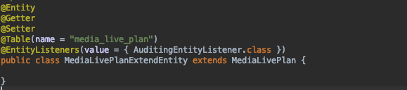
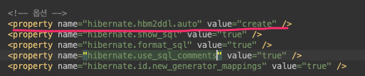
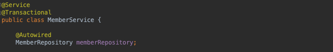
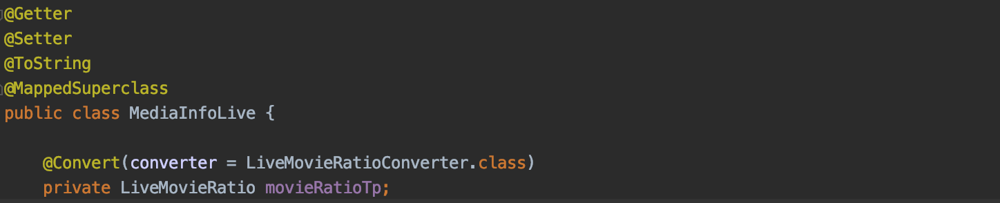
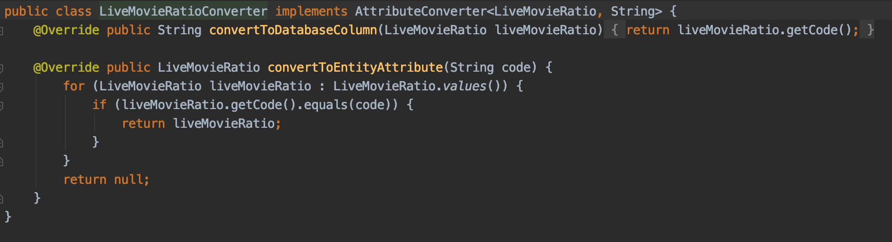
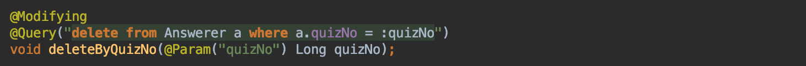
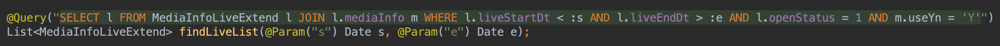
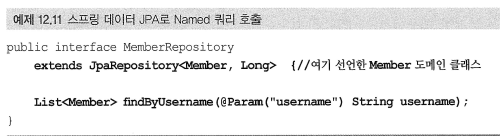
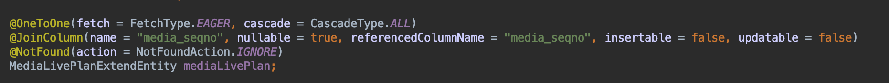
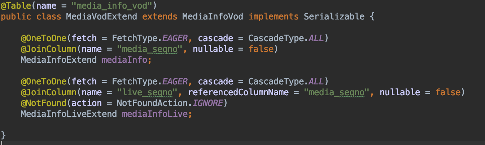

This is a set of notes where I jotted down things I personally didn't know and briefly organized what I learned along the way.
If you know the answer to any of the unanswered questions, please leave a comment. Thank you.

# Full Q&A List

## [Answered]

## 1. What is @EntityListeners?

It is an annotation that lets you request custom callbacks before and after an entity is applied to the DB.

References
* [http://clearpal7.blogspot.com/2017/03/entitylisteners.html](http://clearpal7.blogspot.com/2017/03/entitylisteners.html)

## 2. @PostLoad

The @PostLoad annotation sets the method to be called after an entity is loaded.

References
* [https://docs.jboss.org/hibernate/orm/4.0/hem/en-US/html/listeners.html](https://docs.jboss.org/hibernate/orm/4.0/hem/en-US/html/listeners.html)
* [https://docs.jboss.org/hibernate/orm/4.0/hem/en-US/html/listeners.html](https://docs.jboss.org/hibernate/orm/4.0/hem/en-US/html/listeners.html)

## 3. How do I change the settings to generate the schema automatically?

In the persistence.xml file, add the hiberate.hbm2ddl.auto property to the hibernate settings as shown below.
* value
    * create : drops the tables and recreates them every time it runs
    * update : creates the table if it does not exist

## 4. In JPA, when you modify an object, an UPDATE SQL statement including all field values is generated by default. How do I configure it to update only the modified attributes?

When there are too many fields to save, you can generate an UPDATE SQL statement that includes only the modified data by declaring the @DynamicUpdate annotation on the class.

In addition, @DynamicInsert is used to generate an INSERT SQL statement that includes only the fields whose values exist (non-null).

## 5. @Transactional

It is an annotation that, when declared on a class or method, starts a transaction when the class's method is called from outside and commits the transaction when the method finishes executing.

@Transactional rolls back only for Unchecked Exceptions (e.g., subclasses of RuntimeException). To apply rollback to Checked Exceptions as well, you must specify the rollback directly, like @Transactional(rollbackFor = Exception.class).

The @Transactional annotation is usually used in the service layer that contains business logic. When you use this annotation while writing unit tests, it starts a transaction each time a test runs and forcibly rolls back the transaction when the test finishes.

References
* Checked Exception vs Unchecked(Runtime) Exception
    * [http://www.nextree.co.kr/p3239/](http://www.nextree.co.kr/p3239/)

## 6. What is @Convert?

In JPA, you can use a converter to transform an entity's data before saving it to the DB, and also transform the value through the converter when retrieving the saved data.

In the example below, the @Convert annotation is applied to the movieRatioTp field of the MediaInfoLive entity so that the LiveMovieRatioConvertor class runs right before it is saved to the DB. It can be applied not only at the field level but also at the class level or globally.

* convertToDatabaseColumn() : needs a bit more writing
* convertToEntityAttributes() : needs a bit more writing

## 7. Sometimes findOne doesn't seem to get called. Why is that?

As you move from Spring Boot 1.5.x to 2.0.x, JPA's `findOne()` call must be made using the `findById()` or `getOne()` methods.

References

- [https://hspmuse.tistory.com/entry/springboot-15x-%EC%97%90%EC%84%9C-springboot-20x-%EB%84%98%EC%96%B4%EA%B0%80%EB%A9%B4%EC%84%9C-%EC%83%9D%EA%B8%B4%EC%9D%BC](https://hspmuse.tistory.com/entry/springboot-15x-에서-springboot-20x-넘어가면서-생긴일)
- https://stackoverflow.com/questions/49316751/spring-data-jpa-findone-change-to-optional-how-to-use-this/49317013

- - - -

## [Unanswered Questions]

### -  What is @Modifying?
- For DML (delete, update), you must add the @Modifying annotation. Otherwise, a Not Supported for DML operation error occurs

* [https://winmargo.tistory.com/208](https://winmargo.tistory.com/208)
* [https://www.baeldung.com/spring-data-jpa-modifying-annotation](https://www.baeldung.com/spring-data-jpa-modifying-annotation)

### -  What is @Param?

- Is it an annotation used to bind name-based parameters?

### -  To map the association of objects, you have to manage both directions on the object side… why is that?
- A bidirectional association of objects requires establishing the relationship on both sides—why is that?
- Convenience methods for associations…

### -  When do you use @NotFound(action = NotFoundAction.IGNORE)?

References

* [http://javafreakers.com/notfoundactionnotfoundaction-ignore-annotation-example/](http://javafreakers.com/notfoundactionnotfoundaction-ignore-annotation-example/)
* [https://lyb1495.tistory.com/91](https://lyb1495.tistory.com/91)

### - When do you use referencedColumnName?

It is used in non-identifying associations. In the example below, it was added to join on media_seqno instead of live_seqno(PK) in the media_info_live table.

References

- [https://larva.tistory.com/entry/JPA%EC%97%90%EC%84%9C-ManyToOne-%EA%B4%80%EA%B3%84%EC%97%90%EC%84%9C-%EB%B9%84%EC%8B%9D%EB%B3%84%EC%BB%AC%EB%9F%BC%EA%B3%BC-%EA%B4%80%EA%B3%84%EC%8B%9C-%EB%A7%B5%ED%95%91](https://larva.tistory.com/entry/JPA에서-ManyToOne-관계에서-비식별컬럼과-관계시-맵핑)
