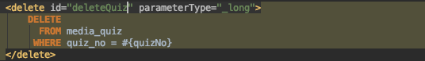
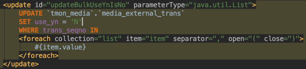
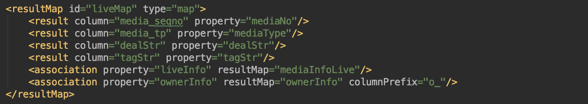
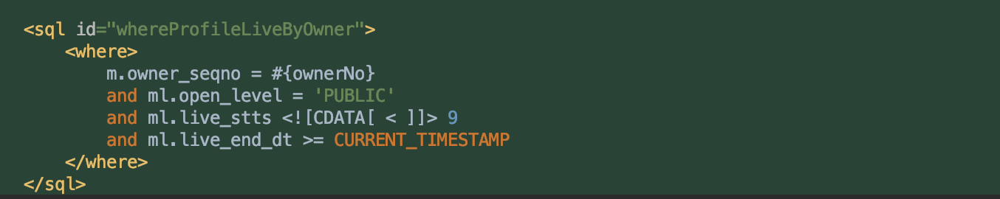

This is a personal note where I jot down the things I don't know and briefly summarize what I learn along the way.
If you happen to know the answer to any of the unanswered questions, please leave a comment. Thank you.

# Full Q&A List


## <span style="color:orange">[Answered]</span>

## <span style="color:brown">1. What is the \_long type?</span>


- \_long : maps to the long type
- long : maps to the Long type


Reference
* [http://www.mybatis.org/mybatis-3/ko/configuration.html](http://www.mybatis.org/mybatis-3/ko/configuration.html)

## <span style="color:brown">2. How do you pass a list to handle IN (…)?</span>

You can generate the (…) values for IN using the <foreach> tag.



Reference

* [http://pcdate.blogspot.com/2013/05/mybatis-foreach.html](http://pcdate.blogspot.com/2013/05/mybatis-foreach.html)


## <span style="color:brown">3. The issue where mapping fails when using nested association columnPrefix?</span>

When mapping an association with a nested columnPrefix, the prefix is appended cumulatively, so you have to write it in the form `v_r_file_nm`.

**MyBatis Mapper file**

```xml
<resultMap id="vodCollectionInfo" type="domain.entity.VodCollection" >
  <result column="vod_collection_seqno" property="vodCollectionNo"/>
  <result column="collection_title" property="collectionTitle"/>
  <association property="vodInfo" resultMap="vodInfo" columnPrefix="v_"/>
</resultMap>

<resultMap id="vodInfo" type="domain.entity.MediaVod" >
  <result column="vod_seqno" property="vodNo"/>
  <result column="vod_title" property="vodTitle"/>
  <association property="resourceInfo" resultMap="mediaResource" columnPrefix="r_"/>
</resultMap>

<resultMap id="mediaResourceMap" type="domain.entity.resource.MediaResource">
  <result column="resource_seqno" property="resourceSeqno"/>
  <result column="file_nm" property="fileName"/>
  <result column="file_size" property="fileSize" javaType="Integer"/>
</resultMap>
```

```xml
<select id="selectAllVodsByVodCollectionWithPaging" parameterType="domain.dto.VodCollectionPageMeta" resultMap="Common.vodCollectionInfo">
        SELECT vc.vod_collection_seqno,
               vc.collection_title,
               v.vod_seqno AS v_vod_seqno,
               v.vod_title AS v_vod_title,
               rv.original_file_nm AS v_r_original_file_nm,
               rv.file_nm AS v_r_file_nm,
               rv.width AS v_r_width,
               rv.height AS v_r_height
        FROM media_vod_collection AS vc
                 INNER JOIN media_vod_collection_mapping AS vcm
                            ON vcm.vod_collection_seqno = vc.vod_collection_seqno
                 INNER JOIN media_vod AS v
                            ON v.vod_seqno = vcm.vod_seqno
                 LEFT JOIN media_resource AS rv
                           ON rv.resource_seqno = v.resource_seqno
        WHERE vc.vod_collection_seqno = #{vodCollectionNo}
    </select>
```


Reference

- https://androphil.tistory.com/733?category=423961

----

## <span style="color:orange">[Unanswered Questions]</span>

### - Can you write unit tests in MyBatis using the @Transactional annotation?
- It doesn't work well

Reference
* [http://barunmo.blogspot.com/2013/06/mybatis.html](http://barunmo.blogspot.com/2013/06/mybatis.html)
* [https://otamot.com/64](https://otamot.com/64)
* [https://wedul.site/133](https://wedul.site/133)
* [https://examples.javacodegeeks.com/enterprise-java/spring/write-transactional-unit-tests-spring/](https://examples.javacodegeeks.com/enterprise-java/spring/write-transactional-unit-tests-spring/)
* [https://mycup.tistory.com/185](https://mycup.tistory.com/185)

### - What is the association attribute in MyBatis?
- It's used when a resultMap contains another object, and association handles a "has one" type relationship.
- For a collection, it's used when handling a "has many" type relationship.
  

Reference
* [http://noveloper.github.io/blog/spring/2015/05/31/mybatis-assocation-collection.html](http://noveloper.github.io/blog/spring/2015/05/31/mybatis-assocation-collection.html)

### - Does MyBatis support aliases for namespaces?
- No

Reference
* [https://github.com/mybatis/mybatis-3/issues/1160](https://github.com/mybatis/mybatis-3/issues/1160)

### - I often see cdata in MyBatis. Why is it used?



Reference

* [https://epthffh.tistory.com/entry/Mybatis-%EC%97%90%EC%84%9C-CDATA-%EC%82%AC%EC%9A%A9%ED%95%98%EA%B8%B0](https://epthffh.tistory.com/entry/Mybatis-%EC%97%90%EC%84%9C-CDATA-%EC%82%AC%EC%9A%A9%ED%95%98%EA%B8%B0)
