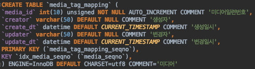
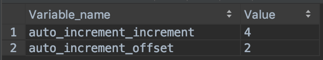
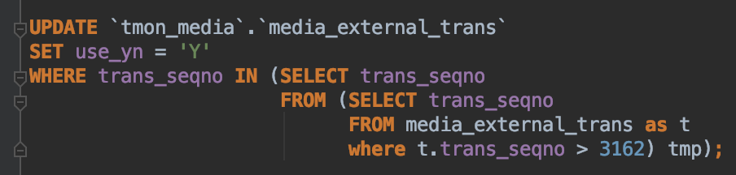
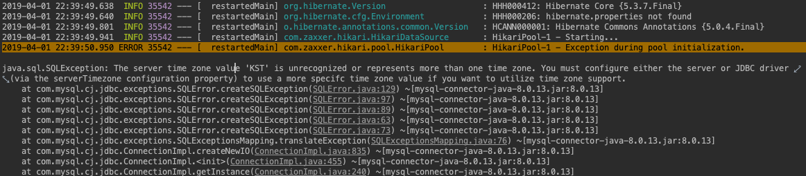
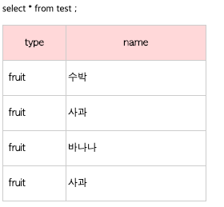
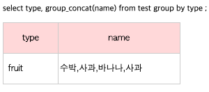

This is a personal note where I jot down the things I don't know and briefly summarize what I learn along the way.
If you happen to know the answer to any of the unanswered questions, please leave a comment. Thank you.

# Full Q&A List

## <span style="color:orange">[Answered]</span>

## <span style="color:brown">1. Why do you need to set InnoDB when creating a table?</span>



MySQL has several storage engines. The most commonly used ones are MyISAM and InnoDB. You can choose which engine to use when creating a table.


Reference
* MyISAM vs. InnoDB
    * [https://ojava.tistory.com/25](https://ojava.tistory.com/25)

## <span style="color:brown">2. Why does auto_increment jump by 4 instead of increasing by 1?</span>

By default it increases by 1, but if you set the auto_increment_increment value differently, it will increase by the specified amount.

```sql
mysql> show variables like 'auto_inc%’;
```



Reference
* [https://dba.stackexchange.com/questions/60295/why-does-auto-increment-jumps-by-more-than-the-number-of-rows-inserted](https://dba.stackexchange.com/questions/60295/why-does-auto-increment-jumps-by-more-than-the-number-of-rows-inserted)
* [https://stackoverflow.com/questions/206751/mysql-autoincrement-column-jumps-by-10-why](https://stackoverflow.com/questions/206751/mysql-autoincrement-column-jumps-by-10-why)

## <span style="color:brown">3. I sometimes find '@variable := …’ in SQL statements. What does it mean? </span>


It's used to store a user-defined variable. In this case, the media_no value obtained by the SELECT is stored in the mediaNo variable.

Reference
* [http://www.mysqlkorea.com/sub.html?mcode=manual&scode=01&m_no=21582&cat1=9&cat2=292&cat3=0&lang=k](http://www.mysqlkorea.com/sub.html?mcode=manual&amp;scode=01&amp;m_no=21582&amp;cat1=9&amp;cat2=292&amp;cat3=0&amp;lang=k)
* [https://crazyj.tistory.com/m/110?category=802841](https://crazyj.tistory.com/m/110?category=802841)

## <span style="color:brown">4. What is the difference between COUNT(*) vs COUNT(1) vs COUNT(pk)? </span>

* COUNT(*)
    * Counts the number of rows
    * Counts NULLs as well
* COUNT(1)
    * Counts the number of rows, but only queries against a single table and cannot query a JOINed table
    * Some argue against using it
* COUNT(pk)
    * Counts only non-NULL values

Reference
* [https://stackoverflow.com/questions/2710621/count-vs-count1-vs-countpk-which-is-better](https://stackoverflow.com/questions/2710621/count-vs-count1-vs-countpk-which-is-better)

## <span style="color:brown">5. The IFNULL() function?</span>

In the form IFNULL(expression, alt_value), it returns alt_value if expression is NULL.


Reference
* [https://www.w3schools.com/sql/func_mysql_ifnull.asp](https://www.w3schools.com/sql/func_mysql_ifnull.asp)

## <span style="color:brown">6. What does 'order by 2,1’ mean for sorting? <span>

It means sort by the second column, and when there are duplicate values, sort by the first column.

Reference

* [http://www.itmembers.net/board/view.php?id=oracle&page=2&sn1=&divpage=1&sn=off&ss=on&sc=on&select_arrange=headnum&desc=asc&no=29](http://www.itmembers.net/board/view.php?id=oracle&amp;page=2&amp;sn1=&amp;divpage=1&amp;sn=off&amp;ss=on&amp;sc=on&amp;select_arrange=headnum&amp;desc=asc&amp;no=29)

## <span style="color:brown">6. When MySQL Error 1093 : You can’t specify target table ..for update in FROM clause occurs, how do you handle it? </span>

The following SQL raised an error when executed.

```sql
UPDATE ` tmon_media ` . ` media_external_trans `
SET use_yn = 'Y'
WHERE trans_seqno IN (SELECT trans_seqno FROM media_external_trans as t where t.trans_seqno > 3162);

```

The cause is that, unlike Oracle, MySQL has an issue where it can't directly use a table's own data during an UPDATE or DELETE, so you can solve it by creating one more sub-query to build a temporary table.

Solution



Reference

* [https://www.lesstif.com/display/DBMS/MySQL+Error+1093+%3A+You+can%27t+specify+target+table+%27cwd_group%27+for+update+in+FROM+clause](https://www.lesstif.com/display/DBMS/MySQL+Error+1093+%3A+You+can%27t+specify+target+table+%27cwd_group%27+for+update+in+FROM+clause)

## <span style="color:brown">8. How do you log all queries in MySQL?</span>

You can do it by enabling general_log in the MySQL configuration.

```sql
mysql> set global general_log=ON;
mysql> show variables like ‘general%’;
```

Reference
* [https://skibis.tistory.com/75](https://skibis.tistory.com/75)

## <span style="color:brown">8. Is there a way to check queries in MySQL when general_log is not enabled? </span>

You can check them if MySQL saves all statements to the bin log when it runs. For details on bin log analysis, please refer to the link below.

Reference
* [http://www.enjoyteam.net/?p=128](http://www.enjoyteam.net/?p=128)
* [http://www.mysqlkorea.com/sub.html?mcode=manual&scode=01_1&m_no=22368&cat1=752&cat2=799&cat3=927&lang=k](http://www.mysqlkorea.com/sub.html?mcode=manual&amp;scode=01_1&amp;m_no=22368&amp;cat1=752&amp;cat2=799&amp;cat3=927&amp;lang=k)
* [http://blog.naver.com/PostView.nhn?blogId=ncloud24&logNo=221055112009&parentCategoryNo=&categoryNo=79&viewDate=&isShowPopularPosts=false&from=postView](http://blog.naver.com/PostView.nhn?blogId=ncloud24&amp;logNo=221055112009&amp;parentCategoryNo=&amp;categoryNo=79&amp;viewDate=&amp;isShowPopularPosts=false&amp;from=postView)

## <span style="color:brown">9. What is a Slow Query?</span>

A slow query, as the name suggests, refers to a query that takes a long time to execute.

Reference

* [https://itstudyblog.tistory.com/384](https://itstudyblog.tistory.com/384)

## <span style="color:brown">10. How are offset and limit used in paging?</span>

Since you can't fetch a large amount of data all at once, you use LIMIT and OFFSET to fetch data partially through paging.

* LIMIT : the number of rows to fetch
* OFFSET : the starting number that determines from which position among the retrieved rows to begin fetching

Reference
* [https://needjarvis.tistory.com/259](https://needjarvis.tistory.com/259)
* [http://avilos.codes/database/mysql/mysql-pagination/](http://avilos.codes/database/mysql/mysql-pagination/)

## <span style="color:brown">11. What's the solution when the error message "Server time zone value ‘KST’ is unrecognized…" appears?</span>

The solution likely differs depending on the situation. In our case, we solved it by changing the version of mysql-connector-java in pom.xml (e.g. 8.0.13 —> 5.1.47).



Reference
* [https://offbyone.tistory.com/318](https://offbyone.tistory.com/318)

## <span style="color:brown">12. What is the difference between ON and WHERE in a JOIN?</span>

For an inner join, the ON clause produces the same result as using the WHERE clause, so you only need to use ON for an outer join.

Reference

- https://eddyplusit.tistory.com/52
- https://blog.leocat.kr/notes/2017/07/28/sql-join-on-vs-where

## <span style="color:brown">13. How do you print the value assigned to a variable?</span>

You can use `SELECT @variable`.

```sql
SET @col = "c1";
SELECT @col;
```

Reference
* [https://stackoverflow.com/questions/40905427/how-to-print-the-string-variable-in-mysql](https://stackoverflow.com/questions/40905427/how-to-print-the-string-variable-in-mysql)

- - - -

## <span style="color:orange">[Unanswered Questions]</span>

### - When you want to copy the values of a row but change only a few column values?

Reference
* [https://stackoverflow.com/questions/2783150/mysql-how-to-copy-rows-but-change-a-few-fields](https://stackoverflow.com/questions/2783150/mysql-how-to-copy-rows-but-change-a-few-fields)


### -  How do you migrate data? For example, how do you split data that exists in one table?


### - How do you copy a table?


### - What is group_concat?





Reference

* [https://fruitdev.tistory.com/16](https://fruitdev.tistory.com/16)
