# 1. Introduction

After moving to a new job, I ended up revisiting database books that I had hardly looked at since my undergraduate days. The book I referenced most while studying databases recently was [Introduction to Databases](http://www.yes24.com/24/goods/9194489?scode=029) **by Professor Kim Yeon-hee**. It was a book that helped me review the basic concepts of relational databases as a whole. If you need a review of relational databases, I recommend buying and reading this book.

In this post, let's go through **the relational database design process, all the way to writing the MySQL script that actually creates the tables**. For the tools and source used during the design, please refer to the following.

- Tools
    - draw.io : ERD diagrams
    - mysql benchwork : EER diagrams and physical schema design
        - intellij Database Tool
- Database : mysql 5.6.42
- Source files : [github](https://github.com/kenshin579/tutorials-database/tree/master/03_eer_model)

The initial design process plays an important role in a database. If it's designed incorrectly, there are aspects where the structure currently in use is hard to change later, and problems can arise where the consistency and integrity of the data are not maintained, so you must create a good database through the design process.

There are mainly **two methods used to design a relational database**.

- Design using the E-R model and relation transformation rules
- Design using normalization (let's cover this topic in the next post)
    - It's the work of decomposing into better, "smaller" relations while removing anomalies (e.g. problems that occur during insertion, deletion, and modification) and minimizing redundancy.

Design using the E-R model and relation transformation rules creates a database through the following steps.

1. Analysis of data requirements (result: requirements specification)
2. Conceptual schema design (result: ERD)
3. Logical schema design (result: table specification of the relation schema)
4. Internal schema design (result: SQL statements that create the DB schema)

# 2. Analyzing Requirements

You need to collect and analyze the user's requirements for the database and write a requirements specification as below. The example below is an exercise problem listed in the Introduction to Databases book.

- To sign up as a member of Hanbit Airlines, you must enter a member ID, password, name, and credit card information
- A member's credit card information can store multiple cards; in detail, you can store the credit card number and expiration date
- Hanbit Airlines stores the airplane number, departure date, and departure time for the airplanes it owns
- Hanbit Airlines stores the seat number and class information for seats
- A member reserves a seat; one member can reserve only one seat, and one seat can be reserved by only one member
- A seat exists in an airplane; one airplane can have multiple seats, and one seat must exist in exactly one airplane.
- And a seat is meaningless without an airplane.

# 3. Creating an E-R Diagram Through Conceptual Design

From the requirements specification you wrote, extract the entities, attributes, and relationships between entities needed to build the database, and create the ERD.

- Extract entities and attributes
    - Mostly select nouns
- Extract relationships between entities
    - Mostly select verbs (they should be verbs representing relationships between entities)
    - There can also be attributes belonging to the relationship
    - 1:1, 1:N, N:M
    - Mandatory participation, optional participation

## 3.1 Extracting Entities and Attributes

In the conceptual design stage, the first thing to do is to extract the entities. An entity is an object in reality or a concept that people think of. There are attributes that represent an entity, and when several related attributes gather to form a single unit of information, that becomes an entity. In the requirements, entities mostly consist of nouns, but they need to be distinguished from attributes. Let's distinguish entities and attributes in the airline specification.


In the airline requirements, entities and attributes can be distinguished as below.

| Entity      | Attributes                              |
| ----------- | --------------------------------------- |
| Member      | member ID, password, name, credit card  |
| Credit Card | credit card number, expiration date     |
| Airplane    | airplane number, departure date, departure time |
| Seat        | seat number, class                      |

## 3.2 Extracting Relationships Between Entities

Once entities and attributes are distinguished, extract the relationships between entities. Relationships between entities are also defined by classifying them in various ways.

- One-to-one (1:1), one-to-many (1:N), many-to-many (N:M)
- Relationship : optional relationship, mandatory relationship

In the requirements, relationships between entities are described with verbs, so you can start by finding the verbs. The parts marked in red represent the relationships between the entities extracted earlier.


Personally, it wasn't easy to figure out whether a relationship is mandatory or optional, so I organized it a bit more.

- Mandatory participation in the relationship (Total Participation)
    - In an **[A : B]** relationship, **every entity in entity set B participates in the [A : B] relationship**
    - It is considered a mandatory relationship when **an entity satisfying the entity condition must always exist** for entity A.
- Optional participation in the relationship (Partial Participation)
    - In an **[A : B]** relationship, **only some entities in entity set B participate in the [A : B] relationship**
    - It is considered an optional relationship when, for entity A, **an entity satisfying the entity condition may or may not exist**.
- Collection of examples
    - **Example 1. [Department : Professor]**
        - Department (mandatory): multiple professors belong to one department
        - Professor (mandatory): one professor belongs to only one department
    - **Example 2. [Member : Order]**
        - Member (optional): one member can place multiple orders
        - Order (mandatory): one order is placed by one member
    - **Example 3. [Professor : Course]**
        - Professor (optional): one professor can teach multiple courses
        - Course (mandatory): one course must be taught by one professor
    - **Example 4: [Order : Order Item]**
        - Order (mandatory): one order contains multiple order items
        - Order Item (mandatory): one order item is contained in a single order
    - **Example 5 : [Customer : Book] - purchase relationship**
        - Customer (mandatory): every customer must purchase a book
        - Book (optional): there can be books that no customer has purchased.

**Result of Extracting Relationships Between Entities**

| Relationship | Entities participating in the relationship                                         | Relationship Type | Relationship Attributes                                         |
| ---- | ------------------------------------------------------------ | -------- | ------------------------------------------------- |
| Holds | Member (optional) : one member can have multiple credit cards<br/>Credit Card (mandatory) : one credit card is held by one member | 1:N      |                                                   |
| Reserves | ~~Member (optional) : one member can reserve only one seat<br/>Seat (mandatory) : one seat is reserved by one member<br />~~Member (optional): one member can reserve multiple airplanes<br/>Airplane (mandatory): one airplane seat is reserved by one member | 1:N      | None in the requirements<br/>e.g. reservation number<br/>reservation date |
| Exists | Airplane (mandatory) : one airplane has multiple seats<br/>Seat (mandatory) : one seat must exist in exactly one airplane | 1:N      | A seat cannot exist without an airplane           |

## 3.3 Creating an ERD From the Analyzed Content

As long as the entities and relationships are well organized, you can easily create an ERD. You could also generate the relation schema directly from the extracted content, but organizing it again into a diagram has the advantage of letting you understand the whole model more easily while looking at the big picture. There are many tools for creating ERDs, but I used draw.io to create the ERD. draw.io is an open-source program that you can use by downloading the application, or use in a web browser without installing the program.

If you want to use it on a Mac, install it with the brew command.

```bash
$ brew cask install drawio
```

draw.io uses the IE (Information Engineering) notation. For the IE notation, please refer to the [link](http://www.devtimes.com/115).

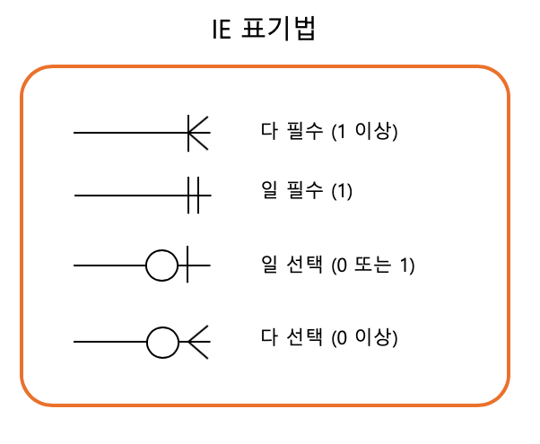

This is the ERD diagram drawn based on the entity and relationship extraction information mentioned so far. It was modified several times while going through the #4. Logical Design stage, and the one below is the final version. The revision history is recorded in 6. ERD Diagram Revision History.

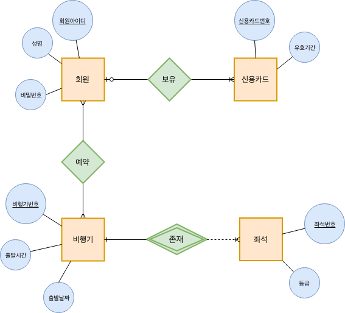

# 4. Creating the Relation Schema and Table Specification Through Logical Design

To create a relation schema from an ERD, you convert it to a relation schema according to the following five relation transformation rules.

- Rule 1 : Every entity is converted to a relation
- Rule 2 : An N:M relationship is converted to a relation
    - **Use the relationship's name as the relation name, and convert the relationship's attributes to attributes of the relation**
- Rule 3 : A 1:N relationship is expressed with a foreign key
    - **Rule 3-1: A general 1:N relationship is expressed with a foreign key**
    - Rule 3-2: A 1:N relationship in which a weak entity participates is included as a foreign key and designated as a primary key
- Rule 4 : A 1:1 relationship is expressed with a foreign key
    - **Rule 4-1: A general 1:1 relationship exchanges foreign keys with each other**
    - Rule 4-2: Only the relation of the entity that mandatorily participates in the 1:1 relationship receives the foreign key
    - Rule 4-3: If all entities mandatorily participate in the 1:1 relationship, merge them into a single relation
- Rule 5 : A multi-valued attribute is converted to an independent relation

Let's create relations one by one according to each rule.

## 4.1 Rule 1 : Every entity is converted to a relation

Rule 1 converts each entity of the ER diagram into a relation. An entity becomes a single table, and the attributes become the table's attributes.

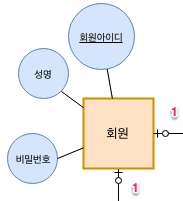

| Member ID | Name        | Password |
| --------- | ----------- | -------- |
| 1         | Lee Jung-su | 1234     |
| 2         | Han Jung-su | 1234!    |
| 3         | Kim Ji-sun  | 12345    |

## 4.2 Rule 2 : An N:M relationship is converted to a relation

Since there is no N:M relationship in the airline ER diagram (there wasn't one at first ;;), let's explain it with the **Member : Order** relationship. In Rule 2, the name of the N:M relationship (e.g. Order) becomes the name of the relation, and the relationship's attributes are also converted to the relation's attributes.

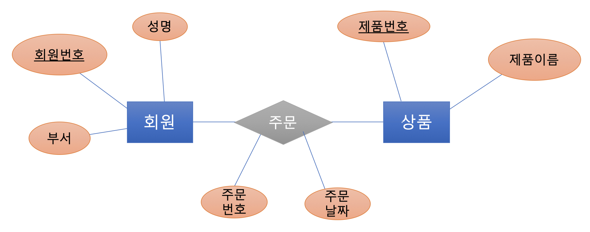

The Member and Product entities are converted into tables according to Rule 1.

Member relation | member number | name | department

Product relation | product number | product name

For the N:M relationship, create an Order relation and include the relationship's attributes in the relation as well. The attribute composition varies slightly depending on what you choose as the primary key.

- Use a separate primary key in the relationship's relation
    - Primary key : order number
    - Foreign keys : member number, product number
- Use the combined primary keys of both entities as the primary key
    - Primary key : member number & product number
    - Foreign keys : member number, product number


Order relation | <u>order number</u> | member number | product number | order date

Order relation | <u>member number</u> | <u>product number</u> | order date

## 4.3 Rule 3 : A 1:N relationship is expressed with a foreign key

### 4.3.1 Rule 3-1 : A general 1:N relationship is expressed with a foreign key

In Rule 3, generally for a 1:N relationship, the primary key of the entity on the "1" side is included in the relation on the "N" side and designated as a foreign key.

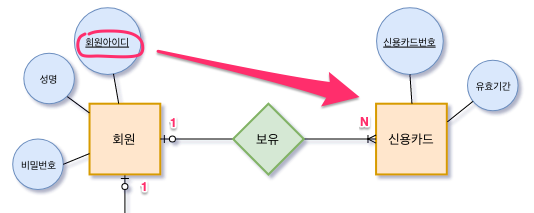

Credit Card relation | <u>credit card number</u> | **member ID (foreign key)** | expiration date

### 4.3.2 Rule 3-2 : A 1:N relationship in which a weak entity participates is included as a foreign key and designated as a primary key

Since Rule 3-2 deals with weak entities, let's look at the difference between weak and strong entities: a strong entity refers to an ordinary entity, and a weak entity refers to an entity that does not exist without another entity.

- Weak Entity
    - An entity that is dependent on the existence of another entity
    - In a weak entity, the attribute that identifies individual entities is called a discriminator or partial key
- Strong Entity
    - An ordinary entity that can exist regardless of the existence of other entities
    - An entity that has a primary key

When a weak entity participates in a 1:N relationship, as in Rule 3-1, you take the primary key of the relation of the "1" side entity, include it in the relation on the "N" side, and designate it as a foreign key. In addition, you must designate the primary key by including the added foreign key.

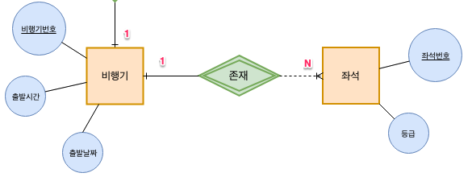

Seat relation | <u>seat number</u> | <u>airplane number (foreign key)</u> | class

## 4.4 Rule 4 : A 1:1 relationship is expressed with a foreign key

**Rule 4-1: A general 1:1 relationship exchanges foreign keys with each other**

A 1:1 relationship exchanges foreign keys with each other. Since there is no 1:1 relationship in the airline relationships, let's explain with a different example. This is an example where each person in a company has their own office. A nice company ^^ One member can use one office. One office can be used by only one member.

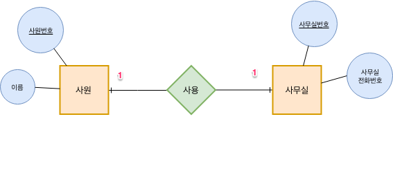

Member relation | <u>employee number</u> | **office number (foreign key)** | name

Office relation | <u>office number</u> | **employee number (foreign key)** | office phone number

In a 1:1 relationship, generally both sides exchange each relation's primary key, but depending on whether the relationship is mandatory or not, you can apply slightly different rules. I didn't include additional examples for these rules, but it would be good to apply the rules below during design and make the best choice.

- Rule 4-2: Only **the relation of the entity that mandatorily participates** in the 1:1 relationship receives the foreign key
- Rule 4-3: If **all entities mandatorily participate** in the 1:1 relationship, **merge them into a single relation**

## 4.5 Rule 5 : A multi-valued attribute is converted to an independent relation

Since a relation cannot have a multi-valued attribute, you must create a separate relation for the multi-valued attribute. The primary key of the separate relation must be composed by taking the primary key of the existing entity together with the multi-valued attribute.

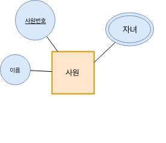

Employee relation | <u>employee number</u> | name

Child relation | <u>employee number (foreign key)</u> | <u>child name</u>

# 5. Physical Schema and Implementation

So far, we've looked at the rules for converting an ERD diagram into tables. Now let's actually create the tables in the database. Personally, I use the [MySQL Workbench](https://www.mysql.com/products/workbench/) program to create the physical schema. After designing the EER model in MySQL Workbench, an error occurred when generating the schema creation script, so I saved it as a script file, manually modified it in IntelliJ, and then created the tables.

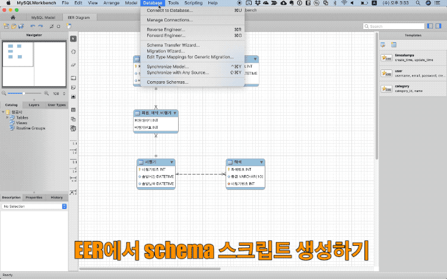

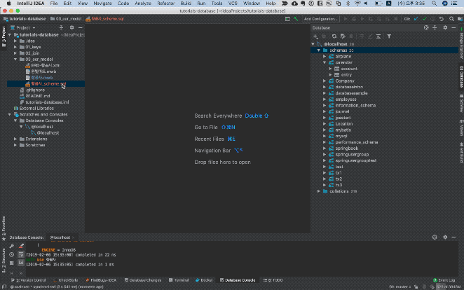

# 6. ERD Diagram Revision History

If you don't fully understand the requirements, you can end up with incorrect results. However, going through each design stage lets you find the incorrect parts along the way, so I left this record as it might be helpful while studying.

| ERD Design                                                                                                                                                   | Issues                                                     |
|----------------------------------------------------------------------------------------------------------------------------------------------------------| ------------------------------------------------------------ |
| Version 1<br />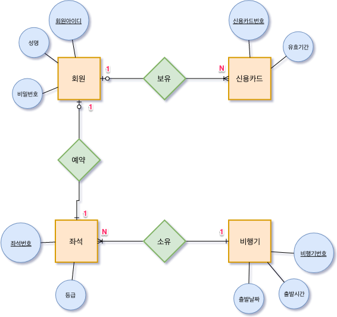                                                                                                               | - When a member makes a reservation, don't they reserve the airplane + seat together?<br/>ㅁ. A seat does not exist without an airplane.<br />Conclusion<br />ㅁ. The seat is a weak entity |
| 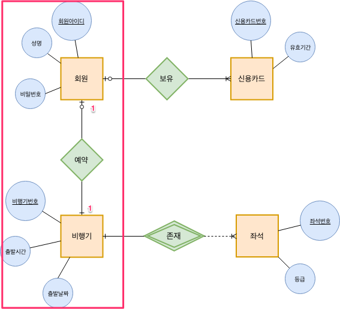<br /><br />Airplane relation: <u>airplane number</u>, **member ID (foreign key),** departure time, departure date<br/>Member relation: <u>member ID</u>, **airplane number (foreign key),** name, password | Realistically, one member can reserve multiple airplanes.<br/>ㅁ. If you add the airplane number to the Member relation, a member can reserve only one airplane<br/>ㅁ. Also, multiple members can reserve a single airplane.<br/>ㅁ. N:N seems correct |

# 7. Conclusion

It had been a while since I studied database design, and it took longer than expected to organize. It's an excuse, but I think it took some time because I used and organized tools I wasn't familiar with. Still, organizing it bit by bit turned out to be a time when I could learn a lot more on my own. In the next database post, let's learn about how to design using normalization.

# 8. References

- Book
    - 
- IE notation
    - [http://www.devtimes.com/115](http://www.devtimes.com/115)
- Mandatory and optional relationships
    - [http://tech.devgear.co.kr/db_kb/331](http://tech.devgear.co.kr/db_kb/331)
    - [http://www.dbguide.net/db.db?cmd=view&boardUid=12851&boardConfigUid=9&categoryUid=216&boardIdx=40&boardStep=1](http://www.dbguide.net/db.db?cmd=view&boardUid=12851&boardConfigUid=9&categoryUid=216&boardIdx=40&boardStep=1)
- Learning Database Design and Construction Through Case Studies
    - [https://view.officeapps.live.com/op/view.aspx?src=http://datamining.dongguk.ac.kr/lectures/2009-1/db/data/BS-example.ppt](https://view.officeapps.live.com/op/view.aspx?src=http://datamining.dongguk.ac.kr/lectures/2009-1/db/data/BS-example.ppt)
