# 1. Basic Concepts of JOIN
In a relational database, to avoid duplicate data, data is split up and stored across multiple tables. To derive a desired result again from this separately stored data, you need to combine several tables. In a relational database, the JOIN operator is the operation that merges rows based on related columns. While studying joins, there are quite a few types, so it can be confusing at first, and I have summarized it again here.

# 2. Sample Data

The data used in this post is a modified version based on the sample data provided on the MySQL site.

* MySQL dummy data
    * [https://github.com/datacharmer/test_db](https://github.com/datacharmer/test_db)
* Modified version - you can also check the SQL examples written for this post
    * [https://github.com/kenshin579/books-database-intro/tree/master/02_join](https://github.com/kenshin579/books-database-intro/tree/master/02_join)

It would be even better to study the various join types by typing the SQL yourself with the given sample data.

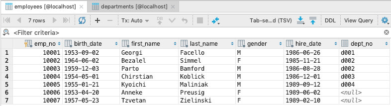

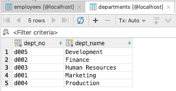

# 3. Types of Joins

These are the join operations supported by MySQL. For the other joins, I'll mainly focus on explanations.

* Inner Join (INNER JOIN)
    * Cross Join (CROSS JOIN - CARTESIAN JOIN)
    * Equi Join (EQUI JOIN)
    * Non-Equi Join (NON-EQUI JOIN)
    * Natural Join (NATURAL JOIN)
* Outer Join (OUTER JOIN)
    * Full Outer Join (FULL OUTER JOIN)
    * Left (LEFT OUTER)
    * Right (RIGHT OUTER)
* Self Join (SELF JOIN)
* Anti Join (ANTI JOIN)
* Semi Join (SEMI JOIN)

Here is a diagram to help you easily understand SQL joins.


## 3.1 Inner Join

If we classify inner joins in more detail, they are as follows.

* Cross Join (CROSS JOIN - CARTESIAN JOIN)
* Equi Join (EQUI JOIN)
* Non-Equi Join (NON-EQUI JOIN)
* Natural Join (NATURAL JOIN)

### 3.1.1 Cross Join (CROSS JOIN - CARTESIAN PRODUCT)

A cross join is the result of the Cartesian product of two tables. It's the result of combining every row of table A with every row of table B without any special condition.

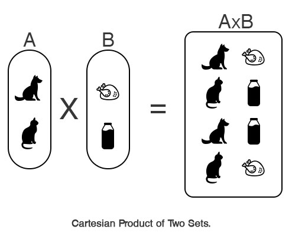

A join SQL statement can be written using two notations. There is the explicit notation with a specific SQL clause, and the implicit notation.

```sql
-- Cross Join (CROSS JOIN)

# explicit notation
SELECT *
FROM employees
CROSS JOIN dept_emp;

# implicit notation
SELECT *
FROM employees, dept_emp;
```

Note that a cross join has no WHERE clause in the implicit notation.

**Join Result**

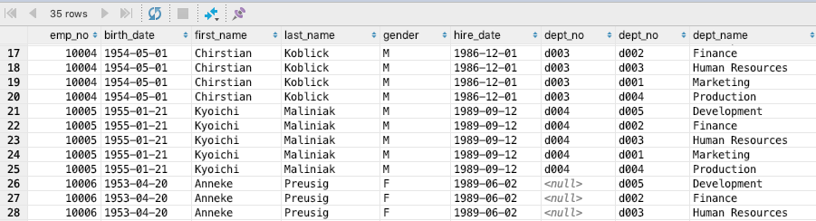

### 3.1.2 Inner Join (INNER JOIN)

An inner join is one of the most commonly used join statements. According to the join condition, an inner join merges the columns of two tables (A, B) to create a new table. In other words, you can think of it as returning the records from the cross join result that satisfy the join condition. If we express an inner join with a Venn diagram, the highlighted part below is the part that satisfies the condition.

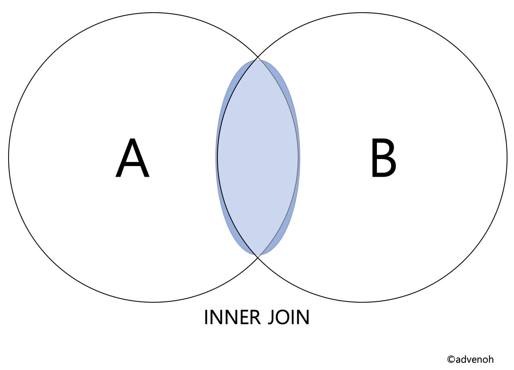

SQL can be specified with two notations: explicit and implicit.

```sql
-- Inner Join (INNER JOIN)

-- explicit notation
SELECT *
FROM employees
INNER JOIN dept_emp
ON employees.emp_no = dept_emp.emp_no;

-- implicit notation
SELECT *
FROM employees, dept_emp
WHERE employees.emp_no = dept_emp.emp_no;
```

**Join Result**

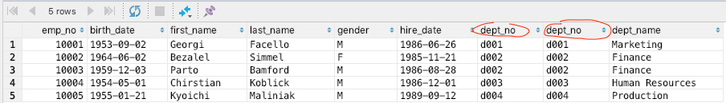

### 3.1.3 Equi Join (EQUI JOIN)

An equi join is a specific type of comparison-based join that uses equality comparison (=). The join already explained in 3.1.2 above is called an equi join (= equality join).

### 3.1.4 Non-Equi Join (NON-EQUI JOIN)

A non-equi join is a join that does not use equality comparison (=); if the condition uses comparisons such as greater than, less than, or not equal, it is called a non-equi join.

```sql
-- Non-Equi Join (NON-EQUI JOIN)

-- implicit notation
SELECT *
FROM employees, departments
WHERE employees.emp_no between 10003 and 10004;
```

**Join Result**

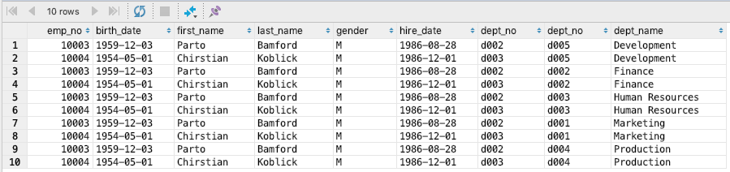

### 3.1.5 Natural Join (NATURAL JOIN)

A natural join is a type of equi join — an inner join where the join condition occurs implicitly based on columns with the same name in the two tables.

* Columns with the same name are extracted only once
    * In an equi join, you can see that emp_no was extracted twice (#3.1.2: Figure 1)

```sql
-- Natural Join (NATURAL JOIN)
-- explicit notation
SELECT *
FROM employees NATURAL JOIN dept_emp;
```

**Join Result**

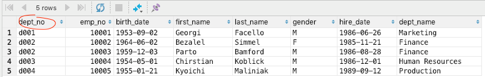

## 3.2 Outer Join (OUTER JOIN)

In the case of an inner join, the result set is generated based on common column names. An outer join, on the other hand, is a join that also displays rows that do not satisfy the condition. So, when you join, it includes rows in the join result even if one side of the table has no matching data. There are three types of outer joins as below, and let's learn about each through examples.

* Outer Join (OUTER JOIN)
    * Left (LEFT OUTER)
    * Right (RIGHT OUTER)
    * Full Outer Join (FULL OUTER JOIN)
        * MySQL does not support this, but you can use the SQL UNION clause

### 3.2.1 Left Outer Join (LEFT OUTER JOIN)

A left outer join is a join that includes all the data of table A and the records of table B that match.

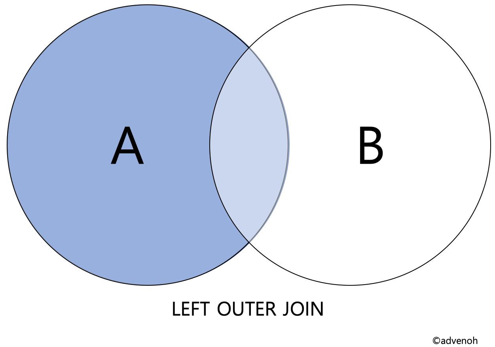

I added a simple example to make it easier to understand.

```sql
SELECT *
FROM table1
LEFT OUTER JOIN table2
ON table1.n = table2.n;
```

**Join Result =** all data of table1 + the data matching on the column (n) of table1 and table2

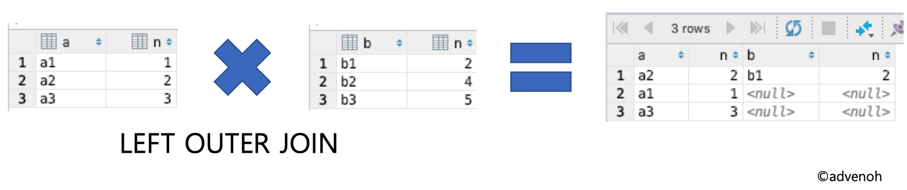

```sql
-- Left Outer Join (LEFT OUTER JOIN)
-- explicit notation
SELECT *
FROM employees
LEFT OUTER JOIN departments
ON employees.dept_no = departments.dept_no;
```

**Join Result**

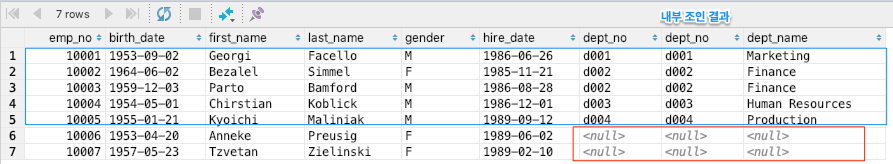

**Inner Join Result**


### 3.2.2 Right Outer Join (RIGHT OUTER JOIN)

A right outer join is a join that includes all the data of table B and the records of table A that match.

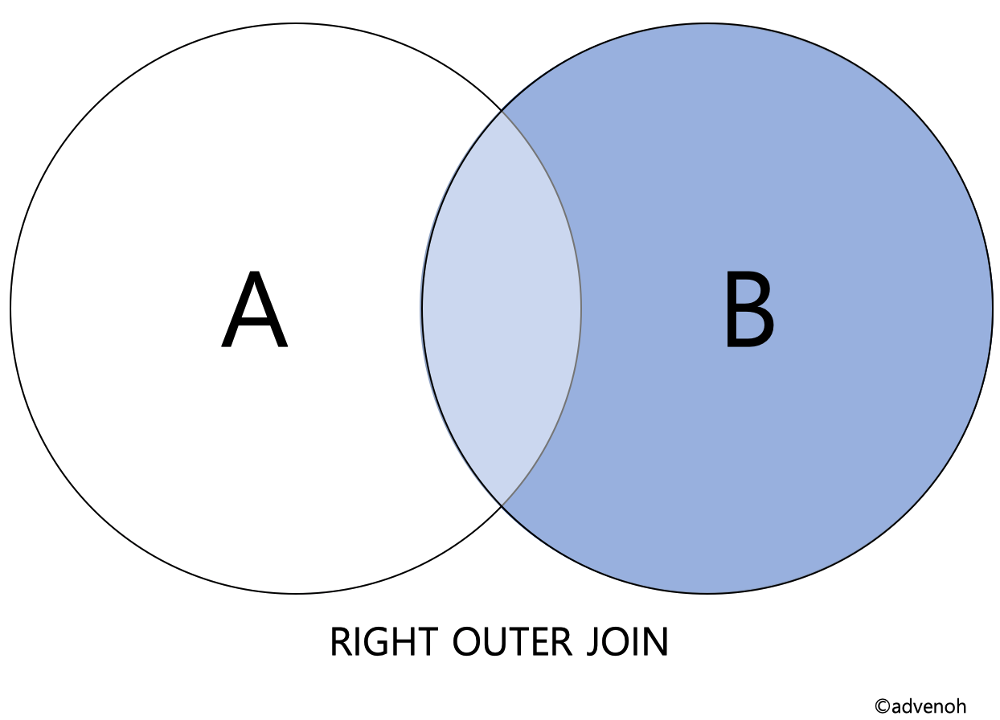

```sql
SELECT *
FROM table1
RIGHT OUTER JOIN table2
ON table1.n = table2.n;
```

**Join Result =** all data of table2 + the data matching on the column (n) of table1 and table2

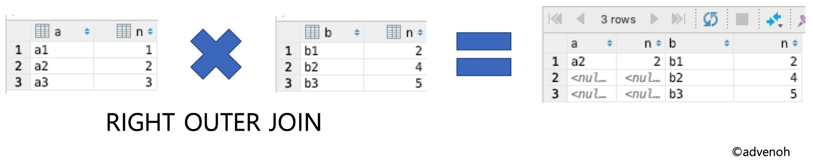

```sql
-- Right Outer Join (RIGHT OUTER JOIN)
-- explicit notation
SELECT *
FROM employees
RIGHT OUTER JOIN departments
ON employees.dept_no = departments.dept_no;
```

**Join Result**

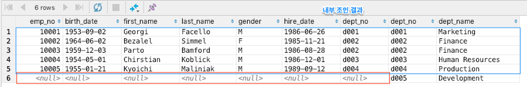

### 3.2.3 Full Outer Join (FULL OUTER JOIN)

MySQL does not support an explicit SQL clause for a full outer join, but you can perform a full outer join using UNION.

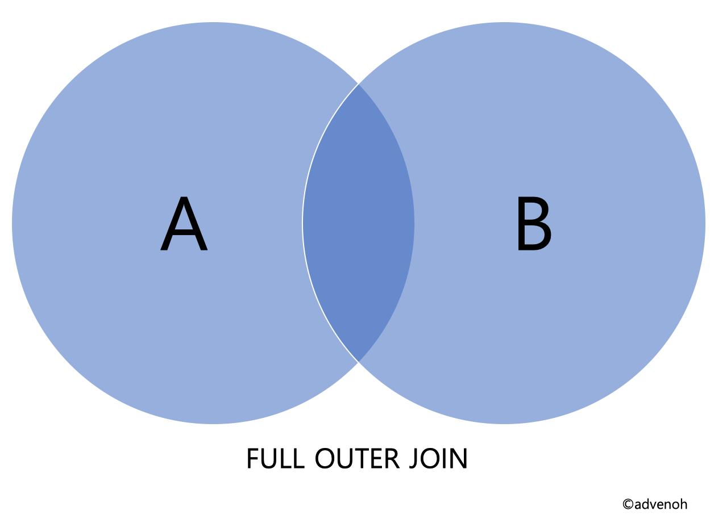

```sql
-- Method 1 : JOIN and UNION
SELECT *
FROM table1
LEFT OUTER JOIN table2
ON table1.n = table2.n
UNION
SELECT *
FROM table1
RIGHT OUTER JOIN table2
ON table1.n = table2.n;

-- Method 2 : UNION ALL and exclusion join
SELECT *
FROM table1
LEFT OUTER JOIN table2
ON table1.n = table2.n
UNION ALL
SELECT *
FROM table1
RIGHT OUTER JOIN table2
ON table1.n = table2.n
WHERE table1.n IS null;
```

**Join Result** - left outer join + right outer join

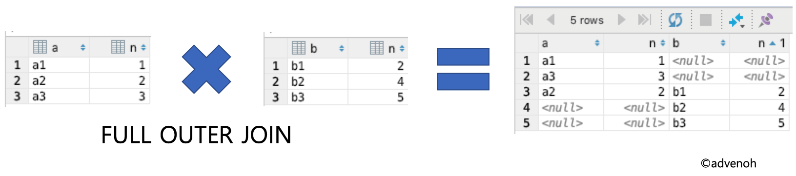

Here is the full outer join statement of the employees and departments tables and its result.

```sql
SELECT *
FROM employees
LEFT OUTER JOIN departments
ON employees.dept_no = departments.dept_no
UNION
SELECT *
FROM employees
RIGHT OUTER JOIN departments
ON employees.dept_no = departments.dept_no;
```

**Join Result**

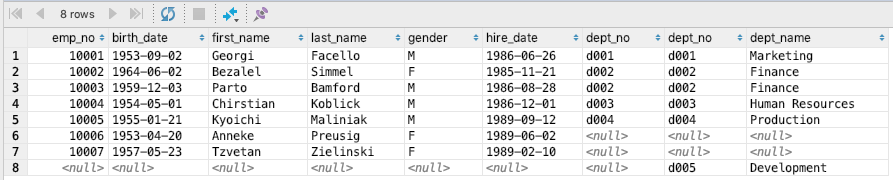

## 3.3 Self Join (SELF JOIN)

A self join is a join that joins a table with itself. For example, if you want to find employees who work in the same department, using a self join is a good choice.

```sql
-- Self Join (SELF JOIN)
-- implicit notation
SELECT A.first_name AS EmployeeName1, B.first_name AS EmployeeName2, A.dept_no
FROM employees AS A, employees AS B
WHERE A.emp_no <> B.emp_no
AND A.dept_no = B.dept_no;
```

**Join Result**

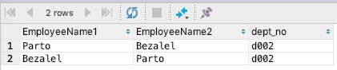

## 3.4 Anti Join (ANTI JOIN)

An anti join is a join that extracts in the main query only the data that does not exist within the subquery. As a simple example, let's extract the employees whose department number (dept_no) is not 2 or greater and whose employee number (emp_no) is 10002 or greater. You can write it using NOT EXISTS or NOT IN.

```sql
-- Anti Join (ANTI JOIN)

SELECT *
FROM employees AS e
WHERE emp_no >= 10002
AND NOT EXISTS(SELECT *
FROM departments AS d
WHERE e.dept_no = d.dept_no
AND d.dept_no >= 2);
```

**Join Result**

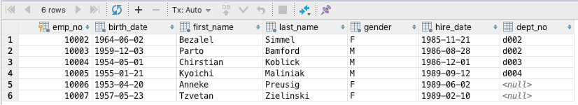


## 3.5 Semi Join (SEMI JOIN)

A semi join, in contrast to an anti join, is a method that extracts in the main query only the data that exists within the subquery.

```sql
-- Semi Join (SEMI JOIN)
-- using EXISTS
SELECT *
FROM departments as d
WHERE EXISTS(SELECT *
FROM employees AS e
WHERE e.dept_no = d.dept_no
AND e.emp_no >= 10003);

-- using IN
SELECT *
FROM departments as d
WHERE d.dept_no IN (SELECT e.dept_no
FROM employees AS e
WHERE e.emp_no >= 10003);
```

**Join Result**

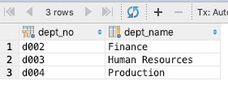

# 4. References

* Types of joins
    * [https://wikidocs.net/3956](https://wikidocs.net/3956)
    * [https://coding-factory.tistory.com/87](https://coding-factory.tistory.com/87)
    * [https://blog.ngelmaum.org/entry/lab-note-sql-join-method](https://blog.ngelmaum.org/entry/lab-note-sql-join-method)
    * [http://postitforhooney.tistory.com/entry/DBMARIADB-SQL-예제를-통한-JOIN의-종류-파악](http://postitforhooney.tistory.com/entry/DBMARIADB-SQL-%EC%98%88%EC%A0%9C%EB%A5%BC-%ED%86%B5%ED%95%9C-JOIN%EC%9D%98-%EC%A2%85%EB%A5%98-%ED%8C%8C%EC%95%85)
    * [http://futurists.tistory.com/17](http://futurists.tistory.com/17)
    * [https://ko.wikipedia.org/wiki/Join_(SQL](https://ko.wikipedia.org/wiki/Join_%28SQL) )
    * [https://coloringpagewiki.com/img/2802678/mysql-whats-the-difference-between-inner-join-left-join-right-also-check-this-post-sql-server-better-performance-left-join-or-not-in.asp](https://coloringpagewiki.com/img/2802678/mysql-whats-the-difference-between-inner-join-left-join-right-also-check-this-post-sql-server-better-performance-left-join-or-not-in.asp)
* FULL JOIN
    * [https://www.xaprb.com/blog/2006/05/26/how-to-write-full-outer-join-in-mysql/](https://www.xaprb.com/blog/2006/05/26/how-to-write-full-outer-join-in-mysql/)
* ANTI JOIN
    * [https://thebook.io/006696/part01/ch06/02/03/](https://thebook.io/006696/part01/ch06/02/03/)
* SEMI JOIN
    * [http://wiki.gurubee.net/pages/viewpage.action?pageId=1966761](http://wiki.gurubee.net/pages/viewpage.action?pageId=1966761)
* Precautions when using joins
    * [http://gywn.net/2012/05/mysql-bad-sql-type/](http://gywn.net/2012/05/mysql-bad-sql-type/)
* Cartesian product

    * [https://www.codewars.com/kata/cartesian-product](https://www.codewars.com/kata/cartesian-product)
