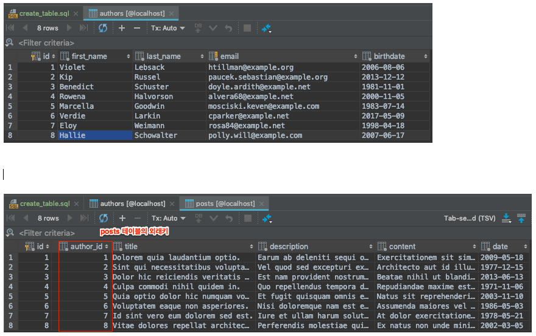

# 1. Types of Keys in a Database

In this post, let's summarize the various types of keys in a database.

To explain the types of keys, let's use the sample data below. The sample data was obtained from the [dummy data](http://filldb.info/) site, which generates it automatically.

## 1.1 Super Key

- A key consisting of a set of attributes that **satisfy the uniqueness property** is called a super key
    - What is uniqueness? - It means **the property of being able to identify any row directly with a single key**
- e.g. the authors table
    - id, (id, first_name), (first_name, last_name), email, etc. become super keys

## 1.2 Candidate Key

- An attribute or set of attributes that **satisfies both uniqueness and minimality**. In other words, among super keys, the ones that satisfy minimality become candidate keys
    - What is minimality? - It consists only of **the attributes strictly necessary to identify a record**
- e.g. the authors table
    - id and email become candidate keys

## 1.3 Primary Key

- A key **specially chosen among the candidate keys**
- A primary key cannot have **NULL values or duplicate values**
- e.g. the authors table \* Among the candidate keys, id can be selected as the primary key. (no duplicate values or NULL values)

## 1.4 Alternate Key

- An alternate key refers to **a candidate key that was not chosen as the primary key**, and is also called a **secondary key**
- e.g. the authors table
    - email becomes the alternate key.

## 1.5 Foreign Key

- It refers to **a key where an attribute in one relation becomes the primary key of another relation**
- The domain of the foreign key attribute and the domain of the referenced primary key attribute must be the same
- A foreign key may reference the same relation
- A foreign key may have NULL values
- e.g. the posts table
    - authors_id becomes the foreign key

# 2. References

- Book
    - 
- Types of keys
    - [https://m.blog.naver.com/dlwjddns5/220620195019](https://m.blog.naver.com/dlwjddns5/220620195019)
    - [http://limkydev.tistory.com/108](http://limkydev.tistory.com/108) \* [https://m.blog.naver.com/PostView.nhn?blogId=slrkanjsepdi&logNo=90118418840&proxyReferer=https%3A%2F%2Fwww.google.co.kr%2F](https://m.blog.naver.com/PostView.nhn?blogId=slrkanjsepdi&logNo=90118418840&proxyReferer=https%3A%2F%2Fwww.google.co.kr%2F)
