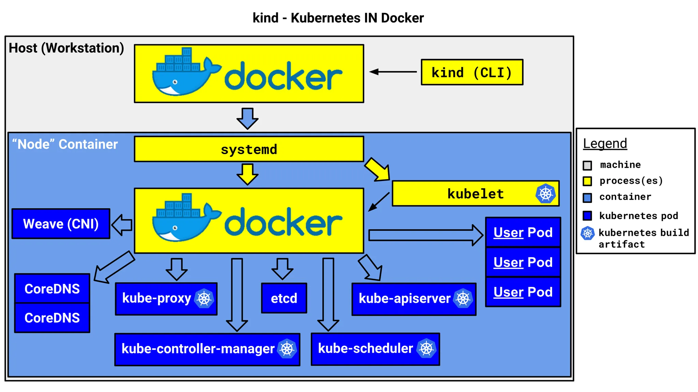

# 1. Overview

## What is Kind?

`Kind` (Kubernetes in Docker) is a tool that helps you run a `Kubernetes` cluster inside Docker containers. It's useful for quickly running and testing a `Kubernetes` cluster in a local environment.

## Kind's Architecture

`Kind` works by running `Kubernetes` nodes as `Docker` containers. The following is the basic architecture of `Kind`.



- Each node runs as a Docker container and drives the core Kubernetes components such as `kubelet`, `kube-proxy`, `etcd`, and `kube-apiserver` internally
- It configures the network using a CNI and provides DNS using CoreDNS
- This approach is well suited for running a lightweight Kubernetes cluster in a local development environment, and is also widely used as a CI/CD testing environment

## Differences from Other Kubernetes Tools

| Item              | `Kind`                             | `Minikube`                               | `Docker Desktop Kubernetes` | `Rancher Desktop`         |
| ----------------- | ---------------------------------- | ---------------------------------------- | --------------------------- | ------------------------- |
| Execution method  | Docker container based             | Virtualization based (supports Docker, VirtualBox, etc.) | Uses Docker's built-in K8s feature | Can choose from multiple K8s distributions |
| Performance       | Lightweight and fast               | Supports various environments, somewhat heavy | Optimized on Mac/Windows | Somewhat heavy            |
| LoadBalancer support | Not supported by default (additional setup needed) | Not supported by default (additional setup needed) | Provided by default | Provided by default |
| Use case          | Development and testing environment | Development and local testing environment | Local development and simple testing | Practicing various K8s environments |
| Installation difficulty | Simple                       | Relatively easy                          | Included by default         | Requires some setup       |

# 2. Setting Up a `Kubernetes` Cluster with `Kind` in a Mac Local Environment

Now let's actually use `Kind` to build a `Kubernetes` cluster, deploy an Echo Server, and access it from outside. Personally, I've set up a `Kubernetes` cluster on a Mac Mini at home and access several applications on a port basis.

# 2.1 Prerequisites and Installing Kind

`Kind` can be run on macOS as well, and you can easily install it using Homebrew.

```bash
> brew install kind
> kind version
kind v0.27.0 go1.24.0 darwin/arm64
```

# 2.2 Creating a Kubernetes Cluster

Create the following Kind configuration file (`kind-config.yaml`) to set up the **ports to access from outside**.

```yaml
kind: Cluster
apiVersion: kind.x-k8s.io/v1alpha4
nodes:
  - role: control-plane
    extraPortMappings:
      - containerPort: 30028
        hostPort: 30028
        protocol: TCP
      - containerPort: 30029
        hostPort: 30029
        protocol: TCP
      - containerPort: 30030
        hostPort: 30030
        protocol: TCP
```


`Docker` is essential when setting up a `Kubernetes` cluster with `Kind`. Now let's create the cluster.

```bash
# Run Docker Desktop
> open /Applications/Docker.app

# Create the cluster
> kind create cluster --config kind-config-nodeport.yaml
Creating cluster "kind" ...
 ✓ Ensuring node image (kindest/node:v1.32.2) 🖼
 ✓ Preparing nodes 📦
 ✓ Writing configuration 📜
 ✓ Starting control-plane 🕹️
 ✓ Installing CNI 🔌
 ✓ Installing StorageClass 💾
Set kubectl context to "kind-kind"
You can now use your cluster with:

kubectl cluster-info --context kind-kind

Have a nice day! 👋
```

Verify that the cluster was created successfully.

```bash
> kc cluster-info --context kind-kind                                                                                                              ✔  1341  10:32:22
Kubernetes control plane is running at <https://127.0.0.1:53837>

To further debug and diagnose cluster problems, use 'kubectl cluster-info dump'.

> kc get nodes                                                                                                                                     ✔  1344  10:44:31
NAME                 STATUS   ROLES           AGE   VERSION
kind-control-plane   Ready    control-plane   12m   v1.32.2
```

# 2.3 Deploying the Echo Server Application

Deploy an Echo Server to the cluster and verify that it can be accessed from outside. Here is the `Kubernetes` YAML file (`echo-server.yaml`) that deploys the Echo Server.

```yaml
apiVersion: apps/v1
kind: Deployment
metadata:
  name: echo-server
spec:
  replicas: 1
  selector:
    matchLabels:
      app: echo-server
  template:
    metadata:
      labels:
        app: echo-server
    spec:
      containers:
      - name: echo-server
        image: ealen/echo-server
        ports:
        - containerPort: 80
---
apiVersion: v1
kind: Service
metadata:
  name: echo-server
spec:
  type: NodePort
  selector:
    app: echo-server
  ports:
    - protocol: TCP
      port: 80
      targetPort: 80
      nodePort: 30028
```

Create the server from the manifest with the `kubectl apply` command.

```bash
> kubectl apply -f echo-server-nodeport.yaml
deployment.apps/echo-server created
service/echo-server created
```

## Accessing the Echo Server from Outside

Verify that the Echo Server was deployed successfully.

```bash
> kubectl get pods
NAME                           READY   STATUS    RESTARTS   AGE
echo-server-65c776974c-fm654   1/1     Running   0          6d5h

> kubectl get svc echo-server
NAME          TYPE        CLUSTER-IP     EXTERNAL-IP   PORT(S)        AGE
echo-server   NodePort    10.96.81.130   <none>        80:30028/TCP   6d5h
kubernetes    ClusterIP   10.96.0.1      <none>        443/TCP        6d5h
```

Let's call the API on the Echo Server with `curl`.

```bash
> curl <http://localhost:30028>
{"host":{"hostname":"localhost","ip":"::ffff:10.244.0.1","ips":[]},"http":{"method":"GET","baseUrl":"","originalUrl":"/","protocol":"http"},"request":{"params":{"0":"/"},"query":{},"cookies":{},"body":{},"headers":{"host":"localhost:30080","user-agent":"curl/8.7.1","accept":"*/*"}},"environment":{"PATH":"/usr/local/sbin:/usr/local/bin:/usr/sbin:/usr/bin:/sbin:/bin","HOSTNAME":"echo-server-65c776974c-fm654","NODE_VERSION":"20.11.0","YARN_VERSION":"1.22.19","KUBERNETES_SERVICE_HOST":"10.96.0.1","KUBERNETES_SERVICE_PORT":"443","KUBERNETES_PORT":"tcp://10.96.0.1:443","KUBERNETES_PORT_443_TCP_PROTO":"tcp","ECHO_SERVER_SERVICE_PORT":"80","ECHO_SERVER_PORT_80_TCP_ADDR":"10.96.81.130","KUBERNETES_PORT_443_TCP":"tcp://10.96.0.1:443","KUBERNETES_PORT_443_TCP_PORT":"443","ECHO_SERVER_PORT":"tcp://10.96.81.130:80","ECHO_SERVER_PORT_80_TCP_PROTO":"tcp","KUBERNETES_PORT_443_TCP_ADDR":"10.96.0.1","ECHO_SERVER_PORT_80_TCP":"tcp://10.96.81.130:80","ECHO_SERVER_PORT_80_TCP_PORT":"80","KUBERNETES_SERVICE_PORT_HTTPS":"443","ECHO_SERVER_SERVICE_HOST":"10.96.81.130","HOME":"/root"}}
```

------

# 3. Conclusion

In this post, we covered how to set up a `Kubernetes` cluster on a Mac using `Kind`, deploy an Echo Server, and access it from outside. Similar to other Kubernetes tools, we were able to confirm that creating a cluster and deploying an application are both very easy.

Now go ahead and test various `Kubernetes` applications using Kind! 🚀

# 4. References

- [Local Kubernetes cluster - installing kind](https://kmaster.tistory.com/26)
- [kind](https://kind.sigs.k8s.io/)
